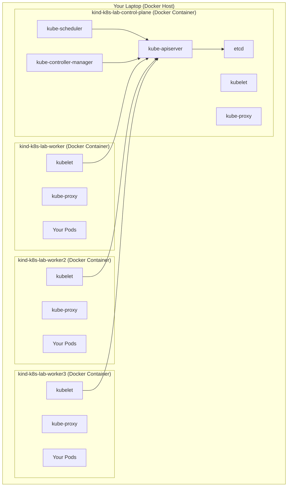
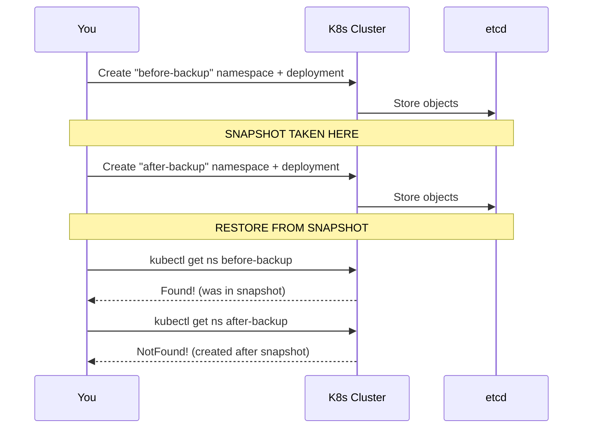

# File 05: Lab — Cluster Setup and Exploration

**Topic:** Hands-on lab with kind cluster setup, control plane exploration, etcd backup/restore, and kubectl power-user exercises
**WHY THIS MATTERS:** Theory without practice is forgettable. This lab gives you muscle memory for the commands and concepts from Files 01-04. You will build a multi-node Kubernetes cluster on your laptop, poke around every control plane component, back up and restore etcd, and master kubectl tricks that will make you faster than your colleagues. Every command is real, every output is verifiable, and every exercise builds on the previous one.

---

## Prerequisites

Before starting, install the following tools:

| Tool | Purpose | Install Command (macOS) | Install Command (Linux) |
|------|---------|------------------------|------------------------|
| **Docker** | Container runtime for kind | `brew install --cask docker` | [docs.docker.com/engine/install](https://docs.docker.com/engine/install/) |
| **kind** | Kubernetes IN Docker — runs K8s clusters in containers | `brew install kind` | `go install sigs.k8s.io/kind@latest` or `curl -Lo ./kind https://kind.sigs.k8s.io/dl/latest/kind-linux-amd64 && chmod +x ./kind && sudo mv ./kind /usr/local/bin/kind` |
| **kubectl** | Kubernetes CLI | `brew install kubectl` | `curl -LO "https://dl.k8s.io/release/$(curl -L -s https://dl.k8s.io/release/stable.txt)/bin/linux/amd64/kubectl" && chmod +x kubectl && sudo mv kubectl /usr/local/bin/` |
| **etcdctl** | etcd CLI (for Exercise 3) | `brew install etcd` | `ETCD_VER=v3.5.12 && curl -L https://github.com/etcd-io/etcd/releases/download/${ETCD_VER}/etcd-${ETCD_VER}-linux-amd64.tar.gz -o /tmp/etcd.tar.gz && tar xzf /tmp/etcd.tar.gz -C /tmp && sudo mv /tmp/etcd-${ETCD_VER}-linux-amd64/etcdctl /usr/local/bin/` |
| **jq** | JSON processor (optional but helpful) | `brew install jq` | `sudo apt-get install jq` |

**Verify installations:**

```bash
# Check Docker is running
docker version --format '{{.Server.Version}}'
# EXPECTED OUTPUT:
# 24.0.7  (or similar)

# Check kind version
kind version
# EXPECTED OUTPUT:
# kind v0.22.0 go1.21.7 darwin/arm64  (or similar)

# Check kubectl version
kubectl version --client --output=yaml | head -5
# EXPECTED OUTPUT:
# clientVersion:
#   major: "1"
#   minor: "30"
#   gitVersion: v1.30.0

# Check etcdctl version
etcdctl version
# EXPECTED OUTPUT:
# etcdctl version: 3.5.12
# API version: 3.5
```

---

## Cluster Setup

### Creating a Multi-Node kind Cluster
**WHY:** A single-node cluster hides the distributed nature of Kubernetes. A multi-node cluster lets you observe scheduling, node affinity, and component distribution.

First, create a kind configuration file:

```yaml
# Save this as: kind-config.yaml
# Multi-node cluster: 1 control plane + 3 workers
kind: Cluster
apiVersion: kind.x-k8s.io/v1alpha4
name: k8s-lab
nodes:
- role: control-plane
  # Expose API server on port 6443
  extraPortMappings:
  - containerPort: 30080
    hostPort: 30080
    protocol: TCP
- role: worker
- role: worker
- role: worker
```

```bash
# Create the cluster
kind create cluster --config kind-config.yaml
# SYNTAX:  kind create cluster [OPTIONS]
# FLAGS:
#   --config <file>       cluster configuration file
#   --name <name>         cluster name (overrides config)
#   --image <image>       node image (e.g., kindest/node:v1.30.0)
#   --wait <duration>     wait for control plane to be ready
# EXPECTED OUTPUT:
# Creating cluster "k8s-lab" ...
#  ✓ Ensuring node image (kindest/node:v1.30.0) 🖼
#  ✓ Preparing nodes 📦 📦 📦 📦
#  ✓ Writing configuration 📜
#  ✓ Starting control-plane 🕹️
#  ✓ Installing CNI 🔌
#  ✓ Installing StorageClass 💾
#  ✓ Joining worker nodes 🚜
# Set kubectl context to "kind-k8s-lab"
# You can now use your cluster with:
# kubectl cluster-info --context kind-k8s-lab
```

```bash
# Verify the cluster is running
kubectl get nodes -o wide
# SYNTAX:  kubectl get nodes [OPTIONS]
# FLAGS:
#   -o wide               show extra columns
# EXPECTED OUTPUT:
# NAME                    STATUS   ROLES           AGE   VERSION   INTERNAL-IP   EXTERNAL-IP   OS-IMAGE                         KERNEL-VERSION    CONTAINER-RUNTIME
# k8s-lab-control-plane   Ready    control-plane   60s   v1.30.0   172.18.0.5    <none>        Debian GNU/Linux 12 (bookworm)   6.5.0-15-generic  containerd://1.7.13
# k8s-lab-worker          Ready    <none>          30s   v1.30.0   172.18.0.2    <none>        Debian GNU/Linux 12 (bookworm)   6.5.0-15-generic  containerd://1.7.13
# k8s-lab-worker2         Ready    <none>          30s   v1.30.0   172.18.0.3    <none>        Debian GNU/Linux 12 (bookworm)   6.5.0-15-generic  containerd://1.7.13
# k8s-lab-worker3         Ready    <none>          30s   v1.30.0   172.18.0.4    <none>        Debian GNU/Linux 12 (bookworm)   6.5.0-15-generic  containerd://1.7.13

# Verify the context is set
kubectl config current-context
# EXPECTED OUTPUT:
# kind-k8s-lab

# Check Docker containers running (kind nodes are Docker containers)
docker ps --format "table {{.Names}}\t{{.Status}}\t{{.Ports}}"
# EXPECTED OUTPUT:
# NAMES                    STATUS         PORTS
# k8s-lab-control-plane    Up 2 minutes   0.0.0.0:30080->30080/tcp, 127.0.0.1:xxxxx->6443/tcp
# k8s-lab-worker           Up 2 minutes
# k8s-lab-worker2          Up 2 minutes
# k8s-lab-worker3          Up 2 minutes
```



---

## Exercise 1 — Verify Cluster Components

### Objective
Confirm that all control plane components are running, understand what each pod does, and verify inter-node communication.

### Step 1: List All Control Plane Pods

```bash
# View all pods in kube-system namespace
kubectl get pods -n kube-system -o wide
# SYNTAX:  kubectl get pods -n <namespace> -o wide
# EXPECTED OUTPUT:
# NAME                                            READY   STATUS    RESTARTS   AGE   IP           NODE
# coredns-5dd5756b68-abcde                        1/1     Running   0          5m    10.244.0.3   k8s-lab-control-plane
# coredns-5dd5756b68-fghij                        1/1     Running   0          5m    10.244.0.4   k8s-lab-control-plane
# etcd-k8s-lab-control-plane                      1/1     Running   0          5m    172.18.0.5   k8s-lab-control-plane
# kindnet-aaaaa                                   1/1     Running   0          5m    172.18.0.5   k8s-lab-control-plane
# kindnet-bbbbb                                   1/1     Running   0          5m    172.18.0.2   k8s-lab-worker
# kindnet-ccccc                                   1/1     Running   0          5m    172.18.0.3   k8s-lab-worker2
# kindnet-ddddd                                   1/1     Running   0          5m    172.18.0.4   k8s-lab-worker3
# kube-apiserver-k8s-lab-control-plane            1/1     Running   0          5m    172.18.0.5   k8s-lab-control-plane
# kube-controller-manager-k8s-lab-control-plane   1/1     Running   0          5m    172.18.0.5   k8s-lab-control-plane
# kube-proxy-eeeee                                1/1     Running   0          5m    172.18.0.5   k8s-lab-control-plane
# kube-proxy-fffff                                1/1     Running   0          5m    172.18.0.2   k8s-lab-worker
# kube-proxy-ggggg                                1/1     Running   0          5m    172.18.0.3   k8s-lab-worker2
# kube-proxy-hhhhh                                1/1     Running   0          5m    172.18.0.4   k8s-lab-worker3
# kube-scheduler-k8s-lab-control-plane            1/1     Running   0          5m    172.18.0.5   k8s-lab-control-plane
```

**What you see:**
- **etcd, apiserver, controller-manager, scheduler** — one each, on the control plane node (static pods)
- **coredns** — two replicas (cluster DNS)
- **kindnet** — one per node (CNI plugin for kind — implements pod networking)
- **kube-proxy** — one per node (DaemonSet — implements Service networking)

### Step 2: Understand Static Pods vs Regular Pods

```bash
# Static pods are managed directly by kubelet, not by the API server
# They have the node name appended: etcd-k8s-lab-control-plane
# Their manifests live in /etc/kubernetes/manifests/ on the control plane node

# Shell into the control plane node
docker exec -it k8s-lab-control-plane bash

# Inside the container, list static pod manifests
ls /etc/kubernetes/manifests/
# EXPECTED OUTPUT:
# etcd.yaml  kube-apiserver.yaml  kube-controller-manager.yaml  kube-scheduler.yaml

# View the API server manifest (look at the flags it starts with)
cat /etc/kubernetes/manifests/kube-apiserver.yaml | grep "^\s*-\s--" | head -15
# EXPECTED OUTPUT:
#     - --advertise-address=172.18.0.5
#     - --allow-privileged=true
#     - --authorization-mode=Node,RBAC
#     - --client-ca-file=/etc/kubernetes/pki/ca.crt
#     - --enable-admission-plugins=NodeRestriction
#     - --etcd-servers=https://127.0.0.1:2379
#     - --service-cluster-ip-range=10.96.0.0/16
#     - --tls-cert-file=/etc/kubernetes/pki/apiserver.crt
#     - --tls-private-key-file=/etc/kubernetes/pki/apiserver.key

# Exit the container
exit
```

### Step 3: Verify Inter-Node Communication

```bash
# Deploy a simple nginx pod and check which node it lands on
kubectl run nginx-test --image=nginx:1.25 --restart=Never
# EXPECTED OUTPUT:
# pod/nginx-test created

# Check where it was scheduled
kubectl get pod nginx-test -o wide
# EXPECTED OUTPUT:
# NAME         READY   STATUS    RESTARTS   AGE   IP           NODE
# nginx-test   1/1     Running   0          10s   10.244.2.2   k8s-lab-worker2

# Verify cross-node networking by running curl from a different node
kubectl run curl-test --image=curlimages/curl --restart=Never --rm -it -- curl -s http://10.244.2.2
# EXPECTED OUTPUT (first few lines of nginx welcome page):
# <!DOCTYPE html>
# <html>
# <head>
# <title>Welcome to nginx!</title>
# ...
# pod "curl-test" deleted

# Clean up
kubectl delete pod nginx-test
# EXPECTED OUTPUT:
# pod "nginx-test" deleted
```

### Verification Checklist
- [ ] All 4 control plane components are running (etcd, apiserver, controller-manager, scheduler)
- [ ] CoreDNS has 2 replicas
- [ ] kube-proxy runs on ALL nodes (DaemonSet)
- [ ] kindnet (CNI) runs on ALL nodes
- [ ] Pods can communicate across nodes

---

## Exercise 2 — Explore the Control Plane

### Objective
Query the API server directly, explore API groups, understand cluster information, and examine component health.

### Step 1: Cluster Information

```bash
# Cluster info summary
kubectl cluster-info
# EXPECTED OUTPUT:
# Kubernetes control plane is running at https://127.0.0.1:XXXXX
# CoreDNS is running at https://127.0.0.1:XXXXX/api/v1/namespaces/kube-system/services/kube-dns:dns/proxy

# Detailed cluster info (dumps all component info)
kubectl cluster-info dump | head -50
# EXPECTED OUTPUT:
# {
#   "kind": "NodeList",
#   "apiVersion": "v1",
#   ...
# }
```

### Step 2: Query the API Server Directly

```bash
# Start kubectl proxy in the background
kubectl proxy --port=8080 &
# EXPECTED OUTPUT:
# Starting to serve on 127.0.0.1:8080

# List all API groups
curl -s http://localhost:8080/apis | jq '.groups[].name'
# EXPECTED OUTPUT:
# "apiregistration.k8s.io"
# "apps"
# "events.k8s.io"
# "authentication.k8s.io"
# "authorization.k8s.io"
# "autoscaling"
# "batch"
# "certificates.k8s.io"
# "networking.k8s.io"
# "policy"
# "rbac.authorization.k8s.io"
# "storage.k8s.io"
# "admissionregistration.k8s.io"
# ...

# Get the core API (v1) resources
curl -s http://localhost:8080/api/v1 | jq '.resources[] | .name' | head -20
# EXPECTED OUTPUT:
# "bindings"
# "componentstatuses"
# "configmaps"
# "endpoints"
# "events"
# "limitranges"
# "namespaces"
# "nodes"
# "persistentvolumeclaims"
# "persistentvolumes"
# "pods"
# "replicationcontrollers"
# "resourcequotas"
# "secrets"
# "serviceaccounts"
# "services"

# Query a specific resource via the API
curl -s http://localhost:8080/api/v1/namespaces | jq '.items[].metadata.name'
# EXPECTED OUTPUT:
# "default"
# "kube-node-lease"
# "kube-public"
# "kube-system"

# Stop the proxy
kill %1
# EXPECTED OUTPUT:
# [1]  + terminated  kubectl proxy --port=8080
```

### Step 3: Examine Node Details

```bash
# Describe the control plane node — look for Conditions, Capacity, and Allocated resources
kubectl describe node k8s-lab-control-plane | grep -A5 "Conditions:"
# EXPECTED OUTPUT:
# Conditions:
#   Type             Status  LastHeartbeatTime                 Reason                       Message
#   MemoryPressure   False   Mon, 15 Jan 2024 10:35:00 +0000  KubeletHasSufficientMemory   kubelet has sufficient memory available
#   DiskPressure     False   Mon, 15 Jan 2024 10:35:00 +0000  KubeletHasNoDiskPressure     kubelet has no disk pressure
#   PIDPressure      False   Mon, 15 Jan 2024 10:35:00 +0000  KubeletHasSufficientPID      kubelet has sufficient PID available
#   Ready            True    Mon, 15 Jan 2024 10:35:00 +0000  KubeletReady                 kubelet is posting ready status

# Check resource capacity vs allocatable
kubectl get nodes -o custom-columns=\
'NAME:.metadata.name,CPU_CAPACITY:.status.capacity.cpu,MEM_CAPACITY:.status.capacity.memory,PODS_CAPACITY:.status.capacity.pods'
# EXPECTED OUTPUT:
# NAME                    CPU_CAPACITY   MEM_CAPACITY   PODS_CAPACITY
# k8s-lab-control-plane   8              16384Mi        110
# k8s-lab-worker          8              16384Mi        110
# k8s-lab-worker2         8              16384Mi        110
# k8s-lab-worker3         8              16384Mi        110

# View node labels (kind adds several useful labels)
kubectl get nodes --show-labels
# EXPECTED OUTPUT (truncated):
# NAME                    STATUS   ROLES           AGE   VERSION   LABELS
# k8s-lab-control-plane   Ready    control-plane   10m   v1.30.0   kubernetes.io/hostname=k8s-lab-control-plane,node-role.kubernetes.io/control-plane=...
# k8s-lab-worker          Ready    <none>          10m   v1.30.0   kubernetes.io/hostname=k8s-lab-worker,...
```

### Step 4: Explore Kubernetes Events

```bash
# Events are the cluster's activity log — crucial for debugging
kubectl get events -A --sort-by='.lastTimestamp' | tail -20
# SYNTAX:  kubectl get events -A --sort-by=<jsonpath>
# EXPECTED OUTPUT:
# NAMESPACE     LAST SEEN   TYPE     REASON                  OBJECT                                        MESSAGE
# kube-system   10m         Normal   Scheduled               pod/coredns-5dd5756b68-abcde                  Successfully assigned kube-system/coredns...
# kube-system   10m         Normal   Pulling                 pod/coredns-5dd5756b68-abcde                  Pulling image "registry.k8s.io/coredns/coredns:v1.11.1"
# kube-system   10m         Normal   Pulled                  pod/coredns-5dd5756b68-abcde                  Successfully pulled image
# kube-system   10m         Normal   Created                 pod/coredns-5dd5756b68-abcde                  Created container coredns
# kube-system   10m         Normal   Started                 pod/coredns-5dd5756b68-abcde                  Started container coredns
# default       5m          Normal   Scheduled               pod/nginx-test                                Successfully assigned default/nginx-test to k8s-lab-worker2
# ...
```

### Verification Checklist
- [ ] kubectl proxy works and you can query the API with curl
- [ ] You can list API groups and resources
- [ ] All node conditions show healthy status (Ready=True, no pressure)
- [ ] You can read events sorted by timestamp

---

## Exercise 3 — etcd Backup and Restore

### Objective
Take an etcd snapshot, create some resources, restore the snapshot, and verify that the newly created resources are gone (proving the restore worked).

### Step 1: Create Test Resources (Before Backup)

```bash
# Create a namespace and deployment that we will see SURVIVE the restore
kubectl create namespace before-backup
# EXPECTED OUTPUT:
# namespace/before-backup created

kubectl create deployment pre-backup-app --image=nginx:1.25 -n before-backup --replicas=2
# EXPECTED OUTPUT:
# deployment.apps/pre-backup-app created

# Wait for pods to be ready
kubectl wait --for=condition=available deployment/pre-backup-app -n before-backup --timeout=60s
# EXPECTED OUTPUT:
# deployment.apps/pre-backup-app condition met

# Verify
kubectl get all -n before-backup
# EXPECTED OUTPUT:
# NAME                                  READY   STATUS    RESTARTS   AGE
# pod/pre-backup-app-7f456874f4-abcde   1/1     Running   0          30s
# pod/pre-backup-app-7f456874f4-fghij   1/1     Running   0          30s
# NAME                             READY   UP-TO-DATE   AVAILABLE   AGE
# deployment.apps/pre-backup-app   2/2     2            2           30s
# NAME                                        DESIRED   CURRENT   READY   AGE
# replicaset.apps/pre-backup-app-7f456874f4   2         2         2       30s
```

### Step 2: Take an etcd Snapshot

```bash
# Shell into the control plane node
docker exec -it k8s-lab-control-plane bash

# Inside the container, take the snapshot
ETCDCTL_API=3 etcdctl snapshot save /tmp/etcd-backup.db \
  --cacert=/etc/kubernetes/pki/etcd/ca.crt \
  --cert=/etc/kubernetes/pki/etcd/server.crt \
  --key=/etc/kubernetes/pki/etcd/server.key
# EXPECTED OUTPUT:
# Snapshot saved at /tmp/etcd-backup.db

# Verify the snapshot
ETCDCTL_API=3 etcdctl snapshot status /tmp/etcd-backup.db -w table
# EXPECTED OUTPUT:
# +----------+----------+------------+------------+
# |   HASH   | REVISION | TOTAL KEYS | TOTAL SIZE |
# +----------+----------+------------+------------+
# | abcd1234 |     1523 |        876 |     3.1 MB |
# +----------+----------+------------+------------+

# Exit the container
exit
```

```bash
# Copy the snapshot to your local machine (for safekeeping)
docker cp k8s-lab-control-plane:/tmp/etcd-backup.db ./etcd-backup.db
# EXPECTED OUTPUT:
# Successfully copied 3.15MB to /current/directory/etcd-backup.db
```

### Step 3: Create Resources AFTER Backup

```bash
# These resources should DISAPPEAR after we restore
kubectl create namespace after-backup
# EXPECTED OUTPUT:
# namespace/after-backup created

kubectl create deployment post-backup-app --image=redis:7 -n after-backup --replicas=3
# EXPECTED OUTPUT:
# deployment.apps/post-backup-app created

kubectl wait --for=condition=available deployment/post-backup-app -n after-backup --timeout=60s
# EXPECTED OUTPUT:
# deployment.apps/post-backup-app condition met

# Verify both namespaces exist
kubectl get namespaces | grep backup
# EXPECTED OUTPUT:
# after-backup     Active   30s
# before-backup    Active   3m
```

### Step 4: Restore the etcd Snapshot

```bash
# Shell into the control plane node
docker exec -it k8s-lab-control-plane bash

# Step 4a: Stop the API server and etcd by moving their static pod manifests
mv /etc/kubernetes/manifests/kube-apiserver.yaml /tmp/
mv /etc/kubernetes/manifests/etcd.yaml /tmp/

# Wait for etcd container to stop (check with crictl)
sleep 10
crictl ps | grep -E "etcd|apiserver"
# EXPECTED OUTPUT: (empty — both containers stopped)

# Step 4b: Remove the old data directory
rm -rf /var/lib/etcd/member

# Step 4c: Restore from snapshot
ETCDCTL_API=3 etcdctl snapshot restore /tmp/etcd-backup.db \
  --data-dir=/var/lib/etcd
# EXPECTED OUTPUT:
# 2024-01-15T15:00:00Z    info    snapshot/v3_snapshot.go    restoring snapshot
# 2024-01-15T15:00:00Z    info    membership/store.go        trimming membership information
# 2024-01-15T15:00:00Z    info    snapshot/v3_snapshot.go    restored snapshot    {"path": "/tmp/etcd-backup.db", ...}

# Step 4d: Restart etcd and API server
mv /tmp/etcd.yaml /etc/kubernetes/manifests/
mv /tmp/kube-apiserver.yaml /etc/kubernetes/manifests/

# Wait for components to restart
sleep 15

# Exit the container
exit
```

### Step 5: Verify the Restore

```bash
# Wait for the API server to come back
kubectl get nodes
# EXPECTED OUTPUT (may take a few seconds):
# NAME                    STATUS   ROLES           AGE   VERSION
# k8s-lab-control-plane   Ready    control-plane   15m   v1.30.0
# k8s-lab-worker          Ready    <none>          14m   v1.30.0
# k8s-lab-worker2         Ready    <none>          14m   v1.30.0
# k8s-lab-worker3         Ready    <none>          14m   v1.30.0

# Check: "before-backup" namespace should EXIST (it was in the snapshot)
kubectl get namespace before-backup
# EXPECTED OUTPUT:
# NAME            STATUS   AGE
# before-backup   Active   15m

# Check: "after-backup" namespace should be GONE (created after snapshot)
kubectl get namespace after-backup
# EXPECTED OUTPUT:
# Error from server (NotFound): namespaces "after-backup" not found

# Check: pre-backup deployment should still exist
kubectl get deployment -n before-backup
# EXPECTED OUTPUT:
# NAME             READY   UP-TO-DATE   AVAILABLE   AGE
# pre-backup-app   2/2     2            2           15m
```

**Congratulations!** You have successfully performed an etcd backup and restore. The `after-backup` namespace and its resources are gone because they were created after the snapshot was taken.



### Verification Checklist
- [ ] Snapshot was taken successfully and verified with `snapshot status`
- [ ] Snapshot was copied off-cluster (to your local machine)
- [ ] After restore, `before-backup` namespace exists
- [ ] After restore, `after-backup` namespace is gone
- [ ] All nodes are Ready after restore

---

## Exercise 4 — kubectl Power-User Tricks

### Objective
Master advanced kubectl commands that make daily operations faster: JSONPath, custom-columns, explain, dry-run, and resource generation.

### Step 1: Deploy Sample Workloads

```bash
# Create several deployments across namespaces for practice
kubectl create namespace dev
kubectl create namespace staging

kubectl create deployment web --image=nginx:1.25 --replicas=3 -n dev
kubectl create deployment api --image=node:20-alpine --replicas=2 -n dev
kubectl create deployment cache --image=redis:7 --replicas=1 -n staging
kubectl create deployment db --image=postgres:16 --replicas=1 -n staging

# Wait for all to be ready
kubectl wait --for=condition=available deployment --all -n dev --timeout=120s
kubectl wait --for=condition=available deployment --all -n staging --timeout=120s

# Verify
kubectl get deployments -A | grep -E "dev|staging"
# EXPECTED OUTPUT:
# dev       web    3/3   3        3        30s
# dev       api    2/2   2        2        30s
# staging   cache  1/1   1        1        30s
# staging   db     1/1   1        1        30s
```

### Step 2: JSONPath Mastery

```bash
# Get all pod names across all namespaces
kubectl get pods -A -o jsonpath='{range .items[*]}{.metadata.namespace}/{.metadata.name}{"\n"}{end}' | grep -E "dev|staging"
# EXPECTED OUTPUT:
# dev/web-7f456874f4-aaaaa
# dev/web-7f456874f4-bbbbb
# dev/web-7f456874f4-ccccc
# dev/api-8b123456a7-ddddd
# dev/api-8b123456a7-eeeee
# staging/cache-5d8b6c4f7-fffff
# staging/db-9c345678b2-ggggg

# Get pod name, status, and node in a clean format
kubectl get pods -n dev -o jsonpath='{range .items[*]}{"Pod: "}{.metadata.name}{"\tNode: "}{.spec.nodeName}{"\tStatus: "}{.status.phase}{"\n"}{end}'
# EXPECTED OUTPUT:
# Pod: web-7f456874f4-aaaaa	Node: k8s-lab-worker	Status: Running
# Pod: web-7f456874f4-bbbbb	Node: k8s-lab-worker2	Status: Running
# Pod: web-7f456874f4-ccccc	Node: k8s-lab-worker3	Status: Running
# Pod: api-8b123456a7-ddddd	Node: k8s-lab-worker	Status: Running
# Pod: api-8b123456a7-eeeee	Node: k8s-lab-worker2	Status: Running

# Get container images for all pods in dev
kubectl get pods -n dev -o jsonpath='{range .items[*]}{.metadata.name}{"\t"}{range .spec.containers[*]}{.image}{" "}{end}{"\n"}{end}'
# EXPECTED OUTPUT:
# web-7f456874f4-aaaaa	nginx:1.25
# web-7f456874f4-bbbbb	nginx:1.25
# web-7f456874f4-ccccc	nginx:1.25
# api-8b123456a7-ddddd	node:20-alpine
# api-8b123456a7-eeeee	node:20-alpine

# Get all unique images used in the cluster
kubectl get pods -A -o jsonpath='{range .items[*]}{range .spec.containers[*]}{.image}{"\n"}{end}{end}' | sort -u
# EXPECTED OUTPUT:
# nginx:1.25
# node:20-alpine
# postgres:16
# redis:7
# registry.k8s.io/coredns/coredns:v1.11.1
# registry.k8s.io/etcd:3.5.12-0
# registry.k8s.io/kube-apiserver:v1.30.0
# ...
```

### Step 3: Custom Columns

```bash
# Create a custom dashboard view of pods
kubectl get pods -A -o custom-columns=\
'NAMESPACE:.metadata.namespace,POD:.metadata.name,STATUS:.status.phase,NODE:.spec.nodeName,IP:.status.podIP,IMAGE:.spec.containers[0].image' \
| grep -E "NAMESPACE|dev|staging"
# EXPECTED OUTPUT:
# NAMESPACE   POD                          STATUS    NODE               IP           IMAGE
# dev         web-7f456874f4-aaaaa         Running   k8s-lab-worker     10.244.1.5   nginx:1.25
# dev         web-7f456874f4-bbbbb         Running   k8s-lab-worker2    10.244.2.3   nginx:1.25
# dev         web-7f456874f4-ccccc         Running   k8s-lab-worker3    10.244.3.2   nginx:1.25
# dev         api-8b123456a7-ddddd         Running   k8s-lab-worker     10.244.1.6   node:20-alpine
# dev         api-8b123456a7-eeeee         Running   k8s-lab-worker2    10.244.2.4   node:20-alpine
# staging     cache-5d8b6c4f7-fffff        Running   k8s-lab-worker3    10.244.3.3   redis:7
# staging     db-9c345678b2-ggggg          Running   k8s-lab-worker     10.244.1.7   postgres:16

# Node resource usage view
kubectl get nodes -o custom-columns=\
'NODE:.metadata.name,CPU:.status.capacity.cpu,MEMORY:.status.capacity.memory,PODS:.status.capacity.pods,OS:.status.nodeInfo.osImage,RUNTIME:.status.nodeInfo.containerRuntimeVersion'
# EXPECTED OUTPUT:
# NODE                    CPU   MEMORY      PODS   OS                               RUNTIME
# k8s-lab-control-plane   8     16384Mi     110    Debian GNU/Linux 12 (bookworm)    containerd://1.7.13
# k8s-lab-worker          8     16384Mi     110    Debian GNU/Linux 12 (bookworm)    containerd://1.7.13
# k8s-lab-worker2         8     16384Mi     110    Debian GNU/Linux 12 (bookworm)    containerd://1.7.13
# k8s-lab-worker3         8     16384Mi     110    Debian GNU/Linux 12 (bookworm)    containerd://1.7.13
```

### Step 4: kubectl explain Deep Dive

```bash
# Explore pod spec structure
kubectl explain pod.spec.containers --recursive 2>/dev/null | head -30
# EXPECTED OUTPUT:
# KIND:     Pod
# VERSION:  v1
# FIELD:    containers <[]Container>
# FIELDS:
#    args                 <[]string>
#    command              <[]string>
#    env                  <[]EnvVar>
#       name             <string>         -required-
#       value            <string>
#       valueFrom        <EnvVarSource>
#    envFrom              <[]EnvFromSource>
#    image                <string>
#    imagePullPolicy      <string>
#    lifecycle            <Lifecycle>
#    livenessProbe        <Probe>
#    name                 <string>         -required-
#    ports                <[]ContainerPort>
#    readinessProbe       <Probe>
#    resources            <ResourceRequirements>
#    ...

# Explore a specific field in detail
kubectl explain pod.spec.containers.livenessProbe
# EXPECTED OUTPUT:
# KIND:     Pod
# VERSION:  v1
# FIELD:    livenessProbe <Probe>
# DESCRIPTION:
#     Periodic probe of container liveness. Container will be restarted if the
#     probe fails.
# FIELDS:
#   exec                 <ExecAction>
#   failureThreshold     <integer>
#   grpc                 <GRPCAction>
#   httpGet              <HTTPGetAction>
#   initialDelaySeconds  <integer>
#   periodSeconds        <integer>
#   successThreshold     <integer>
#   tcpSocket            <TCPSocketAction>
#   terminationGracePeriodSeconds  <integer>
#   timeoutSeconds       <integer>

# Explore Service types
kubectl explain service.spec.type
# EXPECTED OUTPUT:
# KIND:     Service
# VERSION:  v1
# FIELD:    type <string>
# DESCRIPTION:
#     type determines how the Service is exposed. Defaults to ClusterIP. Valid
#     options are ExternalName, ClusterIP, NodePort, and LoadBalancer.
```

### Step 5: Dry Run and YAML Generation

```bash
# Generate a Deployment YAML template
kubectl create deployment generated-app \
  --image=nginx:1.25 \
  --replicas=3 \
  --port=80 \
  --dry-run=client -o yaml
# EXPECTED OUTPUT:
# apiVersion: apps/v1
# kind: Deployment
# metadata:
#   creationTimestamp: null
#   labels:
#     app: generated-app
#   name: generated-app
# spec:
#   replicas: 3
#   selector:
#     matchLabels:
#       app: generated-app
#   template:
#     metadata:
#       labels:
#         app: generated-app
#     spec:
#       containers:
#       - image: nginx:1.25
#         name: nginx
#         ports:
#         - containerPort: 80

# Generate a Service YAML template
kubectl create service clusterip generated-svc \
  --tcp=80:8080 \
  --dry-run=client -o yaml
# EXPECTED OUTPUT:
# apiVersion: v1
# kind: Service
# metadata:
#   creationTimestamp: null
#   labels:
#     app: generated-svc
#   name: generated-svc
# spec:
#   ports:
#   - name: 80-8080
#     port: 80
#     protocol: TCP
#     targetPort: 8080
#   selector:
#     app: generated-svc
#   type: ClusterIP

# Generate a Job YAML
kubectl create job test-job \
  --image=busybox \
  --dry-run=client -o yaml \
  -- echo "Hello from Kubernetes"
# EXPECTED OUTPUT:
# apiVersion: batch/v1
# kind: Job
# metadata:
#   creationTimestamp: null
#   name: test-job
# spec:
#   template:
#     metadata:
#       creationTimestamp: null
#     spec:
#       containers:
#       - command:
#         - echo
#         - Hello from Kubernetes
#         image: busybox
#         name: test-job
#       restartPolicy: Never

# Server-side dry run — validates against the cluster
kubectl create deployment validate-me --image=nginx:1.25 --dry-run=server -o yaml | head -5
# EXPECTED OUTPUT:
# apiVersion: apps/v1
# kind: Deployment
# metadata:
#   annotations:
#     kubectl.kubernetes.io/last-applied-configuration: |
```

### Step 6: Useful Debugging Commands

```bash
# View pod logs
kubectl logs -n dev deployment/web --tail=10
# SYNTAX:  kubectl logs <resource> [OPTIONS]
# FLAGS:
#   --tail <n>            show last N lines
#   -f                    follow (stream) logs
#   -c <container>        specify container (for multi-container pods)
#   --previous            show logs from previous container instance
# EXPECTED OUTPUT:
# 2024/01/15 10:30:00 [notice] 1#1: using the "epoll" event method
# 2024/01/15 10:30:00 [notice] 1#1: nginx/1.25.4
# 2024/01/15 10:30:00 [notice] 1#1: start worker processes

# Execute a command inside a running pod
kubectl exec -n dev deployment/web -- cat /etc/nginx/nginx.conf | head -10
# SYNTAX:  kubectl exec <pod|resource> -- <command>
# FLAGS:
#   -it                   interactive TTY (for shells)
#   -c <container>        specify container
#   -n <namespace>        specify namespace
# EXPECTED OUTPUT:
# user  nginx;
# worker_processes  auto;
# error_log  /var/log/nginx/error.log notice;
# pid        /var/run/nginx.pid;

# Get resource usage (requires metrics-server — may not work on kind without setup)
kubectl top nodes 2>/dev/null || echo "metrics-server not installed (expected on kind)"
# EXPECTED OUTPUT:
# metrics-server not installed (expected on kind)

# Check RBAC — what can you do?
kubectl auth can-i --list | head -10
# EXPECTED OUTPUT:
# Resources                                       Non-Resource URLs   Resource Names   Verbs
# *.*                                             []                  []               [*]
# ...
```

### Verification Checklist
- [ ] You can extract specific fields using JSONPath
- [ ] Custom-columns produce clean table output
- [ ] `kubectl explain` works with nested field paths
- [ ] Dry-run generates valid YAML without creating resources
- [ ] You can view logs and exec into pods

---

## Cleanup

When you are done with all exercises, delete the kind cluster:

```bash
# Delete the entire cluster
kind delete cluster --name k8s-lab
# SYNTAX:  kind delete cluster [OPTIONS]
# FLAGS:
#   --name <name>         cluster name to delete
# EXPECTED OUTPUT:
# Deleting cluster "k8s-lab" ...
# Deleted nodes: ["k8s-lab-control-plane" "k8s-lab-worker" "k8s-lab-worker2" "k8s-lab-worker3"]

# Verify no kind clusters remain
kind get clusters
# EXPECTED OUTPUT:
# No kind clusters found.

# Verify Docker containers are cleaned up
docker ps --filter "name=k8s-lab"
# EXPECTED OUTPUT:
# CONTAINER ID   IMAGE   COMMAND   CREATED   STATUS   PORTS   NAMES
# (empty)

# Clean up the local backup file
rm -f ./etcd-backup.db

# Optional: Remove the kind config file
rm -f kind-config.yaml
```

**What you practiced in this lab:**
1. Built a multi-node Kubernetes cluster from scratch using kind
2. Explored every control plane component and understood its role
3. Performed a real etcd backup and restore, proving data recovery works
4. Mastered kubectl JSONPath, custom-columns, explain, and dry-run

---

## Key Takeaways

1. **kind** (Kubernetes IN Docker) gives you a real multi-node cluster on your laptop — each node is a Docker container running kubelet, containerd, and the full Kubernetes stack.
2. **Static pods** (etcd, apiserver, scheduler, controller-manager) are managed directly by kubelet from manifests in `/etc/kubernetes/manifests/`, not by the API server.
3. **kube-proxy and CNI** (kindnet) run as DaemonSets — one pod per node — ensuring every node has networking capabilities.
4. **kubectl proxy** lets you query the API server with curl without managing certificates, which is invaluable for debugging and learning the REST API.
5. **etcd snapshots** capture the entire cluster state at a point in time; resources created after the snapshot are lost during restore, proving the restore is a true point-in-time recovery.
6. **etcd restore** requires stopping the API server and etcd, restoring to a new data directory, and restarting — always practice this procedure before you need it in production.
7. **JSONPath expressions** with `kubectl get -o jsonpath` let you extract exactly the data you need without external tools like jq.
8. **Custom columns** provide clean, tabular output tailored to your specific needs — perfect for dashboards and quick checks.
9. **kubectl explain** is your offline API documentation — it reads from the cluster's actual schema, so it is always version-accurate and does not require internet access.
10. **Dry-run with YAML output** (`--dry-run=client -o yaml`) is the fastest way to generate Kubernetes manifests without memorizing YAML structure.
