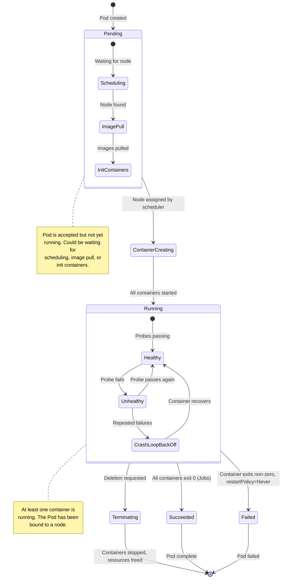
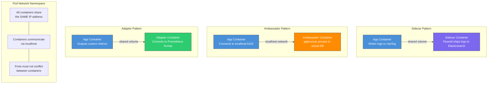
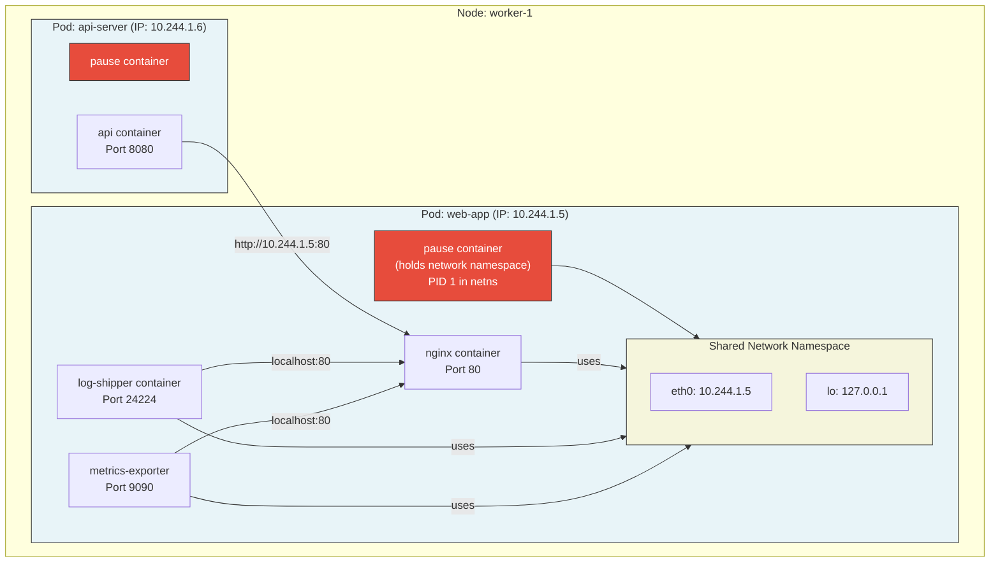

# File 06: Pods — The Atomic Unit of Kubernetes

**Topic:** Understanding Pods, the smallest deployable unit in Kubernetes — their internals, lifecycle, multi-container patterns, resource management, and QoS classes.

**WHY THIS MATTERS:** Every single workload in Kubernetes runs inside a Pod. Whether you deploy a simple web server or a complex distributed database, it ultimately becomes one or more Pods. Understanding Pod internals is the difference between blindly copying YAML and truly knowing what your cluster is doing. Debugging network issues, OOM kills, container restarts, scheduling failures — all require Pod-level knowledge.

---

## Story: The Auto-Rickshaw

Picture an Indian auto-rickshaw weaving through busy traffic. The **auto-rickshaw itself is a Pod** — a single unit of transport that carries one or more passengers (containers) through the city (cluster).

The **driver is the pause container** — always present, always running first. The driver does not carry cargo himself, but he holds the registration (network namespace), the meter (IP address), and keeps the rickshaw parked in its spot even when passengers hop in and out. Without the driver, there is no rickshaw.

Before passengers board, there might be a **fuel check and tyre inspection — these are init containers**. The fuel boy fills the tank, the mechanic checks the tyres. They run one after another, in strict order. Only after all checks pass do passengers climb in.

Sometimes the rickshaw carries a **shared ride** — two passengers (containers) going to the same area. They share the same vehicle (network namespace), can talk to each other by just turning their heads (localhost), and share the luggage rack (volumes). But each passenger has their own seat (process space) and their own fare meter (resource limits).

If mid-journey a traffic cop needs to check papers, an **ephemeral container** is like a temporary inspector who hops on, checks documents, and hops off — useful for debugging without disrupting the ride.

---

## Example Block 1 — Pod Internals and the Pause Container

### Section 1 — What Actually Happens When a Pod Starts

When you create a Pod, the kubelet on the assigned node does the following:

1. Pulls the **pause container** image (`registry.k8s.io/pause:3.9`)
2. Creates a **network namespace** — this gives the Pod its own IP address
3. The pause container holds this namespace open by sleeping forever
4. Init containers run one by one, in order
5. Application containers start (simultaneously, unless there are dependencies)

**WHY:** The pause container exists so that the network namespace survives even if your application container crashes and restarts. Without it, every restart would get a new IP and break networking.

```yaml
# This is what Kubernetes creates internally (simplified)
# You never write this yourself, but understanding it matters
apiVersion: v1
kind: Pod
metadata:
  name: my-app
  namespace: default
  labels:
    app: my-app          # WHY: Labels are how Services find this Pod
    version: v1          # WHY: Useful for canary deployments later
spec:
  containers:
    - name: web-server
      image: nginx:1.25
      ports:
        - containerPort: 80    # WHY: Declares which port the container listens on
          protocol: TCP        # WHY: Default is TCP, explicit for clarity
      resources:
        requests:
          memory: "64Mi"       # WHY: Scheduler uses this to find a node with enough memory
          cpu: "100m"          # WHY: 100 millicores = 0.1 CPU core
        limits:
          memory: "128Mi"      # WHY: Container is OOM-killed if it exceeds this
          cpu: "250m"          # WHY: Container is CPU-throttled at this ceiling
```

### Section 2 — Examining the Pause Container

```bash
# SYNTAX: List all containers in a pod, including infrastructure containers
# You need access to the node's container runtime for this
docker ps | grep pause

# EXPECTED OUTPUT:
# a1b2c3d4e5f6   registry.k8s.io/pause:3.9   "/pause"   2 hours ago   Up 2 hours   k8s_POD_my-app_default_...

# SYNTAX: Inspect network namespace sharing
kubectl exec my-app -- cat /proc/1/net/dev

# EXPECTED OUTPUT:
# Inter-|   Receive                                                |  Transmit
#  face |bytes    packets errs drop fifo frame compressed multicast|bytes    packets ...
#     lo:    1234      15    0    0    0     0          0         0     1234      15 ...
#   eth0:   56789     100    0    0    0     0          0         0    12345      80 ...
```

**WHY:** The `eth0` interface you see inside every container in the Pod is the same interface — it belongs to the pause container's network namespace. All containers share it.

### Section 3 — Pod Lifecycle State Diagram



---

## Example Block 2 — Init Containers

### Section 1 — What Are Init Containers

Init containers run **before** any application container starts. They run **sequentially** — each must complete successfully before the next one begins. If an init container fails, the kubelet restarts it (subject to the Pod's restartPolicy) until it succeeds.

**WHY:** Use init containers for setup tasks that must complete before your app starts — like waiting for a database to become available, downloading config from a remote source, or running database migrations.

```yaml
apiVersion: v1
kind: Pod
metadata:
  name: myapp-pod
  labels:
    app: myapp
spec:
  initContainers:
    # WHY: First init container — waits for the database service to exist in DNS
    - name: wait-for-db
      image: busybox:1.36
      command: ['sh', '-c', 'until nslookup mysql-service.default.svc.cluster.local; do echo "Waiting for DB..."; sleep 2; done']
      # WHY: nslookup will fail until the mysql-service is created and has endpoints

    # WHY: Second init container — downloads configuration from a remote source
    - name: fetch-config
      image: curlimages/curl:8.4.0
      command: ['sh', '-c', 'curl -o /config/app.conf https://config-server/api/v1/config']
      volumeMounts:
        - name: config-volume
          mountPath: /config     # WHY: Shared volume so the app container can read this config

  containers:
    - name: myapp
      image: myapp:2.0
      ports:
        - containerPort: 8080
      volumeMounts:
        - name: config-volume
          mountPath: /etc/myapp  # WHY: App reads config from here; init container wrote it
      resources:
        requests:
          memory: "128Mi"
          cpu: "200m"
        limits:
          memory: "256Mi"
          cpu: "500m"

  volumes:
    - name: config-volume
      emptyDir: {}               # WHY: Temporary volume shared between init and app containers
```

### Section 2 — Inspecting Init Container Status

```bash
# SYNTAX: View init container status in a pod
kubectl describe pod myapp-pod

# EXPECTED OUTPUT (relevant section):
# Init Containers:
#   wait-for-db:
#     Container ID:  containerd://abc123...
#     Image:         busybox:1.36
#     State:         Terminated
#       Reason:      Completed
#       Exit Code:   0
#     Ready:         True
#   fetch-config:
#     Container ID:  containerd://def456...
#     Image:         curlimages/curl:8.4.0
#     State:         Terminated
#       Reason:      Completed
#       Exit Code:   0
#     Ready:         True

# SYNTAX: View logs of a specific init container
kubectl logs myapp-pod -c wait-for-db

# FLAGS:
#   -c, --container    Specify which container's logs to view
#
# EXPECTED OUTPUT:
# nslookup: can't resolve 'mysql-service.default.svc.cluster.local'
# Waiting for DB...
# nslookup: can't resolve 'mysql-service.default.svc.cluster.local'
# Waiting for DB...
# Server:    10.96.0.10
# Address:   10.96.0.10:53
# Name:      mysql-service.default.svc.cluster.local
# Address:   10.96.45.12
```

**WHY:** Knowing how to read init container status is critical for debugging Pods stuck in `Init:0/2` or `Init:CrashLoopBackOff` states.

---

## Example Block 3 — Multi-Container Pod Patterns

### Section 1 — The Three Patterns

Kubernetes supports running multiple containers in a single Pod. There are three recognized patterns:

1. **Sidecar** — Enhances/extends the main container (log shipper, proxy, config reloader)
2. **Ambassador** — Proxies network connections for the main container (database proxy, API gateway)
3. **Adapter** — Transforms output from the main container (log format converter, metrics exporter)

**WHY:** These patterns exist because some cross-cutting concerns are better handled by a separate container rather than baking them into your application image. This keeps images small, concerns separated, and components independently updatable.



### Section 2 — Sidecar Pattern YAML

```yaml
apiVersion: v1
kind: Pod
metadata:
  name: web-with-log-shipper
  labels:
    app: web
    pattern: sidecar
spec:
  containers:
    # WHY: Main application container — serves web traffic
    - name: web-server
      image: nginx:1.25
      ports:
        - containerPort: 80
      volumeMounts:
        - name: shared-logs
          mountPath: /var/log/nginx   # WHY: Nginx writes access/error logs here
      resources:
        requests:
          memory: "64Mi"
          cpu: "100m"
        limits:
          memory: "128Mi"
          cpu: "250m"

    # WHY: Sidecar container — reads logs from shared volume, ships to central logging
    - name: log-shipper
      image: fluent/fluentd:v1.16
      volumeMounts:
        - name: shared-logs
          mountPath: /var/log/nginx   # WHY: Same path, same volume — reads what nginx writes
          readOnly: true              # WHY: Sidecar only reads, never modifies app logs
      resources:
        requests:
          memory: "64Mi"
          cpu: "50m"
        limits:
          memory: "128Mi"
          cpu: "100m"

  volumes:
    - name: shared-logs
      emptyDir: {}                    # WHY: emptyDir lives as long as the Pod, shared between containers
```

### Section 3 — Ambassador Pattern YAML

```yaml
apiVersion: v1
kind: Pod
metadata:
  name: app-with-db-proxy
  labels:
    app: myapp
    pattern: ambassador
spec:
  containers:
    # WHY: Main app connects to localhost:5432, thinks it's a local database
    - name: myapp
      image: myapp:2.0
      env:
        - name: DB_HOST
          value: "localhost"           # WHY: Ambassador listens on localhost
        - name: DB_PORT
          value: "5432"
      ports:
        - containerPort: 8080
      resources:
        requests:
          memory: "128Mi"
          cpu: "200m"
        limits:
          memory: "256Mi"
          cpu: "500m"

    # WHY: Ambassador proxies connections to the actual database with connection pooling
    - name: db-proxy
      image: pgbouncer/pgbouncer:1.21.0
      ports:
        - containerPort: 5432          # WHY: Listens on the port the app expects
      env:
        - name: DATABASES_HOST
          value: "postgres.database.svc.cluster.local"  # WHY: Actual database service DNS
        - name: DATABASES_PORT
          value: "5432"
        - name: MAX_CLIENT_CONN
          value: "100"                 # WHY: Connection pooling — many app connections, few DB connections
      resources:
        requests:
          memory: "32Mi"
          cpu: "50m"
        limits:
          memory: "64Mi"
          cpu: "100m"
```

**WHY:** The app container never needs to know where the real database lives. If you move the database, you only reconfigure the ambassador. This is especially powerful when different environments (dev/staging/prod) have different database endpoints.

---

## Example Block 4 — Ephemeral Containers

### Section 1 — Debugging Running Pods

Ephemeral containers were introduced for debugging. They are temporary containers that you inject into a running Pod.

**WHY:** Production container images are often minimal (distroless, scratch-based) and lack debugging tools like `curl`, `nslookup`, or `strace`. Ephemeral containers let you attach a debug toolbox without restarting the Pod or modifying its spec.

```bash
# SYNTAX: Attach an ephemeral debug container to a running pod
kubectl debug -it my-app --image=busybox:1.36 --target=web-server

# FLAGS:
#   -it                     Interactive terminal
#   --image                 Debug container image to use
#   --target                Share process namespace with this container
#
# EXPECTED OUTPUT:
# Defaulting debug container name to debugger-abc12.
# If you don't see a command prompt, try pressing enter.
# / #

# Once inside the ephemeral container, you can:
# - Inspect the target container's processes (because of shared PID namespace)
# - Access the Pod's network namespace (curl localhost, nslookup services)
# - Read shared volumes

# SYNTAX: View processes of the target container from the ephemeral container
ps aux

# EXPECTED OUTPUT:
# PID   USER     TIME  COMMAND
#     1 root      0:00 nginx: master process nginx -g daemon off;
#    29 nginx     0:00 nginx: worker process
#    45 root      0:00 sh
#    51 root      0:00 ps aux

# SYNTAX: Check network connectivity from the ephemeral container
wget -qO- http://localhost:80

# EXPECTED OUTPUT:
# <!DOCTYPE html>
# <html>
# <head><title>Welcome to nginx!</title></head>
# ...
```

### Section 2 — Creating a Debug Copy of a Pod

```bash
# SYNTAX: Create a copy of a pod with a debug container and modified command
kubectl debug my-app -it --copy-to=my-app-debug --container=web-server -- sh

# FLAGS:
#   --copy-to       Name for the new debug pod (original pod is untouched)
#   --container     Which container to override in the copy
#   -- sh           Override the container's command with 'sh'
#
# EXPECTED OUTPUT:
# Created debugging pod my-app-debug
# If you don't see a command prompt, try pressing enter.
# / #

# WHY: This is useful when you want to start the container with a shell
# instead of the normal entrypoint, to inspect files and configuration
# before the application runs.
```

**WHY:** Ephemeral containers are essential for production debugging. They are the reason you do not need to bake `curl` and `vim` into every production image.

---

## Example Block 5 — Resource Requests, Limits, and QoS Classes

### Section 1 — Understanding Requests vs Limits

| Concept | What It Does | What Happens If Exceeded |
|---------|-------------|------------------------|
| `requests.cpu` | Scheduler uses this to find a node | N/A (it's a floor, not a ceiling) |
| `requests.memory` | Scheduler uses this to find a node | N/A (it's a floor, not a ceiling) |
| `limits.cpu` | Maximum CPU the container can use | Container is **throttled** (slowed down) |
| `limits.memory` | Maximum memory the container can use | Container is **OOM-killed** (terminated) |

**WHY:** Requests are for scheduling — "I need at least this much." Limits are for enforcement — "I cannot use more than this much." Setting these correctly prevents noisy neighbors from starving other pods and prevents runaway processes from crashing nodes.

### Section 2 — QoS Classes

Kubernetes assigns a Quality of Service class to each Pod based on its resource configuration:

| QoS Class | Condition | Eviction Priority |
|-----------|-----------|------------------|
| **Guaranteed** | Every container has requests = limits for both CPU and memory | Last to be evicted |
| **Burstable** | At least one container has a request or limit set, but they are not all equal | Evicted after BestEffort |
| **BestEffort** | No requests or limits set on any container | First to be evicted |

**WHY:** When a node runs out of memory, the kubelet must evict pods. It evicts BestEffort first, then Burstable, and Guaranteed last. Knowing this lets you protect critical workloads.

```yaml
# Guaranteed QoS — requests equal limits for all resources
apiVersion: v1
kind: Pod
metadata:
  name: guaranteed-pod
spec:
  containers:
    - name: app
      image: nginx:1.25
      resources:
        requests:
          memory: "256Mi"    # WHY: Equal to limit — scheduler and enforcer agree
          cpu: "500m"        # WHY: Equal to limit — no bursting possible
        limits:
          memory: "256Mi"    # WHY: Same as request — this makes QoS = Guaranteed
          cpu: "500m"        # WHY: Same as request — predictable performance

---
# Burstable QoS — requests are less than limits
apiVersion: v1
kind: Pod
metadata:
  name: burstable-pod
spec:
  containers:
    - name: app
      image: nginx:1.25
      resources:
        requests:
          memory: "128Mi"    # WHY: Minimum needed to schedule
          cpu: "100m"        # WHY: Minimum CPU guaranteed
        limits:
          memory: "512Mi"    # WHY: Can burst up to 512Mi if node has room
          cpu: "1000m"       # WHY: Can burst up to 1 full core

---
# BestEffort QoS — no resources specified at all
apiVersion: v1
kind: Pod
metadata:
  name: besteffort-pod
spec:
  containers:
    - name: app
      image: nginx:1.25
      # WHY: No resources block — this pod gets whatever is left on the node
      # It will be the FIRST to be evicted under memory pressure
```

### Section 3 — Checking QoS Class

```bash
# SYNTAX: Check the QoS class assigned to a pod
kubectl get pod guaranteed-pod -o jsonpath='{.status.qosClass}'

# EXPECTED OUTPUT:
# Guaranteed

kubectl get pod burstable-pod -o jsonpath='{.status.qosClass}'

# EXPECTED OUTPUT:
# Burstable

kubectl get pod besteffort-pod -o jsonpath='{.status.qosClass}'

# EXPECTED OUTPUT:
# BestEffort

# SYNTAX: See resource usage of pods (requires metrics-server)
kubectl top pods

# FLAGS:
#   --containers    Show resource usage per container (not just per pod)
#   --sort-by=cpu   Sort by CPU usage
#   --sort-by=memory Sort by memory usage
#
# EXPECTED OUTPUT:
# NAME              CPU(cores)   MEMORY(bytes)
# guaranteed-pod    45m          120Mi
# burstable-pod     230m         340Mi
# besteffort-pod    12m          45Mi
```

### Section 4 — Pod Resource Inspection Commands

```bash
# SYNTAX: Describe a pod to see full resource details and events
kubectl describe pod myapp-pod

# EXPECTED OUTPUT (relevant sections):
# Containers:
#   web-server:
#     Requests:
#       cpu:        100m
#       memory:     64Mi
#     Limits:
#       cpu:        250m
#       memory:     128Mi
# ...
# QoS Class:       Burstable
# ...
# Events:
#   Type    Reason     Age   From               Message
#   ----    ------     ----  ----               -------
#   Normal  Scheduled  30s   default-scheduler  Successfully assigned default/myapp-pod to node-1
#   Normal  Pulling    28s   kubelet            Pulling image "nginx:1.25"
#   Normal  Pulled     25s   kubelet            Successfully pulled image "nginx:1.25"
#   Normal  Created    25s   kubelet            Created container web-server
#   Normal  Started    24s   kubelet            Started container web-server

# SYNTAX: Get pod YAML with runtime info
kubectl get pod myapp-pod -o yaml

# FLAGS:
#   -o yaml     Output full YAML including status fields added by Kubernetes
#   -o json     Output full JSON (useful for jq processing)
#   -o wide     Show extra columns (node, IP, nominated node, readiness gates)
#
# SYNTAX: Quick view of pod IPs and node assignments
kubectl get pods -o wide

# EXPECTED OUTPUT:
# NAME        READY   STATUS    RESTARTS   AGE   IP           NODE     NOMINATED NODE   READINESS GATES
# myapp-pod   1/1     Running   0          5m    10.244.1.5   node-1   <none>           <none>
```

---

## Example Block 6 — Network Namespace Sharing Deep Dive

### Section 1 — How Containers Share Networking

All containers in a Pod share the same network namespace. This means:

- They all have the **same IP address**
- They can reach each other via **localhost**
- They share the **same port space** (two containers cannot listen on the same port)
- They share the **same loopback interface**



### Section 2 — Verifying Network Sharing

```bash
# SYNTAX: Exec into one container and reach another via localhost
kubectl exec web-with-log-shipper -c log-shipper -- wget -qO- http://localhost:80

# FLAGS:
#   -c log-shipper    Exec into the log-shipper container (not the default one)
#   -- wget ...       Command to run inside the container
#
# EXPECTED OUTPUT:
# <!DOCTYPE html>
# <html>
# <head><title>Welcome to nginx!</title></head>
# ...

# WHY: Even though we exec'd into the log-shipper container,
# we can reach nginx on localhost:80 because they share the network namespace.

# SYNTAX: Check the IP address from inside any container in the pod
kubectl exec web-with-log-shipper -c web-server -- hostname -i
# EXPECTED OUTPUT: 10.244.1.5

kubectl exec web-with-log-shipper -c log-shipper -- hostname -i
# EXPECTED OUTPUT: 10.244.1.5
# WHY: Same IP — confirming shared network namespace
```

---

## Example Block 7 — Pod Management Commands

### Section 1 — Essential kubectl Commands for Pods

```bash
# SYNTAX: Create a pod from a YAML file
kubectl apply -f pod.yaml

# FLAGS:
#   -f, --filename    Path to the YAML file (or URL, or directory)
#   --dry-run=client  Validate YAML without creating the resource
#   -o yaml           Combined with --dry-run, outputs what would be created
#
# EXPECTED OUTPUT:
# pod/myapp-pod created

# SYNTAX: Create a quick pod without YAML (for testing)
kubectl run test-pod --image=nginx:1.25 --port=80

# FLAGS:
#   --image           Container image to use
#   --port            Port to expose
#   --rm              Delete pod after it exits (great for one-off commands)
#   -it               Interactive terminal
#   --restart=Never   Don't restart (useful for Jobs-like behavior)
#
# EXPECTED OUTPUT:
# pod/test-pod created

# SYNTAX: Get all pods with various output formats
kubectl get pods
kubectl get pods -o wide
kubectl get pods -o yaml
kubectl get pods -o json
kubectl get pods --show-labels
kubectl get pods -l app=myapp         # Filter by label
kubectl get pods --field-selector=status.phase=Running   # Filter by status

# SYNTAX: Watch pods in real-time
kubectl get pods -w

# FLAGS:
#   -w, --watch    Watch for changes and print them as they happen
#
# EXPECTED OUTPUT:
# NAME        READY   STATUS    RESTARTS   AGE
# myapp-pod   0/1     Pending   0          0s
# myapp-pod   0/1     ContainerCreating   0   1s
# myapp-pod   1/1     Running   0          3s

# SYNTAX: Delete a pod
kubectl delete pod myapp-pod

# FLAGS:
#   --grace-period=0    Skip graceful shutdown (immediate kill)
#   --force             Force deletion (use with caution)
#   --now               Set grace period to 1 second
#
# EXPECTED OUTPUT:
# pod "myapp-pod" deleted

# SYNTAX: Execute a command inside a running container
kubectl exec -it myapp-pod -- /bin/sh

# FLAGS:
#   -it                 Interactive terminal (stdin + tty)
#   -c container-name   Target a specific container in a multi-container pod
#   -- command          Command to run (everything after -- is the command)
#
# EXPECTED OUTPUT:
# / #

# SYNTAX: Port-forward to access a pod locally
kubectl port-forward myapp-pod 8080:80

# FLAGS:
#   8080:80    Local port 8080 maps to container port 80
#
# EXPECTED OUTPUT:
# Forwarding from 127.0.0.1:8080 -> 80
# Forwarding from [::1]:8080 -> 80
```

---

## Key Takeaways

1. **A Pod is the atomic unit** — you never deploy a container directly; you always deploy a Pod containing one or more containers.

2. **The pause container is the unsung hero** — it creates and holds the network namespace, giving the Pod a stable IP address that survives container restarts.

3. **Init containers enforce ordering** — they run sequentially before app containers start and are perfect for prerequisite checks, config fetching, and database migrations.

4. **Multi-container patterns (sidecar, ambassador, adapter)** keep concerns separated — your app container stays lean while supporting containers handle logging, proxying, and format conversion.

5. **Ephemeral containers are your production debugger** — inject debug tools into a running Pod without restarting it or modifying its image.

6. **Resource requests are for scheduling, limits are for enforcement** — requests tell the scheduler "I need at least this much," limits tell the kubelet "kill/throttle me if I exceed this."

7. **QoS classes determine eviction order** — Guaranteed pods survive longest under pressure, BestEffort pods are evicted first. Always set requests and limits for production workloads.

8. **All containers in a Pod share the network namespace** — they have the same IP, communicate via localhost, and must use different ports.

9. **Use `kubectl describe pod`** as your first debugging command — it shows container states, resource usage, events, and conditions all in one place.

10. **Labels on Pods are critical** — they are how Services, ReplicaSets, and Deployments find and manage Pods. Unlabeled Pods are invisible to higher-level controllers.
