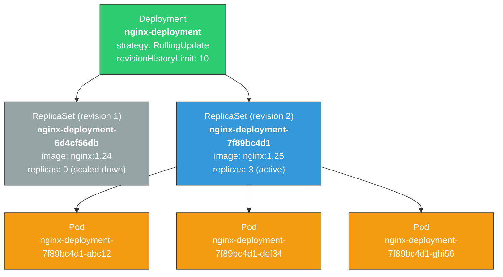
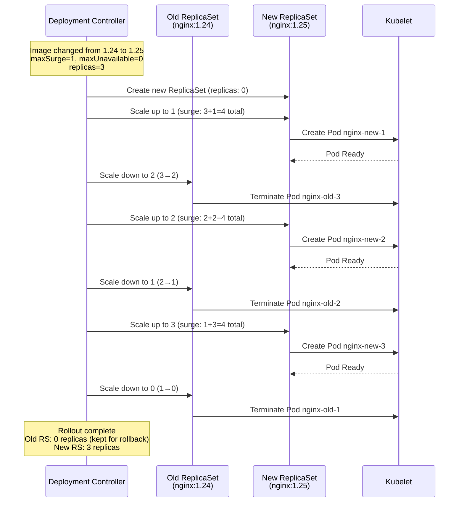

# File 07: ReplicaSets and Deployments

**Topic:** Understanding ReplicaSets (desired state for Pod replicas) and Deployments (declarative updates for ReplicaSets), including strategies, rollbacks, and revision history.

**WHY THIS MATTERS:** In production, you never run a single Pod. You need multiple replicas for availability, and you need controlled rollouts for zero-downtime updates. Deployments are the most common workload resource in Kubernetes — if you understand them deeply, you understand how 90% of production apps are managed.

---

## Story: The Mumbai Dabbawalas

Mumbai's legendary dabbawalas deliver over 200,000 lunchboxes every single day with a claimed error rate of one in six million deliveries. Let us map this to Kubernetes.

The **dabbawala organization is a Deployment** — it declares the intention: "We need 5,000 dabbawalas delivering lunches across Mumbai every day."

The **current batch of 5,000 active dabbawalas is a ReplicaSet** — the actual group that fulfills the promise. If a dabbawala calls in sick (a Pod crashes), the organization immediately recruits a replacement to maintain exactly 5,000. The ReplicaSet never says "we have 4,999, that is close enough." It always reconciles back to the desired count.

Now imagine the organization decides to upgrade from cloth bundles to **insulated thermal boxes** — this is a **rolling update**. They do not ask all 5,000 dabbawalas to switch on the same day (that would be the Recreate strategy — service disruption). Instead, they train 500 dabbawalas with thermal boxes, retire 500 old-style dabbawalas, train another 500, retire another 500... This is the **RollingUpdate strategy** — always maintaining enough active deliveries during the transition.

The batch of dabbawalas using cloth bundles is the **old ReplicaSet**. The batch with thermal boxes is the **new ReplicaSet**. At any point, the Deployment tracks both.

If customers complain that thermal boxes are too heavy and deliveries are slow, the organization can **rollback** — reactivate the old ReplicaSet with cloth bundles and scale down the thermal-box ReplicaSet. Kubernetes makes this a single command.

---

## Example Block 1 — ReplicaSets: The Guarantee of Replicas

### Section 1 — What Is a ReplicaSet

A ReplicaSet ensures that a specified number of Pod replicas are running at any given time. It uses **label selectors** to identify which Pods belong to it.

**WHY:** You rarely create ReplicaSets directly — Deployments manage them for you. But understanding ReplicaSets is essential because they are the mechanism that actually creates and deletes Pods. When you debug why a Pod was recreated or why you have extra Pods, you are really debugging a ReplicaSet.

```yaml
# WHY: This is shown for educational purposes. In practice, always use a Deployment.
apiVersion: apps/v1
kind: ReplicaSet
metadata:
  name: nginx-rs
  labels:
    app: nginx
    tier: frontend
spec:
  replicas: 3                        # WHY: We want exactly 3 copies running at all times
  selector:
    matchLabels:
      app: nginx                     # WHY: ReplicaSet manages Pods with this label
      tier: frontend                 # WHY: Both labels must match — AND logic
  template:
    metadata:
      labels:
        app: nginx                   # WHY: Must match selector above — otherwise RS cannot find its Pods
        tier: frontend               # WHY: Must match selector above — both labels required
    spec:
      containers:
        - name: nginx
          image: nginx:1.25
          ports:
            - containerPort: 80
          resources:
            requests:
              memory: "64Mi"
              cpu: "100m"
            limits:
              memory: "128Mi"
              cpu: "250m"
```

### Section 2 — Label Matching Rules

```bash
# SYNTAX: See which Pods a ReplicaSet is managing
kubectl get pods --show-labels

# EXPECTED OUTPUT:
# NAME             READY   STATUS    RESTARTS   AGE   LABELS
# nginx-rs-abc12   1/1     Running   0          2m    app=nginx,tier=frontend
# nginx-rs-def34   1/1     Running   0          2m    app=nginx,tier=frontend
# nginx-rs-ghi56   1/1     Running   0          2m    app=nginx,tier=frontend

# SYNTAX: Describe the ReplicaSet to see its selector
kubectl describe rs nginx-rs

# EXPECTED OUTPUT (relevant section):
# Selector:   app=nginx,tier=frontend
# Replicas:   3 current / 3 desired
# Pods Status: 3 Running / 0 Waiting / 0 Succeeded / 0 Failed

# EXPERIMENT: What happens if you manually add the matching labels to an orphan pod?
kubectl run orphan-pod --image=nginx:1.25 --labels="app=nginx,tier=frontend"

# The ReplicaSet sees 4 Pods matching its selector but only wants 3.
# It will TERMINATE one pod to maintain the desired count of 3.

kubectl get pods --show-labels
# EXPECTED OUTPUT:
# NAME             READY   STATUS        RESTARTS   AGE   LABELS
# nginx-rs-abc12   1/1     Running       0          5m    app=nginx,tier=frontend
# nginx-rs-def34   1/1     Running       0          5m    app=nginx,tier=frontend
# nginx-rs-ghi56   1/1     Running       0          5m    app=nginx,tier=frontend
# orphan-pod       1/1     Terminating   0          10s   app=nginx,tier=frontend
```

**WHY:** This label-matching behavior is fundamental. It explains why removing a label from a Pod "escapes" it from a ReplicaSet (useful for debugging), and why adding matching labels can cause unexpected deletions.

---

## Example Block 2 — Deployments: The Full Picture

### Section 1 — Deployment to ReplicaSet to Pod Hierarchy



**WHY:** A Deployment does not manage Pods directly. It manages ReplicaSets, which manage Pods. This two-level hierarchy is what enables rollbacks — old ReplicaSets are kept (scaled to 0) so Kubernetes can scale them back up instantly.

### Section 2 — Deployment YAML

```yaml
apiVersion: apps/v1
kind: Deployment
metadata:
  name: nginx-deployment
  labels:
    app: nginx                         # WHY: Label on the Deployment itself (not the Pods)
spec:
  replicas: 3                          # WHY: Desired number of Pod replicas
  revisionHistoryLimit: 10             # WHY: Keep 10 old ReplicaSets for rollback (default is 10)

  selector:
    matchLabels:
      app: nginx                       # WHY: Deployment finds its ReplicaSet/Pods via this selector

  strategy:
    type: RollingUpdate                # WHY: Zero-downtime updates (alternative: Recreate)
    rollingUpdate:
      maxSurge: 1                      # WHY: Allow 1 extra Pod during update (3+1=4 max)
      maxUnavailable: 0                # WHY: Never reduce below 3 running Pods during update

  template:                            # WHY: This is the Pod template — used by ReplicaSet to create Pods
    metadata:
      labels:
        app: nginx                     # WHY: Must match selector.matchLabels above
        version: v1                    # WHY: Extra label for tracking versions
    spec:
      containers:
        - name: nginx
          image: nginx:1.25
          ports:
            - containerPort: 80
          readinessProbe:              # WHY: Deployment waits for this before counting Pod as "available"
            httpGet:
              path: /
              port: 80
            initialDelaySeconds: 5
            periodSeconds: 5
          livenessProbe:               # WHY: Kubelet restarts container if this fails
            httpGet:
              path: /
              port: 80
            initialDelaySeconds: 15
            periodSeconds: 10
          resources:
            requests:
              memory: "64Mi"
              cpu: "100m"
            limits:
              memory: "128Mi"
              cpu: "250m"
```

### Section 3 — Deployment Management Commands

```bash
# SYNTAX: Create or update a deployment
kubectl apply -f deployment.yaml

# EXPECTED OUTPUT:
# deployment.apps/nginx-deployment created

# SYNTAX: Check deployment status
kubectl get deployment nginx-deployment

# EXPECTED OUTPUT:
# NAME               READY   UP-TO-DATE   AVAILABLE   AGE
# nginx-deployment   3/3     3            3           30s

# COLUMN MEANINGS:
#   READY        = running pods / desired pods
#   UP-TO-DATE   = pods matching the current template
#   AVAILABLE    = pods passing readiness probe

# SYNTAX: See the ReplicaSets created by a deployment
kubectl get rs -l app=nginx

# EXPECTED OUTPUT:
# NAME                          DESIRED   CURRENT   READY   AGE
# nginx-deployment-7f89bc4d1    3         3         3       30s

# SYNTAX: See all pods created by the deployment
kubectl get pods -l app=nginx -o wide

# EXPECTED OUTPUT:
# NAME                                READY   STATUS    RESTARTS   AGE   IP           NODE
# nginx-deployment-7f89bc4d1-abc12    1/1     Running   0          30s   10.244.1.5   node-1
# nginx-deployment-7f89bc4d1-def34    1/1     Running   0          30s   10.244.2.3   node-2
# nginx-deployment-7f89bc4d1-ghi56    1/1     Running   0          30s   10.244.1.6   node-1
```

---

## Example Block 3 — Deployment Strategies

### Section 1 — RollingUpdate Strategy

The default strategy. Pods are replaced gradually — some old Pods are terminated while new Pods are created.

Two critical parameters control the rollout speed:

| Parameter | Default | Meaning |
|-----------|---------|---------|
| `maxSurge` | 25% | Maximum number of Pods that can exist **above** the desired count during update |
| `maxUnavailable` | 25% | Maximum number of Pods that can be **unavailable** during update |

**WHY:** These two knobs let you tune the tradeoff between speed and safety:
- `maxSurge: 1, maxUnavailable: 0` — safest, slowest: always maintain full capacity
- `maxSurge: 50%, maxUnavailable: 50%` — fastest: half old + half new simultaneously
- `maxSurge: 0, maxUnavailable: 1` — no extra resources used, but one Pod less during update



### Section 2 — Recreate Strategy

All existing Pods are killed before new ones are created. This causes downtime.

**WHY:** Use Recreate when your application cannot run two versions simultaneously — for example, if two versions would corrupt a shared database schema, or if your app uses a host port that cannot be shared.

```yaml
apiVersion: apps/v1
kind: Deployment
metadata:
  name: legacy-app
spec:
  replicas: 3
  strategy:
    type: Recreate               # WHY: Kill all old Pods first, then create new ones
    # No rollingUpdate section — it does not apply to Recreate
  selector:
    matchLabels:
      app: legacy
  template:
    metadata:
      labels:
        app: legacy
    spec:
      containers:
        - name: app
          image: legacy-app:2.0
          ports:
            - containerPort: 8080
          resources:
            requests:
              memory: "128Mi"
              cpu: "200m"
            limits:
              memory: "256Mi"
              cpu: "500m"
```

```bash
# TIMELINE OF RECREATE STRATEGY:
# Time 0:  3 old Pods running
# Time 1:  3 old Pods Terminating (ALL at once)
# Time 2:  0 Pods running (DOWNTIME!)
# Time 3:  3 new Pods ContainerCreating
# Time 4:  3 new Pods Running
```

### Section 3 — Strategy Comparison

| Feature | RollingUpdate | Recreate |
|---------|:------------:|:--------:|
| Zero downtime | Yes | No |
| Two versions coexist | Yes (briefly) | No |
| Resource overhead during update | Yes (maxSurge) | No |
| Speed | Slower | Faster |
| Use when | Most applications | DB migrations, host-port conflicts |

---

## Example Block 4 — Rolling Updates in Practice

### Section 1 — Triggering a Rolling Update

```bash
# METHOD 1: Edit the YAML and apply
# Change image: nginx:1.25 → nginx:1.26 in deployment.yaml
kubectl apply -f deployment.yaml

# EXPECTED OUTPUT:
# deployment.apps/nginx-deployment configured

# METHOD 2: Use kubectl set image (quick, no YAML edit)
kubectl set image deployment/nginx-deployment nginx=nginx:1.26

# SYNTAX: kubectl set image deployment/<name> <container>=<new-image>
# FLAGS:
#   --record    Deprecated but was used to annotate the change cause
#
# EXPECTED OUTPUT:
# deployment.apps/nginx-deployment image updated

# METHOD 3: Use kubectl edit (opens in $EDITOR)
kubectl edit deployment nginx-deployment

# WHY: Opens the live deployment YAML in your editor. Save and close to apply.
```

### Section 2 — Monitoring a Rollout

```bash
# SYNTAX: Watch the rollout in real-time
kubectl rollout status deployment/nginx-deployment

# EXPECTED OUTPUT:
# Waiting for deployment "nginx-deployment" rollout to finish: 1 out of 3 new replicas have been updated...
# Waiting for deployment "nginx-deployment" rollout to finish: 2 out of 3 new replicas have been updated...
# Waiting for deployment "nginx-deployment" rollout to finish: 2 of 3 updated replicas are available...
# deployment "nginx-deployment" successfully rolled out

# SYNTAX: Watch pods being replaced in real-time
kubectl get pods -l app=nginx -w

# EXPECTED OUTPUT:
# NAME                                READY   STATUS              RESTARTS   AGE
# nginx-deployment-7f89bc4d1-abc12    1/1     Running             0          10m
# nginx-deployment-7f89bc4d1-def34    1/1     Running             0          10m
# nginx-deployment-7f89bc4d1-ghi56    1/1     Running             0          10m
# nginx-deployment-85c4f8d9b2-xyz99   0/1     ContainerCreating   0          2s
# nginx-deployment-85c4f8d9b2-xyz99   1/1     Running             0          5s
# nginx-deployment-7f89bc4d1-abc12    1/1     Terminating         0          10m
# ...

# SYNTAX: See rollout history
kubectl rollout history deployment/nginx-deployment

# EXPECTED OUTPUT:
# deployment.apps/nginx-deployment
# REVISION  CHANGE-CAUSE
# 1         <none>
# 2         <none>

# SYNTAX: See details of a specific revision
kubectl rollout history deployment/nginx-deployment --revision=1

# EXPECTED OUTPUT:
# deployment.apps/nginx-deployment with revision #1
# Pod Template:
#   Labels:       app=nginx
#                 pod-template-hash=7f89bc4d1
#   Containers:
#    nginx:
#     Image:      nginx:1.25
#     Port:       80/TCP
#     ...
```

**WHY:** The `kubectl rollout` commands are your primary tools for managing updates. `status` shows progress, `history` shows past revisions, and `undo` performs rollback.

---

## Example Block 5 — Rollback

### Section 1 — When Things Go Wrong

```bash
# Deploy a broken image
kubectl set image deployment/nginx-deployment nginx=nginx:9.99.99

# Watch the rollout stall
kubectl rollout status deployment/nginx-deployment

# EXPECTED OUTPUT:
# Waiting for deployment "nginx-deployment" rollout to finish: 1 out of 3 new replicas have been updated...
# (hangs here because the new pod can't pull the image)

# Check what happened
kubectl get pods -l app=nginx

# EXPECTED OUTPUT:
# NAME                                READY   STATUS             RESTARTS   AGE
# nginx-deployment-85c4f8d9b2-abc12   1/1     Running            0          15m
# nginx-deployment-85c4f8d9b2-def34   1/1     Running            0          15m
# nginx-deployment-85c4f8d9b2-ghi56   1/1     Running            0          15m
# nginx-deployment-f4c9d7e8a1-zzz99   0/1     ImagePullBackOff   0          30s

# WHY: Because maxUnavailable=0, the old pods are still running.
# The rollout is stuck but your service is still alive.
```

### Section 2 — Performing Rollback

```bash
# SYNTAX: Rollback to the previous revision
kubectl rollout undo deployment/nginx-deployment

# EXPECTED OUTPUT:
# deployment.apps/nginx-deployment rolled back

# SYNTAX: Rollback to a specific revision
kubectl rollout undo deployment/nginx-deployment --to-revision=1

# FLAGS:
#   --to-revision    Specific revision number to rollback to
#
# EXPECTED OUTPUT:
# deployment.apps/nginx-deployment rolled back

# Verify the rollback
kubectl rollout status deployment/nginx-deployment

# EXPECTED OUTPUT:
# deployment "nginx-deployment" successfully rolled out

kubectl get pods -l app=nginx

# EXPECTED OUTPUT:
# NAME                                READY   STATUS    RESTARTS   AGE
# nginx-deployment-7f89bc4d1-new01    1/1     Running   0          15s
# nginx-deployment-7f89bc4d1-new02    1/1     Running   0          12s
# nginx-deployment-7f89bc4d1-new03    1/1     Running   0          9s
```

### Section 3 — Pausing and Resuming Rollouts

```bash
# SYNTAX: Pause a rollout (useful for canary-style testing)
kubectl rollout pause deployment/nginx-deployment

# EXPECTED OUTPUT:
# deployment.apps/nginx-deployment paused

# Make multiple changes without triggering a rollout for each one
kubectl set image deployment/nginx-deployment nginx=nginx:1.26
kubectl set resources deployment/nginx-deployment -c=nginx --limits=cpu=200m,memory=256Mi

# SYNTAX: Resume the rollout (applies all batched changes at once)
kubectl rollout resume deployment/nginx-deployment

# EXPECTED OUTPUT:
# deployment.apps/nginx-deployment resumed

# WHY: Without pause/resume, each change triggers a separate rollout.
# Pausing lets you batch multiple changes into a single rollout.
```

---

## Example Block 6 — Scaling

### Section 1 — Manual Scaling

```bash
# SYNTAX: Scale a deployment to a specific number of replicas
kubectl scale deployment/nginx-deployment --replicas=5

# FLAGS:
#   --replicas    Target number of replicas
#
# EXPECTED OUTPUT:
# deployment.apps/nginx-deployment scaled

# Verify
kubectl get deployment nginx-deployment

# EXPECTED OUTPUT:
# NAME               READY   UP-TO-DATE   AVAILABLE   AGE
# nginx-deployment   5/5     5            5           20m

# SYNTAX: Conditional scaling (only scale if current replicas match)
kubectl scale deployment/nginx-deployment --replicas=10 --current-replicas=5

# FLAGS:
#   --current-replicas    Only scale if the current count matches (prevents race conditions)
#
# EXPECTED OUTPUT:
# deployment.apps/nginx-deployment scaled

# SYNTAX: Scale down to zero (pause workload without deleting)
kubectl scale deployment/nginx-deployment --replicas=0

# WHY: Scaling to 0 is useful for saving resources in dev environments
# or temporarily stopping a workload without losing its configuration.
```

### Section 2 — Autoscaling (HPA Preview)

```bash
# SYNTAX: Create a Horizontal Pod Autoscaler
kubectl autoscale deployment/nginx-deployment --min=3 --max=10 --cpu-percent=70

# FLAGS:
#   --min            Minimum number of replicas
#   --max            Maximum number of replicas
#   --cpu-percent    Target CPU utilization percentage
#
# EXPECTED OUTPUT:
# horizontalpodautoscaler.autoscaling/nginx-deployment autoscaled

# SYNTAX: Check HPA status
kubectl get hpa

# EXPECTED OUTPUT:
# NAME               REFERENCE                     TARGETS   MINPODS   MAXPODS   REPLICAS   AGE
# nginx-deployment   Deployment/nginx-deployment   12%/70%   3         10        3          30s
```

**WHY:** HPA is covered in detail later, but knowing it exists here helps you understand that manual scaling is just the starting point — production systems should autoscale.

---

## Example Block 7 — Revision History and Annotations

### Section 1 — Managing Revision History

```yaml
apiVersion: apps/v1
kind: Deployment
metadata:
  name: nginx-deployment
  annotations:
    kubernetes.io/change-cause: "Update nginx to 1.26 for CVE fix"  # WHY: Documents why the change was made
spec:
  revisionHistoryLimit: 5          # WHY: Keep only 5 old ReplicaSets (saves etcd storage)
  replicas: 3
  selector:
    matchLabels:
      app: nginx
  strategy:
    type: RollingUpdate
    rollingUpdate:
      maxSurge: 1
      maxUnavailable: 0
  template:
    metadata:
      labels:
        app: nginx
    spec:
      containers:
        - name: nginx
          image: nginx:1.26
          ports:
            - containerPort: 80
          resources:
            requests:
              memory: "64Mi"
              cpu: "100m"
            limits:
              memory: "128Mi"
              cpu: "250m"
```

```bash
# SYNTAX: Annotate the deployment with change-cause after update
kubectl annotate deployment/nginx-deployment kubernetes.io/change-cause="Update nginx to 1.26 for CVE fix"

# Now rollout history shows the reason
kubectl rollout history deployment/nginx-deployment

# EXPECTED OUTPUT:
# deployment.apps/nginx-deployment
# REVISION  CHANGE-CAUSE
# 1         Initial deployment with nginx:1.25
# 2         Update nginx to 1.26 for CVE fix

# SYNTAX: View all ReplicaSets including old ones (scaled to 0)
kubectl get rs -l app=nginx

# EXPECTED OUTPUT:
# NAME                          DESIRED   CURRENT   READY   AGE
# nginx-deployment-7f89bc4d1    0         0         0       25m    ← revision 1
# nginx-deployment-85c4f8d9b2   3         3         3       5m     ← revision 2 (active)
```

**WHY:** `revisionHistoryLimit` controls how many old ReplicaSets are kept. Setting it too high wastes etcd storage. Setting it too low limits how far back you can rollback. The default of 10 is usually fine.

### Section 2 — Deployment Conditions

```bash
# SYNTAX: Check deployment conditions (useful for debugging stalled rollouts)
kubectl get deployment nginx-deployment -o jsonpath='{.status.conditions[*]}'

# Or more readable:
kubectl describe deployment nginx-deployment

# EXPECTED OUTPUT (conditions section):
# Conditions:
#   Type           Status  Reason
#   ----           ------  ------
#   Available      True    MinimumReplicasAvailable
#   Progressing    True    NewReplicaSetAvailable

# CONDITION MEANINGS:
#   Available:   At least minReadySeconds has passed for minimum replicas
#   Progressing: Deployment is creating/scaling ReplicaSets
#                If this stays False, the rollout is stuck

# SYNTAX: Set a deadline for rollouts (prevents infinite hangs)
# In the deployment YAML:
# spec:
#   progressDeadlineSeconds: 600   # WHY: Fail the rollout if not complete in 10 minutes
```

---

## Example Block 8 — Complete Production Deployment

### Section 1 — Production-Ready YAML

```yaml
apiVersion: apps/v1
kind: Deployment
metadata:
  name: api-server
  namespace: production             # WHY: Always specify namespace explicitly in production
  labels:
    app: api-server
    team: backend
    environment: production
  annotations:
    kubernetes.io/change-cause: "Initial deployment of api-server v3.2.1"
spec:
  replicas: 5                       # WHY: 5 replicas across 3 nodes for high availability
  revisionHistoryLimit: 10          # WHY: Keep 10 revisions for rollback flexibility
  progressDeadlineSeconds: 600      # WHY: Fail rollout if stuck for more than 10 minutes

  selector:
    matchLabels:
      app: api-server

  strategy:
    type: RollingUpdate
    rollingUpdate:
      maxSurge: 2                   # WHY: Allow 2 extra pods (faster rollout, more resources needed)
      maxUnavailable: 1             # WHY: At most 1 pod down during update (4/5 always available)

  template:
    metadata:
      labels:
        app: api-server
        version: v3.2.1
      annotations:
        prometheus.io/scrape: "true"    # WHY: Prometheus auto-discovers pods with this annotation
        prometheus.io/port: "9090"
    spec:
      terminationGracePeriodSeconds: 60   # WHY: Give app 60s to finish in-flight requests

      affinity:
        podAntiAffinity:
          preferredDuringSchedulingIgnoredDuringExecution:
            - weight: 100
              podAffinityTerm:
                labelSelector:
                  matchExpressions:
                    - key: app
                      operator: In
                      values:
                        - api-server
                topologyKey: kubernetes.io/hostname
              # WHY: Prefer spreading pods across different nodes for HA

      containers:
        - name: api
          image: myregistry/api-server:v3.2.1
          ports:
            - containerPort: 8080
              name: http
            - containerPort: 9090
              name: metrics

          env:
            - name: NODE_ENV
              value: "production"
            - name: DB_PASSWORD
              valueFrom:
                secretKeyRef:
                  name: db-credentials      # WHY: Never hardcode secrets in YAML
                  key: password

          readinessProbe:                    # WHY: Only receive traffic when truly ready
            httpGet:
              path: /health/ready
              port: 8080
            initialDelaySeconds: 10
            periodSeconds: 5
            failureThreshold: 3

          livenessProbe:                     # WHY: Restart container if it becomes unresponsive
            httpGet:
              path: /health/live
              port: 8080
            initialDelaySeconds: 30
            periodSeconds: 10
            failureThreshold: 5

          startupProbe:                      # WHY: For slow-starting apps, prevents liveness from killing during init
            httpGet:
              path: /health/started
              port: 8080
            failureThreshold: 30
            periodSeconds: 10

          resources:
            requests:
              memory: "256Mi"
              cpu: "250m"
            limits:
              memory: "512Mi"
              cpu: "1000m"
```

---

## Key Takeaways

1. **A ReplicaSet guarantees a specified number of Pod replicas** — it uses label selectors to identify its Pods and continuously reconciles actual state to desired state.

2. **Deployments manage ReplicaSets, not Pods directly** — this two-level hierarchy (Deployment -> ReplicaSet -> Pods) is what enables rollbacks and revision history.

3. **RollingUpdate is the default strategy** — it replaces Pods gradually, controlled by `maxSurge` (how many extra Pods allowed) and `maxUnavailable` (how many Pods can be down).

4. **Recreate strategy kills all old Pods first** — use it only when two versions cannot coexist (database schema conflicts, host port binding).

5. **Rollback is instant** — old ReplicaSets are kept (scaled to 0), so `kubectl rollout undo` simply scales the old RS back up and the new RS down.

6. **`revisionHistoryLimit` controls how far back you can rollback** — default is 10. Each old ReplicaSet consumes etcd storage.

7. **Always set readinessProbes** — without them, Kubernetes sends traffic to Pods that are not ready, causing errors during rollouts.

8. **Use `progressDeadlineSeconds`** to prevent stuck rollouts — if a rollout does not progress within this time, it is marked as failed.

9. **Annotate change causes** — `kubernetes.io/change-cause` makes `kubectl rollout history` useful by showing why each revision was deployed.

10. **Scale to 0 instead of deleting** — when you want to temporarily stop a workload, scaling to 0 preserves the entire configuration for quick restart.
