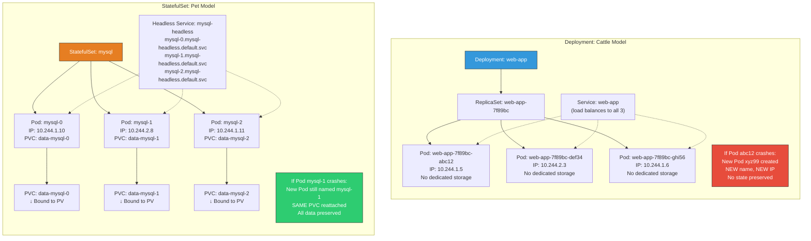
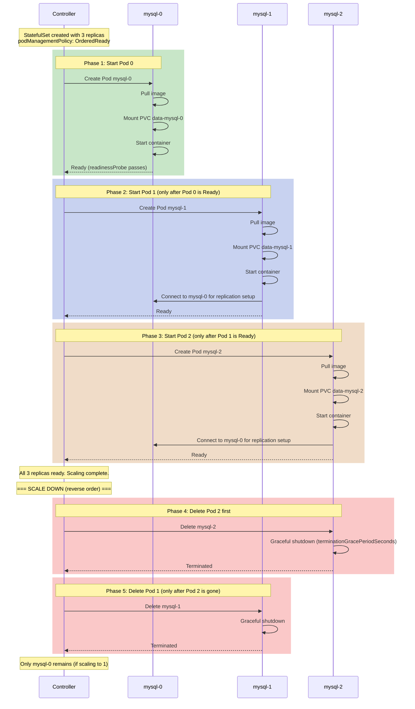

# File 09: StatefulSets

**Topic:** StatefulSets — managing stateful applications with stable network identities, persistent storage, and ordered deployment/scaling.

**WHY THIS MATTERS:** Databases, message queues, and distributed storage systems need guarantees that Deployments cannot provide: stable hostnames that survive restarts, persistent volumes that follow specific Pods, and controlled ordering for startup and shutdown. StatefulSets are how Kubernetes runs stateful workloads like MySQL, Kafka, Elasticsearch, and Redis clusters.

---

## Story: The Joint Family Home

Imagine a large Indian joint family living in a traditional ancestral home — a big house where grandparents, parents, uncles, aunts, and children all live together under one roof.

**The house is the StatefulSet.** It manages a fixed number of family members (Pods), and each member has a unique identity.

**Each family member has a fixed room** — Dada gets Room 0, Papa gets Room 1, Chacha gets Room 2. These are **stable network identities**. If Papa goes on a business trip (Pod restart), Room 1 stays reserved for him. Nobody else takes it. When he returns, he gets the same room back — this is stable hostname persistence (`web-0`, `web-1`, `web-2`).

**Each family member has a personal locker** — a steel almirah in their room where they keep their valuables. Even if the room is repainted or the furniture is changed (container restart), the almirah and its contents remain untouched. This is the **PersistentVolumeClaim** — each Pod gets its own dedicated storage that persists across restarts.

**The eldest is served first** — when dinner is served, Dada (Pod-0) gets served first, then Papa (Pod-1), then Chacha (Pod-2). Nobody starts eating until the person before them has been served and has started. This is **ordered startup**. When the meal is over, the youngest leaves the table first — Chacha (Pod-2), then Papa (Pod-1), then Dada (Pod-0). This is **ordered shutdown** — reverse order.

**The family register (headless Service)** — the neighborhood knows the family by name. If you ask "Where does Papa live?", anyone can tell you "Room 1 in the Sharma house." The headless Service provides this DNS-based discovery: `web-1.web-headless.default.svc.cluster.local`.

---

## Example Block 1 — Deployment vs StatefulSet

### Section 1 — When to Use Which

| Feature | Deployment | StatefulSet |
|---------|-----------|-------------|
| Pod names | Random hash (`web-7f89bc4d1-abc12`) | Ordered index (`web-0`, `web-1`, `web-2`) |
| Pod replacement | New Pod gets new name and IP | New Pod gets same name and reattaches same PVC |
| Storage | All Pods can share a volume or each gets ephemeral storage | Each Pod gets its own dedicated PersistentVolume |
| Startup order | All Pods start simultaneously | Pods start one by one, in order (0, 1, 2...) |
| Shutdown order | All Pods terminate simultaneously | Pods terminate in reverse order (2, 1, 0) |
| DNS records | Only through Service (round-robin) | Individual DNS per Pod via headless Service |
| Use cases | Stateless web apps, APIs, microservices | Databases, Kafka, Elasticsearch, Zookeeper |
| Scaling | Add/remove any Pod | Add next index / remove highest index |

**WHY:** The key insight is **identity**. Deployments treat Pods as interchangeable cattle. StatefulSets treat Pods as pets with names, assigned storage, and defined order.

### Section 2 — Visual Comparison



---

## Example Block 2 — Headless Service and Stable DNS

### Section 1 — What Is a Headless Service

A headless Service is a Service with `clusterIP: None`. Instead of getting a single virtual IP that load-balances across Pods, DNS returns the individual Pod IPs.

**WHY:** StatefulSets require a headless Service because each Pod needs its own addressable DNS name. A regular Service only gives you `service-name.namespace.svc.cluster.local` which round-robins. A headless Service gives you `pod-name.service-name.namespace.svc.cluster.local` for each individual Pod.

```yaml
# WHY: The headless Service MUST be created BEFORE the StatefulSet
apiVersion: v1
kind: Service
metadata:
  name: mysql-headless
  labels:
    app: mysql
spec:
  clusterIP: None              # WHY: This makes it headless — no virtual IP, DNS returns Pod IPs
  selector:
    app: mysql                 # WHY: Matches the StatefulSet's Pod labels
  ports:
    - port: 3306
      targetPort: 3306
      name: mysql              # WHY: Named ports are required for StatefulSet headless Services
```

### Section 2 — DNS Records Created

When you have a StatefulSet named `mysql` with 3 replicas and a headless Service named `mysql-headless`:

| DNS Name | Resolves To |
|----------|------------|
| `mysql-headless.default.svc.cluster.local` | All Pod IPs (A records for each) |
| `mysql-0.mysql-headless.default.svc.cluster.local` | Pod `mysql-0`'s IP only |
| `mysql-1.mysql-headless.default.svc.cluster.local` | Pod `mysql-1`'s IP only |
| `mysql-2.mysql-headless.default.svc.cluster.local` | Pod `mysql-2`'s IP only |

```bash
# SYNTAX: Test DNS resolution from inside the cluster
kubectl run dns-test --image=busybox:1.36 --rm -it --restart=Never -- nslookup mysql-headless.default.svc.cluster.local

# EXPECTED OUTPUT:
# Server:    10.96.0.10
# Address:   10.96.0.10:53
#
# Name:      mysql-headless.default.svc.cluster.local
# Address:   10.244.1.10
# Address:   10.244.2.8
# Address:   10.244.1.11

# SYNTAX: Resolve a specific Pod's DNS
kubectl run dns-test2 --image=busybox:1.36 --rm -it --restart=Never -- nslookup mysql-0.mysql-headless.default.svc.cluster.local

# EXPECTED OUTPUT:
# Server:    10.96.0.10
# Address:   10.96.0.10:53
#
# Name:      mysql-0.mysql-headless.default.svc.cluster.local
# Address:   10.244.1.10
```

**WHY:** This individual Pod DNS is critical for distributed systems. A MySQL replica can be configured to replicate from `mysql-0.mysql-headless` (the primary). Kafka brokers can advertise their individual hostnames. Elasticsearch nodes can discover each other by name.

---

## Example Block 3 — StatefulSet YAML Deep Dive

### Section 1 — Complete StatefulSet Manifest

```yaml
apiVersion: apps/v1
kind: StatefulSet
metadata:
  name: mysql
  labels:
    app: mysql
spec:
  serviceName: mysql-headless          # WHY: REQUIRED — must match the headless Service name
  replicas: 3                          # WHY: Creates mysql-0, mysql-1, mysql-2
  podManagementPolicy: OrderedReady    # WHY: Default — Pods start in order, one at a time

  selector:
    matchLabels:
      app: mysql                       # WHY: Must match template labels (same as Deployment)

  updateStrategy:
    type: RollingUpdate                # WHY: Default — updates Pods in reverse order (2, 1, 0)
    rollingUpdate:
      partition: 0                     # WHY: Update all Pods (set higher to do canary updates)

  template:
    metadata:
      labels:
        app: mysql
    spec:
      terminationGracePeriodSeconds: 30   # WHY: Give MySQL time to flush buffers on shutdown

      containers:
        - name: mysql
          image: mysql:8.0
          ports:
            - containerPort: 3306
              name: mysql
          env:
            - name: MYSQL_ROOT_PASSWORD
              valueFrom:
                secretKeyRef:
                  name: mysql-secret
                  key: root-password       # WHY: Never hardcode passwords in YAML

          volumeMounts:
            - name: data
              mountPath: /var/lib/mysql     # WHY: MySQL data directory — must be persistent

          resources:
            requests:
              memory: "256Mi"
              cpu: "250m"
            limits:
              memory: "512Mi"
              cpu: "500m"

          readinessProbe:
            exec:
              command:
                - mysqladmin
                - ping
                - -h
                - localhost
            initialDelaySeconds: 15
            periodSeconds: 10

          livenessProbe:
            exec:
              command:
                - mysqladmin
                - ping
                - -h
                - localhost
            initialDelaySeconds: 30
            periodSeconds: 15

  # WHY: volumeClaimTemplates creates a UNIQUE PVC for each Pod
  # mysql-0 gets PVC "data-mysql-0", mysql-1 gets PVC "data-mysql-1", etc.
  volumeClaimTemplates:
    - metadata:
        name: data                         # WHY: This name is used as a prefix: data-<pod-name>
      spec:
        accessModes:
          - ReadWriteOnce                  # WHY: Each Pod gets exclusive access to its volume
        storageClassName: standard         # WHY: Use the default storage class (or specify your own)
        resources:
          requests:
            storage: 10Gi                  # WHY: Each Pod gets its own 10Gi volume
```

### Section 2 — Key Differences from Deployment YAML

| Field | Deployment | StatefulSet |
|-------|-----------|-------------|
| `serviceName` | Not used | Required — links to headless Service |
| `podManagementPolicy` | Not applicable | `OrderedReady` (default) or `Parallel` |
| `volumeClaimTemplates` | Not available | Creates per-Pod PVCs automatically |
| `updateStrategy` | `strategy` field | `updateStrategy` field (different structure) |
| Pod naming | Random hash suffix | Sequential index (0, 1, 2...) |

---

## Example Block 4 — Ordered Startup and Shutdown

### Section 1 — How Ordering Works



### Section 2 — Parallel Pod Management

```yaml
apiVersion: apps/v1
kind: StatefulSet
metadata:
  name: cache-cluster
spec:
  serviceName: cache-headless
  replicas: 5
  podManagementPolicy: Parallel    # WHY: Start all Pods at once — no ordering needed
  selector:
    matchLabels:
      app: cache
  template:
    metadata:
      labels:
        app: cache
    spec:
      containers:
        - name: redis
          image: redis:7.2
          ports:
            - containerPort: 6379
          resources:
            requests:
              memory: "64Mi"
              cpu: "100m"
            limits:
              memory: "128Mi"
              cpu: "250m"
  volumeClaimTemplates:
    - metadata:
        name: data
      spec:
        accessModes: ["ReadWriteOnce"]
        resources:
          requests:
            storage: 5Gi
```

**WHY:** Use `Parallel` when your Pods do not depend on each other during startup. This makes scaling much faster because all Pods start simultaneously, just like a Deployment. You still get stable names and dedicated PVCs — just without the ordering guarantee.

### Section 3 — Observing Startup Order

```bash
# SYNTAX: Watch the StatefulSet create Pods in order
kubectl get pods -l app=mysql -w

# EXPECTED OUTPUT:
# NAME      READY   STATUS    RESTARTS   AGE
# mysql-0   0/1     Pending   0          0s
# mysql-0   0/1     ContainerCreating   0   2s
# mysql-0   0/1     Running   0          5s
# mysql-0   1/1     Running   0          20s     ← mysql-0 is Ready
# mysql-1   0/1     Pending   0          0s      ← NOW mysql-1 starts
# mysql-1   0/1     ContainerCreating   0   2s
# mysql-1   0/1     Running   0          5s
# mysql-1   1/1     Running   0          22s     ← mysql-1 is Ready
# mysql-2   0/1     Pending   0          0s      ← NOW mysql-2 starts
# mysql-2   0/1     ContainerCreating   0   2s
# mysql-2   0/1     Running   0          5s
# mysql-2   1/1     Running   0          18s     ← All ready

# SYNTAX: Check StatefulSet status
kubectl get statefulset mysql

# EXPECTED OUTPUT:
# NAME    READY   AGE
# mysql   3/3     2m

# SYNTAX: Check the PVCs created by volumeClaimTemplates
kubectl get pvc -l app=mysql

# EXPECTED OUTPUT:
# NAME           STATUS   VOLUME                                     CAPACITY   ACCESS MODES   STORAGECLASS   AGE
# data-mysql-0   Bound    pvc-abc12345-6789-0123-4567-890abcdef01    10Gi       RWO            standard       2m
# data-mysql-1   Bound    pvc-def12345-6789-0123-4567-890abcdef02    10Gi       RWO            standard       90s
# data-mysql-2   Bound    pvc-ghi12345-6789-0123-4567-890abcdef03    10Gi       RWO            standard       60s
```

---

## Example Block 5 — Volume Claim Templates and Data Persistence

### Section 1 — PVC Behavior on Pod Deletion

When a StatefulSet Pod is deleted (or the StatefulSet is scaled down), the PVC is **NOT** deleted. It is retained. When the Pod is recreated (or scaled back up), it reattaches to the same PVC.

**WHY:** This is the entire point of StatefulSets for databases. If you delete `mysql-1`, it loses its process state (in-memory cache, connections), but when `mysql-1` comes back, it reattaches to `data-mysql-1` and finds all its data files intact. This is how database Pods survive restarts.

```bash
# Demonstration: Delete a Pod and watch it come back with the same PVC

# Step 1: Check current state
kubectl get pods -l app=mysql -o wide

# EXPECTED OUTPUT:
# NAME      READY   STATUS    IP            NODE
# mysql-0   1/1     Running   10.244.1.10   worker-1
# mysql-1   1/1     Running   10.244.2.8    worker-2
# mysql-2   1/1     Running   10.244.1.11   worker-1

# Step 2: Delete mysql-1
kubectl delete pod mysql-1

# EXPECTED OUTPUT:
# pod "mysql-1" deleted

# Step 3: Watch it come back
kubectl get pods -l app=mysql -w

# EXPECTED OUTPUT:
# NAME      READY   STATUS        RESTARTS   AGE
# mysql-0   1/1     Running       0          10m
# mysql-1   1/1     Terminating   0          10m
# mysql-2   1/1     Running       0          10m
# mysql-1   0/1     Pending       0          0s
# mysql-1   0/1     ContainerCreating   0   2s
# mysql-1   0/1     Running       0          5s
# mysql-1   1/1     Running       0          20s

# Step 4: Verify it reattached the SAME PVC
kubectl get pod mysql-1 -o jsonpath='{.spec.volumes[?(@.name=="data")].persistentVolumeClaim.claimName}'

# EXPECTED OUTPUT:
# data-mysql-1

# The PVC was never deleted — the new Pod reattached to it
kubectl get pvc data-mysql-1

# EXPECTED OUTPUT:
# NAME           STATUS   VOLUME                                     CAPACITY   ACCESS MODES   STORAGECLASS   AGE
# data-mysql-1   Bound    pvc-def12345-6789-0123-4567-890abcdef02    10Gi       RWO            standard       12m
```

### Section 2 — Manual PVC Cleanup

```bash
# IMPORTANT: When you delete a StatefulSet, PVCs are NOT automatically deleted.
# This is a safety feature — you never want to accidentally lose database data.

kubectl delete statefulset mysql

# EXPECTED OUTPUT:
# statefulset.apps "mysql" deleted

# PVCs still exist
kubectl get pvc -l app=mysql

# EXPECTED OUTPUT:
# NAME           STATUS   VOLUME         CAPACITY   ACCESS MODES   STORAGECLASS   AGE
# data-mysql-0   Bound    pvc-abc12...   10Gi       RWO            standard       15m
# data-mysql-1   Bound    pvc-def12...   10Gi       RWO            standard       15m
# data-mysql-2   Bound    pvc-ghi12...   10Gi       RWO            standard       15m

# You must manually delete PVCs when you are certain the data is no longer needed
kubectl delete pvc data-mysql-0 data-mysql-1 data-mysql-2

# EXPECTED OUTPUT:
# persistentvolumeclaim "data-mysql-0" deleted
# persistentvolumeclaim "data-mysql-1" deleted
# persistentvolumeclaim "data-mysql-2" deleted
```

**WHY:** This "PVCs survive deletion" behavior catches many beginners off guard. They delete and recreate a StatefulSet and wonder why old data appears. Or they forget to clean up PVCs and waste storage. Always check PVCs after deleting StatefulSets.

---

## Example Block 6 — Update Strategies and Partitioned Rollouts

### Section 1 — RollingUpdate with Partition

The `partition` parameter allows you to do canary-style updates with StatefulSets. Only Pods with an ordinal **greater than or equal to** the partition value are updated.

**WHY:** This is critical for databases. You want to update one replica first, verify it works, then update the rest. The partition parameter gives you this control.

```yaml
apiVersion: apps/v1
kind: StatefulSet
metadata:
  name: mysql
spec:
  serviceName: mysql-headless
  replicas: 5
  updateStrategy:
    type: RollingUpdate
    rollingUpdate:
      partition: 3             # WHY: Only update Pods 3, 4 (ordinal >= 3)
                               # Pods 0, 1, 2 stay on the old version
  selector:
    matchLabels:
      app: mysql
  template:
    metadata:
      labels:
        app: mysql
    spec:
      containers:
        - name: mysql
          image: mysql:8.0.35   # New version
          ports:
            - containerPort: 3306
          resources:
            requests:
              memory: "256Mi"
              cpu: "250m"
            limits:
              memory: "512Mi"
              cpu: "500m"
  volumeClaimTemplates:
    - metadata:
        name: data
      spec:
        accessModes: ["ReadWriteOnce"]
        resources:
          requests:
            storage: 10Gi
```

```bash
# Partitioned update behavior:
# - mysql-4: Updated to mysql:8.0.35
# - mysql-3: Updated to mysql:8.0.35
# - mysql-2: Stays on mysql:8.0.34 (ordinal 2 < partition 3)
# - mysql-1: Stays on mysql:8.0.34
# - mysql-0: Stays on mysql:8.0.34

# To roll out to all pods, set partition to 0:
kubectl patch statefulset mysql -p '{"spec":{"updateStrategy":{"rollingUpdate":{"partition":0}}}}'

# EXPECTED OUTPUT:
# statefulset.apps/mysql patched

# Now mysql-2, mysql-1, mysql-0 will be updated (in reverse order: 2, 1, 0)
```

### Section 2 — OnDelete Strategy

```yaml
apiVersion: apps/v1
kind: StatefulSet
metadata:
  name: legacy-db
spec:
  serviceName: legacy-db-headless
  replicas: 3
  updateStrategy:
    type: OnDelete              # WHY: Pods are NOT auto-updated; you must manually delete them
  selector:
    matchLabels:
      app: legacy-db
  template:
    metadata:
      labels:
        app: legacy-db
    spec:
      containers:
        - name: postgres
          image: postgres:16
          ports:
            - containerPort: 5432
          resources:
            requests:
              memory: "256Mi"
              cpu: "250m"
            limits:
              memory: "512Mi"
              cpu: "500m"
  volumeClaimTemplates:
    - metadata:
        name: pgdata
      spec:
        accessModes: ["ReadWriteOnce"]
        resources:
          requests:
            storage: 20Gi
```

```bash
# With OnDelete strategy:
# 1. You update the StatefulSet template (e.g., new image version)
# 2. Nothing happens — existing Pods keep running the old version
# 3. You manually delete pods one by one when YOU decide it's time
# 4. The replacement Pod gets the new template

kubectl delete pod legacy-db-2    # Update Pod 2 first
# Wait, verify it works...
kubectl delete pod legacy-db-1    # Then Pod 1
# Wait, verify...
kubectl delete pod legacy-db-0    # Finally the primary
```

**WHY:** The `OnDelete` strategy gives you maximum control. It is useful when you want to coordinate updates with manual verification steps, database failovers, or maintenance windows.

---

## Example Block 7 — Scaling StatefulSets

### Section 1 — Scale Up and Scale Down Behavior

```bash
# SYNTAX: Scale up a StatefulSet
kubectl scale statefulset mysql --replicas=5

# EXPECTED OUTPUT:
# statefulset.apps/mysql scaled

# Behavior:
# - mysql-3 is created (with new PVC data-mysql-3)
# - After mysql-3 is Ready, mysql-4 is created (with new PVC data-mysql-4)
# - Ordered, one at a time (unless podManagementPolicy: Parallel)

# SYNTAX: Scale down a StatefulSet
kubectl scale statefulset mysql --replicas=3

# EXPECTED OUTPUT:
# statefulset.apps/mysql scaled

# Behavior:
# - mysql-4 is terminated first
# - After mysql-4 is fully gone, mysql-3 is terminated
# - PVCs data-mysql-3 and data-mysql-4 are RETAINED (not deleted)
# - If you scale back to 5, mysql-3 reattaches data-mysql-3 and mysql-4 reattaches data-mysql-4
```

### Section 2 — Verifying PVC Retention After Scale Down

```bash
# After scaling from 5 to 3:
kubectl get pvc -l app=mysql

# EXPECTED OUTPUT:
# NAME           STATUS   VOLUME         CAPACITY   ACCESS MODES   STORAGECLASS   AGE
# data-mysql-0   Bound    pvc-abc12...   10Gi       RWO            standard       30m
# data-mysql-1   Bound    pvc-def12...   10Gi       RWO            standard       30m
# data-mysql-2   Bound    pvc-ghi12...   10Gi       RWO            standard       30m
# data-mysql-3   Bound    pvc-jkl12...   10Gi       RWO            standard       10m   ← RETAINED
# data-mysql-4   Bound    pvc-mno12...   10Gi       RWO            standard       10m   ← RETAINED

# Even though mysql-3 and mysql-4 don't exist, their PVCs remain.
# Scaling back to 5 will reuse these PVCs.
```

**WHY:** PVC retention during scale-down is a safety feature. Database data is precious. If you accidentally scale down and then scale back up, you want the data to still be there.

---

## Example Block 8 — Production StatefulSet Checklist

### Section 1 — Complete Production Example

```yaml
# Step 1: Secret for database credentials
apiVersion: v1
kind: Secret
metadata:
  name: mysql-secret
type: Opaque
data:
  root-password: bXlzcWxyb290cGFzcw==    # WHY: base64-encoded "mysqlrootpass"

---
# Step 2: Headless Service (MUST exist before StatefulSet)
apiVersion: v1
kind: Service
metadata:
  name: mysql-headless
  labels:
    app: mysql
spec:
  clusterIP: None
  selector:
    app: mysql
  ports:
    - port: 3306
      targetPort: 3306
      name: mysql

---
# Step 3: Regular Service for read traffic (optional)
apiVersion: v1
kind: Service
metadata:
  name: mysql-read
  labels:
    app: mysql
spec:
  selector:
    app: mysql
  ports:
    - port: 3306
      targetPort: 3306
      name: mysql
  # WHY: This regular (non-headless) Service load-balances reads across all replicas

---
# Step 4: StatefulSet
apiVersion: apps/v1
kind: StatefulSet
metadata:
  name: mysql
  labels:
    app: mysql
spec:
  serviceName: mysql-headless
  replicas: 3
  podManagementPolicy: OrderedReady
  updateStrategy:
    type: RollingUpdate
    rollingUpdate:
      partition: 0
  selector:
    matchLabels:
      app: mysql
  template:
    metadata:
      labels:
        app: mysql
    spec:
      terminationGracePeriodSeconds: 60    # WHY: Give MySQL time to flush all buffers

      affinity:
        podAntiAffinity:
          requiredDuringSchedulingIgnoredDuringExecution:
            - labelSelector:
                matchExpressions:
                  - key: app
                    operator: In
                    values:
                      - mysql
              topologyKey: kubernetes.io/hostname
          # WHY: NEVER put two MySQL Pods on the same node — node failure kills both

      containers:
        - name: mysql
          image: mysql:8.0.35
          ports:
            - containerPort: 3306
              name: mysql
          env:
            - name: MYSQL_ROOT_PASSWORD
              valueFrom:
                secretKeyRef:
                  name: mysql-secret
                  key: root-password
          volumeMounts:
            - name: data
              mountPath: /var/lib/mysql
            - name: config
              mountPath: /etc/mysql/conf.d
          resources:
            requests:
              memory: "512Mi"
              cpu: "500m"
            limits:
              memory: "1Gi"
              cpu: "1000m"
          readinessProbe:
            exec:
              command: ["mysqladmin", "ping", "-h", "localhost"]
            initialDelaySeconds: 15
            periodSeconds: 10
          livenessProbe:
            exec:
              command: ["mysqladmin", "ping", "-h", "localhost"]
            initialDelaySeconds: 30
            periodSeconds: 15

      volumes:
        - name: config
          configMap:
            name: mysql-config           # WHY: Custom MySQL configuration

  volumeClaimTemplates:
    - metadata:
        name: data
      spec:
        accessModes: ["ReadWriteOnce"]
        storageClassName: standard
        resources:
          requests:
            storage: 50Gi
```

---

## Key Takeaways

1. **StatefulSets give Pods stable identities** — Pod names are deterministic (`web-0`, `web-1`, `web-2`), not random hashes. This identity survives restarts.

2. **A headless Service is required** — it provides individual DNS records for each Pod (`pod-name.service-name.namespace.svc.cluster.local`), enabling direct Pod-to-Pod communication.

3. **volumeClaimTemplates create per-Pod PVCs** — each Pod gets its own dedicated PersistentVolumeClaim. PVCs are NOT deleted when Pods or StatefulSets are deleted.

4. **Ordered startup ensures dependencies are met** — Pod-0 must be Ready before Pod-1 starts. This matters for primary/replica database setups where replicas must connect to the primary during initialization.

5. **Shutdown happens in reverse order** — Pod-N is terminated first, then Pod-(N-1), ensuring the primary (Pod-0) is the last to go. This minimizes disruption to the cluster.

6. **The `partition` parameter enables canary updates** — set it high to update only a few Pods, verify they work, then lower it to update the rest.

7. **PVCs survive everything** — Pod deletion, StatefulSet deletion, scale-down. You must manually delete PVCs when you are certain the data is no longer needed.

8. **Use `podManagementPolicy: Parallel`** when ordering does not matter — this makes scaling as fast as a Deployment while keeping stable names and PVCs.

9. **Always use podAntiAffinity for databases** — putting two database Pods on the same node defeats the purpose of having replicas. A single node failure would lose multiple replicas.

10. **StatefulSets are for stateful workloads only** — if your app does not need stable names, ordered startup, or dedicated storage, use a Deployment instead. It is simpler and more flexible.
