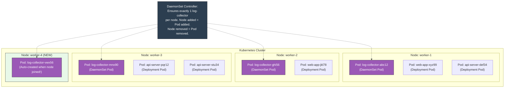
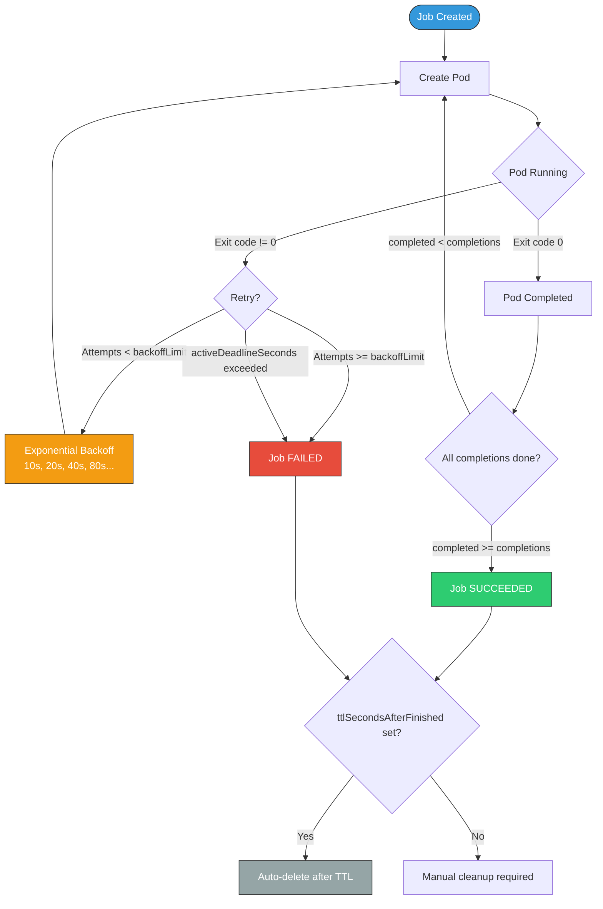

# File 10: DaemonSets, Jobs, and CronJobs

**Topic:** Understanding DaemonSets (one Pod per node), Jobs (run-to-completion tasks), and CronJobs (scheduled recurring tasks) — the specialized workload controllers for infrastructure agents, batch processing, and scheduled operations.

**WHY THIS MATTERS:** Not everything in Kubernetes is a long-running web server. You need log collectors on every node (DaemonSet), database backups that run once (Job), and report generators that run every night (CronJob). These three workload types handle everything that Deployments and StatefulSets cannot.

---

## Story: The Municipal Workers

Think of a well-organized Indian municipality managing a city.

**The sweeper (safai karamchari) is a DaemonSet.** Every street in the city must have exactly one sweeper. When a new street is built (a new node joins the cluster), a sweeper is automatically assigned. When a street is demolished (node removed), that sweeper is let go. You do not need 5 sweepers on one street and 0 on another — you need exactly one per street. That is DaemonSet: one Pod per node, guaranteed.

**The election worker is a Job.** During elections, the municipality hires temporary workers to set up polling booths, manage voter lines, and count votes. The task has a clear beginning and end. Once the votes are counted and results declared, the workers go home. If a worker falls ill mid-count (container crash), a replacement is sent to finish the task. The municipality ensures the work is completed — it does not care how many attempts it takes (within a limit). That is a Job: run-to-completion with retries.

**The doodhwala (milkman) is a CronJob.** Every morning at 6 AM, the doodhwala arrives at your doorstep with fresh milk. He does not come once — he comes every single day, on schedule. If he is already at your neighbor's house when your time arrives (previous run still active), different rules apply: he might skip your delivery today (Forbid), send a helper simultaneously (Allow), or replace the delayed delivery (Replace). That is CronJob: a Job triggered on a cron schedule.

---

## Example Block 1 — DaemonSets: One Pod Per Node

### Section 1 — How DaemonSets Work

A DaemonSet ensures that a copy of a Pod runs on every node in the cluster (or on a subset of nodes selected by nodeSelector or affinity).

**WHY:** DaemonSets are used for cluster-wide infrastructure: log collection (Fluentd, Filebeat), metrics collection (Node Exporter, Datadog Agent), network plugins (Calico, Cilium), and storage drivers (CSI node plugins).

```yaml
apiVersion: apps/v1
kind: DaemonSet
metadata:
  name: log-collector
  namespace: monitoring
  labels:
    app: log-collector
spec:
  selector:
    matchLabels:
      app: log-collector              # WHY: Identifies which Pods belong to this DaemonSet

  updateStrategy:
    type: RollingUpdate               # WHY: Update one node at a time (alternative: OnDelete)
    rollingUpdate:
      maxUnavailable: 1               # WHY: Only update 1 node at a time to maintain log coverage
      # maxSurge is NOT available for DaemonSets — you cannot have 2 pods on one node

  template:
    metadata:
      labels:
        app: log-collector
    spec:
      # WHY: DaemonSet pods often need host-level access
      tolerations:
        - key: node-role.kubernetes.io/control-plane
          operator: Exists
          effect: NoSchedule
          # WHY: Run on control-plane nodes too (default taints would prevent this)

      containers:
        - name: fluentd
          image: fluent/fluentd:v1.16
          ports:
            - containerPort: 24224
              name: forward
              protocol: TCP

          volumeMounts:
            - name: varlog
              mountPath: /var/log        # WHY: Read host's /var/log directory for container logs
              readOnly: true
            - name: varlibdockercontainers
              mountPath: /var/lib/docker/containers  # WHY: Read container log files directly
              readOnly: true
            - name: fluentd-config
              mountPath: /fluentd/etc

          resources:
            requests:
              memory: "128Mi"
              cpu: "100m"
            limits:
              memory: "256Mi"
              cpu: "250m"

      volumes:
        - name: varlog
          hostPath:
            path: /var/log               # WHY: Mount the node's actual log directory
        - name: varlibdockercontainers
          hostPath:
            path: /var/lib/docker/containers  # WHY: Access container runtime logs
        - name: fluentd-config
          configMap:
            name: fluentd-config
```

### Section 2 — One Pod Per Node Visualization



### Section 3 — DaemonSet Management Commands

```bash
# SYNTAX: Create a DaemonSet
kubectl apply -f daemonset.yaml

# EXPECTED OUTPUT:
# daemonset.apps/log-collector created

# SYNTAX: Check DaemonSet status
kubectl get daemonset -n monitoring

# EXPECTED OUTPUT:
# NAME            DESIRED   CURRENT   READY   UP-TO-DATE   AVAILABLE   NODE SELECTOR   AGE
# log-collector   4         4         4       4            4           <none>           30s

# COLUMN MEANINGS:
#   DESIRED      = Number of nodes that should run a Pod
#   CURRENT      = Number of Pods currently created
#   READY        = Number of Pods passing readiness probe
#   UP-TO-DATE   = Number of Pods matching the current template
#   AVAILABLE    = Number of Pods available (ready for minReadySeconds)
#   NODE SELECTOR = Any node filtering applied

# SYNTAX: Check which nodes have DaemonSet pods
kubectl get pods -n monitoring -l app=log-collector -o wide

# EXPECTED OUTPUT:
# NAME                    READY   STATUS    RESTARTS   AGE   IP           NODE
# log-collector-abc12     1/1     Running   0          30s   10.244.1.2   worker-1
# log-collector-def34     1/1     Running   0          30s   10.244.2.2   worker-2
# log-collector-ghi56     1/1     Running   0          30s   10.244.3.2   worker-3
# log-collector-jkl78     1/1     Running   0          15s   10.244.4.2   worker-4

# SYNTAX: Describe DaemonSet for detailed info
kubectl describe daemonset log-collector -n monitoring

# EXPECTED OUTPUT (relevant section):
# Desired Number of Nodes Scheduled: 4
# Current Number of Nodes Scheduled: 4
# Number of Nodes Scheduled with Up-to-date Pods: 4
# Number of Nodes Scheduled with Available Pods: 4
# Number of Nodes Misscheduled: 0
```

### Section 4 — Targeting Specific Nodes

```yaml
apiVersion: apps/v1
kind: DaemonSet
metadata:
  name: gpu-monitor
spec:
  selector:
    matchLabels:
      app: gpu-monitor
  template:
    metadata:
      labels:
        app: gpu-monitor
    spec:
      nodeSelector:
        accelerator: nvidia-gpu       # WHY: Only run on nodes with GPU hardware
      containers:
        - name: gpu-exporter
          image: nvidia/dcgm-exporter:3.2.6
          resources:
            requests:
              memory: "64Mi"
              cpu: "50m"
            limits:
              memory: "128Mi"
              cpu: "100m"
```

```bash
# Label a node to make it eligible for the DaemonSet
kubectl label node worker-2 accelerator=nvidia-gpu

# EXPECTED OUTPUT:
# node/worker-2 labeled

# Now the DaemonSet will schedule a Pod only on worker-2
kubectl get pods -l app=gpu-monitor -o wide

# EXPECTED OUTPUT:
# NAME                READY   STATUS    RESTARTS   AGE   IP           NODE
# gpu-monitor-xyz99   1/1     Running   0          10s   10.244.2.5   worker-2
```

**WHY:** Not all DaemonSets should run on all nodes. GPU monitors belong only on GPU nodes. SSD-specific storage agents belong only on SSD nodes. Use `nodeSelector` or `nodeAffinity` to target the right subset.

---

## Example Block 2 — DaemonSet Update Strategies

### Section 1 — RollingUpdate vs OnDelete

| Strategy | Behavior | Use Case |
|----------|----------|----------|
| **RollingUpdate** (default) | Automatically replaces old Pods one at a time | Most DaemonSets — log collectors, monitoring agents |
| **OnDelete** | Does NOT auto-update; you manually delete Pods to trigger update | Critical infrastructure — network plugins, storage drivers |

```bash
# SYNTAX: Update a DaemonSet image (with RollingUpdate strategy)
kubectl set image daemonset/log-collector fluentd=fluent/fluentd:v1.17 -n monitoring

# EXPECTED OUTPUT:
# daemonset.apps/log-collector image updated

# Watch the rolling update (one node at a time)
kubectl rollout status daemonset/log-collector -n monitoring

# EXPECTED OUTPUT:
# Waiting for daemon set "log-collector" rollout to finish: 1 out of 4 new pods have been updated...
# Waiting for daemon set "log-collector" rollout to finish: 2 out of 4 new pods have been updated...
# Waiting for daemon set "log-collector" rollout to finish: 3 out of 4 new pods have been updated...
# daemon set "log-collector" successfully rolled out

# SYNTAX: Rollback a DaemonSet
kubectl rollout undo daemonset/log-collector -n monitoring

# EXPECTED OUTPUT:
# daemonset.apps/log-collector rolled back

# SYNTAX: Check rollout history
kubectl rollout history daemonset/log-collector -n monitoring

# EXPECTED OUTPUT:
# daemonset.apps/log-collector
# REVISION  CHANGE-CAUSE
# 1         <none>
# 3         <none>
```

**WHY:** DaemonSets support the same `rollout` commands as Deployments — `status`, `history`, `undo`. The key difference is that `maxSurge` is not available (you cannot have 2 DaemonSet Pods on one node), so updates are limited by `maxUnavailable` only.

---

## Example Block 3 — Jobs: Run-to-Completion

### Section 1 — Job Basics

A Job creates one or more Pods and ensures a specified number of them successfully terminate. Unlike Deployments, a Job does not restart completed Pods — once the work is done, the Pod stays in `Completed` status.

**WHY:** Jobs are for batch processing, database migrations, report generation, data imports, and any task that has a definitive end. You do not want a migration script to restart forever like a web server.

```yaml
apiVersion: batch/v1
kind: Job
metadata:
  name: db-migration
  labels:
    app: db-migration
spec:
  completions: 1                     # WHY: Run exactly 1 successful completion
  parallelism: 1                     # WHY: Run 1 Pod at a time
  backoffLimit: 4                    # WHY: Retry up to 4 times on failure before giving up
  activeDeadlineSeconds: 300         # WHY: Kill the Job if it runs longer than 5 minutes
  ttlSecondsAfterFinished: 3600     # WHY: Auto-delete the Job 1 hour after completion (cleanup)

  template:
    metadata:
      labels:
        app: db-migration
    spec:
      restartPolicy: Never           # WHY: REQUIRED for Jobs — either Never or OnFailure
      containers:
        - name: migrate
          image: myapp/db-migrate:v2.1
          command: ["python", "migrate.py", "--target", "v2.1"]
          env:
            - name: DB_HOST
              value: "mysql-0.mysql-headless.default.svc.cluster.local"
            - name: DB_PASSWORD
              valueFrom:
                secretKeyRef:
                  name: db-credentials
                  key: password
          resources:
            requests:
              memory: "128Mi"
              cpu: "200m"
            limits:
              memory: "256Mi"
              cpu: "500m"
```

### Section 2 — Job Lifecycle Flowchart



### Section 3 — Job Management Commands

```bash
# SYNTAX: Create a Job
kubectl apply -f job.yaml

# EXPECTED OUTPUT:
# job.batch/db-migration created

# SYNTAX: Check Job status
kubectl get jobs

# EXPECTED OUTPUT:
# NAME           COMPLETIONS   DURATION   AGE
# db-migration   0/1           10s        10s

# After completion:
# NAME           COMPLETIONS   DURATION   AGE
# db-migration   1/1           45s        50s

# SYNTAX: Watch a Job's pod
kubectl get pods -l app=db-migration -w

# EXPECTED OUTPUT:
# NAME                   READY   STATUS              RESTARTS   AGE
# db-migration-abc12     0/1     ContainerCreating    0          2s
# db-migration-abc12     1/1     Running              0          5s
# db-migration-abc12     0/1     Completed            0          45s

# SYNTAX: View Job logs
kubectl logs job/db-migration

# FLAGS:
#   --follow    Stream logs in real-time
#   --tail=50   Show last 50 lines
#
# EXPECTED OUTPUT:
# Starting database migration to v2.1...
# Connected to mysql-0.mysql-headless.default.svc.cluster.local
# Running migration step 1/3: Adding new columns...
# Running migration step 2/3: Migrating data...
# Running migration step 3/3: Creating indexes...
# Migration completed successfully.

# SYNTAX: Describe Job for events and conditions
kubectl describe job db-migration

# EXPECTED OUTPUT (relevant section):
# Completions:    1
# Parallelism:    1
# Start Time:     Mon, 15 Jan 2024 10:30:00 +0530
# Completed At:   Mon, 15 Jan 2024 10:30:45 +0530
# Duration:       45s
# Pods Statuses:  0 Active / 1 Succeeded / 0 Failed

# SYNTAX: Delete a Job (and its Pods)
kubectl delete job db-migration

# EXPECTED OUTPUT:
# job.batch "db-migration" deleted

# SYNTAX: Create a quick one-off Job without YAML
kubectl create job test-job --image=busybox:1.36 -- echo "Hello from Job"

# EXPECTED OUTPUT:
# job.batch/test-job created
```

---

## Example Block 4 — Parallel Jobs

### Section 1 — Completions and Parallelism

Jobs can run multiple Pods in parallel for processing work queues or batch computations.

| Parameter | Meaning |
|-----------|---------|
| `completions` | Total number of successful Pod completions needed |
| `parallelism` | Maximum number of Pods running simultaneously |

**WHY:** If you need to process 100 images and each Pod handles one image, set `completions: 100, parallelism: 10` — Kubernetes will run 10 Pods at a time until all 100 are done.

```yaml
apiVersion: batch/v1
kind: Job
metadata:
  name: batch-processor
  labels:
    app: batch-processor
spec:
  completions: 9                     # WHY: Process 9 items total
  parallelism: 3                     # WHY: Run 3 Pods at a time (3 waves of 3)
  backoffLimit: 6                    # WHY: Allow 6 total failures across all Pods

  template:
    metadata:
      labels:
        app: batch-processor
    spec:
      restartPolicy: Never
      containers:
        - name: worker
          image: busybox:1.36
          command:
            - /bin/sh
            - -c
            - |
              echo "Processing item on $(hostname)"
              echo "Start time: $(date)"
              sleep $((RANDOM % 10 + 5))     # Simulate work (5-14 seconds)
              echo "Completed at: $(date)"
          resources:
            requests:
              memory: "32Mi"
              cpu: "50m"
            limits:
              memory: "64Mi"
              cpu: "100m"
```

### Section 2 — Watching Parallel Execution

```bash
# SYNTAX: Apply the parallel Job
kubectl apply -f batch-job.yaml

# Watch Pods being created in parallel
kubectl get pods -l app=batch-processor -w

# EXPECTED OUTPUT (illustrative):
# NAME                      READY   STATUS              RESTARTS   AGE
# batch-processor-abc12     0/1     ContainerCreating    0          1s
# batch-processor-def34     0/1     ContainerCreating    0          1s
# batch-processor-ghi56     0/1     ContainerCreating    0          1s     ← 3 at once (parallelism=3)
# batch-processor-abc12     1/1     Running              0          3s
# batch-processor-def34     1/1     Running              0          3s
# batch-processor-ghi56     1/1     Running              0          3s
# batch-processor-abc12     0/1     Completed            0          12s
# batch-processor-jkl78     0/1     ContainerCreating    0          1s     ← 4th Pod starts (slot freed)
# batch-processor-def34     0/1     Completed            0          15s
# batch-processor-mno90     0/1     ContainerCreating    0          1s     ← 5th Pod
# batch-processor-ghi56     0/1     Completed            0          18s
# batch-processor-pqr12     0/1     ContainerCreating    0          1s     ← 6th Pod
# ...continues until 9 completions

# Check Job progress
kubectl get job batch-processor

# EXPECTED OUTPUT (mid-run):
# NAME              COMPLETIONS   DURATION   AGE
# batch-processor   5/9           25s        25s

# EXPECTED OUTPUT (finished):
# NAME              COMPLETIONS   DURATION   AGE
# batch-processor   9/9           45s        50s

# View logs from all Pods
kubectl logs -l app=batch-processor --prefix

# FLAGS:
#   --prefix    Prepend Pod name to each log line
#   -l          Select Pods by label
#
# EXPECTED OUTPUT:
# [pod/batch-processor-abc12/worker] Processing item on batch-processor-abc12
# [pod/batch-processor-abc12/worker] Start time: Mon Jan 15 10:30:05 UTC 2024
# [pod/batch-processor-abc12/worker] Completed at: Mon Jan 15 10:30:12 UTC 2024
# [pod/batch-processor-def34/worker] Processing item on batch-processor-def34
# ...
```

### Section 3 — Failure Handling and BackoffLimit

```bash
# Example: Job with intentional failures to demonstrate backoffLimit
cat <<'EOF' > failing-job.yaml
apiVersion: batch/v1
kind: Job
metadata:
  name: flaky-job
spec:
  completions: 1
  parallelism: 1
  backoffLimit: 3               # Allow 3 retries
  template:
    spec:
      restartPolicy: Never      # Create new Pod for each retry (vs restarting same Pod)
      containers:
        - name: flaky
          image: busybox:1.36
          command: ["/bin/sh", "-c", "echo 'Attempting...' && exit 1"]   # Always fails
          resources:
            requests:
              memory: "32Mi"
              cpu: "50m"
            limits:
              memory: "64Mi"
              cpu: "100m"
EOF

kubectl apply -f failing-job.yaml

# Watch retries with exponential backoff
kubectl get pods -l job-name=flaky-job -w

# EXPECTED OUTPUT:
# NAME               READY   STATUS    RESTARTS   AGE
# flaky-job-abc12    0/1     Error     0          5s
# flaky-job-def34    0/1     Pending   0          15s     ← 10s backoff
# flaky-job-def34    0/1     Error     0          20s
# flaky-job-ghi56    0/1     Pending   0          40s     ← 20s backoff
# flaky-job-ghi56    0/1     Error     0          45s
# flaky-job-jkl78    0/1     Pending   0          85s     ← 40s backoff
# flaky-job-jkl78    0/1     Error     0          90s

# After backoffLimit is reached:
kubectl get job flaky-job

# EXPECTED OUTPUT:
# NAME        COMPLETIONS   DURATION   AGE
# flaky-job   0/1           2m         2m

kubectl describe job flaky-job | grep -A 3 "Conditions:"

# EXPECTED OUTPUT:
# Conditions:
#   Type    Status  Reason
#   ----    ------  ------
#   Failed  True    BackoffLimitExceeded
```

**WHY:** Understanding `backoffLimit` and exponential backoff is critical. Without `backoffLimit`, a failing Job would retry forever, wasting cluster resources. The exponential backoff (10s, 20s, 40s, 80s...) prevents thundering herd problems.

---

## Example Block 5 — CronJobs: Scheduled Tasks

### Section 1 — CronJob Basics

A CronJob creates Jobs on a time-based schedule, using the standard cron format.

```
# Cron format reference:
# ┌───────────── minute (0 - 59)
# │ ┌───────────── hour (0 - 23)
# │ │ ┌───────────── day of month (1 - 31)
# │ │ │ ┌───────────── month (1 - 12)
# │ │ │ │ ┌───────────── day of week (0 - 6, Sunday = 0)
# │ │ │ │ │
# * * * * *
```

| Schedule | Meaning |
|----------|---------|
| `*/5 * * * *` | Every 5 minutes |
| `0 * * * *` | Every hour at minute 0 |
| `0 6 * * *` | Daily at 6:00 AM |
| `0 0 * * 0` | Every Sunday at midnight |
| `0 0 1 * *` | First day of every month at midnight |
| `30 2 * * 1-5` | Weekdays at 2:30 AM |

```yaml
apiVersion: batch/v1
kind: CronJob
metadata:
  name: db-backup
  labels:
    app: db-backup
spec:
  schedule: "0 2 * * *"              # WHY: Run daily at 2:00 AM (low-traffic period)
  timeZone: "Asia/Kolkata"           # WHY: Use IST timezone (Kubernetes 1.27+)

  concurrencyPolicy: Forbid          # WHY: Never run 2 backups simultaneously
  successfulJobsHistoryLimit: 3      # WHY: Keep last 3 successful Job objects for debugging
  failedJobsHistoryLimit: 5          # WHY: Keep last 5 failed Job objects for investigation
  startingDeadlineSeconds: 600       # WHY: If missed by >10 minutes, skip this run
  suspend: false                     # WHY: Set to true to pause the CronJob without deleting it

  jobTemplate:
    spec:
      backoffLimit: 2                # WHY: Retry backup up to 2 times
      activeDeadlineSeconds: 3600    # WHY: Kill backup if it runs longer than 1 hour
      template:
        metadata:
          labels:
            app: db-backup
        spec:
          restartPolicy: OnFailure   # WHY: Restart the container in the same Pod on failure
          containers:
            - name: backup
              image: mysql:8.0
              command:
                - /bin/sh
                - -c
                - |
                  echo "Starting backup at $(date)"
                  mysqldump -h mysql-0.mysql-headless -u root -p"$MYSQL_ROOT_PASSWORD" --all-databases > /backup/dump-$(date +%Y%m%d-%H%M%S).sql
                  echo "Backup completed at $(date)"
              env:
                - name: MYSQL_ROOT_PASSWORD
                  valueFrom:
                    secretKeyRef:
                      name: mysql-secret
                      key: root-password
              volumeMounts:
                - name: backup-volume
                  mountPath: /backup
              resources:
                requests:
                  memory: "128Mi"
                  cpu: "100m"
                limits:
                  memory: "512Mi"
                  cpu: "500m"
          volumes:
            - name: backup-volume
              persistentVolumeClaim:
                claimName: backup-pvc       # WHY: Persistent storage for backups
```

### Section 2 — Concurrency Policies Explained

| Policy | Behavior | Use Case |
|--------|----------|----------|
| **Allow** (default) | Multiple Jobs can run simultaneously | Independent tasks that don't conflict |
| **Forbid** | New Job is skipped if previous Job is still running | Database backups, tasks that lock resources |
| **Replace** | Running Job is killed and replaced by new one | Always want the latest data, old run is stale |

```yaml
# Forbid example — safest for database backups
spec:
  concurrencyPolicy: Forbid
  # If 2:00 AM backup is still running at 3:00 AM, the 3:00 AM run is SKIPPED

---
# Replace example — always want fresh data
spec:
  concurrencyPolicy: Replace
  # If 2:00 AM report is still running at 3:00 AM, the 2:00 AM run is KILLED
  # and a new one starts

---
# Allow example — independent parallel work
spec:
  concurrencyPolicy: Allow
  # Both 2:00 AM and 3:00 AM runs execute simultaneously
```

### Section 3 — CronJob Management Commands

```bash
# SYNTAX: Create a CronJob
kubectl apply -f cronjob.yaml

# EXPECTED OUTPUT:
# cronjob.batch/db-backup created

# SYNTAX: Check CronJob status
kubectl get cronjob

# EXPECTED OUTPUT:
# NAME        SCHEDULE      SUSPEND   ACTIVE   LAST SCHEDULE   AGE
# db-backup   0 2 * * *     False     0        <none>          10s

# After a run:
# NAME        SCHEDULE      SUSPEND   ACTIVE   LAST SCHEDULE   AGE
# db-backup   0 2 * * *     False     0        2m              24h

# SYNTAX: Manually trigger a CronJob (create a Job from CronJob template)
kubectl create job --from=cronjob/db-backup db-backup-manual-001

# FLAGS:
#   --from    Source CronJob to create the Job from
#
# EXPECTED OUTPUT:
# job.batch/db-backup-manual-001 created

# SYNTAX: Watch the triggered Job
kubectl get jobs -l app=db-backup

# EXPECTED OUTPUT:
# NAME                    COMPLETIONS   DURATION   AGE
# db-backup-manual-001    0/1           10s        10s

# SYNTAX: Suspend a CronJob (pause scheduling without deleting)
kubectl patch cronjob db-backup -p '{"spec":{"suspend":true}}'

# EXPECTED OUTPUT:
# cronjob.batch/db-backup patched

kubectl get cronjob db-backup

# EXPECTED OUTPUT:
# NAME        SCHEDULE      SUSPEND   ACTIVE   LAST SCHEDULE   AGE
# db-backup   0 2 * * *     True      0        2m              24h

# SYNTAX: Resume a CronJob
kubectl patch cronjob db-backup -p '{"spec":{"suspend":false}}'

# EXPECTED OUTPUT:
# cronjob.batch/db-backup patched

# SYNTAX: View history of Jobs created by CronJob
kubectl get jobs -l app=db-backup --sort-by=.metadata.creationTimestamp

# EXPECTED OUTPUT:
# NAME                       COMPLETIONS   DURATION   AGE
# db-backup-28401120         1/1           45s        48h
# db-backup-28401200         1/1           42s        24h
# db-backup-28401280         0/1           3m         3m    ← currently running
```

---

## Example Block 6 — TTL and Auto-Cleanup

### Section 1 — Automatic Job Cleanup

```yaml
apiVersion: batch/v1
kind: Job
metadata:
  name: data-import
spec:
  ttlSecondsAfterFinished: 300       # WHY: Auto-delete Job and its Pods 5 minutes after completion
  completions: 1
  template:
    spec:
      restartPolicy: Never
      containers:
        - name: importer
          image: myapp/data-importer:latest
          command: ["python", "import.py"]
          resources:
            requests:
              memory: "256Mi"
              cpu: "200m"
            limits:
              memory: "512Mi"
              cpu: "500m"
```

**WHY:** Without `ttlSecondsAfterFinished`, completed Job Pods accumulate in the cluster. Over time, you get hundreds of Completed Pods cluttering `kubectl get pods`. TTL cleanup is the automated solution.

```bash
# Without TTL: Manual cleanup needed
kubectl delete jobs --field-selector status.successful=1

# EXPECTED OUTPUT:
# job.batch "data-import-20240115" deleted
# job.batch "data-import-20240114" deleted
# job.batch "data-import-20240113" deleted

# With TTL: Kubernetes auto-deletes after the specified seconds
# No manual intervention needed
```

### Section 2 — CronJob History Limits

```yaml
spec:
  successfulJobsHistoryLimit: 3      # WHY: Keep only last 3 successful Jobs
  failedJobsHistoryLimit: 5          # WHY: Keep last 5 failed Jobs (more for debugging)
```

```bash
# SYNTAX: See how many Jobs a CronJob has retained
kubectl get jobs -l app=db-backup

# EXPECTED OUTPUT (with successfulJobsHistoryLimit: 3):
# NAME                  COMPLETIONS   DURATION   AGE
# db-backup-28401040    1/1           45s        72h    ← oldest kept
# db-backup-28401120    1/1           42s        48h
# db-backup-28401200    1/1           43s        24h    ← newest
# Older Jobs were auto-deleted by the CronJob controller
```

**WHY:** History limits prevent unbounded growth of Job objects in etcd. Without limits, a CronJob running every minute would create 1,440 Job objects per day — over 500,000 per year.

---

## Example Block 7 — Common Patterns and Best Practices

### Section 1 — DaemonSet Patterns

```yaml
# Pattern 1: Node monitoring with Prometheus Node Exporter
apiVersion: apps/v1
kind: DaemonSet
metadata:
  name: node-exporter
  namespace: monitoring
spec:
  selector:
    matchLabels:
      app: node-exporter
  template:
    metadata:
      labels:
        app: node-exporter
      annotations:
        prometheus.io/scrape: "true"
        prometheus.io/port: "9100"
    spec:
      hostNetwork: true                # WHY: Access node network metrics directly
      hostPID: true                    # WHY: Access node process information
      tolerations:
        - operator: Exists             # WHY: Run on ALL nodes, regardless of taints
      containers:
        - name: node-exporter
          image: prom/node-exporter:v1.7.0
          ports:
            - containerPort: 9100
              hostPort: 9100           # WHY: Expose directly on node's port
          resources:
            requests:
              memory: "32Mi"
              cpu: "50m"
            limits:
              memory: "64Mi"
              cpu: "100m"
```

### Section 2 — Job Patterns

```yaml
# Pattern: Indexed Job (Kubernetes 1.21+) — each Pod knows its index
apiVersion: batch/v1
kind: Job
metadata:
  name: indexed-processor
spec:
  completionMode: Indexed            # WHY: Each Pod gets JOB_COMPLETION_INDEX env var (0, 1, 2...)
  completions: 5
  parallelism: 5
  template:
    spec:
      restartPolicy: Never
      containers:
        - name: worker
          image: busybox:1.36
          command:
            - /bin/sh
            - -c
            - |
              echo "I am worker index $JOB_COMPLETION_INDEX"
              echo "Processing partition $JOB_COMPLETION_INDEX of 5"
              # Each worker handles a different partition of the data
          resources:
            requests:
              memory: "32Mi"
              cpu: "50m"
            limits:
              memory: "64Mi"
              cpu: "100m"
```

```bash
# Check indexed Job pods
kubectl get pods -l job-name=indexed-processor

# EXPECTED OUTPUT:
# NAME                       READY   STATUS      RESTARTS   AGE
# indexed-processor-0-abc12  0/1     Completed   0          30s   ← index 0
# indexed-processor-1-def34  0/1     Completed   0          30s   ← index 1
# indexed-processor-2-ghi56  0/1     Completed   0          30s   ← index 2
# indexed-processor-3-jkl78  0/1     Completed   0          30s   ← index 3
# indexed-processor-4-mno90  0/1     Completed   0          30s   ← index 4
```

**WHY:** Indexed Jobs let each Pod know which chunk of work to process without needing an external work queue. This is perfect for MapReduce-style workloads, database sharding operations, and parallel data processing.

---

## Key Takeaways

1. **DaemonSets guarantee one Pod per node** — when nodes join or leave the cluster, DaemonSet Pods are automatically added or removed. Use them for node-level infrastructure (logging, monitoring, networking).

2. **DaemonSet update strategies are RollingUpdate or OnDelete** — `maxSurge` is not available because you cannot have 2 DaemonSet Pods on one node. Updates happen one node at a time.

3. **Use nodeSelector or affinity on DaemonSets** to target specific nodes — not every DaemonSet should run on every node (GPU monitors, SSD agents).

4. **Jobs run to completion** — Pods exit after finishing their work. Unlike Deployments, completed Pods are not restarted (restartPolicy must be `Never` or `OnFailure`).

5. **`completions` and `parallelism` control batch processing** — `completions` is the total work items, `parallelism` is the concurrency level. Kubernetes manages the queue.

6. **`backoffLimit` prevents infinite retries** — failed Jobs use exponential backoff (10s, 20s, 40s...) and stop retrying after `backoffLimit` attempts.

7. **CronJobs create Jobs on a schedule** — use standard cron syntax. The `timeZone` field (Kubernetes 1.27+) lets you specify the timezone explicitly.

8. **`concurrencyPolicy` is critical for CronJobs** — `Forbid` prevents overlapping runs (safe for backups), `Replace` kills old runs (fresh data priority), `Allow` runs in parallel.

9. **Use `ttlSecondsAfterFinished` for automatic cleanup** — without it, completed Job Pods accumulate and clutter the cluster. Set it based on how long you need logs/debugging access.

10. **`startingDeadlineSeconds` handles missed schedules** — if the CronJob controller was down and missed the scheduled time by more than this value, the run is skipped rather than executing late.
