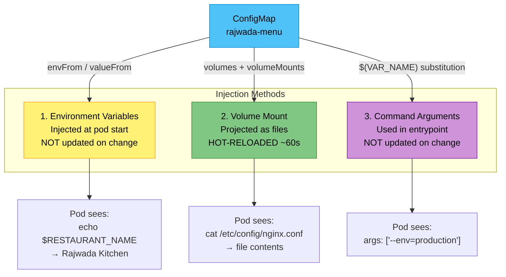
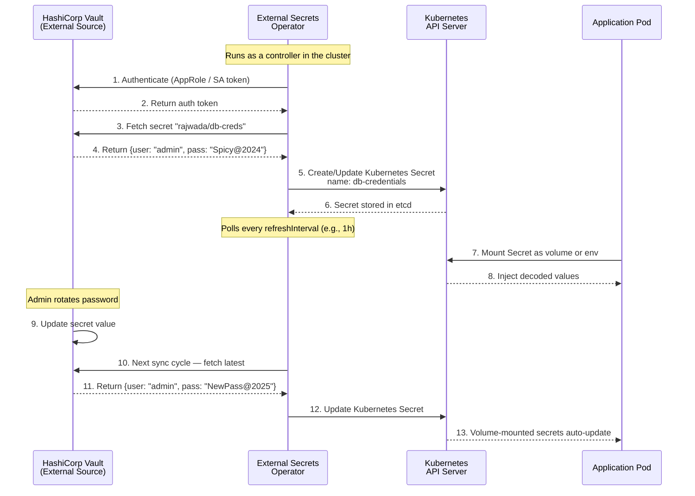

# File 12: ConfigMaps and Secrets

**Topic:** Externalizing application configuration and managing sensitive data in Kubernetes

**WHY THIS MATTERS:** Hard-coding config into container images means you must rebuild for every environment change. ConfigMaps and Secrets decouple configuration from images, letting you run the same image in dev, staging, and production with different settings. Secrets add a thin layer of protection for sensitive data. Understanding both is essential for any production-grade deployment.

---

## Story:

Imagine a popular restaurant in Jaipur called **"Rajwada Kitchen"**.

The restaurant has three important things:

1. **The Menu Board** (ConfigMap) — A large chalkboard at the entrance listing today's dishes, prices, and combos. The chef can update it any time — wipe a dish, add a new one — and customers immediately see the change. This menu is public information. Anyone who walks in can read it.

2. **The Recipe Book in the Safe** (Secret) — The head chef's secret recipe book is locked inside the kitchen safe. Only authorised kitchen staff know the combination. The recipes are written in a coded shorthand (base64) — but if someone opens the safe, they can easily read the shorthand. The safe keeps casual eyes out, but it is not a bank vault.

3. **The Printed Menu Card** (Immutable ConfigMap) — For the annual food festival, the restaurant prints 500 laminated menu cards. Once printed, they cannot be changed. If there is a mistake, you throw away all 500 and print new ones. This is an immutable ConfigMap — it reduces load on the API server because the kubelet stops polling for changes.

The external-secrets-operator is like a **franchise consultant** who visits head office (AWS Secrets Manager, HashiCorp Vault), copies the latest recipes, and delivers sealed envelopes to each branch restaurant's safe — keeping secrets in sync automatically.

---

## Example Block 1 — ConfigMaps: Creation and Usage

### Section 1 — Creating ConfigMaps

**WHY:** You need different ways to create ConfigMaps depending on whether your config is a single value, a file, or an entire directory of files.

#### Method 1: From Literal Values

```bash
# SYNTAX:
#   kubectl create configmap <name> --from-literal=<key>=<value> [--from-literal=<key2>=<value2>]
# FLAGS:
#   --from-literal   Key-value pair to store
#   -n               Namespace (default: current context namespace)

kubectl create configmap app-settings \
  --from-literal=APP_ENV=production \
  --from-literal=LOG_LEVEL=info \
  --from-literal=MAX_RETRIES=3

# EXPECTED OUTPUT:
# configmap/app-settings created
```

#### Method 2: From a File

```bash
# Create the config file first
cat <<'EOF' > /tmp/database.properties
db.host=mongo-service
db.port=27017
db.name=rajwada_kitchen
db.pool.size=10
EOF

# SYNTAX:
#   kubectl create configmap <name> --from-file=<path>
# The filename becomes the key, file content becomes the value

kubectl create configmap db-config --from-file=/tmp/database.properties

# EXPECTED OUTPUT:
# configmap/db-config created

# Verify the content
kubectl get configmap db-config -o yaml

# EXPECTED OUTPUT:
# apiVersion: v1
# kind: ConfigMap
# metadata:
#   name: db-config
#   ...
# data:
#   database.properties: |
#     db.host=mongo-service
#     db.port=27017
#     db.name=rajwada_kitchen
#     db.pool.size=10
```

#### Method 3: From a Directory

```bash
# SYNTAX:
#   kubectl create configmap <name> --from-file=<directory-path>
# Each file in the directory becomes a key

mkdir -p /tmp/app-configs
echo "color=saffron" > /tmp/app-configs/theme.conf
echo "lang=hi" > /tmp/app-configs/locale.conf

kubectl create configmap multi-config --from-file=/tmp/app-configs/

# EXPECTED OUTPUT:
# configmap/multi-config created
```

#### Method 4: Declarative YAML

```yaml
# configmap-declarative.yaml
apiVersion: v1
kind: ConfigMap
metadata:
  name: rajwada-menu            # WHY: Descriptive name matching the application
  namespace: default
data:
  # WHY: Simple key-value pairs for environment variables
  RESTAURANT_NAME: "Rajwada Kitchen"
  OPENING_HOURS: "11:00-23:00"
  CURRENCY: "INR"

  # WHY: Multi-line config embedded as a single key
  nginx.conf: |
    server {
        listen 80;
        server_name rajwada.local;
        location / {
            proxy_pass http://localhost:3000;
        }
    }

  # WHY: JSON config embedded as a single key
  feature-flags.json: |
    {
      "enableOnlineOrdering": true,
      "enableLoyaltyPoints": false,
      "maxConcurrentOrders": 50
    }
```

```bash
kubectl apply -f configmap-declarative.yaml

# EXPECTED OUTPUT:
# configmap/rajwada-menu created
```

---

### Section 2 — Injecting ConfigMaps into Pods

**WHY:** There are three distinct ways to consume ConfigMap data. Each serves a different use case.



#### Method A: Environment Variables (envFrom)

```yaml
# pod-env-configmap.yaml
apiVersion: v1
kind: Pod
metadata:
  name: menu-display
spec:
  containers:
    - name: app
      image: busybox:1.36
      command: ["sh", "-c", "env | grep -E 'RESTAURANT|OPENING|CURRENCY' && sleep 3600"]
      envFrom:
        - configMapRef:
            name: rajwada-menu    # WHY: Loads ALL keys from ConfigMap as env vars
      # NOTE: Keys with dots or dashes (nginx.conf) become invalid env var names
      # and will be silently skipped
```

#### Method B: Selective Environment Variables (valueFrom)

```yaml
# pod-selective-env.yaml
apiVersion: v1
kind: Pod
metadata:
  name: menu-selective
spec:
  containers:
    - name: app
      image: busybox:1.36
      command: ["sh", "-c", "echo Name=$SHOP_NAME Hours=$HOURS && sleep 3600"]
      env:
        - name: SHOP_NAME                  # WHY: Custom env var name
          valueFrom:
            configMapKeyRef:
              name: rajwada-menu           # WHY: Source ConfigMap
              key: RESTAURANT_NAME         # WHY: Specific key to extract
        - name: HOURS
          valueFrom:
            configMapKeyRef:
              name: rajwada-menu
              key: OPENING_HOURS
              optional: true               # WHY: Pod starts even if key missing
```

#### Method C: Volume Mount

```yaml
# pod-volume-configmap.yaml
apiVersion: v1
kind: Pod
metadata:
  name: menu-volume
spec:
  volumes:
    - name: config-vol
      configMap:
        name: rajwada-menu               # WHY: ConfigMap to project
        items:
          - key: nginx.conf              # WHY: Only mount specific keys
            path: nginx.conf             # WHY: Filename inside the mount path
          - key: feature-flags.json
            path: features.json          # WHY: Can rename the file during mount
  containers:
    - name: app
      image: nginx:1.25
      volumeMounts:
        - name: config-vol
          mountPath: /etc/nginx/conf.d    # WHY: Directory where files appear
          readOnly: true                  # WHY: Prevent accidental writes
```

```bash
# Verify files inside the pod
kubectl exec menu-volume -- ls /etc/nginx/conf.d

# EXPECTED OUTPUT:
# features.json
# nginx.conf

kubectl exec menu-volume -- cat /etc/nginx/conf.d/features.json

# EXPECTED OUTPUT:
# {
#   "enableOnlineOrdering": true,
#   "enableLoyaltyPoints": false,
#   "maxConcurrentOrders": 50
# }
```

#### Method D: Command Arguments

```yaml
# pod-cmd-configmap.yaml
apiVersion: v1
kind: Pod
metadata:
  name: menu-cmd
spec:
  containers:
    - name: app
      image: busybox:1.36
      env:
        - name: APP_ENV
          valueFrom:
            configMapKeyRef:
              name: app-settings
              key: APP_ENV
      command: ["sh", "-c"]
      args:
        - echo "Starting server in $(APP_ENV) mode"    # WHY: Variable substitution in args
```

---

### Section 3 — Hot-Reload Behavior

**WHY:** Understanding when changes propagate is critical. Volume-mounted ConfigMaps auto-update; environment variables do not.

```bash
# Step 1: Update the ConfigMap
kubectl edit configmap rajwada-menu
# Change OPENING_HOURS to "10:00-00:00"

# Step 2: Wait ~60 seconds (kubelet sync period)

# Step 3: Check volume-mounted pod — WILL see the update
kubectl exec menu-volume -- cat /etc/nginx/conf.d/features.json

# Step 4: Check env-based pod — will NOT see the update
kubectl exec menu-display -- printenv OPENING_HOURS
# EXPECTED OUTPUT: 11:00-23:00  (still the old value)

# WHY: Env vars are injected at pod creation time. To pick up changes,
# you must restart the pod (delete and recreate, or rollout restart the deployment).
```

---

## Example Block 2 — Secrets: Types, Creation, and Security

### Section 1 — Secret Types

**WHY:** Kubernetes has multiple Secret types, each with specific structure requirements.

| Type | Usage | Required Keys |
|------|-------|---------------|
| `Opaque` | Generic key-value (default) | Any |
| `kubernetes.io/tls` | TLS certificates | `tls.crt`, `tls.key` |
| `kubernetes.io/dockerconfigjson` | Private registry credentials | `.dockerconfigjson` |
| `kubernetes.io/basic-auth` | Basic authentication | `username`, `password` |
| `kubernetes.io/ssh-auth` | SSH authentication | `ssh-privatekey` |
| `kubernetes.io/service-account-token` | SA token (auto-created) | `token`, `ca.crt`, `namespace` |

### Section 2 — Creating Secrets

**WHY:** Secrets are created similarly to ConfigMaps but values are base64-encoded automatically when using kubectl.

```bash
# SYNTAX:
#   kubectl create secret generic <name> --from-literal=<key>=<value>
# FLAGS:
#   generic          Opaque type secret
#   --from-literal   Key-value pair (value auto-encoded to base64)
#   --from-file      File content as secret

kubectl create secret generic db-credentials \
  --from-literal=DB_USER=rajwada_admin \
  --from-literal=DB_PASSWORD='Spicy@Curry#2024'

# EXPECTED OUTPUT:
# secret/db-credentials created

# View the secret
kubectl get secret db-credentials -o yaml

# EXPECTED OUTPUT (values are base64 encoded):
# apiVersion: v1
# kind: Secret
# metadata:
#   name: db-credentials
# type: Opaque
# data:
#   DB_PASSWORD: U3BpY3lAQ3VycnkjMjAyNA==
#   DB_USER: cmFqd2FkYV9hZG1pbg==
```

#### Declarative Secret YAML

```yaml
# secret-declarative.yaml
apiVersion: v1
kind: Secret
metadata:
  name: rajwada-secrets
type: Opaque
data:
  # WHY: Values MUST be base64-encoded in the 'data' field
  API_KEY: UmFqd2FkYUFQSUtleTEyMzQ1    # echo -n 'RajwadaAPIKey12345' | base64
  JWT_SECRET: c3VwZXJTZWNyZXRKV1Q=       # echo -n 'superSecretJWT' | base64
stringData:
  # WHY: 'stringData' accepts plain text — Kubernetes encodes it for you
  # This is convenient but the plain text will appear in the YAML you write
  SMTP_PASSWORD: "EmailPass@789"
```

```bash
kubectl apply -f secret-declarative.yaml

# EXPECTED OUTPUT:
# secret/rajwada-secrets created
```

### Section 3 — base64 Is NOT Encryption

**WHY:** This is the single most dangerous misconception about Kubernetes Secrets. Base64 is encoding, not encryption. Anyone with API access can decode it instantly.

```bash
# Decode a secret value — trivially easy
echo "U3BpY3lAQ3VycnkjMjAyNA==" | base64 --decode

# EXPECTED OUTPUT:
# Spicy@Curry#2024

# WHY: This proves base64 provides ZERO security.
# It is merely a transport encoding to handle binary data in YAML/JSON.
```

### Section 4 — Mounting Secrets in Pods

```yaml
# pod-with-secrets.yaml
apiVersion: v1
kind: Pod
metadata:
  name: kitchen-app
spec:
  volumes:
    - name: secret-vol
      secret:
        secretName: db-credentials       # WHY: Mount secret as files
        defaultMode: 0400                # WHY: Read-only for owner only (security)
  containers:
    - name: app
      image: busybox:1.36
      command: ["sh", "-c", "cat /secrets/DB_USER && echo '' && cat /secrets/DB_PASSWORD && sleep 3600"]
      volumeMounts:
        - name: secret-vol
          mountPath: /secrets             # WHY: Directory where secret files appear
          readOnly: true
      env:
        - name: JWT
          valueFrom:
            secretKeyRef:
              name: rajwada-secrets       # WHY: Inject specific secret key as env var
              key: JWT_SECRET
```

```bash
kubectl apply -f pod-with-secrets.yaml

# Verify — secrets are decoded (plain text) inside the pod
kubectl exec kitchen-app -- cat /secrets/DB_PASSWORD

# EXPECTED OUTPUT:
# Spicy@Curry#2024

# WHY: Kubernetes automatically decodes base64 when mounting into pods.
# The application sees plain text — it never has to decode anything itself.
```

---

## Example Block 3 — Encryption at Rest and External Secrets

### Section 1 — Encryption at Rest

**WHY:** By default, Secrets are stored as plain base64 in etcd. Encryption at rest encrypts them in etcd so even someone with direct etcd access cannot read them.

```yaml
# encryption-config.yaml (placed on control plane node)
apiVersion: apiserver.config.k8s.io/v1
kind: EncryptionConfiguration
resources:
  - resources:
      - secrets
    providers:
      - aescbc:                          # WHY: AES-CBC encryption provider
          keys:
            - name: key1
              secret: <BASE64-ENCODED-32-BYTE-KEY>   # WHY: The actual encryption key
      - identity: {}                     # WHY: Fallback — read unencrypted secrets written before encryption was enabled
```

```bash
# Generate a 32-byte encryption key
head -c 32 /dev/urandom | base64

# EXPECTED OUTPUT (example):
# aBcDeFgHiJkLmNoPqRsTuVwXyZ123456789+/AB=

# WHY: This key encrypts secrets in etcd. Store it securely (e.g., in a KMS).
# The kube-apiserver must be configured with --encryption-provider-config flag.
```

### Section 2 — External Secrets Operator

**WHY:** For production, secrets should live in a dedicated secrets manager (AWS Secrets Manager, HashiCorp Vault, Azure Key Vault) and be synced into Kubernetes automatically.



```yaml
# external-secret.yaml
apiVersion: external-secrets.io/v1beta1
kind: ExternalSecret
metadata:
  name: rajwada-db-creds
spec:
  refreshInterval: 1h                   # WHY: How often to sync from external source
  secretStoreRef:
    name: vault-backend                  # WHY: Reference to the SecretStore CR
    kind: SecretStore
  target:
    name: db-credentials                 # WHY: Name of the K8s Secret to create/update
    creationPolicy: Owner                # WHY: ESO owns the Secret lifecycle
  data:
    - secretKey: DB_USER                 # WHY: Key in the Kubernetes Secret
      remoteRef:
        key: rajwada/db-creds            # WHY: Path in Vault
        property: username               # WHY: Specific field in the Vault secret
    - secretKey: DB_PASSWORD
      remoteRef:
        key: rajwada/db-creds
        property: password
```

```yaml
# secret-store.yaml
apiVersion: external-secrets.io/v1beta1
kind: SecretStore
metadata:
  name: vault-backend
spec:
  provider:
    vault:
      server: "https://vault.rajwada.internal:8200"
      path: "secret"                     # WHY: KV v2 mount path
      version: "v2"
      auth:
        kubernetes:
          mountPath: "kubernetes"         # WHY: Vault auth method mount
          role: "rajwada-app"             # WHY: Vault role bound to K8s SA
          serviceAccountRef:
            name: rajwada-sa             # WHY: K8s SA used for Vault auth
```

---

## Example Block 4 — Immutable ConfigMaps and Secrets

### Section 1 — Immutable Flag

**WHY:** Immutable ConfigMaps and Secrets cannot be updated after creation. This provides two benefits: (1) protects against accidental changes in production, and (2) significantly reduces API server load because the kubelet stops watching for changes.

```yaml
# immutable-configmap.yaml
apiVersion: v1
kind: ConfigMap
metadata:
  name: rajwada-festival-menu-v1        # WHY: Version in name since you can't update it
data:
  FESTIVAL: "Diwali Special"
  SPECIAL_DISH: "Kaju Katli Thali"
  PRICE: "₹999"
immutable: true                          # WHY: Once created, cannot be modified
```

```bash
kubectl apply -f immutable-configmap.yaml

# EXPECTED OUTPUT:
# configmap/rajwada-festival-menu-v1 created

# Try to update it
kubectl edit configmap rajwada-festival-menu-v1
# Change PRICE to ₹1099 and save

# EXPECTED OUTPUT:
# error: configmaps "rajwada-festival-menu-v1" is invalid:
#   data: Forbidden: field is immutable when `immutable` is set

# WHY: To change, you must delete and recreate (or create a v2 with a new name)
```

```yaml
# immutable-secret.yaml
apiVersion: v1
kind: Secret
metadata:
  name: rajwada-api-key-v1
type: Opaque
stringData:
  API_KEY: "ProductionKey-2024-Final"
immutable: true                          # WHY: Same protection for secrets
```

### Section 2 — ConfigMap and Secret Size Limits

**WHY:** Kubernetes stores ConfigMaps and Secrets in etcd, which has a per-object size limit.

```text
Maximum size per ConfigMap/Secret: 1 MiB (1,048,576 bytes)

WHY this limit exists:
- etcd is designed for small key-value data
- Large config should be stored in persistent volumes or external systems
- If you need more than 1 MiB, consider splitting into multiple ConfigMaps
```

---

## Example Block 5 — Best Practices and Patterns

### Section 1 — Projected Volumes: Combining Multiple Sources

**WHY:** Sometimes a pod needs config from multiple ConfigMaps and Secrets in a single directory.

```yaml
# pod-projected.yaml
apiVersion: v1
kind: Pod
metadata:
  name: rajwada-full-config
spec:
  volumes:
    - name: all-config
      projected:                          # WHY: Combine multiple sources into one volume
        sources:
          - configMap:
              name: rajwada-menu
              items:
                - key: nginx.conf
                  path: nginx.conf
          - secret:
              name: db-credentials
              items:
                - key: DB_PASSWORD
                  path: db-password
          - serviceAccountToken:          # WHY: Bound SA token for workload identity
              path: token
              expirationSeconds: 3600
              audience: vault
  containers:
    - name: app
      image: busybox:1.36
      command: ["sh", "-c", "ls /config && sleep 3600"]
      volumeMounts:
        - name: all-config
          mountPath: /config
```

### Section 2 — RBAC for Secrets

**WHY:** Restrict who can read secrets. By default, anyone with namespace-level access can read all secrets.

```yaml
# secret-reader-role.yaml
apiVersion: rbac.authorization.k8s.io/v1
kind: Role
metadata:
  name: secret-reader
  namespace: rajwada
rules:
  - apiGroups: [""]
    resources: ["secrets"]
    resourceNames: ["db-credentials"]    # WHY: Only allow access to specific secrets
    verbs: ["get"]                       # WHY: Read-only, no list (prevents enumeration)
---
apiVersion: rbac.authorization.k8s.io/v1
kind: RoleBinding
metadata:
  name: app-secret-access
  namespace: rajwada
subjects:
  - kind: ServiceAccount
    name: rajwada-sa
    namespace: rajwada
roleRef:
  kind: Role
  name: secret-reader
  apiGroup: rbac.authorization.k8s.io
```

---

## Key Takeaways

1. **ConfigMaps** store non-sensitive configuration as key-value pairs or embedded files. They can be consumed as environment variables, volume mounts, or command arguments.

2. **Volume-mounted ConfigMaps hot-reload** within ~60 seconds of an update. Environment variables do NOT update — the pod must be restarted.

3. **Secrets** are structurally identical to ConfigMaps but base64-encoded. Kubernetes supports multiple Secret types (Opaque, TLS, dockerconfigjson) for different use cases.

4. **base64 is NOT encryption** — it is trivially reversible encoding. For real security, enable encryption at rest and use RBAC to restrict Secret access.

5. **External Secrets Operator** syncs secrets from external managers (Vault, AWS Secrets Manager) into Kubernetes, enabling centralized secret management and automatic rotation.

6. **Immutable ConfigMaps/Secrets** prevent accidental modification and reduce API server load by eliminating watch overhead. Use versioned names (v1, v2) for updates.

7. **Projected volumes** let you combine ConfigMaps, Secrets, and service account tokens into a single mount point — cleaner than multiple volume mounts.

8. **Size limit is 1 MiB** per ConfigMap or Secret. For larger configuration, use persistent volumes or external configuration stores.

9. **Always use RBAC** to restrict Secret access to specific service accounts and specific secret names. Avoid granting broad `list` or `watch` permissions on secrets.

10. **Never commit Secret YAML files with real values** to version control. Use sealed-secrets, external-secrets-operator, or inject values through CI/CD pipelines.
