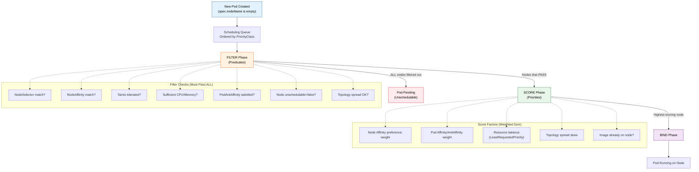
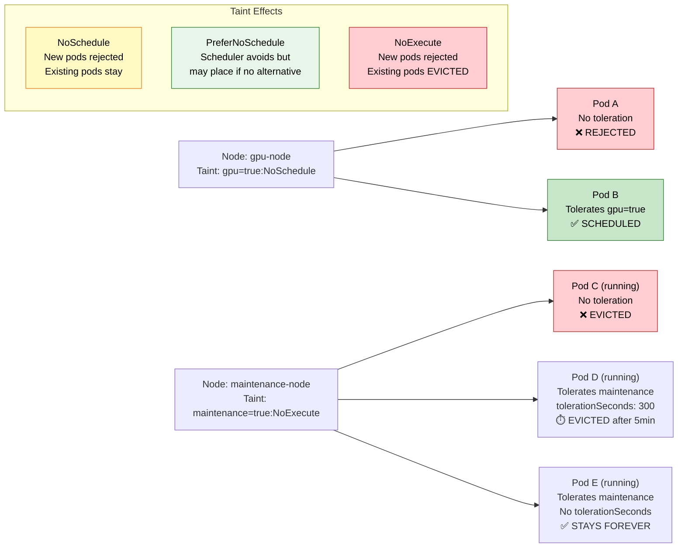

# File 13: Scheduling, Affinity, and Taints

**Topic:** Controlling where pods run using node selection, affinity rules, taints, tolerations, topology spread, and priority-based preemption

**WHY THIS MATTERS:** By default, the Kubernetes scheduler places pods wherever capacity exists. In production, you need fine-grained control — GPU workloads on GPU nodes, latency-sensitive pods spread across zones, batch jobs on spot instances, and critical pods that can evict less important ones. Understanding scheduling is the difference between a cluster that works and one that works well.

---

## Story:

Imagine you are organising a **grand Indian wedding** at the famous **Umaid Bhawan Palace** in Jodhpur. There are 20 dining tables across 3 halls — the AC Hall, the Garden Hall, and the Rooftop.

**nodeSelector** is the simplest rule: "Dadi-ji sits in AC Hall only." You label the AC Hall tables and Dadi-ji's seating card says `hall: ac`. No flexibility — if AC Hall is full, Dadi-ji does not sit anywhere.

**Node Affinity (requiredDuringScheduling)** is the same but more expressive: "Dadi-ji must sit in AC Hall OR Garden Hall — but NOT the Rooftop." You can use operators like `In`, `NotIn`, `Exists` for complex matching.

**Node Affinity (preferredDuringScheduling)** is a soft preference: "Uncle Ramesh prefers AC Hall, but if it is full, he will adjust." The scheduler tries its best but does not guarantee it.

**Pod Affinity** is about relationships: "The bride's family should all sit together in the same hall." Pods that need low-latency communication are co-located.

**Pod Anti-Affinity** is the opposite: "The two fighting uncles — Suresh Mama and Rajesh Mama — must be at different tables, ideally in different halls." This is how you spread replicas across nodes for high availability.

**Taints** are like reserved signs on tables: "This table is reserved for the VIP guest (NoSchedule)." Regular guests cannot sit here. Only guests with a special invitation (toleration) can use the table.

**NoExecute taints** are stricter: "This table is being cleaned. Everyone currently sitting here must move (eviction), unless they have a cleaning-crew badge (toleration)."

**PriorityClasses** decide what happens when the venue is completely full: "The groom's parents have Priority 1000. If there is no space, a distant cousin with Priority 100 gets moved to make room (preemption)."

---

## Example Block 1 — The Scheduler Pipeline

### Section 1 — How the Scheduler Works

**WHY:** Understanding the scheduler's three-phase pipeline helps you predict where pods land and debug scheduling failures.



```bash
# Check why a pod is Pending
# SYNTAX:
#   kubectl describe pod <pod-name>
# Look for the "Events" section at the bottom

kubectl describe pod stuck-pod

# EXPECTED OUTPUT (scheduling failure example):
# Events:
#   Type     Reason            Age   From               Message
#   ----     ------            ----  ----               -------
#   Warning  FailedScheduling  10s   default-scheduler  0/3 nodes are available:
#     1 node(s) had untolerated taint {gpu: true}, 2 node(s) didn't match
#     Pod's node affinity/selector.
```

---

## Example Block 2 — nodeSelector and Node Affinity

### Section 1 — nodeSelector (Simplest Approach)

**WHY:** nodeSelector is the easiest way to constrain pods to specific nodes. It uses exact label matching.

```bash
# Label nodes first
# SYNTAX:
#   kubectl label nodes <node-name> <key>=<value>

kubectl label nodes worker-1 hall=ac
kubectl label nodes worker-2 hall=garden
kubectl label nodes worker-3 hall=rooftop

# EXPECTED OUTPUT:
# node/worker-1 labeled

# Verify labels
kubectl get nodes --show-labels

# EXPECTED OUTPUT:
# NAME       STATUS   ROLES    AGE   VERSION   LABELS
# worker-1   Ready    <none>   5d    v1.29.0   ...,hall=ac
# worker-2   Ready    <none>   5d    v1.29.0   ...,hall=garden
# worker-3   Ready    <none>   5d    v1.29.0   ...,hall=rooftop
```

```yaml
# pod-nodeselector.yaml
apiVersion: v1
kind: Pod
metadata:
  name: dadiji-pod
spec:
  nodeSelector:
    hall: ac                              # WHY: Pod will ONLY run on nodes with label hall=ac
  containers:
    - name: app
      image: nginx:1.25
      resources:
        requests:
          cpu: 100m
          memory: 128Mi
```

### Section 2 — Node Affinity (Flexible Scheduling)

**WHY:** Node affinity is more powerful than nodeSelector. It supports operators (In, NotIn, Exists, DoesNotExist, Gt, Lt) and soft/hard preferences.

```yaml
# pod-node-affinity.yaml
apiVersion: v1
kind: Pod
metadata:
  name: uncle-ramesh-pod
spec:
  affinity:
    nodeAffinity:
      # WHY: HARD requirement — scheduler will NOT place pod if no node matches
      requiredDuringSchedulingIgnoredDuringExecution:
        nodeSelectorTerms:
          - matchExpressions:
              - key: hall
                operator: In             # WHY: Node must have hall=ac OR hall=garden
                values:
                  - ac
                  - garden
              - key: floor
                operator: Exists         # WHY: Node must have 'floor' label (any value)
      # WHY: SOFT preference — scheduler tries but won't fail if unavailable
      preferredDuringSchedulingIgnoredDuringExecution:
        - weight: 80                     # WHY: Weight 1-100, higher = stronger preference
          preference:
            matchExpressions:
              - key: hall
                operator: In
                values:
                  - ac                   # WHY: Strongly prefers AC hall
        - weight: 20
          preference:
            matchExpressions:
              - key: hall
                operator: In
                values:
                  - garden               # WHY: Garden is acceptable but less preferred
  containers:
    - name: app
      image: nginx:1.25
```

```bash
kubectl apply -f pod-node-affinity.yaml

# Check where it landed
kubectl get pod uncle-ramesh-pod -o wide

# EXPECTED OUTPUT:
# NAME               READY   STATUS    ...   NODE       ...
# uncle-ramesh-pod   1/1     Running   ...   worker-1   ...
# (worker-1 because it has hall=ac, the preferred node)
```

---

## Example Block 3 — Pod Affinity and Anti-Affinity

### Section 1 — Pod Affinity (Co-locate Related Pods)

**WHY:** Pod affinity places pods near other pods that match a label selector. "Near" is defined by a topologyKey (same node, same zone, same rack).

```yaml
# pod-affinity.yaml
apiVersion: apps/v1
kind: Deployment
metadata:
  name: bride-family
spec:
  replicas: 3
  selector:
    matchLabels:
      family: bride
  template:
    metadata:
      labels:
        family: bride
        role: guest
    spec:
      affinity:
        podAffinity:
          requiredDuringSchedulingIgnoredDuringExecution:
            - labelSelector:
                matchExpressions:
                  - key: family
                    operator: In
                    values:
                      - bride             # WHY: Must be co-located with other bride-family pods
              topologyKey: kubernetes.io/hostname   # WHY: "Same node" topology
              # Other common topologyKeys:
              #   topology.kubernetes.io/zone    — same availability zone
              #   topology.kubernetes.io/region  — same region
      containers:
        - name: guest
          image: busybox:1.36
          command: ["sleep", "3600"]
```

### Section 2 — Pod Anti-Affinity (Separate Fighting Uncles)

**WHY:** Pod anti-affinity ensures pods are spread apart. This is essential for HA — you never want all replicas on the same node.

```yaml
# pod-anti-affinity.yaml
apiVersion: apps/v1
kind: Deployment
metadata:
  name: suresh-mama-app
spec:
  replicas: 3
  selector:
    matchLabels:
      uncle: suresh
  template:
    metadata:
      labels:
        uncle: suresh
    spec:
      affinity:
        podAntiAffinity:
          # WHY: HARD anti-affinity — no two replicas on the same node
          requiredDuringSchedulingIgnoredDuringExecution:
            - labelSelector:
                matchExpressions:
                  - key: uncle
                    operator: In
                    values:
                      - suresh
              topologyKey: kubernetes.io/hostname
          # WHY: SOFT anti-affinity — try to spread across zones too
          preferredDuringSchedulingIgnoredDuringExecution:
            - weight: 100
              podAffinityTerm:
                labelSelector:
                  matchExpressions:
                    - key: uncle
                      operator: In
                      values:
                        - suresh
                topologyKey: topology.kubernetes.io/zone
      containers:
        - name: app
          image: nginx:1.25
```

```bash
kubectl apply -f pod-anti-affinity.yaml

# Verify pods are on different nodes
kubectl get pods -l uncle=suresh -o wide

# EXPECTED OUTPUT:
# NAME                              READY   STATUS    NODE
# suresh-mama-app-abc12             1/1     Running   worker-1
# suresh-mama-app-def34             1/1     Running   worker-2
# suresh-mama-app-ghi56             1/1     Running   worker-3
```

---

## Example Block 4 — Taints and Tolerations

### Section 1 — Understanding Taints

**WHY:** Taints are applied to nodes to repel pods. Only pods with matching tolerations can be scheduled there. This is how you reserve nodes for specific workloads.



```bash
# SYNTAX:
#   kubectl taint nodes <node-name> <key>=<value>:<effect>
# EFFECTS:
#   NoSchedule         — Hard block for new pods
#   PreferNoSchedule   — Soft block for new pods
#   NoExecute          — Hard block + evict existing pods

# Taint a node for GPU workloads only
kubectl taint nodes worker-3 gpu=true:NoSchedule

# EXPECTED OUTPUT:
# node/worker-3 tainted

# Verify the taint
kubectl describe node worker-3 | grep -A 2 Taints

# EXPECTED OUTPUT:
# Taints:             gpu=true:NoSchedule

# Remove a taint (note the minus at the end)
kubectl taint nodes worker-3 gpu=true:NoSchedule-

# EXPECTED OUTPUT:
# node/worker-3 untainted
```

### Section 2 — Tolerations

**WHY:** A toleration is the "invitation card" that lets a pod sit at a reserved table. It must match the taint's key, value, and effect.

```yaml
# pod-toleration.yaml
apiVersion: v1
kind: Pod
metadata:
  name: gpu-training-pod
spec:
  tolerations:
    # WHY: Exact match — tolerates gpu=true:NoSchedule
    - key: "gpu"
      operator: "Equal"           # WHY: Key AND value must match
      value: "true"
      effect: "NoSchedule"

    # WHY: Exists operator — tolerates ANY value for the "maintenance" key
    - key: "maintenance"
      operator: "Exists"          # WHY: Matches any value, only key matters
      effect: "NoExecute"
      tolerationSeconds: 300      # WHY: Pod stays for 300s then gets evicted

    # WHY: Empty key with Exists = tolerate ALL taints (use with extreme caution)
    # - operator: "Exists"
  nodeSelector:
    gpu: "true"                   # WHY: Toleration allows scheduling, nodeSelector targets it
  containers:
    - name: trainer
      image: nvidia/cuda:12.0-base
      resources:
        limits:
          nvidia.com/gpu: 1       # WHY: Request GPU resource
```

### Section 3 — System Taints on Control Plane

**WHY:** By default, Kubernetes taints control-plane nodes so user pods don't run there.

```bash
# View control plane taints
kubectl describe node controlplane | grep -A 5 Taints

# EXPECTED OUTPUT:
# Taints:  node-role.kubernetes.io/control-plane:NoSchedule

# WHY: This prevents your application pods from competing with
# kube-apiserver, etcd, controller-manager, and scheduler for resources.
# System components tolerate this taint via their pod specs.
```

---

## Example Block 5 — Topology Spread Constraints

### Section 1 — Even Distribution

**WHY:** Pod anti-affinity is binary (same/different), but topology spread constraints let you control the exact skew — how unevenly pods are distributed across zones.

```yaml
# topology-spread.yaml
apiVersion: apps/v1
kind: Deployment
metadata:
  name: wedding-guests
spec:
  replicas: 6
  selector:
    matchLabels:
      event: wedding
  template:
    metadata:
      labels:
        event: wedding
    spec:
      topologySpreadConstraints:
        - maxSkew: 1                      # WHY: Max difference between zone counts
          topologyKey: topology.kubernetes.io/zone
          whenUnsatisfiable: DoNotSchedule  # WHY: Hard constraint
          labelSelector:
            matchLabels:
              event: wedding
          # With 6 replicas and 3 zones: each zone gets exactly 2
          # If maxSkew=1, distribution like 3-2-1 is forbidden (skew=2)
        - maxSkew: 1
          topologyKey: kubernetes.io/hostname
          whenUnsatisfiable: ScheduleAnyway  # WHY: Soft constraint for node-level
          labelSelector:
            matchLabels:
              event: wedding
      containers:
        - name: guest
          image: nginx:1.25
```

```bash
kubectl apply -f topology-spread.yaml

# Check distribution
kubectl get pods -l event=wedding -o wide

# EXPECTED OUTPUT (3 zones, 2 pods each):
# NAME                    READY   NODE       ZONE
# wedding-guests-abc12    1/1     worker-1   us-east-1a
# wedding-guests-def34    1/1     worker-2   us-east-1a
# wedding-guests-ghi56    1/1     worker-3   us-east-1b
# wedding-guests-jkl78    1/1     worker-4   us-east-1b
# wedding-guests-mno90    1/1     worker-5   us-east-1c
# wedding-guests-pqr12    1/1     worker-6   us-east-1c
```

---

## Example Block 6 — PriorityClasses and Preemption

### Section 1 — PriorityClasses

**WHY:** When a cluster is full, PriorityClasses determine which pods get evicted to make room for more important pods.

```yaml
# priority-classes.yaml
apiVersion: scheduling.k8s.io/v1
kind: PriorityClass
metadata:
  name: groom-parents                    # WHY: Highest priority — critical services
value: 1000000                           # WHY: Higher number = higher priority
globalDefault: false                     # WHY: Don't make this the default for all pods
preemptionPolicy: PreemptLowerPriority   # WHY: Can evict lower-priority pods
description: "Mission critical workloads like databases and payment systems"
---
apiVersion: scheduling.k8s.io/v1
kind: PriorityClass
metadata:
  name: close-relatives                  # WHY: Medium priority — important services
value: 100000
globalDefault: false
preemptionPolicy: PreemptLowerPriority
description: "Important services like API servers and caches"
---
apiVersion: scheduling.k8s.io/v1
kind: PriorityClass
metadata:
  name: distant-cousins                  # WHY: Low priority — batch jobs
value: 1000
globalDefault: true                      # WHY: Default for pods without explicit priority
preemptionPolicy: Never                  # WHY: These pods cannot evict others
description: "Batch jobs and non-critical workloads"
```

```yaml
# high-priority-pod.yaml
apiVersion: v1
kind: Pod
metadata:
  name: payment-service
spec:
  priorityClassName: groom-parents        # WHY: Assign high priority
  containers:
    - name: payment
      image: nginx:1.25
      resources:
        requests:
          cpu: "2"
          memory: 4Gi
```

```bash
kubectl apply -f priority-classes.yaml
kubectl apply -f high-priority-pod.yaml

# If cluster is full, a distant-cousins pod will be evicted
# Check events
kubectl get events --sort-by='.lastTimestamp'

# EXPECTED OUTPUT (preemption event):
# LAST SEEN   TYPE      REASON      OBJECT              MESSAGE
# 5s          Normal    Preempted   pod/batch-job-xyz   Preempted by default/payment-service
# 3s          Normal    Scheduled   pod/payment-service Successfully assigned to worker-2
```

---

## Example Block 7 — Practical Scheduling Patterns

### Section 1 — Dedicated Nodes Pattern

**WHY:** Common in production — reserve specific nodes for specific workloads (GPU, memory-intensive, compliance).

```bash
# Step 1: Label and taint the dedicated nodes
kubectl label nodes gpu-node-1 gpu-node-2 workload=gpu-training
kubectl taint nodes gpu-node-1 gpu-node-2 workload=gpu-training:NoSchedule

# Step 2: Deploy with nodeSelector + toleration
```

```yaml
# dedicated-gpu-job.yaml
apiVersion: batch/v1
kind: Job
metadata:
  name: model-training
spec:
  template:
    spec:
      nodeSelector:
        workload: gpu-training            # WHY: Target GPU nodes
      tolerations:
        - key: workload
          operator: Equal
          value: gpu-training
          effect: NoSchedule              # WHY: Allow scheduling despite taint
      containers:
        - name: trainer
          image: pytorch/pytorch:2.1.0
          command: ["python", "train.py"]
          resources:
            limits:
              nvidia.com/gpu: 2
      restartPolicy: Never
```

### Section 2 — Debugging Scheduling Decisions

```bash
# Check why a pod is unschedulable
kubectl describe pod <pending-pod-name>

# Check node capacity and allocatable resources
# SYNTAX:
#   kubectl describe node <node-name>

kubectl describe node worker-1 | grep -A 8 "Allocated resources"

# EXPECTED OUTPUT:
# Allocated resources:
#   (Total limits may be over 100 percent, i.e., overcommitted.)
#   Resource           Requests    Limits
#   --------           --------    ------
#   cpu                750m (37%)  2 (100%)
#   memory             512Mi (13%) 2Gi (53%)
#   ephemeral-storage  0 (0%)      0 (0%)

# Check scheduler logs
kubectl logs -n kube-system -l component=kube-scheduler --tail=50

# Force a pod to a specific node (bypass scheduler — NOT recommended for production)
# SYNTAX:
#   spec.nodeName: <node-name>
```

---

## Key Takeaways

1. **The scheduler pipeline** works in three phases: Filter (hard constraints), Score (soft preferences), Bind (assign to winning node). If all nodes are filtered out, the pod stays Pending.

2. **nodeSelector** is the simplest scheduling constraint — exact label match. Use it for straightforward requirements like `disktype: ssd`.

3. **Node Affinity** is nodeSelector on steroids — supports `In`, `NotIn`, `Exists`, `Gt`, `Lt` operators, and both hard (required) and soft (preferred) rules with weights.

4. **Pod Affinity** co-locates pods for low-latency communication. Pod Anti-Affinity spreads them apart for high availability. Both use `topologyKey` to define "closeness."

5. **Taints repel pods, tolerations allow them.** Three effects: NoSchedule (block new), PreferNoSchedule (soft block), NoExecute (block new + evict existing).

6. **tolerationSeconds** on NoExecute taints controls how long a pod survives before eviction — useful for graceful drain during maintenance.

7. **Topology Spread Constraints** give fine-grained control over pod distribution with `maxSkew` — more flexible than pod anti-affinity for even distribution.

8. **PriorityClasses** determine eviction order when the cluster is full. Higher priority pods can preempt (evict) lower priority ones. Set `preemptionPolicy: Never` for batch jobs.

9. **Dedicated node pattern** combines labels + taints + tolerations + nodeSelector to reserve nodes exclusively for specific workloads (GPU, compliance, high-memory).

10. **Always check `kubectl describe pod`** for scheduling failure reasons. The Events section tells you exactly which filter failed and on how many nodes.
