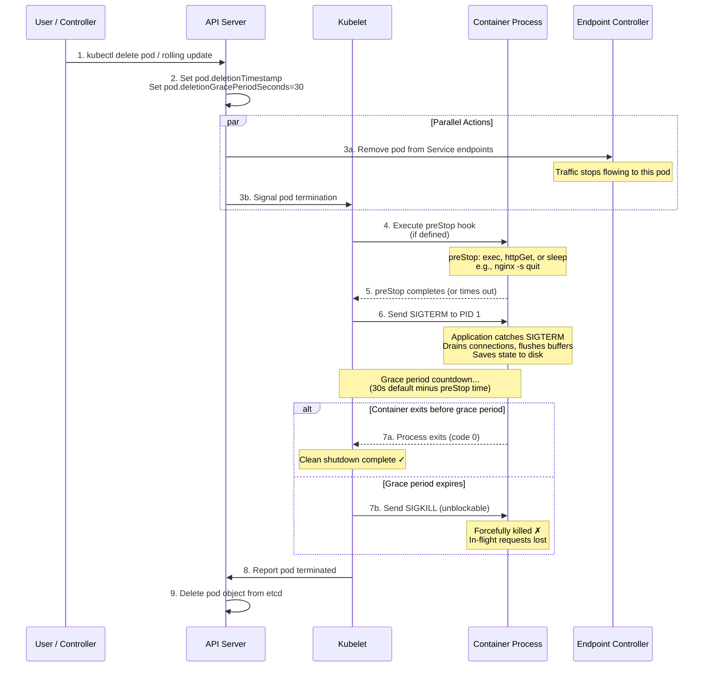
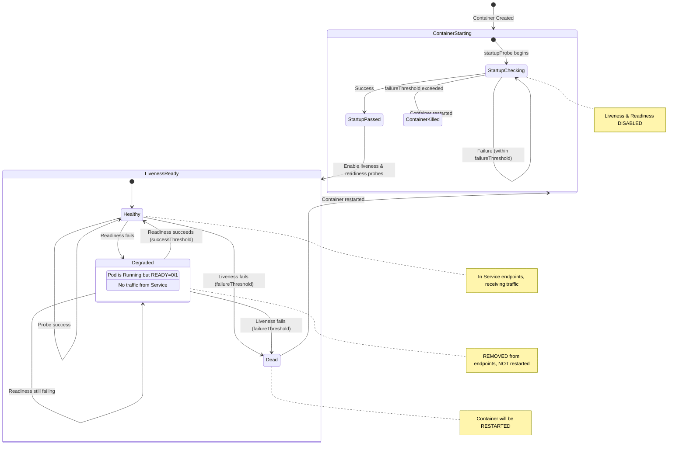

# File 15: Health Checks and Pod Lifecycle

**Topic:** Liveness, readiness, and startup probes, pod lifecycle hooks, graceful shutdown, and PodDisruptionBudgets

**WHY THIS MATTERS:** A pod that is running is not necessarily healthy. Without probes, Kubernetes blindly sends traffic to broken containers and never restarts frozen ones. Without lifecycle hooks, your application drops in-flight requests during shutdown. Probes and lifecycle management are what separate a toy deployment from a production-grade one.

---

## Story:

Imagine a **hospital in Mumbai** — Lilavati Hospital — with strict patient monitoring protocols.

**Liveness Probe = ICU Monitor:** A patient in the ICU has a heart monitor that beeps every few seconds. If the heartbeat flatlines for too long (failure threshold), the doctor intervenes — shock paddles, restart the heart (container restart). The liveness probe answers: "Is this container alive or should we kill and restart it?"

**Readiness Probe = Discharge Assessment:** Before a patient is moved from ICU to a general ward, the doctor checks: "Can this patient eat on their own? Can they walk to the bathroom?" Only when these readiness checks pass does the patient get moved to the general ward (added to Service endpoints). If the patient relapses, they are removed from the general ward back to observation (removed from endpoints). The readiness probe answers: "Is this container ready to receive traffic?"

**Startup Probe = Newborn Check:** When a baby is born, the APGAR test is performed — heart rate, breathing, reflexes. This initial check has a generous timeout (newborns need time). Once the startup probe passes, liveness and readiness probes take over. Without it, slow-starting applications (Java apps, ML model loading) get killed before they finish booting.

**preStop Hook = Discharge Procedure:** Before a patient leaves the hospital, there is a procedure — final blood test, clear pharmacy prescriptions, return hospital gown, settle the bill. Similarly, before a container is terminated, the preStop hook runs — drain connections, flush caches, deregister from service discovery.

**postStart Hook = Admission Procedure:** When a new patient arrives, they go through admission — register at the desk, assign a bed, do initial vitals. The postStart hook runs right after the container starts, before any probes begin.

**terminationGracePeriodSeconds = Hospital Visiting Hours End:** At 9 PM, the hospital announces "visiting hours will end in 30 minutes" (SIGTERM). Visitors who leave within 30 minutes leave gracefully. At 9:30 PM, security escorts out anyone remaining (SIGKILL).

---

## Example Block 1 — Pod Termination Sequence

### Section 1 — The SIGTERM → SIGKILL Pipeline

**WHY:** Understanding the exact sequence of events during pod termination is critical for implementing graceful shutdown.



```yaml
# graceful-shutdown-pod.yaml
apiVersion: v1
kind: Pod
metadata:
  name: graceful-app
spec:
  terminationGracePeriodSeconds: 45       # WHY: Total time allowed for graceful shutdown
                                          # Default is 30s. Increase for slow-draining apps.
  containers:
    - name: web
      image: nginx:1.25
      lifecycle:
        preStop:
          exec:
            command:
              - sh
              - -c
              - "nginx -s quit && sleep 5"   # WHY: Graceful nginx shutdown + wait for connections
        postStart:
          exec:
            command:
              - sh
              - -c
              - "echo 'Container started at $(date)' >> /var/log/lifecycle.log"
```

---

## Example Block 2 — Probe Types and Configuration

### Section 1 — Probe Methods

**WHY:** Kubernetes supports four probe methods. Choose based on what your application can expose.

| Probe Method | How It Works | Best For |
|-------------|-------------|----------|
| `httpGet` | HTTP GET to a path. 2xx/3xx = success | Web servers, APIs with `/healthz` |
| `tcpSocket` | TCP connect to a port. Connection = success | Databases, gRPC services |
| `exec` | Run a command inside container. Exit 0 = success | Custom health scripts, file checks |
| `grpc` | gRPC health check protocol (K8s 1.27+) | gRPC microservices |

### Section 2 — Liveness Probe

**WHY:** Liveness probes detect containers that are running but broken — deadlocked, stuck in infinite loops, or crashed internally without the process exiting.

```yaml
# liveness-probe.yaml
apiVersion: v1
kind: Pod
metadata:
  name: liveness-demo
spec:
  containers:
    - name: app
      image: busybox:1.36
      command:
        - sh
        - -c
        - |
          # Create the health file
          touch /tmp/healthy
          echo "App started"
          # After 30 seconds, delete the health file to simulate failure
          sleep 30
          rm -f /tmp/healthy
          echo "App became unhealthy"
          # Keep running (zombie process)
          sleep 3600
      livenessProbe:
        exec:
          command:
            - cat
            - /tmp/healthy               # WHY: If file exists, exit 0 = healthy
        initialDelaySeconds: 5           # WHY: Wait 5s after start before first check
        periodSeconds: 5                 # WHY: Check every 5 seconds
        timeoutSeconds: 1                # WHY: Each check must complete in 1 second
        failureThreshold: 3              # WHY: 3 consecutive failures → restart container
        successThreshold: 1              # WHY: 1 success → mark as healthy (always 1 for liveness)
```

```bash
kubectl apply -f liveness-probe.yaml

# Watch the pod — after ~45s (30s healthy + 3*5s failures), it will restart
watch kubectl get pod liveness-demo

# EXPECTED OUTPUT (after ~45 seconds):
# NAME            READY   STATUS    RESTARTS   AGE
# liveness-demo   1/1     Running   1          50s

# Check events for the restart reason
kubectl describe pod liveness-demo | grep -A 5 "Liveness"

# EXPECTED OUTPUT:
#     Liveness:       exec [cat /tmp/healthy] delay=5s timeout=1s period=5s #success=1 #failure=3
#   ...
#   Warning  Unhealthy  30s (x3 over 40s)  kubelet  Liveness probe failed: cat: can't open '/tmp/healthy': No such file or directory
#   Normal   Killing    30s                kubelet  Container app failed liveness probe, will be restarted
```

### Section 3 — Readiness Probe

**WHY:** Readiness probes control whether a pod receives traffic from a Service. A pod that fails readiness is removed from endpoints but NOT restarted.

```yaml
# readiness-probe.yaml
apiVersion: v1
kind: Pod
metadata:
  name: readiness-demo
  labels:
    app: readiness-demo
spec:
  containers:
    - name: web
      image: nginx:1.25
      ports:
        - containerPort: 80
      readinessProbe:
        httpGet:
          path: /healthz                  # WHY: Custom health endpoint
          port: 80
        initialDelaySeconds: 3
        periodSeconds: 3
        failureThreshold: 2              # WHY: 2 failures → remove from endpoints
        successThreshold: 2              # WHY: 2 successes → add back to endpoints
      # Create a fake /healthz endpoint
      lifecycle:
        postStart:
          exec:
            command:
              - sh
              - -c
              - "echo 'OK' > /usr/share/nginx/html/healthz"
---
apiVersion: v1
kind: Service
metadata:
  name: readiness-svc
spec:
  selector:
    app: readiness-demo
  ports:
    - port: 80
      targetPort: 80
```

```bash
kubectl apply -f readiness-probe.yaml

# Check endpoints — pod should be listed
kubectl get endpoints readiness-svc

# EXPECTED OUTPUT:
# NAME            ENDPOINTS        AGE
# readiness-svc   10.244.1.5:80    10s

# Simulate readiness failure — delete the health endpoint
kubectl exec readiness-demo -- rm /usr/share/nginx/html/healthz

# Wait ~10 seconds (2 failures * 3s period)
sleep 10

# Check endpoints — pod should be REMOVED
kubectl get endpoints readiness-svc

# EXPECTED OUTPUT:
# NAME            ENDPOINTS   AGE
# readiness-svc   <none>      20s

# WHY: The pod is still Running (not restarted), but it receives no traffic.
kubectl get pod readiness-demo

# EXPECTED OUTPUT:
# NAME             READY   STATUS    RESTARTS   AGE
# readiness-demo   0/1     Running   0          25s
#                  ^^^ 0/1 means not ready

# Restore health
kubectl exec readiness-demo -- sh -c "echo 'OK' > /usr/share/nginx/html/healthz"

# Wait ~10 seconds (2 successes * 3s period)
sleep 10

kubectl get endpoints readiness-svc

# EXPECTED OUTPUT:
# NAME            ENDPOINTS        AGE
# readiness-svc   10.244.1.5:80    40s
```

### Section 4 — Startup Probe

**WHY:** Slow-starting applications (Java Spring Boot, ML model loading, database migrations) can take minutes to boot. Without a startup probe, the liveness probe would kill the container before it finishes starting.

```yaml
# startup-probe.yaml
apiVersion: v1
kind: Pod
metadata:
  name: slow-starter
spec:
  containers:
    - name: java-app
      image: busybox:1.36
      command:
        - sh
        - -c
        - |
          echo "Starting slow Java application..."
          echo "Loading Spring context..."
          sleep 60
          echo "Application ready!"
          touch /tmp/started
          # Normal operation
          while true; do
            touch /tmp/healthy
            sleep 5
          done
      startupProbe:
        exec:
          command:
            - cat
            - /tmp/started
        periodSeconds: 10                # WHY: Check every 10 seconds
        failureThreshold: 30             # WHY: Allow up to 30*10=300 seconds (5 min) to start
        # WHY: Until startup probe succeeds, liveness and readiness probes are DISABLED
      livenessProbe:
        exec:
          command:
            - cat
            - /tmp/healthy
        periodSeconds: 10
        failureThreshold: 3
        # WHY: Only active AFTER startup probe succeeds
      readinessProbe:
        exec:
          command:
            - cat
            - /tmp/started
        periodSeconds: 5
        # WHY: Only active AFTER startup probe succeeds
```

```bash
kubectl apply -f startup-probe.yaml

# Check immediately — startup probe is running, liveness/readiness inactive
kubectl describe pod slow-starter | grep -E "(Startup|Liveness|Readiness)"

# EXPECTED OUTPUT:
#     Startup:        exec [cat /tmp/started] delay=0s timeout=1s period=10s #success=1 #failure=30
#     Liveness:       exec [cat /tmp/healthy] delay=0s timeout=1s period=10s #success=1 #failure=3
#     Readiness:      exec [cat /tmp/started] delay=0s timeout=1s period=5s #success=1 #failure=3

# Wait 70 seconds for the app to "start"
sleep 70
kubectl get pod slow-starter

# EXPECTED OUTPUT:
# NAME           READY   STATUS    RESTARTS   AGE
# slow-starter   1/1     Running   0          75s
```

---

## Example Block 3 — Probe Transitions and State Machine

### Section 1 — Probe State Diagram

**WHY:** Understanding the state transitions helps you set correct timing parameters and debug probe failures.



### Section 2 — Timing Parameter Guide

**WHY:** Wrong timing parameters cause either false positives (killing healthy containers) or delayed failure detection.

```text
Parameter                  Description                              Recommended
─────────────────────────  ───────────────────────────────────────  ──────────────────
initialDelaySeconds        Wait before first probe                  App boot time + buffer
periodSeconds              Interval between probes                  5-15s for liveness
                                                                    3-10s for readiness
timeoutSeconds             Max time for single probe                1-5s (match app SLA)
failureThreshold           Consecutive failures before action       3-5 for liveness
                                                                    2-3 for readiness
successThreshold           Consecutive successes to recover         1 for liveness (fixed)
                                                                    1-3 for readiness

RULE OF THUMB:
  Total startup tolerance = initialDelay + (period × failureThreshold)
  e.g., 10 + (5 × 3) = 25 seconds before restart

  For startup probe:
  Total startup tolerance = period × failureThreshold
  e.g., 10 × 30 = 300 seconds (5 minutes)
```

---

## Example Block 4 — HTTP, TCP, and gRPC Probes

### Section 1 — HTTP Probe with Headers

**WHY:** HTTP probes are the most common. You can customize the path, port, headers, and scheme.

```yaml
# http-probe.yaml
apiVersion: v1
kind: Pod
metadata:
  name: http-probe-demo
spec:
  containers:
    - name: web
      image: nginx:1.25
      ports:
        - containerPort: 80
      livenessProbe:
        httpGet:
          path: /healthz                  # WHY: Health check endpoint
          port: 80                        # WHY: Port to probe
          httpHeaders:
            - name: X-Health-Check        # WHY: Custom header for app routing
              value: "kubernetes-probe"
            - name: Accept
              value: "application/json"
          scheme: HTTP                    # WHY: HTTP or HTTPS
        initialDelaySeconds: 5
        periodSeconds: 10
      readinessProbe:
        httpGet:
          path: /ready
          port: 80
        periodSeconds: 5
```

### Section 2 — TCP Probe

**WHY:** For services that don't speak HTTP (databases, Redis, custom TCP protocols), TCP socket probes check if the port is accepting connections.

```yaml
# tcp-probe.yaml
apiVersion: v1
kind: Pod
metadata:
  name: tcp-probe-demo
spec:
  containers:
    - name: redis
      image: redis:7.2
      ports:
        - containerPort: 6379
      livenessProbe:
        tcpSocket:
          port: 6379                      # WHY: Check if Redis port is open
        initialDelaySeconds: 10
        periodSeconds: 15
      readinessProbe:
        tcpSocket:
          port: 6379
        periodSeconds: 5
```

### Section 3 — gRPC Probe

**WHY:** Native gRPC health checking (K8s 1.27+ GA) eliminates the need for HTTP sidecar wrappers.

```yaml
# grpc-probe.yaml
apiVersion: v1
kind: Pod
metadata:
  name: grpc-probe-demo
spec:
  containers:
    - name: grpc-server
      image: my-grpc-app:1.0
      ports:
        - containerPort: 50051
      livenessProbe:
        grpc:
          port: 50051                     # WHY: gRPC health check port
          service: ""                     # WHY: Empty = check overall health
                                          # Set to service name for specific check
        initialDelaySeconds: 10
        periodSeconds: 10
```

---

## Example Block 5 — Lifecycle Hooks

### Section 1 — postStart Hook

**WHY:** postStart runs immediately after a container is created. It runs in parallel with the container's entrypoint. If it fails, the container is killed.

```yaml
# poststart-hook.yaml
apiVersion: v1
kind: Pod
metadata:
  name: poststart-demo
spec:
  containers:
    - name: app
      image: nginx:1.25
      lifecycle:
        postStart:
          exec:
            command:
              - sh
              - -c
              - |
                # WHY: Register with service discovery
                echo "Registering with consul..."
                # WHY: Warm up caches
                echo "Warming cache..."
                # WHY: Create required directories
                mkdir -p /var/log/app /var/cache/app
                echo "postStart complete at $(date)" > /var/log/app/lifecycle.log
```

### Section 2 — preStop Hook

**WHY:** preStop runs before SIGTERM is sent. This is your chance to drain connections, deregister from load balancers, and save state.

```yaml
# prestop-hook.yaml
apiVersion: v1
kind: Pod
metadata:
  name: prestop-demo
spec:
  terminationGracePeriodSeconds: 60       # WHY: Give enough time for drain + shutdown
  containers:
    - name: web
      image: nginx:1.25
      lifecycle:
        preStop:
          httpGet:
            path: /shutdown               # WHY: Hit a shutdown endpoint on the app
            port: 8080
          # OR exec:
          # exec:
          #   command:
          #     - sh
          #     - -c
          #     - |
          #       # WHY: Tell nginx to stop accepting new connections
          #       nginx -s quit
          #       # WHY: Wait for in-flight requests to complete
          #       sleep 15
          #       # WHY: Deregister from service discovery
          #       curl -X DELETE http://consul:8500/v1/agent/service/deregister/web
```

### Section 3 — Common Graceful Shutdown Pattern

**WHY:** This pattern ensures zero-downtime during rolling updates.

```yaml
# graceful-shutdown-deployment.yaml
apiVersion: apps/v1
kind: Deployment
metadata:
  name: zero-downtime-app
spec:
  replicas: 3
  selector:
    matchLabels:
      app: zero-downtime
  template:
    metadata:
      labels:
        app: zero-downtime
    spec:
      terminationGracePeriodSeconds: 60
      containers:
        - name: web
          image: nginx:1.25
          ports:
            - containerPort: 80
          readinessProbe:
            httpGet:
              path: /healthz
              port: 80
            periodSeconds: 3
            failureThreshold: 1            # WHY: Remove from endpoints immediately on failure
          livenessProbe:
            httpGet:
              path: /healthz
              port: 80
            periodSeconds: 10
            failureThreshold: 3
          lifecycle:
            preStop:
              exec:
                command:
                  - sh
                  - -c
                  - |
                    # WHY: Sleep gives the endpoint controller time to remove
                    # this pod from all Service endpoints and Ingress backends.
                    # Without this sleep, traffic may still arrive during shutdown.
                    sleep 5
                    # WHY: Graceful nginx shutdown — finish existing requests
                    nginx -s quit
                    # WHY: Wait for active connections to drain
                    sleep 10
```

```bash
kubectl apply -f graceful-shutdown-deployment.yaml

# Trigger a rolling update
kubectl set image deployment/zero-downtime-app web=nginx:1.26

# Watch the rollout — old pods get preStop hook, new pods get readiness check
kubectl rollout status deployment/zero-downtime-app

# EXPECTED OUTPUT:
# Waiting for deployment "zero-downtime-app" rollout to finish:
#   1 out of 3 new replicas have been updated...
#   2 out of 3 new replicas have been updated...
#   3 out of 3 new replicas have been updated...
# deployment "zero-downtime-app" successfully rolled out
```

---

## Example Block 6 — PodDisruptionBudget (PDB)

### Section 1 — What PDB Does

**WHY:** During voluntary disruptions (node drain, cluster upgrade, autoscaler scale-down), PDB ensures a minimum number of pods stay available. Without PDB, a node drain could take down ALL your replicas simultaneously.

```yaml
# pdb-min-available.yaml
apiVersion: policy/v1
kind: PodDisruptionBudget
metadata:
  name: web-pdb
spec:
  minAvailable: 2                         # WHY: At least 2 pods must be Running at all times
  # OR: maxUnavailable: 1                 # WHY: At most 1 pod can be down at a time
  # (use one or the other, not both)
  selector:
    matchLabels:
      app: zero-downtime                  # WHY: Must match the Deployment's pod labels
```

```yaml
# pdb-percentage.yaml
apiVersion: policy/v1
kind: PodDisruptionBudget
metadata:
  name: api-pdb
spec:
  maxUnavailable: "25%"                   # WHY: At most 25% of pods can be disrupted
  selector:                               # With 8 replicas, max 2 can be down
    matchLabels:
      app: api-server
```

```bash
kubectl apply -f pdb-min-available.yaml

# Check PDB status
kubectl get pdb web-pdb

# EXPECTED OUTPUT:
# NAME      MIN AVAILABLE   MAX UNAVAILABLE   ALLOWED DISRUPTIONS   AGE
# web-pdb   2               N/A               1                     5s

# WHY: "ALLOWED DISRUPTIONS: 1" means only 1 pod can be evicted right now
# (3 replicas - 2 minimum = 1 allowed disruption)

# Try to drain a node — PDB will be respected
kubectl drain worker-1 --ignore-daemonsets --delete-emptydir-data

# EXPECTED OUTPUT (if draining would violate PDB):
# error when evicting pods/"zero-downtime-app-xxx" -n "default" (will retry after 5s):
#   Cannot evict pod as it would violate the pod's disruption budget.

# WHY: The drain command respects PDB. It will wait until the evicted pod's
# replacement is ready before evicting the next one.
```

### Section 2 — PDB with Unhealthy Pod Eviction Policy

**WHY:** In Kubernetes 1.27+, you can configure PDB behavior for unhealthy pods.

```yaml
# pdb-unhealthy-eviction.yaml
apiVersion: policy/v1
kind: PodDisruptionBudget
metadata:
  name: smart-pdb
spec:
  minAvailable: 2
  selector:
    matchLabels:
      app: zero-downtime
  unhealthyPodEvictionPolicy: AlwaysAllow  # WHY: Always allow eviction of unhealthy pods
  # Options:
  #   IfHealthy (default) — only evict unhealthy pods if disruption budget allows
  #   AlwaysAllow — always evict unhealthy pods regardless of budget
  #   WHY AlwaysAllow: Stuck unhealthy pods should not block node drain operations
```

---

## Example Block 7 — Debugging Probe Issues

### Section 1 — Common Probe Pitfalls

**WHY:** Misconfigured probes are one of the top causes of production incidents.

```bash
# Check probe configuration
kubectl describe pod <pod-name> | grep -A 3 "Liveness\|Readiness\|Startup"

# EXPECTED OUTPUT:
#     Liveness:       http-get http://:80/healthz delay=5s timeout=1s period=10s #success=1 #failure=3
#     Readiness:      http-get http://:80/ready delay=3s timeout=1s period=5s #success=2 #failure=2

# Check probe-related events
kubectl get events --field-selector involvedObject.name=<pod-name> --sort-by='.lastTimestamp'

# EXPECTED OUTPUT:
# LAST SEEN   TYPE      REASON      OBJECT        MESSAGE
# 5s          Warning   Unhealthy   pod/web-abc   Readiness probe failed: HTTP probe failed with statuscode: 503
# 3s          Warning   Unhealthy   pod/web-abc   Liveness probe failed: HTTP probe failed with statuscode: 500
# 1s          Normal    Killing     pod/web-abc   Container web failed liveness probe, will be restarted
```

### Common Pitfalls Table

```text
Pitfall                           Symptom                         Fix
────────────────────────────────  ──────────────────────────────  ─────────────────────────────
Liveness = Readiness endpoint     CrashLoopBackOff during load    Use different endpoints
initialDelaySeconds too low       Pod killed during boot           Add startup probe instead
timeoutSeconds too low             Probe fails under high CPU      Increase to 3-5s
failureThreshold=1 on liveness    Single hiccup kills container   Set to 3+ for stability
readiness check too strict        Pod flaps in/out of endpoints   Add successThreshold=2
No preStop hook                   502s during rolling update       Add sleep 5 preStop
terminationGracePeriod too low    SIGKILL before drain completes  Increase to preStop time + buffer
```

---

## Key Takeaways

1. **Liveness probes** detect stuck containers and trigger restarts. Never use the same endpoint for liveness and readiness — a liveness probe that checks dependencies will cause cascading restarts.

2. **Readiness probes** control traffic flow. A pod that fails readiness is removed from Service endpoints but NOT restarted. Use this for temporary unavailability (dependency down, warming up).

3. **Startup probes** protect slow-starting containers. While the startup probe runs, liveness and readiness probes are disabled. Set `failureThreshold * periodSeconds` to your maximum expected boot time.

4. **Probe methods:** httpGet for web services, tcpSocket for databases, exec for custom checks, grpc for gRPC services (K8s 1.27+).

5. **The termination sequence is:** deletionTimestamp set → removed from endpoints (parallel) → preStop hook → SIGTERM → grace period countdown → SIGKILL. Total time = terminationGracePeriodSeconds.

6. **preStop hooks** are essential for zero-downtime deployments. Always include a `sleep 5` to let endpoint propagation complete before shutting down.

7. **postStart hooks** run in parallel with the container entrypoint. If the hook fails, the container is killed. Use for initialization tasks like cache warming or service registration.

8. **PodDisruptionBudgets** protect against voluntary disruptions during node drains and cluster upgrades. Use `minAvailable` or `maxUnavailable` but not both.

9. **Timing parameters matter:** `initialDelaySeconds + (periodSeconds x failureThreshold)` = total time before action. Get this wrong and you either kill healthy containers or miss real failures.

10. **Debug probes** with `kubectl describe pod` (check probe config and events), `kubectl logs` (check application health endpoint responses), and `kubectl exec` (manually test the probe command or endpoint).
