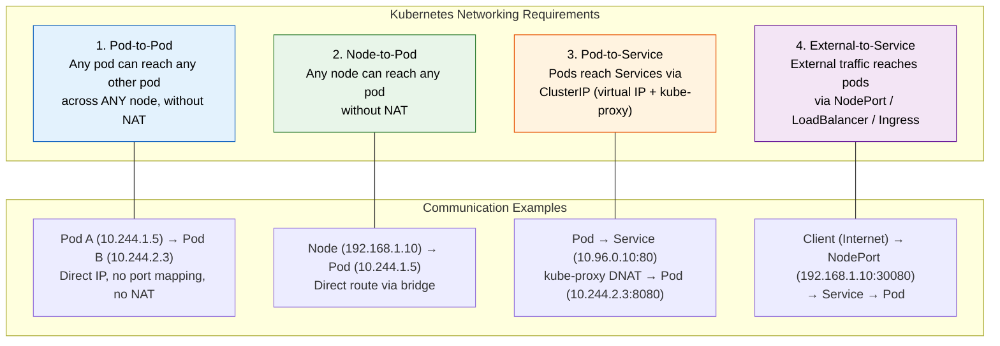
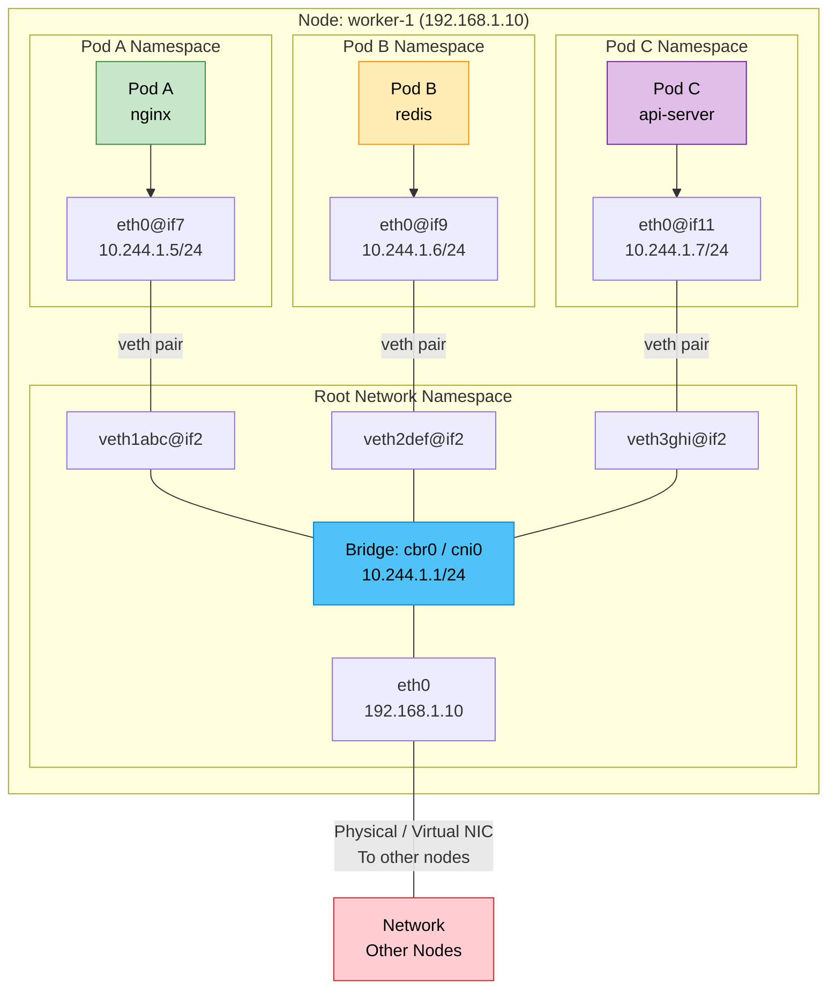

# File 16: Kubernetes Networking Model

**Topic:** The Kubernetes networking model — IP-per-pod, CIDR allocation, network namespaces, veth pairs, bridge networking, and cross-node communication

**WHY THIS MATTERS:** Networking is the circulatory system of Kubernetes. Every pod must communicate with every other pod, across nodes, without NAT. Unlike Docker's port-mapping model, Kubernetes mandates a flat network where each pod gets a real IP. Understanding how this works — from Linux network namespaces to bridge devices to overlay networks — is essential for debugging connectivity issues, choosing CNI plugins, and designing network policies.

---

## Story:

Imagine the **Indian Postal System** delivering mail across the country.

**Every house (pod) has a unique address.** In a village (node), each house has a door number — 10.244.1.5, 10.244.1.6. In the next village, houses have different numbers — 10.244.2.3, 10.244.2.4. No two houses in the entire country share the same address.

**The postman (kube-proxy / CNI) delivers without NAT.** When Ravi in house 10.244.1.5 (Village A) sends a letter to Priya in house 10.244.2.3 (Village B), the letter arrives with Ravi's return address intact — not the village post office's address. This is the "no NAT" rule. Priya can reply directly to 10.244.1.5.

**The village road (veth pair + bridge)** connects each house to the village square. Each house has a private lane (veth pair) leading to the main road (bridge device `cbr0`). The village square connects all lanes together so houses in the same village can talk directly.

**The highway between villages (overlay or routing)** connects Village A to Village B. There are two approaches:
- **Overlay (VXLAN):** Letters are put inside a bigger envelope addressed to the other village's post office. The post office unwraps and delivers locally. Extra overhead but works everywhere.
- **Direct routing (BGP):** Villages share their address directories. The highway signs are updated so mail goes directly — no re-wrapping. Faster but requires smart highway infrastructure (routable network).

**The Service (cluster post office)** has a virtual address (ClusterIP) that does not belong to any house. When you send a letter to the post office (10.96.0.10), the postmaster (kube-proxy) picks a real house and forwards it. If a house closes, the postmaster routes to another house automatically.

---

## Example Block 1 — The Four Networking Requirements

### Section 1 — Kubernetes Networking Rules

**WHY:** Kubernetes mandates these four requirements. Every CNI plugin must satisfy all of them. If any requirement is violated, cluster networking is broken.



```text
Requirement 1: Pod-to-Pod (No NAT)
  Source: Pod A on Node 1 (10.244.1.5)
  Dest:   Pod B on Node 2 (10.244.2.3)
  Rule:   Pod B sees source IP as 10.244.1.5 (NOT Node 1's IP)

Requirement 2: Node-to-Pod
  Source: Node 1 (192.168.1.10)
  Dest:   Pod A on Node 1 (10.244.1.5)
  Rule:   Direct routing via local bridge, no NAT

Requirement 3: Pod-to-Service
  Source: Pod A (10.244.1.5)
  Dest:   Service ClusterIP (10.96.0.10)
  Rule:   kube-proxy translates ClusterIP to a real Pod IP (DNAT)

Requirement 4: External-to-Service
  Source: Internet client (203.0.113.50)
  Dest:   NodePort (192.168.1.10:30080)
  Rule:   NodePort → ClusterIP → Pod IP (double DNAT)
```

### Section 2 — IP-per-Pod

**WHY:** Unlike Docker where containers share the host's IP and use port mapping, Kubernetes gives every pod its own IP address. This eliminates port conflicts and simplifies service discovery.

```bash
# View pod IPs
kubectl get pods -o wide

# EXPECTED OUTPUT:
# NAME        READY   STATUS    RESTARTS   AGE   IP            NODE
# web-abc     1/1     Running   0          5m    10.244.1.5    worker-1
# api-def     1/1     Running   0          5m    10.244.1.6    worker-1
# db-ghi      1/1     Running   0          5m    10.244.2.3    worker-2

# WHY: web-abc and api-def are on the same node but have different IPs.
# Both can listen on port 80 without conflict.
# db-ghi is on a different node with a different subnet (10.244.2.x).

# Verify pod-to-pod connectivity (no NAT)
kubectl exec web-abc -- wget -qO- http://10.244.2.3:27017 --timeout=2 2>&1 || true

# The important thing: db-ghi sees the source IP as 10.244.1.5 (web-abc),
# NOT as 192.168.1.10 (worker-1's node IP). This is the "no NAT" guarantee.
```

---

## Example Block 2 — Network Namespaces and veth Pairs

### Section 1 — Linux Network Namespaces

**WHY:** Each pod gets its own Linux network namespace — an isolated networking stack with its own interfaces, routing table, and iptables rules. This is the foundation of pod network isolation.

```bash
# On a node, list all network namespaces
# SYNTAX:
#   ip netns list
# (requires root/sudo access on the node)

# For kind clusters, exec into the node container
docker exec -it kind-worker bash
ip netns list

# EXPECTED OUTPUT:
# cni-abc123def456 (id: 0)
# cni-ghi789jkl012 (id: 1)

# WHY: Each "cni-" namespace corresponds to a pod's network namespace.
# The pod's network stack (interfaces, routes, iptables) lives inside this namespace.

# View interfaces inside a pod's namespace
ip netns exec cni-abc123def456 ip addr

# EXPECTED OUTPUT:
# 1: lo: <LOOPBACK,UP,LOWER_UP>
#     inet 127.0.0.1/8 scope host lo
# 2: eth0@if7: <BROADCAST,MULTICAST,UP,LOWER_UP>
#     inet 10.244.1.5/24 scope global eth0
#
# WHY: The pod sees two interfaces:
#   lo     — loopback (localhost)
#   eth0   — the pod's network interface with its unique IP
#   @if7   — this means eth0 is connected to interface #7 on the host side
```

### Section 2 — veth Pairs: The Connection

**WHY:** A veth (virtual ethernet) pair is like a cable with two plugs. One plug goes inside the pod's network namespace (eth0), the other plug goes on the host node and connects to the bridge.



```bash
# On the node, view veth pairs
ip link show type veth

# EXPECTED OUTPUT:
# 7: veth1abc@if2: <BROADCAST,MULTICAST,UP,LOWER_UP> ...
#     link/ether 3e:12:ab:cd:ef:01 brd ff:ff:ff:ff:ff:ff link-netns cni-abc123
# 9: veth2def@if2: <BROADCAST,MULTICAST,UP,LOWER_UP> ...
#     link/ether 3e:12:ab:cd:ef:02 brd ff:ff:ff:ff:ff:ff link-netns cni-ghi789
#
# WHY: @if2 means the other end of the veth is interface #2 inside the pod namespace (eth0).
# link-netns shows which namespace the other end belongs to.

# View the bridge and its connected interfaces
bridge link show

# EXPECTED OUTPUT:
# 7: veth1abc@if2: <BROADCAST,MULTICAST,UP,LOWER_UP> master cbr0
# 9: veth2def@if2: <BROADCAST,MULTICAST,UP,LOWER_UP> master cbr0
#
# WHY: Both veth host-side ends are attached to the bridge (cbr0).
# The bridge acts as a Layer 2 switch — all pods on this node can
# communicate directly through the bridge without leaving the node.
```

### Section 3 — Same-Node Pod Communication

**WHY:** When two pods on the same node communicate, traffic flows through the bridge device. No overlay, no routing — pure Layer 2 switching.

```text
Pod A (10.244.1.5) → Pod B (10.244.1.6) — SAME NODE

Step 1: Pod A sends packet from eth0 (10.244.1.5) to 10.244.1.6
Step 2: Packet travels through veth pair to host-side veth1abc
Step 3: veth1abc is attached to bridge cbr0
Step 4: Bridge looks up MAC address for 10.244.1.6 → veth2def
Step 5: Packet exits through veth2def into Pod B's namespace
Step 6: Pod B receives packet on its eth0

Total hops: Pod A eth0 → veth pair → bridge → veth pair → Pod B eth0
Latency: ~microseconds (local bridge forwarding)
```

```bash
# Verify same-node connectivity
# From Pod A, ping Pod B
kubectl exec web-abc -- ping -c 3 10.244.1.6

# EXPECTED OUTPUT:
# PING 10.244.1.6 (10.244.1.6): 56 data bytes
# 64 bytes from 10.244.1.6: seq=0 ttl=64 time=0.089 ms
# 64 bytes from 10.244.1.6: seq=1 ttl=64 time=0.072 ms
# 64 bytes from 10.244.1.6: seq=2 ttl=64 time=0.081 ms
#
# WHY: Sub-millisecond latency confirms bridge-local communication.
# TTL=64 means no routing hops — direct L2 forwarding.
```

---

## Example Block 3 — CIDR Allocation

### Section 1 — Pod CIDR and Node CIDR

**WHY:** Kubernetes assigns a subnet (CIDR block) to each node. Pods on that node get IPs from the node's CIDR. This makes routing straightforward — to reach any pod on a node, just route to that node's CIDR.

```text
Cluster Pod CIDR: 10.244.0.0/16 (65,536 addresses)
    ├── Node 1 CIDR: 10.244.1.0/24 (256 addresses) → Pods: 10.244.1.2 - 10.244.1.254
    ├── Node 2 CIDR: 10.244.2.0/24 (256 addresses) → Pods: 10.244.2.2 - 10.244.2.254
    └── Node 3 CIDR: 10.244.3.0/24 (256 addresses) → Pods: 10.244.3.2 - 10.244.3.254

Service CIDR: 10.96.0.0/12 (1,048,576 addresses)
    └── ClusterIP range: 10.96.0.1 - 10.111.255.254

WHY separate CIDRs:
  - Pod CIDR: Routable, real IPs assigned to pods
  - Service CIDR: Virtual IPs, exist only in iptables/IPVS rules
  - Node CIDR: Each node gets a /24 by default (configurable)
```

```bash
# View cluster CIDR configuration
kubectl cluster-info dump | grep -m 1 cluster-cidr

# EXPECTED OUTPUT:
# "--cluster-cidr=10.244.0.0/16"

# View each node's assigned CIDR
kubectl get nodes -o jsonpath='{range .items[*]}{.metadata.name}{"\t"}{.spec.podCIDR}{"\n"}{end}'

# EXPECTED OUTPUT:
# control-plane   10.244.0.0/24
# worker-1        10.244.1.0/24
# worker-2        10.244.2.0/24
# worker-3        10.244.3.0/24

# View service CIDR
kubectl cluster-info dump | grep -m 1 service-cluster-ip-range

# EXPECTED OUTPUT:
# "--service-cluster-ip-range=10.96.0.0/12"
```

### Section 2 — CIDR Exhaustion

**WHY:** If a node's CIDR runs out of IPs, no new pods can be scheduled on that node. This is a common issue with large pods-per-node configurations.

```text
Default /24 per node = 254 usable IPs
    Minus gateway (.1) and broadcast (.255) = 253 pods max per node

If you need more pods per node:
    Use /23 (510 IPs) or /22 (1022 IPs) per node
    Configure via --node-cidr-mask-size flag on kube-controller-manager

WARNING: Larger per-node CIDRs reduce the number of possible nodes:
    /16 cluster with /24 nodes = 256 nodes max
    /16 cluster with /23 nodes = 128 nodes max
    /16 cluster with /22 nodes = 64 nodes max
```

---

## Example Block 4 — Cross-Node Communication

### Section 1 — Overlay Networking (VXLAN)

**WHY:** When pods on different nodes communicate, the packet must cross the physical (or virtual) network between nodes. Overlay networks encapsulate pod packets inside node-to-node UDP packets, so the underlying network only needs to route between node IPs.

```text
Pod A (10.244.1.5 on Node 1) → Pod B (10.244.2.3 on Node 2)

WITH OVERLAY (VXLAN):

Step 1: Pod A sends packet
    Src: 10.244.1.5  Dst: 10.244.2.3

Step 2: Packet reaches Node 1's bridge (cbr0)
    Bridge has no local match for 10.244.2.x

Step 3: Bridge forwards to VXLAN device (flannel.1)
    VXLAN device ENCAPSULATES the original packet:
    ┌──────────────────────────────────────────────────┐
    │ Outer Header                                     │
    │   Src: 192.168.1.10 (Node 1 IP)                │
    │   Dst: 192.168.1.11 (Node 2 IP)                │
    │   Protocol: UDP, Port: 4789 (VXLAN)             │
    │ ┌──────────────────────────────────────────────┐ │
    │ │ Inner Header (original packet)               │ │
    │ │   Src: 10.244.1.5 (Pod A)                   │ │
    │ │   Dst: 10.244.2.3 (Pod B)                   │ │
    │ │   Payload: HTTP request                      │ │
    │ └──────────────────────────────────────────────┘ │
    └──────────────────────────────────────────────────┘

Step 4: Outer packet traverses physical network (node-to-node)
    Underlying network only sees 192.168.1.10 → 192.168.1.11

Step 5: Node 2 receives UDP:4789 packet
    VXLAN device DECAPSULATES → extracts inner packet

Step 6: Inner packet (10.244.1.5 → 10.244.2.3) delivered via bridge to Pod B

OVERHEAD: ~50 bytes VXLAN header per packet
ADVANTAGE: Works on ANY network (cloud, bare metal, even across subnets)
DISADVANTAGE: Encapsulation overhead, harder to debug with tcpdump
```

### Section 2 — Direct Routing (BGP / Host Routes)

**WHY:** Direct routing avoids encapsulation overhead by programming routes into the network. Each node knows how to reach every other node's pod CIDR directly.

```text
Pod A (10.244.1.5 on Node 1) → Pod B (10.244.2.3 on Node 2)

WITH DIRECT ROUTING (BGP):

Step 1: Pod A sends packet
    Src: 10.244.1.5  Dst: 10.244.2.3

Step 2: Packet reaches Node 1's routing table
    Route: 10.244.2.0/24 via 192.168.1.11 dev eth0
    (Learned via BGP from Node 2)

Step 3: Packet sent directly to Node 2 (no encapsulation)
    ┌──────────────────────────────────────────────────┐
    │ IP Header                                        │
    │   Src: 10.244.1.5 (Pod A) — PRESERVED           │
    │   Dst: 10.244.2.3 (Pod B) — PRESERVED           │
    │   Payload: HTTP request                          │
    └──────────────────────────────────────────────────┘

Step 4: Node 2 receives packet, routes to bridge, delivers to Pod B

OVERHEAD: Zero encapsulation overhead
ADVANTAGE: Lower latency, easier debugging, better performance
DISADVANTAGE: Requires L3 network support (routers must accept pod CIDR routes)
             OR nodes must be on the same L2 network
```

```bash
# View routing table on a node (for a BGP-based CNI like Calico)
ip route

# EXPECTED OUTPUT:
# default via 192.168.1.1 dev eth0
# 10.244.1.0/24 dev cbr0 proto kernel scope link src 10.244.1.1
# 10.244.2.0/24 via 192.168.1.11 dev eth0 proto bird    ← BGP learned route
# 10.244.3.0/24 via 192.168.1.12 dev eth0 proto bird    ← BGP learned route
#
# WHY: "proto bird" means the route was learned via BIRD BGP daemon (Calico).
# Node 1 knows that to reach 10.244.2.0/24, send to Node 2 (192.168.1.11).
```

### Section 3 — Overlay vs Routing Comparison

```text
Feature              Overlay (VXLAN/Geneve)          Direct Routing (BGP)
───────────────────  ───────────────────────────────  ───────────────────────────────
Encapsulation        Yes (~50 bytes overhead)         No
Performance          Slightly lower (encap/decap)     Higher (no encap)
Network requirement  Any IP-reachable network         L2 adjacency or BGP-capable routers
Debugging            Harder (inner packet hidden)     Easier (real IPs visible)
Cloud support        Universal                        Varies (AWS VPC CNI = native routing)
Use case             Multi-subnet, hybrid, simple     Same-subnet, performance-critical
Examples             Flannel VXLAN, Calico VXLAN      Calico BGP, Cilium native routing
```

---

## Example Block 5 — Verifying Network Connectivity

### Section 1 — Diagnostic Commands

**WHY:** When pods cannot communicate, these commands help you trace the packet path.

```bash
# Check pod IP and node
kubectl get pod <pod-name> -o wide

# EXPECTED OUTPUT:
# NAME   READY   STATUS   IP            NODE       NOMINATED NODE
# web    1/1     Running  10.244.1.5    worker-1   <none>

# Test pod-to-pod connectivity
kubectl exec <source-pod> -- ping -c 3 <dest-pod-ip>

# EXPECTED OUTPUT:
# PING 10.244.2.3 (10.244.2.3): 56 data bytes
# 64 bytes from 10.244.2.3: seq=0 ttl=62 time=0.543 ms

# WHY: TTL=62 (not 64) means the packet crossed 2 routing hops
# (Pod A namespace → Node 1 → Node 2 → Pod B namespace)

# Test pod-to-service connectivity
kubectl exec <pod> -- wget -qO- http://<service-name>:<port> --timeout=5

# Check DNS resolution inside pod
kubectl exec <pod> -- nslookup <service-name>

# EXPECTED OUTPUT:
# Server:    10.96.0.10
# Address:   10.96.0.10:53
#
# Name:      my-service.default.svc.cluster.local
# Address:   10.96.45.123

# View iptables rules for a service (on the node)
iptables -t nat -L KUBE-SERVICES -n | grep <service-clusterip>

# EXPECTED OUTPUT:
# KUBE-SVC-XXXXX  tcp  --  0.0.0.0/0  10.96.45.123  /* default/my-service:http */
```

### Section 2 — Network Debugging Pod

**WHY:** A dedicated debugging pod with network tools makes troubleshooting easier.

```yaml
# netshoot-debug.yaml
apiVersion: v1
kind: Pod
metadata:
  name: netshoot
spec:
  containers:
    - name: debug
      image: nicolaka/netshoot:latest     # WHY: Contains tcpdump, dig, nmap, curl, etc.
      command: ["sleep", "3600"]
```

```bash
kubectl apply -f netshoot-debug.yaml

# DNS lookup
kubectl exec netshoot -- dig +short kubernetes.default.svc.cluster.local

# EXPECTED OUTPUT:
# 10.96.0.1

# Trace route to another pod
kubectl exec netshoot -- traceroute 10.244.2.3

# EXPECTED OUTPUT:
# traceroute to 10.244.2.3 (10.244.2.3), 30 hops max, 46 byte packets
#  1  10.244.1.1 (10.244.1.1)  0.123 ms  — bridge gateway
#  2  192.168.1.11 (192.168.1.11)  0.456 ms  — Node 2
#  3  10.244.2.3 (10.244.2.3)  0.789 ms  — Pod B

# TCP port check
kubectl exec netshoot -- nc -zv 10.244.2.3 80

# EXPECTED OUTPUT:
# Connection to 10.244.2.3 80 port [tcp/http] succeeded!

# Capture packets (on the node)
kubectl exec netshoot -- tcpdump -i eth0 -c 10 host 10.244.2.3

# EXPECTED OUTPUT:
# 10:15:30.123 IP 10.244.1.5.45678 > 10.244.2.3.80: Flags [S], ...
# 10:15:30.124 IP 10.244.2.3.80 > 10.244.1.5.45678: Flags [S.], ...
```

---

## Example Block 6 — Node Network Architecture

### Section 1 — Complete Node Network Stack

**WHY:** Seeing the full picture of how a node's network is structured helps you understand where to look when things break.

```text
┌─────────────────────────────────────────────────────────────────────┐
│ NODE: worker-1 (192.168.1.10)                                      │
│                                                                     │
│  ┌──────────────┐  ┌──────────────┐  ┌──────────────┐              │
│  │ Pod A        │  │ Pod B        │  │ Pod C        │              │
│  │ eth0:        │  │ eth0:        │  │ eth0:        │              │
│  │ 10.244.1.5   │  │ 10.244.1.6   │  │ 10.244.1.7   │              │
│  │ netns: cni-a │  │ netns: cni-b │  │ netns: cni-c │              │
│  └──────┬───────┘  └──────┬───────┘  └──────┬───────┘              │
│         │                  │                  │                      │
│    veth-a@if2        veth-b@if2        veth-c@if2                   │
│         │                  │                  │                      │
│  ┌──────┴──────────────────┴──────────────────┴───────┐             │
│  │              Bridge: cbr0 (10.244.1.1/24)          │             │
│  │              MAC learning, L2 forwarding           │             │
│  └────────────────────────┬───────────────────────────┘             │
│                           │                                         │
│  ┌────────────────────────┴───────────────────────────┐             │
│  │              iptables / IPVS                        │             │
│  │              DNAT for Services                      │             │
│  │              SNAT for external traffic               │             │
│  │              Network Policies (Calico/Cilium)       │             │
│  └────────────────────────┬───────────────────────────┘             │
│                           │                                         │
│  ┌────────────────────────┴───────────────────────────┐             │
│  │              eth0: 192.168.1.10                     │             │
│  │              Physical / Virtual NIC                  │             │
│  └────────────────────────┬───────────────────────────┘             │
│                           │                                         │
└───────────────────────────┼─────────────────────────────────────────┘
                            │
                    Physical Network / Cloud VPC
                            │
┌───────────────────────────┼─────────────────────────────────────────┐
│ NODE: worker-2 (192.168.1.11)                                      │
│                           │                                         │
│              eth0: 192.168.1.11                                     │
│              cbr0: 10.244.2.1/24                                    │
│              Pod D: 10.244.2.3                                      │
│              Pod E: 10.244.2.4                                      │
└─────────────────────────────────────────────────────────────────────┘
```

### Section 2 — Packet Walk: Pod A → Pod D (Cross-Node)

```bash
# Full packet walk for cross-node communication
# Overlay network (VXLAN) example:

# Step 1: Pod A (10.244.1.5) sends to Pod D (10.244.2.3)
# Inside Pod A namespace:
ip route  # → default via 10.244.1.1 dev eth0

# Step 2: Packet goes through veth pair to bridge cbr0
# Bridge does ARP for 10.244.2.3 — not found locally

# Step 3: Bridge forwards to default route
# Node routing table:
ip route  # → 10.244.2.0/24 dev flannel.1 (VXLAN interface)

# Step 4: flannel.1 (VXLAN device) encapsulates
# FDB lookup: 10.244.2.0/24 → Node 2 MAC → 192.168.1.11
bridge fdb show dev flannel.1
# → 3e:ab:cd:ef:12:34 dst 192.168.1.11 self permanent

# Step 5: Outer UDP packet (192.168.1.10 → 192.168.1.11:4789) sent via eth0

# Step 6: Node 2 receives, flannel.1 decapsulates, bridge delivers to Pod D

# Total overhead: ~50 bytes VXLAN header
# Total latency: ~0.5-1ms additional vs same-node
```

---

## Key Takeaways

1. **IP-per-pod** is the foundation. Every pod gets a unique, routable IP address. No port mapping, no NAT between pods. This simplifies application design because apps don't need to know about port translation.

2. **Four networking requirements** must be satisfied by every CNI plugin: pod-to-pod (no NAT), node-to-pod, pod-to-service (via kube-proxy), and external-to-service (via NodePort/LoadBalancer/Ingress).

3. **Network namespaces** provide isolation. Each pod has its own networking stack (interfaces, routes, iptables). The host cannot see pod interfaces directly — you must `ip netns exec` to inspect them.

4. **veth pairs** connect pod namespaces to the node's bridge. One end (eth0) is inside the pod, the other end (vethXXX) is on the host and attached to the bridge device.

5. **The bridge device** (cbr0, cni0) acts as a Layer 2 switch for pods on the same node. Same-node pod communication goes through the bridge with microsecond latency.

6. **CIDR allocation** gives each node a subnet (typically /24 = 254 pods). The cluster CIDR (typically /16) is divided among nodes. CIDR exhaustion prevents new pod scheduling.

7. **Overlay networks (VXLAN/Geneve)** encapsulate pod packets inside node-to-node UDP packets. Works on any network but adds ~50 bytes overhead per packet.

8. **Direct routing (BGP)** programs real routes for pod CIDRs. Zero encapsulation overhead but requires L2 adjacency or BGP-capable network infrastructure.

9. **Cross-node latency** is typically 0.5-1ms additional compared to same-node communication. For latency-sensitive workloads, use pod affinity to co-locate pods.

10. **Debug networking** with `kubectl exec` + ping/curl, the `netshoot` container image, `traceroute` to find routing hops, and `tcpdump` to capture packets at each hop in the chain.
