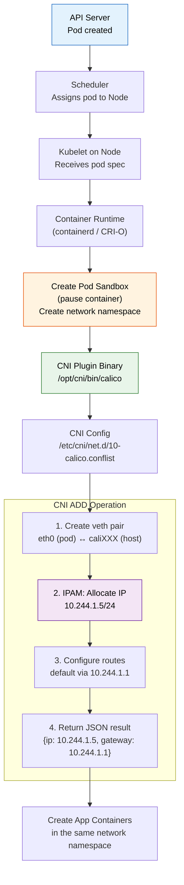
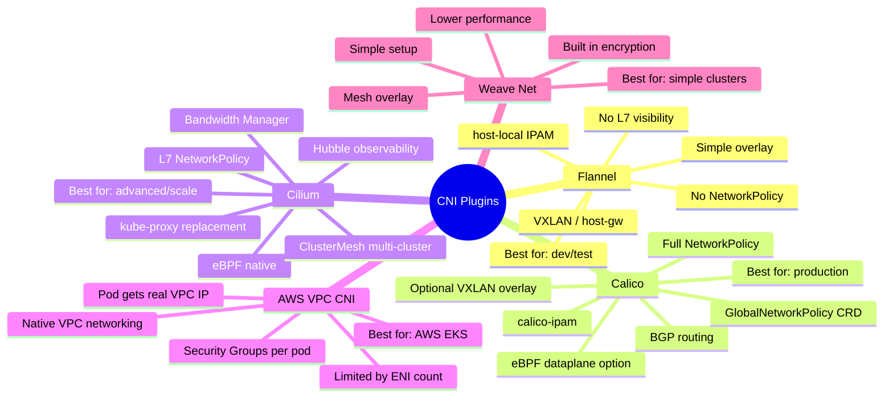

# File 17: CNI Plugins Deep Dive

**Topic:** Container Network Interface (CNI) specification, plugin architecture, IPAM, and deep comparison of Flannel, Calico, and Cilium

**WHY THIS MATTERS:** The CNI plugin is the single most impactful infrastructure choice you make in a Kubernetes cluster. It determines how pods get IP addresses, how cross-node traffic flows, whether you get network policies, and what performance characteristics your cluster has. Choosing the wrong CNI means either rearchitecting your network later or living with limitations that cost real money and reliability.

---

## Story:

Imagine the **National Highways Authority of India (NHAI)** is planning road infrastructure for three different regions.

**Flannel = Village Roads (Simple, Reliable):** In a remote village in Rajasthan, the Panchayat builds simple kachha roads connecting every house. No toll booths, no traffic signals, no speed cameras — just basic connectivity. Everyone can reach everyone else. The roads are cheap to build (VXLAN overlay) and maintain. Perfect for small villages (dev/test clusters) where you just need things to work. But when the village grows into a town, these roads cannot handle the traffic.

**Calico = National Highways with Toll Plazas (BGP + Policy):** The NHAI builds proper highways connecting major cities. Each highway has toll plazas (network policies) that control who can enter and exit. The highways use a smart system — road signs (BGP routing tables) at every junction tell trucks exactly which road to take. No need to put trucks inside bigger trucks (no overlay needed in most cases). The toll system (network policies) can block specific vehicles (pods) from specific routes (namespaces). This is the enterprise choice — it handles real traffic with real security.

**Cilium = Smart Expressways with AI Cameras (eBPF):** The new generation of expressways uses AI-powered cameras and sensors embedded in the road surface (eBPF programs in the kernel). These smart roads can:
- Identify vehicles by their license plate AND cargo contents (L7 visibility — HTTP, gRPC, Kafka)
- Dynamically change speed limits based on traffic (load balancing without kube-proxy)
- Provide real-time dashboards showing every vehicle's journey (Hubble observability)
- Block specific types of cargo on specific routes (L7 network policies — block POST requests but allow GET)
The expressways are more complex to build but provide capabilities that traditional highways cannot match.

---

## Example Block 1 — The CNI Specification

### Section 1 — What Is CNI?

**WHY:** CNI (Container Network Interface) is a specification that defines how container runtimes (containerd, CRI-O) interact with network plugins. It is NOT Kubernetes-specific — it works with any container runtime.

```text
CNI is a contract with 3 operations:

1. ADD    — Called when a new pod is created
             "Set up networking for this container"
             Plugin must: create veth pair, assign IP, set up routes

2. DEL    — Called when a pod is deleted
             "Tear down networking for this container"
             Plugin must: remove veth pair, release IP

3. CHECK  — Called periodically (optional)
             "Is networking still healthy for this container?"
             Plugin returns: success or error

The runtime passes a JSON config to the plugin via stdin.
The plugin returns a JSON result (assigned IP, routes, DNS) via stdout.
```

### Section 2 — CNI Plugin Invocation Flow

**WHY:** Understanding when and how CNI plugins are called helps you debug networking issues during pod creation.



```bash
# View installed CNI plugins
ls /opt/cni/bin/

# EXPECTED OUTPUT (Calico example):
# bandwidth  calico       calico-ipam  flannel     host-local
# bridge     dhcp         ipvlan       loopback    macvlan
# portmap    ptp          sbr          static      tuning
# vlan       vrf

# View CNI configuration
cat /etc/cni/net.d/10-calico.conflist

# EXPECTED OUTPUT (simplified):
# {
#   "name": "k8s-pod-network",
#   "cniVersion": "0.3.1",
#   "plugins": [
#     {
#       "type": "calico",
#       "log_level": "info",
#       "datastore_type": "kubernetes",
#       "ipam": {
#         "type": "calico-ipam"
#       },
#       "policy": {
#         "type": "k8s"
#       }
#     },
#     {
#       "type": "bandwidth",
#       "capabilities": {"bandwidth": true}
#     },
#     {
#       "type": "portmap",
#       "capabilities": {"portMappings": true}
#     }
#   ]
# }

# WHY: The conflist format chains multiple plugins:
#   1. calico — main networking (veth, routing)
#   2. bandwidth — traffic shaping (optional)
#   3. portmap — hostPort support (optional)
```

### Section 3 — CNI Plugin Configuration

```yaml
# Example CNI config (simplified)
# /etc/cni/net.d/10-flannel.conflist
{
  "name": "cbr0",
  "cniVersion": "1.0.0",                  # WHY: CNI spec version
  "plugins": [
    {
      "type": "flannel",                   # WHY: Plugin binary name in /opt/cni/bin/
      "delegate": {
        "hairpinMode": true,               # WHY: Allow pod to reach its own Service IP
        "isDefaultGateway": true           # WHY: Set bridge as default gateway
      }
    },
    {
      "type": "portmap",                   # WHY: Support hostPort mappings
      "capabilities": {
        "portMappings": true
      }
    }
  ]
}
```

---

## Example Block 2 — IPAM (IP Address Management)

### Section 1 — IPAM Types

**WHY:** IPAM is responsible for allocating and releasing IP addresses for pods. Different IPAM plugins have different allocation strategies.

```text
IPAM Plugin        How It Works                         Used By
────────────────   ──────────────────────────────────   ────────────────
host-local         Allocates from a local CIDR range    Flannel, Bridge
                   stored in /var/lib/cni/networks/
                   Simple but no cross-node awareness

calico-ipam        Allocates from IP pools              Calico
                   Block-based allocation (each node
                   gets a /26 block from the pool)
                   Cross-node aware via etcd/K8s API

aws-cni-ipam       Attaches real ENI/IPs from VPC       AWS VPC CNI
                   Pods get VPC-routable IPs
                   Limited by instance ENI limits

whereabouts        DHCP-like, range-based               Multus (secondary)
                   Cluster-wide coordination via CRDs
```

```bash
# View IPAM allocations (host-local)
ls /var/lib/cni/networks/cbr0/

# EXPECTED OUTPUT:
# 10.244.1.2   10.244.1.3   10.244.1.5   10.244.1.6
# last_reserved_ip.0
# lock

cat /var/lib/cni/networks/cbr0/10.244.1.5

# EXPECTED OUTPUT:
# abc123def456  ← container ID that owns this IP

# View Calico IPAM allocations
kubectl get ipamblocks -o wide

# EXPECTED OUTPUT:
# NAME                  CIDR              AFFINITY
# 10-244-1-0-26         10.244.1.0/26     host:worker-1
# 10-244-1-64-26        10.244.1.64/26    host:worker-1
# 10-244-2-0-26         10.244.2.0/26     host:worker-2

# WHY: Calico allocates /26 blocks (64 IPs each) to nodes.
# When a block is exhausted, a new block is allocated.
```

---

## Example Block 3 — Flannel (Simple Overlay)

### Section 1 — How Flannel Works

**WHY:** Flannel is the simplest CNI plugin. It creates a VXLAN overlay network where each node gets a subnet and pods communicate through encapsulated packets. Zero network policy support — it is pure connectivity.

```text
Flannel Architecture:
    ┌─────────────────────────────────────────────────┐
    │ Node 1                                           │
    │                                                   │
    │  Pod A (10.244.1.5) ──veth──→ cni0 (bridge)     │
    │  Pod B (10.244.1.6) ──veth──→ cni0              │
    │                                  │                │
    │                            flannel.1 (VXLAN)     │
    │                                  │                │
    │                              eth0 (node IP)      │
    └──────────────────────────────────┼───────────────┘
                                       │ UDP:4789
    ┌──────────────────────────────────┼───────────────┐
    │ Node 2                           │                │
    │                              eth0 (node IP)      │
    │                                  │                │
    │                            flannel.1 (VXLAN)     │
    │                                  │                │
    │                              cni0 (bridge)       │
    │  Pod C (10.244.2.3) ──veth──→ cni0              │
    │  Pod D (10.244.2.4) ──veth──→ cni0              │
    └─────────────────────────────────────────────────┘

Components:
    flanneld      — DaemonSet on every node, manages subnet allocation
    flannel.1     — VXLAN device for encapsulation
    cni0          — Linux bridge connecting local pods
    /opt/cni/bin/ — CNI binary for pod setup
```

```bash
# Install Flannel
kubectl apply -f https://github.com/flannel-io/flannel/releases/latest/download/kube-flannel.yml

# EXPECTED OUTPUT:
# namespace/kube-flannel created
# clusterrole.rbac.authorization.k8s.io/flannel created
# ...
# daemonset.apps/kube-flannel-ds created

# Verify Flannel pods
kubectl get pods -n kube-flannel

# EXPECTED OUTPUT:
# NAME                    READY   STATUS    RESTARTS   AGE
# kube-flannel-ds-abc12   1/1     Running   0          30s
# kube-flannel-ds-def34   1/1     Running   0          30s
# kube-flannel-ds-ghi56   1/1     Running   0          30s

# View Flannel subnet allocation
cat /run/flannel/subnet.env

# EXPECTED OUTPUT:
# FLANNEL_NETWORK=10.244.0.0/16
# FLANNEL_SUBNET=10.244.1.1/24
# FLANNEL_MTU=1450
# FLANNEL_IPMASQ=true

# WHY: MTU=1450 (not 1500) because VXLAN header takes 50 bytes.
# IPMASQ=true means Flannel adds iptables MASQUERADE rules for
# pod-to-external traffic (SNAT to node IP).
```

### Section 2 — Flannel Backend Options

```text
Backend       Transport     Overhead    Performance    Use Case
────────────  ───────────   ──────────  ───────────    ──────────────
VXLAN         UDP           ~50 bytes   Good           Default, most common
host-gw       Direct route  Zero        Best           Nodes on same L2 subnet
WireGuard     Encrypted     ~60 bytes   Good           When encryption needed
UDP           Userspace     High        Poor           Fallback only (deprecated)
```

---

## Example Block 4 — Calico (BGP + Network Policy)

### Section 1 — How Calico Works

**WHY:** Calico uses BGP to distribute pod routes, eliminating the need for overlay encapsulation. It also provides full NetworkPolicy support, making it the most popular CNI for production clusters.

```text
Calico Architecture:
    ┌────────────────────────────────────────────────────┐
    │ Node 1                                              │
    │                                                      │
    │  Pod A (10.244.1.5) ──veth──→ caliXXX (no bridge!) │
    │  Pod B (10.244.1.6) ──veth──→ caliYYY              │
    │                                                      │
    │  felix (policy agent)    ──→ iptables/eBPF rules    │
    │  BIRD (BGP daemon)       ──→ advertises routes      │
    │  confd (config manager)  ──→ updates BIRD config    │
    │                                                      │
    │  Routing table:                                      │
    │    10.244.1.5/32 dev caliXXX ← local pod route     │
    │    10.244.1.6/32 dev caliYYY ← local pod route     │
    │    10.244.2.0/26 via 192.168.1.11 ← BGP learned    │
    │                                                      │
    │                         eth0 (192.168.1.10)         │
    └─────────────────────────────┼───────────────────────┘
                                  │ IP routing (no encap)
    ┌─────────────────────────────┼───────────────────────┐
    │ Node 2                      │                        │
    │                         eth0 (192.168.1.11)         │
    │                                                      │
    │  Routing table:                                      │
    │    10.244.2.3/32 dev caliAAA ← local pod route     │
    │    10.244.1.0/26 via 192.168.1.10 ← BGP learned    │
    │                                                      │
    │  Pod C (10.244.2.3) ──veth──→ caliAAA              │
    └─────────────────────────────────────────────────────┘

KEY DIFFERENCE from Flannel:
    - No bridge device! Each pod gets a /32 route directly on the host
    - No encapsulation (in BGP mode) — raw IP routing
    - felix enforces NetworkPolicies via iptables or eBPF
    - BIRD daemon peers with other nodes via BGP
```

```bash
# Install Calico (operator method)
kubectl create -f https://raw.githubusercontent.com/projectcalico/calico/v3.27.0/manifests/tigera-operator.yaml

cat <<'EOF' | kubectl apply -f -
apiVersion: operator.tigera.io/v1
kind: Installation
metadata:
  name: default
spec:
  calicoNetwork:
    ipPools:
      - blockSize: 26                    # WHY: Each node gets /26 blocks (64 IPs)
        cidr: 10.244.0.0/16             # WHY: Cluster pod CIDR
        encapsulation: None              # WHY: Pure BGP routing, no overlay
        natOutgoing: Enabled             # WHY: SNAT for pod-to-external traffic
        nodeSelector: all()
    bgp: Enabled                         # WHY: Enable BGP peering between nodes
EOF

# Verify Calico pods
kubectl get pods -n calico-system

# EXPECTED OUTPUT:
# NAME                                      READY   STATUS    AGE
# calico-kube-controllers-xxx               1/1     Running   60s
# calico-node-abc12                         1/1     Running   60s
# calico-node-def34                         1/1     Running   60s
# calico-node-ghi56                         1/1     Running   60s
# calico-typha-xxx                          1/1     Running   60s

# View BGP peering status
kubectl exec -n calico-system calico-node-abc12 -- birdcl show protocols

# EXPECTED OUTPUT:
# Name       Proto      Table      State  Since         Info
# node_192_168_1_11  BGP   ---    up     10:15:30.123  Established
# node_192_168_1_12  BGP   ---    up     10:15:30.456  Established
```

### Section 2 — Calico Network Policies

**WHY:** Calico extends Kubernetes NetworkPolicy with its own CRDs for more advanced rules — global policies, DNS-based rules, and application-layer policies.

```yaml
# calico-network-policy.yaml
apiVersion: projectcalico.org/v3
kind: NetworkPolicy
metadata:
  name: allow-frontend-to-backend
  namespace: production
spec:
  selector: app == 'backend'              # WHY: Apply to backend pods
  ingress:
    - action: Allow
      protocol: TCP
      source:
        selector: app == 'frontend'       # WHY: Only frontend pods can connect
      destination:
        ports:
          - 8080
    - action: Deny                        # WHY: Deny everything else (explicit deny)
  egress:
    - action: Allow
      protocol: TCP
      destination:
        selector: app == 'database'
        ports:
          - 5432
    - action: Allow
      protocol: UDP
      destination:
        ports:
          - 53                            # WHY: Allow DNS lookups
    - action: Deny
```

### Section 3 — Calico Encapsulation Modes

```text
Mode            How                   When to Use
──────────────  ────────────────────  ────────────────────────────────
None            Pure BGP routing      Nodes on same L2 or with BGP routers
VXLAN           VXLAN encapsulation   Cross-subnet, no BGP infrastructure
VXLANCrossSubnet  BGP within subnet  Mixed — same-subnet=BGP, cross-subnet=VXLAN
                  VXLAN across
IPIP            IP-in-IP encap        Legacy, less overhead than VXLAN
IPIPCrossSubnet   Same as above       Mixed mode for IPIP
```

```bash
# Switch Calico to VXLAN mode (for cloud environments without BGP)
kubectl patch installation default --type=merge -p '
spec:
  calicoNetwork:
    ipPools:
      - cidr: 10.244.0.0/16
        encapsulation: VXLANCrossSubnet
        natOutgoing: Enabled
        blockSize: 26
'

# EXPECTED OUTPUT:
# installation.operator.tigera.io/default patched
```

---

## Example Block 5 — Cilium (eBPF-Powered)

### Section 1 — How Cilium Works

**WHY:** Cilium replaces iptables with eBPF programs loaded directly into the Linux kernel. This provides dramatically better performance at scale (no iptables chain traversal), L7 visibility (HTTP, gRPC, Kafka), and kube-proxy replacement.

```text
Cilium Architecture:
    ┌───────────────────────────────────────────────────────────┐
    │ Node 1                                                     │
    │                                                             │
    │  Pod A (10.244.1.5) ──veth──→ lxcXXX                      │
    │  Pod B (10.244.1.6) ──veth──→ lxcYYY                      │
    │                                                             │
    │  ┌──────────────────────────────────────────────┐          │
    │  │ eBPF Programs (in kernel)                    │          │
    │  │                                              │          │
    │  │  TC (Traffic Control) hooks:                 │          │
    │  │    ├── Ingress filter → policy enforcement   │          │
    │  │    ├── Egress filter → DNAT for services     │          │
    │  │    └── L7 parsing → HTTP/gRPC inspection     │          │
    │  │                                              │          │
    │  │  XDP (eXpress Data Path):                    │          │
    │  │    └── Ultra-fast packet drop (DDoS)         │          │
    │  │                                              │          │
    │  │  Socket-level hooks:                         │          │
    │  │    └── Direct pod-to-pod (skip network       │          │
    │  │        stack entirely for local pods)         │          │
    │  └──────────────────────────────────────────────┘          │
    │                                                             │
    │  cilium-agent (DaemonSet) → manages eBPF programs          │
    │  Hubble (observability) → flow visibility                  │
    │                                                             │
    │                         eth0 (192.168.1.10)                │
    └─────────────────────────────┼──────────────────────────────┘
                                  │ VXLAN / Geneve / Native routing
```

```bash
# Install Cilium using Helm
helm repo add cilium https://helm.cilium.io/
helm install cilium cilium/cilium --version 1.15.0 \
  --namespace kube-system \
  --set kubeProxyReplacement=true \
  --set k8sServiceHost=<API_SERVER_IP> \
  --set k8sServicePort=6443 \
  --set hubble.enabled=true \
  --set hubble.relay.enabled=true \
  --set hubble.ui.enabled=true

# EXPECTED OUTPUT:
# NAME: cilium
# LAST DEPLOYED: ...
# NAMESPACE: kube-system
# STATUS: deployed

# Verify Cilium status
cilium status

# EXPECTED OUTPUT:
#     /¯¯\
#  /¯¯\__/¯¯\    Cilium:             OK
#  \__/¯¯\__/    Operator:           OK
#  /¯¯\__/¯¯\    Envoy DaemonSet:    OK
#  \__/¯¯\__/    Hubble Relay:       OK
#  \__/          ClusterMesh:        disabled
#
# KubeProxyReplacement:    True
# Host firewall:           Disabled

# Run connectivity test
cilium connectivity test

# EXPECTED OUTPUT:
# ✅ All 46 tests passed
```

### Section 2 — Cilium L7 Network Policy

**WHY:** Cilium can enforce policies at the application layer — allow GET but deny POST, allow specific gRPC methods, restrict Kafka topics.

```yaml
# cilium-l7-policy.yaml
apiVersion: cilium.io/v2
kind: CiliumNetworkPolicy
metadata:
  name: l7-api-policy
  namespace: production
spec:
  endpointSelector:
    matchLabels:
      app: api-server
  ingress:
    - fromEndpoints:
        - matchLabels:
            app: frontend
      toPorts:
        - ports:
            - port: "8080"
              protocol: TCP
          rules:
            http:                          # WHY: L7 HTTP-aware policy
              - method: "GET"              # WHY: Allow GET requests
                path: "/api/v1/products"   # WHY: Only to this specific path
              - method: "GET"
                path: "/api/v1/health"
              # WHY: POST, PUT, DELETE are implicitly denied
              # Frontend can read products but cannot modify them
```

### Section 3 — Hubble Observability

**WHY:** Hubble provides real-time network flow visibility, showing exactly which pods are communicating, on which ports, and whether flows are allowed or dropped by policy.

```bash
# Install Hubble CLI
export HUBBLE_VERSION=$(curl -s https://raw.githubusercontent.com/cilium/hubble/master/stable.txt)
curl -L --fail --remote-name-all \
  https://github.com/cilium/hubble/releases/download/$HUBBLE_VERSION/hubble-linux-amd64.tar.gz
tar xzvf hubble-linux-amd64.tar.gz
sudo mv hubble /usr/local/bin/

# Port-forward Hubble Relay
kubectl port-forward -n kube-system svc/hubble-relay 4245:80 &

# Observe real-time flows
hubble observe --namespace production

# EXPECTED OUTPUT:
# TIMESTAMP             SOURCE                    DESTINATION               TYPE      VERDICT
# Jan 15 10:15:30.123   production/frontend-abc   production/api-def:8080   L7/HTTP   FORWARDED
#                        GET /api/v1/products HTTP/1.1
# Jan 15 10:15:30.456   production/frontend-abc   production/api-def:8080   L7/HTTP   DROPPED
#                        POST /api/v1/products HTTP/1.1
#
# WHY: Hubble shows L7-level visibility — you can see the HTTP method and path.
# The POST request was DROPPED by the L7 network policy.

# View flow summary
hubble observe --namespace production -o compact --last 100

# EXPECTED OUTPUT:
# → production/frontend → production/api:8080 HTTP GET /api/v1/products FORWARDED
# ✗ production/frontend → production/api:8080 HTTP POST /api/v1/products DROPPED
```

---

## Example Block 6 — CNI Comparison Matrix

### Section 1 — Feature Comparison



### Section 2 — Detailed Comparison Table

```text
Feature                  Flannel          Calico            Cilium           AWS VPC CNI
─────────────────────    ──────────────   ────────────────  ───────────────  ──────────────
Dataplane                VXLAN/host-gw    iptables/eBPF     eBPF             AWS ENI
Encapsulation            VXLAN            None/VXLAN/IPIP   VXLAN/Geneve     None (VPC native)
Routing                  Overlay          BGP               Native/overlay   VPC routing
K8s NetworkPolicy        ❌               ✅                ✅               ✅ (via Calico)
L7 Policy                ❌               ❌ (basic)        ✅ (HTTP/gRPC)   ❌
kube-proxy replacement   ❌               ❌ (partial)      ✅               ❌
Observability            Logs only        Flow logs          Hubble           VPC Flow Logs
Encryption (WireGuard)   ✅ (backend)     ✅                ✅               ❌
Multi-cluster            ❌               ❌ (federation)   ✅ ClusterMesh   ❌
IPAM                     host-local       calico-ipam        Cilium IPAM     AWS ENI
IPv6 / Dual-stack        ❌               ✅                ✅               ✅
Performance at scale     Good             Very Good          Excellent        Excellent
Complexity               Low              Medium             High             Low (AWS only)
Community                Active           Very Active        Very Active      AWS managed
```

### Section 3 — When to Choose What

```text
Choose Flannel when:
  ✓ You need the simplest possible setup
  ✓ Dev/test/learning environments
  ✓ No network policy requirements
  ✓ Small clusters (<50 nodes)
  ✗ NOT for production with security needs

Choose Calico when:
  ✓ Production clusters
  ✓ Network policy enforcement required
  ✓ BGP routing available (bare metal, some clouds)
  ✓ Standard Kubernetes networking
  ✓ You want a battle-tested, widely adopted solution
  ✗ NOT if you need L7 visibility without extra tools

Choose Cilium when:
  ✓ Large scale clusters (100+ nodes)
  ✓ L7 visibility and policy (HTTP, gRPC, Kafka)
  ✓ kube-proxy replacement for performance
  ✓ Built-in observability (Hubble)
  ✓ Multi-cluster networking (ClusterMesh)
  ✗ NOT if you want the simplest setup
  ✗ Requires kernel 4.19+ (5.10+ recommended)

Choose AWS VPC CNI when:
  ✓ Running on AWS EKS
  ✓ Need VPC-native pod IPs (security groups, VPC peering)
  ✓ Want AWS-managed networking
  ✗ NOT for non-AWS environments
  ✗ Limited by EC2 instance ENI/IP limits
```

---

## Example Block 7 — Dual-Stack IPv4/IPv6

### Section 1 — Why Dual-Stack?

**WHY:** As IPv4 addresses exhaust, Kubernetes supports dual-stack networking — pods get both an IPv4 and IPv6 address. This enables IPv6-native workloads while maintaining IPv4 backward compatibility.

```yaml
# dual-stack-service.yaml
apiVersion: v1
kind: Service
metadata:
  name: dual-stack-app
spec:
  type: ClusterIP
  ipFamilyPolicy: PreferDualStack        # WHY: Request both IPv4 and IPv6 ClusterIPs
  # Options:
  #   SingleStack       — One IP family only (default)
  #   PreferDualStack   — Both if available, single if not
  #   RequireDualStack  — Fail if dual-stack not available
  ipFamilies:
    - IPv4                                # WHY: Primary family
    - IPv6                                # WHY: Secondary family
  selector:
    app: dual-stack-app
  ports:
    - port: 80
      targetPort: 8080
```

```bash
# Check if cluster supports dual-stack
kubectl get nodes -o jsonpath='{.items[0].spec.podCIDRs}'

# EXPECTED OUTPUT (dual-stack):
# ["10.244.0.0/24","fd00:10:244::/64"]

# View dual-stack service
kubectl get svc dual-stack-app

# EXPECTED OUTPUT:
# NAME              TYPE        CLUSTER-IP     EXTERNAL-IP   PORT(S)   AGE
# dual-stack-app    ClusterIP   10.96.45.123   <none>        80/TCP    5s

kubectl get svc dual-stack-app -o jsonpath='{.spec.clusterIPs}'

# EXPECTED OUTPUT:
# ["10.96.45.123","fd00::1:2:3"]

# View pod with dual-stack IPs
kubectl get pod -l app=dual-stack-app -o jsonpath='{.items[0].status.podIPs}'

# EXPECTED OUTPUT:
# [{"ip":"10.244.1.5"},{"ip":"fd00:10:244:1::5"}]
```

### Section 2 — Configuring Dual-Stack

```text
Requirements for dual-stack:
  1. kube-apiserver: --service-cluster-ip-range=10.96.0.0/16,fd00::/108
  2. kube-controller-manager:
     --cluster-cidr=10.244.0.0/16,fd00:10:244::/48
     --node-cidr-mask-size-ipv4=24
     --node-cidr-mask-size-ipv6=64
  3. kube-proxy: --cluster-cidr=10.244.0.0/16,fd00:10:244::/48
  4. CNI plugin must support dual-stack (Calico, Cilium — yes; Flannel — no)
```

---

## Example Block 8 — Advanced CNI Patterns

### Section 1 — Multus (Multiple CNI)

**WHY:** Some workloads (telco, NFV, SR-IOV) need multiple network interfaces. Multus is a meta-CNI that lets you attach additional networks to pods.

```yaml
# multus-network-attachment.yaml
apiVersion: k8s.cni.cncf.io/v1
kind: NetworkAttachmentDefinition
metadata:
  name: data-network
spec:
  config: |
    {
      "cniVersion": "0.3.1",
      "type": "macvlan",                  # WHY: Direct access to physical network
      "master": "eth1",                   # WHY: Physical interface for data plane
      "mode": "bridge",
      "ipam": {
        "type": "host-local",
        "ranges": [
          [{"subnet": "192.168.100.0/24"}]
        ]
      }
    }
---
# pod-with-multus.yaml
apiVersion: v1
kind: Pod
metadata:
  name: multi-nic-pod
  annotations:
    k8s.v1.cni.cncf.io/networks: data-network   # WHY: Attach secondary network
spec:
  containers:
    - name: app
      image: busybox:1.36
      command: ["sleep", "3600"]
```

```bash
kubectl apply -f multus-network-attachment.yaml
kubectl apply -f pod-with-multus.yaml

# Verify multiple interfaces
kubectl exec multi-nic-pod -- ip addr

# EXPECTED OUTPUT:
# 1: lo: <LOOPBACK,UP,LOWER_UP>
#     inet 127.0.0.1/8
# 2: eth0@if10: <BROADCAST,MULTICAST,UP>
#     inet 10.244.1.5/24          ← Primary (Calico/Cilium)
# 3: net1@if12: <BROADCAST,MULTICAST,UP>
#     inet 192.168.100.5/24       ← Secondary (Multus/macvlan)
```

### Section 2 — CNI Benchmarking

**WHY:** Performance varies significantly between CNI plugins. Benchmark before committing to a choice.

```bash
# Use iperf3 for network throughput testing
# Deploy server
kubectl run iperf-server --image=networkstatic/iperf3 -- -s

# Deploy client on a different node
kubectl run iperf-client --image=networkstatic/iperf3 \
  --overrides='{"spec":{"nodeName":"worker-2"}}' \
  -- -c <server-pod-ip> -t 30

# View results
kubectl logs iperf-client

# EXPECTED OUTPUT (example):
# [ ID] Interval           Transfer     Bitrate
# [  5]   0.00-30.00  sec  28.5 GBytes  8.16 Gbits/sec   sender
# [  5]   0.00-30.00  sec  28.5 GBytes  8.16 Gbits/sec   receiver

# Typical benchmarks (10 GbE, cross-node):
#   Flannel VXLAN:     ~7-8 Gbps (VXLAN overhead)
#   Calico BGP:        ~9-9.5 Gbps (no encap)
#   Cilium eBPF:       ~9.5-10 Gbps (kernel bypass)
#   AWS VPC CNI:       ~9.5 Gbps (native VPC)
#   Bare metal (no CNI): ~10 Gbps (baseline)
```

---

## Key Takeaways

1. **CNI is a specification** with three operations: ADD (create networking for new pod), DEL (tear down), CHECK (verify). The runtime calls the CNI binary with JSON config via stdin and gets JSON result via stdout.

2. **IPAM (IP Address Management)** is a separate concern from networking. Different plugins use different IPAM strategies: host-local (simple range), calico-ipam (block-based), aws-cni-ipam (VPC ENIs).

3. **Flannel** is the simplest CNI — VXLAN overlay, no network policy, no L7 visibility. Perfect for learning and dev environments. Not suitable for production with security requirements.

4. **Calico** uses BGP routing (no encapsulation) and provides full NetworkPolicy support. It is the most widely deployed production CNI. Supports optional VXLAN/IPIP for environments without BGP.

5. **Cilium** uses eBPF to replace iptables entirely, providing superior performance at scale, L7 network policies (HTTP/gRPC/Kafka), and built-in observability via Hubble.

6. **eBPF vs iptables:** iptables performance degrades linearly with the number of rules (O(n) chain traversal). eBPF uses hash maps for O(1) lookups, making it dramatically faster in large clusters with many services.

7. **Dual-stack IPv4/IPv6** is supported by Calico and Cilium. Pods get both an IPv4 and IPv6 address. Services can have both ClusterIPs. Flannel does not support dual-stack.

8. **Multus** is a meta-CNI that allows pods to have multiple network interfaces. Used in telco/NFV workloads that need separate data plane and control plane networks.

9. **CNI plugin selection** is a one-way door — changing CNI plugins in a running cluster requires draining all nodes and recreating pod networking. Choose carefully before production deployment.

10. **Benchmark your CNI** using iperf3 before committing. The performance difference between overlay (Flannel VXLAN) and native routing (Calico BGP, Cilium) can be 15-25% in throughput and significantly more in latency.
