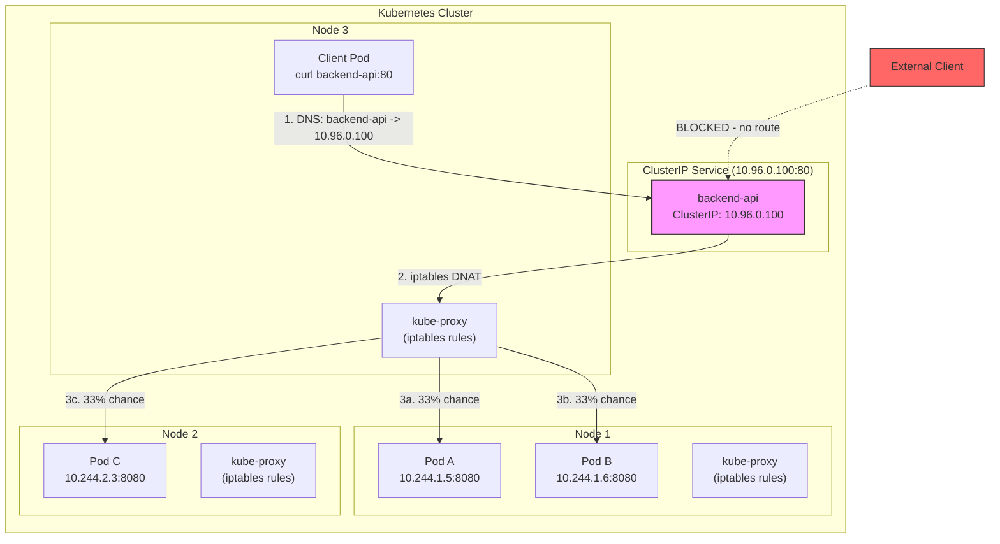
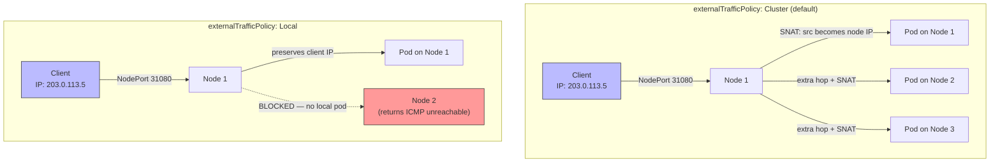
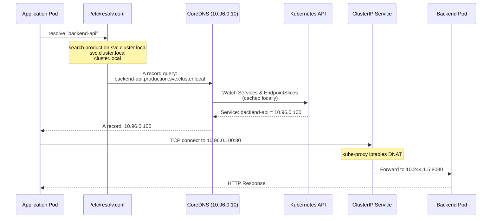

# File 18: Services and Service Discovery

**Topic:** Kubernetes Services — ClusterIP, NodePort, LoadBalancer, ExternalName, DNS, and kube-proxy internals

**WHY THIS MATTERS:**
Pods are ephemeral. They come and go, their IP addresses change every time they restart. Without Services, every application would need to track every pod IP manually — an impossible task at scale. Services give you a stable endpoint that automatically routes traffic to healthy pods, no matter how many times they restart or reschedule. Understanding Services is the difference between a fragile demo and a production-ready deployment.

---

## Story: The STD/ISD Phone Booth System of India

Remember the days before everyone had mobile phones? India had a brilliant communication system built on layers of accessibility.

**The Internal Extension (ClusterIP):** Inside a large office building — say Tata Consultancy in Mumbai — every desk had an internal extension number. You could dial 4-digit numbers like 2345 to reach your colleague on another floor. These extensions only worked inside the building. No one from outside could dial 2345 and reach that desk. This is your **ClusterIP** — a virtual IP that only works inside the Kubernetes cluster.

**The Landline Number (NodePort):** The office also had landline numbers like 022-2345-6789. Anyone in Mumbai — or even from another city — could dial this number to reach the office receptionist, who would then connect the call to the right extension. This is your **NodePort** — it opens a specific port on every node in the cluster, letting external traffic reach your service.

**The 1800 Toll-Free Number (LoadBalancer):** Big companies like IRCTC had 1800 numbers. You didn't need to know which city their call center was in, or which phone line to call. The 1800 system automatically routed your call to the nearest available operator. This is your **LoadBalancer** — it provisions an external load balancer (in cloud environments) that distributes traffic across your nodes.

**Call Forwarding / Referral (ExternalName):** Sometimes you'd call a number and hear "This number has been changed. Please dial 1800-XXX-YYYY instead." The phone system redirected you to a completely different number. This is your **ExternalName** — it returns a CNAME record pointing to an external DNS name, redirecting traffic outside the cluster.

**The Telephone Exchange (kube-proxy):** Behind all of this was the telephone exchange — the mechanical or electronic system that actually connected calls. It maintained routing tables, knew which extensions were active, and switched connections. **kube-proxy** is your telephone exchange. It runs on every node and programs the network rules (iptables or IPVS) that make Services work.

**The Phone Directory (CoreDNS):** And of course, you had the telephone directory — the thick Yellow Pages book that mapped names to numbers. "Want to call State Bank of India? Look up SBI in the directory." **CoreDNS** is your cluster's phone directory, resolving service names to ClusterIP addresses.

---

## Example Block 1 — ClusterIP: The Internal Extension

### Section 1 — Understanding ClusterIP

**WHY:** ClusterIP is the default and most fundamental service type. Every other service type builds on top of it. When you create a ClusterIP service, Kubernetes assigns a virtual IP from a predefined range. This IP doesn't belong to any network interface — it exists only in the iptables/IPVS rules on every node.

```yaml
# WHY: ClusterIP service — stable internal endpoint for a set of pods
apiVersion: v1
kind: Service
metadata:
  name: backend-api          # WHY: this name becomes the DNS entry
  namespace: production      # WHY: namespace scopes the DNS name
  labels:
    app: backend             # WHY: labels on the service itself (for identification)
spec:
  type: ClusterIP            # WHY: default type — internal-only access
  selector:
    app: backend             # WHY: selects pods with this label — traffic goes to these pods
    tier: api                # WHY: multiple labels narrow the selection (AND logic)
  ports:
    - name: http             # WHY: naming ports is required when you have multiple ports
      protocol: TCP          # WHY: TCP is default; UDP and SCTP also supported
      port: 80               # WHY: the port the SERVICE listens on (what clients connect to)
      targetPort: 8080       # WHY: the port the POD listens on (where traffic is forwarded)
    - name: grpc
      protocol: TCP
      port: 9090
      targetPort: 9090
  sessionAffinity: None      # WHY: default — each request can go to any pod (round-robin)
```



### Section 2 — Inspecting ClusterIP Services

**WHY:** You need to verify your service is correctly selecting pods and routing traffic. The `kubectl get endpoints` command shows you which pod IPs are behind a service.

```bash
# SYNTAX: kubectl get service <name> -n <namespace> -o wide
# FLAGS:
#   -o wide    Show additional columns (selector, etc.)
# EXPECTED OUTPUT:
# NAME          TYPE        CLUSTER-IP     EXTERNAL-IP   PORT(S)          AGE   SELECTOR
# backend-api   ClusterIP   10.96.0.100    <none>        80/TCP,9090/TCP  5m    app=backend,tier=api

kubectl get service backend-api -n production -o wide
```

```bash
# SYNTAX: kubectl get endpoints <service-name> -n <namespace>
# WHY: Endpoints show which pod IPs are registered behind the service
# EXPECTED OUTPUT:
# NAME          ENDPOINTS                                            AGE
# backend-api   10.244.1.5:8080,10.244.1.6:8080,10.244.2.3:8080     5m

kubectl get endpoints backend-api -n production
```

```bash
# SYNTAX: kubectl describe service <name> -n <namespace>
# WHY: Shows full details including selector, endpoints, and events
# EXPECTED OUTPUT:
# Name:              backend-api
# Namespace:         production
# Labels:            app=backend
# Selector:          app=backend,tier=api
# Type:              ClusterIP
# IP:                10.96.0.100
# Port:              http  80/TCP
# TargetPort:        8080/TCP
# Endpoints:         10.244.1.5:8080,10.244.1.6:8080,10.244.2.3:8080
# Session Affinity:  None
# Events:            <none>

kubectl describe service backend-api -n production
```

---

## Example Block 2 — NodePort: The Landline Number

### Section 1 — NodePort Basics

**WHY:** NodePort extends ClusterIP by opening a static port (30000-32767) on every node. This is the simplest way to expose a service externally without a cloud load balancer. Traffic hitting any node's IP on that port gets forwarded to the service.

```yaml
# WHY: NodePort service — accessible from outside the cluster
apiVersion: v1
kind: Service
metadata:
  name: frontend-web
  namespace: production
spec:
  type: NodePort              # WHY: opens a port on every node
  selector:
    app: frontend
  ports:
    - name: http
      protocol: TCP
      port: 80                # WHY: internal ClusterIP port (still works inside cluster)
      targetPort: 3000        # WHY: the container port
      nodePort: 31080         # WHY: optional — if omitted, K8s picks a random port in 30000-32767
  externalTrafficPolicy: Local  # WHY: preserves client source IP; only routes to pods on the receiving node
```

### Section 2 — externalTrafficPolicy Explained

**WHY:** By default (`Cluster` policy), traffic hitting any node is load-balanced across ALL pods, even on other nodes. This adds an extra network hop. Setting `Local` means traffic only goes to pods on the node that received it — preserving the client's real IP and reducing latency, but risking imbalanced load if pods aren't evenly distributed.



---

## Example Block 3 — LoadBalancer: The 1800 Toll-Free Number

### Section 1 — LoadBalancer Service

**WHY:** In cloud environments (AWS, GCP, Azure), a LoadBalancer service automatically provisions an external load balancer (like AWS ELB or GCP Network LB). This gives you a single, stable external IP or DNS name. On bare-metal clusters, you need MetalLB or similar to provide this functionality.

```yaml
# WHY: LoadBalancer service — gets a cloud load balancer with external IP
apiVersion: v1
kind: Service
metadata:
  name: public-api
  namespace: production
  annotations:
    # WHY: cloud-specific annotations control LB behavior
    service.beta.kubernetes.io/aws-load-balancer-type: "nlb"
    service.beta.kubernetes.io/aws-load-balancer-scheme: "internet-facing"
spec:
  type: LoadBalancer           # WHY: triggers cloud controller to create external LB
  selector:
    app: public-api
  ports:
    - name: https
      protocol: TCP
      port: 443               # WHY: external port on the load balancer
      targetPort: 8443        # WHY: pod port
  loadBalancerSourceRanges:    # WHY: restrict which IPs can access the LB (firewall)
    - 10.0.0.0/8
    - 203.0.113.0/24
  externalTrafficPolicy: Local # WHY: preserve source IP for logging/security
```

```bash
# SYNTAX: kubectl get service public-api -n production -w
# FLAGS:
#   -w    Watch for changes (useful to wait for external IP)
# EXPECTED OUTPUT (initially):
# NAME         TYPE           CLUSTER-IP    EXTERNAL-IP   PORT(S)         AGE
# public-api   LoadBalancer   10.96.1.50    <pending>     443:31443/TCP   10s
#
# EXPECTED OUTPUT (after provisioning):
# NAME         TYPE           CLUSTER-IP    EXTERNAL-IP      PORT(S)         AGE
# public-api   LoadBalancer   10.96.1.50    203.0.113.100    443:31443/TCP   60s

kubectl get service public-api -n production -w
```

---

## Example Block 4 — ExternalName: Call Forwarding

### Section 1 — ExternalName Service

**WHY:** ExternalName doesn't proxy traffic at all. It creates a CNAME DNS record that points to an external DNS name. This is useful for accessing external services (like a managed database) through a Kubernetes-native DNS name, making it easy to switch from an external service to an in-cluster one later.

```yaml
# WHY: ExternalName maps a service name to an external DNS name
apiVersion: v1
kind: Service
metadata:
  name: database             # WHY: pods use "database" as the hostname
  namespace: production
spec:
  type: ExternalName
  externalName: mydb.us-east-1.rds.amazonaws.com  # WHY: actual external hostname
  # NOTE: no selector, no clusterIP, no ports needed
  # CoreDNS returns a CNAME record: database.production.svc.cluster.local -> mydb.us-east-1.rds.amazonaws.com
```

```bash
# WHY: Verify the ExternalName resolution from inside a pod
# SYNTAX: kubectl exec <pod> -- nslookup <service-name>
# EXPECTED OUTPUT:
# Server:    10.96.0.10
# Address:   10.96.0.10#53
#
# database.production.svc.cluster.local  canonical name = mydb.us-east-1.rds.amazonaws.com
# Name:   mydb.us-east-1.rds.amazonaws.com
# Address: 52.23.45.67

kubectl exec -it debug-pod -- nslookup database.production.svc.cluster.local
```

---

## Example Block 5 — kube-proxy and EndpointSlices

### Section 1 — kube-proxy Modes

**WHY:** kube-proxy is the component that makes Services actually work at the network level. It watches the Kubernetes API for Service and EndpointSlice changes, then programs the node's network rules accordingly. Understanding its modes helps you choose the right one for performance.

There are three modes:

1. **iptables mode (default):** Uses Linux iptables rules to intercept traffic destined for ClusterIP addresses and DNAT it to pod IPs. Simple, reliable, but O(n) rule matching with many services.

2. **IPVS mode:** Uses Linux IPVS (IP Virtual Server) for load balancing. Better performance with many services (O(1) lookup), supports more load balancing algorithms (round-robin, least-connections, source-hash).

3. **nftables mode (Kubernetes 1.29+):** Uses nftables instead of iptables. More modern, better performance than iptables, becoming the future default.

```bash
# WHY: Check which mode kube-proxy is using
# SYNTAX: kubectl get configmap kube-proxy -n kube-system -o yaml
# Look for: mode: "" (empty = iptables), "ipvs", or "nftables"

kubectl get configmap kube-proxy -n kube-system -o yaml | grep mode
```

```bash
# WHY: View the iptables rules kube-proxy created for a service
# SYNTAX: iptables -t nat -L KUBE-SERVICES -n
# Must run on a node (not in a regular pod)
# EXPECTED OUTPUT (partial):
# Chain KUBE-SERVICES (2 references)
# target     prot opt source      destination
# KUBE-SVC-XXX  tcp  --  0.0.0.0/0  10.96.0.100   /* production/backend-api:http cluster IP */ tcp dpt:80

sudo iptables -t nat -L KUBE-SERVICES -n | grep backend-api
```

### Section 2 — EndpointSlices

**WHY:** EndpointSlices replaced the older Endpoints API. Each EndpointSlice holds up to 100 endpoints (pod IPs) by default, breaking large services into manageable chunks. This improves API server performance and reduces the amount of data sent during updates — critical when a service has hundreds or thousands of pods.

```bash
# SYNTAX: kubectl get endpointslices -n <namespace> -l kubernetes.io/service-name=<service>
# FLAGS:
#   -l    label selector to filter by service name
# EXPECTED OUTPUT:
# NAME                  ADDRESSTYPE   PORTS   ENDPOINTS                         AGE
# backend-api-abc12     IPv4          8080    10.244.1.5,10.244.1.6,10.244.2.3  5m

kubectl get endpointslices -n production -l kubernetes.io/service-name=backend-api
```

```bash
# WHY: See detailed endpoint information including conditions (ready, serving, terminating)
# SYNTAX: kubectl get endpointslices <name> -n <namespace> -o yaml

kubectl get endpointslices -n production -l kubernetes.io/service-name=backend-api -o yaml
```

---

## Example Block 6 — CoreDNS and Service Discovery

### Section 1 — DNS Resolution in Kubernetes

**WHY:** CoreDNS is the cluster DNS server. Every pod is configured (via /etc/resolv.conf) to use CoreDNS for name resolution. When you call `http://backend-api`, CoreDNS resolves it to the ClusterIP. Understanding the DNS naming convention is essential for cross-namespace communication.

DNS naming format:
- **Same namespace:** `backend-api` (just the service name)
- **Cross namespace:** `backend-api.production` (service.namespace)
- **Fully qualified:** `backend-api.production.svc.cluster.local` (service.namespace.svc.cluster-domain)
- **Pod DNS:** `10-244-1-5.production.pod.cluster.local` (dashes replace dots in IP)



### Section 2 — The ndots Problem

**WHY:** The default `ndots: 5` setting in pod DNS config means any name with fewer than 5 dots is treated as a relative name and gets the search domains appended FIRST. So `api.example.com` (2 dots) triggers 4 DNS queries before trying the actual name. This can cause significant DNS latency for external domains.

```bash
# WHY: Check the DNS config inside a pod
# SYNTAX: kubectl exec <pod> -- cat /etc/resolv.conf
# EXPECTED OUTPUT:
# nameserver 10.96.0.10
# search production.svc.cluster.local svc.cluster.local cluster.local
# options ndots:5

kubectl exec -it debug-pod -- cat /etc/resolv.conf
```

```yaml
# WHY: Override ndots in pod spec to reduce unnecessary DNS queries
apiVersion: v1
kind: Pod
metadata:
  name: optimized-dns-pod
spec:
  dnsPolicy: ClusterFirst     # WHY: default — use CoreDNS
  dnsConfig:
    options:
      - name: ndots
        value: "2"            # WHY: reduces search domain lookups for external names
      - name: timeout
        value: "3"            # WHY: fail faster on DNS timeouts
      - name: attempts
        value: "2"            # WHY: retry once on failure
  containers:
    - name: app
      image: nginx
```

---

## Example Block 7 — Headless Services

### Section 1 — What is a Headless Service?

**WHY:** A headless service (clusterIP: None) doesn't get a virtual IP. Instead, DNS queries return the individual pod IPs directly. This is essential for stateful applications (databases, message queues) where clients need to connect to specific pods, not a random one behind a load balancer.

```yaml
# WHY: Headless service for a StatefulSet — returns pod IPs directly
apiVersion: v1
kind: Service
metadata:
  name: mongodb               # WHY: this is the "governing service" for the StatefulSet
  namespace: database
spec:
  clusterIP: None              # WHY: this makes it headless — no virtual IP assigned
  selector:
    app: mongodb
  ports:
    - name: mongo
      port: 27017
      targetPort: 27017
---
# WHY: StatefulSet pods get stable DNS names via the headless service
apiVersion: apps/v1
kind: StatefulSet
metadata:
  name: mongodb
  namespace: database
spec:
  serviceName: mongodb         # WHY: links to the headless service for DNS
  replicas: 3
  selector:
    matchLabels:
      app: mongodb
  template:
    metadata:
      labels:
        app: mongodb
    spec:
      containers:
        - name: mongo
          image: mongo:7
          ports:
            - containerPort: 27017
```

```bash
# WHY: Verify headless service returns pod IPs (not a ClusterIP)
# SYNTAX: kubectl exec <pod> -- nslookup <headless-service>
# EXPECTED OUTPUT:
# Server:    10.96.0.10
# Address:   10.96.0.10#53
#
# Name:   mongodb.database.svc.cluster.local
# Address: 10.244.1.10
# Address: 10.244.2.11
# Address: 10.244.3.12

kubectl exec -it debug-pod -- nslookup mongodb.database.svc.cluster.local
```

```bash
# WHY: StatefulSet pods get predictable DNS names: <pod-name>.<service-name>.<namespace>.svc.cluster.local
# EXPECTED OUTPUT:
# Name:   mongodb-0.mongodb.database.svc.cluster.local
# Address: 10.244.1.10

kubectl exec -it debug-pod -- nslookup mongodb-0.mongodb.database.svc.cluster.local
```

---

## Example Block 8 — Session Affinity

### Section 1 — Sticky Sessions

**WHY:** By default, services distribute requests randomly across pods. But some applications (especially stateful ones not using external session stores) need all requests from the same client to go to the same pod. Session affinity achieves this by routing based on client IP.

```yaml
# WHY: Session affinity ensures same client always hits same pod
apiVersion: v1
kind: Service
metadata:
  name: sticky-web
spec:
  type: ClusterIP
  selector:
    app: web
  sessionAffinity: ClientIP    # WHY: route by client source IP
  sessionAffinityConfig:
    clientIP:
      timeoutSeconds: 3600    # WHY: how long the sticky session lasts (default 10800 = 3 hours)
  ports:
    - port: 80
      targetPort: 8080
```

```bash
# WHY: Verify session affinity is working — all requests should hit the same pod
# Run this from inside the cluster
# EXPECTED OUTPUT: all 10 requests return the same pod name

for i in $(seq 1 10); do
  kubectl exec debug-pod -- curl -s http://sticky-web/hostname
done
```

---

## Example Block 9 — Multi-Port and Named Port Services

### Section 1 — Services with Multiple Ports

**WHY:** Many applications expose multiple ports (HTTP, HTTPS, metrics, gRPC). A single service can expose all of them. Named ports also allow you to change the target port without updating the service — the mapping happens through the port name in the pod spec.

```yaml
# WHY: Multi-port service with named targetPorts
apiVersion: v1
kind: Service
metadata:
  name: full-stack-api
spec:
  selector:
    app: api-server
  ports:
    - name: http               # WHY: required when multiple ports exist
      port: 80
      targetPort: http-web     # WHY: references the port NAME in the container spec (not a number)
    - name: https
      port: 443
      targetPort: https-web
    - name: metrics
      port: 9090
      targetPort: metrics
---
apiVersion: apps/v1
kind: Deployment
metadata:
  name: api-server
spec:
  replicas: 3
  selector:
    matchLabels:
      app: api-server
  template:
    metadata:
      labels:
        app: api-server
    spec:
      containers:
        - name: api
          image: my-api:v1
          ports:
            - name: http-web     # WHY: this name is what targetPort references
              containerPort: 8080
            - name: https-web
              containerPort: 8443
            - name: metrics
              containerPort: 9090
```

---

## Key Takeaways

1. **ClusterIP** is the default service type — it creates a stable virtual IP accessible only within the cluster, using kube-proxy's iptables or IPVS rules to load-balance traffic across matching pods.

2. **NodePort** extends ClusterIP by opening a static port (30000-32767) on every node, providing the simplest form of external access without requiring a cloud load balancer.

3. **LoadBalancer** extends NodePort by provisioning a cloud load balancer with an external IP, making it the standard way to expose production services in cloud environments.

4. **ExternalName** is fundamentally different — it creates a DNS CNAME record pointing to an external hostname, with no proxying or load balancing, useful for referencing external services by a cluster-internal name.

5. **kube-proxy** is the engine behind Services — it watches the API server for changes and programs iptables/IPVS/nftables rules on every node to perform the actual packet-level routing.

6. **EndpointSlices** replaced the monolithic Endpoints resource, breaking large endpoint lists into 100-entry chunks for better API performance and reduced watch event sizes.

7. **CoreDNS** resolves service names to ClusterIPs using the convention `<service>.<namespace>.svc.cluster.local`, and the default `ndots:5` setting can cause unnecessary DNS lookups for external domains.

8. **Headless services** (`clusterIP: None`) skip the virtual IP and return pod IPs directly in DNS, which is essential for StatefulSets where clients need to reach specific pods by name.

9. **sessionAffinity: ClientIP** provides sticky sessions by routing all requests from the same source IP to the same backend pod, with a configurable timeout.

10. **externalTrafficPolicy: Local** preserves client source IPs and eliminates extra network hops, at the cost of potentially uneven load distribution if pods aren't spread evenly across nodes.
