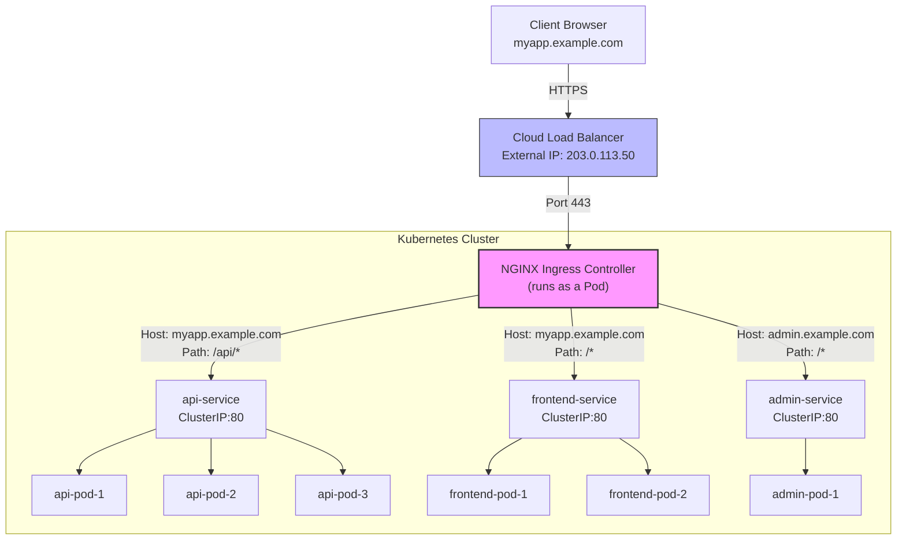
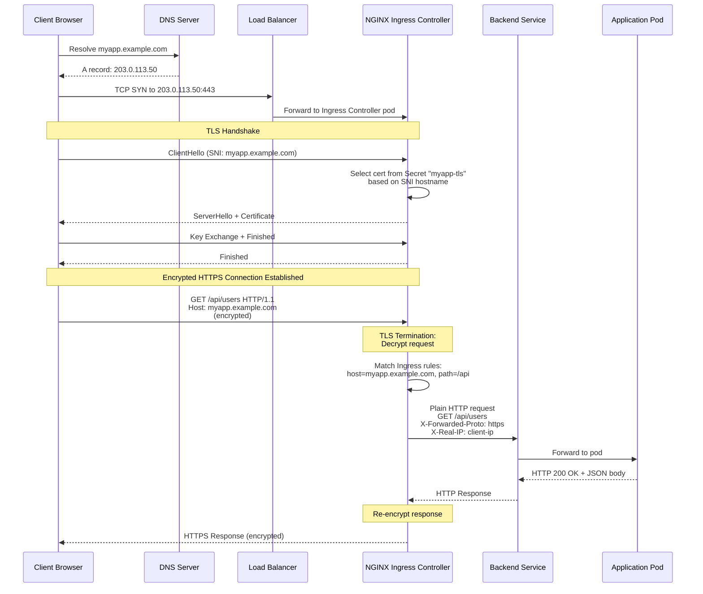

# File 20: Ingress and Ingress Controllers

**Topic:** Ingress resources, NGINX Ingress Controller, path-based and host-based routing, TLS termination, annotations, canary deployments, IngressClass

**WHY THIS MATTERS:**
Services expose your applications, but they operate at Layer 4 (TCP/UDP). When you need Layer 7 routing — path-based routing, host-based virtual hosting, TLS termination, URL rewriting, rate limiting — you need Ingress. Ingress is how you expose multiple HTTP services through a single external IP address, just like a reverse proxy. Without it, every service needs its own LoadBalancer (expensive) or NodePort (clunky).

---

## Story: The Airport Terminal

Think of a busy international airport like Indira Gandhi International Airport in Delhi.

**The Departure Board (Ingress Resource):** When you arrive at the airport, you look at the departure board. It tells you: "Air India to Mumbai — Gate 12. IndiGo to Bengaluru — Gate 7. Vistara to Chennai — Gate 15." The departure board is your **Ingress resource** — a set of routing rules that map incoming requests to the right backend service. It says: "requests for `/api` go to the API service, requests for `/web` go to the frontend service."

**The Terminal Building (Ingress Controller):** But the departure board is just information — it doesn't physically move you to the gate. The terminal building itself — with its corridors, escalators, security checkpoints, and gate infrastructure — is what actually routes passengers. The **Ingress Controller** (like NGINX, Traefik, or HAProxy) is this infrastructure. It reads the Ingress rules and configures the actual reverse proxy to route traffic.

**Security Check (TLS Termination):** Before you reach any gate, you pass through security screening. Your bags are X-rayed, you walk through metal detectors. After security, you're in the "secure zone." Similarly, **TLS termination** at the Ingress decrypts HTTPS traffic at the edge, so backend services receive plain HTTP — they don't need to handle certificates themselves.

**Domestic vs International Terminals (Host-Based Routing):** Large airports have separate terminals. Domestic flights go to Terminal 1, international to Terminal 3. You're routed based on your destination. This is **host-based routing** — `api.myapp.com` goes to the API service, `admin.myapp.com` goes to the admin service.

**Gate Assignment Changes (Canary/Blue-Green):** Sometimes gates change. "Air India to Mumbai has been moved from Gate 12 to Gate 14." Passengers are gradually redirected. This is how **canary deployments** work with Ingress — you route a percentage of traffic to a new version while most traffic still goes to the stable version.

**Airport Authority (IngressClass):** Different airlines might use different terminals managed by different operators. The airport authority assigns which operator handles which terminal. **IngressClass** tells Kubernetes which Ingress controller should handle a specific Ingress resource — because you might have multiple controllers running simultaneously.

---

## Example Block 1 — Ingress Resource Fundamentals

### Section 1 — Basic Path-Based Routing

**WHY:** Path-based routing lets you expose multiple services through a single domain. This is the most common Ingress pattern — your frontend and API share the same domain but different URL paths.

```yaml
# WHY: Path-based Ingress routing two backends through one domain
apiVersion: networking.k8s.io/v1
kind: Ingress
metadata:
  name: app-ingress
  namespace: production
  annotations:
    nginx.ingress.kubernetes.io/rewrite-target: /   # WHY: strips the path prefix before forwarding
spec:
  ingressClassName: nginx          # WHY: tells K8s which controller handles this Ingress
  rules:
    - host: myapp.example.com      # WHY: match requests with this Host header
      http:
        paths:
          - path: /api             # WHY: requests starting with /api go to the API service
            pathType: Prefix       # WHY: Prefix matches /api, /api/v1, /api/users, etc.
            backend:
              service:
                name: api-service  # WHY: the target ClusterIP service
                port:
                  number: 80       # WHY: the service port (not the container port)
          - path: /                # WHY: everything else goes to the frontend
            pathType: Prefix
            backend:
              service:
                name: frontend-service
                port:
                  number: 80
```



### Section 2 — Path Types

**WHY:** Kubernetes supports three path types, and choosing the wrong one can lead to unexpected routing behavior.

```yaml
# WHY: Demonstrating all three pathType options
apiVersion: networking.k8s.io/v1
kind: Ingress
metadata:
  name: path-types-demo
spec:
  ingressClassName: nginx
  rules:
    - host: demo.example.com
      http:
        paths:
          # Exact: only matches /api exactly, NOT /api/ or /api/v1
          - path: /api
            pathType: Exact
            backend:
              service:
                name: api-exact
                port:
                  number: 80

          # Prefix: matches /docs, /docs/, /docs/v1, /docs/v1/guide
          # WHY: most common — matches the path and all sub-paths
          - path: /docs
            pathType: Prefix
            backend:
              service:
                name: docs-service
                port:
                  number: 80

          # ImplementationSpecific: behavior depends on the Ingress controller
          # WHY: used when you need controller-specific path matching (e.g., regex)
          - path: /legacy
            pathType: ImplementationSpecific
            backend:
              service:
                name: legacy-service
                port:
                  number: 80
```

---

## Example Block 2 — Host-Based Routing

### Section 1 — Multiple Domains on One Ingress

**WHY:** Host-based routing is like virtual hosting in Apache/NGINX. Multiple domains share the same IP and Ingress controller, but route to completely different services based on the Host header.

```yaml
# WHY: Host-based routing — different domains, different backends
apiVersion: networking.k8s.io/v1
kind: Ingress
metadata:
  name: multi-host-ingress
  namespace: production
spec:
  ingressClassName: nginx
  rules:
    - host: api.mycompany.com       # WHY: API subdomain
      http:
        paths:
          - path: /
            pathType: Prefix
            backend:
              service:
                name: api-service
                port:
                  number: 80
    - host: app.mycompany.com       # WHY: main app subdomain
      http:
        paths:
          - path: /
            pathType: Prefix
            backend:
              service:
                name: webapp-service
                port:
                  number: 80
    - host: grafana.mycompany.com   # WHY: monitoring subdomain
      http:
        paths:
          - path: /
            pathType: Prefix
            backend:
              service:
                name: grafana-service
                port:
                  number: 3000
```

### Section 2 — Default Backend

**WHY:** When no rule matches (wrong host or path), the Ingress needs a fallback. The default backend handles unmatched traffic — usually a custom 404 page or a catch-all service.

```yaml
# WHY: Default backend catches all unmatched requests
apiVersion: networking.k8s.io/v1
kind: Ingress
metadata:
  name: with-default-backend
spec:
  ingressClassName: nginx
  defaultBackend:               # WHY: handles requests that don't match any rule
    service:
      name: default-404-service
      port:
        number: 80
  rules:
    - host: known.example.com
      http:
        paths:
          - path: /
            pathType: Prefix
            backend:
              service:
                name: known-service
                port:
                  number: 80
```

---

## Example Block 3 — TLS Termination

### Section 1 — Configuring HTTPS with TLS Secrets

**WHY:** TLS termination at the Ingress means your backend services don't need to handle HTTPS. The Ingress controller decrypts the traffic and forwards plain HTTP internally. This centralizes certificate management and simplifies backend deployments.

```bash
# WHY: Create a TLS secret from certificate files
# SYNTAX: kubectl create secret tls <name> --cert=<cert-file> --key=<key-file>
# FLAGS:
#   --cert    Path to the TLS certificate (PEM format)
#   --key     Path to the private key (PEM format)
# EXPECTED OUTPUT:
# secret/myapp-tls created

kubectl create secret tls myapp-tls \
  --cert=tls.crt \
  --key=tls.key \
  -n production
```

```yaml
# WHY: Ingress with TLS — HTTPS on the outside, HTTP on the inside
apiVersion: networking.k8s.io/v1
kind: Ingress
metadata:
  name: tls-ingress
  namespace: production
  annotations:
    nginx.ingress.kubernetes.io/ssl-redirect: "true"   # WHY: force HTTP -> HTTPS redirect
    nginx.ingress.kubernetes.io/force-ssl-redirect: "true"
spec:
  ingressClassName: nginx
  tls:                                    # WHY: TLS configuration section
    - hosts:
        - myapp.example.com              # WHY: which hosts this cert covers
        - api.example.com                # WHY: SAN — same cert for multiple domains
      secretName: myapp-tls              # WHY: reference to the TLS secret
  rules:
    - host: myapp.example.com
      http:
        paths:
          - path: /
            pathType: Prefix
            backend:
              service:
                name: frontend
                port:
                  number: 80
    - host: api.example.com
      http:
        paths:
          - path: /
            pathType: Prefix
            backend:
              service:
                name: api
                port:
                  number: 80
```



### Section 2 — cert-manager Integration

**WHY:** Managing TLS certificates manually is tedious and error-prone. cert-manager automates certificate issuance and renewal from providers like Let's Encrypt. You just add an annotation to your Ingress, and cert-manager handles the rest.

```yaml
# WHY: cert-manager automatically provisions and renews certificates
apiVersion: networking.k8s.io/v1
kind: Ingress
metadata:
  name: auto-tls-ingress
  namespace: production
  annotations:
    cert-manager.io/cluster-issuer: "letsencrypt-prod"  # WHY: tells cert-manager which issuer to use
    nginx.ingress.kubernetes.io/ssl-redirect: "true"
spec:
  ingressClassName: nginx
  tls:
    - hosts:
        - myapp.example.com
      secretName: myapp-auto-tls     # WHY: cert-manager creates/updates this secret automatically
  rules:
    - host: myapp.example.com
      http:
        paths:
          - path: /
            pathType: Prefix
            backend:
              service:
                name: frontend
                port:
                  number: 80
---
# WHY: ClusterIssuer configures cert-manager to use Let's Encrypt
apiVersion: cert-manager.io/v1
kind: ClusterIssuer
metadata:
  name: letsencrypt-prod
spec:
  acme:
    server: https://acme-v02.api.letsencrypt.org/directory
    email: admin@example.com           # WHY: Let's Encrypt sends expiry warnings here
    privateKeySecretRef:
      name: letsencrypt-prod-key       # WHY: stores the ACME account private key
    solvers:
      - http01:
          ingress:
            class: nginx               # WHY: use the nginx ingress for HTTP-01 challenges
```

---

## Example Block 4 — NGINX Ingress Annotations

### Section 1 — Common Annotations

**WHY:** Annotations are how you configure controller-specific behavior. The Ingress spec itself is deliberately simple — the real power comes from annotations that unlock features like rate limiting, CORS, authentication, URL rewriting, and more.

```yaml
# WHY: Common NGINX Ingress annotations for production use
apiVersion: networking.k8s.io/v1
kind: Ingress
metadata:
  name: production-ingress
  annotations:
    # Rate limiting
    nginx.ingress.kubernetes.io/limit-rps: "10"              # WHY: max 10 requests/second per IP
    nginx.ingress.kubernetes.io/limit-burst-multiplier: "5"  # WHY: allow burst of 50 (10*5)

    # Timeouts
    nginx.ingress.kubernetes.io/proxy-connect-timeout: "10"  # WHY: backend connect timeout (seconds)
    nginx.ingress.kubernetes.io/proxy-read-timeout: "60"     # WHY: backend read timeout
    nginx.ingress.kubernetes.io/proxy-send-timeout: "60"     # WHY: backend write timeout

    # Request size
    nginx.ingress.kubernetes.io/proxy-body-size: "50m"       # WHY: max upload size (default 1m)

    # CORS
    nginx.ingress.kubernetes.io/enable-cors: "true"          # WHY: enable Cross-Origin Resource Sharing
    nginx.ingress.kubernetes.io/cors-allow-origin: "https://myapp.com"
    nginx.ingress.kubernetes.io/cors-allow-methods: "GET, POST, PUT, DELETE"

    # URL rewriting
    nginx.ingress.kubernetes.io/rewrite-target: /$2          # WHY: capture group from path regex
    nginx.ingress.kubernetes.io/use-regex: "true"            # WHY: enable regex in paths

    # Custom headers
    nginx.ingress.kubernetes.io/configuration-snippet: |     # WHY: inject raw NGINX config
      more_set_headers "X-Frame-Options: DENY";
      more_set_headers "X-Content-Type-Options: nosniff";
spec:
  ingressClassName: nginx
  rules:
    - host: myapp.example.com
      http:
        paths:
          - path: /api(/|$)(.*)     # WHY: regex captures everything after /api
            pathType: ImplementationSpecific
            backend:
              service:
                name: api-service
                port:
                  number: 80
```

---

## Example Block 5 — Canary Deployments with Ingress

### Section 1 — Traffic Splitting by Weight

**WHY:** Canary deployments let you gradually shift traffic to a new version. You deploy the new version alongside the old one, route a small percentage (e.g., 10%) of traffic to it, monitor for errors, and increase the percentage over time.

```yaml
# WHY: Main Ingress — handles 90% of traffic (stable version)
apiVersion: networking.k8s.io/v1
kind: Ingress
metadata:
  name: app-stable
spec:
  ingressClassName: nginx
  rules:
    - host: myapp.example.com
      http:
        paths:
          - path: /
            pathType: Prefix
            backend:
              service:
                name: app-v1        # WHY: stable version
                port:
                  number: 80
---
# WHY: Canary Ingress — handles 10% of traffic (new version)
apiVersion: networking.k8s.io/v1
kind: Ingress
metadata:
  name: app-canary
  annotations:
    nginx.ingress.kubernetes.io/canary: "true"              # WHY: marks this as a canary
    nginx.ingress.kubernetes.io/canary-weight: "10"         # WHY: 10% of traffic goes here
spec:
  ingressClassName: nginx
  rules:
    - host: myapp.example.com       # WHY: MUST match the stable Ingress host
      http:
        paths:
          - path: /
            pathType: Prefix
            backend:
              service:
                name: app-v2        # WHY: new version being tested
                port:
                  number: 80
```

### Section 2 — Header-Based Canary

**WHY:** Sometimes you want only specific users (QA team, beta testers) to see the new version. Header-based canary routes traffic based on a custom header, so you can test without affecting regular users.

```yaml
# WHY: Route canary traffic based on a custom header
apiVersion: networking.k8s.io/v1
kind: Ingress
metadata:
  name: app-canary-header
  annotations:
    nginx.ingress.kubernetes.io/canary: "true"
    nginx.ingress.kubernetes.io/canary-by-header: "X-Canary"        # WHY: header name to check
    nginx.ingress.kubernetes.io/canary-by-header-value: "always"    # WHY: header value that triggers canary
spec:
  ingressClassName: nginx
  rules:
    - host: myapp.example.com
      http:
        paths:
          - path: /
            pathType: Prefix
            backend:
              service:
                name: app-v2
                port:
                  number: 80
```

```bash
# WHY: Test canary with header — should hit v2
# EXPECTED OUTPUT: response from app-v2
curl -H "X-Canary: always" https://myapp.example.com/

# WHY: Test without header — should hit v1
# EXPECTED OUTPUT: response from app-v1
curl https://myapp.example.com/
```

---

## Example Block 6 — IngressClass

### Section 1 — Multiple Ingress Controllers

**WHY:** Large clusters often run multiple Ingress controllers — NGINX for public traffic, Traefik for internal APIs, AWS ALB for specific workloads. IngressClass tells Kubernetes which controller should handle each Ingress resource.

```yaml
# WHY: IngressClass defines which controller handles Ingress resources that reference it
apiVersion: networking.k8s.io/v1
kind: IngressClass
metadata:
  name: nginx-external
  annotations:
    ingressclass.kubernetes.io/is-default-class: "true"  # WHY: Ingresses without ingressClassName use this
spec:
  controller: k8s.io/ingress-nginx                      # WHY: identifies the controller implementation
  parameters:                                             # WHY: optional — controller-specific config
    apiGroup: k8s.io
    kind: IngressParameters
    name: external-config
---
apiVersion: networking.k8s.io/v1
kind: IngressClass
metadata:
  name: traefik-internal
spec:
  controller: traefik.io/ingress-controller
```

```bash
# WHY: List all IngressClasses to see which controllers are available
# SYNTAX: kubectl get ingressclass
# EXPECTED OUTPUT:
# NAME              CONTROLLER                     PARAMETERS   AGE
# nginx-external    k8s.io/ingress-nginx           <none>       5m
# traefik-internal  traefik.io/ingress-controller   <none>       5m

kubectl get ingressclass
```

```bash
# WHY: Check which Ingress resources exist and their status
# SYNTAX: kubectl get ingress -A
# FLAGS:
#   -A    Show ingresses across all namespaces
# EXPECTED OUTPUT:
# NAMESPACE    NAME           CLASS            HOSTS                ADDRESS         PORTS     AGE
# production   app-ingress    nginx-external   myapp.example.com    203.0.113.50   80, 443   10m

kubectl get ingress -A
```

```bash
# WHY: Describe an Ingress to see its full configuration and events
# SYNTAX: kubectl describe ingress <name> -n <namespace>
# EXPECTED OUTPUT includes:
# - Rules (host, path, backend)
# - TLS configuration
# - Annotations
# - Events (cert provisioning, config reload)

kubectl describe ingress app-ingress -n production
```

---

## Key Takeaways

1. **Ingress** is a Kubernetes resource that defines Layer 7 (HTTP/HTTPS) routing rules — it specifies how external HTTP traffic should be routed to internal Services based on hostnames and URL paths.

2. **Ingress Controllers** (NGINX, Traefik, HAProxy, AWS ALB) are the actual reverse proxies that read Ingress resources and configure themselves to route traffic accordingly — without a controller, Ingress resources do nothing.

3. **Path-based routing** lets you expose multiple services through one domain (`/api` to backend, `/` to frontend), while **host-based routing** lets you route different domains to different services through the same IP.

4. **pathType** matters: `Exact` matches only the precise path, `Prefix` matches the path and all sub-paths, and `ImplementationSpecific` delegates matching behavior to the controller (useful for regex patterns).

5. **TLS termination** at the Ingress centralizes certificate management — HTTPS is decrypted at the edge and forwarded as plain HTTP to backend services, with certificates stored in Kubernetes TLS Secrets.

6. **cert-manager** automates TLS certificate lifecycle — provision, renewal, and rotation — from providers like Let's Encrypt, triggered by a single annotation on the Ingress resource.

7. **Annotations** are how you configure controller-specific features (rate limiting, CORS, URL rewriting, custom headers, timeouts) since the Ingress spec intentionally stays generic across controllers.

8. **Canary deployments** with NGINX Ingress let you split traffic by weight (10% to new version) or by header (only users with a specific header see the new version), enabling safe, gradual rollouts.

9. **IngressClass** lets you run multiple Ingress controllers in the same cluster and specify which one handles each Ingress resource — essential in multi-team or multi-environment clusters.

10. **The Ingress resource is being gradually superseded by the Gateway API** (covered in File 21), which offers a more expressive, role-oriented approach to traffic routing — but Ingress remains widely used and supported.
