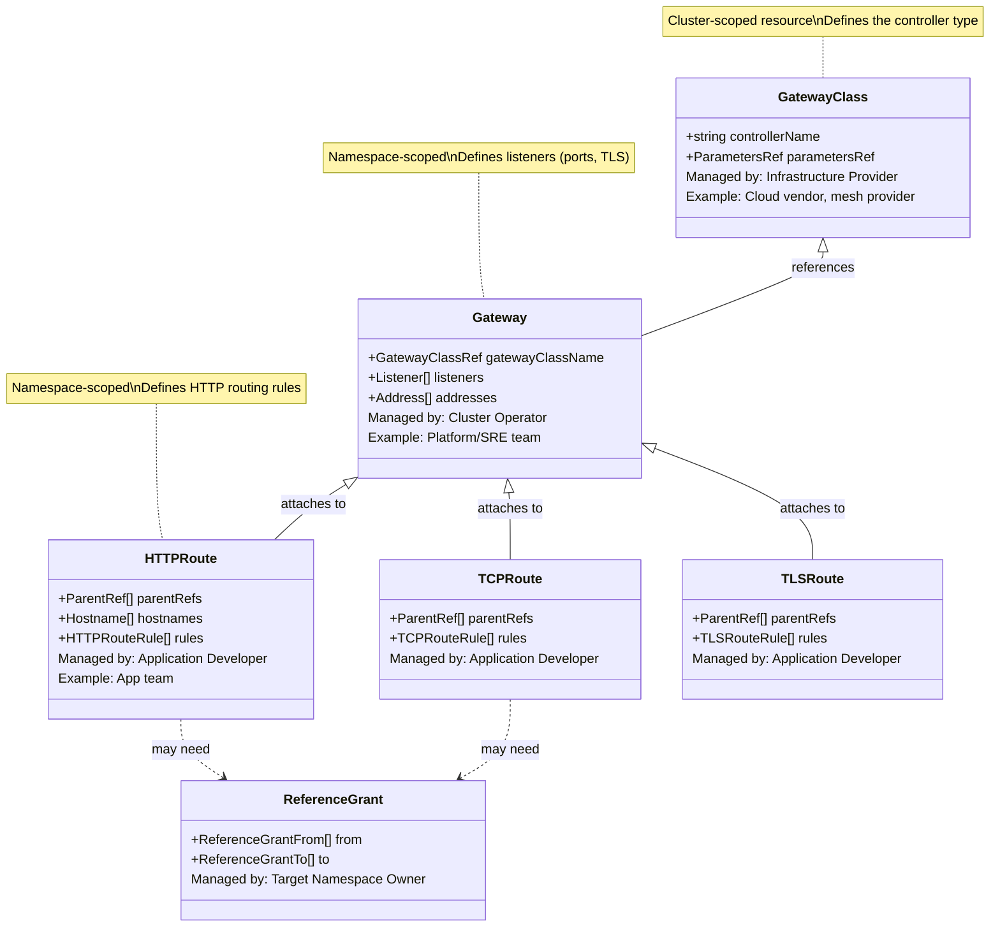
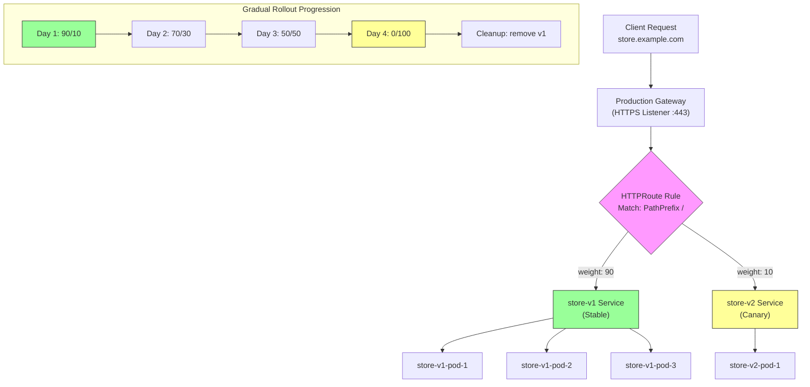

# File 21: Gateway API

**Topic:** Gateway API — GatewayClass, Gateway, HTTPRoute, traffic splitting, header matching, URL rewriting, ReferenceGrant, and comparison with Ingress

**WHY THIS MATTERS:**
The Ingress API served Kubernetes well for years, but it has fundamental limitations: no standard way to split traffic, no role-based ownership model, and heavy reliance on controller-specific annotations. The Gateway API is the next-generation replacement — designed from the ground up with role-oriented design, portable features, and expressiveness that Ingress annotations could never standardize. Understanding Gateway API is essential because it is becoming the default way to manage traffic in Kubernetes.

---

## Story: The Smart City Traffic Management System

Imagine a modern Indian smart city — let's call it the "Gujarat International Finance Tec-City" (GIFT City).

**The City Planner / Municipal Corporation (GatewayClass):** The city's urban planning authority decides the fundamental infrastructure standards. They choose the type of traffic signals, the road design specifications, the bridge engineering standards. They don't manage individual intersections — they define the CLASS of infrastructure available. The **GatewayClass** is this authority. It defines what kind of gateway infrastructure is available (NGINX, Istio, Cilium) and is typically managed by the infrastructure or platform team.

**The Traffic Engineer / PWD Department (Gateway):** The Public Works Department builds and manages the actual roads, flyovers, and traffic signals based on the city planner's standards. They control which roads exist, how many lanes each has, and which areas they connect. The **Gateway** is this engineer — it defines the actual listeners (ports, protocols, TLS), manages the infrastructure, and is typically owned by the cluster operations team.

**The App Teams / Shop Owners (HTTPRoute):** Individual shop owners in GIFT City don't build roads. They put up signboards that say "Turn left at the signal for our restaurant." They decide their own routing within the space the traffic engineer has provided. **HTTPRoute** is this signboard — application teams define their own routing rules (path matching, header matching, traffic splitting) without needing to touch the gateway infrastructure.

**Permission Slip / NOC (ReferenceGrant):** If a shop in Zone A wants to use a parking lot in Zone B, they need a No Objection Certificate (NOC) from Zone B's authority. **ReferenceGrant** is this NOC — it explicitly allows resources in one namespace to reference resources in another namespace, providing security boundaries.

This three-tier separation is the key innovation of Gateway API: infrastructure providers, platform operators, and application developers each manage their own layer without stepping on each other.

---

## Example Block 1 — Gateway API Architecture

### Section 1 — The Role-Oriented Design

**WHY:** The Gateway API separates concerns into three distinct roles, each with their own resources. This prevents the "annotation sprawl" problem of Ingress where everyone edits the same resource.



### Section 2 — Installing Gateway API CRDs

**WHY:** Gateway API CRDs are not installed by default in Kubernetes. You need to install them separately. The standard channel includes stable resources; the experimental channel adds newer features.

```bash
# WHY: Install Gateway API CRDs (standard channel — stable resources)
# SYNTAX: kubectl apply -f <url>
# EXPECTED OUTPUT:
# customresourcedefinition.apiextensions.k8s.io/gatewayclasses.gateway.networking.k8s.io created
# customresourcedefinition.apiextensions.k8s.io/gateways.gateway.networking.k8s.io created
# customresourcedefinition.apiextensions.k8s.io/httproutes.gateway.networking.k8s.io created
# customresourcedefinition.apiextensions.k8s.io/referencegrants.gateway.networking.k8s.io created

kubectl apply -f https://github.com/kubernetes-sigs/gateway-api/releases/download/v1.2.0/standard-install.yaml
```

```bash
# WHY: Install experimental channel if you need TCPRoute, TLSRoute, GRPCRoute
kubectl apply -f https://github.com/kubernetes-sigs/gateway-api/releases/download/v1.2.0/experimental-install.yaml
```

```bash
# WHY: Verify CRDs are installed
# EXPECTED OUTPUT:
# gatewayclasses.gateway.networking.k8s.io    2024-XX-XX
# gateways.gateway.networking.k8s.io          2024-XX-XX
# httproutes.gateway.networking.k8s.io        2024-XX-XX
# referencegrants.gateway.networking.k8s.io   2024-XX-XX

kubectl get crd | grep gateway
```

---

## Example Block 2 — GatewayClass and Gateway

### Section 1 — GatewayClass

**WHY:** GatewayClass is the cluster-scoped resource that identifies a Gateway controller (like NGINX Gateway Fabric, Istio, Cilium, or Envoy Gateway). It is typically set up once by the infrastructure team.

```yaml
# WHY: GatewayClass tells Kubernetes which controller implementation to use
apiVersion: gateway.networking.k8s.io/v1
kind: GatewayClass
metadata:
  name: nginx-gateway          # WHY: cluster-scoped — no namespace
spec:
  controllerName: gateway.nginx.org/nginx-gateway-controller  # WHY: identifies the controller
  description: "NGINX Gateway Fabric for production traffic"
  # parametersRef:             # WHY: optional — controller-specific configuration
  #   group: gateway.nginx.org
  #   kind: NginxProxy
  #   name: proxy-config
```

### Section 2 — Gateway Resource

**WHY:** The Gateway defines the network endpoints (listeners) where traffic enters the cluster. Think of it as provisioning a load balancer with specific ports and TLS settings. The cluster operator controls this, determining what ports are open and what protocols are accepted.

```yaml
# WHY: Gateway defines listeners — the entry points for traffic
apiVersion: gateway.networking.k8s.io/v1
kind: Gateway
metadata:
  name: production-gateway
  namespace: gateway-infra          # WHY: gateways live in their own namespace (platform team owns it)
spec:
  gatewayClassName: nginx-gateway   # WHY: references the GatewayClass
  listeners:
    - name: http                    # WHY: listener name (must be unique within the Gateway)
      protocol: HTTP
      port: 80
      allowedRoutes:
        namespaces:
          from: All                 # WHY: allow HTTPRoutes from any namespace to attach
        kinds:
          - kind: HTTPRoute         # WHY: only allow HTTPRoute (not TCPRoute, etc.)

    - name: https
      protocol: HTTPS
      port: 443
      tls:
        mode: Terminate             # WHY: TLS termination at the gateway (like Ingress TLS)
        certificateRefs:
          - name: wildcard-tls      # WHY: TLS secret for *.example.com
            namespace: gateway-infra
      allowedRoutes:
        namespaces:
          from: Selector            # WHY: only namespaces with matching labels can attach routes
          selector:
            matchLabels:
              gateway-access: "true"  # WHY: namespace must have this label to use this listener
        kinds:
          - kind: HTTPRoute

    - name: admin-https
      protocol: HTTPS
      port: 8443
      hostname: "admin.example.com"  # WHY: listener-level hostname filtering
      tls:
        mode: Terminate
        certificateRefs:
          - name: admin-tls
      allowedRoutes:
        namespaces:
          from: Same                # WHY: only routes in the same namespace as the Gateway
```

```bash
# WHY: Check gateway status — shows if listeners are programmed and addresses assigned
# SYNTAX: kubectl get gateway -n <namespace>
# EXPECTED OUTPUT:
# NAME                  CLASS           ADDRESS         PROGRAMMED   AGE
# production-gateway    nginx-gateway   203.0.113.50    True         5m

kubectl get gateway -n gateway-infra

# WHY: Detailed status shows per-listener conditions
kubectl describe gateway production-gateway -n gateway-infra
```

---

## Example Block 3 — HTTPRoute

### Section 1 — Basic HTTPRoute

**WHY:** HTTPRoute is where application teams define their routing rules. It attaches to a Gateway's listener and specifies how requests should be matched and forwarded to backend services.

```yaml
# WHY: HTTPRoute — application team defines their routing rules
apiVersion: gateway.networking.k8s.io/v1
kind: HTTPRoute
metadata:
  name: store-routes
  namespace: store-app              # WHY: lives in the app team's namespace
spec:
  parentRefs:
    - name: production-gateway      # WHY: which Gateway to attach to
      namespace: gateway-infra      # WHY: Gateway is in a different namespace
      sectionName: https            # WHY: attach to the "https" listener specifically
  hostnames:
    - "store.example.com"           # WHY: only match requests with this hostname
  rules:
    - matches:
        - path:
            type: PathPrefix
            value: /api              # WHY: API requests go to the API backend
      backendRefs:
        - name: store-api
          port: 80
    - matches:
        - path:
            type: PathPrefix
            value: /                 # WHY: everything else goes to the frontend
      backendRefs:
        - name: store-frontend
          port: 80
```

### Section 2 — Advanced Matching

**WHY:** Gateway API supports rich matching beyond just paths — headers, query parameters, and methods. This is built into the spec, not hidden in annotations.

```yaml
# WHY: Advanced matching with headers, methods, and query parameters
apiVersion: gateway.networking.k8s.io/v1
kind: HTTPRoute
metadata:
  name: advanced-routes
  namespace: store-app
spec:
  parentRefs:
    - name: production-gateway
      namespace: gateway-infra
  hostnames:
    - "api.example.com"
  rules:
    # Rule 1: Match by header
    - matches:
        - headers:
            - name: X-API-Version        # WHY: route based on API version header
              value: "v2"
          path:
            type: PathPrefix
            value: /users
      backendRefs:
        - name: users-api-v2
          port: 80

    # Rule 2: Match by method
    - matches:
        - method: POST                   # WHY: separate POST requests to a write-optimized service
          path:
            type: PathPrefix
            value: /orders
      backendRefs:
        - name: orders-write-service
          port: 80

    # Rule 3: Match by query parameter
    - matches:
        - queryParams:
            - name: debug                # WHY: debug=true routes to a debug-enabled backend
              value: "true"
      backendRefs:
        - name: debug-service
          port: 80

    # Rule 4: Default catch-all
    - backendRefs:
        - name: default-api
          port: 80
```

---

## Example Block 4 — Traffic Splitting and Canary Deployments

### Section 1 — Weight-Based Traffic Splitting

**WHY:** Traffic splitting is a first-class feature in Gateway API — no annotations or hacks needed. You specify weights on backend references, and the gateway distributes traffic proportionally. This is how you do canary deployments, A/B testing, and gradual rollouts.

```yaml
# WHY: 90/10 traffic split between stable and canary versions
apiVersion: gateway.networking.k8s.io/v1
kind: HTTPRoute
metadata:
  name: canary-route
  namespace: store-app
spec:
  parentRefs:
    - name: production-gateway
      namespace: gateway-infra
  hostnames:
    - "store.example.com"
  rules:
    - matches:
        - path:
            type: PathPrefix
            value: /
      backendRefs:
        - name: store-v1             # WHY: stable version gets 90% of traffic
          port: 80
          weight: 90
        - name: store-v2             # WHY: canary version gets 10% of traffic
          port: 80
          weight: 10
```



### Section 2 — Progressive Rollout Commands

**WHY:** During a canary rollout, you progressively update the weights. Here's the typical workflow.

```bash
# WHY: Check current traffic split
# SYNTAX: kubectl get httproute <name> -n <namespace> -o yaml
# Look at: spec.rules[0].backendRefs[*].weight

kubectl get httproute canary-route -n store-app -o yaml | grep -A5 backendRefs
```

```bash
# WHY: Update traffic split from 90/10 to 50/50
# SYNTAX: kubectl patch httproute <name> -n <namespace> --type=json -p '<json-patch>'
# EXPECTED OUTPUT:
# httproute.gateway.networking.k8s.io/canary-route patched

kubectl patch httproute canary-route -n store-app --type=json \
  -p='[
    {"op":"replace","path":"/spec/rules/0/backendRefs/0/weight","value":50},
    {"op":"replace","path":"/spec/rules/0/backendRefs/1/weight","value":50}
  ]'
```

```bash
# WHY: Complete the rollout — 100% to v2
kubectl patch httproute canary-route -n store-app --type=json \
  -p='[
    {"op":"replace","path":"/spec/rules/0/backendRefs/0/weight","value":0},
    {"op":"replace","path":"/spec/rules/0/backendRefs/1/weight","value":100}
  ]'
```

---

## Example Block 5 — URL Rewriting and Request/Response Modification

### Section 1 — URL Rewrite Filters

**WHY:** Gateway API includes built-in filters for modifying requests and responses — no annotations needed. You can rewrite URL paths, replace hostnames, add/remove headers, and redirect requests.

```yaml
# WHY: URL rewriting and header modification using Gateway API filters
apiVersion: gateway.networking.k8s.io/v1
kind: HTTPRoute
metadata:
  name: filter-routes
  namespace: store-app
spec:
  parentRefs:
    - name: production-gateway
      namespace: gateway-infra
  hostnames:
    - "store.example.com"
  rules:
    # Rule 1: URL path rewrite
    - matches:
        - path:
            type: PathPrefix
            value: /v1/products
      filters:
        - type: URLRewrite                    # WHY: rewrite the URL before forwarding
          urlRewrite:
            path:
              type: ReplacePrefixMatch
              replacePrefixMatch: /products   # WHY: /v1/products/123 becomes /products/123
      backendRefs:
        - name: products-api
          port: 80

    # Rule 2: Add request headers
    - matches:
        - path:
            type: PathPrefix
            value: /api
      filters:
        - type: RequestHeaderModifier         # WHY: add/set/remove headers on requests to backend
          requestHeaderModifier:
            add:
              - name: X-Request-Source
                value: gateway                # WHY: backend knows request came through the gateway
            set:
              - name: X-Forwarded-Proto
                value: https                  # WHY: tell backend the original protocol
            remove:
              - X-Debug-Header               # WHY: strip debug headers before reaching backend
        - type: ResponseHeaderModifier        # WHY: modify response headers going back to client
          responseHeaderModifier:
            add:
              - name: X-Content-Type-Options
                value: nosniff
              - name: Strict-Transport-Security
                value: "max-age=31536000"
      backendRefs:
        - name: api-service
          port: 80

    # Rule 3: HTTP redirect
    - matches:
        - path:
            type: Exact
            value: /old-page
      filters:
        - type: RequestRedirect               # WHY: 301/302 redirect without hitting a backend
          requestRedirect:
            scheme: https
            hostname: new.example.com
            path:
              type: ReplaceFullPath
              replaceFullPath: /new-page
            statusCode: 301                   # WHY: permanent redirect
```

---

## Example Block 6 — ReferenceGrant (Cross-Namespace Access)

### Section 1 — Allowing Cross-Namespace References

**WHY:** By default, Gateway API resources can only reference resources in their own namespace. If an HTTPRoute in namespace "store-app" wants to forward traffic to a service in namespace "shared-services", the owner of "shared-services" must create a ReferenceGrant explicitly allowing it. This prevents unauthorized cross-namespace access.

```yaml
# WHY: ReferenceGrant in "shared-services" namespace allows "store-app" HTTPRoutes to reference services here
apiVersion: gateway.networking.k8s.io/v1beta1
kind: ReferenceGrant
metadata:
  name: allow-store-app
  namespace: shared-services         # WHY: this lives in the TARGET namespace (the one being referenced)
spec:
  from:
    - group: gateway.networking.k8s.io
      kind: HTTPRoute
      namespace: store-app           # WHY: allow HTTPRoutes from "store-app" namespace
  to:
    - group: ""                      # WHY: core API group (Services)
      kind: Service                  # WHY: allow referencing Services
    - group: ""
      kind: Secret                   # WHY: allow referencing Secrets (e.g., for TLS)
```

```yaml
# WHY: Now the HTTPRoute in store-app can reference a service in shared-services
apiVersion: gateway.networking.k8s.io/v1
kind: HTTPRoute
metadata:
  name: shared-backend-route
  namespace: store-app
spec:
  parentRefs:
    - name: production-gateway
      namespace: gateway-infra
  rules:
    - matches:
        - path:
            type: PathPrefix
            value: /auth
      backendRefs:
        - name: auth-service
          namespace: shared-services    # WHY: cross-namespace reference — requires ReferenceGrant
          port: 80
```

---

## Example Block 7 — Gateway API vs Ingress Comparison

### Section 1 — Feature Comparison

**WHY:** Understanding the differences helps you decide when to migrate from Ingress to Gateway API, or when to use each.

| Feature | Ingress | Gateway API |
|---------|---------|-------------|
| **Traffic splitting** | Annotation-based (controller-specific) | Built-in (`weight` on backendRefs) |
| **Header matching** | Annotation-based (NGINX-specific) | Built-in (`matches.headers`) |
| **URL rewriting** | Annotation-based | Built-in (`filters.URLRewrite`) |
| **Role separation** | Single resource, all config in one place | GatewayClass / Gateway / HTTPRoute split |
| **Cross-namespace** | Not standardized | ReferenceGrant (explicit, secure) |
| **TLS configuration** | In Ingress spec | In Gateway listener |
| **Multi-protocol** | HTTP/HTTPS only | HTTP, HTTPS, TCP, TLS, gRPC, UDP |
| **Portability** | Annotations are controller-specific | Core features are portable across controllers |
| **Maturity** | Stable, widely used since K8s 1.1 | GA since K8s 1.29, rapidly growing |
| **Canary deployments** | Requires controller-specific annotations | Native weight-based splitting |

### Section 2 — Migration Path

**WHY:** You don't have to migrate all at once. Ingress and Gateway API can coexist in the same cluster. Start with new services on Gateway API and migrate existing ones gradually.

```bash
# WHY: Check if your cluster supports Gateway API
kubectl api-resources | grep gateway

# WHY: List all existing Ingress resources (candidates for migration)
# EXPECTED OUTPUT: all Ingress resources across namespaces
kubectl get ingress -A

# WHY: List all Gateway API resources
kubectl get gatewayclass,gateway,httproute -A
```

---

## Key Takeaways

1. **Gateway API is the successor to Ingress** — it provides a more expressive, portable, and role-oriented approach to managing traffic routing in Kubernetes, with core features standardized instead of hidden in annotations.

2. **Three-tier role separation** is the key design principle: infrastructure providers manage GatewayClass, platform operators manage Gateway, and application developers manage HTTPRoute — each team owns their layer without conflicts.

3. **GatewayClass** is cluster-scoped and identifies the controller implementation (NGINX Gateway Fabric, Istio, Cilium), similar to how IngressClass identifies an Ingress controller.

4. **Gateway** defines network listeners (ports, protocols, TLS) and controls which namespaces and route types can attach — it is the platform team's control point for infrastructure.

5. **HTTPRoute** is where application teams define routing rules using rich matching (path, header, query param, method) and built-in features (traffic splitting, URL rewriting, header modification, redirects).

6. **Traffic splitting is a first-class feature** — specify `weight` on multiple `backendRefs` for canary deployments, A/B testing, and progressive rollouts without any annotations or hacks.

7. **Filters** (URLRewrite, RequestHeaderModifier, ResponseHeaderModifier, RequestRedirect) replace what were previously controller-specific annotations, making these features portable across implementations.

8. **ReferenceGrant** provides explicit, secure cross-namespace access — an HTTPRoute in namespace A can only reference a Service in namespace B if namespace B has a ReferenceGrant allowing it.

9. **Gateway API and Ingress can coexist** — you can run both in the same cluster, migrate gradually, and many controllers (NGINX, Traefik) support both APIs simultaneously.

10. **The Gateway API ecosystem is growing rapidly** — with support from NGINX, Istio, Cilium, Envoy Gateway, Traefik, and more, it is becoming the standard for traffic management in Kubernetes.
