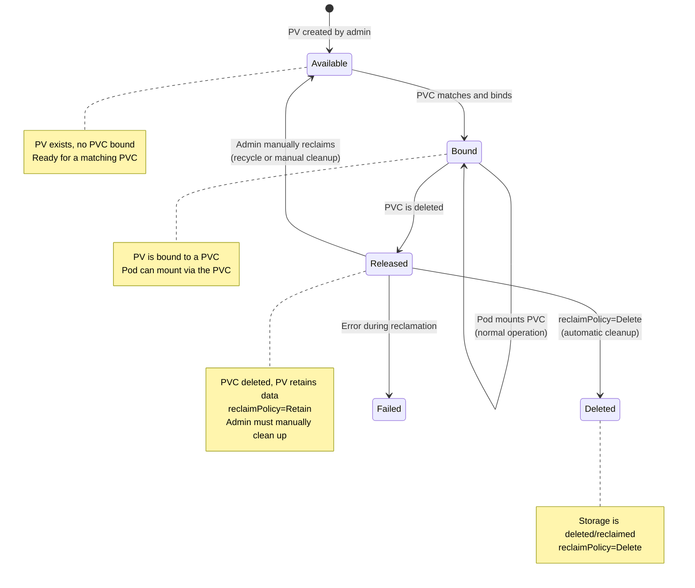
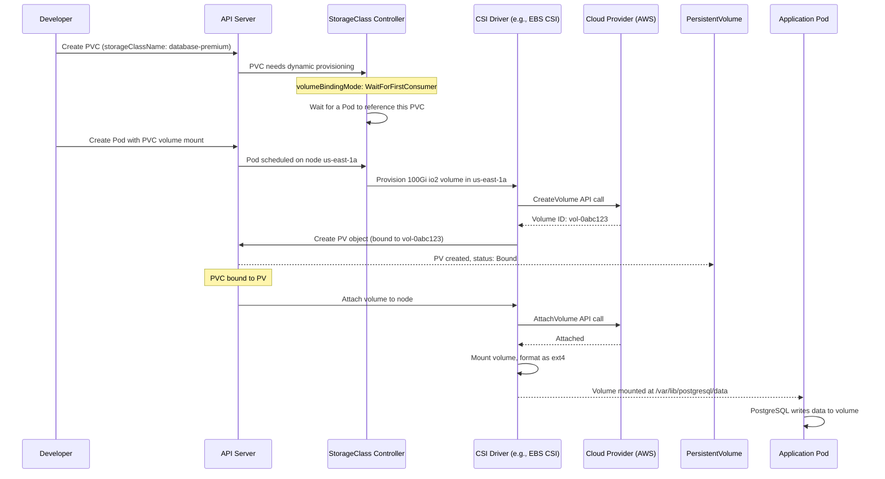

# File 23: Persistent Volumes and Storage Classes

**Topic:** PersistentVolume (PV), PersistentVolumeClaim (PVC), StorageClass, access modes, reclaim policies, volume expansion, snapshots, and dynamic provisioning

**WHY THIS MATTERS:**
Containers are ephemeral — when a pod dies, its filesystem dies with it. But real applications need persistent data: databases need to survive restarts, file uploads need to persist, logs need to be retained. Persistent Volumes decouple storage from pods, letting data outlive containers. Understanding the PV/PVC/StorageClass lifecycle is essential for running any stateful workload in Kubernetes.

---

## Story: The Warehouse Rental System

Think of the industrial warehousing system in India — the kind you find in logistics hubs like Bhiwandi near Mumbai or Luhari near Delhi.

**The Warehouse (PersistentVolume — PV):** A warehouse is a physical storage space with specific characteristics — 5000 sq ft, temperature-controlled, ground floor with loading dock access. It exists whether or not anyone is renting it. A **PersistentVolume** is this warehouse — a piece of storage provisioned in the cluster (or in the cloud) with specific capacity, access modes, and characteristics. It exists independently of any pod.

**The Rental Agreement (PersistentVolumeClaim — PVC):** When a business needs storage, they don't build a warehouse — they sign a rental agreement. They specify their requirements: "I need at least 2000 sq ft, ground floor, available 24/7." The warehouse management company matches them with a suitable warehouse. A **PersistentVolumeClaim** is this rental agreement — a request for storage that specifies capacity and access mode. Kubernetes matches it to an available PV.

**The Warehouse Catalog (StorageClass):** Large logistics companies like IndoSpace or Allcargo maintain catalogs of warehouse types: "Standard warehouse — Rs 20/sq ft/month. Cold storage — Rs 50/sq ft/month. Premium with security — Rs 40/sq ft/month." When a client needs storage, they pick a category from the catalog, and the company builds or allocates a warehouse matching those specs. **StorageClass** is this catalog — it defines different tiers/types of storage and enables dynamic provisioning: when a PVC requests storage of a certain class, Kubernetes automatically provisions a new PV.

**The Lease Terms (Reclaim Policy):** What happens when a business vacates a warehouse? The rental agreement specifies: "Retain" — keep the warehouse as-is with all items left behind (useful for data preservation). "Delete" — clear out the warehouse and demolish it (reclaim the cloud disk). "Recycle" — clear out the warehouse and make it available for the next tenant (deprecated). The **reclaimPolicy** on a PV or StorageClass determines what happens to the storage when the PVC is deleted.

**The Building Inspector (Volume Binding Mode):** Some rental agreements are signed immediately ("Immediate" binding) — the warehouse is assigned as soon as you sign. Others wait until you're ready to move in ("WaitForFirstConsumer") — ensuring the warehouse is in the same district where your trucks operate. **volumeBindingMode** controls when PV binding happens — immediate, or delayed until a pod actually needs it (ensuring the PV is in the same zone as the pod).

---

## Example Block 1 — PersistentVolume and PersistentVolumeClaim Basics

### Section 1 — Static Provisioning

**WHY:** Static provisioning is the manual approach — the cluster admin creates PVs ahead of time, and PVCs bind to them. This is common for on-premises storage or when you need precise control over which storage a workload uses.

```yaml
# WHY: Manually create a PersistentVolume (admin creates this)
apiVersion: v1
kind: PersistentVolume
metadata:
  name: manual-pv-01                 # WHY: PVs are cluster-scoped (no namespace)
  labels:
    type: local                      # WHY: labels help PVCs select specific PVs
    environment: production
spec:
  capacity:
    storage: 10Gi                    # WHY: total capacity of this volume
  accessModes:
    - ReadWriteOnce                  # WHY: can be mounted read-write by ONE node at a time
  persistentVolumeReclaimPolicy: Retain  # WHY: keep the data when PVC is deleted
  storageClassName: manual           # WHY: must match the PVC's storageClassName
  hostPath:
    path: /mnt/data/pv-01           # WHY: physical path on the node (for testing only — not for production)
    type: DirectoryOrCreate          # WHY: create the directory if it doesn't exist
```

```yaml
# WHY: PersistentVolumeClaim — a request for storage (developer creates this)
apiVersion: v1
kind: PersistentVolumeClaim
metadata:
  name: app-data-claim
  namespace: production
spec:
  accessModes:
    - ReadWriteOnce                  # WHY: must match (or be subset of) the PV's access modes
  resources:
    requests:
      storage: 5Gi                   # WHY: requesting 5Gi — K8s will find a PV with >= 5Gi capacity
  storageClassName: manual           # WHY: must match a PV's storageClassName
  selector:                          # WHY: optional — narrow down which PVs to consider
    matchLabels:
      environment: production
```



### Section 2 — Binding a PVC to a PV

**WHY:** When a PVC is created, the Kubernetes control plane searches for a PV that satisfies its requirements (capacity, access mode, storage class, selector). If found, the PVC is bound to that PV.

```bash
# WHY: Check PV status — should show "Available" initially
# SYNTAX: kubectl get pv
# EXPECTED OUTPUT:
# NAME           CAPACITY   ACCESS MODES   RECLAIM POLICY   STATUS      CLAIM   STORAGECLASS   AGE
# manual-pv-01   10Gi       RWO            Retain           Available           manual         10s

kubectl get pv
```

```bash
# WHY: After creating the PVC, PV status changes to "Bound"
# SYNTAX: kubectl get pv,pvc -n production
# EXPECTED OUTPUT:
# NAME                            CAPACITY   ACCESS MODES   STATUS   CLAIM                       STORAGECLASS
# persistentvolume/manual-pv-01   10Gi       RWO            Bound    production/app-data-claim   manual
#
# NAME                                  STATUS   VOLUME         CAPACITY   ACCESS MODES   STORAGECLASS
# persistentvolumeclaim/app-data-claim  Bound    manual-pv-01   10Gi       RWO            manual

kubectl get pv,pvc -n production
```

```bash
# WHY: Detailed PVC info shows which PV it bound to and volume details
# SYNTAX: kubectl describe pvc <name> -n <namespace>
# EXPECTED OUTPUT includes:
# Name:          app-data-claim
# Status:        Bound
# Volume:        manual-pv-01
# Capacity:      10Gi
# Access Modes:  RWO

kubectl describe pvc app-data-claim -n production
```

---

## Example Block 2 — Access Modes and Reclaim Policies

### Section 1 — Access Modes Explained

**WHY:** Access modes determine how many nodes can mount the volume simultaneously and in what mode. Choosing the wrong access mode is a common source of pod scheduling failures.

| Access Mode | Abbreviation | Description | Use Case |
|-------------|-------------|-------------|----------|
| ReadWriteOnce | RWO | Read-write by a single node | Single-instance databases (PostgreSQL, MySQL) |
| ReadOnlyMany | ROX | Read-only by many nodes | Shared config files, static assets |
| ReadWriteMany | RWX | Read-write by many nodes | Shared file storage (NFS, CephFS), CMS uploads |
| ReadWriteOncePod | RWOP | Read-write by a single pod (K8s 1.27+) | Strict single-writer guarantee |

```yaml
# WHY: Example PV supporting multiple access modes
apiVersion: v1
kind: PersistentVolume
metadata:
  name: nfs-shared-pv
spec:
  capacity:
    storage: 100Gi
  accessModes:
    - ReadWriteMany              # WHY: NFS supports RWX — multiple nodes can write simultaneously
    - ReadWriteOnce              # WHY: also supports RWO
    - ReadOnlyMany               # WHY: and ROX
  persistentVolumeReclaimPolicy: Retain
  storageClassName: nfs
  nfs:
    server: 10.0.0.50           # WHY: NFS server IP
    path: /exports/shared       # WHY: NFS export path
```

### Section 2 — Reclaim Policies

**WHY:** The reclaim policy determines what happens to the PV (and its underlying storage) when the PVC is deleted. Getting this wrong can either lose data or leak cloud resources.

```yaml
# WHY: Three reclaim policies demonstrated
---
# Retain: PV becomes "Released" but data is preserved. Admin must manually clean up.
# Best for: production databases where data loss is unacceptable
apiVersion: v1
kind: PersistentVolume
metadata:
  name: retain-pv
spec:
  capacity:
    storage: 50Gi
  accessModes: [ReadWriteOnce]
  persistentVolumeReclaimPolicy: Retain    # WHY: NEVER delete my data automatically
  storageClassName: retain-class
  hostPath:
    path: /mnt/data/retain

---
# Delete: PV and underlying storage are deleted when PVC is deleted.
# Best for: temporary workloads, CI/CD, dev environments
apiVersion: v1
kind: PersistentVolume
metadata:
  name: delete-pv
spec:
  capacity:
    storage: 20Gi
  accessModes: [ReadWriteOnce]
  persistentVolumeReclaimPolicy: Delete    # WHY: clean up automatically — no data to preserve
  storageClassName: delete-class
  hostPath:
    path: /mnt/data/delete
```

```bash
# WHY: Change reclaim policy on an existing PV
# SYNTAX: kubectl patch pv <pv-name> -p '{"spec":{"persistentVolumeReclaimPolicy":"Retain"}}'
# Use case: you created a PV with Delete policy but now want to keep the data
# EXPECTED OUTPUT:
# persistentvolume/delete-pv patched

kubectl patch pv delete-pv -p '{"spec":{"persistentVolumeReclaimPolicy":"Retain"}}'
```

---

## Example Block 3 — StorageClass and Dynamic Provisioning

### Section 1 — StorageClass Resource

**WHY:** StorageClass enables dynamic provisioning — when a PVC requests storage of a certain class, Kubernetes automatically creates a new PV backed by the specified provisioner. No manual PV creation needed. This is how storage works in most production clusters.

```yaml
# WHY: StorageClass for standard SSD storage (AWS EBS example)
apiVersion: storage.k8s.io/v1
kind: StorageClass
metadata:
  name: fast-ssd
  annotations:
    storageclass.kubernetes.io/is-default-class: "false"  # WHY: not the default class
provisioner: ebs.csi.aws.com       # WHY: which CSI driver creates the volumes
parameters:
  type: gp3                         # WHY: AWS EBS gp3 volume type (SSD)
  iops: "3000"                      # WHY: baseline IOPS for gp3
  throughput: "125"                  # WHY: baseline throughput (MiB/s)
  encrypted: "true"                 # WHY: encrypt data at rest
  fsType: ext4                      # WHY: filesystem type
reclaimPolicy: Delete               # WHY: delete EBS volume when PVC is deleted
volumeBindingMode: WaitForFirstConsumer  # WHY: don't provision until a pod needs it
allowVolumeExpansion: true          # WHY: allow PVC size to be increased later
mountOptions:
  - discard                         # WHY: enable TRIM/UNMAP for SSD optimization
```

```yaml
# WHY: StorageClass for high-IOPS database storage
apiVersion: storage.k8s.io/v1
kind: StorageClass
metadata:
  name: database-premium
provisioner: ebs.csi.aws.com
parameters:
  type: io2                          # WHY: provisioned IOPS SSD — highest performance
  iops: "10000"                      # WHY: 10K IOPS for database workloads
  encrypted: "true"
reclaimPolicy: Retain                # WHY: NEVER auto-delete database volumes
volumeBindingMode: WaitForFirstConsumer
allowVolumeExpansion: true
```

### Section 2 — Dynamic Provisioning Flow

**WHY:** With dynamic provisioning, the developer just creates a PVC. Kubernetes talks to the cloud provider's CSI driver, which creates the actual disk, creates a PV object, and binds it to the PVC — all automatically.

```yaml
# WHY: PVC requesting dynamic provisioning — no PV pre-created
apiVersion: v1
kind: PersistentVolumeClaim
metadata:
  name: postgres-data
  namespace: database
spec:
  accessModes:
    - ReadWriteOnce
  storageClassName: database-premium  # WHY: references the StorageClass — triggers dynamic provisioning
  resources:
    requests:
      storage: 100Gi                  # WHY: request 100Gi — CSI driver creates a 100Gi disk
```



### Section 3 — volumeBindingMode

**WHY:** `Immediate` binding provisions storage as soon as the PVC is created, which can be in the wrong availability zone. `WaitForFirstConsumer` delays provisioning until a pod needs the volume, ensuring the storage is created in the same zone as the pod.

```bash
# WHY: List all StorageClasses to see their provisioners and binding modes
# SYNTAX: kubectl get storageclass
# FLAGS: (none needed)
# EXPECTED OUTPUT:
# NAME                  PROVISIONER             RECLAIMPOLICY   VOLUMEBINDINGMODE      ALLOWVOLUMEEXPANSION
# fast-ssd              ebs.csi.aws.com         Delete          WaitForFirstConsumer   true
# database-premium      ebs.csi.aws.com         Retain          WaitForFirstConsumer   true
# standard (default)    rancher.io/local-path   Delete          WaitForFirstConsumer   false

kubectl get storageclass
```

```bash
# WHY: See detailed StorageClass information
# SYNTAX: kubectl describe storageclass <name>
# EXPECTED OUTPUT includes provisioner, parameters, reclaim policy, binding mode

kubectl describe storageclass fast-ssd
```

---

## Example Block 4 — Mounting Volumes in Pods

### Section 1 — Using PVC in a Pod

**WHY:** The PVC is referenced in the pod spec's volumes section and mounted into a container. This is how your application accesses persistent storage.

```yaml
# WHY: Pod with a PVC-backed volume mount
apiVersion: apps/v1
kind: Deployment
metadata:
  name: postgres
  namespace: database
spec:
  replicas: 1                          # WHY: RWO volume — only one pod can mount it
  selector:
    matchLabels:
      app: postgres
  template:
    metadata:
      labels:
        app: postgres
    spec:
      containers:
        - name: postgres
          image: postgres:16
          env:
            - name: POSTGRES_PASSWORD
              valueFrom:
                secretKeyRef:
                  name: postgres-secret
                  key: password
            - name: PGDATA                  # WHY: tell PostgreSQL where to store data
              value: /var/lib/postgresql/data/pgdata
          ports:
            - containerPort: 5432
          volumeMounts:
            - name: postgres-storage        # WHY: references the volume name below
              mountPath: /var/lib/postgresql/data  # WHY: where the volume appears in the container
              subPath: pgdata               # WHY: use a subdirectory (avoids lost+found conflicts)
          resources:
            requests:
              memory: "256Mi"
              cpu: "250m"
            limits:
              memory: "512Mi"
              cpu: "500m"
      volumes:
        - name: postgres-storage            # WHY: this name connects volumeMount to the volume
          persistentVolumeClaim:
            claimName: postgres-data        # WHY: reference the PVC by name
```

### Section 2 — Multiple Volumes in One Pod

**WHY:** A pod can mount multiple PVCs — for example, one for data and one for logs. Each gets its own mount path.

```yaml
# WHY: Pod with multiple PVC mounts
apiVersion: v1
kind: Pod
metadata:
  name: multi-volume-pod
spec:
  containers:
    - name: app
      image: my-app:v1
      volumeMounts:
        - name: data-volume
          mountPath: /app/data             # WHY: application data
        - name: logs-volume
          mountPath: /app/logs             # WHY: separate volume for logs
        - name: cache-volume
          mountPath: /app/cache            # WHY: ephemeral — lost on pod restart
  volumes:
    - name: data-volume
      persistentVolumeClaim:
        claimName: app-data-pvc            # WHY: persistent storage
    - name: logs-volume
      persistentVolumeClaim:
        claimName: app-logs-pvc            # WHY: separate PVC for log retention
    - name: cache-volume
      emptyDir:
        sizeLimit: 1Gi                     # WHY: emptyDir for scratch space — ephemeral
```

---

## Example Block 5 — Volume Expansion

### Section 1 — Expanding a PVC

**WHY:** Applications grow. Your 10Gi database will eventually need 50Gi. Volume expansion lets you increase PVC size without downtime (for supported storage providers). The StorageClass must have `allowVolumeExpansion: true`.

```bash
# WHY: Check if the StorageClass allows expansion
# EXPECTED OUTPUT: ALLOWVOLUMEEXPANSION column shows "true"

kubectl get storageclass fast-ssd
```

```bash
# WHY: Expand PVC from current size to 200Gi
# SYNTAX: kubectl patch pvc <name> -n <namespace> -p '{"spec":{"resources":{"requests":{"storage":"<new-size>"}}}}'
# EXPECTED OUTPUT:
# persistentvolumeclaim/postgres-data patched

kubectl patch pvc postgres-data -n database \
  -p '{"spec":{"resources":{"requests":{"storage":"200Gi"}}}}'
```

```bash
# WHY: Check expansion status — the PVC shows a condition indicating resize progress
# SYNTAX: kubectl describe pvc <name> -n <namespace>
# EXPECTED OUTPUT includes:
# Conditions:
#   Type                      Status  Reason
#   FileSystemResizePending   True    Waiting for user to (re-)start a pod to finish file system resize

kubectl describe pvc postgres-data -n database
```

```bash
# WHY: After pod restart (if needed), verify the new size
# EXPECTED OUTPUT: Capacity shows 200Gi

kubectl get pvc postgres-data -n database
```

---

## Example Block 6 — Volume Snapshots and Cloning

### Section 1 — Volume Snapshots

**WHY:** Volume snapshots let you take a point-in-time copy of a PVC's data. This is essential for backups, disaster recovery, and creating test environments from production data.

```yaml
# WHY: VolumeSnapshotClass defines which CSI driver handles snapshots
apiVersion: snapshot.storage.k8s.io/v1
kind: VolumeSnapshotClass
metadata:
  name: ebs-snapshot-class
driver: ebs.csi.aws.com             # WHY: same CSI driver as the StorageClass
deletionPolicy: Retain               # WHY: keep the snapshot even if the VolumeSnapshot object is deleted
parameters:
  tagSpecification_1: "Department=engineering"  # WHY: cloud-specific tags
```

```yaml
# WHY: Create a snapshot of the postgres-data PVC
apiVersion: snapshot.storage.k8s.io/v1
kind: VolumeSnapshot
metadata:
  name: postgres-snapshot-20240115
  namespace: database
spec:
  volumeSnapshotClassName: ebs-snapshot-class
  source:
    persistentVolumeClaimName: postgres-data  # WHY: the PVC to snapshot
```

```bash
# WHY: Check snapshot status
# SYNTAX: kubectl get volumesnapshot -n <namespace>
# EXPECTED OUTPUT:
# NAME                          READYTOUSE   SOURCEPVC       SNAPSHOTCONTENT                             AGE
# postgres-snapshot-20240115    true         postgres-data   snapcontent-xxxx-yyyy-zzzz                  30s

kubectl get volumesnapshot -n database
```

### Section 2 — Restoring from a Snapshot

**WHY:** Create a new PVC from a snapshot to restore data or create a copy for testing.

```yaml
# WHY: Create a new PVC from the snapshot (restore)
apiVersion: v1
kind: PersistentVolumeClaim
metadata:
  name: postgres-restored
  namespace: database
spec:
  accessModes:
    - ReadWriteOnce
  storageClassName: database-premium
  resources:
    requests:
      storage: 100Gi                  # WHY: must be >= snapshot source size
  dataSource:
    name: postgres-snapshot-20240115  # WHY: reference the VolumeSnapshot
    kind: VolumeSnapshot
    apiGroup: snapshot.storage.k8s.io
```

### Section 3 — Volume Cloning

**WHY:** Volume cloning creates a copy of an existing PVC without needing a snapshot first. It's faster for CSI drivers that support it (copy-on-write).

```yaml
# WHY: Clone an existing PVC directly
apiVersion: v1
kind: PersistentVolumeClaim
metadata:
  name: postgres-clone
  namespace: database
spec:
  accessModes:
    - ReadWriteOnce
  storageClassName: database-premium
  resources:
    requests:
      storage: 100Gi
  dataSource:
    name: postgres-data              # WHY: source PVC to clone
    kind: PersistentVolumeClaim      # WHY: direct PVC clone (not a snapshot)
```

---

## Example Block 7 — StatefulSet Volume Claim Templates

### Section 1 — volumeClaimTemplates

**WHY:** StatefulSets need each pod to have its own unique PVC. Volume claim templates automatically create a PVC for each replica, with a predictable naming pattern: `<template-name>-<statefulset-name>-<ordinal>`.

```yaml
# WHY: StatefulSet with automatic PVC creation per replica
apiVersion: apps/v1
kind: StatefulSet
metadata:
  name: mongodb
  namespace: database
spec:
  serviceName: mongodb-headless
  replicas: 3
  selector:
    matchLabels:
      app: mongodb
  template:
    metadata:
      labels:
        app: mongodb
    spec:
      containers:
        - name: mongo
          image: mongo:7
          ports:
            - containerPort: 27017
          volumeMounts:
            - name: mongo-data           # WHY: must match volumeClaimTemplates name
              mountPath: /data/db
  volumeClaimTemplates:                   # WHY: auto-creates PVCs for each replica
    - metadata:
        name: mongo-data                  # WHY: PVCs will be named: mongo-data-mongodb-0, mongo-data-mongodb-1, mongo-data-mongodb-2
      spec:
        accessModes: [ReadWriteOnce]
        storageClassName: fast-ssd
        resources:
          requests:
            storage: 50Gi
```

```bash
# WHY: See the auto-created PVCs after the StatefulSet deploys
# EXPECTED OUTPUT:
# NAME                     STATUS   VOLUME                                     CAPACITY   STORAGECLASS
# mongo-data-mongodb-0     Bound    pvc-aaaa-bbbb-cccc                        50Gi       fast-ssd
# mongo-data-mongodb-1     Bound    pvc-dddd-eeee-ffff                        50Gi       fast-ssd
# mongo-data-mongodb-2     Bound    pvc-gggg-hhhh-iiii                        50Gi       fast-ssd

kubectl get pvc -n database -l app=mongodb
```

```bash
# WHY: PVCs persist even when StatefulSet is scaled down or deleted
# This is by design — data is never accidentally lost
# EXPECTED OUTPUT: PVCs still exist after scaling down

kubectl scale statefulset mongodb -n database --replicas=1
kubectl get pvc -n database -l app=mongodb
# All 3 PVCs still exist!

# WHY: You must manually delete PVCs if you want to remove the data
# kubectl delete pvc mongo-data-mongodb-1 mongo-data-mongodb-2 -n database
```

---

## Key Takeaways

1. **PersistentVolume (PV)** is cluster-scoped storage that exists independently of pods — it can be pre-provisioned by an admin (static) or automatically created by a StorageClass (dynamic).

2. **PersistentVolumeClaim (PVC)** is a namespace-scoped request for storage — it specifies the size and access mode needed, and Kubernetes binds it to a matching PV.

3. **The PV lifecycle has four phases:** Available (unbound, ready for a PVC), Bound (claimed by a PVC), Released (PVC deleted, data may still exist), and Failed (automatic reclamation failed).

4. **Access modes** control concurrency: RWO (one node read-write), ROX (many nodes read-only), RWX (many nodes read-write), and RWOP (one pod read-write) — the wrong choice causes scheduling failures.

5. **Reclaim policies** determine data fate: Retain preserves data after PVC deletion (for production databases), Delete removes the underlying storage (for ephemeral workloads), and Recycle is deprecated.

6. **StorageClass** enables dynamic provisioning — developers create PVCs referencing a class name, and the CSI driver automatically provisions real storage (EBS, GCE-PD, Azure Disk, etc.).

7. **volumeBindingMode: WaitForFirstConsumer** is critical for multi-zone clusters — it delays PV provisioning until a pod is scheduled, ensuring storage is created in the same availability zone as the pod.

8. **Volume expansion** lets you increase PVC size without data loss — the StorageClass must have `allowVolumeExpansion: true`, and some providers require a pod restart to complete the filesystem resize.

9. **Volume snapshots** provide point-in-time copies for backup and recovery, while **volume cloning** creates direct PVC copies — both require CSI driver support.

10. **StatefulSet volumeClaimTemplates** automatically create unique PVCs per replica with predictable names, and critically, these PVCs persist even when the StatefulSet is scaled down or deleted to prevent accidental data loss.
