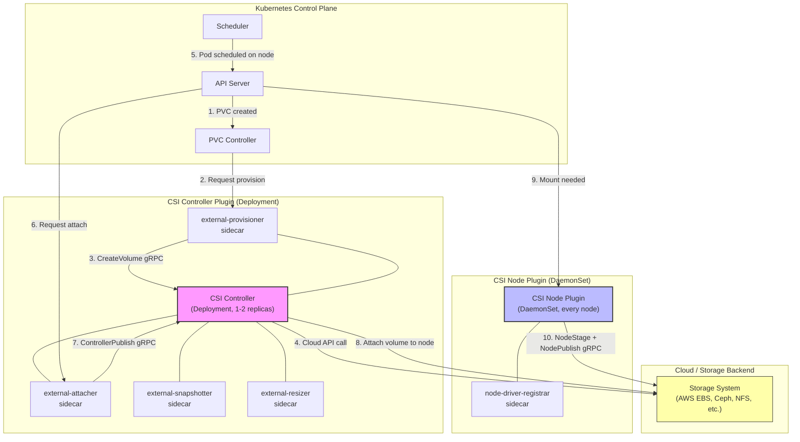
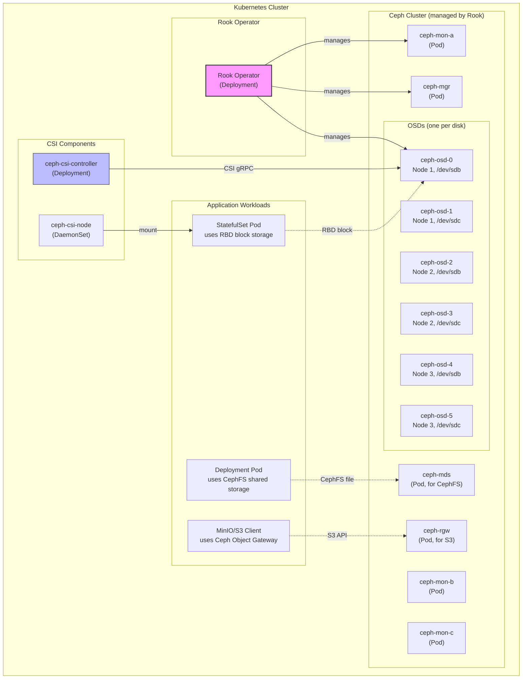

# File 24: CSI and Advanced Storage

**Topic:** Container Storage Interface (CSI) architecture, in-tree to CSI migration, CSI drivers, Rook-Ceph, ephemeral volumes, projected volumes, and storage topology

**WHY THIS MATTERS:**
Early Kubernetes had storage drivers built directly into the core codebase ("in-tree"). Adding a new storage backend meant modifying Kubernetes itself — a process that didn't scale. CSI (Container Storage Interface) decoupled storage from Kubernetes, letting any vendor build a driver without touching the Kubernetes source code. Understanding CSI is essential because every modern storage solution uses it: AWS EBS, Google PD, Azure Disk, Ceph, NetApp, Pure Storage — they all speak CSI. Beyond CSI, advanced volume types like ephemeral and projected volumes solve real operational challenges.

---

## Story: The Universal Power Adapter System

Think about India's electrical infrastructure evolution.

**The Old Fixed Wiring (In-Tree Drivers):** In the early days, if you wanted to connect an appliance to the electrical grid, the wiring had to be custom-built for that specific appliance. Each factory had its own electrical standard — Tata factories used one plug type, Birla factories used another. If you got a new appliance, you had to call an electrician to rewire the wall socket. This is how **in-tree storage drivers** worked — each storage vendor's code was hardcoded into Kubernetes. Adding support for a new storage provider meant modifying and recompiling Kubernetes itself.

**The Universal Socket Standard / BIS Standard (CSI):** Then India adopted the BIS standard for electrical sockets and plugs. Now any appliance manufacturer could build a plug that fits any socket. The appliance maker didn't need to know how the wiring in the wall worked — they just followed the standard interface. **CSI** is this universal standard — it defines a gRPC interface that any storage vendor can implement. Kubernetes talks to CSI, and CSI talks to the storage backend.

**The Adapter Manufacturer (CSI Driver):** Companies like Anchor, Havells, or Legrand manufacture the actual sockets and switches that connect the BIS standard plug to the building's internal wiring. Each manufacturer might use different internal mechanisms, but the plug always fits. **CSI drivers** are these manufacturers — AWS builds the EBS CSI driver, Google builds the GCE-PD CSI driver, and Rook builds the Ceph CSI driver. Each handles the specifics of their storage platform while presenting a standard interface to Kubernetes.

**Building Your Own Power Plant (Rook-Ceph):** Some large campuses — like IIT campuses or industrial estates — build their own power generation facility. They don't depend on the state electricity board. They generate, distribute, and manage their own power. **Rook-Ceph** is like building your own power plant on Kubernetes — it deploys a full distributed storage system (Ceph) as Kubernetes-native workloads, giving you self-managed block, file, and object storage right inside your cluster.

**The Temporary Extension Cord (Ephemeral Volumes):** When you host a wedding at a farmhouse, you run temporary extension cords for the lighting and sound system. These exist only for the duration of the event and are rolled up afterward. **Ephemeral volumes** (CSI ephemeral, generic ephemeral) are these temporary cords — they're created when a pod starts and destroyed when it stops. No PVC needed.

**The Multi-Outlet Power Strip (Projected Volumes):** A power strip combines multiple outlets into a single physical strip. You plug in your laptop charger, phone charger, and table lamp all into one strip. **Projected volumes** combine multiple volume sources (Secret, ConfigMap, downwardAPI, serviceAccountToken) into a single mount point inside the container.

---

## Example Block 1 — CSI Architecture

### Section 1 — CSI Components

**WHY:** CSI works through two main components: the Controller Plugin (runs centrally, handles provisioning/attaching) and the Node Plugin (runs on every node, handles mounting). Understanding this split helps you debug storage issues — provisioning problems are controller-side, mounting problems are node-side.



### Section 2 — CSI Sidecar Containers

**WHY:** The CSI framework uses sidecar containers to handle communication between Kubernetes and the storage driver. Each sidecar has a specific responsibility. The actual CSI driver only needs to implement the gRPC interface — the sidecars handle all the Kubernetes API interactions.

| Sidecar | Deployed In | Purpose |
|---------|-------------|---------|
| external-provisioner | Controller | Watches PVCs, calls CreateVolume/DeleteVolume |
| external-attacher | Controller | Watches VolumeAttachment, calls ControllerPublishVolume |
| external-snapshotter | Controller | Watches VolumeSnapshot, calls CreateSnapshot |
| external-resizer | Controller | Watches PVC size changes, calls ControllerExpandVolume |
| node-driver-registrar | Node (DaemonSet) | Registers CSI driver with kubelet |
| livenessprobe | Both | Health checking for the CSI driver process |

```bash
# WHY: See all CSI drivers registered in the cluster
# SYNTAX: kubectl get csidrivers
# EXPECTED OUTPUT:
# NAME                  ATTACHREQUIRED   PODINFOONMOUNT   STORAGECAPACITY   TOKENREQUESTS   AGE
# ebs.csi.aws.com       true             false            false             <unset>         30d
# efs.csi.aws.com       false            false            false             <unset>         30d

kubectl get csidrivers
```

```bash
# WHY: See CSI nodes — shows which drivers are registered on which nodes
# SYNTAX: kubectl get csinodes
# EXPECTED OUTPUT shows each node and its registered drivers with topology keys

kubectl get csinodes -o yaml
```

```bash
# WHY: Check the CSI controller deployment
# Shows the main driver container and all sidecar containers
# EXPECTED OUTPUT: Pod with multiple containers (driver + sidecars)

kubectl get pods -n kube-system -l app=ebs-csi-controller -o jsonpath='{.items[0].spec.containers[*].name}'
# Example output: ebs-plugin csi-provisioner csi-attacher csi-snapshotter csi-resizer liveness-probe
```

---

## Example Block 2 — In-Tree to CSI Migration

### Section 1 — Migration Process

**WHY:** Kubernetes is migrating all in-tree storage drivers to CSI. This means PVs using old driver names (like `kubernetes.io/aws-ebs`) are transparently handled by the CSI driver instead. You don't need to change your PV/PVC specs — the migration happens at the control plane level.

```yaml
# WHY: Old in-tree PV spec (still works due to CSI migration shim)
apiVersion: v1
kind: PersistentVolume
metadata:
  name: legacy-ebs-pv
spec:
  capacity:
    storage: 50Gi
  accessModes:
    - ReadWriteOnce
  awsElasticBlockStore:              # WHY: this is the OLD in-tree driver format
    volumeID: vol-0abc123def456
    fsType: ext4
  # Under the hood, K8s translates this to CSI calls to ebs.csi.aws.com
```

```yaml
# WHY: New CSI-native PV spec (recommended for new volumes)
apiVersion: v1
kind: PersistentVolume
metadata:
  name: modern-ebs-pv
spec:
  capacity:
    storage: 50Gi
  accessModes:
    - ReadWriteOnce
  csi:                                # WHY: explicit CSI spec — the modern approach
    driver: ebs.csi.aws.com          # WHY: CSI driver name
    volumeHandle: vol-0abc123def456  # WHY: unique identifier from the storage backend
    fsType: ext4
    volumeAttributes:                 # WHY: driver-specific key-value pairs
      encrypted: "true"
```

```bash
# WHY: Check CSI migration status
# Feature gates control which in-tree drivers are migrated
# EXPECTED OUTPUT: shows CSIMigration feature gates

kubectl get nodes -o jsonpath='{.items[0].metadata.annotations}' | python3 -m json.tool | grep -i csi
```

---

## Example Block 3 — Rook-Ceph: Self-Managed Storage on Kubernetes

### Section 1 — Rook-Ceph Architecture

**WHY:** Rook-Ceph runs a full Ceph distributed storage cluster as Kubernetes workloads. This gives you self-managed block (RBD), file (CephFS), and object (S3-compatible) storage without depending on a cloud provider. It's ideal for on-premises clusters, hybrid clouds, or when you need storage features that cloud providers don't offer.



### Section 2 — Deploying Rook-Ceph

**WHY:** Rook deploys as an operator that manages the entire Ceph lifecycle. You describe the desired cluster state in a CephCluster CRD, and Rook handles provisioning, monitoring, healing, and upgrades.

```bash
# WHY: Install the Rook operator (manages Ceph lifecycle)
# SYNTAX: helm install rook-ceph rook-release/rook-ceph -n rook-ceph --create-namespace

helm repo add rook-release https://charts.rook.io/release
helm repo update
helm install rook-ceph rook-release/rook-ceph \
  --namespace rook-ceph \
  --create-namespace
```

```yaml
# WHY: CephCluster CRD — tells Rook how to build the Ceph cluster
apiVersion: ceph.rook.io/v1
kind: CephCluster
metadata:
  name: rook-ceph
  namespace: rook-ceph
spec:
  cephVersion:
    image: quay.io/ceph/ceph:v18.2   # WHY: specific Ceph version
  dataDirHostPath: /var/lib/rook      # WHY: where Rook stores its metadata on the host
  mon:
    count: 3                           # WHY: 3 monitors for quorum (high availability)
    allowMultiplePerNode: false        # WHY: spread monitors across nodes
  mgr:
    count: 2                           # WHY: 2 managers for HA
    modules:
      - name: dashboard               # WHY: enable the Ceph dashboard web UI
        enabled: true
  storage:
    useAllNodes: true                  # WHY: use all nodes for storage
    useAllDevices: true                # WHY: use all available raw disks as OSDs
    config:
      osdsPerDevice: "1"              # WHY: one OSD per physical disk
  resources:
    osd:
      requests:
        cpu: "500m"
        memory: "2Gi"
```

### Section 3 — Rook-Ceph StorageClasses

```yaml
# WHY: StorageClass for Ceph RBD (block storage) — for databases, single-pod workloads
apiVersion: storage.k8s.io/v1
kind: StorageClass
metadata:
  name: ceph-block
provisioner: rook-ceph.rbd.csi.ceph.com     # WHY: Ceph RBD CSI driver
parameters:
  clusterID: rook-ceph                        # WHY: which Ceph cluster
  pool: replicapool                           # WHY: Ceph pool to create images in
  imageFormat: "2"
  imageFeatures: layering,fast-diff,object-map,deep-flatten
  csi.storage.k8s.io/provisioner-secret-name: rook-csi-rbd-provisioner
  csi.storage.k8s.io/provisioner-secret-namespace: rook-ceph
  csi.storage.k8s.io/node-stage-secret-name: rook-csi-rbd-node
  csi.storage.k8s.io/node-stage-secret-namespace: rook-ceph
reclaimPolicy: Delete
allowVolumeExpansion: true
volumeBindingMode: Immediate

---
# WHY: StorageClass for CephFS (file storage) — for shared access (RWX)
apiVersion: storage.k8s.io/v1
kind: StorageClass
metadata:
  name: ceph-filesystem
provisioner: rook-ceph.cephfs.csi.ceph.com   # WHY: CephFS CSI driver
parameters:
  clusterID: rook-ceph
  fsName: myfs                                 # WHY: CephFS filesystem name
  pool: myfs-replicated                        # WHY: data pool
  csi.storage.k8s.io/provisioner-secret-name: rook-csi-cephfs-provisioner
  csi.storage.k8s.io/provisioner-secret-namespace: rook-ceph
  csi.storage.k8s.io/node-stage-secret-name: rook-csi-cephfs-node
  csi.storage.k8s.io/node-stage-secret-namespace: rook-ceph
reclaimPolicy: Delete
allowVolumeExpansion: true
```

```bash
# WHY: Verify Ceph cluster health
# SYNTAX: kubectl -n rook-ceph exec deploy/rook-ceph-tools -- ceph status
# EXPECTED OUTPUT:
#   cluster:
#     id:     xxxx-yyyy-zzzz
#     health: HEALTH_OK
#   services:
#     mon: 3 daemons
#     mgr: active+standby
#     osd: 6 osds: 6 up, 6 in

kubectl -n rook-ceph exec deploy/rook-ceph-tools -- ceph status
```

---

## Example Block 4 — Ephemeral Volumes

### Section 1 — Types of Ephemeral Volumes

**WHY:** Not all storage needs to be persistent. Many workloads need temporary scratch space — caches, temporary files, build artifacts. Ephemeral volumes are created and destroyed with the pod, no PVC management needed.

```yaml
# WHY: emptyDir — the simplest ephemeral volume (backed by node disk or memory)
apiVersion: v1
kind: Pod
metadata:
  name: scratch-pod
spec:
  containers:
    - name: writer
      image: busybox
      command: ["sh", "-c", "echo 'data' > /scratch/file.txt && sleep 3600"]
      volumeMounts:
        - name: scratch-space
          mountPath: /scratch
    - name: reader
      image: busybox
      command: ["sh", "-c", "cat /scratch/file.txt && sleep 3600"]
      volumeMounts:
        - name: scratch-space          # WHY: same volume name — shared between containers in the pod
          mountPath: /scratch
  volumes:
    - name: scratch-space
      emptyDir:
        sizeLimit: 500Mi              # WHY: limit so a runaway process can't fill the node disk
```

```yaml
# WHY: emptyDir with memory backing — ultra-fast but counts against memory limits
apiVersion: v1
kind: Pod
metadata:
  name: memory-cache-pod
spec:
  containers:
    - name: cache
      image: redis:7
      volumeMounts:
        - name: redis-cache
          mountPath: /data
  volumes:
    - name: redis-cache
      emptyDir:
        medium: Memory               # WHY: backed by tmpfs (RAM) — fast but volatile and limited
        sizeLimit: 256Mi             # WHY: counts toward container memory limit
```

### Section 2 — Generic Ephemeral Volumes

**WHY:** Generic ephemeral volumes combine the lifecycle of emptyDir (created/destroyed with the pod) with the features of PVCs (dynamic provisioning, CSI drivers, capacity tracking). The PVC is auto-created when the pod starts and auto-deleted when the pod stops.

```yaml
# WHY: Generic ephemeral volume — auto-provisioned by CSI, auto-deleted with pod
apiVersion: v1
kind: Pod
metadata:
  name: data-processor
spec:
  containers:
    - name: processor
      image: data-processor:v1
      volumeMounts:
        - name: work-volume
          mountPath: /work
  volumes:
    - name: work-volume
      ephemeral:                      # WHY: generic ephemeral volume
        volumeClaimTemplate:
          metadata:
            labels:
              type: ephemeral-work
          spec:
            accessModes: [ReadWriteOnce]
            storageClassName: fast-ssd  # WHY: uses the same StorageClass as regular PVCs
            resources:
              requests:
                storage: 50Gi          # WHY: needs 50Gi of fast SSD for processing
```

```bash
# WHY: When this pod runs, a PVC is auto-created with a generated name
# SYNTAX: kubectl get pvc
# EXPECTED OUTPUT:
# NAME                               STATUS   VOLUME         CAPACITY   STORAGECLASS
# data-processor-work-volume         Bound    pvc-xxxx       50Gi       fast-ssd
#
# When the pod is deleted, this PVC is automatically deleted too

kubectl get pvc
```

### Section 3 — CSI Ephemeral Volumes

**WHY:** CSI ephemeral volumes let CSI drivers provide inline volumes without PVCs. Useful for secrets injection (like HashiCorp Vault CSI) or providing node-local storage with specific driver features.

```yaml
# WHY: CSI ephemeral volume for secrets injection (Vault example)
apiVersion: v1
kind: Pod
metadata:
  name: vault-secrets-pod
spec:
  serviceAccountName: my-app
  containers:
    - name: app
      image: my-app:v1
      volumeMounts:
        - name: vault-secrets
          mountPath: /secrets
          readOnly: true
  volumes:
    - name: vault-secrets
      csi:
        driver: secrets-store.csi.k8s.io  # WHY: Secrets Store CSI driver
        readOnly: true
        volumeAttributes:
          secretProviderClass: "vault-db-creds"  # WHY: references a SecretProviderClass
```

---

## Example Block 5 — Projected Volumes

### Section 1 — Combining Multiple Sources

**WHY:** Projected volumes let you combine data from multiple sources (Secrets, ConfigMaps, downwardAPI, serviceAccountTokens) into a single directory. Instead of mounting 4 different volumes at 4 different paths, you get everything in one clean mount point.

```yaml
# WHY: Projected volume combining Secret + ConfigMap + downwardAPI + serviceAccountToken
apiVersion: v1
kind: Pod
metadata:
  name: projected-pod
  labels:
    app: myapp
    version: v2
spec:
  serviceAccountName: myapp-sa
  containers:
    - name: app
      image: my-app:v1
      volumeMounts:
        - name: all-config
          mountPath: /etc/app-config     # WHY: single mount point for all config data
          readOnly: true
  volumes:
    - name: all-config
      projected:
        sources:
          # Source 1: Secret
          - secret:
              name: db-credentials
              items:
                - key: username           # WHY: select specific keys from the secret
                  path: db/username       # WHY: maps to /etc/app-config/db/username
                - key: password
                  path: db/password       # WHY: maps to /etc/app-config/db/password

          # Source 2: ConfigMap
          - configMap:
              name: app-config
              items:
                - key: config.yaml
                  path: config.yaml       # WHY: maps to /etc/app-config/config.yaml
                - key: feature-flags.json
                  path: features.json

          # Source 3: Downward API
          - downwardAPI:
              items:
                - path: labels            # WHY: maps to /etc/app-config/labels
                  fieldRef:
                    fieldPath: metadata.labels  # WHY: pod labels as a file
                - path: cpu-limit
                  resourceFieldRef:
                    containerName: app
                    resource: limits.cpu   # WHY: container CPU limit as a file
                - path: memory-limit
                  resourceFieldRef:
                    containerName: app
                    resource: limits.memory

          # Source 4: Service Account Token
          - serviceAccountToken:
              path: token                 # WHY: maps to /etc/app-config/token
              expirationSeconds: 3600     # WHY: auto-rotated every hour
              audience: "api.example.com" # WHY: token audience claim (for API server validation)
```

```bash
# WHY: Verify the projected volume contents
# EXPECTED OUTPUT: all files from all sources in one directory
# /etc/app-config/
# ├── config.yaml          (from ConfigMap)
# ├── cpu-limit            (from downwardAPI)
# ├── db/
# │   ├── password         (from Secret)
# │   └── username         (from Secret)
# ├── features.json        (from ConfigMap)
# ├── labels               (from downwardAPI)
# ├── memory-limit         (from downwardAPI)
# └── token                (from serviceAccountToken)

kubectl exec projected-pod -- ls -laR /etc/app-config/
kubectl exec projected-pod -- cat /etc/app-config/db/username
kubectl exec projected-pod -- cat /etc/app-config/labels
```

---

## Example Block 6 — Storage Topology

### Section 1 — Topology-Aware Volume Provisioning

**WHY:** In multi-zone clusters, a volume in us-east-1a can't be mounted by a pod in us-east-1b (for block storage). Storage topology ensures volumes are provisioned in the same zone as the pod, or that the scheduler places pods where their volumes already exist.

```yaml
# WHY: StorageClass with topology constraints
apiVersion: storage.k8s.io/v1
kind: StorageClass
metadata:
  name: zone-aware-ssd
provisioner: ebs.csi.aws.com
parameters:
  type: gp3
volumeBindingMode: WaitForFirstConsumer  # WHY: CRITICAL — delays provisioning until pod is scheduled
allowedTopologies:                        # WHY: optional — restrict which zones can be used
  - matchLabelExpressions:
      - key: topology.ebs.csi.aws.com/zone
        values:
          - us-east-1a
          - us-east-1b
          # WHY: only provision in these zones (not us-east-1c)
```

```yaml
# WHY: PV with topology information (set by CSI driver during provisioning)
apiVersion: v1
kind: PersistentVolume
metadata:
  name: pv-zone-aware
spec:
  capacity:
    storage: 100Gi
  accessModes:
    - ReadWriteOnce
  csi:
    driver: ebs.csi.aws.com
    volumeHandle: vol-0abc123
  nodeAffinity:                       # WHY: topology constraint — only nodes in this zone can mount it
    required:
      nodeSelectorTerms:
        - matchExpressions:
            - key: topology.kubernetes.io/zone
              operator: In
              values:
                - us-east-1a          # WHY: this volume physically exists in us-east-1a
```

```bash
# WHY: See topology information on CSI nodes
# EXPECTED OUTPUT: shows each node's topology keys (zone, region)

kubectl get csinodes -o jsonpath='{range .items[*]}{.metadata.name}: {.spec.drivers[0].topologyKeys}{"\n"}{end}'
```

```bash
# WHY: Verify a PV's topology/node affinity
# EXPECTED OUTPUT includes nodeAffinity section with zone information

kubectl get pv pv-zone-aware -o yaml | grep -A 10 nodeAffinity
```

---

## Example Block 7 — Debugging Storage Issues

### Section 1 — Common Storage Problems and Diagnosis

**WHY:** Storage issues are among the most frustrating to debug in Kubernetes. Here are the most common problems and how to diagnose them.

```bash
# Problem: PVC stuck in "Pending" state
# WHY: Usually means no PV matches, or the StorageClass provisioner isn't working

# Step 1: Check PVC events
# SYNTAX: kubectl describe pvc <name> -n <namespace>
# Look for events like:
#   "waiting for a volume to be created" — provisioner not responding
#   "no persistent volumes available" — no matching PV for static provisioning
#   "storageclass not found" — wrong storageClassName

kubectl describe pvc my-claim -n production
```

```bash
# Problem: Pod stuck in "ContainerCreating" with volume mount error
# WHY: Volume might not be attached to the node, or filesystem mount failed

# Step 1: Check pod events
kubectl describe pod my-pod -n production
# Look for:
#   "AttachVolume.Attach failed" — volume can't attach to node (zone mismatch, already attached)
#   "MountVolume.MountDevice failed" — filesystem issue
#   "MountVolume.SetUp failed" — permission issue

# Step 2: Check VolumeAttachment objects
# SYNTAX: kubectl get volumeattachment
# WHY: shows the status of CSI volume attachments
kubectl get volumeattachment

# Step 3: Check CSI driver logs
kubectl logs -n kube-system -l app=ebs-csi-controller -c csi-provisioner --tail=50
kubectl logs -n kube-system -l app=ebs-csi-node -c ebs-plugin --tail=50
```

```bash
# Problem: Volume is "Released" but can't be reused
# WHY: A PV with reclaimPolicy=Retain stays "Released" after PVC deletion
# It can't be bound to a new PVC until manually cleaned

# Step 1: Check PV status
kubectl get pv
# Shows: STATUS=Released, CLAIM=old-namespace/old-claim

# Step 2: To reuse, remove the old claim reference
# SYNTAX: kubectl patch pv <pv-name> --type=json -p='[{"op":"remove","path":"/spec/claimRef"}]'
kubectl patch pv manual-pv-01 --type=json \
  -p='[{"op":"remove","path":"/spec/claimRef"}]'
# PV status changes back to "Available"
```

```bash
# WHY: Verify volume is actually mounted and has expected size inside the pod
# SYNTAX: kubectl exec <pod> -- df -h <mount-path>
# EXPECTED OUTPUT:
# Filesystem      Size  Used Avail Use% Mounted on
# /dev/xvdba       98G  60M   98G   1% /var/lib/postgresql/data

kubectl exec postgres-0 -n database -- df -h /var/lib/postgresql/data
```

---

## Key Takeaways

1. **CSI (Container Storage Interface)** decouples storage from Kubernetes — any vendor can build a CSI driver that plugs into the standard gRPC interface, eliminating the need to modify Kubernetes core for new storage backends.

2. **CSI has two components:** the Controller Plugin (Deployment) handles provisioning, attaching, snapshotting, and resizing centrally, while the Node Plugin (DaemonSet) handles mounting and unmounting on every node.

3. **Sidecar containers** (external-provisioner, external-attacher, external-snapshotter, external-resizer, node-driver-registrar) bridge the gap between Kubernetes APIs and the CSI driver's gRPC interface — the driver itself only implements the storage-specific logic.

4. **In-tree to CSI migration** is transparent — existing PVs using old driver names (like `kubernetes.io/aws-ebs`) are automatically handled by the corresponding CSI driver without any changes to existing manifests.

5. **Rook-Ceph** deploys a full distributed storage cluster (Ceph) as Kubernetes-native workloads, providing self-managed block (RBD), file (CephFS), and object (S3-compatible) storage — ideal for on-premises and hybrid environments.

6. **Ephemeral volumes** serve temporary storage needs: `emptyDir` for simple scratch space (optionally memory-backed), generic ephemeral volumes for CSI-provisioned temporary storage, and CSI ephemeral volumes for inline driver-specific data like secrets.

7. **Projected volumes** combine multiple sources (Secret, ConfigMap, downwardAPI, serviceAccountToken) into a single mount point, simplifying container configuration and reducing the number of volume mounts needed.

8. **Storage topology** ensures volumes are provisioned in the correct availability zone — `volumeBindingMode: WaitForFirstConsumer` delays provisioning until a pod is scheduled, and `nodeAffinity` on PVs prevents cross-zone mounting failures.

9. **Debugging storage** follows a clear path: PVC stuck Pending means provisioning issues (check StorageClass and CSI controller logs), Pod stuck ContainerCreating means attachment/mount issues (check VolumeAttachment and CSI node logs).

10. **The storage ecosystem continues to evolve** — features like volume groups, volume populators, and cross-namespace data sources are in development, making Kubernetes storage increasingly powerful and flexible.
