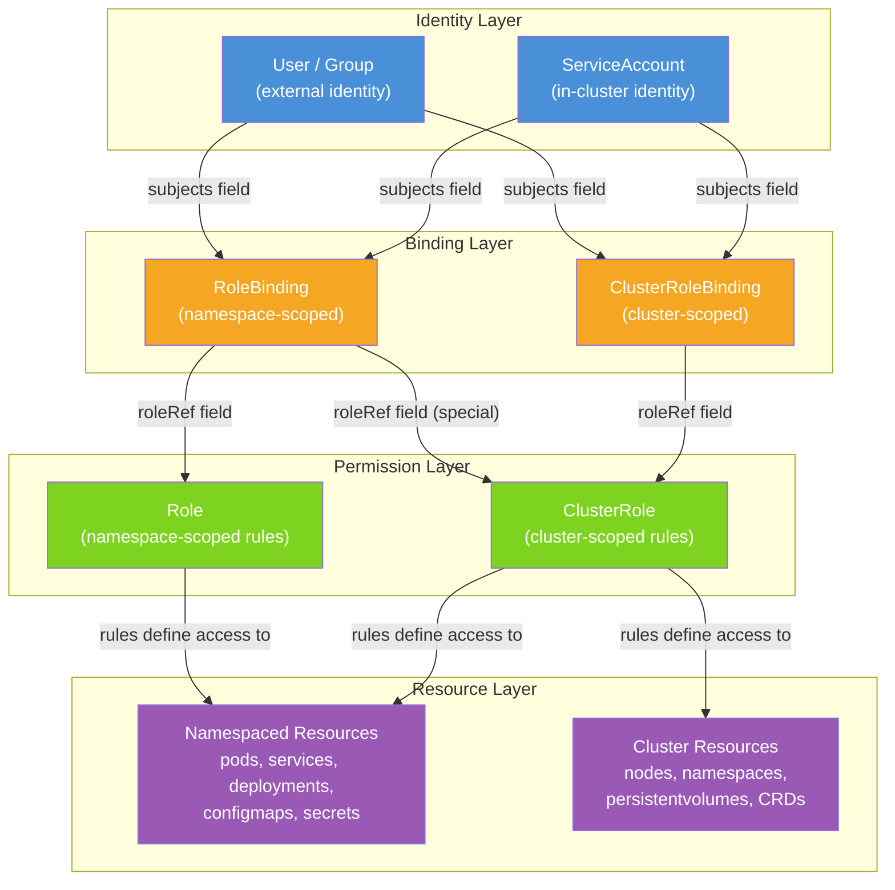
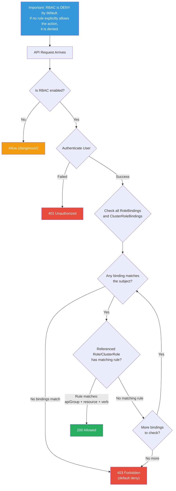

# File 26: RBAC Deep Dive

**Topic:** Role-Based Access Control (RBAC) in Kubernetes — Roles, ClusterRoles, Bindings, ServiceAccounts, and Authorization

**WHY THIS MATTERS:**
RBAC is the backbone of Kubernetes security. Without it, every user and every pod has unlimited power over your cluster. A misconfigured RBAC policy can let a junior developer accidentally delete production databases, or let a compromised pod escalate its privileges and take over the entire cluster. Understanding RBAC deeply is not optional — it is the single most important security skill for any Kubernetes administrator.

---

## Story: The Government Bureaucracy

Imagine the Indian government system — one of the largest bureaucracies in the world.

When a new IAS officer joins, they do not get unlimited power over the entire country. Instead, the system works through a careful hierarchy of roles and appointments:

**Role = Department Posting Order.** A posting order says: "This person can approve files, sign cheques, and inspect offices — but only within the Revenue Department of Uttar Pradesh." The Role defines *what actions* are allowed on *which resources*, scoped to a specific department (namespace).

**ClusterRole = Central Government Authority.** Some powers are not limited to one state. The Election Commission, the CAG, or the Supreme Court operate across all states. A ClusterRole is like a central government position — it grants permissions that span the entire cluster, not just one namespace.

**RoleBinding = The Appointment Letter.** Having a Role defined somewhere means nothing until someone is appointed to it. The appointment letter (RoleBinding) says: "Rajesh Kumar is hereby appointed as District Collector of Lucknow with the powers defined in the Revenue Department posting order." It connects a *person* to a *role*.

**ClusterRoleBinding = Gazette Notification.** When the President of India appoints the Chief Justice, it is published in the Gazette of India — effective across the entire nation. A ClusterRoleBinding grants cluster-wide permissions.

**ServiceAccount = Government ID for Programs.** Not everything is done by humans. The UIDAI system (Aadhaar) is a *program* that needs to access citizen databases, verify identities, and issue numbers. It does not use a human officer's credentials — it has its own official identity. A ServiceAccount is the identity that pods and automated processes use to interact with the Kubernetes API.

Just as the Indian government would collapse into chaos if every clerk had the Prime Minister's powers, your Kubernetes cluster needs RBAC to ensure that every user, every pod, and every service has exactly the permissions it needs — no more, no less.

---

## Example Block 1 — Understanding RBAC Components

### Section 1 — The Four RBAC Objects

Kubernetes RBAC has exactly four object types. Understanding them is non-negotiable.



**WHY:** This diagram shows the complete RBAC chain. Authorization flows from an identity (User or ServiceAccount) through a Binding to a Role, which defines what actions are allowed on which resources. Every authorization decision walks this chain.

### Section 2 — Role vs ClusterRole

A **Role** grants permissions within a single namespace. A **ClusterRole** grants permissions across the entire cluster, or on cluster-scoped resources like nodes and namespaces.

```yaml
# WHY: A Role is namespace-scoped — it only grants access within the namespace where it is created
apiVersion: rbac.authorization.k8s.io/v1
kind: Role
metadata:
  namespace: development        # WHY: This Role only applies to the "development" namespace
  name: pod-reader
rules:
- apiGroups: [""]               # WHY: Empty string means the core API group (pods, services, configmaps, etc.)
  resources: ["pods"]           # WHY: This rule applies only to pod resources
  verbs: ["get", "watch", "list"]  # WHY: Read-only access — no create, update, delete, or patch
```

**WHY:** The `apiGroups` field is the most confusing part for beginners. The core API group (pods, services, configmaps, secrets, nodes) uses an empty string `""`. Other API groups use their group name like `apps` (for deployments), `batch` (for jobs), or `rbac.authorization.k8s.io` (for RBAC objects themselves).

```yaml
# WHY: A ClusterRole has no namespace — it applies cluster-wide
apiVersion: rbac.authorization.k8s.io/v1
kind: ClusterRole
metadata:
  name: node-reader             # WHY: No namespace field — ClusterRoles are cluster-scoped
rules:
- apiGroups: [""]
  resources: ["nodes"]          # WHY: Nodes are cluster-scoped resources — only ClusterRoles can grant access
  verbs: ["get", "watch", "list"]
- apiGroups: [""]
  resources: ["pods"]           # WHY: ClusterRoles can also reference namespaced resources
  verbs: ["get", "list"]       # WHY: When bound via ClusterRoleBinding, access is granted across ALL namespaces
```

**WHY:** A ClusterRole that references namespaced resources (like pods) is versatile. When bound with a ClusterRoleBinding, it grants access across all namespaces. When bound with a RoleBinding, it grants access only in that RoleBinding's namespace. This is a common pattern to define permissions once and reuse them.

### Section 3 — RBAC Verbs

Kubernetes RBAC verbs map to HTTP methods on the API server:

| RBAC Verb | HTTP Method | Description |
|-----------|-------------|-------------|
| `get` | GET (single) | Retrieve a specific resource by name |
| `list` | GET (collection) | List all resources of a type |
| `watch` | GET (with watch) | Stream changes to resources |
| `create` | POST | Create a new resource |
| `update` | PUT | Replace an entire resource |
| `patch` | PATCH | Modify specific fields of a resource |
| `delete` | DELETE (single) | Delete a specific resource |
| `deletecollection` | DELETE (collection) | Delete all resources of a type |
| `impersonate` | — | Act as another user/group/SA |
| `bind` | — | Create bindings to roles |
| `escalate` | — | Modify roles to grant more permissions |

**WHY:** The `escalate` and `bind` verbs are critical security controls. Without them, a user with permission to create Roles could create a Role with `cluster-admin` permissions and bind it to themselves. Kubernetes prevents this escalation by default.

---

## Example Block 2 — Bindings and ServiceAccounts

### Section 1 — RoleBinding vs ClusterRoleBinding

```yaml
# WHY: RoleBinding connects a subject to a Role within a namespace
apiVersion: rbac.authorization.k8s.io/v1
kind: RoleBinding
metadata:
  name: read-pods-binding
  namespace: development         # WHY: This binding only grants access in the "development" namespace
subjects:
- kind: User                    # WHY: The subject can be User, Group, or ServiceAccount
  name: rajesh                  # WHY: This is the username from the authentication layer
  apiGroup: rbac.authorization.k8s.io
roleRef:
  kind: Role                    # WHY: References a Role (namespace-scoped permissions)
  name: pod-reader              # WHY: The Role we defined earlier
  apiGroup: rbac.authorization.k8s.io
```

```yaml
# WHY: ClusterRoleBinding grants cluster-wide access
apiVersion: rbac.authorization.k8s.io/v1
kind: ClusterRoleBinding
metadata:
  name: global-node-reader      # WHY: No namespace — cluster-scoped object
subjects:
- kind: Group                   # WHY: Binding to a group — all members inherit these permissions
  name: sre-team                # WHY: Group name from your identity provider (LDAP, OIDC, etc.)
  apiGroup: rbac.authorization.k8s.io
roleRef:
  kind: ClusterRole
  name: node-reader
  apiGroup: rbac.authorization.k8s.io
```

**WHY:** A critical pattern: you can bind a **ClusterRole** using a **RoleBinding**. This scopes the cluster-wide role down to a single namespace. This lets you define permissions once (as a ClusterRole) and grant them namespace-by-namespace.

```yaml
# WHY: Binding a ClusterRole via RoleBinding — grants ClusterRole permissions but only in one namespace
apiVersion: rbac.authorization.k8s.io/v1
kind: RoleBinding
metadata:
  name: dev-pod-reader
  namespace: development         # WHY: Even though the ClusterRole can access all namespaces,
                                 #       this RoleBinding limits it to "development"
subjects:
- kind: ServiceAccount
  name: ci-bot                  # WHY: A ServiceAccount used by CI/CD pipelines
  namespace: ci-system          # WHY: ServiceAccount namespace must be specified when different from binding namespace
roleRef:
  kind: ClusterRole             # WHY: Referencing a ClusterRole, but binding it to a single namespace
  name: pod-reader-cluster
  apiGroup: rbac.authorization.k8s.io
```

### Section 2 — ServiceAccounts and Tokens

ServiceAccounts are in-cluster identities for pods and automated processes.

```yaml
# WHY: Explicitly create a ServiceAccount instead of relying on the default one
apiVersion: v1
kind: ServiceAccount
metadata:
  name: app-service-account
  namespace: production
  annotations:
    description: "ServiceAccount for the main application pods"
automountServiceAccountToken: false  # WHY: Security best practice — do not auto-mount the token
                                      # unless the pod actually needs to talk to the Kubernetes API
```

**WHY:** Every namespace has a `default` ServiceAccount. Before Kubernetes 1.24, a long-lived Secret token was automatically created for each ServiceAccount. After 1.24, tokens are short-lived and generated on demand via the TokenRequest API. This was a major security improvement.

Creating a bound token manually:

```bash
# SYNTAX: kubectl create token <service-account-name> -n <namespace> --duration <time>
# FLAGS:
#   -n, --namespace    Namespace of the ServiceAccount
#   --duration         How long the token is valid (e.g., 1h, 24h)
#   --audience         Intended audience for the token (for validation)

kubectl create token app-service-account -n production --duration 1h

# EXPECTED OUTPUT:
# eyJhbGciOiJSUzI1NiIsImtpZCI6Ik...  (a long JWT token string)
```

**WHY:** These tokens are short-lived by default (1 hour) and automatically rotated by the kubelet. This eliminates the risk of long-lived tokens being stolen and used indefinitely.

### Section 3 — Assigning ServiceAccounts to Pods

```yaml
apiVersion: v1
kind: Pod
metadata:
  name: api-consumer
  namespace: production
spec:
  serviceAccountName: app-service-account   # WHY: Use the specific SA, not the default
  automountServiceAccountToken: true        # WHY: This pod NEEDS API access, so override the SA default
  containers:
  - name: app
    image: myapp:v1.2
    volumeMounts:
    - name: token-vol
      mountPath: /var/run/secrets/kubernetes.io/serviceaccount
      readOnly: true                        # WHY: Token should never be writable by the application
```

**WHY:** If your pod does not need to talk to the Kubernetes API (most application pods do not), set `automountServiceAccountToken: false` on the ServiceAccount or the Pod spec. This reduces the attack surface if the pod is compromised.

---

## Example Block 3 — Aggregated ClusterRoles

### Section 1 — How Aggregation Works

Aggregated ClusterRoles automatically combine rules from multiple ClusterRoles using label selectors. This is how Kubernetes built-in roles like `admin`, `edit`, and `view` work.

```yaml
# WHY: The "monitoring-view" ClusterRole aggregates into the built-in "view" role
apiVersion: rbac.authorization.k8s.io/v1
kind: ClusterRole
metadata:
  name: monitoring-metrics-reader
  labels:
    rbac.authorization.k8s.io/aggregate-to-view: "true"   # WHY: This label causes automatic aggregation
    rbac.authorization.k8s.io/aggregate-to-edit: "true"   # WHY: Also aggregate into the "edit" role
    rbac.authorization.k8s.io/aggregate-to-admin: "true"  # WHY: Also aggregate into the "admin" role
rules:
- apiGroups: ["monitoring.coreos.com"]     # WHY: Custom API group from Prometheus Operator
  resources: ["prometheusrules", "servicemonitors"]
  verbs: ["get", "list", "watch"]
```

**WHY:** When you install a CRD (like Prometheus Operator), users with the built-in `view` role cannot see the new custom resources by default. Aggregated ClusterRoles solve this by automatically extending existing roles with new permissions.

```yaml
# WHY: Define your own aggregated ClusterRole that collects permissions from labeled ClusterRoles
apiVersion: rbac.authorization.k8s.io/v1
kind: ClusterRole
metadata:
  name: custom-aggregate-reader
aggregationRule:
  clusterRoleSelectors:
  - matchLabels:
      custom-rbac/aggregate-to-reader: "true"   # WHY: Any ClusterRole with this label is merged in
rules: []  # WHY: Rules are automatically filled by the aggregation controller — do NOT set them manually
```

**WHY:** The `rules` field must be empty for aggregated ClusterRoles. The controller populates it automatically. If you set rules manually, they will be overwritten.

### Section 2 — Viewing Aggregated Roles

```bash
# SYNTAX: kubectl get clusterrole <name> -o yaml
# FLAGS:
#   -o yaml    Output in YAML format to see all aggregated rules

kubectl get clusterrole view -o yaml

# EXPECTED OUTPUT (abbreviated):
# apiVersion: rbac.authorization.k8s.io/v1
# kind: ClusterRole
# metadata:
#   name: view
#   labels:
#     kubernetes.io/bootstrapping: rbac-defaults
# aggregationRule:
#   clusterRoleSelectors:
#   - matchLabels:
#       rbac.authorization.k8s.io/aggregate-to-view: "true"
# rules:
# - apiGroups: [""]
#   resources: ["configmaps", "endpoints", "persistentvolumeclaims", ...]
#   verbs: ["get", "list", "watch"]
# - apiGroups: ["apps"]
#   resources: ["deployments", "replicasets", "statefulsets", ...]
#   verbs: ["get", "list", "watch"]
# ... (many more rules from aggregation)
```

---

## Example Block 4 — Authorization Testing and Impersonation

### Section 1 — kubectl auth can-i

The `kubectl auth can-i` command is your primary tool for testing RBAC permissions.

```bash
# SYNTAX: kubectl auth can-i <verb> <resource> [--namespace <ns>] [--as <user>] [--as-group <group>]
# FLAGS:
#   --as             Impersonate a specific user
#   --as-group       Impersonate a specific group
#   --list           List all allowed actions
#   -A, --all-namespaces   Check across all namespaces

# Check if YOU can list pods in the default namespace
kubectl auth can-i list pods

# EXPECTED OUTPUT:
# yes

# Check if a specific user can delete deployments
kubectl auth can-i delete deployments --as rajesh --namespace production

# EXPECTED OUTPUT:
# no

# Check if a ServiceAccount can create secrets
kubectl auth can-i create secrets --as system:serviceaccount:production:app-service-account

# EXPECTED OUTPUT:
# no

# List ALL permissions for a user in a namespace
kubectl auth can-i --list --as rajesh --namespace development

# EXPECTED OUTPUT:
# Resources                                       Non-Resource URLs   Resource Names   Verbs
# pods                                             []                  []               [get list watch]
# pods/log                                         []                  []               [get]
# selfsubjectaccessreviews.authorization.k8s.io    []                  []               [create]
# selfsubjectrulesreviews.authorization.k8s.io     []                  []               [create]
```

**WHY:** The `--as` flag uses Kubernetes impersonation, which itself requires RBAC permissions. Cluster admins have impersonation rights by default. This is the standard way to verify RBAC policies without actually logging in as another user.

### Section 2 — Authorization Decision Flowchart



**WHY:** The key insight is that RBAC is **deny by default**. Unlike some systems where you deny specific actions, Kubernetes denies everything unless an explicit rule allows it. There is no "deny" rule in RBAC — you control access only by what you allow.

### Section 3 — Impersonation

Impersonation lets one user act as another without having their credentials. This is critical for debugging, CI/CD systems, and multi-tenant platforms.

```yaml
# WHY: Grant a CI system the ability to impersonate specific ServiceAccounts
apiVersion: rbac.authorization.k8s.io/v1
kind: ClusterRole
metadata:
  name: ci-impersonator
rules:
- apiGroups: [""]
  resources: ["users", "groups", "serviceaccounts"]  # WHY: These are the impersonation targets
  verbs: ["impersonate"]                              # WHY: The impersonate verb is special
  resourceNames: ["system:serviceaccount:staging:deployer"]  # WHY: Restrict which identities can be impersonated
```

```yaml
# WHY: Bind the impersonation ClusterRole to the CI service
apiVersion: rbac.authorization.k8s.io/v1
kind: ClusterRoleBinding
metadata:
  name: ci-impersonator-binding
subjects:
- kind: ServiceAccount
  name: ci-runner
  namespace: ci-system
roleRef:
  kind: ClusterRole
  name: ci-impersonator
  apiGroup: rbac.authorization.k8s.io
```

**WHY:** Always restrict impersonation using `resourceNames`. Without it, the subject could impersonate *any* user, including `system:masters` (the cluster admin group), which would be a complete security bypass.

```bash
# SYNTAX: kubectl <command> --as <user> --as-group <group>
# Test impersonation — act as the deployer ServiceAccount

kubectl get pods -n staging --as system:serviceaccount:staging:deployer

# EXPECTED OUTPUT:
# NAME                      READY   STATUS    RESTARTS   AGE
# web-app-6d8f9b7c4-abc12   1/1     Running   0          2h
# web-app-6d8f9b7c4-def34   1/1     Running   0          2h

# Act as a user in a specific group
kubectl get nodes --as rajesh --as-group sre-team

# EXPECTED OUTPUT:
# NAME           STATUS   ROLES           AGE   VERSION
# control-plane  Ready    control-plane   7d    v1.30.0
# worker-1       Ready    <none>          7d    v1.30.0
```

---

## Example Block 5 — Best Practices and Common Patterns

### Section 1 — Least Privilege Patterns

```yaml
# WHY: A minimal Role for a web application that only needs to read ConfigMaps and Secrets
apiVersion: rbac.authorization.k8s.io/v1
kind: Role
metadata:
  name: webapp-minimal
  namespace: production
rules:
- apiGroups: [""]
  resources: ["configmaps"]
  verbs: ["get"]                # WHY: Only "get" — the app reads specific configs, does not list all
  resourceNames: ["webapp-config", "feature-flags"]  # WHY: Restrict to specific named resources
- apiGroups: [""]
  resources: ["secrets"]
  verbs: ["get"]
  resourceNames: ["webapp-db-credentials"]  # WHY: Only the one secret it needs, not all secrets
```

**WHY:** Using `resourceNames` is the tightest control available. Instead of "can read all secrets in this namespace," the role says "can read only this one specific secret." This is true least privilege.

### Section 2 — Dangerous Permissions to Audit

Some permissions are equivalent to cluster-admin if misused:

```bash
# SYNTAX: kubectl auth can-i --list --as <user> -n <namespace>
# Look for these dangerous permissions:

# 1. Wildcard access — equivalent to full admin
#    resources: ["*"], verbs: ["*"]

# 2. Secrets access — can read all credentials
#    resources: ["secrets"], verbs: ["get", "list"]

# 3. Pod exec — can run arbitrary commands in any pod
#    resources: ["pods/exec"], verbs: ["create"]

# 4. Pod create with custom ServiceAccount — can escalate privileges
#    resources: ["pods"], verbs: ["create"]

# 5. Role/ClusterRole modification — can grant self more permissions
#    resources: ["roles", "clusterroles"], verbs: ["update", "patch"]

# Check who has cluster-admin:
kubectl get clusterrolebindings -o json | \
  jq '.items[] | select(.roleRef.name=="cluster-admin") | .subjects[]'

# EXPECTED OUTPUT:
# {
#   "apiGroup": "rbac.authorization.k8s.io",
#   "kind": "Group",
#   "name": "system:masters"
# }
```

**WHY:** Regular auditing of cluster-admin bindings is critical. In many clusters, too many users and ServiceAccounts have cluster-admin access because it was "easier" during setup. Every cluster-admin binding is a potential full cluster compromise.

### Section 3 — Debugging RBAC Issues

```bash
# When a user reports "forbidden" errors, use this workflow:

# Step 1: Check what they CAN do
kubectl auth can-i --list --as rajesh -n production

# Step 2: Check specific permission
kubectl auth can-i create deployments --as rajesh -n production
# EXPECTED OUTPUT: no

# Step 3: Find all bindings for the user
kubectl get rolebindings,clusterrolebindings -A -o json | \
  jq '.items[] | select(.subjects[]? | .name=="rajesh") | {name: .metadata.name, namespace: .metadata.namespace, role: .roleRef.name}'

# EXPECTED OUTPUT:
# {
#   "name": "dev-pod-reader",
#   "namespace": "development",
#   "role": "pod-reader"
# }

# Step 4: Inspect the referenced Role
kubectl get role pod-reader -n development -o yaml

# Step 5: Fix by adding the missing permissions or creating a new binding
```

---

## Key Takeaways

1. **RBAC has four objects**: Role (namespace-scoped permissions), ClusterRole (cluster-scoped permissions), RoleBinding (namespace-scoped assignment), and ClusterRoleBinding (cluster-scoped assignment). Every authorization decision involves these four types.

2. **RBAC is deny by default**: If no rule explicitly allows an action, it is denied. There are no "deny" rules — you control access only through what you explicitly allow.

3. **ServiceAccounts are pod identities**: After Kubernetes 1.24, tokens are short-lived and generated on demand. Always set `automountServiceAccountToken: false` unless the pod needs API access.

4. **Aggregated ClusterRoles extend existing roles**: When you install CRDs, use aggregation labels to ensure built-in roles (view, edit, admin) automatically include permissions for new resource types.

5. **`kubectl auth can-i` is your debugging tool**: Use `--as` and `--as-group` flags to test permissions for any user or ServiceAccount without logging in as them.

6. **Impersonation needs strict controls**: Always use `resourceNames` to restrict which identities can be impersonated. Unrestricted impersonation is equivalent to cluster-admin.

7. **Audit dangerous permissions regularly**: Wildcard access, secrets read, pod exec, pod create, and role modification are all potential escalation paths. Check who has these permissions in production.

8. **Use resourceNames for true least privilege**: Instead of granting access to all resources of a type, restrict to the specific named resources the workload needs.

9. **A RoleBinding can reference a ClusterRole**: This powerful pattern lets you define permissions once as a ClusterRole and grant them namespace-by-namespace via RoleBindings.

10. **Never give cluster-admin to ServiceAccounts**: Application pods should have the minimum permissions needed. If you think you need cluster-admin for an app, you almost certainly do not.
