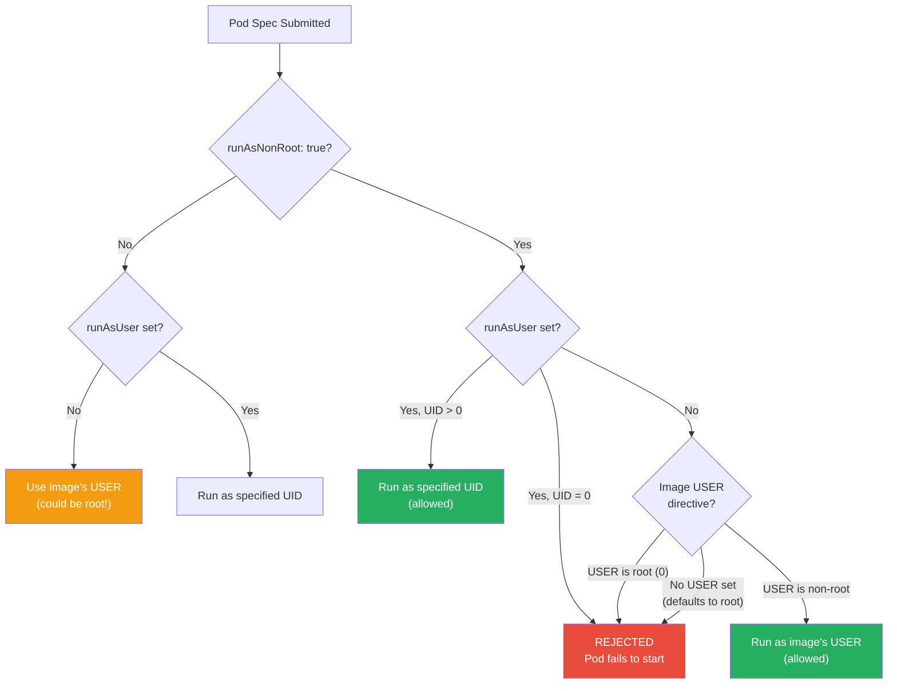
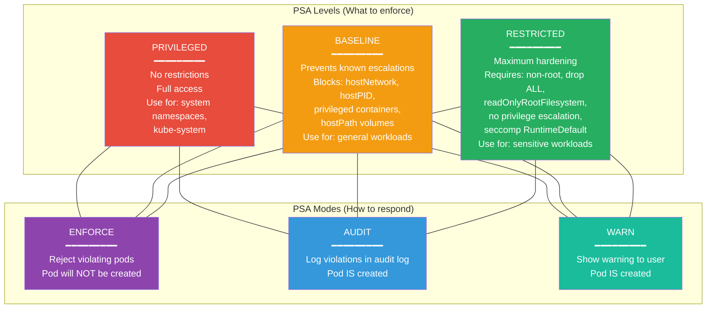
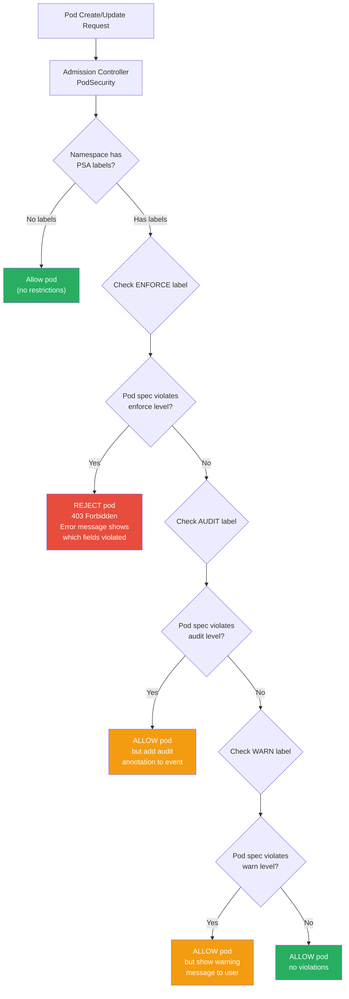

# File 27: Pod Security and Security Contexts

**Topic:** Pod Security Standards (PSA/PSS), Security Contexts, Linux Capabilities, and Seccomp Profiles

**WHY THIS MATTERS:**
A container running as root with full Linux capabilities is a ticking time bomb. If an attacker exploits a vulnerability in your application, they inherit whatever permissions the container has. Without security contexts, that means root access to the node's kernel, the ability to mount host filesystems, and the power to escape the container entirely. Pod Security Admission (PSA) is Kubernetes' built-in mechanism to enforce security baselines across entire namespaces, catching dangerous configurations before they ever run.

---

## Story: The Bank Security Protocols

Think of a large nationalized bank in India — State Bank of India, with thousands of branches and vaults.

**ID Badge = runAsUser.** Every employee wears an ID badge. A clerk's badge (UID 1000) gets them into the main hall. A manager's badge (UID 500) opens the manager's cabin. But nobody wears the *bank chairman's badge* (UID 0 / root) to work the counter. The `runAsUser` field ensures your container runs as a specific, non-privileged user — not as root.

**No Bags in the Vault = Drop Capabilities.** When employees enter the vault area, they must leave their bags, phones, and personal items in lockers outside. You do not bring unnecessary tools into a high-security zone. Similarly, `drop: ["ALL"]` removes all Linux capabilities from a container — no binding to privileged ports, no changing file ownership, no loading kernel modules. You add back only the specific capabilities you absolutely need.

**Cash Room is Read-Only = readOnlyRootFilesystem.** In the cash counting room, no one can bring in their own papers or leave notes behind — the room is for counting, not writing. A `readOnlyRootFilesystem` prevents attackers from writing malicious scripts, installing tools, or modifying the container's filesystem. The application can still write to explicitly mounted volumes (like `/tmp`).

**Tiered Clearance = PSA Levels.** The bank has three security tiers:
- **Privileged** = Executive suite — full access, no restrictions, reserved for senior leadership who understand the risks.
- **Baseline** = General banking floor — standard safety rules, no weapons, basic ID check. Prevents known privilege escalations but allows most normal operations.
- **Restricted** = Vault area — maximum security, every item checked, no exceptions. Enforces the full set of hardening best practices.

Just as the bank would never let a random person walk into the vault area with a bag, PSA ensures that no pod with dangerous security settings can run in a namespace marked as restricted.

---

## Example Block 1 — Security Contexts Fundamentals

### Section 1 — Pod-Level vs Container-Level Security Context

Security contexts can be set at the pod level (applies to all containers) or at the container level (overrides pod-level for that specific container).

```yaml
apiVersion: v1
kind: Pod
metadata:
  name: secure-app
  namespace: production
spec:
  securityContext:                    # WHY: Pod-level — applies to ALL containers and init containers
    runAsUser: 1000                   # WHY: All processes run as UID 1000, not root (UID 0)
    runAsGroup: 3000                  # WHY: Primary group is GID 3000
    fsGroup: 2000                    # WHY: All mounted volumes are owned by GID 2000
                                     #       This lets the non-root user write to volumes
    supplementalGroups: [4000]       # WHY: Additional group memberships for file access
    runAsNonRoot: true               # WHY: Kubernetes REJECTS the pod if the image tries to run as root
                                     #       Even if the Dockerfile says USER root, the pod will not start
    seccompProfile:                  # WHY: Restrict which system calls the container can make
      type: RuntimeDefault          # WHY: Use the container runtime's default seccomp profile
                                     #       Blocks ~60 dangerous syscalls like ptrace, mount, reboot
  containers:
  - name: app
    image: myapp:v2.0
    securityContext:                  # WHY: Container-level — can override pod-level settings
      allowPrivilegeEscalation: false  # WHY: Prevents setuid binaries from gaining elevated privileges
                                        #       Critical: without this, a bug could escalate to root
      readOnlyRootFilesystem: true    # WHY: Container filesystem is read-only
                                       #       Prevents attackers from writing scripts or installing tools
      capabilities:
        drop:
        - ALL                         # WHY: Remove ALL Linux capabilities
        add:
        - NET_BIND_SERVICE           # WHY: Add back ONLY what is needed — bind to ports below 1024
    volumeMounts:
    - name: tmp-dir
      mountPath: /tmp                # WHY: App needs to write temp files — use an emptyDir volume
    - name: cache-dir
      mountPath: /var/cache/app
  volumes:
  - name: tmp-dir
    emptyDir: {}                     # WHY: Writable temp directory — stored on the node, not in the image
  - name: cache-dir
    emptyDir:
      sizeLimit: 100Mi              # WHY: Limit the cache size to prevent disk abuse
```

**WHY:** The combination of `runAsNonRoot: true`, `readOnlyRootFilesystem: true`, `allowPrivilegeEscalation: false`, and `drop: ALL` capabilities is the gold standard for container security. This is what the PSA "restricted" level enforces.

### Section 2 — Understanding runAsUser and runAsNonRoot



**WHY:** The `runAsNonRoot: true` flag is a safety net. Even if someone pushes a new image version that accidentally removes the `USER` directive from the Dockerfile, Kubernetes will reject the pod instead of silently running as root.

### Section 3 — Linux Capabilities Deep Dive

Linux capabilities break root's monolithic power into granular permissions. Instead of "all or nothing," you can grant specific privileges.

| Capability | What It Allows | Risk Level |
|------------|---------------|------------|
| `NET_BIND_SERVICE` | Bind to ports below 1024 | Low |
| `NET_RAW` | Use raw sockets (ping, tcpdump) | Medium |
| `SYS_PTRACE` | Trace/debug other processes | High |
| `SYS_ADMIN` | Mount filesystems, change namespaces | Critical |
| `NET_ADMIN` | Modify network configuration | High |
| `DAC_OVERRIDE` | Bypass file permission checks | High |
| `CHOWN` | Change file ownership | Medium |
| `SETUID` / `SETGID` | Change process UID/GID | Critical |
| `SYS_MODULE` | Load kernel modules | Critical |
| `SYS_RAWIO` | Direct hardware I/O access | Critical |

```yaml
# WHY: Example showing a container that needs specific capabilities
apiVersion: v1
kind: Pod
metadata:
  name: network-debug
spec:
  containers:
  - name: netshoot
    image: nicolaka/netshoot
    securityContext:
      capabilities:
        drop:
        - ALL                     # WHY: Start with zero capabilities
        add:
        - NET_RAW                # WHY: Need raw sockets for ping and traceroute
        - NET_BIND_SERVICE       # WHY: Need to run a test server on port 80
      # NOTE: Do NOT add SYS_ADMIN, SYS_PTRACE, or SYS_MODULE
      #       These are almost never needed and are container escape vectors
```

**WHY:** The default Docker capability set includes about 14 capabilities. Even this default set is too permissive for most workloads. Always start with `drop: ALL` and add back only what you need.

---

## Example Block 2 — Seccomp Profiles

### Section 1 — What Seccomp Does

Seccomp (Secure Computing Mode) restricts which Linux system calls a container can make. Even if an attacker gets code execution inside a container, seccomp prevents them from calling dangerous syscalls.

```yaml
# WHY: Use the RuntimeDefault seccomp profile — blocks ~60 dangerous syscalls
apiVersion: v1
kind: Pod
metadata:
  name: seccomp-default
spec:
  securityContext:
    seccompProfile:
      type: RuntimeDefault        # WHY: Uses containerd/CRI-O default profile
                                   #       Blocks: ptrace, mount, reboot, swapon, init_module, etc.
                                   #       Allows: read, write, open, close, stat, mmap, etc.
  containers:
  - name: app
    image: myapp:v1.0
```

```yaml
# WHY: Use a custom seccomp profile for even tighter security
apiVersion: v1
kind: Pod
metadata:
  name: seccomp-custom
spec:
  securityContext:
    seccompProfile:
      type: Localhost             # WHY: Use a custom profile stored on the node
      localhostProfile: profiles/strict-app.json  # WHY: Path relative to kubelet's seccomp directory
                                                   #       Usually /var/lib/kubelet/seccomp/
  containers:
  - name: app
    image: myapp:v1.0
```

**WHY:** The `RuntimeDefault` profile is an excellent starting point. It blocks dangerous syscalls while allowing normal application behavior. Custom profiles can be even more restrictive, allowing only the exact syscalls your application uses.

### Section 2 — Verifying Security Context

```bash
# SYNTAX: kubectl get pod <name> -o jsonpath='{.spec.securityContext}'
# Verify the security context is applied

kubectl get pod secure-app -o yaml | grep -A 20 securityContext

# EXPECTED OUTPUT:
#   securityContext:
#     runAsUser: 1000
#     runAsGroup: 3000
#     runAsNonRoot: true
#     fsGroup: 2000
#     seccompProfile:
#       type: RuntimeDefault

# Check what user the container is actually running as
kubectl exec secure-app -- id

# EXPECTED OUTPUT:
# uid=1000 gid=3000 groups=2000,4000

# Verify read-only filesystem
kubectl exec secure-app -- touch /testfile

# EXPECTED OUTPUT:
# touch: /testfile: Read-only file system

# Verify capabilities are dropped
kubectl exec secure-app -- cat /proc/1/status | grep Cap

# EXPECTED OUTPUT:
# CapInh: 0000000000000000
# CapPrm: 0000000000000400    (only NET_BIND_SERVICE)
# CapEff: 0000000000000400
# CapBnd: 0000000000000400
# CapAmb: 0000000000000000
```

---

## Example Block 3 — Pod Security Admission (PSA)

### Section 1 — PSA Levels and Modes

Pod Security Admission replaced the deprecated PodSecurityPolicy (PSP). It is built into Kubernetes (no separate installation) and enforces Pod Security Standards at the namespace level.



**WHY:** The three modes let you roll out security gradually. Start with `warn` to see what would break, move to `audit` to log violations, then finally `enforce` to block non-compliant pods. You can use different levels for different modes (e.g., enforce baseline but warn on restricted).

### Section 2 — Labeling Namespaces

PSA is configured entirely through namespace labels. No CRDs, no webhook configurations, no additional controllers.

```bash
# SYNTAX: kubectl label namespace <name> pod-security.kubernetes.io/<mode>=<level>
# FLAGS:
#   --overwrite    Overwrite existing label value

# Enforce the baseline level
kubectl label namespace production pod-security.kubernetes.io/enforce=baseline

# EXPECTED OUTPUT:
# namespace/production labeled

# Warn on restricted violations (but allow them)
kubectl label namespace production pod-security.kubernetes.io/warn=restricted

# EXPECTED OUTPUT:
# namespace/production labeled

# Audit restricted violations (log but allow)
kubectl label namespace production pod-security.kubernetes.io/audit=restricted

# EXPECTED OUTPUT:
# namespace/production labeled

# Pin to a specific Kubernetes version (recommended for stability)
kubectl label namespace production pod-security.kubernetes.io/enforce-version=v1.30

# EXPECTED OUTPUT:
# namespace/production labeled
```

**WHY:** Version pinning prevents your enforcement from changing when the cluster is upgraded. Without it, the definition of "baseline" or "restricted" could change between Kubernetes versions, potentially breaking workloads during an upgrade.

```yaml
# WHY: Define namespace with PSA labels declaratively
apiVersion: v1
kind: Namespace
metadata:
  name: secure-apps
  labels:
    pod-security.kubernetes.io/enforce: restricted      # WHY: Reject pods that violate restricted level
    pod-security.kubernetes.io/enforce-version: v1.30   # WHY: Pin to a known version
    pod-security.kubernetes.io/audit: restricted         # WHY: Log violations in audit log
    pod-security.kubernetes.io/warn: restricted          # WHY: Show warnings to users via kubectl
```

### Section 3 — What Each Level Forbids

**Baseline level forbids:**

| Forbidden Setting | Why It Is Dangerous |
|-------------------|-------------------|
| `privileged: true` | Full host access, complete container escape |
| `hostNetwork: true` | Access to host network stack, sniff traffic |
| `hostPID: true` | See and signal all host processes |
| `hostIPC: true` | Access host inter-process communication |
| `hostPath` volumes | Read/write host filesystem |
| `hostPorts` | Bind to host network ports |
| `apparmor` profile override | Disable AppArmor protection |
| `/proc` mount type changes | Access kernel internals |
| `SYS_ADMIN` capability | Near-root power inside container |
| `sysctls` (unsafe subset) | Modify kernel parameters |

**Restricted level additionally forbids:**

| Forbidden Setting | Required Instead |
|-------------------|-----------------|
| Running as root | `runAsNonRoot: true` |
| Privilege escalation | `allowPrivilegeEscalation: false` |
| Any capabilities beyond NET_BIND_SERVICE | `drop: ALL`, add only `NET_BIND_SERVICE` |
| No seccomp profile | Must set `RuntimeDefault` or `Localhost` |
| Writable root filesystem (recommended) | `readOnlyRootFilesystem: true` |

### Section 4 — PSA Admission Flowchart



**WHY:** The order matters — enforce is checked first. If the pod passes enforcement, audit and warn checks still run. This lets you enforce a baseline level while auditing and warning on a stricter level, giving you visibility into what would break if you tightened enforcement.

---

## Example Block 4 — Practical PSA Scenarios

### Section 1 — Deploying to a Restricted Namespace

```yaml
# WHY: This pod is fully compliant with the "restricted" PSA level
apiVersion: v1
kind: Pod
metadata:
  name: restricted-compliant
  namespace: secure-apps           # WHY: This namespace enforces "restricted"
spec:
  securityContext:
    runAsNonRoot: true             # WHY: Required by restricted
    runAsUser: 65534               # WHY: "nobody" user — guaranteed non-root
    seccompProfile:
      type: RuntimeDefault        # WHY: Required by restricted
  containers:
  - name: app
    image: myapp:v2.0
    securityContext:
      allowPrivilegeEscalation: false   # WHY: Required by restricted
      readOnlyRootFilesystem: true      # WHY: Recommended by restricted
      capabilities:
        drop:
        - ALL                           # WHY: Required by restricted — drop all capabilities
        add:
        - NET_BIND_SERVICE             # WHY: The ONLY capability allowed by restricted
    resources:
      requests:
        cpu: 100m
        memory: 128Mi
      limits:
        cpu: 500m
        memory: 256Mi
    volumeMounts:
    - name: tmp
      mountPath: /tmp
  volumes:
  - name: tmp
    emptyDir: {}
```

### Section 2 — What Happens When a Pod Violates PSA

```yaml
# WHY: This pod VIOLATES the restricted level — it will be rejected
apiVersion: v1
kind: Pod
metadata:
  name: violating-pod
  namespace: secure-apps
spec:
  containers:
  - name: app
    image: myapp:v2.0
    securityContext:
      privileged: true             # VIOLATION: privileged containers are forbidden
      runAsUser: 0                 # VIOLATION: running as root is forbidden
```

```bash
# Attempt to deploy the violating pod
kubectl apply -f violating-pod.yaml

# EXPECTED OUTPUT:
# Error from server (Forbidden): error when creating "violating-pod.yaml":
# pods "violating-pod" is forbidden: violates PodSecurity "restricted:v1.30":
# privileged (container "app" must not set securityContext.privileged=true),
# runAsNonRoot != true (pod or container "app" must set securityContext.runAsNonRoot=true),
# allowPrivilegeEscalation != false (container "app" must set securityContext.allowPrivilegeEscalation to false),
# unrestricted capabilities (container "app" must set securityContext.capabilities.drop=["ALL"]),
# seccompProfile (pod or container "app" must set securityContext.seccompProfile.type to "RuntimeDefault" or "Localhost")
```

**WHY:** The error message is detailed and tells you exactly which fields violated the policy. This makes fixing pods straightforward — address each listed violation.

### Section 3 — Migration Strategy

```bash
# Step 1: Start with warn mode to see violations without blocking
kubectl label namespace production pod-security.kubernetes.io/warn=restricted

# Step 2: Check existing pods for violations (dry-run)
kubectl label namespace production pod-security.kubernetes.io/enforce=restricted --dry-run=server

# EXPECTED OUTPUT:
# Warning: existing pods in namespace "production" violate the new PodSecurity enforce level "restricted:v1.30":
#   web-app-6d8f9b7c4-abc12: allowPrivilegeEscalation != false, ...
#   redis-master-0: runAsNonRoot != true, ...
# namespace/production labeled (server dry run)

# Step 3: Fix the reported pods, then apply enforcement
kubectl label namespace production pod-security.kubernetes.io/enforce=restricted --overwrite

# EXPECTED OUTPUT:
# namespace/production labeled
```

**WHY:** The `--dry-run=server` flag on the label command is a powerful migration tool. It tells you which existing pods would violate the policy without actually applying it. Fix those pods first, then enable enforcement.

---

## Example Block 5 — Advanced Security Context Patterns

### Section 1 — Init Containers with Elevated Permissions

Sometimes an init container needs elevated permissions to set up the environment, while the main container runs with minimal privileges.

```yaml
apiVersion: v1
kind: Pod
metadata:
  name: init-setup-app
spec:
  securityContext:
    runAsNonRoot: true
    runAsUser: 1000
    fsGroup: 1000
    seccompProfile:
      type: RuntimeDefault
  initContainers:
  - name: fix-permissions
    image: busybox:1.36
    command: ["sh", "-c", "chown -R 1000:1000 /data"]
    securityContext:
      runAsUser: 0                        # WHY: Init container runs as root to set up permissions
      runAsNonRoot: false                 # WHY: Override pod-level setting for this init container
      allowPrivilegeEscalation: false     # WHY: Still restrict privilege escalation
      capabilities:
        drop:
        - ALL
        add:
        - CHOWN                           # WHY: Only capability needed — change file ownership
    volumeMounts:
    - name: data-vol
      mountPath: /data
  containers:
  - name: app
    image: myapp:v2.0
    securityContext:
      allowPrivilegeEscalation: false
      readOnlyRootFilesystem: true
      capabilities:
        drop:
        - ALL
    volumeMounts:
    - name: data-vol
      mountPath: /data
  volumes:
  - name: data-vol
    persistentVolumeClaim:
      claimName: app-data
```

**WHY:** This pattern is common when PersistentVolumes are created with root ownership. The init container fixes permissions, then exits. The main container runs with minimal privileges. Note that this pattern violates PSA restricted level — you would need baseline enforcement for this namespace.

### Section 2 — Network Debugging Pod (Baseline-Compatible)

```yaml
# WHY: A debug pod that is baseline-compatible but not restricted-compatible
apiVersion: v1
kind: Pod
metadata:
  name: network-debug
  namespace: debug-ns              # WHY: Use a namespace with baseline enforcement, not restricted
spec:
  securityContext:
    runAsUser: 1000
    runAsNonRoot: true
    seccompProfile:
      type: RuntimeDefault
  containers:
  - name: netshoot
    image: nicolaka/netshoot:latest
    securityContext:
      allowPrivilegeEscalation: false
      capabilities:
        drop:
        - ALL
        add:
        - NET_RAW                  # WHY: Required for ping, traceroute — allowed by baseline, NOT by restricted
        - NET_BIND_SERVICE
    command: ["sleep", "3600"]
```

---

## Key Takeaways

1. **Always set `runAsNonRoot: true`**: This is your first line of defense. It prevents containers from running as root, even if the image Dockerfile does not specify a non-root user.

2. **Drop ALL capabilities, add back only what you need**: The default Docker capability set includes 14 capabilities that most applications never use. Start from zero and add back selectively.

3. **`readOnlyRootFilesystem: true` prevents persistent compromise**: Attackers cannot install tools, write scripts, or modify binaries if the filesystem is read-only. Use emptyDir volumes for temp files.

4. **`allowPrivilegeEscalation: false` blocks setuid abuse**: Without this flag, a setuid binary inside the container could escalate to root privileges, bypassing your runAsUser setting.

5. **PSA has three levels**: Privileged (no restrictions), Baseline (blocks known escalation vectors), and Restricted (full hardening). Use namespace labels to apply them.

6. **PSA has three modes**: Enforce (reject), Audit (log), and Warn (display warning). Layer these to roll out security gradually.

7. **Use `--dry-run=server` before enforcing**: When adding PSA labels, dry-run shows which existing pods would violate the policy, letting you fix them first.

8. **Version-pin your PSA levels**: Use `enforce-version` labels to prevent the security definition from changing during cluster upgrades.

9. **Seccomp RuntimeDefault should be your minimum**: It blocks approximately 60 dangerous system calls with zero configuration. There is no reason not to use it.

10. **Init containers can bridge the security gap**: When setup requires elevated permissions, use init containers with minimal additional capabilities, while keeping the main container fully locked down.
