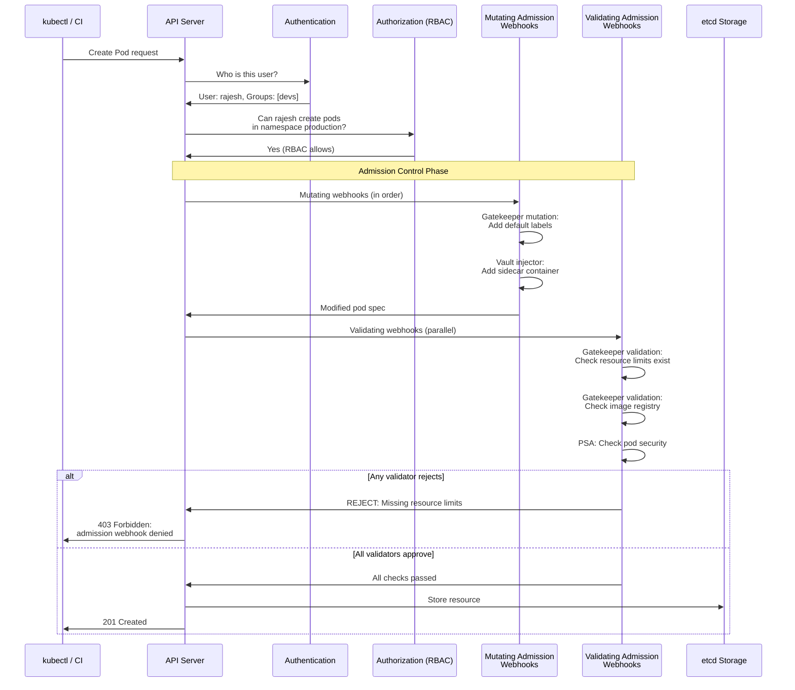
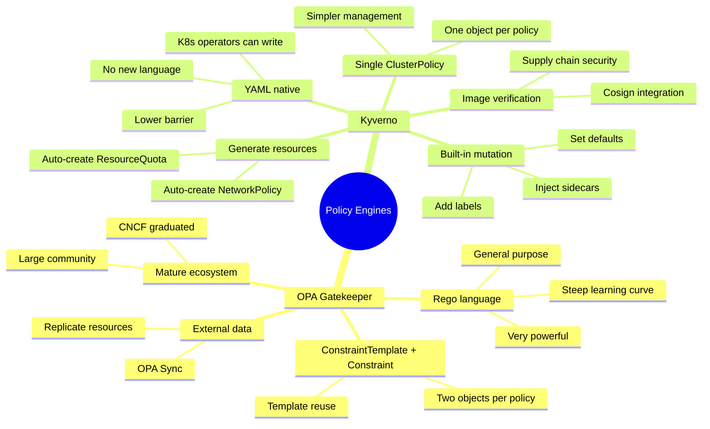

# File 30: Policy Enforcement — OPA Gatekeeper and Kyverno

**Topic:** Admission Webhooks, Open Policy Agent (OPA) Gatekeeper, Rego Policy Language, Kyverno YAML-Native Policies, and Policy-as-Code in CI/CD

**WHY THIS MATTERS:**
RBAC controls WHO can do things. Policy enforcement controls WHAT they can create. Without policy enforcement, a developer with permission to create pods can create a pod that runs as root, mounts the host filesystem, uses no resource limits, and pulls images from untrusted registries. OPA Gatekeeper and Kyverno are admission controllers that enforce organizational policies — every resource that enters the cluster must pass your rules before it is accepted.

---

## Story: The Building Code Inspector

Imagine the municipal building inspection system in an Indian city.

**ConstraintTemplate = The Rule Book.** The Municipal Corporation publishes a building code book — "Buildings must have fire exits," "Residential buildings cannot exceed 15 meters without elevator," "All commercial buildings must have parking." The ConstraintTemplate defines the *type* of rule and the logic for checking it. It is written by policy experts (like Rego code) and is reusable across many buildings.

**Constraint = The Inspector Applying the Rule.** An inspector visits a construction site with the rule book and a specific assignment: "Check that THIS building at THIS address follows the fire exit rule, with a minimum of 2 exits per floor." The Constraint is a specific instance of a ConstraintTemplate — it says which resources to check and what parameters to use.

**Audit Mode = Inspection Without Stop-Work Order.** Sometimes the inspector visits, notes violations, but does not stop construction — they file a report for review. Audit mode in Gatekeeper logs violations without blocking resource creation. This is how you roll out new policies without breaking existing workloads.

**Mutation = Corrective Action.** Instead of just rejecting a non-compliant building, the inspector can say: "Your plan is missing a fire exit. I will add one here." Mutation policies automatically modify resources to make them compliant — adding labels, injecting sidecars, setting default resource limits.

**Kyverno = The Simpler Inspector Who Reads YAML.** Not every city can afford specialists who write complex rule books in legal language. Some cities use simpler checklists in plain language that any building inspector can understand. Kyverno is the YAML-native alternative to OPA — policies are written in Kubernetes YAML, not Rego, making them accessible to any Kubernetes operator.

Just as a city without building codes would have unsafe, chaotic construction, a Kubernetes cluster without policy enforcement will accumulate insecure, non-compliant workloads that become increasingly difficult to fix over time.

---

## Example Block 1 — Kubernetes Admission Webhooks

### Section 1 — How Admission Webhooks Work

Every request to the Kubernetes API server passes through a chain of admission controllers. Webhooks extend this chain with your custom logic.



**WHY:** Mutating webhooks run BEFORE validating webhooks, and mutating webhooks run in sequence while validating webhooks run in parallel. This order matters: a mutating webhook can fix a resource so that it passes validation. For example, a mutation policy can add default resource limits before the validation policy checks for their existence.

### Section 2 — Webhook Configuration

```yaml
# WHY: This is how Kubernetes knows to call your webhook — Gatekeeper creates this automatically
apiVersion: admissionregistration.k8s.io/v1
kind: ValidatingWebhookConfiguration
metadata:
  name: gatekeeper-validating-webhook
webhooks:
- name: validation.gatekeeper.sh
  admissionReviewVersions: ["v1", "v1beta1"]
  clientConfig:
    service:
      name: gatekeeper-webhook-service      # WHY: The Gatekeeper service inside the cluster
      namespace: gatekeeper-system
      path: "/v1/admit"                      # WHY: The endpoint that receives admission reviews
  rules:
  - operations: ["CREATE", "UPDATE"]         # WHY: Check on create and update, not delete
    apiGroups: ["*"]                         # WHY: Check all API groups
    apiVersions: ["*"]
    resources: ["*"]                         # WHY: Check all resource types
  failurePolicy: Ignore                      # WHY: If the webhook is down, ALLOW the request
                                              #       "Fail" would block ALL API operations when webhook is down
  sideEffects: None                          # WHY: Required — webhook has no side effects
  timeoutSeconds: 10                         # WHY: Do not block API requests for too long
  namespaceSelector:
    matchExpressions:
    - key: admission.gatekeeper.sh/ignore    # WHY: Skip namespaces with this label
      operator: DoesNotExist                 #       Useful for kube-system, gatekeeper-system
```

**WHY:** The `failurePolicy` is a critical decision. `Ignore` means the webhook failing degrades to no enforcement. `Fail` means the webhook failing blocks ALL API requests — including emergency fixes. Most organizations use `Ignore` in production with monitoring alerts for webhook health.

---

## Example Block 2 — OPA Gatekeeper

### Section 1 — Installing Gatekeeper

```bash
# SYNTAX: kubectl apply -f <url>
# Install Gatekeeper using the official manifests
kubectl apply -f https://raw.githubusercontent.com/open-policy-agent/gatekeeper/v3.16.0/deploy/gatekeeper.yaml

# EXPECTED OUTPUT:
# namespace/gatekeeper-system created
# customresourcedefinition.apiextensions.k8s.io/configs.config.gatekeeper.sh created
# customresourcedefinition.apiextensions.k8s.io/constrainttemplates.templates.gatekeeper.sh created
# ...
# deployment.apps/gatekeeper-audit created
# deployment.apps/gatekeeper-controller-manager created

# Verify Gatekeeper is running
kubectl get pods -n gatekeeper-system

# EXPECTED OUTPUT:
# NAME                                             READY   STATUS    RESTARTS   AGE
# gatekeeper-audit-7c84869d6f-xxxxx                1/1     Running   0          30s
# gatekeeper-controller-manager-5b96b8f8c4-xxxxx   1/1     Running   0          30s
# gatekeeper-controller-manager-5b96b8f8c4-yyyyy   1/1     Running   0          30s
# gatekeeper-controller-manager-5b96b8f8c4-zzzzz   1/1     Running   0          30s
```

### Section 2 — ConstraintTemplate (The Rule Book)

A ConstraintTemplate defines the Rego logic for a policy and creates a new CRD that you use to apply the policy.

```yaml
# WHY: This template creates a policy that requires all containers to have resource limits
apiVersion: templates.gatekeeper.sh/v1
kind: ConstraintTemplate
metadata:
  name: k8srequiredlimits
spec:
  crd:
    spec:
      names:
        kind: K8sRequiredLimits            # WHY: This becomes a new CRD kind
      validation:
        openAPIV3Schema:
          type: object
          properties:
            cpu:
              type: string
              description: "Maximum CPU limit allowed"
            memory:
              type: string
              description: "Maximum memory limit allowed"
  targets:
  - target: admission.k8s.gatekeeper.sh
    rego: |
      # WHY: Rego is OPA's policy language — declarative, designed for policy decisions
      package k8srequiredlimits

      # WHY: Each "violation" block defines a condition that makes the resource non-compliant
      violation[{"msg": msg}] {
        # WHY: Get each container in the pod spec
        container := input.review.object.spec.containers[_]
        # WHY: Check if CPU limit is missing
        not container.resources.limits.cpu
        msg := sprintf("Container '%v' must have a CPU limit", [container.name])
      }

      violation[{"msg": msg}] {
        container := input.review.object.spec.containers[_]
        # WHY: Check if memory limit is missing
        not container.resources.limits.memory
        msg := sprintf("Container '%v' must have a memory limit", [container.name])
      }

      violation[{"msg": msg}] {
        container := input.review.object.spec.containers[_]
        # WHY: Check if CPU request is missing
        not container.resources.requests.cpu
        msg := sprintf("Container '%v' must have a CPU request", [container.name])
      }

      violation[{"msg": msg}] {
        container := input.review.object.spec.containers[_]
        # WHY: Check if memory request is missing
        not container.resources.requests.memory
        msg := sprintf("Container '%v' must have a memory request", [container.name])
      }
```

**WHY:** The ConstraintTemplate is written once by platform engineers. Application developers never need to learn Rego — they just see the error message when their resource violates the policy.

### Section 3 — Constraint (The Inspector's Assignment)

```yaml
# WHY: This Constraint applies the K8sRequiredLimits template to specific resources
apiVersion: constraints.gatekeeper.sh/v1beta1
kind: K8sRequiredLimits
metadata:
  name: must-have-resource-limits
spec:
  enforcementAction: deny                   # WHY: Reject non-compliant resources
                                             #       Other options: "dryrun" (audit only), "warn"
  match:
    kinds:
    - apiGroups: [""]
      kinds: ["Pod"]                        # WHY: Check pods directly
    - apiGroups: ["apps"]
      kinds: ["Deployment", "StatefulSet", "DaemonSet"]   # WHY: Check workload controllers too
    namespaces: ["production", "staging"]   # WHY: Only enforce in these namespaces
    excludedNamespaces: ["kube-system"]     # WHY: Never block system components
  parameters:                               # WHY: Parameters passed to the Rego policy
    cpu: "2"
    memory: "4Gi"
```

```bash
# Verify the constraint is active
kubectl get k8srequiredlimits

# EXPECTED OUTPUT:
# NAME                        ENFORCEMENT-ACTION   TOTAL-VIOLATIONS
# must-have-resource-limits   deny                 0

# Test: Deploy a pod WITHOUT resource limits in production namespace
kubectl run test-no-limits --image=nginx -n production

# EXPECTED OUTPUT:
# Error from server (Forbidden): admission webhook "validation.gatekeeper.sh" denied the request:
# [must-have-resource-limits] Container 'test-no-limits' must have a CPU limit
# [must-have-resource-limits] Container 'test-no-limits' must have a memory limit
# [must-have-resource-limits] Container 'test-no-limits' must have a CPU request
# [must-have-resource-limits] Container 'test-no-limits' must have a memory request
```

### Section 4 — Audit Mode

```yaml
# WHY: Start with audit mode to find violations without blocking
apiVersion: constraints.gatekeeper.sh/v1beta1
kind: K8sRequiredLimits
metadata:
  name: audit-resource-limits
spec:
  enforcementAction: dryrun                 # WHY: Log violations but do not block
  match:
    kinds:
    - apiGroups: [""]
      kinds: ["Pod"]
    namespaces: ["production"]
```

```bash
# Check audit results — find existing violations
kubectl get k8srequiredlimits audit-resource-limits -o yaml

# EXPECTED OUTPUT (status section):
# status:
#   totalViolations: 3
#   violations:
#   - enforcementAction: dryrun
#     kind: Pod
#     message: Container 'web' must have a CPU limit
#     name: legacy-app-xxx
#     namespace: production
#   - enforcementAction: dryrun
#     kind: Pod
#     message: Container 'worker' must have a memory limit
#     name: batch-job-yyy
#     namespace: production
```

**WHY:** Always deploy new constraints in `dryrun` mode first. Check the `status.violations` field to see what would be blocked. Fix existing resources, then switch to `deny`.

---

## Example Block 3 — Common OPA Gatekeeper Policies

### Section 1 — Require Images from Trusted Registries

```yaml
apiVersion: templates.gatekeeper.sh/v1
kind: ConstraintTemplate
metadata:
  name: k8sallowedregistries
spec:
  crd:
    spec:
      names:
        kind: K8sAllowedRegistries
      validation:
        openAPIV3Schema:
          type: object
          properties:
            registries:
              type: array
              items:
                type: string
  targets:
  - target: admission.k8s.gatekeeper.sh
    rego: |
      package k8sallowedregistries

      violation[{"msg": msg}] {
        container := input.review.object.spec.containers[_]
        # WHY: Check if the image comes from an allowed registry
        not startswith(container.image, input.parameters.registries[_])
        msg := sprintf("Container '%v' uses image '%v' which is not from an allowed registry. Allowed: %v",
          [container.name, container.image, input.parameters.registries])
      }

      # WHY: Also check init containers — attackers can hide malicious code there
      violation[{"msg": msg}] {
        container := input.review.object.spec.initContainers[_]
        not startswith(container.image, input.parameters.registries[_])
        msg := sprintf("Init container '%v' uses image '%v' which is not from an allowed registry",
          [container.name, container.image])
      }
```

```yaml
# WHY: Apply the registry policy to production
apiVersion: constraints.gatekeeper.sh/v1beta1
kind: K8sAllowedRegistries
metadata:
  name: allowed-registries
spec:
  enforcementAction: deny
  match:
    kinds:
    - apiGroups: [""]
      kinds: ["Pod"]
    namespaces: ["production", "staging"]
  parameters:
    registries:
    - "gcr.io/my-company/"              # WHY: Your company's Google Container Registry
    - "us-docker.pkg.dev/my-company/"   # WHY: Google Artifact Registry
    - "registry.internal.com/"          # WHY: Internal registry
```

### Section 2 — Require Labels on Resources

```yaml
apiVersion: templates.gatekeeper.sh/v1
kind: ConstraintTemplate
metadata:
  name: k8srequiredlabels
spec:
  crd:
    spec:
      names:
        kind: K8sRequiredLabels
      validation:
        openAPIV3Schema:
          type: object
          properties:
            labels:
              type: array
              items:
                type: string
  targets:
  - target: admission.k8s.gatekeeper.sh
    rego: |
      package k8srequiredlabels

      violation[{"msg": msg}] {
        # WHY: Check each required label
        required := input.parameters.labels[_]
        # WHY: The label must exist on the resource
        not input.review.object.metadata.labels[required]
        msg := sprintf("Resource must have label '%v'", [required])
      }
```

```yaml
# WHY: Enforce labels for cost tracking and ownership
apiVersion: constraints.gatekeeper.sh/v1beta1
kind: K8sRequiredLabels
metadata:
  name: must-have-team-label
spec:
  enforcementAction: deny
  match:
    kinds:
    - apiGroups: ["apps"]
      kinds: ["Deployment"]
    namespaces: ["production"]
  parameters:
    labels:
    - "team"                  # WHY: Every deployment must have a team owner
    - "cost-center"           # WHY: Every deployment must be tagged for billing
    - "environment"           # WHY: Track which environment (prod, staging, dev)
```

### Section 3 — Block Latest Tag

```yaml
apiVersion: templates.gatekeeper.sh/v1
kind: ConstraintTemplate
metadata:
  name: k8sdisallowedtags
spec:
  crd:
    spec:
      names:
        kind: K8sDisallowedTags
      validation:
        openAPIV3Schema:
          type: object
          properties:
            tags:
              type: array
              items:
                type: string
  targets:
  - target: admission.k8s.gatekeeper.sh
    rego: |
      package k8sdisallowedtags

      violation[{"msg": msg}] {
        container := input.review.object.spec.containers[_]
        # WHY: Check for explicitly disallowed tags
        tag := input.parameters.tags[_]
        endswith(container.image, concat(":", ["", tag]))
        msg := sprintf("Container '%v' uses disallowed tag '%v' in image '%v'",
          [container.name, tag, container.image])
      }

      violation[{"msg": msg}] {
        container := input.review.object.spec.containers[_]
        # WHY: Images without a tag default to "latest"
        not contains(container.image, ":")
        msg := sprintf("Container '%v' must specify an image tag (image: '%v')",
          [container.name, container.image])
      }
```

---

## Example Block 4 — Kyverno: YAML-Native Policy Engine

### Section 1 — OPA vs Kyverno Comparison



**WHY:** Kyverno is not "better" or "worse" than OPA — it serves a different audience. OPA is more powerful and flexible (Rego can express almost any logic), but Kyverno is more accessible (YAML that any Kubernetes operator can read). Choose based on your team's skills and policy complexity needs.

### Section 2 — Kyverno Installation

```bash
# Install Kyverno using Helm
helm repo add kyverno https://kyverno.github.io/kyverno/
helm repo update
helm install kyverno kyverno/kyverno -n kyverno --create-namespace

# EXPECTED OUTPUT:
# NAME: kyverno
# NAMESPACE: kyverno
# STATUS: deployed
# REVISION: 1

# Verify installation
kubectl get pods -n kyverno

# EXPECTED OUTPUT:
# NAME                                             READY   STATUS    RESTARTS   AGE
# kyverno-admission-controller-xxx                 1/1     Running   0          30s
# kyverno-background-controller-xxx                1/1     Running   0          30s
# kyverno-cleanup-controller-xxx                   1/1     Running   0          30s
# kyverno-reports-controller-xxx                   1/1     Running   0          30s
```

### Section 3 — Kyverno Validation Policy

```yaml
# WHY: Kyverno policies are pure YAML — no Rego, no new language
apiVersion: kyverno.io/v1
kind: ClusterPolicy
metadata:
  name: require-resource-limits
  annotations:
    policies.kyverno.io/title: Require Resource Limits
    policies.kyverno.io/category: Best Practices
    policies.kyverno.io/severity: medium
    policies.kyverno.io/description: >-
      All containers must have CPU and memory resource limits defined.
spec:
  validationFailureAction: Enforce        # WHY: Reject non-compliant resources
                                           #       Use "Audit" for logging only
  background: true                         # WHY: Also scan existing resources in the background
  rules:
  - name: check-resource-limits
    match:
      any:
      - resources:
          kinds:
          - Pod
          namespaces:
          - production
          - staging
    validate:
      message: "Container {{request.object.spec.containers[].name}} must have CPU and memory limits."
      pattern:
        spec:
          containers:
          - resources:
              limits:
                cpu: "?*"                  # WHY: "?*" means the field must exist and have a value
                memory: "?*"
              requests:
                cpu: "?*"
                memory: "?*"
```

**WHY:** Compare this to the Gatekeeper version: no Rego, no ConstraintTemplate, no Constraint — just a single YAML document with a `pattern` that describes what a compliant resource looks like. The `?*` wildcard means "must exist and have at least one character."

### Section 4 — Kyverno Mutation Policy

```yaml
# WHY: Mutation policies automatically fix resources instead of rejecting them
apiVersion: kyverno.io/v1
kind: ClusterPolicy
metadata:
  name: add-default-labels
spec:
  rules:
  - name: add-team-label
    match:
      any:
      - resources:
          kinds:
          - Deployment
          - StatefulSet
    mutate:
      patchStrategicMerge:
        metadata:
          labels:
            +(team): "unknown"            # WHY: The "+" prefix means "add if not present"
                                           #       If the label already exists, do not overwrite it
            +(managed-by): "kyverno"
        spec:
          template:
            metadata:
              labels:
                +(team): "unknown"        # WHY: Also add the label to pod templates
```

```yaml
# WHY: Inject a default security context if none is specified
apiVersion: kyverno.io/v1
kind: ClusterPolicy
metadata:
  name: default-security-context
spec:
  rules:
  - name: add-security-context
    match:
      any:
      - resources:
          kinds:
          - Pod
    mutate:
      patchStrategicMerge:
        spec:
          securityContext:
            +(runAsNonRoot): true         # WHY: Default to non-root if not specified
            +(seccompProfile):
              type: RuntimeDefault        # WHY: Default to RuntimeDefault seccomp
          containers:
          - (name): "*"                   # WHY: Apply to all containers — "(name)" is an anchor
            securityContext:
              +(allowPrivilegeEscalation): false
              +(readOnlyRootFilesystem): true
              +(capabilities):
                drop:
                - ALL
```

**WHY:** Mutation policies are incredibly powerful for enforcing defaults without burdening developers. Instead of rejecting pods and making developers fix them, the policy automatically adds the missing security settings.

### Section 5 — Kyverno Generate Policy

```yaml
# WHY: Generate a default NetworkPolicy whenever a new namespace is created
apiVersion: kyverno.io/v1
kind: ClusterPolicy
metadata:
  name: generate-default-networkpolicy
spec:
  rules:
  - name: default-deny-ingress
    match:
      any:
      - resources:
          kinds:
          - Namespace
    exclude:
      any:
      - resources:
          namespaces:
          - kube-system                    # WHY: Do not apply to system namespaces
          - kube-public
          - kyverno
    generate:
      synchronize: true                    # WHY: If the policy is updated, regenerate the resource
      apiVersion: networking.k8s.io/v1
      kind: NetworkPolicy
      name: default-deny-ingress
      namespace: "{{request.object.metadata.name}}"   # WHY: Create in the new namespace
      data:
        spec:
          podSelector: {}                  # WHY: Apply to all pods in the namespace
          policyTypes:
          - Ingress                        # WHY: Deny all incoming traffic by default
```

**WHY:** Generate policies automate security baselines. Every new namespace automatically gets a deny-all NetworkPolicy, a default ResourceQuota, or a LimitRange — without any manual intervention.

---

## Example Block 5 — Policy-as-Code in CI/CD

### Section 1 — Testing Policies in CI

```bash
# Kyverno CLI — test policies without a cluster
# SYNTAX: kyverno apply <policy.yaml> --resource <resource.yaml>

# Install kyverno CLI
brew install kyverno

# Test a policy against a resource
kyverno apply require-resource-limits.yaml \
  --resource test-pod.yaml

# EXPECTED OUTPUT (non-compliant):
# Applying 1 policy rule to 1 resource...
#
# policy require-resource-limits -> resource default/Pod/test-pod
#   rule check-resource-limits: FAIL
#     Message: Container nginx must have CPU and memory limits.
#
# pass: 0, fail: 1, warn: 0, error: 0, skip: 0

# Test with a compliant resource
kyverno apply require-resource-limits.yaml \
  --resource compliant-pod.yaml

# EXPECTED OUTPUT:
# pass: 1, fail: 0, warn: 0, error: 0, skip: 0
```

```bash
# Gatekeeper — use gator CLI for testing
# SYNTAX: gator test <suite.yaml>

# Install gator
brew install gator

# Create a test suite
cat <<'EOF' > /tmp/gator-suite.yaml
apiVersion: test.gatekeeper.sh/v1alpha1
kind: Suite
tests:
- name: "require-limits"
  template: constrainttemplate.yaml
  constraint: constraint.yaml
  cases:
  - name: "pod-without-limits-rejected"
    object: test-pod-no-limits.yaml
    assertions:
    - violations: yes
  - name: "pod-with-limits-allowed"
    object: test-pod-with-limits.yaml
    assertions:
    - violations: no
EOF

gator test /tmp/gator-suite.yaml

# EXPECTED OUTPUT:
# ok    require-limits/pod-without-limits-rejected    0.002s
# ok    require-limits/pod-with-limits-allowed        0.001s
```

### Section 2 — CI Pipeline Integration

```yaml
# WHY: GitHub Actions workflow to test policies before merging
# File: .github/workflows/policy-check.yaml
name: Policy Check
on:
  pull_request:
    paths:
    - 'k8s/**'                           # WHY: Only run when Kubernetes manifests change
    - 'policies/**'

jobs:
  policy-check:
    runs-on: ubuntu-latest
    steps:
    - uses: actions/checkout@v4

    - name: Install Kyverno CLI
      run: |
        curl -LO https://github.com/kyverno/kyverno/releases/latest/download/kyverno-cli_linux_amd64.tar.gz
        tar -xzf kyverno-cli_linux_amd64.tar.gz
        sudo mv kyverno /usr/local/bin/

    - name: Test all policies against all manifests
      run: |
        # WHY: Test every policy against every manifest
        kyverno apply policies/ --resource k8s/

    - name: Verify policies are valid
      run: |
        # WHY: Ensure policy YAML is valid before applying to cluster
        kyverno validate policies/
```

**WHY:** Policy-as-code in CI catches violations before they reach the cluster. Developers get feedback in their pull requests, not at deployment time. This shifts security left — problems are found earlier when they are cheaper to fix.

### Section 3 — Monitoring and Reporting

```bash
# Kyverno — check policy reports
kubectl get policyreport -A

# EXPECTED OUTPUT:
# NAMESPACE    NAME                   PASS   FAIL   WARN   ERROR   SKIP   AGE
# production   polr-ns-production     45     3      0      0       0      2h
# staging      polr-ns-staging        30     7      0      0       0      2h

# Get details of failures
kubectl get policyreport polr-ns-production -n production -o yaml

# EXPECTED OUTPUT (results section):
# results:
# - category: Best Practices
#   message: 'validation error: Container nginx must have CPU and memory limits.'
#   policy: require-resource-limits
#   resources:
#   - apiVersion: v1
#     kind: Pod
#     name: legacy-app-xxxxx
#     namespace: production
#   result: fail
#   severity: medium

# Gatekeeper — check constraint violations
kubectl get constraints -o wide

# EXPECTED OUTPUT:
# NAME                        ENFORCEMENT-ACTION   TOTAL-VIOLATIONS
# must-have-resource-limits   deny                 3
# allowed-registries          deny                 0
# must-have-team-label        warn                 12
```

---

## Key Takeaways

1. **RBAC controls WHO, policies control WHAT**: RBAC says "this user can create pods." Policy enforcement says "but the pods must have resource limits, use approved images, and run as non-root."

2. **Admission webhooks are the enforcement mechanism**: Both Gatekeeper and Kyverno work as admission webhooks that intercept API requests before resources are stored in etcd.

3. **ConstraintTemplate + Constraint is the Gatekeeper pattern**: Templates define the logic in Rego, Constraints apply the logic to specific resources with parameters. Two objects per policy.

4. **Kyverno uses a single ClusterPolicy object**: No new language to learn — policies are pure YAML. Lower barrier to entry for teams without Rego expertise.

5. **Always start with audit/dryrun mode**: Deploy new policies in non-blocking mode first, check violations against existing resources, fix them, then switch to enforcement.

6. **Mutation policies automate compliance**: Instead of rejecting resources, mutation policies can add missing labels, set default security contexts, or inject sidecar containers automatically.

7. **Kyverno generate policies create resources automatically**: When a namespace is created, Kyverno can auto-create NetworkPolicies, ResourceQuotas, LimitRanges — enforcing security baselines from day one.

8. **Test policies in CI before deploying them**: Both Kyverno CLI and Gatekeeper's gator CLI can test policies offline, catching issues in pull requests before they reach the cluster.

9. **Set failurePolicy to Ignore in production**: If your webhook goes down, `Fail` blocks ALL API operations. `Ignore` degrades to no enforcement but keeps the cluster operational. Monitor webhook health separately.

10. **Policy-as-code is a cultural shift**: Treat policies like application code — version control, code review, automated testing, gradual rollout. This is the foundation of a secure, scalable platform.
