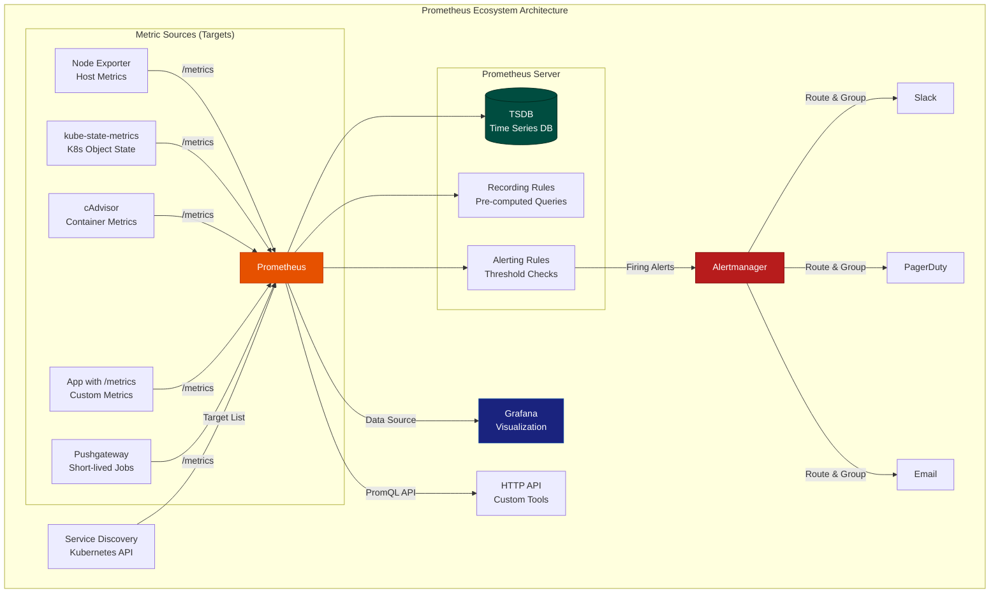
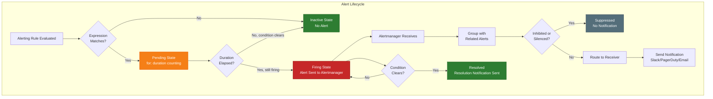

# File 32: Monitoring with Prometheus & Grafana

**Topic:** Pull-based monitoring, PromQL, alerting, and visualization in Kubernetes

**WHY THIS MATTERS:** Production systems without monitoring are like flying blind. Prometheus is the CNCF-graduated standard for Kubernetes monitoring. Understanding its pull-based architecture, query language, and alerting pipeline is essential for every SRE and DevOps engineer. Without it, you discover outages when customers call you, not when metrics spike.

---

## Story: The IRCTC Dashboard & Control Room

Picture the massive **Indian Railway Control Room** in New Delhi. Thousands of trains run across India every day. How does the system track them all?

- **Prometheus** is the **Control Room** itself. It doesn't wait for trains to call in — it **pulls** status updates from every station at regular intervals. "Station Bhopal, what's your status?" "Station Jaipur, how many trains delayed?" This pull-based approach means the control room is always in charge of what data it collects and when.

- **PromQL** is the **query language** operators use to ask questions: "Show me all trains delayed more than 30 minutes on the Rajdhani Express route" or "What's the average delay across all stations in Maharashtra in the last hour?"

- **Grafana** is the **giant LED dashboard** on the wall — the colorful screens showing train positions, delay heatmaps, and passenger load graphs. It takes raw data from the control room and makes it visual and beautiful.

- **Alertmanager** is the **alarm bell system**. When a train is 2 hours late, the bell rings. But it's smart — it groups related alarms (all trains delayed because of fog in UP get ONE notification), silences known issues (scheduled maintenance), and routes alerts to the right person (northern zone alerts go to the northern zone controller).

- **ServiceMonitor** is like **registering a new train route** with the control room. You tell Prometheus: "Hey, there's a new service running. Here's where to scrape its metrics."

- **Recording Rules** are like **pre-computed summary reports**. Instead of calculating "average delay across all 7000 stations" every time someone asks, you compute it once every minute and store the result.

---

## Example Block 1 — Prometheus Architecture & Pull-Based Metrics

### Section 1 — Understanding the Pull Model

In traditional monitoring (push-based), every application sends metrics to a central server. This creates problems:
- The central server can be overwhelmed
- You don't know if an app is silent because it's healthy or because it crashed
- Apps need to know where to send data

Prometheus flips this with a **pull model**:
- Prometheus **scrapes** (pulls) metrics from targets at regular intervals
- If a target disappears, Prometheus knows immediately (scrape fails)
- Targets just expose a `/metrics` endpoint — they don't need to know about Prometheus



**WHY:** This architecture separates concerns cleanly. Prometheus handles collection and storage. Alertmanager handles notification routing and deduplication. Grafana handles visualization. Each component does one thing well.

### Section 2 — Metric Types

Prometheus understands four metric types:

| Metric Type | Description | Example | Railway Analogy |
|-------------|-------------|---------|-----------------|
| **Counter** | Only goes up (resets on restart) | `http_requests_total` | Total tickets sold |
| **Gauge** | Goes up and down | `node_memory_available_bytes` | Current passengers on platform |
| **Histogram** | Samples in configurable buckets | `http_request_duration_seconds` | Response time distribution |
| **Summary** | Like histogram but calculates quantiles client-side | `go_gc_duration_seconds` | Pre-calculated percentiles |

```yaml
# WHY: This is what a /metrics endpoint looks like — plain text, human-readable
# TYPE http_requests_total counter
# HELP http_requests_total Total number of HTTP requests
http_requests_total{method="GET", status="200", path="/api/trains"} 145832
http_requests_total{method="POST", status="201", path="/api/booking"} 8921
http_requests_total{method="GET", status="500", path="/api/search"} 42

# TYPE node_cpu_seconds_total counter
node_cpu_seconds_total{cpu="0", mode="idle"} 98234.56
node_cpu_seconds_total{cpu="0", mode="user"} 12045.78

# TYPE http_request_duration_seconds histogram
http_request_duration_seconds_bucket{le="0.01"} 5000
http_request_duration_seconds_bucket{le="0.05"} 12000
http_request_duration_seconds_bucket{le="0.1"} 14500
http_request_duration_seconds_bucket{le="0.5"} 15200
http_request_duration_seconds_bucket{le="1.0"} 15300
http_request_duration_seconds_bucket{le="+Inf"} 15350
http_request_duration_seconds_sum 1234.56
http_request_duration_seconds_count 15350
```

**WHY:** Understanding metric types is crucial because the wrong type leads to wrong queries. You can't `rate()` a gauge (it goes up and down), and you can't take instant values of a counter (it only goes up, so the raw value is meaningless — you need the rate of change).

---

## Example Block 2 — PromQL: The Query Language

### Section 1 — Basic PromQL Queries

PromQL is a functional query language designed for time series data.

```bash
# SYNTAX: Instant vector selector — returns latest value for each time series
http_requests_total{job="api-server", status="200"}

# SYNTAX: Range vector selector — returns values over a time range
http_requests_total{job="api-server"}[5m]

# SYNTAX: rate() — per-second rate of increase for counters
rate(http_requests_total{job="api-server"}[5m])
# WHY: rate() handles counter resets and gives you "requests per second"
# A raw counter value of 1,000,000 is meaningless — rate gives you 50 req/s

# SYNTAX: sum() with by — aggregate across labels
sum by (status) (rate(http_requests_total[5m]))
# WHY: Groups all request rates by status code
# Result: {status="200"} 45.2, {status="500"} 0.3

# SYNTAX: increase() — total increase over time range
increase(http_requests_total{status="500"}[1h])
# WHY: "How many 500 errors in the last hour?" — more intuitive than rate for counts
```

**WHY:** `rate()` is the most important PromQL function. Counters only go up, so their raw value is useless. `rate()` converts "total requests = 1,452,832" into "requests per second = 42.5" which is actually meaningful.

### Section 2 — Advanced PromQL: Histogram Quantiles and Binary Operations

```bash
# SYNTAX: histogram_quantile() — calculate percentiles from histogram buckets
histogram_quantile(0.95, rate(http_request_duration_seconds_bucket[5m]))
# WHY: "95% of requests complete in under X seconds"
# This is the P95 latency — the industry standard SLI

# SYNTAX: histogram_quantile with label grouping
histogram_quantile(0.99,
  sum by (le, method) (
    rate(http_request_duration_seconds_bucket[5m])
  )
)
# WHY: P99 latency broken down by HTTP method

# SYNTAX: Binary operations for error rate
sum(rate(http_requests_total{status=~"5.."}[5m]))
/
sum(rate(http_requests_total[5m]))
* 100
# WHY: Error rate as percentage — "what fraction of all requests are 5xx?"

# SYNTAX: Predicting disk full with predict_linear()
predict_linear(node_filesystem_avail_bytes{mountpoint="/"}[6h], 24*3600)
# WHY: "Based on the last 6 hours of disk usage trend, will disk be full in 24 hours?"
# Returns predicted value in 24 hours — if negative, disk will be full

# SYNTAX: absent() for detecting missing metrics
absent(up{job="payment-service"})
# WHY: Returns 1 if the payment-service is not being scraped at all
# Critical for detecting when a service disappears entirely
```

### Section 3 — Useful kubectl Commands for Metrics

```bash
# SYNTAX: Check if metrics-server is running (required for kubectl top)
kubectl get pods -n kube-system -l k8s-app=metrics-server

# FLAGS:
#   -n kube-system    — metrics-server runs in kube-system namespace
#   -l k8s-app=...    — label selector to find the specific pod

# EXPECTED OUTPUT:
# NAME                              READY   STATUS    RESTARTS   AGE
# metrics-server-6d94bc8694-x7k2p   1/1     Running   0          5d

# SYNTAX: View real-time resource usage of pods
kubectl top pods -n default --sort-by=memory

# FLAGS:
#   --sort-by=memory  — sort by memory usage (can also use cpu)

# EXPECTED OUTPUT:
# NAME                        CPU(cores)   MEMORY(bytes)
# api-server-7d9f8b6-x2k9p   125m         256Mi
# worker-5c8d7f4-j8n2m       89m          180Mi
# cache-redis-0               12m          64Mi

# SYNTAX: View node-level resource usage
kubectl top nodes

# EXPECTED OUTPUT:
# NAME           CPU(cores)   CPU%   MEMORY(bytes)   MEMORY%
# worker-node1   450m         22%    2048Mi          52%
# worker-node2   320m         16%    1536Mi          39%

# SYNTAX: Get raw metrics from a pod's /metrics endpoint
kubectl port-forward svc/prometheus-server 9090:9090 -n monitoring
# Then visit http://localhost:9090 in browser

# SYNTAX: Check Prometheus targets via API
kubectl exec -n monitoring deploy/prometheus-server -- \
  wget -qO- http://localhost:9090/api/v1/targets | head -50

# WHY: Verify that Prometheus is actually scraping your targets
```

**WHY:** `kubectl top` requires metrics-server (lightweight, in-cluster). Prometheus provides much deeper metrics with history. You need both — `kubectl top` for quick checks, Prometheus for deep analysis.

---

## Example Block 3 — Recording Rules and Alerting Rules

### Section 1 — Recording Rules

Recording rules pre-compute expensive queries and store the results as new time series.

```yaml
# WHY: This file defines recording rules that pre-compute expensive queries
# Without recording rules, dashboards with complex queries would be slow
apiVersion: monitoring.coreos.com/v1
kind: PrometheusRule
metadata:
  name: recording-rules
  namespace: monitoring
  labels:
    release: kube-prometheus-stack  # WHY: Label must match Prometheus selector
spec:
  groups:
    - name: pod_resource_usage  # WHY: Group name for organization
      interval: 30s  # WHY: Evaluate every 30s (default is global evaluation_interval)
      rules:
        # WHY: Pre-compute CPU usage per pod — used by multiple dashboards
        - record: pod:container_cpu_usage_seconds:rate5m
          expr: |
            sum by (namespace, pod) (
              rate(container_cpu_usage_seconds_total{container!="POD", container!=""}[5m])
            )

        # WHY: Pre-compute memory usage per pod
        - record: pod:container_memory_working_set_bytes:sum
          expr: |
            sum by (namespace, pod) (
              container_memory_working_set_bytes{container!="POD", container!=""}
            )

        # WHY: Pre-compute request error rate for SLI tracking
        - record: job:http_requests:error_rate5m
          expr: |
            sum by (job) (rate(http_requests_total{status=~"5.."}[5m]))
            /
            sum by (job) (rate(http_requests_total[5m]))
```

**WHY:** Recording rules follow the naming convention `level:metric:operations`. Without them, a Grafana dashboard with 20 panels each running complex queries would overload Prometheus. Pre-compute once, reuse everywhere.

### Section 2 — Alerting Rules

```yaml
# WHY: Alerting rules define conditions that trigger alerts
apiVersion: monitoring.coreos.com/v1
kind: PrometheusRule
metadata:
  name: alerting-rules
  namespace: monitoring
  labels:
    release: kube-prometheus-stack
spec:
  groups:
    - name: kubernetes-alerts
      rules:
        # WHY: Alert when a pod is crash-looping — most common K8s issue
        - alert: PodCrashLooping
          expr: |
            rate(kube_pod_container_status_restarts_total[15m]) * 60 * 5 > 0
          for: 5m  # WHY: Wait 5 minutes before firing — avoids flapping
          labels:
            severity: warning  # WHY: Labels for routing in Alertmanager
          annotations:
            summary: "Pod {{ $labels.namespace }}/{{ $labels.pod }} is crash looping"
            description: "Pod has restarted {{ $value | printf \"%.0f\" }} times in last 15 min"
            runbook_url: "https://wiki.internal/runbooks/pod-crashloop"

        # WHY: Alert when node disk is predicted to fill up
        - alert: NodeDiskFillingUp
          expr: |
            predict_linear(node_filesystem_avail_bytes{fstype!="tmpfs"}[6h], 24*3600) < 0
          for: 10m
          labels:
            severity: critical  # WHY: Critical because disk full = outage
          annotations:
            summary: "Node {{ $labels.instance }} disk predicted full in 24h"
            description: "Filesystem {{ $labels.mountpoint }} on {{ $labels.instance }} will be full in 24 hours based on current trend"

        # WHY: Alert on high error rate — direct SLO violation
        - alert: HighErrorRate
          expr: |
            job:http_requests:error_rate5m > 0.05
          for: 5m
          labels:
            severity: critical
          annotations:
            summary: "High error rate on {{ $labels.job }}"
            description: "Error rate is {{ $value | humanizePercentage }} (threshold: 5%)"

        # WHY: Alert when node memory is critically low
        - alert: NodeMemoryCritical
          expr: |
            (1 - node_memory_MemAvailable_bytes / node_memory_MemTotal_bytes) > 0.9
          for: 5m
          labels:
            severity: critical
          annotations:
            summary: "Node {{ $labels.instance }} memory usage above 90%"
```



**WHY:** The `for` duration is critical — it prevents alert flapping. A momentary CPU spike shouldn't page someone at 3 AM. The alert must be true for the entire `for` duration before firing. Once firing, Alertmanager handles grouping (100 pods crash-looping = 1 notification) and routing (critical goes to PagerDuty, warning goes to Slack).

---

## Example Block 4 — kube-prometheus-stack and ServiceMonitor CRD

### Section 1 — Understanding kube-prometheus-stack

kube-prometheus-stack is a Helm chart that installs the entire monitoring stack:
- Prometheus Operator (manages Prometheus instances via CRDs)
- Prometheus Server (metrics collection and storage)
- Alertmanager (alert routing and notification)
- Grafana (visualization with pre-built dashboards)
- kube-state-metrics (Kubernetes object metrics)
- node-exporter (host-level metrics)
- Default recording rules and alerting rules
- Default Grafana dashboards

```bash
# SYNTAX: Install kube-prometheus-stack with Helm
helm repo add prometheus-community https://prometheus-community.github.io/helm-charts
helm repo update

helm install kube-prom-stack prometheus-community/kube-prometheus-stack \
  --namespace monitoring \
  --create-namespace \
  --set grafana.adminPassword=admin123 \
  --set prometheus.prometheusSpec.retention=7d \
  --set prometheus.prometheusSpec.storageSpec.volumeClaimTemplate.spec.resources.requests.storage=10Gi

# FLAGS:
#   --namespace monitoring         — install in dedicated namespace
#   --create-namespace             — create namespace if it doesn't exist
#   --set grafana.adminPassword    — set Grafana admin password
#   --set ...retention=7d          — keep metrics for 7 days
#   --set ...storage=10Gi          — allocate 10Gi persistent storage

# EXPECTED OUTPUT:
# NAME: kube-prom-stack
# LAST DEPLOYED: Mon Mar 16 10:00:00 2026
# NAMESPACE: monitoring
# STATUS: deployed
# REVISION: 1

# SYNTAX: Verify all components are running
kubectl get pods -n monitoring

# EXPECTED OUTPUT:
# NAME                                                     READY   STATUS    RESTARTS   AGE
# kube-prom-stack-grafana-7d9f8b6c4-x2k9p                 3/3     Running   0          2m
# kube-prom-stack-kube-state-metrics-5c8d7f4b6-j8n2m       1/1     Running   0          2m
# kube-prom-stack-prometheus-node-exporter-abcde            1/1     Running   0          2m
# prometheus-kube-prom-stack-prometheus-0                    2/2     Running   0          2m
# alertmanager-kube-prom-stack-alertmanager-0                2/2     Running   0          2m

# SYNTAX: Access Grafana via port-forward
kubectl port-forward svc/kube-prom-stack-grafana 3000:80 -n monitoring
# Then visit http://localhost:3000 — login: admin / admin123

# SYNTAX: Access Prometheus UI via port-forward
kubectl port-forward svc/prometheus-operated 9090:9090 -n monitoring
# Then visit http://localhost:9090
```

**WHY:** kube-prometheus-stack gives you a production-ready monitoring setup in one `helm install`. It includes 30+ pre-built Grafana dashboards covering nodes, pods, namespaces, and Kubernetes control plane components. Without it, you'd spend days wiring up all these components manually.

### Section 2 — ServiceMonitor CRD: Registering Custom Apps

```yaml
# WHY: ServiceMonitor tells Prometheus Operator to scrape your custom app
# Without this, Prometheus doesn't know your app exists
apiVersion: monitoring.coreos.com/v1
kind: ServiceMonitor
metadata:
  name: my-api-monitor
  namespace: default
  labels:
    release: kube-prom-stack  # WHY: MUST match Prometheus operator's serviceMonitorSelector
spec:
  selector:
    matchLabels:
      app: my-api  # WHY: Selects Services with this label
  endpoints:
    - port: metrics  # WHY: Name of the port in the Service (not the number)
      interval: 15s  # WHY: Scrape every 15 seconds
      path: /metrics  # WHY: Path where metrics are exposed (default is /metrics)
  namespaceSelector:
    matchNames:
      - default  # WHY: Only look for Services in the default namespace
---
# WHY: The Service that ServiceMonitor targets
apiVersion: v1
kind: Service
metadata:
  name: my-api
  namespace: default
  labels:
    app: my-api  # WHY: Must match ServiceMonitor's selector
spec:
  selector:
    app: my-api
  ports:
    - name: http
      port: 8080
      targetPort: 8080
    - name: metrics  # WHY: This port name is referenced by ServiceMonitor
      port: 9090
      targetPort: 9090
---
# WHY: Example app that exposes Prometheus metrics
apiVersion: apps/v1
kind: Deployment
metadata:
  name: my-api
  namespace: default
spec:
  replicas: 2
  selector:
    matchLabels:
      app: my-api
  template:
    metadata:
      labels:
        app: my-api
    spec:
      containers:
        - name: api
          image: my-api:v1.0
          ports:
            - containerPort: 8080
              name: http
            - containerPort: 9090
              name: metrics  # WHY: Exposes /metrics endpoint on this port
          resources:
            requests:
              cpu: 100m
              memory: 128Mi
            limits:
              cpu: 500m
              memory: 256Mi
```

```bash
# SYNTAX: Verify ServiceMonitor is picked up
kubectl get servicemonitor -n default

# EXPECTED OUTPUT:
# NAME             AGE
# my-api-monitor   30s

# SYNTAX: Check Prometheus targets to confirm scraping
kubectl port-forward svc/prometheus-operated 9090:9090 -n monitoring
# Visit http://localhost:9090/targets — look for "serviceMonitor/default/my-api-monitor"

# SYNTAX: Verify metrics are being collected
# In Prometheus UI, query:
# up{job="my-api"}
# Should return 1 for each pod
```

**WHY:** ServiceMonitor is the declarative way to tell Prometheus what to scrape. Without it, you'd have to manually edit Prometheus configuration files — which breaks the Kubernetes philosophy of managing everything through YAML manifests.

### Section 3 — Custom Metrics in Your Application

```yaml
# WHY: Example Python app exposing custom Prometheus metrics
# This is a ConfigMap containing the application code for demonstration
apiVersion: v1
kind: ConfigMap
metadata:
  name: custom-metrics-app
  namespace: default
data:
  app.py: |
    from prometheus_client import Counter, Histogram, Gauge, start_http_server
    from flask import Flask
    import time, random

    app = Flask(__name__)

    # WHY: Counter for total requests — use rate() to get req/sec
    REQUEST_COUNT = Counter(
        'app_requests_total',
        'Total requests',
        ['method', 'endpoint', 'status']
    )

    # WHY: Histogram for request duration — use histogram_quantile() for percentiles
    REQUEST_LATENCY = Histogram(
        'app_request_duration_seconds',
        'Request latency in seconds',
        ['endpoint'],
        buckets=[0.01, 0.025, 0.05, 0.1, 0.25, 0.5, 1.0, 2.5, 5.0]
    )

    # WHY: Gauge for in-flight requests — shows current load
    IN_FLIGHT = Gauge(
        'app_requests_in_flight',
        'Number of requests currently being processed'
    )

    @app.route('/api/data')
    @IN_FLIGHT.track_inprogress()  # WHY: Automatically tracks in-flight count
    @REQUEST_LATENCY.labels(endpoint='/api/data').time()  # WHY: Auto-measures duration
    def get_data():
        REQUEST_COUNT.labels(method='GET', endpoint='/api/data', status='200').inc()
        time.sleep(random.uniform(0.01, 0.5))
        return {"data": "hello"}

    if __name__ == '__main__':
        start_http_server(9090)  # WHY: Metrics server on port 9090
        app.run(host='0.0.0.0', port=8080)
```

**WHY:** Custom metrics are what make monitoring truly useful. Out-of-the-box metrics tell you about infrastructure. Custom metrics tell you about your business — orders per second, payment failures, search latency. These are the metrics that matter most.

---

## Example Block 5 — Alertmanager Configuration

### Section 1 — Routing and Grouping

```yaml
# WHY: Alertmanager config controls how alerts are routed and grouped
apiVersion: monitoring.coreos.com/v1alpha1
kind: AlertmanagerConfig
metadata:
  name: alert-routing
  namespace: monitoring
  labels:
    release: kube-prom-stack
spec:
  route:
    receiver: default-slack  # WHY: Default receiver if no child route matches
    groupBy: ['alertname', 'namespace']  # WHY: Group alerts by these labels
    groupWait: 30s  # WHY: Wait 30s to batch initial alerts in a group
    groupInterval: 5m  # WHY: Wait 5m before sending updates for a group
    repeatInterval: 4h  # WHY: Re-send if alert still firing after 4 hours
    routes:
      # WHY: Critical alerts go to PagerDuty for immediate response
      - matchers:
          - name: severity
            value: critical
            matchType: "="
        receiver: pagerduty-critical
        repeatInterval: 1h  # WHY: More frequent reminders for critical

      # WHY: Warning alerts go to Slack — informational, not urgent
      - matchers:
          - name: severity
            value: warning
            matchType: "="
        receiver: default-slack

  receivers:
    - name: default-slack
      slackConfigs:
        - apiURL:
            name: slack-webhook-secret  # WHY: Reference K8s secret, don't hardcode
            key: url
          channel: '#k8s-alerts'
          title: '[{{ .Status | toUpper }}] {{ .CommonLabels.alertname }}'
          text: '{{ range .Alerts }}{{ .Annotations.description }}{{ end }}'

    - name: pagerduty-critical
      pagerdutyConfigs:
        - routingKey:
            name: pagerduty-secret
            key: routing-key
          severity: '{{ if eq .CommonLabels.severity "critical" }}critical{{ else }}warning{{ end }}'

  inhibitRules:
    # WHY: If the entire node is down, don't send alerts for every pod on that node
    - sourceMatch:
        - name: alertname
          value: NodeDown
          matchType: "="
      targetMatch:
        - name: severity
          value: warning
          matchType: "="
      equal: ['instance']  # WHY: Only inhibit if same instance
```

**WHY:** Without proper alert routing, teams suffer from alert fatigue. Alertmanager's grouping means "100 pods crash-looping" becomes one notification, not 100. Inhibition prevents cascading alerts — if a node is down, you don't need separate alerts for every pod on that node.

---

## Key Takeaways

1. **Prometheus uses a pull-based model** — it scrapes targets at regular intervals, which means it detects when targets disappear (unlike push-based systems where silence could mean health or death).

2. **Four metric types exist: Counter, Gauge, Histogram, Summary** — choosing the right type determines which PromQL functions you can use. Counters need `rate()`, Gauges can be used directly, Histograms enable `histogram_quantile()`.

3. **PromQL's `rate()` is the most important function** — raw counter values are meaningless. Always use `rate()` or `increase()` on counters to get per-second rates or total increases over a time window.

4. **`histogram_quantile(0.95, ...)` gives you P95 latency** — the industry standard for measuring user experience. "95% of requests complete in under X seconds."

5. **Recording rules pre-compute expensive queries** — if a dashboard panel query takes 10 seconds to compute, create a recording rule that runs it once every 30 seconds and stores the result as a new metric.

6. **The `for` duration in alerting rules prevents flapping** — a momentary spike won't page someone at 3 AM. The condition must be true for the entire `for` duration before the alert fires.

7. **Alertmanager handles grouping, inhibition, and silencing** — grouping batches related alerts, inhibition suppresses downstream alerts when a root cause is already alerting, silencing mutes known issues during maintenance.

8. **ServiceMonitor CRD is the declarative way to register scrape targets** — it tells the Prometheus Operator to configure Prometheus to scrape your app's `/metrics` endpoint. The `release` label must match the operator's selector.

9. **kube-prometheus-stack installs everything you need** — Prometheus, Alertmanager, Grafana, node-exporter, kube-state-metrics, and 30+ pre-built dashboards in a single Helm chart.

10. **Custom application metrics are the most valuable** — infrastructure metrics tell you the cluster is healthy. Custom metrics tell you the business is healthy. Always instrument your applications with counters for requests, histograms for latency, and gauges for queue depth.
