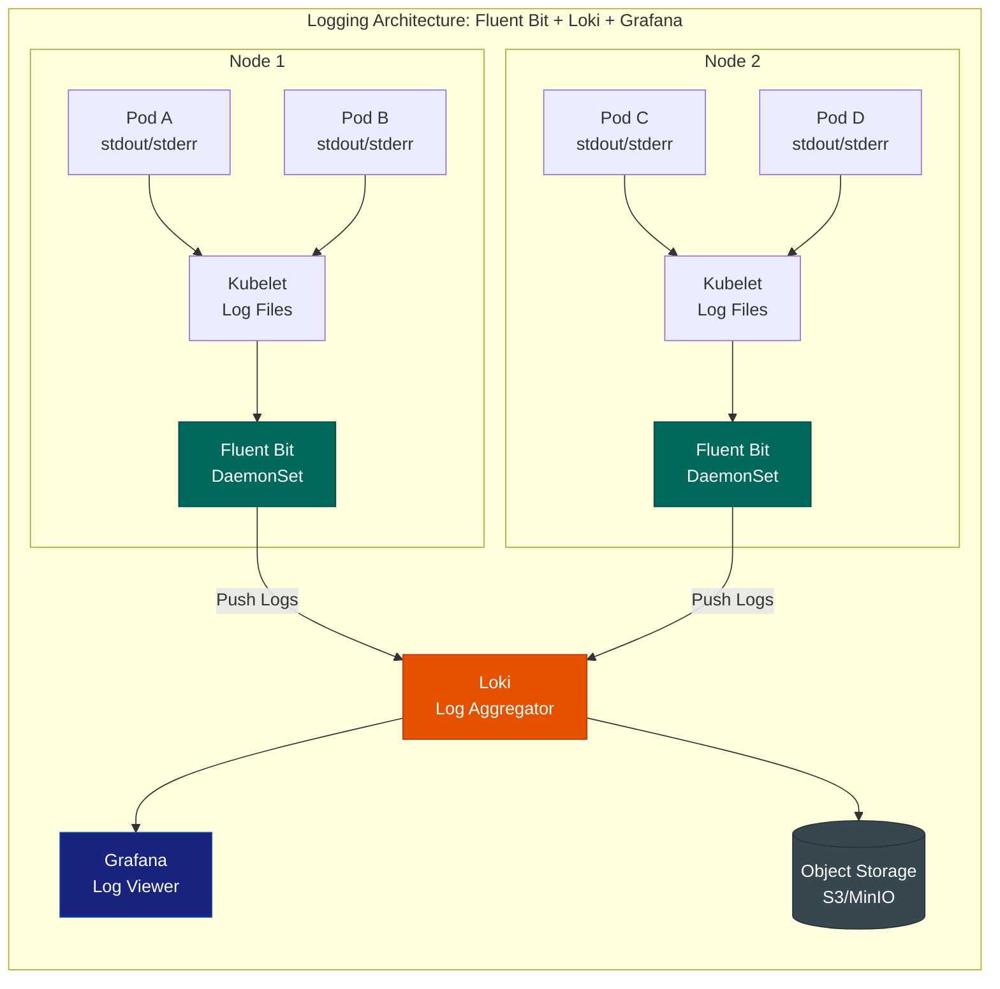
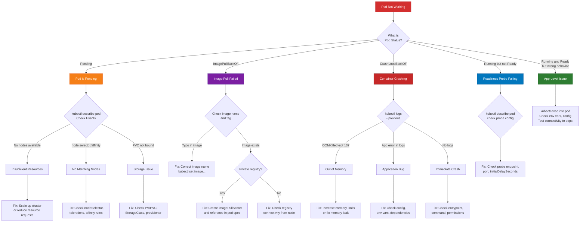

# File 33: Logging, Tracing & Debugging in Kubernetes

**Topic:** Centralized logging, distributed tracing, and systematic debugging of Kubernetes workloads

**WHY THIS MATTERS:** Metrics tell you something is wrong. Logs tell you what went wrong. Traces tell you where it went wrong across services. Together they form the "three pillars of observability." Without centralized logging, you're running `kubectl logs` across 200 pods manually. Without tracing, debugging a request that flows through 12 microservices is impossible.

---

## Story: The Detective Agency

Imagine a **Detective Agency** in Mumbai handling complex cases that span across the city.

- **Logging (Fluent Bit + Loki)** is the **FIR Filing System**. Every police station (pod) files an FIR (log entry) for every incident. Fluent Bit is the courier service that picks up FIRs from every station and delivers them to the central records office (Loki). Without centralized filing, detectives would have to visit every station individually to gather information — just like running `kubectl logs` on every pod.

- **Distributed Tracing (OpenTelemetry + Jaeger)** is the **Investigation Board with Red Strings**. You know the classic detective board — photos, documents, and red strings connecting them? When a customer complaint (request) comes in, it passes through multiple departments (services). Tracing puts a unique case number on the complaint and tracks it through every department. The red strings show which department called which, how long each took, and where the bottleneck is.

- **kubectl debug** is the detective **Going Undercover**. Sometimes you need to get inside a running system to understand what's happening. `kubectl debug` lets you attach a debug container to a running pod — like placing an undercover agent inside the operation without disrupting it.

- **Troubleshooting Patterns** are the detective's **Case Filing Templates**. Experienced detectives don't start from scratch — they recognize patterns. "Victim found near water? Check for drowning first." Similarly, "Pod in CrashLoopBackOff? Check logs, then check resource limits, then check health probes."

---

## Example Block 1 — Logging Architecture

### Section 1 — The Logging Pipeline

Kubernetes does not provide a native logging solution. Containers write to stdout/stderr, kubelet stores these as files on the node, and they're rotated/deleted automatically. For production, you need a logging pipeline.



**WHY:** Fluent Bit runs as a DaemonSet (one per node) so it can read log files from every pod on that node. Loki is the storage backend — unlike Elasticsearch, it only indexes metadata (labels) not full text, making it 10x cheaper. Grafana provides the query interface.

### Section 2 — Fluent Bit vs Fluentd

| Feature | Fluent Bit | Fluentd |
|---------|-----------|---------|
| Written in | C | Ruby + C |
| Memory footprint | ~450KB | ~40MB |
| Plugins | ~70 built-in | 1000+ community |
| Best for | Lightweight collection, forwarding | Complex processing, routing |
| Kubernetes role | Node-level collector (DaemonSet) | Aggregator (Deployment) |

```yaml
# WHY: Fluent Bit DaemonSet configuration for shipping logs to Loki
apiVersion: v1
kind: ConfigMap
metadata:
  name: fluent-bit-config
  namespace: logging
data:
  fluent-bit.conf: |
    [SERVICE]
        Flush         5            # WHY: Send logs every 5 seconds
        Log_Level     info
        Daemon        off
        Parsers_File  parsers.conf

    [INPUT]
        Name              tail                    # WHY: Tail log files like 'tail -f'
        Tag               kube.*
        Path              /var/log/containers/*.log  # WHY: Where kubelet stores container logs
        Parser            docker                  # WHY: Parse Docker JSON log format
        DB                /var/log/flb_kube.db    # WHY: Track file position across restarts
        Mem_Buf_Limit     5MB                     # WHY: Prevent OOM if Loki is slow
        Skip_Long_Lines   On
        Refresh_Interval  10

    [FILTER]
        Name                kubernetes             # WHY: Enrich logs with K8s metadata
        Match               kube.*
        Kube_URL            https://kubernetes.default.svc:443
        Kube_Tag_Prefix     kube.var.log.containers.
        Merge_Log           On                     # WHY: Parse JSON logs into fields
        Keep_Log            Off
        K8S-Logging.Parser  On
        K8S-Logging.Exclude On                     # WHY: Respect pod annotation to exclude logs

    [OUTPUT]
        Name        loki                          # WHY: Ship to Loki
        Match       *
        Host        loki.logging.svc.cluster.local
        Port        3100
        Labels      job=fluent-bit
        Auto_Kubernetes_Labels on                  # WHY: Use K8s labels as Loki labels
```

**WHY:** Fluent Bit's Kubernetes filter automatically enriches every log line with pod name, namespace, container name, and labels. This means you can query "show me all logs from namespace=production, app=payment-service" without any application changes.

### Section 3 — Loki and LogQL

```bash
# SYNTAX: Basic LogQL query — log stream selector
{namespace="default", app="my-api"}

# SYNTAX: Filter logs containing "error"
{namespace="default", app="my-api"} |= "error"

# SYNTAX: Filter logs NOT containing "health"
{namespace="default"} != "health"

# SYNTAX: Parse JSON logs and filter by field
{namespace="default", app="my-api"} | json | status >= 500

# SYNTAX: Count errors per minute (metric query)
count_over_time({namespace="default"} |= "error" [1m])

# SYNTAX: Top 5 pods by error count
topk(5, count_over_time({namespace="default"} |= "error" [1h]))

# SYNTAX: Rate of log lines per second
rate({namespace="default", app="my-api"}[5m])
# WHY: Sudden spike in log rate often indicates a problem

# SYNTAX: Extract and aggregate from structured logs
sum by (status) (
  count_over_time(
    {namespace="default", app="my-api"} | json | __error__="" [5m]
  )
)
```

**WHY:** LogQL follows a similar pattern to PromQL — stream selectors (like label matchers) followed by pipeline stages (filter, parse, format). If you know PromQL, LogQL feels familiar.

---

## Example Block 2 — Distributed Tracing

### Section 1 — Why Tracing Matters

In a monolith, a stack trace shows you the full call path. In microservices, a request crosses network boundaries — no single stack trace captures the full picture.

```yaml
# WHY: A single user request might flow through 6 services
# Without tracing, debugging "why was this request slow?" is impossible
#
# User -> API Gateway -> Auth Service -> User Service -> Order Service -> Payment Service -> Notification Service
#
# Tracing gives each request a unique Trace ID and records:
# - Which services were called (spans)
# - How long each service took
# - Parent-child relationships between spans
# - Error information from any service in the chain
```

### Section 2 — OpenTelemetry and Jaeger

```yaml
# WHY: OpenTelemetry Collector receives, processes, and exports telemetry data
# It acts as a vendor-neutral middleware between your apps and backends
apiVersion: v1
kind: ConfigMap
metadata:
  name: otel-collector-config
  namespace: tracing
data:
  config.yaml: |
    receivers:
      otlp:  # WHY: Receive traces via OpenTelemetry Protocol
        protocols:
          grpc:
            endpoint: 0.0.0.0:4317
          http:
            endpoint: 0.0.0.0:4318

    processors:
      batch:  # WHY: Batch traces for efficient export
        timeout: 5s
        send_batch_size: 1000
      memory_limiter:  # WHY: Prevent collector OOM
        check_interval: 1s
        limit_mib: 512

    exporters:
      jaeger:  # WHY: Export to Jaeger for storage and UI
        endpoint: jaeger-collector.tracing.svc:14250
        tls:
          insecure: true
      logging:  # WHY: Also log traces for debugging the collector itself
        loglevel: info

    service:
      pipelines:
        traces:
          receivers: [otlp]
          processors: [memory_limiter, batch]
          exporters: [jaeger, logging]
---
# WHY: Jaeger all-in-one for development/testing
# In production, use jaeger-operator with Elasticsearch/Cassandra backend
apiVersion: apps/v1
kind: Deployment
metadata:
  name: jaeger
  namespace: tracing
spec:
  replicas: 1
  selector:
    matchLabels:
      app: jaeger
  template:
    metadata:
      labels:
        app: jaeger
    spec:
      containers:
        - name: jaeger
          image: jaegertracing/all-in-one:1.54  # WHY: All-in-one for dev
          ports:
            - containerPort: 16686  # WHY: Jaeger UI
              name: ui
            - containerPort: 14250  # WHY: gRPC collector
              name: grpc
            - containerPort: 14268  # WHY: HTTP collector
              name: http
          env:
            - name: COLLECTOR_OTLP_ENABLED
              value: "true"  # WHY: Accept OTLP format directly
          resources:
            requests:
              cpu: 100m
              memory: 256Mi
            limits:
              cpu: 500m
              memory: 512Mi
```

```bash
# SYNTAX: Install Jaeger operator via Helm
helm repo add jaegertracing https://jaegertracing.github.io/helm-charts
helm install jaeger jaegertracing/jaeger \
  --namespace tracing \
  --create-namespace

# SYNTAX: Access Jaeger UI
kubectl port-forward svc/jaeger-query 16686:16686 -n tracing
# Visit http://localhost:16686

# EXPECTED OUTPUT: Jaeger UI showing services, traces, and span details
```

**WHY:** OpenTelemetry is the CNCF standard for instrumentation. It provides a single API/SDK for metrics, logs, and traces. Jaeger is the visualization and storage backend. This combination means you can switch backends without changing application code.

---

## Example Block 3 — kubectl Debugging Commands

### Section 1 — Essential Debugging Commands

```bash
# SYNTAX: View current logs of a pod
kubectl logs <pod-name> -n <namespace>

# FLAGS:
#   -f              — follow/stream logs in real time
#   --previous      — show logs from previous container instance (crashed container)
#   -c <container>  — specify container in multi-container pod
#   --since=1h      — only show logs from last hour
#   --tail=100      — only show last 100 lines
#   --timestamps    — add timestamps to each line

# EXAMPLE: View logs from a crashed container
kubectl logs my-app-7d9f8b6-x2k9p --previous -n default
# WHY: --previous is crucial for CrashLoopBackOff — the current container has no logs
# because it just crashed and restarted. --previous shows the LAST container's logs.

# EXPECTED OUTPUT:
# 2026-03-16T10:00:01Z Starting application...
# 2026-03-16T10:00:02Z Connected to database
# 2026-03-16T10:00:03Z FATAL: Out of memory - allocation failed
# 2026-03-16T10:00:03Z Process exited with code 137

# SYNTAX: Stream logs from all pods matching a label
kubectl logs -l app=my-api --all-containers -f -n default
# WHY: When you have 5 replicas, this streams logs from ALL of them

# SYNTAX: Execute a command inside a running container
kubectl exec -it <pod-name> -n <namespace> -- /bin/sh

# FLAGS:
#   -it             — interactive terminal
#   --              — separates kubectl args from container command
#   -c <container>  — specify container in multi-container pod

# EXAMPLE: Check network connectivity from inside a pod
kubectl exec -it my-app-7d9f8b6-x2k9p -- /bin/sh -c "wget -qO- http://other-service:8080/health"
# WHY: Tests service-to-service connectivity from the pod's network perspective

# SYNTAX: kubectl debug — attach ephemeral debug container
kubectl debug -it <pod-name> --image=busybox:1.36 --target=<container-name> -n <namespace>

# FLAGS:
#   --image=busybox  — image for debug container (use nicolaka/netshoot for network debugging)
#   --target=<name>  — share process namespace with this container (can see its processes)

# EXAMPLE: Debug a distroless container (no shell inside)
kubectl debug -it my-app-7d9f8b6-x2k9p --image=nicolaka/netshoot --target=app -n default
# WHY: Distroless containers have no shell, no curl, no tools. kubectl debug attaches
# a sidecar container with all the tools you need, sharing the pod's network namespace.

# EXPECTED OUTPUT:
# Targeting container "app". If you don't see processes from this container,
# set `shareProcessNamespace: true` in the pod spec.
# / # ps aux
# PID   USER     COMMAND
#   1   app      /usr/bin/my-app
#  42   root     /bin/sh

# SYNTAX: Create a copy of a pod for debugging
kubectl debug my-app-7d9f8b6-x2k9p -it --copy-to=debug-pod --container=debug --image=busybox -- sh
# WHY: Creates a copy of the pod spec with a debug container — doesn't affect production

# SYNTAX: Debug node issues
kubectl debug node/worker-node-1 -it --image=ubuntu
# WHY: Creates a pod on the specific node with host filesystem mounted at /host
# Useful for checking node-level issues (disk, network, kubelet)
```

**WHY:** `kubectl debug` was added in Kubernetes 1.25 as stable. Before it, debugging distroless containers (which have no shell) was nearly impossible without redeploying with a different image. It's now the recommended way to troubleshoot running pods.

### Section 2 — Describing Resources for Debugging

```bash
# SYNTAX: Get detailed information about a pod
kubectl describe pod <pod-name> -n <namespace>

# KEY SECTIONS TO CHECK:
# 1. Events (bottom) — shows scheduling, pulling, starting, killing events
# 2. Conditions — PodScheduled, Initialized, ContainersReady, Ready
# 3. State — Waiting (with reason), Running, Terminated (with exit code)
# 4. Last State — Previous container's termination info

# EXAMPLE OUTPUT (trimmed):
# Conditions:
#   Type              Status
#   Initialized       True
#   Ready             False      <-- Pod is NOT ready
#   ContainersReady   False
#   PodScheduled      True
#
# Containers:
#   app:
#     State:          Waiting
#       Reason:       CrashLoopBackOff
#     Last State:     Terminated
#       Reason:       OOMKilled       <-- Container was killed for using too much memory
#       Exit Code:    137             <-- 137 = 128 + 9 (SIGKILL)
#
# Events:
#   Type     Reason     Message
#   Normal   Scheduled  Successfully assigned default/my-app to worker-1
#   Normal   Pulled     Container image "my-app:v1" already present
#   Normal   Created    Created container app
#   Normal   Started    Started container app
#   Warning  BackOff    Back-off restarting failed container

# SYNTAX: Check events across the namespace
kubectl get events -n default --sort-by='.lastTimestamp'

# WHY: Events are the first place to look when something goes wrong.
# They show scheduling decisions, image pulls, container starts/stops, and errors.

# SYNTAX: Check resource quotas and limits
kubectl describe resourcequota -n default
kubectl describe limitrange -n default
# WHY: Pod might be Pending because namespace quota is exhausted
```

---

## Example Block 4 — Troubleshooting Decision Tree

### Section 1 — Systematic Debugging Approach



**WHY:** This decision tree is based on years of production Kubernetes experience. 90% of pod issues fall into one of these categories. Following this tree systematically saves hours of random debugging.

### Section 2 — Common Issues and Fixes

#### CrashLoopBackOff

```bash
# Step 1: Check previous logs
kubectl logs <pod> --previous -n <namespace>

# Step 2: Check exit code
kubectl describe pod <pod> -n <namespace> | grep -A5 "Last State"
# Exit 137 = OOMKilled (SIGKILL) — increase memory limits
# Exit 1   = Application error — check logs
# Exit 0   = Container exited normally — check restart policy or command

# Step 3: Check if it's a config issue
kubectl describe pod <pod> -n <namespace> | grep -A10 "Environment"
# Missing env vars or wrong config can cause immediate crash

# Step 4: For OOMKilled specifically
kubectl describe pod <pod> | grep -A3 "Limits"
# Compare with actual usage:
kubectl top pod <pod>
# Fix: increase limits in deployment spec
```

#### ImagePullBackOff

```bash
# Step 1: Check the exact error
kubectl describe pod <pod> -n <namespace> | grep -A5 "Events"
# "repository does not exist" = wrong image name
# "unauthorized" = need imagePullSecret
# "manifest unknown" = wrong tag

# Step 2: For private registries
kubectl create secret docker-registry regcred \
  --docker-server=<registry-url> \
  --docker-username=<user> \
  --docker-password=<password> \
  -n <namespace>

# Then add to pod spec:
# spec:
#   imagePullSecrets:
#     - name: regcred
```

#### Pending Pods

```bash
# Step 1: Check events
kubectl describe pod <pod> -n <namespace>
# "0/3 nodes are available: 3 Insufficient cpu" = need more resources
# "0/3 nodes are available: 3 node(s) had taints" = need tolerations

# Step 2: Check available resources
kubectl describe nodes | grep -A5 "Allocated resources"

# Step 3: Check PVC if using persistent volumes
kubectl get pvc -n <namespace>
# STATUS should be "Bound" — if "Pending", check StorageClass and provisioner
```

#### OOMKilled

```bash
# Step 1: Confirm OOMKill
kubectl describe pod <pod> | grep -i oom
# Or check:
kubectl get pod <pod> -o jsonpath='{.status.containerStatuses[0].lastState.terminated.reason}'
# EXPECTED OUTPUT: OOMKilled

# Step 2: Check current limits vs actual usage
kubectl describe pod <pod> | grep -A3 "Limits"
kubectl top pod <pod>

# Step 3: Fix — increase memory limit
kubectl patch deployment <deploy> -n <namespace> --type='json' \
  -p='[{"op": "replace", "path": "/spec/template/spec/containers/0/resources/limits/memory", "value": "512Mi"}]'
# WHY: Doubles memory limit. But also investigate WHY the app uses so much memory.
```

---

## Example Block 5 — Structured Logging Best Practices

### Section 1 — JSON Structured Logging

```yaml
# WHY: Structured (JSON) logs are parseable by machines
# Unstructured logs ("Something happened with user 123") are hard to query
#
# BAD (unstructured):
#   "User 123 placed order 456 for $99.99 but payment failed"
#
# GOOD (structured JSON):
#   {"level":"error","user_id":123,"order_id":456,"amount":99.99,"event":"payment_failed","error":"card_declined"}

# WHY: Example deployment with proper logging configuration
apiVersion: apps/v1
kind: Deployment
metadata:
  name: structured-logging-app
  namespace: default
spec:
  replicas: 2
  selector:
    matchLabels:
      app: structured-app
  template:
    metadata:
      labels:
        app: structured-app
      annotations:
        # WHY: Fluent Bit can read this annotation to apply specific parser
        fluentbit.io/parser: json
        # WHY: Exclude health check logs that create noise
        fluentbit.io/exclude: "false"
    spec:
      containers:
        - name: app
          image: my-app:v2.0
          env:
            - name: LOG_FORMAT
              value: "json"  # WHY: Tell app to output JSON logs
            - name: LOG_LEVEL
              value: "info"  # WHY: Don't log debug in production
            - name: NODE_NAME
              valueFrom:
                fieldRef:
                  fieldPath: spec.nodeName  # WHY: Include node in logs for debugging
            - name: POD_NAME
              valueFrom:
                fieldRef:
                  fieldPath: metadata.name  # WHY: Include pod name in logs
            - name: NAMESPACE
              valueFrom:
                fieldRef:
                  fieldPath: metadata.namespace
          resources:
            requests:
              cpu: 100m
              memory: 128Mi
            limits:
              cpu: 500m
              memory: 256Mi
```

### Section 2 — Log Aggregation with Loki Stack

```bash
# SYNTAX: Install Loki stack with Helm
helm repo add grafana https://grafana.github.io/helm-charts
helm repo update

helm install loki grafana/loki-stack \
  --namespace logging \
  --create-namespace \
  --set grafana.enabled=true \
  --set grafana.adminPassword=admin123 \
  --set loki.persistence.enabled=true \
  --set loki.persistence.size=10Gi

# FLAGS:
#   --set grafana.enabled=true     — deploy Grafana alongside Loki
#   --set loki.persistence...      — enable persistent storage for logs

# EXPECTED OUTPUT:
# NAME: loki
# LAST DEPLOYED: Mon Mar 16 10:30:00 2026
# NAMESPACE: logging
# STATUS: deployed

# SYNTAX: Verify installation
kubectl get pods -n logging

# EXPECTED OUTPUT:
# NAME                            READY   STATUS    RESTARTS   AGE
# loki-0                          1/1     Running   0          2m
# loki-promtail-xxxxx             1/1     Running   0          2m
# loki-grafana-xxxxx              1/1     Running   0          2m

# SYNTAX: Access Grafana
kubectl port-forward svc/loki-grafana 3000:80 -n logging
# Visit http://localhost:3000, login admin/admin123
# Go to Explore -> Select Loki data source -> Query logs
```

**WHY:** Loki + Promtail/Fluent Bit + Grafana is the lightweight alternative to the ELK stack (Elasticsearch, Logstash, Kibana). Loki only indexes labels, not full text, making it 10x cheaper to run. For most Kubernetes use cases, this is sufficient.

---

## Example Block 6 — OpenTelemetry Auto-Instrumentation

### Section 1 — Zero-Code Instrumentation with OTel Operator

```yaml
# WHY: OpenTelemetry Operator can auto-instrument apps without code changes
apiVersion: opentelemetry.io/v1alpha1
kind: Instrumentation
metadata:
  name: my-instrumentation
  namespace: default
spec:
  exporter:
    endpoint: http://otel-collector.tracing.svc:4317  # WHY: Where to send traces
  propagators:
    - tracecontext  # WHY: W3C Trace Context standard
    - baggage
  sampler:
    type: parentbased_traceidratio
    argument: "0.25"  # WHY: Sample 25% of traces — 100% is too expensive in production
  python:
    image: ghcr.io/open-telemetry/opentelemetry-operator/autoinstrumentation-python:latest
  nodejs:
    image: ghcr.io/open-telemetry/opentelemetry-operator/autoinstrumentation-nodejs:latest
  java:
    image: ghcr.io/open-telemetry/opentelemetry-operator/autoinstrumentation-java:latest
---
# WHY: Add annotation to auto-instrument a deployment
apiVersion: apps/v1
kind: Deployment
metadata:
  name: my-python-app
  namespace: default
spec:
  replicas: 2
  selector:
    matchLabels:
      app: my-python-app
  template:
    metadata:
      labels:
        app: my-python-app
      annotations:
        # WHY: This single annotation triggers auto-instrumentation
        # The OTel operator injects an init container that adds instrumentation
        instrumentation.opentelemetry.io/inject-python: "true"
    spec:
      containers:
        - name: app
          image: my-python-app:v1.0
          ports:
            - containerPort: 8080
          env:
            - name: OTEL_SERVICE_NAME
              value: "my-python-app"  # WHY: Service name shown in Jaeger
            - name: OTEL_RESOURCE_ATTRIBUTES
              value: "deployment.environment=production"  # WHY: Extra metadata
```

**WHY:** Auto-instrumentation means you get distributed tracing without changing a single line of application code. The OTel Operator injects an init container that modifies the runtime to capture HTTP calls, database queries, and external service calls automatically.

---

## Key Takeaways

1. **Three pillars of observability: Metrics, Logs, Traces** — Metrics tell you something is wrong (error rate spiked). Logs tell you what went wrong (null pointer exception). Traces tell you where it went wrong across services (payment service timed out calling bank API).

2. **Fluent Bit as DaemonSet is the standard pattern** — one Fluent Bit pod per node reads all container log files and ships them to a central backend. Its 450KB memory footprint makes it ideal for Kubernetes.

3. **Loki is the Prometheus of logging** — it indexes only labels (namespace, pod, app), not full text. This makes it 10x cheaper than Elasticsearch while being perfectly adequate for most use cases.

4. **LogQL follows the same patterns as PromQL** — stream selectors filter by labels, pipeline stages filter/parse content. `{namespace="prod"} |= "error" | json | status >= 500`.

5. **OpenTelemetry is the future of instrumentation** — a single vendor-neutral standard for metrics, logs, and traces. Instrument once with OTel, export to any backend (Jaeger, Datadog, New Relic).

6. **`kubectl logs --previous` is essential for CrashLoopBackOff** — the current container has no useful logs because it just crashed. `--previous` shows the last container's logs before it died.

7. **`kubectl debug` solves the distroless container problem** — distroless containers have no shell. `kubectl debug` attaches an ephemeral container with debugging tools, sharing the pod's network and process namespace.

8. **Follow the troubleshooting decision tree systematically** — Pending (check resources/scheduling), ImagePullBackOff (check image name/registry auth), CrashLoopBackOff (check logs/exit code), Running-not-Ready (check probes).

9. **Exit code 137 = OOMKilled (SIGKILL)** — the most common crash cause in Kubernetes. The container exceeded its memory limit. Fix by increasing limits OR fixing the memory leak.

10. **Structured JSON logging is non-negotiable in production** — unstructured logs are impossible to query at scale. JSON logs with consistent fields (level, user_id, request_id, error) enable powerful LogQL queries and dashboards.
