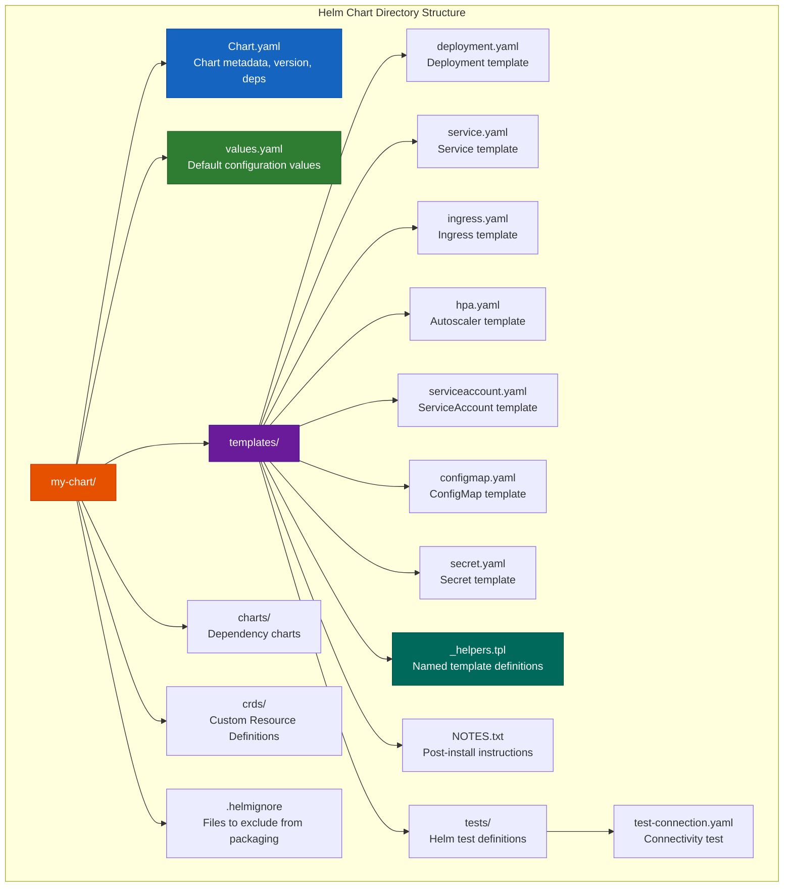
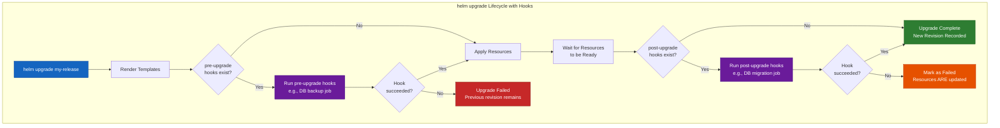

# File 35: Helm Charts Deep Dive

**Topic:** Helm chart structure, templating, lifecycle management, and chart distribution

**WHY THIS MATTERS:** Helm is the package manager for Kubernetes. Without it, deploying a complex application means managing dozens of YAML files manually, with no versioning, no rollback, and no parameterization. Helm solves all of this. Understanding Helm deeply — not just `helm install` but chart authoring, templating, and hooks — separates operators from engineers.

---

## Story: The Masala Dabba (Spice Box)

Every Indian kitchen has a **Masala Dabba** — a round stainless steel box with seven small containers inside, each holding a different spice. The genius of the dabba is standardization and customization:

- **A Helm Chart** is the **Masala Dabba** itself. It's a complete, self-contained package that has everything you need to cook (deploy) a specific dish (application). You can share it with anyone and they can make the same dish.

- **Templates** are the **recipe cards with blanks**. "Add ___ teaspoons of jeera, ___ teaspoons of haldi, cook for ___ minutes." The blanks are filled in when you actually cook. In Helm, templates are Kubernetes YAML files with `{{ .Values.xxx }}` placeholders.

- **values.yaml** is the **spice quantity list**. "jeera=2tsp, haldi=1tsp, mirchi=3". Different families (environments) use different quantities. Your grandmother's recipe card is the same, but your family uses more mirchi (production has more replicas).

- **Chart.yaml** is the **label on the dabba** — "Biryani Spice Mix v2.3, serves 4-6, by Ammi's Kitchen." It identifies the chart, its version, and its purpose.

- **Dependencies** are like **the raita recipe that comes with biryani**. Biryani is incomplete without raita. A web app chart might depend on a Redis chart. The dependency is declared, and Helm installs both.

- **_helpers.tpl** is the **family cookbook's "Common Preparations" section** — "this is how you prepare tadka for ANY dish." Named templates that are reused across multiple recipe cards (templates).

- **Hooks** are like **pre-cooking and post-cooking steps**. "Before cooking biryani, soak the rice for 30 minutes (pre-install hook). After cooking, garnish with fried onions (post-install hook)."

---

## Example Block 1 — Helm Chart Directory Structure

### Section 1 — The Standard Chart Layout



**WHY:** Every file has a purpose. `Chart.yaml` is mandatory. `values.yaml` provides defaults. Templates use Go templating to generate Kubernetes manifests. `_helpers.tpl` (prefixed with underscore) is special — Helm never renders it directly but uses it for shared template definitions.

### Section 2 — Chart.yaml

```yaml
# WHY: Chart.yaml is the identity card of your chart
apiVersion: v2  # WHY: v2 for Helm 3 charts (v1 was Helm 2)
name: my-web-app  # WHY: Chart name — used in helm install <release> <chart>
description: A Helm chart for deploying a web application with Redis cache
type: application  # WHY: "application" (deployable) vs "library" (reusable templates only)
version: 1.2.0  # WHY: Chart version — follows SemVer, bump on ANY chart change
appVersion: "3.5.1"  # WHY: Version of the application being deployed — informational only

# WHY: Keywords help users find your chart in Artifact Hub
keywords:
  - web
  - nodejs
  - redis

# WHY: Who maintains this chart
maintainers:
  - name: Platform Team
    email: platform@company.com

# WHY: Dependencies — other charts this chart needs
dependencies:
  - name: redis  # WHY: We need Redis as a cache backend
    version: "18.x.x"  # WHY: Accept any 18.x.x version
    repository: "https://charts.bitnami.com/bitnami"
    condition: redis.enabled  # WHY: Only install Redis if redis.enabled=true in values
  - name: postgresql
    version: "13.x.x"
    repository: "https://charts.bitnami.com/bitnami"
    condition: postgresql.enabled
    alias: db  # WHY: Reference as .Values.db instead of .Values.postgresql
```

```bash
# SYNTAX: Create a new chart scaffold
helm create my-web-app

# EXPECTED OUTPUT:
# Creating my-web-app

# SYNTAX: List chart contents
ls my-web-app/

# EXPECTED OUTPUT:
# Chart.yaml  charts/  templates/  values.yaml

# SYNTAX: Update chart dependencies (download dependency charts)
helm dependency update my-web-app/

# FLAGS:
#   (no flags needed — reads Chart.yaml dependencies)

# EXPECTED OUTPUT:
# Hang tight while we grab the latest from your chart repositories...
# ...Successfully got an update from the "bitnami" chart repository
# Saving 2 charts
# Downloading redis from repo https://charts.bitnami.com/bitnami
# Downloading postgresql from repo https://charts.bitnami.com/bitnami
# Deleting outdated charts

# SYNTAX: Verify downloaded dependencies
ls my-web-app/charts/

# EXPECTED OUTPUT:
# postgresql-13.2.1.tgz  redis-18.4.0.tgz
```

**WHY:** The `version` field is the chart's version and must be bumped on every change. `appVersion` is the app being deployed — they are independent. You might release chart version 1.3.0 that still deploys app version 3.5.1 (if you only changed chart templates).

---

## Example Block 2 — Templating: Values, Objects, and Flow Control

### Section 1 — Built-in Objects

Helm provides several built-in objects available in templates:

| Object | Description | Example |
|--------|-------------|---------|
| `.Values` | Values from values.yaml and --set | `{{ .Values.replicaCount }}` |
| `.Release` | Release metadata | `{{ .Release.Name }}`, `{{ .Release.Namespace }}` |
| `.Chart` | Chart.yaml contents | `{{ .Chart.Name }}`, `{{ .Chart.Version }}` |
| `.Template` | Current template info | `{{ .Template.Name }}` |
| `.Capabilities` | Cluster capabilities | `{{ .Capabilities.KubeVersion }}` |
| `.Files` | Access non-template files | `{{ .Files.Get "config.ini" }}` |

### Section 2 — values.yaml and Template Usage

```yaml
# WHY: values.yaml provides sensible defaults that users can override
# This is the "spice quantity list" — the defaults work, but you can customize

replicaCount: 2  # WHY: Default 2 replicas, override for prod with --set replicaCount=5

image:
  repository: my-company/web-app  # WHY: Container image location
  tag: ""  # WHY: Empty means use Chart.appVersion — single source of truth
  pullPolicy: IfNotPresent  # WHY: Don't re-pull if image exists on node

service:
  type: ClusterIP  # WHY: Internal by default, override to LoadBalancer for public
  port: 80

ingress:
  enabled: false  # WHY: Not everyone needs ingress — opt-in
  className: nginx
  annotations: {}
  hosts:
    - host: app.example.com
      paths:
        - path: /
          pathType: Prefix
  tls: []

resources:
  requests:
    cpu: 100m
    memory: 128Mi
  limits:
    cpu: 500m
    memory: 256Mi

autoscaling:
  enabled: false  # WHY: Disabled by default, enable for production
  minReplicas: 2
  maxReplicas: 10
  targetCPUUtilizationPercentage: 80

env:
  LOG_LEVEL: info
  DB_HOST: localhost
  DB_PORT: "5432"

# WHY: Dependency values — passed to the redis sub-chart
redis:
  enabled: true  # WHY: Controls whether Redis dependency is installed
  architecture: standalone
  auth:
    enabled: false
```

```yaml
# WHY: templates/deployment.yaml — the core template
# Every {{ }} block is replaced with actual values when helm install runs
apiVersion: apps/v1
kind: Deployment
metadata:
  name: {{ include "my-web-app.fullname" . }}  # WHY: Named template for consistent naming
  labels:
    {{- include "my-web-app.labels" . | nindent 4 }}  # WHY: Standard labels from _helpers.tpl
spec:
  {{- if not .Values.autoscaling.enabled }}
  replicas: {{ .Values.replicaCount }}  # WHY: Only set replicas if HPA is NOT managing them
  {{- end }}
  selector:
    matchLabels:
      {{- include "my-web-app.selectorLabels" . | nindent 6 }}
  template:
    metadata:
      labels:
        {{- include "my-web-app.selectorLabels" . | nindent 8 }}
      annotations:
        # WHY: Force rolling update when ConfigMap changes
        checksum/config: {{ include (print $.Template.BasePath "/configmap.yaml") . | sha256sum }}
    spec:
      serviceAccountName: {{ include "my-web-app.serviceAccountName" . }}
      containers:
        - name: {{ .Chart.Name }}
          image: "{{ .Values.image.repository }}:{{ .Values.image.tag | default .Chart.AppVersion }}"
          # WHY: If tag is empty, use appVersion from Chart.yaml
          imagePullPolicy: {{ .Values.image.pullPolicy }}
          ports:
            - name: http
              containerPort: 80
              protocol: TCP
          {{- with .Values.resources }}
          resources:
            {{- toYaml . | nindent 12 }}  # WHY: toYaml converts the map to YAML format
          {{- end }}
          env:
            {{- range $key, $value := .Values.env }}
            - name: {{ $key }}
              value: {{ $value | quote }}  # WHY: quote ensures values are strings
            {{- end }}
            - name: REDIS_HOST
              {{- if .Values.redis.enabled }}
              value: "{{ include "my-web-app.fullname" . }}-redis-master"
              {{- else }}
              value: "localhost"
              {{- end }}
          livenessProbe:
            httpGet:
              path: /healthz
              port: http
            initialDelaySeconds: 10
            periodSeconds: 15
          readinessProbe:
            httpGet:
              path: /ready
              port: http
            initialDelaySeconds: 5
            periodSeconds: 10
```

**WHY:** Templates separate structure (what resources to create) from configuration (how many replicas, what image). The same chart deploys to dev, staging, and production with different values files: `helm install -f values-prod.yaml`.

### Section 3 — Flow Control: if, range, with

```yaml
# WHY: templates/ingress.yaml — demonstrates conditional rendering
{{- if .Values.ingress.enabled -}}
# WHY: This entire resource is only created if ingress.enabled=true
apiVersion: networking.k8s.io/v1
kind: Ingress
metadata:
  name: {{ include "my-web-app.fullname" . }}
  labels:
    {{- include "my-web-app.labels" . | nindent 4 }}
  {{- with .Values.ingress.annotations }}
  annotations:
    # WHY: "with" changes scope — inside this block, "." refers to .Values.ingress.annotations
    {{- toYaml . | nindent 4 }}
  {{- end }}
spec:
  {{- if .Values.ingress.className }}
  ingressClassName: {{ .Values.ingress.className }}
  {{- end }}
  {{- if .Values.ingress.tls }}
  tls:
    # WHY: "range" iterates over a list — like a for loop
    {{- range .Values.ingress.tls }}
    - hosts:
        {{- range .hosts }}
        - {{ . | quote }}
        {{- end }}
      secretName: {{ .secretName }}
    {{- end }}
  {{- end }}
  rules:
    {{- range .Values.ingress.hosts }}
    - host: {{ .host | quote }}
      http:
        paths:
          {{- range .paths }}
          - path: {{ .path }}
            pathType: {{ .pathType }}
            backend:
              service:
                name: {{ include "my-web-app.fullname" $ }}
                # WHY: $ refers to the root scope — needed inside range blocks
                # where "." has been rebound to the current iteration item
                port:
                  number: {{ $.Values.service.port }}
          {{- end }}
    {{- end }}
{{- end }}
```

```yaml
# WHY: templates/hpa.yaml — demonstrates conditional resource creation
{{- if .Values.autoscaling.enabled }}
apiVersion: autoscaling/v2
kind: HorizontalPodAutoscaler
metadata:
  name: {{ include "my-web-app.fullname" . }}
  labels:
    {{- include "my-web-app.labels" . | nindent 4 }}
spec:
  scaleTargetRef:
    apiVersion: apps/v1
    kind: Deployment
    name: {{ include "my-web-app.fullname" . }}
  minReplicas: {{ .Values.autoscaling.minReplicas }}
  maxReplicas: {{ .Values.autoscaling.maxReplicas }}
  metrics:
    - type: Resource
      resource:
        name: cpu
        target:
          type: Utilization
          averageUtilization: {{ .Values.autoscaling.targetCPUUtilizationPercentage }}
{{- end }}
```

**WHY:** `if` makes resources conditional (don't create HPA if autoscaling is disabled). `range` iterates over lists (multiple ingress hosts). `with` changes the scope to reduce repetition. `$` always refers to root scope — essential inside `range` blocks.

---

## Example Block 3 — Named Templates (_helpers.tpl) and Sprig Functions

### Section 1 — _helpers.tpl

```yaml
# WHY: _helpers.tpl defines named templates (partials) reused across all templates
# The underscore prefix tells Helm not to render this file as a Kubernetes manifest

{{/*
WHY: Generate a full name for resources. Truncate at 63 chars because K8s label values
have a 63-character limit. If release name already contains chart name, don't repeat it.
*/}}
{{- define "my-web-app.fullname" -}}
{{- if .Values.fullnameOverride }}
{{- .Values.fullnameOverride | trunc 63 | trimSuffix "-" }}
{{- else }}
{{- $name := default .Chart.Name .Values.nameOverride }}
{{- if contains $name .Release.Name }}
{{- .Release.Name | trunc 63 | trimSuffix "-" }}
{{- else }}
{{- printf "%s-%s" .Release.Name $name | trunc 63 | trimSuffix "-" }}
{{- end }}
{{- end }}
{{- end }}

{{/*
WHY: Standard labels applied to ALL resources for consistency and selection
These follow Kubernetes recommended labels (app.kubernetes.io/*)
*/}}
{{- define "my-web-app.labels" -}}
helm.sh/chart: {{ include "my-web-app.chart" . }}
{{ include "my-web-app.selectorLabels" . }}
{{- if .Chart.AppVersion }}
app.kubernetes.io/version: {{ .Chart.AppVersion | quote }}
{{- end }}
app.kubernetes.io/managed-by: {{ .Release.Service }}
{{- end }}

{{/*
WHY: Selector labels must be immutable and used in both Deployment.spec.selector
and Pod.metadata.labels. They CANNOT change between upgrades.
*/}}
{{- define "my-web-app.selectorLabels" -}}
app.kubernetes.io/name: {{ include "my-web-app.name" . }}
app.kubernetes.io/instance: {{ .Release.Name }}
{{- end }}

{{/*
WHY: Chart label includes chart name and version for tracking which chart version deployed
*/}}
{{- define "my-web-app.chart" -}}
{{- printf "%s-%s" .Chart.Name .Chart.Version | replace "+" "_" | trunc 63 | trimSuffix "-" }}
{{- end }}

{{/*
WHY: ServiceAccount name — use override if provided, otherwise generate from fullname
*/}}
{{- define "my-web-app.serviceAccountName" -}}
{{- if .Values.serviceAccount.create }}
{{- default (include "my-web-app.fullname" .) .Values.serviceAccount.name }}
{{- else }}
{{- default "default" .Values.serviceAccount.name }}
{{- end }}
{{- end }}
```

**WHY:** Named templates prevent copy-paste. The fullname template is used in every resource's `metadata.name`. If you change the naming logic, you change it in one place. The `trunc 63` is critical — Kubernetes label values cannot exceed 63 characters.

### Section 2 — Useful Sprig Functions

```yaml
# WHY: Sprig is the function library available in Helm templates
# These are the most commonly used functions

# String functions
{{ .Values.env.DB_HOST | upper }}          # WHY: Convert to uppercase -> "LOCALHOST"
{{ .Values.env.DB_HOST | quote }}          # WHY: Wrap in quotes -> "localhost"
{{ .Values.image.tag | default "latest" }} # WHY: Fallback if value is empty
{{ "hello world" | title }}                # WHY: Title case -> "Hello World"
{{ "my-app" | replace "-" "_" }}           # WHY: Replace chars -> "my_app"
{{ "longname" | trunc 5 }}                 # WHY: Truncate -> "longn"

# List functions
{{ list "a" "b" "c" | join "," }}          # WHY: Join list -> "a,b,c"
{{ .Values.hosts | first }}                # WHY: First element of list
{{ .Values.hosts | has "example.com" }}    # WHY: Check if list contains value

# Type conversion
{{ .Values.port | int }}                   # WHY: Ensure value is integer
{{ .Values.flag | toString }}              # WHY: Convert to string
{{ .Values.config | toYaml }}              # WHY: Convert map to YAML string
{{ .Values.data | toJson }}                # WHY: Convert to JSON string
{{ .Values.data | b64enc }}                # WHY: Base64 encode (for Secrets)

# Date and crypto
{{ now | date "2006-01-02" }}              # WHY: Current date in Go format
{{ randAlphaNum 16 }}                      # WHY: Generate random 16-char string
{{ .Values.password | sha256sum }}         # WHY: SHA256 hash

# Flow
{{ ternary "yes" "no" .Values.enabled }}   # WHY: Ternary operator (if/else in one line)
{{ empty .Values.tag | ternary .Chart.AppVersion .Values.tag }}  # WHY: Use appVersion if tag empty
```

---

## Example Block 4 — Helm Lifecycle: install, upgrade, rollback

### Section 1 — Core Helm Commands

```bash
# SYNTAX: Install a release
helm install my-release ./my-web-app \
  --namespace production \
  --create-namespace \
  -f values-prod.yaml \
  --set image.tag=v3.5.1

# FLAGS:
#   my-release              — release name (unique within namespace)
#   ./my-web-app            — chart path (local directory)
#   --namespace production  — target namespace
#   --create-namespace      — create namespace if it doesn't exist
#   -f values-prod.yaml     — values file (overrides values.yaml)
#   --set image.tag=v3.5.1  — individual value override (highest priority)

# EXPECTED OUTPUT:
# NAME: my-release
# LAST DEPLOYED: Mon Mar 16 12:00:00 2026
# NAMESPACE: production
# STATUS: deployed
# REVISION: 1

# SYNTAX: Preview what will be installed (dry run)
helm install my-release ./my-web-app --dry-run --debug

# WHY: --dry-run renders templates and shows the output without applying
# --debug shows additional info like computed values

# SYNTAX: Render templates locally (no cluster needed)
helm template my-release ./my-web-app -f values-prod.yaml

# WHY: Pure template rendering — great for CI/CD pipelines and debugging
# Shows exactly what YAML would be applied to the cluster

# SYNTAX: Upgrade an existing release
helm upgrade my-release ./my-web-app \
  --namespace production \
  -f values-prod.yaml \
  --set image.tag=v3.6.0

# FLAGS:
#   (same as install, but updates existing release)

# EXPECTED OUTPUT:
# Release "my-release" has been upgraded. Happy Helming!
# NAME: my-release
# LAST DEPLOYED: Mon Mar 16 14:00:00 2026
# NAMESPACE: production
# STATUS: deployed
# REVISION: 2

# SYNTAX: Install or upgrade (idempotent — safe for CI/CD)
helm upgrade --install my-release ./my-web-app \
  --namespace production \
  --create-namespace \
  -f values-prod.yaml

# WHY: --install flag makes it install if release doesn't exist, upgrade if it does
# This is the recommended approach for CI/CD pipelines

# SYNTAX: Rollback to a previous revision
helm rollback my-release 1 --namespace production

# FLAGS:
#   1                       — revision number to rollback to

# EXPECTED OUTPUT:
# Rollback was a success! Happy Helming!

# SYNTAX: View release history
helm history my-release --namespace production

# EXPECTED OUTPUT:
# REVISION  UPDATED                   STATUS      CHART            APP VERSION  DESCRIPTION
# 1         Mon Mar 16 12:00:00 2026  superseded  my-web-app-1.2.0 3.5.1       Install complete
# 2         Mon Mar 16 14:00:00 2026  superseded  my-web-app-1.2.0 3.6.0       Upgrade complete
# 3         Mon Mar 16 14:30:00 2026  deployed    my-web-app-1.2.0 3.5.1       Rollback to 1

# SYNTAX: List all releases
helm list --all-namespaces

# EXPECTED OUTPUT:
# NAME        NAMESPACE   REVISION  UPDATED                   STATUS    CHART             APP VERSION
# my-release  production  3         Mon Mar 16 14:30:00 2026  deployed  my-web-app-1.2.0  3.5.1

# SYNTAX: Uninstall a release
helm uninstall my-release --namespace production

# EXPECTED OUTPUT:
# release "my-release" uninstalled

# SYNTAX: Get values used by a release
helm get values my-release --namespace production

# WHY: Shows the values that were used for the current revision — useful for debugging
# "Why does production have 3 replicas? Let me check what values were passed."

# SYNTAX: Get all rendered manifests of a release
helm get manifest my-release --namespace production

# WHY: Shows the actual YAML that was applied to the cluster
```

**WHY:** `helm upgrade --install` is the gold standard for CI/CD. It's idempotent — run it 100 times, same result. Rollback works because Helm stores every revision's complete state. You can always go back.

### Section 2 — Helm Hooks



```yaml
# WHY: Pre-upgrade hook — run database backup before upgrading the app
apiVersion: batch/v1
kind: Job
metadata:
  name: {{ include "my-web-app.fullname" . }}-db-backup
  labels:
    {{- include "my-web-app.labels" . | nindent 4 }}
  annotations:
    "helm.sh/hook": pre-upgrade  # WHY: Run BEFORE the upgrade applies new resources
    "helm.sh/hook-weight": "-5"  # WHY: Lower weight runs first (if multiple hooks)
    "helm.sh/hook-delete-policy": before-hook-creation  # WHY: Delete old hook job before creating new one
    # Options: before-hook-creation, hook-succeeded, hook-failed
spec:
  template:
    spec:
      restartPolicy: Never
      containers:
        - name: db-backup
          image: postgres:16
          command: ["pg_dump", "-h", "$(DB_HOST)", "-U", "$(DB_USER)", "-d", "$(DB_NAME)", "-f", "/backup/dump.sql"]
          envFrom:
            - secretRef:
                name: db-credentials
  backoffLimit: 1  # WHY: Only retry once — if backup fails, don't proceed with upgrade
---
# WHY: Post-upgrade hook — run database migration after deploying new code
apiVersion: batch/v1
kind: Job
metadata:
  name: {{ include "my-web-app.fullname" . }}-db-migrate
  annotations:
    "helm.sh/hook": post-upgrade,post-install  # WHY: Run after both install and upgrade
    "helm.sh/hook-weight": "0"
    "helm.sh/hook-delete-policy": hook-succeeded
spec:
  template:
    spec:
      restartPolicy: Never
      containers:
        - name: migrate
          image: "{{ .Values.image.repository }}:{{ .Values.image.tag | default .Chart.AppVersion }}"
          command: ["./migrate", "up"]
          envFrom:
            - secretRef:
                name: db-credentials
  backoffLimit: 2
```

**WHY:** Hooks solve the "chicken and egg" problem. You need to run database migrations AFTER new code is deployed but BEFORE traffic is sent to it. Without hooks, you'd need external orchestration (CI/CD scripts) to coordinate these steps.

---

## Example Block 5 — Chart Testing and OCI Registry

### Section 1 — Testing Charts

```yaml
# WHY: templates/tests/test-connection.yaml — Helm test to verify deployment works
apiVersion: v1
kind: Pod
metadata:
  name: {{ include "my-web-app.fullname" . }}-test-connection
  labels:
    {{- include "my-web-app.labels" . | nindent 4 }}
  annotations:
    "helm.sh/hook": test  # WHY: Only runs when you execute 'helm test'
    "helm.sh/hook-delete-policy": before-hook-creation
spec:
  restartPolicy: Never
  containers:
    - name: wget
      image: busybox:1.36
      command: ['wget']
      args: ['{{ include "my-web-app.fullname" . }}:{{ .Values.service.port }}']
      # WHY: Tries to connect to the service — if it succeeds, the test passes
```

```bash
# SYNTAX: Run chart tests
helm test my-release --namespace production

# EXPECTED OUTPUT:
# NAME: my-release
# LAST DEPLOYED: Mon Mar 16 12:00:00 2026
# NAMESPACE: production
# STATUS: deployed
# REVISION: 1
# TEST SUITE:     my-release-my-web-app-test-connection
# Last Started:   Mon Mar 16 12:05:00 2026
# Last Completed: Mon Mar 16 12:05:05 2026
# Phase:          Succeeded

# SYNTAX: Lint chart for errors
helm lint ./my-web-app

# EXPECTED OUTPUT:
# ==> Linting ./my-web-app
# [INFO] Chart.yaml: icon is recommended
# 1 chart(s) linted, 0 chart(s) failed

# SYNTAX: Validate template rendering
helm template my-release ./my-web-app --validate

# WHY: --validate also checks the rendered YAML against the Kubernetes API schema
# Catches issues like wrong apiVersion or invalid field names
```

### Section 2 — OCI Registry for Charts

```bash
# WHY: Helm 3.8+ supports OCI registries natively — store charts alongside images
# No need for a separate chart repository (like ChartMuseum)

# SYNTAX: Package a chart
helm package ./my-web-app

# EXPECTED OUTPUT:
# Successfully packaged chart and saved it to: /path/to/my-web-app-1.2.0.tgz

# SYNTAX: Push chart to OCI registry
helm push my-web-app-1.2.0.tgz oci://ghcr.io/my-org/charts

# FLAGS:
#   oci://...  — OCI registry URL (GitHub Container Registry, Docker Hub, ECR, etc.)

# EXPECTED OUTPUT:
# Pushed: ghcr.io/my-org/charts/my-web-app:1.2.0
# Digest: sha256:abc123...

# SYNTAX: Install from OCI registry
helm install my-release oci://ghcr.io/my-org/charts/my-web-app --version 1.2.0

# SYNTAX: Pull chart from OCI registry
helm pull oci://ghcr.io/my-org/charts/my-web-app --version 1.2.0

# EXPECTED OUTPUT:
# Pulled: ghcr.io/my-org/charts/my-web-app:1.2.0
# Digest: sha256:abc123...

# SYNTAX: Login to OCI registry
helm registry login ghcr.io -u <username> -p <token>

# WHY: Authentication required for private registries
```

**WHY:** OCI registries are the future of chart distribution. You can use the same registry (Docker Hub, ECR, GHCR) for both container images and Helm charts. No need to run a separate ChartMuseum server.

---

## Key Takeaways

1. **A Helm chart is a package** containing templates, default values, and metadata. It encapsulates everything needed to deploy an application to Kubernetes, just like a masala dabba contains everything needed for a specific dish.

2. **`values.yaml` provides defaults, `-f` overrides them, `--set` overrides everything** — the precedence is: defaults < parent chart values < subchart values < `-f values-file` < `--set` flags. This layering enables per-environment configuration.

3. **Templates use Go templating with `{{ }}`** — `.Values` accesses user configuration, `.Release` gives release metadata, `.Chart` gives chart metadata. Dollar sign `$` always refers to the root scope.

4. **`_helpers.tpl` contains named templates** — prefixed with underscore so Helm doesn't render it as a manifest. Use `{{ include "name" . }}` to call them. They prevent copy-paste and enforce consistency.

5. **Flow control: `if` for conditionals, `range` for loops, `with` for scoping** — `if .Values.ingress.enabled` makes resources optional. `range` iterates lists. `with` changes the dot scope to reduce verbosity.

6. **`helm upgrade --install` is idempotent** — the gold standard for CI/CD pipelines. It installs if the release doesn't exist, upgrades if it does. Safe to run repeatedly.

7. **Helm stores revision history for rollback** — every `helm upgrade` creates a new revision. `helm rollback my-release 1` restores the exact state of revision 1. This is more reliable than `kubectl rollout undo` because it includes ALL resources, not just Deployments.

8. **Hooks run Jobs at specific lifecycle points** — `pre-install`, `post-install`, `pre-upgrade`, `post-upgrade`, `pre-delete`, `post-delete`. Use them for database migrations, backups, and cleanup tasks.

9. **`helm template` renders locally without a cluster** — perfect for CI/CD validation, code review, and debugging. Pipe it to `kubectl apply --dry-run=server` for full server-side validation.

10. **OCI registries are the future of chart distribution** — Helm 3.8+ supports storing charts in the same registries as container images (ECR, GHCR, Docker Hub). No separate chart server needed.
