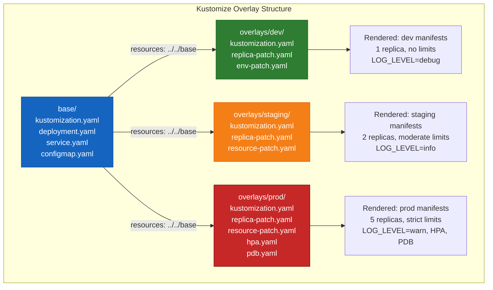
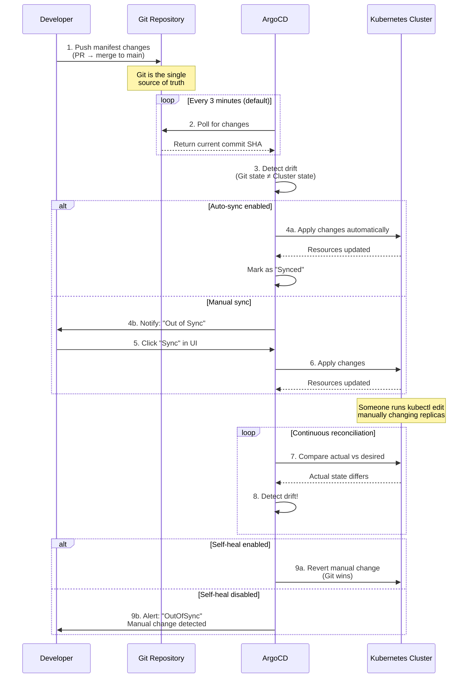

# File 36: Kustomize & GitOps with ArgoCD

**Topic:** Kustomize overlays for environment-specific configuration and GitOps continuous delivery with ArgoCD and FluxCD

**WHY THIS MATTERS:** Helm uses templating to parameterize manifests. Kustomize takes a different approach — it patches plain YAML without templates. Both are valid; many teams use both. GitOps takes this further by making Git the single source of truth for cluster state. ArgoCD watches your Git repo and automatically syncs changes to the cluster, eliminating `kubectl apply` from your workflow entirely.

---

## Story: The Tailoring Shop

Imagine a **Tailoring Shop** in Lucknow that makes kurtas for different occasions.

- **Kustomize Base** is the **base kurta pattern**. It defines the standard cut, stitching, and measurements. Every kurta starts from this pattern — consistent quality, proven design.

- **Overlays** are the **alterations for different occasions**:
  - **Dev overlay** = plain cotton kurta for daily wear. Simple fabric, no embellishments, regular buttons. (1 replica, no resource limits, debug logging)
  - **Staging overlay** = slightly nicer kurta for family gatherings. Better fabric, some embroidery. (2 replicas, moderate limits, info logging)
  - **Prod overlay** = heavily embroidered silk kurta for a wedding. Premium fabric, zari work, custom buttons. (5 replicas, strict limits, warn logging, HPA enabled)

  The alterations don't rewrite the entire pattern — they just describe what's different. "Take the base pattern, use silk instead of cotton, add zari border." This is **strategic merge patching**.

- **ArgoCD** is the **automatic delivery system**. Instead of going to the tailor and saying "make this kurta," you write your order in a notebook (Git). The tailor's assistant (ArgoCD) constantly checks the notebook. When a new order appears, the assistant automatically starts making the kurta. If someone modifies a delivered kurta (manual `kubectl` change), the assistant notices the difference and either alerts you or fixes it automatically.

- **GitOps** is the **philosophy** — "the notebook is always right." The notebook (Git repo) is the single source of truth. The actual kurtas (cluster state) must always match the notebook. If they don't, the notebook wins.

---

## Example Block 1 — Kustomize Fundamentals

### Section 1 — Understanding Kustomize

Kustomize is built into kubectl since v1.14. It works by:
1. Starting with a **base** — plain Kubernetes YAML files
2. Applying **overlays** — patches that modify the base for specific environments
3. No templates, no `{{ }}` — pure YAML patching



**WHY:** Kustomize's advantage over Helm is simplicity — no template language to learn, no `{{ }}` syntax, just plain YAML. You can read the base files and understand exactly what resources exist. Overlays only describe what's different.

### Section 2 — Base Configuration

```yaml
# WHY: base/kustomization.yaml — declares which resources belong to this base
apiVersion: kustomize.config.k8s.io/v1beta1
kind: Kustomization

# WHY: Common labels applied to ALL resources and their selectors
commonLabels:
  app: my-web-app
  team: platform

# WHY: List of resource files in this base
resources:
  - deployment.yaml
  - service.yaml
  - configmap.yaml
```

```yaml
# WHY: base/deployment.yaml — the standard deployment, no environment-specific values
apiVersion: apps/v1
kind: Deployment
metadata:
  name: my-web-app
spec:
  replicas: 1  # WHY: Default 1 replica — overlays will change this
  selector:
    matchLabels:
      app: my-web-app
  template:
    metadata:
      labels:
        app: my-web-app
    spec:
      containers:
        - name: app
          image: my-company/web-app:latest  # WHY: Overlay will set specific tag
          ports:
            - containerPort: 8080
          envFrom:
            - configMapRef:
                name: my-web-app-config
          resources:
            requests:
              cpu: 100m
              memory: 128Mi
            limits:
              cpu: 200m
              memory: 256Mi
```

```yaml
# WHY: base/service.yaml
apiVersion: v1
kind: Service
metadata:
  name: my-web-app
spec:
  selector:
    app: my-web-app
  ports:
    - port: 80
      targetPort: 8080
```

```yaml
# WHY: base/configmap.yaml — default configuration values
apiVersion: v1
kind: ConfigMap
metadata:
  name: my-web-app-config
data:
  LOG_LEVEL: "info"
  CACHE_TTL: "300"
  FEATURE_FLAGS: "basic"
```

### Section 3 — Overlay for Dev Environment

```yaml
# WHY: overlays/dev/kustomization.yaml — customizations for dev environment
apiVersion: kustomize.config.k8s.io/v1beta1
kind: Kustomization

# WHY: Reference the base — all base resources are included
resources:
  - ../../base

# WHY: Set namespace for all resources — no need to edit each file
namespace: dev

# WHY: Add a name prefix to avoid collisions with other environments
namePrefix: dev-

# WHY: Add labels specific to dev
commonLabels:
  environment: dev

# WHY: Override the image tag without editing the base deployment
images:
  - name: my-company/web-app
    newTag: dev-latest  # WHY: Dev uses the latest dev build

# WHY: Patch the deployment to change dev-specific settings
patches:
  - path: replica-patch.yaml
  - path: env-patch.yaml
```

```yaml
# WHY: overlays/dev/replica-patch.yaml — strategic merge patch
# Only fields specified here are changed; everything else stays the same
apiVersion: apps/v1
kind: Deployment
metadata:
  name: my-web-app  # WHY: Must match the resource name in base
spec:
  replicas: 1  # WHY: Dev needs only 1 replica to save resources
```

```yaml
# WHY: overlays/dev/env-patch.yaml — change environment variables for dev
apiVersion: v1
kind: ConfigMap
metadata:
  name: my-web-app-config
data:
  LOG_LEVEL: "debug"  # WHY: Debug logging in dev for troubleshooting
  CACHE_TTL: "10"  # WHY: Short cache TTL in dev so changes are visible fast
  FEATURE_FLAGS: "basic,experimental"  # WHY: Enable experimental features in dev
```

### Section 4 — Overlay for Prod Environment

```yaml
# WHY: overlays/prod/kustomization.yaml
apiVersion: kustomize.config.k8s.io/v1beta1
kind: Kustomization

resources:
  - ../../base
  - hpa.yaml  # WHY: HPA only exists in prod, not in base
  - pdb.yaml  # WHY: PodDisruptionBudget only in prod

namespace: production

namePrefix: prod-

commonLabels:
  environment: production

images:
  - name: my-company/web-app
    newTag: v3.5.1  # WHY: Prod uses a specific, tested version — never "latest"

patches:
  - path: replica-patch.yaml
  - path: resource-patch.yaml
```

```yaml
# WHY: overlays/prod/replica-patch.yaml
apiVersion: apps/v1
kind: Deployment
metadata:
  name: my-web-app
spec:
  replicas: 5  # WHY: 5 replicas for high availability in production
```

```yaml
# WHY: overlays/prod/resource-patch.yaml — increase resources for prod
apiVersion: apps/v1
kind: Deployment
metadata:
  name: my-web-app
spec:
  template:
    spec:
      containers:
        - name: app
          resources:
            requests:
              cpu: 500m  # WHY: More CPU for production load
              memory: 512Mi
            limits:
              cpu: "1"
              memory: 1Gi
```

```yaml
# WHY: overlays/prod/hpa.yaml — auto-scale in production
apiVersion: autoscaling/v2
kind: HorizontalPodAutoscaler
metadata:
  name: my-web-app
spec:
  scaleTargetRef:
    apiVersion: apps/v1
    kind: Deployment
    name: prod-my-web-app  # WHY: Includes namePrefix
  minReplicas: 5
  maxReplicas: 20
  metrics:
    - type: Resource
      resource:
        name: cpu
        target:
          type: Utilization
          averageUtilization: 70
```

```yaml
# WHY: overlays/prod/pdb.yaml — ensure availability during disruptions
apiVersion: policy/v1
kind: PodDisruptionBudget
metadata:
  name: my-web-app
spec:
  minAvailable: 3  # WHY: At least 3 pods must be running during node drain
  selector:
    matchLabels:
      app: my-web-app
```

```bash
# SYNTAX: Build (render) Kustomize output without applying
kubectl kustomize overlays/dev/

# WHY: Shows the rendered YAML — verify before applying

# EXPECTED OUTPUT: Complete YAML with dev-specific values applied
# - namespace: dev on all resources
# - dev- prefix on all names
# - replicas: 1
# - LOG_LEVEL: debug
# - image: my-company/web-app:dev-latest

# SYNTAX: Apply Kustomize overlay directly
kubectl apply -k overlays/dev/

# FLAGS:
#   -k  — tells kubectl to use Kustomize (instead of -f for raw YAML)

# EXPECTED OUTPUT:
# namespace/dev created
# configmap/dev-my-web-app-config created
# service/dev-my-web-app created
# deployment.apps/dev-my-web-app created

# SYNTAX: Compare dev vs prod output
diff <(kubectl kustomize overlays/dev/) <(kubectl kustomize overlays/prod/)

# WHY: See exactly what differs between environments
# Useful for code review — "why does prod have an HPA but dev doesn't?"

# SYNTAX: Delete resources managed by Kustomize
kubectl delete -k overlays/dev/

# EXPECTED OUTPUT:
# configmap "dev-my-web-app-config" deleted
# service "dev-my-web-app" deleted
# deployment.apps "dev-my-web-app" deleted
```

**WHY:** `kubectl kustomize` (or `kustomize build`) renders the final YAML without applying it. Always review the output before applying. The `diff` command between overlays is a powerful way to understand environment differences.

---

## Example Block 2 — Advanced Kustomize: Patches and Generators

### Section 1 — JSON 6902 Patches

```yaml
# WHY: JSON 6902 patches provide surgical precision — target specific array elements
# Strategic merge patches can't easily modify specific items in a list (like containers[0])

# overlays/prod/kustomization.yaml (additional patch)
patches:
  - target:
      kind: Deployment
      name: my-web-app
    patch: |-
      # WHY: Add a sidecar container using JSON 6902 patch
      - op: add
        path: /spec/template/spec/containers/-
        value:
          name: log-shipper
          image: fluent/fluent-bit:2.2
          resources:
            requests:
              cpu: 50m
              memory: 32Mi
            limits:
              cpu: 100m
              memory: 64Mi
      # WHY: Add pod anti-affinity for high availability
      - op: add
        path: /spec/template/spec/affinity
        value:
          podAntiAffinity:
            preferredDuringSchedulingIgnoredDuringExecution:
              - weight: 100
                podAffinityTerm:
                  labelSelector:
                    matchLabels:
                      app: my-web-app
                  topologyKey: kubernetes.io/hostname
```

**WHY:** JSON 6902 patches use operations (`add`, `remove`, `replace`, `move`, `copy`, `test`) with JSON Pointer paths. They're more verbose than strategic merge patches but allow operations that strategic merge can't do — like appending to arrays or removing specific fields.

### Section 2 — ConfigMap and Secret Generators

```yaml
# WHY: Generators create ConfigMaps/Secrets with content-based hash suffixes
# This forces a rolling update when config changes (pod template changes -> new rollout)

apiVersion: kustomize.config.k8s.io/v1beta1
kind: Kustomization

resources:
  - ../../base

configMapGenerator:
  # WHY: Generate ConfigMap from literal key-value pairs
  - name: app-config
    literals:
      - DATABASE_URL=postgres://db:5432/myapp
      - REDIS_URL=redis://cache:6379
    # WHY: The generated name will be: app-config-<hash>
    # e.g., app-config-m9k2c7hdft
    # All references in Deployment envFrom are automatically updated

  # WHY: Generate ConfigMap from a file
  - name: nginx-config
    files:
      - nginx.conf

secretGenerator:
  # WHY: Generate Secret from literal values (base64 encoded automatically)
  - name: db-credentials
    literals:
      - DB_USER=admin
      - DB_PASSWORD=s3cur3p@ss
    type: Opaque

  # WHY: Generate Secret from .env file
  - name: api-keys
    envs:
      - .env.secrets  # WHY: Each line in this file becomes a key-value pair

generatorOptions:
  disableNameSuffixHash: false  # WHY: Keep hash suffix (default) — ensures config changes trigger rollouts
  labels:
    generated: "true"  # WHY: Add label to all generated resources
```

**WHY:** The hash suffix is brilliant — when config changes, the ConfigMap name changes (e.g., `app-config-abc123` to `app-config-def456`). Since the Deployment references the ConfigMap by name, the pod template changes, triggering a rolling update. Without this, changing a ConfigMap doesn't trigger a rollout — pods keep using the old cached values.

### Section 3 — Transformers

```yaml
# WHY: Transformers modify resources globally across the entire kustomization

apiVersion: kustomize.config.k8s.io/v1beta1
kind: Kustomization

resources:
  - ../../base

# WHY: Add common annotations to ALL resources
commonAnnotations:
  team: platform-engineering
  cost-center: "CC-1234"

# WHY: Add common labels to ALL resources (including selectors)
commonLabels:
  app.kubernetes.io/part-of: my-platform
  app.kubernetes.io/managed-by: kustomize

# WHY: Replace image references across all resources
images:
  - name: my-company/web-app
    newName: registry.internal.com/web-app  # WHY: Use internal registry in prod
    newTag: v3.5.1
  - name: nginx
    newName: registry.internal.com/nginx
    newTag: "1.25-hardened"  # WHY: Use security-hardened nginx image

# WHY: Add name prefix/suffix to all resource names
namePrefix: prod-
nameSuffix: -v2

# WHY: Set namespace for all resources
namespace: production

# WHY: Apply patches for fine-grained changes
patches:
  - path: increase-replicas.yaml
  - path: add-tolerations.yaml
```

---

## Example Block 3 — ArgoCD and GitOps

### Section 1 — GitOps Principles

GitOps is based on four principles:
1. **Declarative** — the entire system is described declaratively (YAML in Git)
2. **Versioned and Immutable** — Git provides version history and audit trail
3. **Pulled Automatically** — software agents (ArgoCD) pull desired state from Git
4. **Continuously Reconciled** — agents compare actual state with desired state and correct any drift



**WHY:** GitOps eliminates `kubectl apply` from human workflows. Nobody SSHes into a server to deploy anymore. With GitOps, nobody runs `kubectl apply` anymore either. The only way to change the cluster is through Git — which gives you code review, audit trail, and easy rollback (just `git revert`).

### Section 2 — ArgoCD Application CRD

```yaml
# WHY: ArgoCD Application tells ArgoCD WHAT to deploy and WHERE
apiVersion: argoproj.io/v1alpha1
kind: Application
metadata:
  name: my-web-app-prod
  namespace: argocd  # WHY: Applications are always in the argocd namespace
  finalizers:
    - resources-finalizer.argocd.argoproj.io  # WHY: Clean up K8s resources when App is deleted
spec:
  project: default  # WHY: ArgoCD project for RBAC and restrictions

  source:
    repoURL: https://github.com/my-org/k8s-manifests.git  # WHY: Git repo with manifests
    targetRevision: main  # WHY: Branch/tag/commit to track
    path: apps/my-web-app/overlays/prod  # WHY: Path within repo (Kustomize overlay)

    # WHY: If using Helm instead of Kustomize:
    # helm:
    #   valueFiles:
    #     - values-prod.yaml
    #   parameters:
    #     - name: image.tag
    #       value: v3.5.1

  destination:
    server: https://kubernetes.default.svc  # WHY: Target cluster (in-cluster)
    namespace: production  # WHY: Target namespace

  syncPolicy:
    automated:
      prune: true  # WHY: Delete resources that are no longer in Git
      selfHeal: true  # WHY: Revert manual changes — Git is the source of truth
      allowEmpty: false  # WHY: Don't sync if source has zero resources (safety)
    syncOptions:
      - CreateNamespace=true  # WHY: Create namespace if it doesn't exist
      - PrunePropagationPolicy=foreground  # WHY: Wait for dependent resources to be deleted
      - ServerSideApply=true  # WHY: Use server-side apply for better conflict resolution
    retry:
      limit: 5  # WHY: Retry failed sync up to 5 times
      backoff:
        duration: 5s
        factor: 2  # WHY: Exponential backoff: 5s, 10s, 20s, 40s, 80s
        maxDuration: 3m
```

```bash
# SYNTAX: Install ArgoCD
kubectl create namespace argocd
kubectl apply -n argocd -f https://raw.githubusercontent.com/argoproj/argo-cd/stable/manifests/install.yaml

# EXPECTED OUTPUT:
# namespace/argocd created (or unchanged)
# customresourcedefinition.apiextensions.k8s.io/applications.argoproj.io created
# customresourcedefinition.apiextensions.k8s.io/applicationsets.argoproj.io created
# ...
# deployment.apps/argocd-server created
# deployment.apps/argocd-repo-server created

# SYNTAX: Wait for ArgoCD to be ready
kubectl wait --for=condition=available deployment/argocd-server -n argocd --timeout=120s

# SYNTAX: Get initial admin password
kubectl -n argocd get secret argocd-initial-admin-secret -o jsonpath="{.data.password}" | base64 -d

# EXPECTED OUTPUT: (a random password like)
# xK2j9m4pQ8nR5tYw

# SYNTAX: Access ArgoCD UI
kubectl port-forward svc/argocd-server 8080:443 -n argocd
# Visit https://localhost:8080 — login: admin / <password from above>

# SYNTAX: Login with ArgoCD CLI
argocd login localhost:8080 --insecure --username admin --password <password>

# SYNTAX: Create an application via CLI
argocd app create my-web-app \
  --repo https://github.com/my-org/k8s-manifests.git \
  --path apps/my-web-app/overlays/prod \
  --dest-server https://kubernetes.default.svc \
  --dest-namespace production \
  --sync-policy automated \
  --auto-prune \
  --self-heal

# EXPECTED OUTPUT:
# application 'my-web-app' created

# SYNTAX: Check application status
argocd app get my-web-app

# EXPECTED OUTPUT:
# Name:               my-web-app
# Project:            default
# Server:             https://kubernetes.default.svc
# Namespace:          production
# URL:                https://localhost:8080/applications/my-web-app
# Repo:               https://github.com/my-org/k8s-manifests.git
# Target:             main
# Path:               apps/my-web-app/overlays/prod
# SyncWindow:         Sync Allowed
# Sync Policy:        Automated (Prune)
# Sync Status:        Synced to main (abc1234)
# Health Status:      Healthy

# SYNTAX: Manually trigger sync
argocd app sync my-web-app

# SYNTAX: View sync history
argocd app history my-web-app

# EXPECTED OUTPUT:
# ID  DATE                           REVISION
# 1   2026-03-16 12:00:00 +0000 UTC  main (abc1234)
# 2   2026-03-16 14:00:00 +0000 UTC  main (def5678)
```

**WHY:** The `selfHeal: true` setting is what makes GitOps powerful. If someone runs `kubectl scale deploy my-web-app --replicas=1` manually, ArgoCD will detect the drift and revert it back to what Git says (5 replicas). Git always wins.

---

## Example Block 4 — FluxCD: The Alternative GitOps Tool

### Section 1 — FluxCD Overview

```yaml
# WHY: FluxCD uses native Kubernetes resources (GitRepository, Kustomization, HelmRelease)
# while ArgoCD provides a rich UI. FluxCD is more "Kubernetes-native."

# Step 1: GitRepository — where to find manifests
apiVersion: source.toolkit.fluxcd.io/v1
kind: GitRepository
metadata:
  name: my-app-repo
  namespace: flux-system
spec:
  interval: 1m  # WHY: Check for new commits every minute
  url: https://github.com/my-org/k8s-manifests.git
  ref:
    branch: main
  secretRef:
    name: git-credentials  # WHY: For private repos
---
# Step 2: Kustomization — what to deploy from the repo
apiVersion: kustomize.toolkit.fluxcd.io/v1
kind: Kustomization
metadata:
  name: my-app-prod
  namespace: flux-system
spec:
  interval: 5m  # WHY: Reconcile every 5 minutes
  sourceRef:
    kind: GitRepository
    name: my-app-repo
  path: ./apps/my-web-app/overlays/prod  # WHY: Path within the repo
  prune: true  # WHY: Delete resources removed from Git
  targetNamespace: production
  healthChecks:
    - apiVersion: apps/v1
      kind: Deployment
      name: prod-my-web-app
      namespace: production
  timeout: 3m  # WHY: Fail if resources aren't healthy within 3 minutes
---
# Step 3: HelmRelease — for Helm-based deployments
apiVersion: helm.toolkit.fluxcd.io/v2beta2
kind: HelmRelease
metadata:
  name: redis
  namespace: production
spec:
  interval: 10m
  chart:
    spec:
      chart: redis
      version: "18.x"
      sourceRef:
        kind: HelmRepository
        name: bitnami
  values:
    architecture: standalone
    auth:
      enabled: false
```

```bash
# SYNTAX: Install FluxCD
curl -s https://fluxcd.io/install.sh | sudo bash

# SYNTAX: Bootstrap FluxCD with GitHub
flux bootstrap github \
  --owner=my-org \
  --repository=fleet-infra \
  --path=clusters/production \
  --personal

# SYNTAX: Check FluxCD status
flux get all

# EXPECTED OUTPUT:
# NAME                    REVISION    SUSPENDED  READY  MESSAGE
# gitrepository/my-app    main/abc123 False      True   stored artifact for revision 'main/abc123'
#
# NAME                    REVISION    SUSPENDED  READY  MESSAGE
# kustomization/my-app    main/abc123 False      True   Applied revision: main/abc123
```

**WHY:** FluxCD vs ArgoCD is a common debate. ArgoCD has a beautiful UI and is easier to get started with. FluxCD is more Kubernetes-native (everything is a CRD, no UI by default). Many teams choose ArgoCD for its UI; platform teams often prefer FluxCD for its composability.

---

## Example Block 5 — Comparing Helm vs Kustomize

### Section 1 — When to Use Which

| Criterion | Helm | Kustomize |
|-----------|------|-----------|
| **Complexity** | Higher (Go templates) | Lower (plain YAML + patches) |
| **Learning curve** | Steeper | Gentler |
| **Packaging** | Full package management (chart repos, versions) | No packaging — just directories |
| **Rollback** | Built-in revision history | Relies on Git history |
| **Parameterization** | Full templating (loops, conditionals) | Patches and overlays |
| **Community charts** | 1000s of charts available | N/A — not a package format |
| **Best for** | Third-party apps (install Prometheus, Redis) | Internal apps with per-env configs |
| **Tool required** | Helm CLI | Built into kubectl (`-k` flag) |

```bash
# WHY: You can use both together. Common pattern:
# - Use Helm for installing third-party software (prometheus, nginx-ingress, cert-manager)
# - Use Kustomize for your own application manifests
# - Use ArgoCD to sync both from Git

# Helm through ArgoCD:
# ArgoCD Application with source.helm configured

# Kustomize through ArgoCD:
# ArgoCD Application with source.path pointing to overlay directory

# Helm + Kustomize combined:
# Use helm template to render, then kustomize to patch the output
helm template my-release bitnami/redis --values values.yaml > base/redis.yaml
# Then use kustomize overlays to patch the rendered output
```

### Section 2 — Kustomize Components (Reusable Patches)

```yaml
# WHY: Components are reusable patches that can be included in any overlay
# Think of them as "mix-ins" — add monitoring sidecar to any deployment

# components/monitoring-sidecar/kustomization.yaml
apiVersion: kustomize.config.k8s.io/v1alpha1
kind: Component

patches:
  - target:
      kind: Deployment
    patch: |-
      - op: add
        path: /spec/template/spec/containers/-
        value:
          name: prometheus-exporter
          image: prom/node-exporter:v1.7.0
          ports:
            - containerPort: 9100
              name: metrics
          resources:
            requests:
              cpu: 10m
              memory: 16Mi
            limits:
              cpu: 50m
              memory: 32Mi

# Then in any overlay:
# overlays/prod/kustomization.yaml
apiVersion: kustomize.config.k8s.io/v1beta1
kind: Kustomization
resources:
  - ../../base
components:
  - ../../components/monitoring-sidecar  # WHY: Add monitoring to prod only
```

**WHY:** Components solve the problem of cross-cutting concerns. Instead of copy-pasting the monitoring sidecar patch into every overlay, define it once as a component and include it where needed. DRY principle applied to Kustomize.

---

## Key Takeaways

1. **Kustomize patches plain YAML — no templates needed.** It starts with a base of valid Kubernetes manifests and applies overlays that describe differences. If you can read YAML, you can read Kustomize.

2. **Strategic merge patches are the default.** You write a partial YAML that matches by kind+name, and Kustomize merges it with the base. Only fields you specify are changed. For surgical precision, use JSON 6902 patches.

3. **ConfigMap/Secret generators add hash suffixes.** This ensures that when config changes, pods are automatically restarted (new ConfigMap name = changed pod template = rolling update). Without this, pods keep using cached old values.

4. **`kubectl apply -k` is built into kubectl.** No extra tools needed. `kubectl kustomize` renders without applying (dry run). Use `diff` to compare environments.

5. **GitOps means Git is the single source of truth.** The cluster state must always match what's in Git. Changes happen through PRs, not `kubectl apply`. This gives you audit trail, code review, and easy rollback (`git revert`).

6. **ArgoCD continuously reconciles actual vs desired state.** It polls Git every 3 minutes (configurable), detects drift, and either alerts (manual sync) or automatically corrects (auto-sync with self-heal).

7. **`selfHeal: true` is the key ArgoCD setting.** It reverts manual `kubectl` changes. If someone scales down production to 1 replica manually, ArgoCD puts it back to 5. Git always wins.

8. **`prune: true` deletes resources removed from Git.** Without it, removing a manifest from Git doesn't delete the resource from the cluster — it becomes an orphan. With pruning, Git is truly the complete source of truth.

9. **ArgoCD has a UI; FluxCD is more Kubernetes-native.** ArgoCD is better for teams that want visual management. FluxCD is better for platform teams that prefer everything as CRDs. Both implement GitOps correctly.

10. **Helm and Kustomize are complementary, not competing.** Use Helm for third-party charts (install Redis, Prometheus). Use Kustomize for your own apps (base + overlays per environment). Use ArgoCD/FluxCD to sync both from Git.
