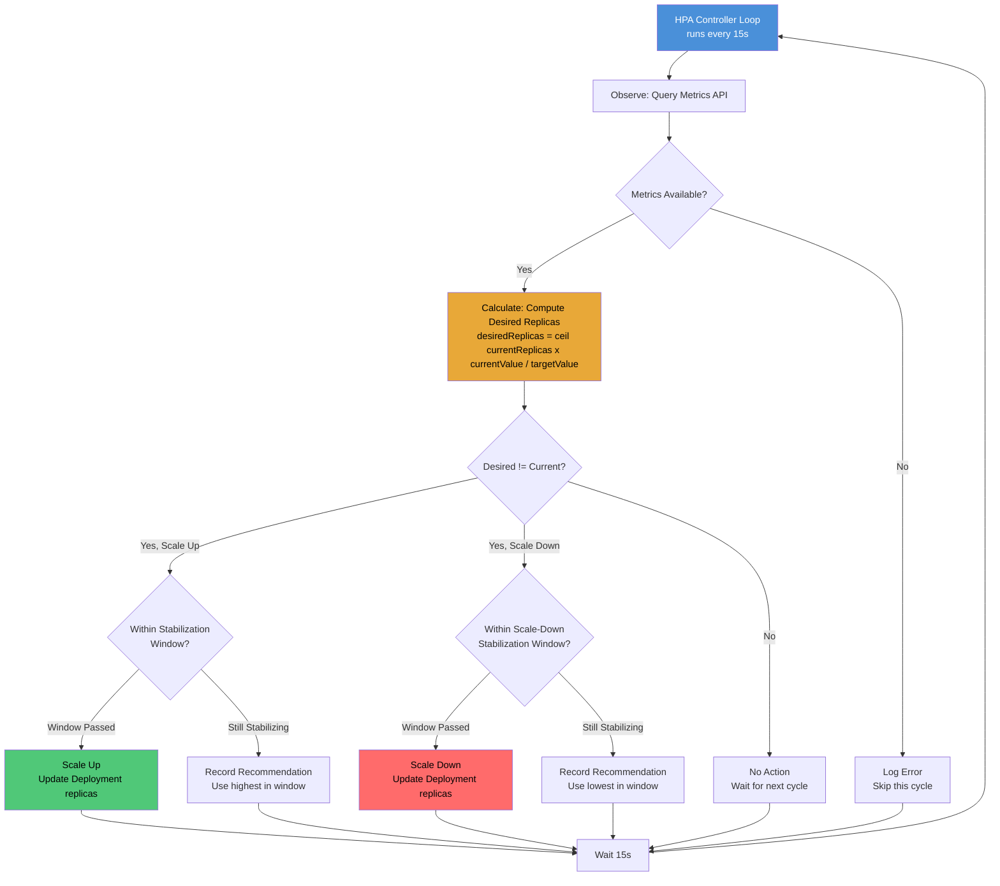
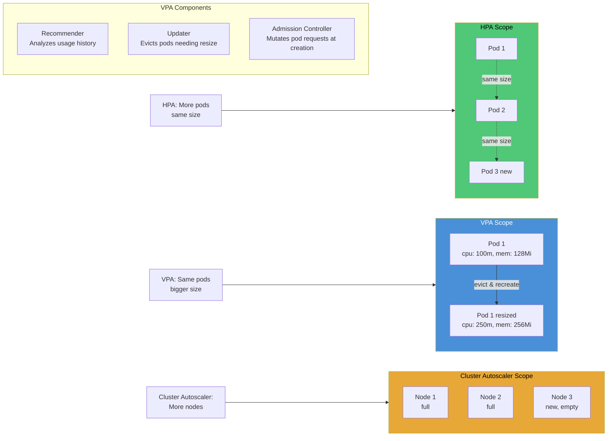

# File 38: Autoscaling — HPA, VPA, Cluster Autoscaler, and KEDA

**Topic:** Horizontal Pod Autoscaler (HPA v2), Vertical Pod Autoscaler (VPA), Cluster Autoscaler, and Kubernetes Event-Driven Autoscaling (KEDA)

**WHY THIS MATTERS:**
Production workloads rarely have constant demand. Autoscaling lets Kubernetes automatically adjust capacity based on real-time signals — CPU spikes, memory pressure, queue depths, or custom business metrics. Without autoscaling, you either over-provision (wasting money) or under-provision (crashing under load). Mastering the full spectrum — HPA, VPA, Cluster Autoscaler, and KEDA — is essential for building cost-efficient, resilient systems.

---

## Story:

Imagine a massive **Diwali Mela** (festival fair) in Jaipur. Thousands of visitors flood the fairground every evening.

- **HPA (Horizontal Pod Autoscaler) = Adding More Stalls:** When the crowd at the chaat counter grows, the organizer opens identical new chaat stalls. When the crowd dies down at midnight, extra stalls close. The stalls are identical — same menu, same size.

- **VPA (Vertical Pod Autoscaler) = Making Stalls Bigger:** Instead of opening new stalls, the organizer replaces the small chaat counter with a massive one — bigger griddle, more burners, larger serving area. The stall itself grows to handle the load.

- **Cluster Autoscaler = Adding More Grounds:** When every stall slot in the fairground is occupied and more vendors want to set up, the organizer leases the adjacent empty plot. When stalls vacate, the extra ground lease is released. The fairground itself expands and contracts.

- **KEDA = Calling Extra Stall Owners When the Queue Hits 50:** The organizer has a rule: "If the queue at any food category exceeds 50 people, call the backup stall owner from home." This is event-driven — not a constant check, but a reaction to a specific external signal (queue depth, message count, etc.).

Together, these four mechanisms ensure the Mela handles any crowd — from a quiet Tuesday afternoon to the peak Diwali night — without wasting space or turning away visitors.

---

## Example Block 1 — Metrics Server: The Foundation

### Section 1 — What is Metrics Server?

**WHY:** Every autoscaling decision starts with measurement. The metrics-server collects CPU and memory usage from kubelets and exposes them through the Kubernetes Metrics API. Without it, HPA has no data to act on.

```yaml
# metrics-server-deployment.yaml
# WHY: metrics-server is the prerequisite for HPA resource-based scaling
apiVersion: v1
kind: ServiceAccount
metadata:
  name: metrics-server
  namespace: kube-system
  # WHY: Dedicated service account for least-privilege access
---
apiVersion: apps/v1
kind: Deployment
metadata:
  name: metrics-server
  namespace: kube-system
  # WHY: Runs in kube-system as a cluster infrastructure component
spec:
  replicas: 1
  selector:
    matchLabels:
      k8s-app: metrics-server
  template:
    metadata:
      labels:
        k8s-app: metrics-server
    spec:
      serviceAccountName: metrics-server
      containers:
        - name: metrics-server
          image: registry.k8s.io/metrics-server/metrics-server:v0.7.0
          # WHY: Official image from Kubernetes SIG
          args:
            - --cert-dir=/tmp
            - --secure-port=10250
            - --kubelet-preferred-address-types=InternalIP,ExternalIP,Hostname
            - --kubelet-use-node-status-port
            - --metric-resolution=15s
            # WHY: 15s resolution balances freshness vs overhead
          ports:
            - containerPort: 10250
              name: https
              protocol: TCP
          resources:
            requests:
              cpu: 100m
              memory: 200Mi
            # WHY: metrics-server itself needs resources to scrape all nodes
```

### Section 2 — Verifying Metrics Server

```bash
# SYNTAX: kubectl top nodes
# FLAGS: none required
# EXPECTED OUTPUT:
# NAME           CPU(cores)   CPU%   MEMORY(bytes)   MEMORY%
# node-1         250m         12%    1024Mi           52%
# node-2         180m         9%     890Mi            45%
kubectl top nodes

# SYNTAX: kubectl top pods -n <namespace>
# FLAGS: -n specifies namespace, --containers shows per-container breakdown
# EXPECTED OUTPUT:
# NAME                     CPU(cores)   MEMORY(bytes)
# web-app-abc123-xyz       15m          64Mi
# web-app-abc123-def       12m          58Mi
kubectl top pods -n default
kubectl top pods -n default --containers
```

---

## Example Block 2 — HPA v2: Horizontal Pod Autoscaler

### Section 1 — HPA Decision Loop

**WHY:** HPA continuously watches metrics, calculates desired replicas using the formula `desiredReplicas = ceil(currentReplicas * (currentMetricValue / desiredMetricValue))`, and scales the target workload. Understanding this loop is critical for tuning scaling behavior.



### Section 2 — HPA v2 with Resource Metrics

**WHY:** HPA v2 supports multiple metric types — Resource (CPU/memory), Pods (custom per-pod), Object (Kubernetes object metrics), and External (metrics from outside the cluster). Resource metrics are the most common starting point.

```yaml
# hpa-v2-resource.yaml
# WHY: HPA v2 allows multiple metrics and fine-grained scaling behavior
apiVersion: autoscaling/v2
kind: HorizontalPodAutoscaler
metadata:
  name: web-app-hpa
  namespace: production
  # WHY: HPA lives in the same namespace as the target
spec:
  scaleTargetRef:
    apiVersion: apps/v1
    kind: Deployment
    name: web-app
    # WHY: Points to the exact workload to scale
  minReplicas: 2
  # WHY: Never go below 2 for high availability
  maxReplicas: 20
  # WHY: Cap to prevent runaway scaling and cost explosion
  metrics:
    - type: Resource
      resource:
        name: cpu
        target:
          type: Utilization
          averageUtilization: 70
          # WHY: Target 70% CPU — leaves 30% headroom for spikes
    - type: Resource
      resource:
        name: memory
        target:
          type: Utilization
          averageUtilization: 80
          # WHY: Memory scaling at 80% — more tolerant since memory is less spiky
  behavior:
    scaleUp:
      stabilizationWindowSeconds: 30
      # WHY: Wait 30s of sustained high metrics before scaling up
      # prevents flapping from brief spikes
      policies:
        - type: Percent
          value: 100
          periodSeconds: 60
          # WHY: Can double pods every 60s — aggressive scale-up
        - type: Pods
          value: 4
          periodSeconds: 60
          # WHY: Or add 4 pods per minute — whichever is greater
      selectPolicy: Max
      # WHY: Use the policy that adds more pods — favor availability
    scaleDown:
      stabilizationWindowSeconds: 300
      # WHY: Wait 5 minutes before scaling down — conservative to avoid
      # premature scale-down during brief lulls
      policies:
        - type: Percent
          value: 25
          periodSeconds: 60
          # WHY: Remove at most 25% of pods per minute — gradual cool-down
      selectPolicy: Min
      # WHY: Use the policy that removes fewer pods — favor stability
```

### Section 3 — HPA with Custom and External Metrics

**WHY:** CPU and memory are not always the best signals. A web app might need scaling based on requests-per-second, and a queue worker based on queue depth. Custom and external metrics enable business-aware autoscaling.

```yaml
# hpa-custom-metrics.yaml
# WHY: Scale based on application-specific signals, not just infrastructure
apiVersion: autoscaling/v2
kind: HorizontalPodAutoscaler
metadata:
  name: api-server-hpa
  namespace: production
spec:
  scaleTargetRef:
    apiVersion: apps/v1
    kind: Deployment
    name: api-server
  minReplicas: 3
  maxReplicas: 50
  metrics:
    # Metric 1: CPU as a baseline
    - type: Resource
      resource:
        name: cpu
        target:
          type: Utilization
          averageUtilization: 65
    # Metric 2: Custom per-pod metric (requests per second)
    - type: Pods
      pods:
        metric:
          name: http_requests_per_second
          # WHY: Application exposes this via Prometheus metrics
        target:
          type: AverageValue
          averageValue: "1000"
          # WHY: Each pod should handle ~1000 req/s; beyond this, add pods
    # Metric 3: Object metric (Ingress requests)
    - type: Object
      object:
        describedObject:
          apiVersion: networking.k8s.io/v1
          kind: Ingress
          name: api-ingress
        metric:
          name: requests-per-second
        target:
          type: Value
          value: "10000"
          # WHY: Total ingress RPS — if above 10k, scale up
    # Metric 4: External metric (SQS queue depth from AWS)
    - type: External
      external:
        metric:
          name: sqs_queue_length
          selector:
            matchLabels:
              queue: "order-processing"
        target:
          type: AverageValue
          averageValue: "30"
          # WHY: Each pod should handle 30 queued messages; beyond this, scale
```

```bash
# SYNTAX: kubectl get hpa -n <namespace>
# FLAGS: -w for watch mode, -o wide for extra columns
# EXPECTED OUTPUT:
# NAME             REFERENCE            TARGETS                    MINPODS   MAXPODS   REPLICAS   AGE
# web-app-hpa      Deployment/web-app   45%/70%, 60%/80%          2         20        3          5m
# api-server-hpa   Deployment/api       cpu:45%/65%,rps:800/1k    3         50        5          10m
kubectl get hpa -n production -w

# SYNTAX: kubectl describe hpa <name> -n <namespace>
# FLAGS: none
# EXPECTED OUTPUT: Detailed events showing scaling decisions, metric values, conditions
kubectl describe hpa web-app-hpa -n production
```

---

## Example Block 3 — VPA: Vertical Pod Autoscaler

### Section 1 — VPA Architecture and Modes

**WHY:** HPA adds more pods, but sometimes the problem is that each pod is too small. VPA analyzes actual resource usage and recommends (or enforces) better CPU/memory requests. This is especially useful for workloads that cannot be horizontally scaled (like stateful singletons).



### Section 2 — VPA Configuration

**WHY:** VPA has four modes — Off (recommendations only), Initial (sets at pod creation), Auto (evicts and recreates), and Recreate (same as Auto). Choosing the right mode depends on your tolerance for pod restarts.

```yaml
# vpa-auto.yaml
# WHY: VPA Auto mode continuously right-sizes pods based on observed usage
apiVersion: autoscaling.k8s.io/v1
kind: VerticalPodAutoscaler
metadata:
  name: backend-vpa
  namespace: production
spec:
  targetRef:
    apiVersion: apps/v1
    kind: Deployment
    name: backend-api
    # WHY: Points to the workload whose pods will be right-sized
  updatePolicy:
    updateMode: "Auto"
    # WHY: Auto mode evicts pods and recreates with new resource requests
    # Options: Off, Initial, Recreate, Auto
    # Off = only recommendations, no changes
    # Initial = set resources only when pod is first created
    # Auto = evict and recreate pods with updated resources
    minReplicas: 2
    # WHY: Never evict below 2 replicas to maintain availability
  resourcePolicy:
    containerPolicies:
      - containerName: backend
        minAllowed:
          cpu: 50m
          memory: 64Mi
          # WHY: Floor — never recommend below this
        maxAllowed:
          cpu: 2000m
          memory: 2Gi
          # WHY: Ceiling — prevents runaway resource allocation
        controlledResources: ["cpu", "memory"]
        # WHY: Control both dimensions
        controlledValues: RequestsAndLimits
        # WHY: Adjust both requests and limits proportionally
      - containerName: sidecar-logger
        mode: "Off"
        # WHY: Do not touch the sidecar's resources — only resize the main container
```

```bash
# SYNTAX: kubectl get vpa -n <namespace>
# FLAGS: -o wide for recommendations
# EXPECTED OUTPUT:
# NAME          MODE   CPU    MEM     PROVIDED   AGE
# backend-vpa   Auto   250m   256Mi   True       1h
kubectl get vpa -n production

# SYNTAX: kubectl describe vpa <name> -n <namespace>
# Shows detailed recommendations: target, lower bound, upper bound, uncapped target
# EXPECTED OUTPUT:
# Recommendation:
#   Container Recommendations:
#     Container Name: backend
#       Lower Bound:    Cpu: 100m, Memory: 128Mi
#       Target:         Cpu: 250m, Memory: 256Mi
#       Upper Bound:    Cpu: 500m, Memory: 512Mi
#       Uncapped Target: Cpu: 250m, Memory: 256Mi
kubectl describe vpa backend-vpa -n production
```

---

## Example Block 4 — Cluster Autoscaler

### Section 1 — How Cluster Autoscaler Works

**WHY:** When HPA wants to create more pods but no node has room, pods stay Pending. Cluster Autoscaler detects these unschedulable pods and provisions new nodes from the cloud provider. When nodes are underutilized, it drains and removes them. This completes the scaling picture — HPA scales pods, CA scales the infrastructure.

```yaml
# cluster-autoscaler-config.yaml
# WHY: Configures how aggressively the cluster scales nodes
apiVersion: apps/v1
kind: Deployment
metadata:
  name: cluster-autoscaler
  namespace: kube-system
spec:
  replicas: 1
  selector:
    matchLabels:
      app: cluster-autoscaler
  template:
    metadata:
      labels:
        app: cluster-autoscaler
    spec:
      serviceAccountName: cluster-autoscaler
      containers:
        - name: cluster-autoscaler
          image: registry.k8s.io/autoscaling/cluster-autoscaler:v1.29.0
          command:
            - ./cluster-autoscaler
            - --v=4
            # WHY: Verbose logging for debugging scaling decisions
            - --stderrthreshold=info
            - --cloud-provider=aws
            # WHY: Integrates with cloud API to provision/deprovision nodes
            - --skip-nodes-with-local-storage=false
            # WHY: Allow scaling down nodes with local storage (emptyDir etc.)
            - --expander=least-waste
            # WHY: Choose node group that wastes least resources after scaling
            # Options: random, most-pods, least-waste, price, priority
            - --scale-down-delay-after-add=10m
            # WHY: Wait 10 min after adding a node before considering scale-down
            - --scale-down-delay-after-failure=3m
            # WHY: Retry scale-down 3 min after a failed attempt
            - --scale-down-unneeded-time=10m
            # WHY: Node must be underutilized for 10 min before removal
            - --scale-down-utilization-threshold=0.5
            # WHY: Node with <50% utilization is candidate for removal
            - --max-node-provision-time=15m
            # WHY: If node is not ready in 15 min, consider it failed
            - --balance-similar-node-groups=true
            # WHY: Keep node groups balanced in size
          resources:
            requests:
              cpu: 100m
              memory: 300Mi
```

### Section 2 — Pod Disruption Budgets with Autoscaling

**WHY:** When Cluster Autoscaler drains a node, PDBs ensure it does not take down too many pods of a service at once. PDBs are the safety net that makes node removal safe.

```yaml
# pdb-for-autoscaling.yaml
# WHY: Prevents cluster autoscaler from disrupting too many pods at once
apiVersion: policy/v1
kind: PodDisruptionBudget
metadata:
  name: web-app-pdb
  namespace: production
spec:
  minAvailable: "75%"
  # WHY: At least 75% of pods must stay running during voluntary disruptions
  # Alternative: maxUnavailable: 1 — at most 1 pod down at a time
  selector:
    matchLabels:
      app: web-app
```

---

## Example Block 5 — KEDA: Kubernetes Event-Driven Autoscaling

### Section 1 — KEDA Architecture

**WHY:** HPA scales based on metrics already inside Kubernetes. KEDA extends this to external event sources — message queues, databases, cron schedules, HTTP request rates. The killer feature: KEDA can scale to zero and back, which HPA cannot do (HPA minimum is 1).

```yaml
# keda-scaledobject.yaml
# WHY: KEDA watches an external signal (RabbitMQ queue) and scales pods accordingly
apiVersion: keda.sh/v1alpha1
kind: ScaledObject
metadata:
  name: order-processor-scaler
  namespace: production
spec:
  scaleTargetRef:
    name: order-processor
    # WHY: The Deployment to scale
  pollingInterval: 15
  # WHY: Check the queue every 15 seconds
  cooldownPeriod: 300
  # WHY: Wait 5 minutes of inactivity before scaling to zero
  idleReplicaCount: 0
  # WHY: Scale to zero when no messages — saves cost for bursty workloads
  minReplicaCount: 0
  # WHY: KEDA (unlike HPA) can go to zero
  maxReplicaCount: 100
  # WHY: Upper bound to prevent runaway scaling
  fallback:
    failureThreshold: 3
    replicas: 5
    # WHY: If KEDA cannot reach the queue to check, run 5 replicas as safety
  triggers:
    - type: rabbitmq
      metadata:
        protocol: amqp
        queueName: orders
        mode: QueueLength
        value: "50"
        # WHY: Each pod handles 50 messages — if queue has 200, run 4 pods
      authenticationRef:
        name: rabbitmq-auth
        # WHY: Reference to TriggerAuthentication with connection credentials
---
# WHY: Securely pass queue credentials to KEDA
apiVersion: keda.sh/v1alpha1
kind: TriggerAuthentication
metadata:
  name: rabbitmq-auth
  namespace: production
spec:
  secretTargetRef:
    - parameter: host
      name: rabbitmq-secret
      key: connection-string
      # WHY: KEDA reads the RabbitMQ connection string from a Kubernetes Secret
```

### Section 2 — KEDA with Multiple Triggers

```yaml
# keda-multi-trigger.yaml
# WHY: Scale based on multiple signals — take the maximum across all triggers
apiVersion: keda.sh/v1alpha1
kind: ScaledObject
metadata:
  name: notification-service-scaler
  namespace: production
spec:
  scaleTargetRef:
    name: notification-service
  minReplicaCount: 1
  maxReplicaCount: 30
  triggers:
    # Trigger 1: Kafka topic lag
    - type: kafka
      metadata:
        bootstrapServers: kafka.production.svc:9092
        consumerGroup: notification-consumers
        topic: user-notifications
        lagThreshold: "100"
        # WHY: If consumer lag exceeds 100, scale up
    # Trigger 2: Cron-based pre-scaling
    - type: cron
      metadata:
        timezone: Asia/Kolkata
        start: "0 8 * * *"
        end: "0 22 * * *"
        desiredReplicas: "5"
        # WHY: Pre-scale to 5 during business hours (8AM-10PM IST)
        # Anticipates load before it arrives
    # Trigger 3: Prometheus custom metric
    - type: prometheus
      metadata:
        serverAddress: http://prometheus.monitoring.svc:9090
        metricName: notification_queue_depth
        query: "sum(notification_pending_total)"
        threshold: "500"
        # WHY: If total pending notifications exceed 500, scale up
```

```bash
# SYNTAX: kubectl get scaledobject -n <namespace>
# FLAGS: -o wide for trigger info
# EXPECTED OUTPUT:
# NAME                        SCALETARGETKIND      SCALETARGETNAME       MIN   MAX   TRIGGERS     READY   ACTIVE
# order-processor-scaler      apps/v1.Deployment   order-processor       0     100   rabbitmq     True    True
# notification-service-scaler apps/v1.Deployment   notification-service  1     30    kafka,cron   True    True
kubectl get scaledobject -n production

# SYNTAX: kubectl get hpa -n <namespace>
# WHY: KEDA creates an HPA under the hood — you can inspect it
# EXPECTED OUTPUT: Shows the KEDA-managed HPA with external metrics
kubectl get hpa -n production

# Install KEDA via Helm
# SYNTAX: helm install keda kedacore/keda --namespace keda --create-namespace
# FLAGS: --namespace specifies install namespace, --create-namespace creates it
# EXPECTED OUTPUT:
# NAME: keda
# NAMESPACE: keda
# STATUS: deployed
helm repo add kedacore https://kedacore.github.io/charts
helm repo update
helm install keda kedacore/keda --namespace keda --create-namespace
```

---

## Example Block 6 — Scaling Strategy Comparison

### Section 1 — When to Use What

**WHY:** Choosing the wrong autoscaling strategy wastes resources or causes outages. This comparison helps you pick the right tool for each workload type.

| Dimension | HPA | VPA | Cluster Autoscaler | KEDA |
|---|---|---|---|---|
| **What scales** | Pod count | Pod resources | Node count | Pod count |
| **Direction** | Horizontal | Vertical | Horizontal (nodes) | Horizontal |
| **Minimum** | 1 pod | N/A | Min node group | 0 pods |
| **Scale to zero** | No | No | Yes (node groups) | Yes |
| **Metric source** | Metrics API | Usage history | Pending pods | External events |
| **Restart required** | No | Yes (evict+recreate) | N/A (new nodes) | No |
| **Best for** | Stateless web apps | Stateful/singleton | All (infra layer) | Event-driven workers |
| **Conflict risk** | Conflicts with VPA on same metric | Conflicts with HPA on same metric | None | None (wraps HPA) |

### Section 2 — Combining Autoscalers

```yaml
# combined-scaling-strategy.yaml
# WHY: Use HPA for horizontal scaling + VPA in Off mode for recommendations
# Never use HPA and VPA in Auto mode on the same Deployment for the same metric

# Step 1: HPA handles pod count based on CPU
apiVersion: autoscaling/v2
kind: HorizontalPodAutoscaler
metadata:
  name: app-hpa
  namespace: production
spec:
  scaleTargetRef:
    apiVersion: apps/v1
    kind: Deployment
    name: my-app
  minReplicas: 3
  maxReplicas: 15
  metrics:
    - type: Resource
      resource:
        name: cpu
        target:
          type: Utilization
          averageUtilization: 70
---
# Step 2: VPA in Off mode — gives recommendations, does not act
apiVersion: autoscaling.k8s.io/v1
kind: VerticalPodAutoscaler
metadata:
  name: app-vpa-recommender
  namespace: production
spec:
  targetRef:
    apiVersion: apps/v1
    kind: Deployment
    name: my-app
  updatePolicy:
    updateMode: "Off"
    # WHY: Off mode = read recommendations via kubectl describe vpa
    # A human or CI pipeline applies the recommendations during maintenance windows
  resourcePolicy:
    containerPolicies:
      - containerName: "*"
        controlledResources: ["cpu", "memory"]
```

---

## Key Takeaways

1. **Metrics Server** is the foundation — without it, HPA has no data. Always verify it is running with `kubectl top nodes` before configuring autoscaling.

2. **HPA v2** supports four metric types: Resource (CPU/memory), Pods (custom per-pod), Object (Kubernetes object metrics), and External (outside-cluster metrics). Use `behavior.scaleUp` and `behavior.scaleDown` with stabilization windows to prevent flapping.

3. **VPA** right-sizes pod resource requests based on historical usage. Use `Off` mode alongside HPA to get recommendations without conflicts. Never run HPA and VPA in `Auto` mode on the same metric for the same Deployment.

4. **Cluster Autoscaler** provisions and deprovisions nodes based on unschedulable pods and node utilization. It works at the infrastructure layer, complementing HPA at the pod layer. Always set Pod Disruption Budgets to make node drains safe.

5. **KEDA** extends autoscaling to external event sources — queues, databases, cron schedules, Prometheus queries. Its killer feature is **scale-to-zero**, which HPA cannot do, making it ideal for event-driven and bursty workloads.

6. **Stabilization windows** are critical: scale up fast (30-60s) but scale down slowly (5-10 min) to avoid premature scale-down during brief lulls.

7. **The formula** for HPA: `desiredReplicas = ceil(currentReplicas * (currentMetricValue / desiredMetricValue))`. When multiple metrics are specified, HPA takes the maximum desired replicas across all metrics.

8. **Pod Disruption Budgets** protect your services during Cluster Autoscaler node drain operations. Always create PDBs for production workloads before enabling node autoscaling.

9. **KEDA fallback** configuration is essential for production — if KEDA cannot reach the external metric source, the fallback replica count keeps your service running.

10. **Cost optimization** comes from layering: KEDA for scale-to-zero workers, HPA for stateless web tiers, VPA recommendations for right-sizing requests, and Cluster Autoscaler for efficient node utilization.
