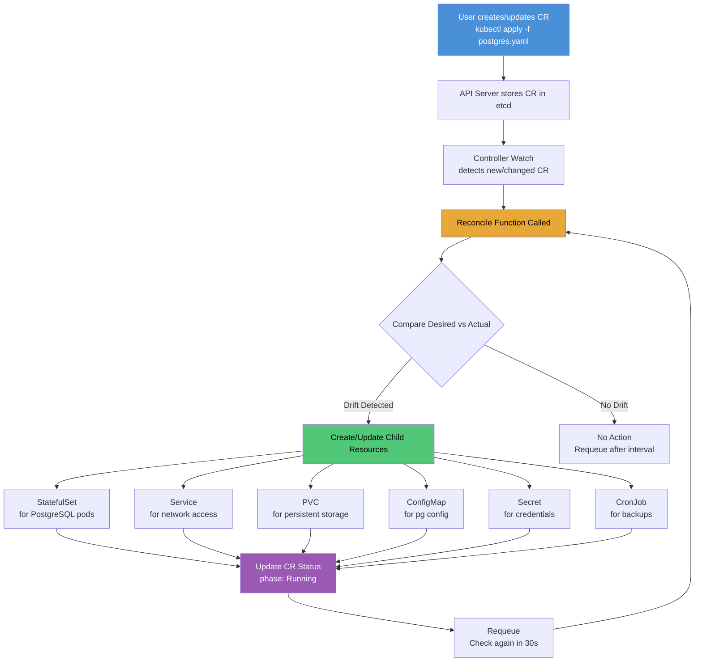
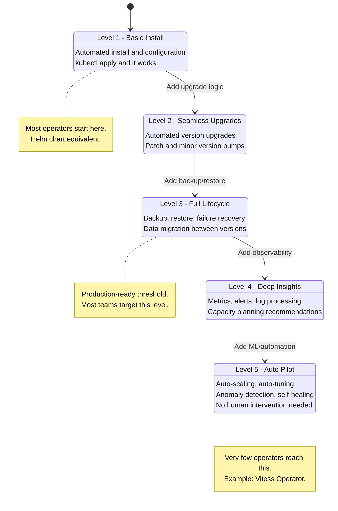

# File 39: Operators and Custom Resource Definitions (CRDs)

**Topic:** Custom Resource Definitions (CRDs), Custom Controllers, the Operator Pattern, Operator SDK, Kubebuilder, Operator Lifecycle Manager (OLM), and OperatorHub

**WHY THIS MATTERS:**
Kubernetes ships with built-in resources like Pods, Deployments, and Services, but real-world infrastructure includes databases, message brokers, certificates, and monitoring stacks that need domain-specific management logic. CRDs let you teach Kubernetes new nouns ("I want a PostgresCluster"), and Operators encode expert knowledge into controllers that automatically manage the full lifecycle — provisioning, scaling, backup, failover, upgrades — of complex software. Operators turn "runbook automation" into code that runs 24/7 inside your cluster.

---

## Story:

Think of the Indian government bureaucracy, but the good kind — efficient e-governance.

**CRD = A New Government Form:** Imagine the passport office introduces a brand new application form — "International Student Visa." Before this form exists, no citizen can apply. The CRD is the act of registering this new form type in the system. Once registered, citizens (developers) can submit filled-out forms (Custom Resources).

**Operator = The Expert Contractor:** Now imagine the government hires an expert contractor (say, TCS or Infosys) who not only accepts the submitted "International Student Visa" forms but also automates the entire procedure — verifying documents, scheduling interviews, printing the visa, mailing it back, and even handling renewals. The contractor watches for new form submissions, processes them end-to-end, and handles failures (lost documents, rejected applications) by retrying or escalating.

Without the contractor (Operator), someone would need to manually process each form. Without the form (CRD), there is no way to even submit the request. Together, CRD + Operator = a fully automated, self-service system for complex tasks.

The **Reconciliation Loop** is like the contractor's daily routine: come to office, check the pile of submitted forms, compare "what was requested" vs "what actually exists," take action to close the gap, and repeat tomorrow. Even if something breaks overnight (a database crashes), the next morning's reconciliation detects the drift and fixes it.

---

## Example Block 1 — Custom Resource Definitions

### Section 1 — CRD Anatomy

**WHY:** A CRD registers a new resource type in the Kubernetes API server. Once registered, users can create, read, update, and delete instances of this type using standard kubectl commands. The OpenAPI v3 schema inside the CRD validates every submitted resource.

```yaml
# postgres-crd.yaml
# WHY: Teaches Kubernetes what a "PostgresCluster" is
apiVersion: apiextensions.k8s.io/v1
kind: CustomResourceDefinition
metadata:
  name: postgresclusters.database.example.com
  # WHY: Name must be <plural>.<group> — this is enforced by the API server
spec:
  group: database.example.com
  # WHY: API group — like a namespace for your custom API
  names:
    kind: PostgresCluster
    # WHY: The PascalCase name used in YAML manifests
    listKind: PostgresClusterList
    # WHY: Name for list operations
    plural: postgresclusters
    # WHY: Used in URLs: /apis/database.example.com/v1/postgresclusters
    singular: postgrescluster
    # WHY: Used in kubectl get postgrescluster
    shortNames:
      - pg
      - pgc
      # WHY: Shortcuts — kubectl get pg is easier to type
    categories:
      - all
      - database
      # WHY: kubectl get all will include this; kubectl get database shows all DB types
  scope: Namespaced
  # WHY: Instances live in namespaces (alternative: Cluster for global resources)
  versions:
    - name: v1
      served: true
      # WHY: This version is available via the API
      storage: true
      # WHY: This version is used for storage in etcd (only one version can be storage)
      schema:
        openAPIV3Schema:
          type: object
          # WHY: OpenAPI v3 schema validates every CR submitted
          properties:
            spec:
              type: object
              required:
                - replicas
                - version
                # WHY: These fields are mandatory — API server rejects CRs without them
              properties:
                replicas:
                  type: integer
                  minimum: 1
                  maximum: 10
                  description: "Number of PostgreSQL instances in the cluster"
                  # WHY: Validation at the API level — prevents invalid configurations
                version:
                  type: string
                  enum: ["14", "15", "16"]
                  description: "PostgreSQL major version"
                  # WHY: Only allow tested/supported versions
                storage:
                  type: object
                  properties:
                    size:
                      type: string
                      pattern: "^[0-9]+(Gi|Ti)$"
                      default: "10Gi"
                      # WHY: Default storage size if not specified
                    storageClassName:
                      type: string
                      default: "standard"
                      # WHY: Which storage class to use for PVCs
                backup:
                  type: object
                  properties:
                    enabled:
                      type: boolean
                      default: true
                      # WHY: Backups on by default — safe default
                    schedule:
                      type: string
                      default: "0 2 * * *"
                      # WHY: Daily backup at 2 AM by default
                    retentionDays:
                      type: integer
                      default: 7
                      minimum: 1
                      maximum: 90
                      # WHY: Keep 7 days of backups by default
            status:
              type: object
              properties:
                phase:
                  type: string
                  enum: ["Creating", "Running", "Updating", "Failed", "Deleting"]
                  # WHY: Controller sets this to reflect current state
                readyReplicas:
                  type: integer
                  # WHY: How many instances are healthy
                currentVersion:
                  type: string
                  # WHY: The currently running PostgreSQL version
                lastBackup:
                  type: string
                  format: date-time
                  # WHY: Timestamp of the most recent successful backup
                conditions:
                  type: array
                  items:
                    type: object
                    properties:
                      type:
                        type: string
                      status:
                        type: string
                      lastTransitionTime:
                        type: string
                      reason:
                        type: string
                      message:
                        type: string
                  # WHY: Standard Kubernetes conditions pattern for detailed status
      subresources:
        status: {}
        # WHY: Enables /status subresource — controller can update status
        # without triggering spec watches, and users cannot modify status directly
        scale:
          specReplicasPath: .spec.replicas
          statusReplicasPath: .status.readyReplicas
          # WHY: Enables kubectl scale postgrescluster my-pg --replicas=3
      additionalPrinterColumns:
        - name: Replicas
          type: integer
          jsonPath: .spec.replicas
          # WHY: Show replicas in kubectl get pg output
        - name: Version
          type: string
          jsonPath: .spec.version
        - name: Status
          type: string
          jsonPath: .status.phase
        - name: Age
          type: date
          jsonPath: .metadata.creationTimestamp
```

### Section 2 — Creating Custom Resources

```yaml
# my-postgres-cluster.yaml
# WHY: An instance of the PostgresCluster CRD — the actual "filled form"
apiVersion: database.example.com/v1
kind: PostgresCluster
metadata:
  name: orders-db
  namespace: production
  labels:
    team: backend
    environment: production
    # WHY: Labels for filtering and policy
spec:
  replicas: 3
  # WHY: 3-node cluster for HA (primary + 2 replicas)
  version: "16"
  # WHY: Latest supported PostgreSQL version
  storage:
    size: 50Gi
    storageClassName: fast-ssd
    # WHY: Production databases need fast storage
  backup:
    enabled: true
    schedule: "0 */6 * * *"
    # WHY: Backup every 6 hours for critical order data
    retentionDays: 30
    # WHY: Keep 30 days of backups for compliance
```

```bash
# SYNTAX: kubectl apply -f <crd-file>
# FLAGS: none
# EXPECTED OUTPUT:
# customresourcedefinition.apiextensions.k8s.io/postgresclusters.database.example.com created
kubectl apply -f postgres-crd.yaml

# SYNTAX: kubectl api-resources | grep <group>
# FLAGS: none
# EXPECTED OUTPUT:
# postgresclusters   pg,pgc   database.example.com/v1   true    PostgresCluster
kubectl api-resources | grep database.example.com

# SYNTAX: kubectl apply -f <cr-file>
# EXPECTED OUTPUT:
# postgrescluster.database.example.com/orders-db created
kubectl apply -f my-postgres-cluster.yaml

# SYNTAX: kubectl get pg -n <namespace>
# EXPECTED OUTPUT:
# NAME        REPLICAS   VERSION   STATUS    AGE
# orders-db   3          16        Running   5m
kubectl get pg -n production

# SYNTAX: kubectl describe pg <name> -n <namespace>
# Shows full spec, status, events
kubectl describe pg orders-db -n production
```

---

## Example Block 2 — The Operator Pattern

### Section 1 — Reconciliation Loop

**WHY:** The Operator pattern is a controller that watches Custom Resources and reconciles the actual state of the world with the desired state expressed in the CR. This is the core of Kubernetes — the same pattern that the built-in Deployment controller uses to manage ReplicaSets.



### Section 2 — Controller Pseudocode

**WHY:** Understanding the reconciliation logic helps you reason about operator behavior, debug issues, and build your own operators.

```go
// WHY: This is the core reconcile function that runs on every CR change
func (r *PostgresClusterReconciler) Reconcile(ctx context.Context, req ctrl.Request) (ctrl.Result, error) {
    log := r.Log.WithValues("postgrescluster", req.NamespacedName)

    // Step 1: Fetch the CR
    // WHY: Get the desired state from the API server
    var cluster databasev1.PostgresCluster
    if err := r.Get(ctx, req.NamespacedName, &cluster); err != nil {
        if apierrors.IsNotFound(err) {
            // WHY: CR was deleted — child resources have ownerReferences
            // so they get garbage collected automatically
            return ctrl.Result{}, nil
        }
        return ctrl.Result{}, err
    }

    // Step 2: Ensure child StatefulSet exists and matches spec
    // WHY: StatefulSet manages the PostgreSQL pods with stable identities
    if err := r.reconcileStatefulSet(ctx, &cluster); err != nil {
        cluster.Status.Phase = "Failed"
        r.Status().Update(ctx, &cluster)
        return ctrl.Result{RequeueAfter: 30 * time.Second}, err
    }

    // Step 3: Ensure Service exists
    // WHY: Service provides stable DNS name for database access
    if err := r.reconcileService(ctx, &cluster); err != nil {
        return ctrl.Result{RequeueAfter: 30 * time.Second}, err
    }

    // Step 4: Ensure backup CronJob exists if backup.enabled
    // WHY: Automated backups are part of the operator's domain knowledge
    if cluster.Spec.Backup.Enabled {
        if err := r.reconcileBackupCronJob(ctx, &cluster); err != nil {
            return ctrl.Result{RequeueAfter: 30 * time.Second}, err
        }
    }

    // Step 5: Update status
    // WHY: Reflect the actual state back to the user
    cluster.Status.Phase = "Running"
    cluster.Status.ReadyReplicas = r.countReadyPods(ctx, &cluster)
    cluster.Status.CurrentVersion = cluster.Spec.Version
    r.Status().Update(ctx, &cluster)

    // Step 6: Requeue
    // WHY: Periodically re-check even without events, to catch drift
    return ctrl.Result{RequeueAfter: 60 * time.Second}, nil
}
```

---

## Example Block 3 — Operator Maturity Model

### Section 1 — Five Levels of Operator Maturity

**WHY:** Not all operators are created equal. The operator maturity model (from the Operator Framework) defines five levels, from basic install automation to full autopilot. Knowing the level helps you evaluate third-party operators and set goals for your own.



### Section 2 — Maturity Level Details

| Level | Capability | What It Automates | Example |
|---|---|---|---|
| **1 - Basic Install** | Install, configure | Deploying the software with sane defaults | Helm-based operator that runs `helm install` |
| **2 - Seamless Upgrades** | Upgrades | Rolling updates, version migrations | Operator handles PostgreSQL 15 to 16 upgrade |
| **3 - Full Lifecycle** | Backup, restore, failover | Data protection and disaster recovery | Automated pg_basebackup + PITR restore |
| **4 - Deep Insights** | Monitoring, alerting | Metrics collection, anomaly detection | Auto-creates Prometheus ServiceMonitor + Grafana dashboards |
| **5 - Auto Pilot** | Self-driving | Auto-tuning, auto-scaling, auto-healing | Adjusts shared_buffers based on query patterns, scales read replicas based on connection count |

---

## Example Block 4 — Building Operators

### Section 1 — Operator SDK vs Kubebuilder

**WHY:** You do not write operators from scratch. Two major frameworks exist: Operator SDK (Red Hat, supports Go/Ansible/Helm) and Kubebuilder (upstream Kubernetes SIG, Go only). Operator SDK is actually built on top of Kubebuilder.

```bash
# Initialize a new operator project with Operator SDK
# SYNTAX: operator-sdk init --domain <domain> --repo <go-module-path>
# FLAGS:
#   --domain: API group domain (e.g., example.com)
#   --repo: Go module path
# EXPECTED OUTPUT:
# Writing kustomize manifests for you to edit...
# Writing scaffold for you to edit...
# Get controller runtime:
# go get sigs.k8s.io/controller-runtime@v0.17.0
# Update dependencies:
# go mod tidy
operator-sdk init --domain example.com --repo github.com/myorg/postgres-operator

# Create a new API (CRD + Controller)
# SYNTAX: operator-sdk create api --group <group> --version <version> --kind <kind>
# FLAGS:
#   --resource: Generate CRD resource (default true)
#   --controller: Generate controller code (default true)
# EXPECTED OUTPUT:
# Create Resource [y/n] y
# Create Controller [y/n] y
# Writing kustomize manifests for you to edit...
# Writing scaffold for you to edit...
# api/v1/postgrescluster_types.go
# controllers/postgrescluster_controller.go
operator-sdk create api --group database --version v1 --kind PostgresCluster --resource --controller

# Kubebuilder equivalent
# SYNTAX: kubebuilder init --domain <domain> --repo <go-module-path>
# EXPECTED OUTPUT: Same as operator-sdk (since operator-sdk wraps kubebuilder)
kubebuilder init --domain example.com --repo github.com/myorg/postgres-operator
kubebuilder create api --group database --version v1 --kind PostgresCluster
```

### Section 2 — Key Generated Files

```bash
# Project structure after scaffolding
# WHY: Understanding the layout helps navigate any operator codebase
#
# .
# ├── api/
# │   └── v1/
# │       ├── postgrescluster_types.go   # WHY: Define your CRD Go structs here
# │       └── zz_generated.deepcopy.go   # WHY: Auto-generated deep copy methods
# ├── controllers/
# │   └── postgrescluster_controller.go  # WHY: Your reconciliation logic goes here
# ├── config/
# │   ├── crd/                           # WHY: Generated CRD YAML manifests
# │   ├── rbac/                          # WHY: RBAC roles for the controller
# │   ├── manager/                       # WHY: Deployment for the operator itself
# │   └── samples/                       # WHY: Example CR YAML files
# ├── Dockerfile                         # WHY: Build the operator container image
# ├── Makefile                           # WHY: Build, test, deploy commands
# ├── main.go                            # WHY: Entry point — sets up the manager
# └── go.mod                             # WHY: Go module dependencies
```

### Section 3 — Owner References and Garbage Collection

**WHY:** When the operator creates child resources (StatefulSets, Services, etc.) for a CR, it sets ownerReferences on them. This means when the CR is deleted, Kubernetes automatically garbage-collects all child resources. This is critical for clean resource management.

```yaml
# child-statefulset-with-owner-ref.yaml
# WHY: The operator sets this ownerReference on every child resource it creates
apiVersion: apps/v1
kind: StatefulSet
metadata:
  name: orders-db
  namespace: production
  ownerReferences:
    - apiVersion: database.example.com/v1
      kind: PostgresCluster
      name: orders-db
      uid: "a1b2c3d4-e5f6-7890-abcd-ef1234567890"
      controller: true
      # WHY: Marks this as the controlling owner
      blockOwnerDeletion: true
      # WHY: Prevents the parent CR from being deleted until this child is cleaned up
spec:
  replicas: 3
  serviceName: orders-db
  selector:
    matchLabels:
      app: orders-db
  template:
    metadata:
      labels:
        app: orders-db
    spec:
      containers:
        - name: postgres
          image: postgres:16
          ports:
            - containerPort: 5432
```

---

## Example Block 5 — Operator Lifecycle Manager (OLM)

### Section 1 — OLM and OperatorHub

**WHY:** OLM manages the lifecycle of operators themselves — installing, upgrading, and managing dependencies between operators. OperatorHub is a public marketplace of community and vendor operators. Think of OLM as apt/yum for operators and OperatorHub as the package repository.

```bash
# Install OLM
# SYNTAX: operator-sdk olm install
# FLAGS: --version to specify OLM version
# EXPECTED OUTPUT:
# I0101 00:00:00.000000 operator-sdk olm install
# INFO[0000] Fetching CRDs for version "v0.27.0"
# INFO[0002] Creating CRDs and resources
# INFO[0010] OLM has been successfully installed
operator-sdk olm install

# List available operators from OperatorHub
# SYNTAX: kubectl get packagemanifests
# FLAGS: none
# EXPECTED OUTPUT:
# NAME                     CATALOG               AGE
# prometheus               Community Operators   5m
# cert-manager             Community Operators   5m
# strimzi-kafka-operator   Community Operators   5m
# redis-operator           Community Operators   5m
kubectl get packagemanifests

# Install an operator via OLM Subscription
# SYNTAX: kubectl apply -f subscription.yaml
kubectl apply -f - <<EOF
apiVersion: operators.coreos.com/v1alpha1
kind: Subscription
metadata:
  name: strimzi-kafka-operator
  namespace: operators
spec:
  channel: stable
  name: strimzi-kafka-operator
  source: community-operators
  sourceNamespace: olm
  installPlanApproval: Manual
  # WHY: Manual approval gives you control over when upgrades happen
EOF
```

### Section 2 — Common Production Operators

**WHY:** You rarely need to build operators from scratch. The ecosystem has mature operators for most infrastructure components.

| Operator | What It Manages | Maturity Level | Key Features |
|---|---|---|---|
| **Prometheus Operator** | Prometheus, Alertmanager | Level 4 | ServiceMonitor CRD, auto-discovery, HA |
| **cert-manager** | TLS certificates | Level 3 | Let's Encrypt integration, auto-renewal |
| **Strimzi** | Apache Kafka | Level 4 | Full Kafka lifecycle, topic management, user auth |
| **Zalando Postgres** | PostgreSQL | Level 3 | Patroni-based HA, backups, connection pooling |
| **MongoDB Community** | MongoDB | Level 3 | ReplicaSet management, backups |
| **Redis Operator** | Redis/Sentinel | Level 3 | Cluster mode, failover, backup |
| **Rook-Ceph** | Ceph storage | Level 5 | Block/file/object storage, auto-healing |
| **Crossplane** | Cloud resources | Level 3 | Provision AWS/GCP/Azure resources via CRDs |

```bash
# Example: Install cert-manager operator
# SYNTAX: kubectl apply -f <url>
# EXPECTED OUTPUT: Multiple resources created (CRDs, deployments, services, etc.)
kubectl apply -f https://github.com/cert-manager/cert-manager/releases/download/v1.14.0/cert-manager.yaml

# Verify cert-manager is running
# SYNTAX: kubectl get pods -n cert-manager
# EXPECTED OUTPUT:
# NAME                                       READY   STATUS    RESTARTS   AGE
# cert-manager-xxxxxxxxxx-xxxxx              1/1     Running   0          2m
# cert-manager-cainjector-xxxxxxxxxx-xxxxx   1/1     Running   0          2m
# cert-manager-webhook-xxxxxxxxxx-xxxxx      1/1     Running   0          2m
kubectl get pods -n cert-manager

# Create a Certificate CR (managed by cert-manager operator)
# WHY: The operator watches Certificate CRs and automates the entire
# certificate issuance and renewal process
kubectl apply -f - <<EOF
apiVersion: cert-manager.io/v1
kind: Certificate
metadata:
  name: api-tls
  namespace: production
spec:
  secretName: api-tls-secret
  # WHY: cert-manager stores the issued certificate in this Secret
  duration: 2160h    # 90 days
  renewBefore: 360h  # 15 days before expiry
  # WHY: Auto-renew 15 days before expiration
  issuerRef:
    name: letsencrypt-prod
    kind: ClusterIssuer
  dnsNames:
    - api.example.com
    - "*.api.example.com"
    # WHY: Certificate covers both the domain and all subdomains
EOF
```

---

## Example Block 6 — Operator Anti-Patterns and Best Practices

### Section 1 — Common Pitfalls

**WHY:** Badly written operators can be worse than no operator at all. These patterns help you build reliable operators and evaluate third-party ones.

```yaml
# ANTI-PATTERN: Controller without idempotency
# BAD: Creates a new Service every reconcile loop
# WHY this is bad: After 100 reconcile cycles, you have 100 duplicate Services
#
# CORRECT PATTERN: Check if resource exists, create only if missing, update if drifted
# Pseudocode:
#   existing := GET Service
#   if not found:
#     CREATE Service with ownerReference
#   else if existing.spec != desired.spec:
#     UPDATE Service
#   else:
#     no action

# ANTI-PATTERN: No status updates
# BAD: Controller does work but never updates CR status
# WHY this is bad: Users have no visibility — kubectl get pg shows nothing useful
#
# CORRECT PATTERN: Update status.phase, status.conditions after every reconcile

# ANTI-PATTERN: No finalizers for cleanup
# BAD: CR is deleted but external resources (S3 buckets, DNS records) are orphaned
# WHY this is bad: Resource leak — external resources accumulate forever
#
# CORRECT PATTERN: Add finalizer on creation, remove after cleanup
```

```yaml
# finalizer-pattern.yaml
# WHY: Finalizers prevent CR deletion until the operator cleans up external resources
apiVersion: database.example.com/v1
kind: PostgresCluster
metadata:
  name: orders-db
  namespace: production
  finalizers:
    - database.example.com/cleanup
    # WHY: API server will not delete this CR until the operator
    # removes this finalizer (after cleaning up backups, DNS records, etc.)
spec:
  replicas: 3
  version: "16"
```

---

## Key Takeaways

1. **CRDs** extend the Kubernetes API with new resource types. They include OpenAPI v3 schemas for validation, additional printer columns for `kubectl get` output, and subresources for status and scale.

2. **Custom Resources (CRs)** are instances of CRDs. They are stored in etcd and managed through the standard Kubernetes API — `kubectl apply`, `kubectl get`, `kubectl delete` all work.

3. **The Operator Pattern** combines a CRD with a custom controller that watches for changes and reconciles desired state with actual state. The reconcile loop is the heart of every operator.

4. **Owner References** ensure that when a CR is deleted, all child resources (StatefulSets, Services, ConfigMaps) are automatically garbage-collected by Kubernetes.

5. **Finalizers** prevent premature deletion — the operator gets a chance to clean up external resources (backups, DNS records, cloud resources) before the CR is removed from etcd.

6. **Idempotency** is non-negotiable — the reconcile function must produce the same result whether it runs once or a thousand times. Always check-then-create, never blindly create.

7. **Operator SDK** and **Kubebuilder** generate the scaffolding for Go-based operators. Operator SDK also supports Ansible and Helm-based operators for simpler use cases.

8. **The Operator Maturity Model** has five levels: Basic Install, Seamless Upgrades, Full Lifecycle, Deep Insights, and Auto Pilot. Target Level 3 (Full Lifecycle) for production operators.

9. **OLM (Operator Lifecycle Manager)** manages operators themselves — installing, upgrading, and handling dependencies. OperatorHub is the marketplace for discovering community and vendor operators.

10. **Do not reinvent the wheel** — mature operators exist for Prometheus, cert-manager, Kafka (Strimzi), PostgreSQL (Zalando), MongoDB, Redis, and Ceph (Rook). Evaluate them before building your own.
