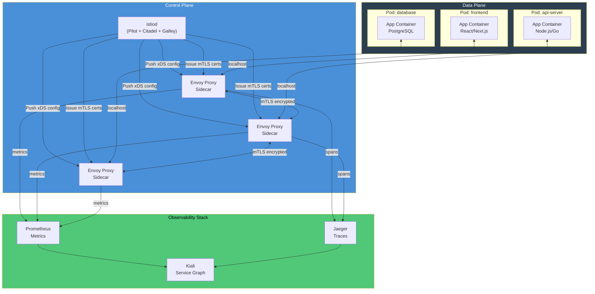
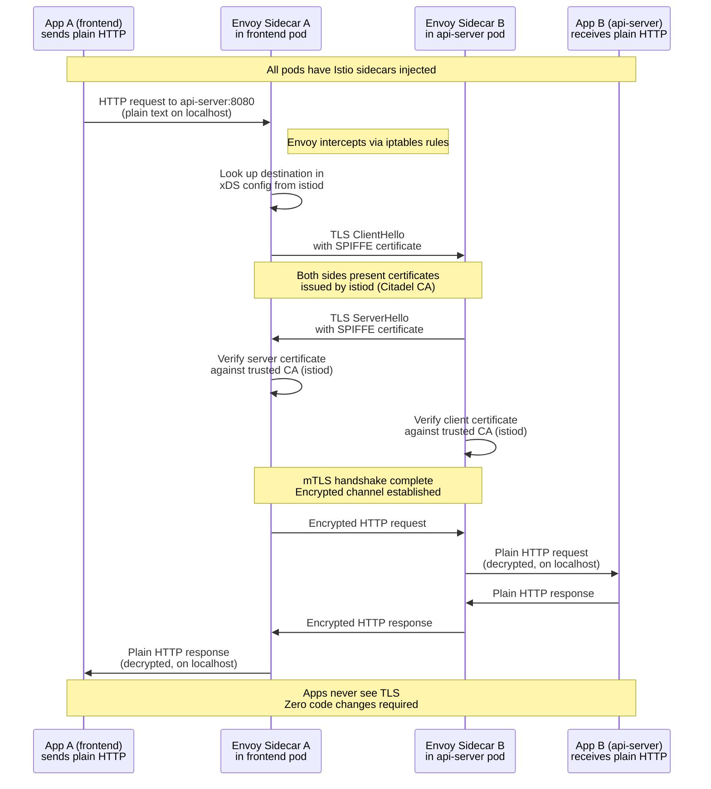

# File 40: Service Mesh and Mutual TLS (mTLS)

**Topic:** Sidecar Proxy Pattern, Envoy, Istio (istiod, VirtualService, DestinationRule), Automatic mTLS, Traffic Management, Fault Injection, Observability (Kiali), Linkerd, and Ambient Mesh

**WHY THIS MATTERS:**
In a microservices architecture with dozens or hundreds of services, every service needs security (encryption, authentication), reliability (retries, circuit breaking, timeouts), and observability (tracing, metrics, access logs). Implementing this in every service's application code is impractical and error-prone. A service mesh moves all of this into the infrastructure layer — transparent to the application — by injecting sidecar proxies that intercept all network traffic. This gives you mTLS encryption, fine-grained traffic control, and deep observability without changing a single line of application code.

---

## Story:

Imagine the **Indian Diplomatic Courier Network** — the Ministry of External Affairs managing secure communication between all government ministries.

**Envoy Sidecar = Personal Courier:** Every ministry (microservice) gets assigned a personal diplomatic courier (Envoy sidecar proxy). The ministry staff (application code) do not handle their own mail — they hand messages to their courier, who handles delivery. The ministry does not know or care about encryption protocols, routing rules, or delivery retries. All of that is the courier's job.

**mTLS = Encrypted Diplomatic Pouch:** Every courier carries messages in a tamper-proof diplomatic pouch with dual locks — both the sending courier and the receiving courier must verify each other's identity (mutual authentication) before exchanging the pouch. No one in between can read the contents, even if they intercept the pouch.

**Istiod = Ministry of External Affairs HQ:** The central authority (Istio control plane / istiod) issues diplomatic credentials (certificates) to every courier, defines routing policies ("send Finance messages through the Delhi hub, not directly"), and collects delivery receipts (telemetry). But the couriers themselves handle all the actual message delivery — HQ only sets policy.

**Kiali = Intelligence Dashboard:** The intelligence agency monitors all courier activity — who is talking to whom, how fast messages are delivered, which routes are failing — displayed on a real-time dashboard. This is Kiali, the observability UI for Istio.

**Ambient Mesh = Shared Courier Pool:** Instead of assigning one courier per ministry, a shared pool of couriers handles messages for an entire building (node). This is the new ambient mesh model — same security and observability, less overhead.

---

## Example Block 1 — Service Mesh Architecture

### Section 1 — Istio Control and Data Plane

**WHY:** Understanding the separation between control plane (policy, certificates, configuration) and data plane (actual traffic handling) is fundamental to operating any service mesh.



### Section 2 — Installing Istio

```bash
# Download and install istioctl
# SYNTAX: curl -L https://istio.io/downloadIstio | sh -
# EXPECTED OUTPUT: Istio downloaded and extracted to istio-x.x.x/
curl -L https://istio.io/downloadIstio | ISTIO_VERSION=1.21.0 sh -
export PATH=$PWD/istio-1.21.0/bin:$PATH

# Install Istio with the demo profile
# SYNTAX: istioctl install --set profile=<profile>
# FLAGS:
#   --set profile=demo: includes all features for learning
#   --set profile=minimal: just istiod
#   --set profile=default: production-ready baseline
# EXPECTED OUTPUT:
# ✔ Istio core installed
# ✔ Istiod installed
# ✔ Ingress gateways installed
# ✔ Installation complete
istioctl install --set profile=demo -y

# Enable automatic sidecar injection for a namespace
# SYNTAX: kubectl label namespace <ns> istio-injection=enabled
# FLAGS: --overwrite if label already exists
# EXPECTED OUTPUT:
# namespace/default labeled
kubectl label namespace default istio-injection=enabled

# Verify installation
# SYNTAX: istioctl verify-install
# EXPECTED OUTPUT: All Istio components verified successfully
istioctl verify-install

# Check sidecar injection
# SYNTAX: kubectl get namespace -L istio-injection
# EXPECTED OUTPUT:
# NAME              STATUS   AGE    ISTIO-INJECTION
# default           Active   10d    enabled
# kube-system       Active   10d
# istio-system      Active   5m
kubectl get namespace -L istio-injection
```

---

## Example Block 2 — Automatic mTLS

### Section 1 — How mTLS Works Through Sidecars

**WHY:** mTLS (mutual TLS) means both sides of a connection authenticate each other and encrypt all traffic. In Istio, this happens automatically — istiod issues short-lived certificates (SPIFFE identities) to each sidecar, and sidecars negotiate mTLS for every connection. Applications see plain HTTP/TCP on localhost; encryption happens transparently between sidecars.



### Section 2 — PeerAuthentication Policy

```yaml
# peer-authentication.yaml
# WHY: Controls mTLS enforcement at namespace or mesh level
apiVersion: security.istio.io/v1beta1
kind: PeerAuthentication
metadata:
  name: default
  namespace: production
  # WHY: Applies to all services in the production namespace
spec:
  mtls:
    mode: STRICT
    # WHY: STRICT = reject any non-mTLS traffic
    # Options:
    #   PERMISSIVE = accept both mTLS and plain text (migration mode)
    #   STRICT = mTLS only (production mode)
    #   DISABLE = no mTLS
    #   UNSET = inherit from parent (mesh-wide policy)
---
# WHY: You can also set per-port exceptions
apiVersion: security.istio.io/v1beta1
kind: PeerAuthentication
metadata:
  name: health-check-exception
  namespace: production
spec:
  selector:
    matchLabels:
      app: legacy-service
      # WHY: Only applies to this specific service
  mtls:
    mode: STRICT
  portLevelMtls:
    8081:
      mode: PERMISSIVE
      # WHY: Health check port accepts plain HTTP from external load balancers
      # that cannot participate in mTLS
```

### Section 3 — Authorization Policy

```yaml
# authz-policy.yaml
# WHY: mTLS gives you identity; AuthorizationPolicy gives you access control
# Together they provide zero-trust networking
apiVersion: security.istio.io/v1beta1
kind: AuthorizationPolicy
metadata:
  name: api-server-policy
  namespace: production
spec:
  selector:
    matchLabels:
      app: api-server
      # WHY: This policy applies to the api-server workload
  action: ALLOW
  rules:
    - from:
        - source:
            principals:
              - "cluster.local/ns/production/sa/frontend"
              # WHY: Only allow requests from the frontend service account
              # SPIFFE identity format: cluster.local/ns/<ns>/sa/<sa>
            namespaces:
              - "production"
              # WHY: Only from the production namespace
      to:
        - operation:
            methods: ["GET", "POST"]
            paths: ["/api/v1/*"]
            # WHY: Only allow specific HTTP methods and paths
    - from:
        - source:
            principals:
              - "cluster.local/ns/monitoring/sa/prometheus"
      to:
        - operation:
            methods: ["GET"]
            paths: ["/metrics"]
            # WHY: Prometheus can only scrape metrics, nothing else
```

```bash
# SYNTAX: kubectl get peerauthentication -n <namespace>
# EXPECTED OUTPUT:
# NAME      MODE     AGE
# default   STRICT   10m
kubectl get peerauthentication -n production

# SYNTAX: kubectl get authorizationpolicy -n <namespace>
# EXPECTED OUTPUT:
# NAME               ACTION   AGE
# api-server-policy  ALLOW    5m
kubectl get authorizationpolicy -n production

# Verify mTLS is working
# SYNTAX: istioctl x describe pod <pod-name> -n <namespace>
# EXPECTED OUTPUT: Shows mTLS status, destination rules, virtual services affecting this pod
istioctl x describe pod api-server-abc123-xyz -n production
```

---

## Example Block 3 — Traffic Management

### Section 1 — VirtualService and DestinationRule

**WHY:** VirtualService defines routing rules (where traffic goes), and DestinationRule defines policies for traffic after routing (load balancing, connection pool, circuit breaker). Together they give you fine-grained traffic control without touching application code.

```yaml
# virtual-service-canary.yaml
# WHY: Split traffic between v1 (stable) and v2 (canary) of the api-server
apiVersion: networking.istio.io/v1beta1
kind: VirtualService
metadata:
  name: api-server
  namespace: production
spec:
  hosts:
    - api-server
    # WHY: Kubernetes service name — this VirtualService intercepts all
    # traffic destined for api-server
  http:
    - match:
        - headers:
            x-canary:
              exact: "true"
        # WHY: Requests with x-canary: true header go to v2
      route:
        - destination:
            host: api-server
            subset: v2
    - route:
        - destination:
            host: api-server
            subset: v1
          weight: 90
          # WHY: 90% of traffic goes to stable v1
        - destination:
            host: api-server
            subset: v2
          weight: 10
          # WHY: 10% of traffic goes to canary v2
      timeout: 5s
      # WHY: Fail fast — don't wait more than 5 seconds
      retries:
        attempts: 3
        perTryTimeout: 2s
        retryOn: "5xx,reset,connect-failure,retriable-4xx"
        # WHY: Automatically retry failed requests up to 3 times
---
# destination-rule.yaml
# WHY: Defines subsets (v1, v2) and traffic policies
apiVersion: networking.istio.io/v1beta1
kind: DestinationRule
metadata:
  name: api-server
  namespace: production
spec:
  host: api-server
  trafficPolicy:
    connectionPool:
      tcp:
        maxConnections: 100
        # WHY: Limit connections to prevent overwhelming the service
      http:
        h2UpgradePolicy: DEFAULT
        http1MaxPendingRequests: 100
        http2MaxRequests: 1000
        maxRequestsPerConnection: 10
        # WHY: Connection pooling prevents resource exhaustion
    outlierDetection:
      consecutive5xxErrors: 5
      interval: 30s
      baseEjectionTime: 30s
      maxEjectionPercent: 50
      # WHY: Circuit breaker — eject endpoints with 5+ consecutive 5xx errors
      # for 30s, but never eject more than 50% of endpoints
    loadBalancer:
      simple: LEAST_REQUEST
      # WHY: Send traffic to the instance with fewest active requests
      # Options: ROUND_ROBIN, LEAST_REQUEST, RANDOM, PASSTHROUGH
  subsets:
    - name: v1
      labels:
        version: v1
        # WHY: Pods with version=v1 label belong to this subset
    - name: v2
      labels:
        version: v2
      trafficPolicy:
        connectionPool:
          http:
            http1MaxPendingRequests: 10
            # WHY: Canary gets smaller connection pool — limit blast radius
```

### Section 2 — Traffic Mirroring (Shadow Traffic)

**WHY:** Mirroring sends a copy of production traffic to a test service without affecting the response to the user. This lets you test a new version with real production traffic patterns before routing any actual users to it. Responses from the mirrored service are discarded.

```yaml
# traffic-mirroring.yaml
# WHY: Test v2 with real production traffic — zero risk
apiVersion: networking.istio.io/v1beta1
kind: VirtualService
metadata:
  name: api-server-mirror
  namespace: production
spec:
  hosts:
    - api-server
  http:
    - route:
        - destination:
            host: api-server
            subset: v1
          weight: 100
          # WHY: 100% of real traffic goes to v1
      mirror:
        host: api-server
        subset: v2
        # WHY: A copy of every request is also sent to v2
      mirrorPercentage:
        value: 50.0
        # WHY: Mirror 50% of traffic — reduce load on v2
        # Responses from v2 are discarded; users only see v1 responses
```

### Section 3 — Fault Injection

**WHY:** Fault injection lets you test how your system behaves under failure conditions — delays, errors, aborts — without actually breaking anything. This is chaos engineering built into the mesh.

```yaml
# fault-injection.yaml
# WHY: Inject faults to test resilience without breaking production
apiVersion: networking.istio.io/v1beta1
kind: VirtualService
metadata:
  name: payment-service
  namespace: staging
spec:
  hosts:
    - payment-service
  http:
    - fault:
        delay:
          percentage:
            value: 10
          fixedDelay: 3s
          # WHY: 10% of requests experience a 3-second delay
          # Tests: Does the frontend show a loading spinner? Does it timeout?
        abort:
          percentage:
            value: 5
          httpStatus: 503
          # WHY: 5% of requests get a 503 error
          # Tests: Does the caller retry? Does the circuit breaker trip?
      route:
        - destination:
            host: payment-service
```

```bash
# SYNTAX: kubectl get virtualservice -n <namespace>
# FLAGS: -o yaml to see full routing rules
# EXPECTED OUTPUT:
# NAME            GATEWAYS   HOSTS           AGE
# api-server                 [api-server]    10m
# payment-service            [payment-svc]   5m
kubectl get virtualservice -n production

# SYNTAX: kubectl get destinationrule -n <namespace>
# EXPECTED OUTPUT:
# NAME          HOST         AGE
# api-server    api-server   10m
kubectl get destinationrule -n production

# SYNTAX: istioctl analyze -n <namespace>
# WHY: Validates Istio configuration for common errors
# EXPECTED OUTPUT:
# ✔ No validation issues found when analyzing namespace: production
istioctl analyze -n production
```

---

## Example Block 4 — Observability with Istio

### Section 1 — Kiali Service Graph

**WHY:** Kiali provides a real-time visual graph of your service mesh — which services talk to which, request rates, error rates, and latencies. It is the primary tool for understanding and debugging mesh behavior.

```bash
# Install Kiali and other addons
# SYNTAX: kubectl apply -f <istio-addons-dir>
# EXPECTED OUTPUT: Multiple resources created
kubectl apply -f istio-1.21.0/samples/addons/
# WHY: Installs Kiali, Prometheus, Grafana, Jaeger in istio-system namespace

# Access Kiali dashboard
# SYNTAX: istioctl dashboard kiali
# FLAGS: --browser=false to skip auto-open
# EXPECTED OUTPUT: Opens browser to http://localhost:20001/kiali
istioctl dashboard kiali

# Alternative: port-forward
# SYNTAX: kubectl port-forward svc/kiali -n istio-system 20001:20001
kubectl port-forward svc/kiali -n istio-system 20001:20001

# Check proxy status for all sidecars
# SYNTAX: istioctl proxy-status
# EXPECTED OUTPUT:
# NAME                                  CLUSTER   CDS   LDS   EDS   RDS   ECDS  ISTIOD
# api-server-abc123.production          Kubernetes SYNCED SYNCED SYNCED SYNCED      istiod-xxx
# frontend-def456.production            Kubernetes SYNCED SYNCED SYNCED SYNCED      istiod-xxx
istioctl proxy-status

# Debug a specific proxy
# SYNTAX: istioctl proxy-config <type> <pod> -n <namespace>
# Types: route, cluster, listener, endpoint, bootstrap
# EXPECTED OUTPUT: Envoy configuration dump
istioctl proxy-config route api-server-abc123 -n production
istioctl proxy-config cluster api-server-abc123 -n production
istioctl proxy-config listener api-server-abc123 -n production
```

### Section 2 — Metrics and Distributed Tracing

```yaml
# telemetry-config.yaml
# WHY: Customize what telemetry Istio collects
apiVersion: telemetry.istio.io/v1alpha1
kind: Telemetry
metadata:
  name: mesh-default
  namespace: istio-system
  # WHY: istio-system namespace = mesh-wide policy
spec:
  accessLogging:
    - providers:
        - name: envoy
      filter:
        expression: "response.code >= 400"
        # WHY: Only log errors — reduces log volume in production
  metrics:
    - providers:
        - name: prometheus
      overrides:
        - match:
            metric: REQUEST_COUNT
            mode: CLIENT_AND_SERVER
          tagOverrides:
            response_code:
              operation: UPSERT
              # WHY: Ensure response_code label is always present in metrics
  tracing:
    - providers:
        - name: zipkin
      randomSamplingPercentage: 10
      # WHY: Sample 10% of traces — balance observability vs overhead
      # 100% in staging, 1-10% in production
```

```bash
# View Istio metrics in Prometheus
# SYNTAX: kubectl port-forward svc/prometheus -n istio-system 9090:9090
# Then query: istio_requests_total{destination_service="api-server.production.svc.cluster.local"}
kubectl port-forward svc/prometheus -n istio-system 9090:9090

# Key Istio metrics to monitor:
# istio_requests_total — total request count by source, destination, response code
# istio_request_duration_milliseconds — request latency histogram
# istio_tcp_connections_opened_total — TCP connection count
# istio_tcp_sent_bytes_total — bytes sent
```

---

## Example Block 5 — Linkerd and Ambient Mesh

### Section 1 — Linkerd: The Lightweight Alternative

**WHY:** Istio is powerful but complex. Linkerd is a simpler, lighter-weight service mesh built on a Rust-based micro-proxy instead of Envoy. It is easier to operate and has lower resource overhead, making it ideal for teams that want mTLS and observability without Istio's full feature set.

```bash
# Install Linkerd
# SYNTAX: curl -fsL https://run.linkerd.io/install | sh
# EXPECTED OUTPUT: Linkerd CLI installed
curl -fsL https://run.linkerd.io/install | sh
export PATH=$HOME/.linkerd2/bin:$PATH

# Pre-flight check
# SYNTAX: linkerd check --pre
# EXPECTED OUTPUT: All checks passed
linkerd check --pre

# Install Linkerd control plane
# SYNTAX: linkerd install --crds | kubectl apply -f -
# EXPECTED OUTPUT: CRDs created
linkerd install --crds | kubectl apply -f -
linkerd install | kubectl apply -f -

# Inject sidecars into a namespace
# SYNTAX: kubectl annotate namespace <ns> linkerd.io/inject=enabled
# EXPECTED OUTPUT: namespace/production annotated
kubectl annotate namespace production linkerd.io/inject=enabled

# Verify
# SYNTAX: linkerd check
# EXPECTED OUTPUT: All checks passed
linkerd check

# Linkerd dashboard
# SYNTAX: linkerd dashboard
# EXPECTED OUTPUT: Opens browser to Linkerd web UI
linkerd dashboard
```

| Feature | Istio | Linkerd |
|---|---|---|
| **Proxy** | Envoy (C++) | linkerd2-proxy (Rust) |
| **Resource usage** | Higher (~50MB/sidecar) | Lower (~20MB/sidecar) |
| **Complexity** | High — many CRDs, configuration knobs | Low — opinionated defaults |
| **mTLS** | Automatic | Automatic |
| **Traffic management** | Very rich (VirtualService, DestinationRule) | Basic (ServiceProfile, TrafficSplit) |
| **Multi-cluster** | Supported | Supported |
| **Policy engine** | Full AuthorizationPolicy | Server, ServerAuthorization |
| **Best for** | Feature-rich enterprise use cases | Simplicity-first teams |

### Section 2 — Ambient Mesh: The Sidecar-less Future

**WHY:** Traditional service meshes inject a sidecar proxy into every pod, adding ~50-100MB memory overhead per pod. Ambient mesh (introduced by Istio) replaces per-pod sidecars with per-node ztunnel (zero-trust tunnel) agents for Layer 4 (mTLS) and optional waypoint proxies for Layer 7 (routing, policy). This reduces overhead dramatically while maintaining security.

```yaml
# ambient-namespace.yaml
# WHY: Enable ambient mesh for a namespace — no sidecar injection needed
apiVersion: v1
kind: Namespace
metadata:
  name: production
  labels:
    istio.io/dataplane-mode: ambient
    # WHY: This single label enables ambient mesh for the entire namespace
    # No sidecar injection, no pod restarts
---
# waypoint-proxy.yaml
# WHY: Deploy a waypoint proxy for Layer 7 features (routing, auth policy)
apiVersion: gateway.networking.k8s.io/v1
kind: Gateway
metadata:
  name: api-server-waypoint
  namespace: production
  labels:
    istio.io/waypoint-for: service
    # WHY: This waypoint handles L7 traffic for services in this namespace
spec:
  gatewayClassName: istio-waypoint
  listeners:
    - name: mesh
      port: 15008
      protocol: HBONE
      # WHY: HBONE is the ambient mesh transport protocol
```

```bash
# Enable ambient mode for a namespace
# SYNTAX: kubectl label namespace <ns> istio.io/dataplane-mode=ambient
# EXPECTED OUTPUT: namespace/production labeled
kubectl label namespace production istio.io/dataplane-mode=ambient

# Verify ztunnel is running on each node
# SYNTAX: kubectl get pods -n istio-system -l app=ztunnel
# EXPECTED OUTPUT:
# NAME            READY   STATUS    RESTARTS   AGE
# ztunnel-xxxxx   1/1     Running   0          5m
# ztunnel-yyyyy   1/1     Running   0          5m
kubectl get pods -n istio-system -l app=ztunnel

# Deploy a waypoint proxy for a service account
# SYNTAX: istioctl waypoint apply -n <namespace> --service-account <sa>
# EXPECTED OUTPUT: waypoint created
istioctl waypoint apply -n production --service-account api-server
```

---

## Example Block 6 — Production Checklist

### Section 1 — Service Mesh Readiness

**WHY:** Deploying a service mesh is a significant infrastructure change. This checklist helps avoid common pitfalls.

```yaml
# production-istio-config.yaml
# WHY: Production-hardened Istio configuration
apiVersion: install.istio.io/v1alpha1
kind: IstioOperator
metadata:
  name: production-istio
  namespace: istio-system
spec:
  profile: default
  # WHY: default profile is production-ready (unlike demo)
  meshConfig:
    accessLogFile: /dev/stdout
    # WHY: Access logs to stdout — collected by log aggregator
    accessLogEncoding: JSON
    # WHY: JSON format for structured log parsing
    enableAutoMtls: true
    # WHY: Automatic mTLS between all mesh services
    defaultConfig:
      holdApplicationUntilProxyStarts: true
      # WHY: Prevent app from sending traffic before Envoy is ready
      # Avoids failed requests during pod startup
      proxyMetadata:
        ISTIO_META_DNS_CAPTURE: "true"
        # WHY: Capture DNS queries through the proxy for better observability
    outboundTrafficPolicy:
      mode: REGISTRY_ONLY
      # WHY: Only allow traffic to known services — block unknown external calls
      # Options: ALLOW_ANY (permissive), REGISTRY_ONLY (strict)
  components:
    pilot:
      k8s:
        resources:
          requests:
            cpu: 500m
            memory: 2Gi
          # WHY: Production istiod needs adequate resources
        hpaSpec:
          minReplicas: 2
          maxReplicas: 5
          # WHY: HA for the control plane
    ingressGateways:
      - name: istio-ingressgateway
        enabled: true
        k8s:
          hpaSpec:
            minReplicas: 2
            maxReplicas: 10
            # WHY: Ingress gateway handles all external traffic — must be HA
          service:
            type: LoadBalancer
```

---

## Key Takeaways

1. **A service mesh** moves cross-cutting concerns — encryption, authentication, retries, circuit breaking, observability — from application code into infrastructure. Applications communicate in plain HTTP on localhost; sidecars handle everything else.

2. **Envoy** is the data plane proxy used by Istio. It intercepts all pod traffic via iptables rules, applies routing/policy/telemetry, and communicates configuration updates from istiod via xDS (discovery service) APIs.

3. **Automatic mTLS** in Istio means every service gets a SPIFFE identity certificate from istiod, and all inter-service traffic is encrypted without any application changes. Use `PeerAuthentication` with `STRICT` mode in production.

4. **VirtualService** defines where traffic goes (routing rules, retries, timeouts, fault injection). **DestinationRule** defines how traffic behaves after routing (load balancing, circuit breaking, connection pools).

5. **Traffic mirroring** sends a copy of production traffic to a test version without affecting users — the safest way to validate a new version with real traffic patterns.

6. **Fault injection** lets you test resilience by introducing delays and errors into specific service-to-service paths. This is chaos engineering without external tools.

7. **AuthorizationPolicy** provides Layer 7 access control based on mTLS identities. Combined with PeerAuthentication, it implements zero-trust networking — every request is authenticated, authorized, and encrypted.

8. **Kiali** is the observability dashboard for Istio — it visualizes the service graph, traffic flow, error rates, and configuration validation. Always install it alongside Istio.

9. **Linkerd** is a lighter alternative to Istio — Rust-based proxy, lower resource usage, simpler configuration, but fewer features. Choose Linkerd for simplicity, Istio for full control.

10. **Ambient mesh** eliminates per-pod sidecars by using per-node ztunnel agents for L4 mTLS and optional waypoint proxies for L7 features. It significantly reduces resource overhead and operational complexity.
