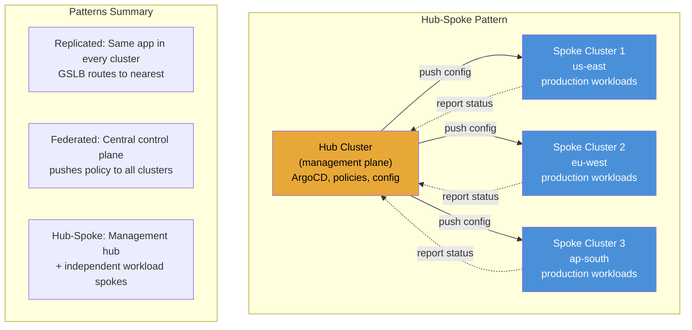
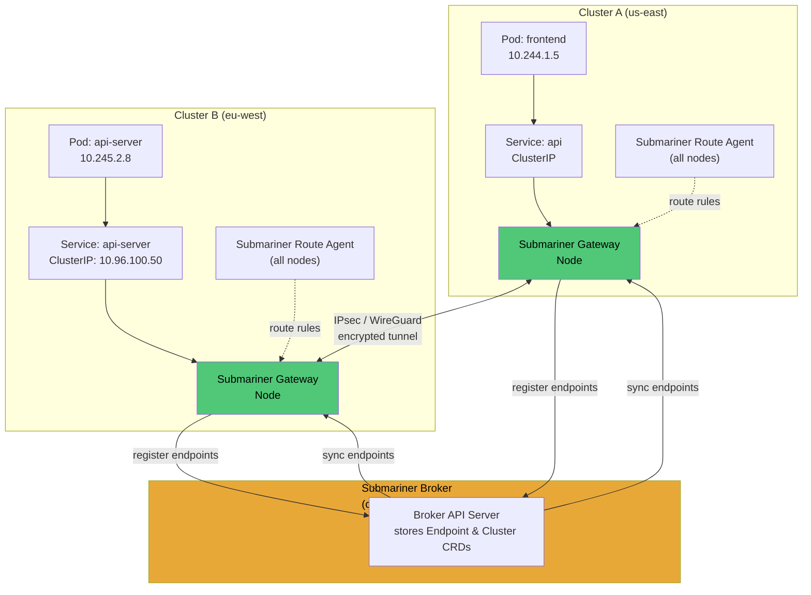

# File 41: Multi-Cluster Kubernetes and Federation

**Topic:** Multi-cluster patterns (replicated, federated, hub-spoke), Submariner, Cilium ClusterMesh, Multi-Cluster Service APIs, Global Server Load Balancing (GSLB), Disaster Recovery patterns, and Liqo

**WHY THIS MATTERS:**
A single Kubernetes cluster is a single point of failure. Production workloads that require high availability across regions, compliance with data residency laws, blast radius reduction, or geo-distributed low-latency access need multi-cluster architectures. Understanding multi-cluster networking, service discovery, and federation patterns is essential for operating Kubernetes at enterprise scale.

---

## Story:

Imagine the **State Bank of India (SBI)** — the largest bank in India with a head office in Mumbai and regional branches across every state.

**Why Multiple Branches (Clusters):** SBI cannot operate from a single building in Mumbai. It needs branches in Delhi for North India customers, Chennai for South India, Kolkata for East India. Each branch is self-sufficient — it can process loans, accept deposits, manage accounts. If the Mumbai building floods, Delhi branch continues operating. This is **blast radius reduction**.

**NEFT/RTGS = Submariner:** When a customer in the Delhi branch sends money to an account in the Chennai branch, the inter-branch transfer system (NEFT/RTGS) routes the transaction across the bank's internal network. Submariner does the same for Kubernetes — it creates encrypted tunnels between clusters so pods in Cluster A can directly reach services in Cluster B using their Kubernetes DNS names.

**Mobile Banking = GSLB (Global Server Load Balancing):** When a customer opens the SBI mobile app, they are automatically routed to the nearest regional server — Delhi customers to the Delhi data center, Mumbai customers to Mumbai. This is GSLB — DNS-based routing that directs users to the closest healthy cluster.

**RBI Policy = Federation:** The Reserve Bank of India (RBI) sets policies that all branches must follow — KYC rules, interest rate bands, reporting requirements. Similarly, federation pushes consistent policies (RBAC, network policies, resource quotas) across all clusters from a central control plane.

**Branch Independence with Central Oversight:** Each SBI branch can operate independently (process local transactions even if Mumbai is down), but the head office maintains oversight (consolidated reporting, policy enforcement). This is the hub-spoke multi-cluster pattern — independent clusters with central management.

---

## Example Block 1 — Why Multi-Cluster?

### Section 1 — Motivations and Trade-offs

**WHY:** Running multiple clusters adds complexity. You should only do it when the benefits clearly outweigh the costs. Understanding the motivations helps you choose the right pattern.

| Motivation | Single Cluster Problem | Multi-Cluster Solution |
|---|---|---|
| **Blast radius** | One bad deployment or API server issue takes down everything | Failure is contained to one cluster |
| **Geo-distribution** | High latency for users far from cluster region | Clusters in multiple regions, users routed to nearest |
| **Compliance/data residency** | EU data stored in US region violates GDPR | Cluster in eu-west handles EU user data |
| **Scalability limits** | Kubernetes control plane struggles beyond ~5000 nodes | Distribute workloads across multiple smaller clusters |
| **Team isolation** | Noisy neighbor — one team's misconfigured CronJob eats all CPU | Each team gets their own cluster |
| **Upgrade safety** | Cluster upgrade affects all workloads | Upgrade one cluster at a time, canary-style |

### Section 2 — Multi-Cluster Patterns

**WHY:** There is no single "right" multi-cluster architecture. The pattern you choose depends on your requirements for independence, consistency, and operational overhead.



| Pattern | Description | Pros | Cons | Best For |
|---|---|---|---|---|
| **Replicated** | Same workload deployed in every cluster. GSLB routes users to nearest healthy cluster. | Simple, independent clusters, easy DR | Data sync is hard, config drift risk | Stateless web tiers, CDN-backed apps |
| **Federated** | Central control plane distributes workloads and policies across clusters. | Consistent policy, single pane of glass | Single point of failure at federation layer | Enterprise with compliance requirements |
| **Hub-Spoke** | Hub cluster manages config/policy, spoke clusters run workloads independently. | Balance of central control and independence | Hub cluster must be HA | Most common production pattern |
| **Mesh** | Every cluster can communicate with every other cluster. No single hub. | Most resilient, no single point of failure | Most complex to operate | Large-scale platforms |

---

## Example Block 2 — Submariner: Cross-Cluster Networking

### Section 1 — How Submariner Works

**WHY:** By default, pods in one Kubernetes cluster cannot reach pods or services in another cluster. Submariner creates encrypted IPsec tunnels between clusters and extends Kubernetes service discovery across clusters using a broker.



### Section 2 — Installing Submariner

```bash
# Install subctl CLI
# SYNTAX: curl -Ls https://get.submariner.io | bash
# EXPECTED OUTPUT: subctl installed in ~/.local/bin
curl -Ls https://get.submariner.io | bash
export PATH=$HOME/.local/bin:$PATH

# Step 1: Deploy the broker in one cluster
# SYNTAX: subctl deploy-broker --kubeconfig <hub-kubeconfig>
# FLAGS: --kubeconfig specifies which cluster to deploy the broker in
# EXPECTED OUTPUT:
# ✔ Deploying the Submariner broker
# ✔ The broker has been deployed
subctl deploy-broker --kubeconfig ~/.kube/cluster-a.yaml

# Step 2: Join clusters to the broker
# SYNTAX: subctl join <broker-info-file> --kubeconfig <cluster-kubeconfig> --clusterid <id>
# FLAGS:
#   --clusterid: unique identifier for this cluster
#   --natt=false: disable NAT traversal if clusters are on same network
#   --cable-driver wireguard: use WireGuard instead of IPsec
# EXPECTED OUTPUT:
# ✔ Joining cluster cluster-b to the broker
# ✔ Submariner is now installed
subctl join broker-info.subm --kubeconfig ~/.kube/cluster-b.yaml --clusterid cluster-b
subctl join broker-info.subm --kubeconfig ~/.kube/cluster-a.yaml --clusterid cluster-a

# Step 3: Verify connectivity
# SYNTAX: subctl verify <kubeconfig-a> <kubeconfig-b> --only connectivity
# EXPECTED OUTPUT:
# ✔ Connected to cluster "cluster-a"
# ✔ Connected to cluster "cluster-b"
# ✔ Ping from cluster-a to cluster-b: SUCCESS
# ✔ Ping from cluster-b to cluster-a: SUCCESS
subctl verify ~/.kube/cluster-a.yaml ~/.kube/cluster-b.yaml --only connectivity

# Step 4: Export a service for cross-cluster discovery
# SYNTAX: subctl export service <service-name> -n <namespace>
# FLAGS: --kubeconfig to specify which cluster owns the service
# EXPECTED OUTPUT:
# ✔ Service "api-server" in namespace "production" exported successfully
subctl export service api-server -n production --kubeconfig ~/.kube/cluster-b.yaml

# Step 5: Access the service from the other cluster
# SYNTAX: The exported service is available at <svc>.<ns>.svc.clusterset.local
# WHY: Submariner extends DNS — services are discoverable across clusters
# using the clusterset.local domain
kubectl exec -it frontend-pod -n production --kubeconfig ~/.kube/cluster-a.yaml -- \
  curl http://api-server.production.svc.clusterset.local:8080/health
# EXPECTED OUTPUT: {"status": "healthy", "cluster": "cluster-b"}
```

### Section 3 — ServiceExport and ServiceImport

```yaml
# service-export.yaml
# WHY: Marks a service for cross-cluster discovery via Submariner
apiVersion: multicluster.x-k8s.io/v1alpha1
kind: ServiceExport
metadata:
  name: api-server
  namespace: production
  # WHY: The service api-server in production namespace will be
  # discoverable from other clusters as api-server.production.svc.clusterset.local
---
# WHY: ServiceImport is automatically created by Submariner in consuming clusters
# You do not create this manually — Submariner's lighthouse component handles it
apiVersion: multicluster.x-k8s.io/v1alpha1
kind: ServiceImport
metadata:
  name: api-server
  namespace: production
spec:
  type: ClusterSetIP
  # WHY: Provides a virtual IP accessible from any cluster in the set
  ports:
    - port: 8080
      protocol: TCP
```

---

## Example Block 3 — Cilium ClusterMesh

### Section 1 — ClusterMesh Architecture

**WHY:** Cilium ClusterMesh provides multi-cluster connectivity using eBPF instead of tunnels. It is lighter weight than Submariner for environments already running Cilium as the CNI. ClusterMesh connects etcd instances across clusters, enabling direct pod-to-pod routing and global service discovery.

```yaml
# cilium-clustermesh-config.yaml
# WHY: Enable ClusterMesh on a Cilium-managed cluster
apiVersion: cilium.io/v2
kind: CiliumClusterwideNetworkPolicy
metadata:
  name: allow-cross-cluster
spec:
  endpointSelector: {}
  ingress:
    - fromEntities:
        - cluster
        - remote-node
        # WHY: Allow traffic from both local cluster and remote cluster nodes
  egress:
    - toEntities:
        - cluster
        - remote-node
---
# Global service annotation
# WHY: Makes a service available across all meshed clusters
apiVersion: v1
kind: Service
metadata:
  name: shared-api
  namespace: production
  annotations:
    service.cilium.io/global: "true"
    # WHY: This annotation tells Cilium to advertise this service to all clusters
    service.cilium.io/shared: "true"
    # WHY: Traffic can be routed to endpoints in any cluster
    # If "false", remote clusters know about it but route only to local endpoints
spec:
  selector:
    app: shared-api
  ports:
    - port: 8080
      targetPort: 8080
```

```bash
# Enable ClusterMesh with Cilium CLI
# SYNTAX: cilium clustermesh enable --context <kube-context>
# FLAGS: --service-type LoadBalancer for cloud, NodePort for bare metal
# EXPECTED OUTPUT:
# ✔ ClusterMesh enabled
cilium clustermesh enable --context cluster-a --service-type LoadBalancer
cilium clustermesh enable --context cluster-b --service-type LoadBalancer

# Connect two clusters
# SYNTAX: cilium clustermesh connect --context <ctx-a> --destination-context <ctx-b>
# EXPECTED OUTPUT:
# ✔ Connected cluster cluster-a to cluster-b
cilium clustermesh connect --context cluster-a --destination-context cluster-b

# Verify
# SYNTAX: cilium clustermesh status --context <context>
# EXPECTED OUTPUT:
# ✔ Cluster access information is available
# ✔ Remote cluster "cluster-b" is connected
cilium clustermesh status --context cluster-a
```

---

## Example Block 4 — Global Server Load Balancing (GSLB)

### Section 1 — DNS-Based Global Load Balancing

**WHY:** GSLB routes users to the nearest healthy cluster based on geographic proximity, latency, or health checks. Unlike Submariner (pod-to-pod networking), GSLB operates at the DNS/ingress level for external client traffic.

```yaml
# gslb-with-k8gb.yaml
# WHY: k8gb is an open-source Kubernetes-native GSLB solution
apiVersion: k8gb.absa.oss/v1beta1
kind: Gslb
metadata:
  name: api-gslb
  namespace: production
spec:
  ingress:
    ingressClassName: nginx
    rules:
      - host: api.example.com
        http:
          paths:
            - path: /
              pathType: Prefix
              backend:
                service:
                  name: api-server
                  port:
                    number: 8080
  strategy:
    type: roundRobin
    # WHY: Distribute traffic evenly across clusters
    # Options: roundRobin, failover, geoip
    splitBrainThresholdSeconds: 300
    # WHY: If a cluster loses contact with others for 5 min,
    # it stops advertising itself to prevent split-brain
    dnsTtlSeconds: 30
    # WHY: Low TTL for faster failover (clients re-resolve DNS every 30s)
---
# Failover strategy
apiVersion: k8gb.absa.oss/v1beta1
kind: Gslb
metadata:
  name: api-gslb-failover
  namespace: production
spec:
  ingress:
    ingressClassName: nginx
    rules:
      - host: api.example.com
        http:
          paths:
            - path: /
              pathType: Prefix
              backend:
                service:
                  name: api-server
                  port:
                    number: 8080
  strategy:
    type: failover
    # WHY: Active-passive — all traffic goes to primary; secondary only on failure
    primaryGeoTag: "us-east-1"
    # WHY: This tag identifies the primary cluster
    dnsTtlSeconds: 30
```

### Section 2 — External DNS Integration

```yaml
# external-dns-multi-cluster.yaml
# WHY: External DNS automatically creates DNS records pointing to cluster ingresses
apiVersion: apps/v1
kind: Deployment
metadata:
  name: external-dns
  namespace: kube-system
spec:
  replicas: 1
  selector:
    matchLabels:
      app: external-dns
  template:
    metadata:
      labels:
        app: external-dns
    spec:
      containers:
        - name: external-dns
          image: registry.k8s.io/external-dns/external-dns:v0.14.0
          args:
            - --source=ingress
            - --source=service
            # WHY: Watch both Ingress and Service resources for DNS records
            - --domain-filter=example.com
            # WHY: Only manage DNS records under example.com
            - --provider=aws
            # WHY: Integrate with Route53 (options: cloudflare, google, azure, etc.)
            - --policy=upsert-only
            # WHY: Only create/update records, never delete — safety measure
            - --registry=txt
            - --txt-owner-id=cluster-us-east
            # WHY: Each cluster has a unique owner ID to prevent clusters from
            # overwriting each other's DNS records
```

---

## Example Block 5 — Disaster Recovery Patterns

### Section 1 — DR Strategies

**WHY:** Disaster recovery in multi-cluster Kubernetes depends on your Recovery Time Objective (RTO) and Recovery Point Objective (RPO). Different strategies trade cost for recovery speed.

| Strategy | RTO | RPO | Cost | Description |
|---|---|---|---|---|
| **Active-Active** | ~0 (instant) | ~0 | Highest | Both clusters serve traffic; GSLB distributes load |
| **Active-Passive (Hot Standby)** | Minutes | Minutes | High | Standby cluster running but not serving; GSLB failover |
| **Active-Passive (Warm Standby)** | 10-30 min | Hours | Medium | Standby cluster scaled down; needs scale-up on failover |
| **Active-Passive (Cold Standby)** | Hours | Hours | Lowest | Standby cluster off; needs full provisioning on failover |
| **Backup-Restore** | Hours-Days | Depends on backup frequency | Lowest | Restore from Velero backup to a new cluster |

### Section 2 — Velero for Multi-Cluster Backup

```yaml
# velero-schedule.yaml
# WHY: Automated backups for disaster recovery across clusters
apiVersion: velero.io/v1
kind: Schedule
metadata:
  name: daily-production-backup
  namespace: velero
spec:
  schedule: "0 2 * * *"
  # WHY: Daily backup at 2 AM
  template:
    includedNamespaces:
      - production
      - databases
      # WHY: Only back up critical namespaces
    excludedResources:
      - events
      - events.events.k8s.io
      # WHY: Events are noisy and not needed for restore
    storageLocation: default
    # WHY: Points to the S3-compatible backup storage
    volumeSnapshotLocations:
      - default
      # WHY: PV snapshots go to cloud provider's snapshot API
    ttl: 720h
    # WHY: Keep backups for 30 days
    snapshotMoveData: true
    # WHY: Move volume snapshot data to backup storage location
    # for cross-region/cross-cloud restore capability
```

```bash
# Install Velero
# SYNTAX: velero install --provider <provider> --bucket <bucket> --secret-file <creds>
# FLAGS:
#   --provider: aws, gcp, azure
#   --bucket: S3 bucket for backup storage
#   --backup-location-config: region, s3Url, etc.
#   --use-volume-snapshots: enable PV snapshots
# EXPECTED OUTPUT:
# Velero is installed! ✔
velero install \
  --provider aws \
  --bucket velero-backups-prod \
  --secret-file ./credentials-velero \
  --backup-location-config region=us-east-1 \
  --use-volume-snapshots=true \
  --plugins velero/velero-plugin-for-aws:v1.9.0

# Create a manual backup
# SYNTAX: velero backup create <name> --include-namespaces <ns>
# EXPECTED OUTPUT:
# Backup request "production-dr-backup" submitted successfully
velero backup create production-dr-backup --include-namespaces production

# Check backup status
# SYNTAX: velero backup get
# EXPECTED OUTPUT:
# NAME                     STATUS      ERRORS   WARNINGS   CREATED                         EXPIRES
# production-dr-backup     Completed   0        0          2026-03-16 02:00:00 +0000 UTC   29d
velero backup get

# Restore to another cluster (using the same backup storage)
# SYNTAX: velero restore create --from-backup <backup-name>
# FLAGS: --namespace-mappings to rename namespaces during restore
# EXPECTED OUTPUT:
# Restore request "production-restore" submitted successfully
velero restore create production-restore \
  --from-backup production-dr-backup \
  --namespace-mappings production:production
```

---

## Example Block 6 — Liqo: Virtual Clusters Across Boundaries

### Section 1 — Liqo Architecture

**WHY:** Liqo is an open-source project that creates virtual nodes in your cluster representing remote clusters. When you schedule pods, Kubernetes can transparently place them in remote clusters as if they were local nodes. This is the simplest multi-cluster experience — no changes to your deployments, services, or workflows.

```yaml
# liqo-peer-config.yaml
# WHY: Liqo creates a virtual node for each peered remote cluster
# Pods scheduled on the virtual node run in the remote cluster
apiVersion: v1
kind: Namespace
metadata:
  name: liqo-demo
  labels:
    liqo.io/scheduling-enabled: "true"
    # WHY: Allow Liqo to schedule pods from this namespace on remote clusters
---
apiVersion: offloading.liqo.io/v1beta1
kind: NamespaceOffloading
metadata:
  name: offloading
  namespace: liqo-demo
spec:
  namespaceMappingStrategy: EnforceSameName
  # WHY: Use the same namespace name in the remote cluster
  podOffloadingStrategy: LocalAndRemote
  # WHY: Pods can run both locally and on remote clusters
  # Options: Local, Remote, LocalAndRemote
  clusterSelector:
    nodeSelectorTerms:
      - matchExpressions:
          - key: liqo.io/provider
            operator: In
            values:
              - aws
              - gcp
            # WHY: Only offload to clusters running on AWS or GCP
```

```bash
# Install Liqo
# SYNTAX: liqoctl install kind --cluster-name <name>
# EXPECTED OUTPUT: Liqo installed successfully
curl -sL https://get.liqo.io | bash
liqoctl install kind --cluster-name cluster-a
liqoctl install kind --cluster-name cluster-b

# Peer two clusters
# SYNTAX: liqoctl peer --remoteauth <auth-url> --remotecluster <id>
# EXPECTED OUTPUT: Peering established with cluster-b
liqoctl generate peer-command --kubeconfig ~/.kube/cluster-b.yaml
# Run the generated command on cluster-a

# Verify virtual nodes
# SYNTAX: kubectl get nodes
# EXPECTED OUTPUT:
# NAME                  STATUS   ROLES           AGE   VERSION
# cluster-a-control     Ready    control-plane   1h    v1.29.0
# cluster-a-worker      Ready    <none>          1h    v1.29.0
# liqo-cluster-b        Ready    agent           5m    v1.29.0    <-- virtual node!
kubectl get nodes

# Pods scheduled to the virtual node run in cluster-b transparently
# SYNTAX: kubectl get pods -o wide
# EXPECTED OUTPUT:
# NAME          READY   STATUS    NODE               AGE
# web-app-xxx   1/1     Running   cluster-a-worker   10m
# web-app-yyy   1/1     Running   liqo-cluster-b     10m   <-- runs in cluster-b!
kubectl get pods -o wide -n liqo-demo
```

---

## Example Block 7 — Multi-Cluster Service APIs

### Section 1 — KEP-1645: Multi-Cluster Services API

**WHY:** The Kubernetes Multi-Cluster Services API (MCS API) is the official upstream standard for cross-cluster service discovery. It defines `ServiceExport` and `ServiceImport` CRDs that any multi-cluster solution (Submariner, Cilium, GKE) can implement, providing a vendor-neutral abstraction.

```yaml
# mcs-api-example.yaml
# WHY: Standard Kubernetes API for cross-cluster service discovery

# In Cluster B: Export the service
apiVersion: multicluster.x-k8s.io/v1alpha1
kind: ServiceExport
metadata:
  name: payment-service
  namespace: production
  # WHY: This tells the MCS controller "make this service available to other clusters"

---
# In Cluster A: The ServiceImport is auto-created by the MCS controller
# WHY: ServiceImport provides a ClusterSetIP or headless entry point
# to reach the service in Cluster B
# DNS: payment-service.production.svc.clusterset.local
apiVersion: multicluster.x-k8s.io/v1alpha1
kind: ServiceImport
metadata:
  name: payment-service
  namespace: production
spec:
  type: ClusterSetIP
  ports:
    - port: 443
      protocol: TCP
```

```bash
# From Cluster A, access a service exported from Cluster B
# SYNTAX: curl <service>.<namespace>.svc.clusterset.local
# WHY: The .clusterset.local domain is the MCS API standard for cross-cluster DNS
# EXPECTED OUTPUT: Response from the payment-service running in Cluster B
kubectl exec -it debug-pod -- curl http://payment-service.production.svc.clusterset.local:443/health
```

---

## Key Takeaways

1. **Multi-cluster is not optional at scale** — blast radius reduction, geo-distribution, compliance, and scalability limits all drive the need for multiple clusters. The question is not "if" but "which pattern."

2. **Three main patterns** exist: Replicated (same workload everywhere, GSLB routes), Federated (central control plane pushes policy), and Hub-Spoke (management hub + independent workload spokes). Hub-spoke is the most common in production.

3. **Submariner** provides cross-cluster pod-to-pod networking via encrypted tunnels and extends Kubernetes service discovery with the `clusterset.local` DNS domain. It implements the Multi-Cluster Services API standard.

4. **Cilium ClusterMesh** is a lighter alternative for environments already using Cilium as the CNI. It uses eBPF for efficient cross-cluster routing without tunneling overhead.

5. **GSLB (Global Server Load Balancing)** routes external client traffic to the nearest healthy cluster using DNS. Solutions like k8gb provide Kubernetes-native GSLB with health checks, geographic routing, and failover.

6. **The Multi-Cluster Services API** (ServiceExport/ServiceImport) is the upstream Kubernetes standard for cross-cluster service discovery. Prefer this vendor-neutral API over solution-specific abstractions.

7. **Disaster recovery** strategies range from Active-Active (instant failover, highest cost) to Backup-Restore (hours to recover, lowest cost). Choose based on your RTO/RPO requirements and budget.

8. **Velero** is the standard tool for Kubernetes backup and restore. It backs up both Kubernetes resources and persistent volume data, enabling cross-cluster and cross-region disaster recovery.

9. **Liqo** provides the simplest multi-cluster experience by creating virtual nodes — the Kubernetes scheduler places pods on remote clusters transparently, requiring no changes to workload manifests.

10. **Pod Disruption Budgets, health checks, and GSLB health probes** are the three pillars of multi-cluster resilience. Without them, failover is either too slow (no health probes) or too disruptive (no PDBs).
