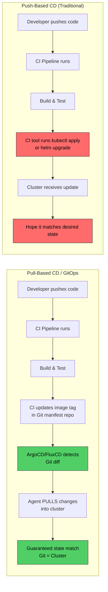
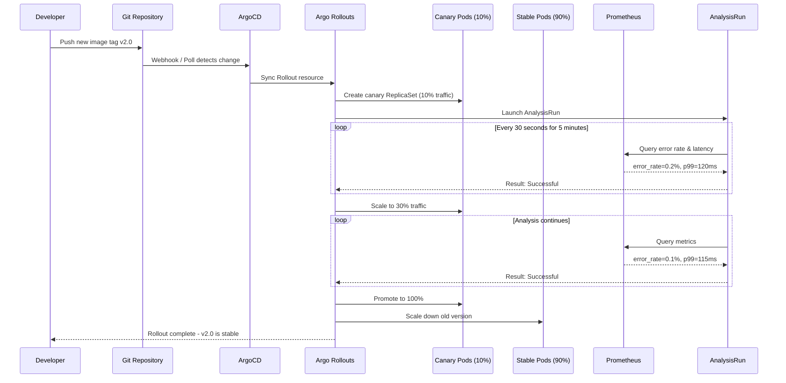

# File 43: CI/CD with Kubernetes

**Topic:** Continuous Integration and Continuous Delivery/Deployment pipelines for Kubernetes workloads — from code commit to production rollout.

**WHY THIS MATTERS:** Your application code is only as reliable as your delivery pipeline. A broken or manual deployment process leads to human errors, slow rollbacks, and weekend outages. Mastering CI/CD on Kubernetes means you ship faster, safer, and with confidence that every release is reproducible.

---

## Story:

Think of a **Bollywood Film Production Pipeline**.

When a director shoots a film, the raw footage goes through a strict pipeline: **shooting** (writing code), **editing** (linting, testing), **color grading** (building container images), **censor board review** (security scanning), and finally **distribution to theaters** (deployment).

Now, there are two ways films reach audiences:

1. **Push-based (Traditional Distribution):** The producer physically sends film reels to each theater across India. The producer decides when and where. If a reel is damaged, the producer must recall and resend. This is **push-based CD** — your CI pipeline directly pushes deployments to the cluster using `kubectl apply` or Helm.

2. **Pull-based (OTT Platform / GitOps):** Netflix or Hotstar automatically **pulls** the latest content from the studio's catalog. The platform continuously checks "is there a new release?" and syncs automatically. This is **GitOps** — tools like ArgoCD or FluxCD watch your Git repository and pull changes into the cluster.

And for risky releases? A smart producer does a **limited release in just 3 cities** (Mumbai, Delhi, Chennai) before going nationwide. If audience feedback is bad, the film gets pulled before it embarrasses the studio nationwide. This is **canary deployment** — release to 5-10% of traffic first, analyze metrics, then promote or rollback.

---

## Example Block 1 — CI Pipeline Stages

### Section 1 — The Five Stages of a Container CI Pipeline

Every CI pipeline for Kubernetes follows roughly the same stages. Think of it as the film going through post-production.

```
Code Commit → Lint → Unit Test → Build Image → Security Scan → Push to Registry
```

**WHY:** Each stage acts as a quality gate. A linting failure is caught in seconds (not after a 10-minute build). A security scan catches vulnerabilities before the image ever touches production.

```yaml
# WHY: A GitLab CI pipeline definition showing all 5 stages
# Each stage runs only if the previous one passes
stages:
  - lint
  - test
  - build
  - scan
  - push

variables:
  IMAGE_NAME: registry.example.com/myapp  # WHY: centralize image name for reuse
  IMAGE_TAG: $CI_COMMIT_SHORT_SHA          # WHY: tag by commit SHA for traceability

lint:
  stage: lint
  image: golangci/golangci-lint:latest     # WHY: use official linter image
  script:
    - golangci-lint run ./...              # WHY: catch code quality issues early

unit-test:
  stage: test
  image: golang:1.22
  script:
    - go test -v -race -coverprofile=coverage.out ./...  # WHY: -race detects data races
  artifacts:
    reports:
      coverage_report:
        coverage_format: cobertura
        path: coverage.out                 # WHY: store coverage for merge request diffs

build-image:
  stage: build
  image:
    name: gcr.io/kaniko-project/executor:latest  # WHY: Kaniko builds without Docker daemon
    entrypoint: [""]                               # WHY: override default entrypoint
  script:
    - >
      /kaniko/executor
      --context $CI_PROJECT_DIR
      --dockerfile $CI_PROJECT_DIR/Dockerfile
      --destination $IMAGE_NAME:$IMAGE_TAG
      --cache=true                         # WHY: layer caching speeds up builds
      --cache-repo $IMAGE_NAME/cache       # WHY: remote cache for distributed runners

scan-image:
  stage: scan
  image:
    name: aquasec/trivy:latest
    entrypoint: [""]
  script:
    - trivy image --exit-code 1 --severity HIGH,CRITICAL $IMAGE_NAME:$IMAGE_TAG
    # WHY: --exit-code 1 fails the pipeline on HIGH/CRITICAL CVEs
    # WHY: this prevents vulnerable images from reaching production

push-to-prod-registry:
  stage: push
  image: gcr.io/go-containerregistry/crane:latest  # WHY: crane copies images without pulling
  script:
    - crane cp $IMAGE_NAME:$IMAGE_TAG $IMAGE_NAME:latest
    # WHY: promote the scanned image to "latest" tag only after all checks pass
  only:
    - main                                 # WHY: only promote from main branch
```

### Section 2 — Kaniko: Building Images Without Docker

**WHY:** In Kubernetes, your CI runners are pods. Pods don't have a Docker daemon. Kaniko solves this by building container images entirely in userspace — no privileged access needed.

```yaml
# WHY: Tekton Task that uses Kaniko to build and push an image
# Tekton is a Kubernetes-native CI/CD framework
apiVersion: tekton.dev/v1
kind: Task
metadata:
  name: kaniko-build
  namespace: ci-pipelines            # WHY: isolate CI workloads in their own namespace
spec:
  params:
    - name: IMAGE                    # WHY: parameterize so the task is reusable
      description: Image URL to push to
    - name: DOCKERFILE
      default: ./Dockerfile
  workspaces:
    - name: source                   # WHY: workspace holds the cloned source code
  steps:
    - name: build-and-push
      image: gcr.io/kaniko-project/executor:latest
      args:
        - --dockerfile=$(params.DOCKERFILE)
        - --context=$(workspaces.source.path)
        - --destination=$(params.IMAGE)
        - --cache=true               # WHY: reuse cached layers for faster builds
        - --snapshot-mode=redo       # WHY: "redo" mode is slower but more accurate
      securityContext:
        runAsUser: 0                 # WHY: Kaniko needs root to manipulate filesystem layers
```

```
SYNTAX:
  /kaniko/executor [flags]

FLAGS:
  --context           Path to build context (source code directory)
  --dockerfile        Path to the Dockerfile
  --destination       Registry/image:tag to push to
  --cache             Enable layer caching (true/false)
  --cache-repo        Remote repository for storing cached layers
  --snapshot-mode     "full" (default, safe) or "redo" (faster for simple Dockerfiles)
  --skip-tls-verify   Skip TLS verification (only for testing)

EXPECTED OUTPUT:
  INFO[0001] Resolved base name golang:1.22 to golang:1.22
  INFO[0002] Retrieving image manifest golang:1.22
  INFO[0010] Built cross stage deps: map[]
  INFO[0015] Unpacking rootfs as cmd COPY . . requires it
  INFO[0025] COPY . .
  INFO[0030] RUN go build -o /app .
  INFO[0055] Pushing image to registry.example.com/myapp:abc1234
  INFO[0060] Pushed image to 1 destinations
```

---

## Example Block 2 — Tekton Pipelines (Kubernetes-Native CI)

### Section 3 — Why Tekton Over Jenkins

**WHY:** Jenkins runs as a monolithic server. Tekton runs each CI step as a separate container in a Kubernetes pod — it scales with your cluster, uses Kubernetes RBAC, and stores results as Kubernetes resources.

```yaml
# WHY: A complete Tekton Pipeline with 4 tasks chained together
apiVersion: tekton.dev/v1
kind: Pipeline
metadata:
  name: build-deploy-pipeline
  namespace: ci-pipelines
spec:
  params:
    - name: repo-url                  # WHY: parameterize for reuse across repos
    - name: revision
      default: main
    - name: image
  workspaces:
    - name: shared-workspace          # WHY: tasks share source code via workspace
    - name: docker-credentials        # WHY: registry auth for pushing images
  tasks:
    # WHY: Task 1 — Clone the source code
    - name: fetch-source
      taskRef:
        name: git-clone               # WHY: use Tekton Catalog's git-clone task
      params:
        - name: url
          value: $(params.repo-url)
        - name: revision
          value: $(params.revision)
      workspaces:
        - name: output
          workspace: shared-workspace

    # WHY: Task 2 — Run tests (depends on fetch-source)
    - name: run-tests
      taskRef:
        name: golang-test
      runAfter:
        - fetch-source                # WHY: explicit dependency ordering
      workspaces:
        - name: source
          workspace: shared-workspace

    # WHY: Task 3 — Build image with Kaniko (depends on tests passing)
    - name: build-image
      taskRef:
        name: kaniko-build
      runAfter:
        - run-tests
      params:
        - name: IMAGE
          value: $(params.image):$(params.revision)
      workspaces:
        - name: source
          workspace: shared-workspace

    # WHY: Task 4 — Update GitOps repo (depends on build)
    - name: update-gitops
      taskRef:
        name: update-manifest         # WHY: update image tag in deployment manifests
      runAfter:
        - build-image
      params:
        - name: image-tag
          value: $(params.revision)
```

```
SYNTAX:
  kubectl get pipelineruns -n ci-pipelines

EXPECTED OUTPUT:
  NAME                            STARTED        DURATION   STATUS
  build-deploy-run-abc12          2 minutes ago  3m45s      Succeeded
  build-deploy-run-xyz99          1 hour ago     4m12s      Succeeded
  build-deploy-run-fail01         2 hours ago    1m30s      Failed

SYNTAX:
  tkn pipelinerun logs build-deploy-run-abc12 -n ci-pipelines

FLAGS:
  -f        Follow logs in real-time
  -a        Show logs for all tasks (not just the latest)
  --last    Show logs for the last run

EXPECTED OUTPUT:
  [fetch-source : clone] Cloning into '/workspace/output'...
  [run-tests : test] ok   myapp/handlers  0.345s
  [run-tests : test] ok   myapp/models    0.123s
  [build-image : build-and-push] INFO Pushing image to registry.example.com/myapp:main
  [update-gitops : update] Updated image tag to main in gitops repo
```

---

## Example Block 3 — Push-Based vs Pull-Based CD

### Section 4 — Understanding the Two Approaches



**WHY Push-Based is Risky:**
- CI pipeline needs cluster credentials (security risk)
- If someone manually changes the cluster, CI doesn't know — **drift**
- No single source of truth

**WHY Pull-Based (GitOps) is Better:**
- Git is the single source of truth
- The cluster agent pulls from Git — no credentials exposed in CI
- Automatic drift detection and correction
- Full audit trail via Git history

### Section 5 — ArgoCD Setup

```yaml
# WHY: ArgoCD Application resource — tells ArgoCD what to sync and where
apiVersion: argoproj.io/v1alpha1
kind: Application
metadata:
  name: myapp-production
  namespace: argocd                     # WHY: ArgoCD runs in its own namespace
spec:
  project: default
  source:
    repoURL: https://github.com/org/k8s-manifests.git  # WHY: Git is the source of truth
    targetRevision: main                # WHY: track main branch for production
    path: environments/production       # WHY: path within repo for this environment
    helm:                               # WHY: if using Helm charts
      valueFiles:
        - values-production.yaml        # WHY: environment-specific overrides
  destination:
    server: https://kubernetes.default.svc  # WHY: deploy to the local cluster
    namespace: production
  syncPolicy:
    automated:
      prune: true                       # WHY: delete resources removed from Git
      selfHeal: true                    # WHY: revert manual changes to match Git
    syncOptions:
      - CreateNamespace=true            # WHY: create namespace if it doesn't exist
      - PrunePropagationPolicy=foreground  # WHY: wait for dependents to be deleted
    retry:
      limit: 5                          # WHY: retry on transient failures
      backoff:
        duration: 5s
        factor: 2
        maxDuration: 3m
```

```
SYNTAX:
  argocd app get myapp-production

EXPECTED OUTPUT:
  Name:               myapp-production
  Project:            default
  Server:             https://kubernetes.default.svc
  Namespace:          production
  URL:                https://argocd.example.com/applications/myapp-production
  Repo:               https://github.com/org/k8s-manifests.git
  Target:             main
  Path:               environments/production
  SyncWindow:         Sync Allowed
  Sync Policy:        Automated (Prune, SelfHeal)
  Sync Status:        Synced to main (abc1234)
  Health Status:      Healthy

SYNTAX:
  argocd app sync myapp-production

FLAGS:
  --force       Force sync even if already synced
  --prune       Remove resources not in Git
  --dry-run     Show what would change without applying
  --revision    Sync to a specific Git commit

EXPECTED OUTPUT:
  TIMESTAMP                  GROUP        KIND         NAMESPACE    NAME           STATUS   HEALTH   HOOK  MESSAGE
  2025-03-15T10:30:00+05:30             Service      production   myapp          Synced   Healthy         service/myapp unchanged
  2025-03-15T10:30:01+05:30  apps        Deployment   production   myapp          Synced   Healthy         deployment.apps/myapp configured
  2025-03-15T10:30:02+05:30             ConfigMap    production   myapp-config   Synced                    configmap/myapp-config unchanged

  Message: successfully synced (all tasks run)
```

### Section 6 — FluxCD: The Alternative GitOps Engine

```yaml
# WHY: FluxCD uses native Kubernetes resources instead of a web UI
# GitRepository tells Flux where to find manifests
apiVersion: source.toolkit.fluxcd.io/v1
kind: GitRepository
metadata:
  name: myapp-manifests
  namespace: flux-system               # WHY: Flux components run in flux-system
spec:
  interval: 1m                         # WHY: check for Git changes every minute
  url: https://github.com/org/k8s-manifests.git
  ref:
    branch: main
  secretRef:
    name: git-credentials              # WHY: auth for private repos
---
# WHY: Kustomization tells Flux what path to apply and how
apiVersion: kustomize.toolkit.fluxcd.io/v1
kind: Kustomization
metadata:
  name: myapp-production
  namespace: flux-system
spec:
  interval: 5m                         # WHY: reconcile every 5 minutes
  sourceRef:
    kind: GitRepository
    name: myapp-manifests
  path: ./environments/production      # WHY: path within the Git repo
  prune: true                          # WHY: garbage collect removed resources
  healthChecks:
    - apiVersion: apps/v1
      kind: Deployment
      name: myapp
      namespace: production            # WHY: wait for deployment to be healthy
  timeout: 3m                          # WHY: fail if health check doesn't pass in 3m
```

---

## Example Block 4 — Argo Rollouts: Canary and Blue-Green

### Section 7 — Canary Deployment with Automated Analysis

**WHY:** A Deployment does rolling updates, but it cannot pause at 10%, run metrics analysis, and auto-rollback. Argo Rollouts adds this intelligence — like releasing a film in 3 cities before going nationwide.



```yaml
# WHY: Argo Rollout resource — replaces Deployment for advanced rollout strategies
apiVersion: argoproj.io/v1alpha1
kind: Rollout
metadata:
  name: myapp
  namespace: production
spec:
  replicas: 10                          # WHY: total desired pods across stable + canary
  revisionHistoryLimit: 3               # WHY: keep 3 old ReplicaSets for quick rollback
  selector:
    matchLabels:
      app: myapp
  template:
    metadata:
      labels:
        app: myapp
    spec:
      containers:
        - name: myapp
          image: registry.example.com/myapp:v2.0
          ports:
            - containerPort: 8080
          resources:
            requests:
              cpu: 100m
              memory: 128Mi
            limits:
              cpu: 500m
              memory: 256Mi
          readinessProbe:               # WHY: canary must pass readiness before receiving traffic
            httpGet:
              path: /healthz
              port: 8080
            initialDelaySeconds: 5
            periodSeconds: 5
  strategy:
    canary:
      canaryService: myapp-canary       # WHY: separate service for canary pods
      stableService: myapp-stable       # WHY: separate service for stable pods
      trafficRouting:
        istio:                          # WHY: use Istio for fine-grained traffic splitting
          virtualServices:
            - name: myapp-vsvc
              routes:
                - primary
      steps:
        # WHY: Step 1 — Send 10% traffic to canary, pause for analysis
        - setWeight: 10
        - pause:
            duration: 5m               # WHY: wait 5 minutes for metrics to accumulate
        # WHY: Step 2 — Run automated analysis
        - analysis:
            templates:
              - templateName: success-rate-analysis
            args:
              - name: service-name
                value: myapp-canary
        # WHY: Step 3 — If analysis passes, increase to 30%
        - setWeight: 30
        - pause:
            duration: 5m
        # WHY: Step 4 — Another analysis round at higher traffic
        - analysis:
            templates:
              - templateName: success-rate-analysis
            args:
              - name: service-name
                value: myapp-canary
        # WHY: Step 5 — Scale to 60%
        - setWeight: 60
        - pause:
            duration: 3m
        # WHY: Step 6 — Final promotion to 100% happens automatically
      rollbackWindow:
        revisions: 2                   # WHY: auto-rollback uses one of the last 2 revisions
---
# WHY: AnalysisTemplate defines what metrics to check and what thresholds to enforce
apiVersion: argoproj.io/v1alpha1
kind: AnalysisTemplate
metadata:
  name: success-rate-analysis
  namespace: production
spec:
  args:
    - name: service-name
  metrics:
    - name: success-rate
      interval: 30s                    # WHY: query Prometheus every 30 seconds
      count: 10                        # WHY: run 10 measurements total
      successCondition: result[0] >= 0.95  # WHY: success rate must be >= 95%
      failureLimit: 2                  # WHY: allow at most 2 failed measurements
      provider:
        prometheus:
          address: http://prometheus.monitoring:9090
          query: |
            sum(rate(http_requests_total{
              service="{{args.service-name}}",
              status=~"2.."
            }[2m])) /
            sum(rate(http_requests_total{
              service="{{args.service-name}}"
            }[2m]))
            # WHY: calculates the ratio of 2xx responses to total responses
    - name: latency-p99
      interval: 30s
      count: 10
      successCondition: result[0] <= 0.5   # WHY: p99 latency must be under 500ms
      failureLimit: 2
      provider:
        prometheus:
          address: http://prometheus.monitoring:9090
          query: |
            histogram_quantile(0.99,
              sum(rate(http_request_duration_seconds_bucket{
                service="{{args.service-name}}"
              }[2m])) by (le))
```

```
SYNTAX:
  kubectl argo rollouts get rollout myapp -n production

FLAGS:
  --watch     Watch rollout progress in real-time
  -w          Short form of --watch

EXPECTED OUTPUT:
  Name:            myapp
  Namespace:       production
  Status:          ॥ Paused
  Message:         CanaryPauseStep
  Strategy:        Canary
    Step:          2/6
    SetWeight:     10
    ActualWeight:  10
  Images:
    registry.example.com/myapp:v1.9 (stable)
    registry.example.com/myapp:v2.0 (canary)
  Replicas:
    Desired:   10
    Current:   11
    Updated:   1
    Ready:     11
    Available: 11

SYNTAX:
  kubectl argo rollouts promote myapp -n production

EXPECTED OUTPUT:
  rollout 'myapp' promoted

SYNTAX:
  kubectl argo rollouts abort myapp -n production

EXPECTED OUTPUT:
  rollout 'myapp' aborted
```

---

## Example Block 5 — Image Signing and Promotion

### Section 8 — Signing Images with Cosign

**WHY:** Anyone can push an image to a registry. Without signatures, you cannot verify that the image was built by your CI pipeline and not injected by an attacker. Cosign provides cryptographic proof of image provenance.

```yaml
# WHY: Tekton Task to sign images after build
apiVersion: tekton.dev/v1
kind: Task
metadata:
  name: cosign-sign
  namespace: ci-pipelines
spec:
  params:
    - name: IMAGE
      description: Fully qualified image reference with digest
  steps:
    - name: sign
      image: gcr.io/projectsigstore/cosign:latest
      env:
        - name: COSIGN_EXPERIMENTAL
          value: "1"                   # WHY: enable keyless signing with OIDC
      script: |
        #!/bin/sh
        # WHY: Sign the image using keyless mode (Sigstore/Fulcio)
        cosign sign --yes $(params.IMAGE)

        # WHY: Attach an SBOM (Software Bill of Materials) to the image
        cosign attach sbom --sbom sbom.json $(params.IMAGE)

        # WHY: Verify the signature immediately after signing
        cosign verify $(params.IMAGE) | jq .
```

### Section 9 — Image Promotion Across Environments

**WHY:** Never rebuild images for different environments. Build once, scan once, sign once, then promote the exact same image through dev, staging, and production. This guarantees what you tested is what runs in production.

```yaml
# WHY: Kyverno policy to enforce only signed images in production
apiVersion: kyverno.io/v1
kind: ClusterPolicy
metadata:
  name: verify-image-signature
spec:
  validationFailureAction: Enforce     # WHY: block unsigned images, don't just warn
  background: false
  rules:
    - name: check-cosign-signature
      match:
        any:
          - resources:
              kinds:
                - Pod
              namespaces:
                - production           # WHY: enforce only in production namespace
      verifyImages:
        - imageReferences:
            - "registry.example.com/*"  # WHY: check all images from our registry
          attestors:
            - entries:
                - keyless:
                    subject: "https://github.com/org/*"
                    issuer: "https://token.actions.githubusercontent.com"
                    # WHY: verify the image was signed by our GitHub Actions pipeline
```

```
SYNTAX:
  cosign sign <image-reference>

FLAGS:
  --key              Path to private key (for key-based signing)
  --yes              Skip confirmation prompt
  --upload=false     Sign without uploading to transparency log
  --tlog-upload      Upload signature to Rekor transparency log (default: true)

EXPECTED OUTPUT:
  Generating ephemeral keys...
  Retrieving signed certificate...

  Successfully verified SCT...
  tlog entry created with index: 12345678
  Pushing signature to: registry.example.com/myapp:sha256-abc123.sig

SYNTAX:
  cosign verify <image-reference>

EXPECTED OUTPUT:
  Verification for registry.example.com/myapp:v2.0 --
  The following checks were performed on each of these signatures:
    - The cosign claims were validated
    - Existence of the claims in the transparency log was verified offline
    - The code-signing certificate was verified using trusted certificate authority

  [{"critical":{"identity":{"docker-reference":"registry.example.com/myapp"},
    "image":{"docker-manifest-digest":"sha256:abc123..."},
    "type":"cosign container image signature"},
    "optional":{"Subject":"https://github.com/org/myapp/.github/workflows/ci.yml@refs/heads/main"}}]
```

---

## Example Block 6 — Blue-Green Deployment

### Section 10 — Blue-Green Strategy with Argo Rollouts

**WHY:** Canary gradually shifts traffic. Blue-Green is an all-or-nothing switch — run the new version alongside the old, verify it fully, then flip 100% of traffic in one go. Useful when you cannot test with partial traffic (database migrations, API breaking changes).

```yaml
# WHY: Blue-Green Rollout — maintains two full environments
apiVersion: argoproj.io/v1alpha1
kind: Rollout
metadata:
  name: myapp-bluegreen
  namespace: production
spec:
  replicas: 5
  selector:
    matchLabels:
      app: myapp
  template:
    metadata:
      labels:
        app: myapp
    spec:
      containers:
        - name: myapp
          image: registry.example.com/myapp:v2.0
          ports:
            - containerPort: 8080
  strategy:
    blueGreen:
      activeService: myapp-active       # WHY: production traffic goes here
      previewService: myapp-preview     # WHY: preview/testing traffic goes here
      autoPromotionEnabled: false       # WHY: require manual approval before switching
      scaleDownDelaySeconds: 300        # WHY: keep old version for 5 min after switch
      prePromotionAnalysis:             # WHY: run analysis BEFORE promoting
        templates:
          - templateName: smoke-test-analysis
        args:
          - name: preview-url
            value: http://myapp-preview.production.svc
      antiAffinity:
        preferredDuringSchedulingIgnoredDuringExecution:
          weight: 100                   # WHY: spread blue and green across different nodes
```

```
SYNTAX:
  kubectl argo rollouts status myapp-bluegreen -n production

EXPECTED OUTPUT:
  myapp-bluegreen:
    Status:          ॥ Paused
    Strategy:        BlueGreen
    Images:
      registry.example.com/myapp:v1.9 (active)
      registry.example.com/myapp:v2.0 (preview)
    Replicas:
      Desired:    5
      Current:    10
      Updated:    5
      Ready:      10
      Available:  10
```

---

## Key Takeaways

1. **CI pipelines for Kubernetes follow 5 stages:** lint, test, build, scan, push — each acting as a quality gate that prevents bad code from reaching production.

2. **Kaniko builds container images without a Docker daemon**, making it safe to run inside Kubernetes pods without privileged access.

3. **Tekton is a Kubernetes-native CI/CD framework** where each pipeline step runs as a container — it uses the same RBAC, namespaces, and observability as your applications.

4. **Push-based CD (kubectl apply from CI) is risky** because it requires cluster credentials in CI, cannot detect drift, and has no single source of truth.

5. **Pull-based CD (GitOps) is the production standard** — ArgoCD or FluxCD watches Git and pulls changes into the cluster, with automatic drift detection and self-healing.

6. **ArgoCD provides a web UI and Application CRD**, while FluxCD uses native Kubernetes resources and is more "invisible" — both achieve the same GitOps outcome.

7. **Argo Rollouts replaces Deployments** for canary and blue-green strategies, adding automated analysis, traffic shaping, and intelligent rollback capabilities.

8. **Canary deployments** release to a small percentage of traffic first, run metric analysis (error rate, latency), and auto-promote or auto-rollback based on thresholds.

9. **Image signing with cosign** provides cryptographic proof that an image was built by your pipeline, preventing supply chain attacks.

10. **Image promotion** means building once and moving the same artifact through environments — never rebuild for production, because you lose the guarantee that what you tested is what you deploy.

11. **Blue-green deployments** maintain two full environments and switch traffic in one go — useful for breaking changes that cannot be tested with partial traffic.

12. **The CI/CD pipeline is your last line of defense** before code reaches users — invest in it like you would invest in safety equipment for a factory.
