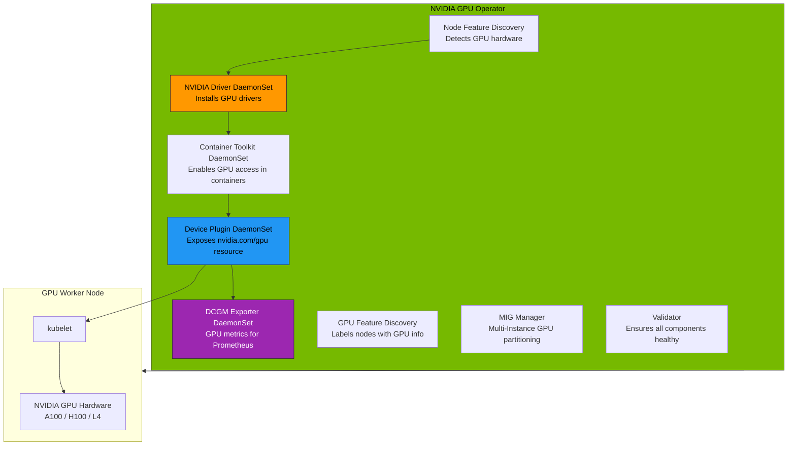
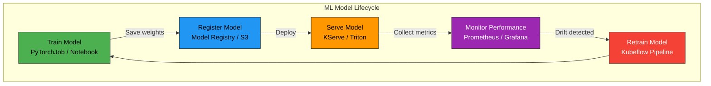

# File 44: AI/ML Workloads on Kubernetes

**Topic:** Running GPU-accelerated AI/ML training and inference workloads on Kubernetes — from scheduling GPUs to serving models at scale.

**WHY THIS MATTERS:** AI/ML workloads are fundamentally different from web applications. They need GPUs worth thousands of dollars per hour, training jobs that run for days, and serving infrastructure that handles variable inference loads. Kubernetes has become the de facto platform for ML operations, but only if you understand GPU scheduling, distributed training, and model serving patterns.

---

## Story:

Think of a **Bollywood VFX Studio** producing a film like RRR or Brahmastra.

The studio has **render farms** — rooms full of powerful machines with high-end graphics cards that process visual effects frame by frame. These are your **GPU nodes** in Kubernetes. Each machine costs lakhs of rupees, so you cannot waste them on simple email or spreadsheet tasks.

The **Studio Manager** is the person who knows exactly which render machine has which GPU, how much VRAM it has, and whether it is busy. This is the **NVIDIA GPU Operator** — it automatically installs drivers, exposes GPU resources to Kubernetes, and monitors GPU health.

When a VFX scene is too complex for one machine, the team **splits the scene across multiple render nodes** — one handles fire effects, another handles water, a third handles particle physics. They all work simultaneously and merge their results. This is **distributed training** — splitting a model across multiple GPU nodes using frameworks like PyTorch Distributed.

Once the VFX is complete, the studio sets up a **screening room** where directors and producers can view the output in real-time, give feedback, and approve the final version. This is **model serving** — KServe or Triton Inference Server exposing your trained model via an API for real-time predictions.

And when the studio has more VFX projects than it can handle? The **Volcano scheduler** acts like a production coordinator who prioritizes projects by deadline, ensures fair resource sharing between teams, and queues up lower-priority work.

---

## Example Block 1 — GPU Scheduling in Kubernetes

### Section 1 — Requesting GPUs in Pod Specs

**WHY:** GPUs are not automatically available to pods. You must explicitly request them as extended resources. Kubernetes does not understand GPU types natively — the NVIDIA device plugin makes GPUs visible to the scheduler.

```yaml
# WHY: A training job pod that requests 2 NVIDIA GPUs
apiVersion: v1
kind: Pod
metadata:
  name: gpu-training-job
  namespace: ml-training
spec:
  restartPolicy: Never                  # WHY: training jobs should not restart on failure
  containers:
    - name: trainer
      image: nvcr.io/nvidia/pytorch:24.01-py3  # WHY: NVIDIA's optimized PyTorch container
      command: ["python", "train.py"]
      args:
        - "--epochs=100"
        - "--batch-size=256"
        - "--learning-rate=0.001"
      resources:
        limits:
          nvidia.com/gpu: 2             # WHY: request exactly 2 GPUs
          # GPUs are NOT compressible — you get exactly 2 or 0
          # There is no "fractional GPU" at this level (see MIG below)
        requests:
          cpu: "8"                      # WHY: CPU for data preprocessing pipeline
          memory: 32Gi                  # WHY: host RAM for data loading
          nvidia.com/gpu: 2             # WHY: requests must equal limits for GPUs
      volumeMounts:
        - name: training-data
          mountPath: /data              # WHY: training dataset
        - name: model-output
          mountPath: /models            # WHY: save trained model weights
        - name: dshm
          mountPath: /dev/shm           # WHY: PyTorch DataLoader uses shared memory
  volumes:
    - name: training-data
      persistentVolumeClaim:
        claimName: training-dataset-pvc
    - name: model-output
      persistentVolumeClaim:
        claimName: model-weights-pvc
    - name: dshm
      emptyDir:
        medium: Memory                  # WHY: /dev/shm backed by RAM for fast IPC
        sizeLimit: 16Gi                 # WHY: limit to prevent OOM from shm usage
  nodeSelector:
    nvidia.com/gpu.product: NVIDIA-A100-SXM4-80GB  # WHY: target specific GPU type
  tolerations:
    - key: nvidia.com/gpu               # WHY: GPU nodes are often tainted
      operator: Exists
      effect: NoSchedule
```

```
SYNTAX:
  kubectl describe node gpu-node-01 | grep -A 15 "Capacity\|Allocatable"

EXPECTED OUTPUT:
  Capacity:
    cpu:                96
    ephemeral-storage:  1920Gi
    hugepages-2Mi:      0
    memory:             768Gi
    nvidia.com/gpu:     8
    pods:               250
  Allocatable:
    cpu:                95500m
    ephemeral-storage:  1768Gi
    memory:             760Gi
    nvidia.com/gpu:     8
    pods:               250

SYNTAX:
  kubectl get pods -n ml-training -o wide

EXPECTED OUTPUT:
  NAME               READY   STATUS    RESTARTS   NODE          GPU-ALLOC
  gpu-training-job   1/1     Running   0          gpu-node-01   2
```

---

## Example Block 2 — NVIDIA GPU Operator

### Section 2 — How the GPU Operator Works

**WHY:** Without the GPU Operator, you would manually install NVIDIA drivers, container toolkit, device plugin, and monitoring exporter on every GPU node. The GPU Operator automates all of this as DaemonSets, and handles driver updates without node rebuilds.



```yaml
# WHY: Install GPU Operator via Helm
# This single Helm chart deploys all NVIDIA components as DaemonSets
# Values file for the NVIDIA GPU Operator Helm chart
apiVersion: v1
kind: ConfigMap
metadata:
  name: gpu-operator-values
  namespace: gpu-operator
data:
  values.yaml: |
    # WHY: Node Feature Discovery detects GPU hardware on nodes
    nfd:
      enabled: true

    # WHY: Use pre-installed drivers on cloud VMs (GKE, EKS use host drivers)
    driver:
      enabled: true
      repository: nvcr.io/nvidia
      version: "550.54.14"              # WHY: pin driver version for stability
      manager:
        env:
          - name: ENABLE_AUTO_DRAIN
            value: "true"               # WHY: drain node before driver upgrade

    # WHY: Device Plugin makes GPUs visible as kubernetes resources
    devicePlugin:
      enabled: true
      config:
        name: device-plugin-config
        default: any                    # WHY: default sharing strategy

    # WHY: DCGM Exporter sends GPU metrics to Prometheus
    dcgmExporter:
      enabled: true
      serviceMonitor:
        enabled: true                   # WHY: auto-register with Prometheus Operator

    # WHY: MIG Manager for partitioning A100/H100 GPUs
    migManager:
      enabled: true
      config:
        name: mig-config

    # WHY: GPU Feature Discovery labels nodes with GPU properties
    gfd:
      enabled: true
```

```
SYNTAX:
  helm install gpu-operator nvidia/gpu-operator \
    --namespace gpu-operator \
    --create-namespace \
    --values values.yaml

FLAGS:
  --wait              Wait for all pods to be ready
  --timeout 10m       Allow 10 minutes for driver installation
  --version 24.3.0    Pin chart version

EXPECTED OUTPUT:
  NAME: gpu-operator
  NAMESPACE: gpu-operator
  STATUS: deployed
  REVISION: 1

SYNTAX:
  kubectl get pods -n gpu-operator

EXPECTED OUTPUT:
  NAME                                       READY   STATUS    RESTARTS   AGE
  gpu-operator-controller-manager-abc123     1/1     Running   0          5m
  nvidia-driver-daemonset-xyz789             1/1     Running   0          4m
  nvidia-container-toolkit-daemonset-def456  1/1     Running   0          3m
  nvidia-device-plugin-daemonset-ghi012     1/1     Running   0          3m
  nvidia-dcgm-exporter-jkl345               1/1     Running   0          2m
  gpu-feature-discovery-mno678               1/1     Running   0          2m
```

### Section 3 — Multi-Instance GPU (MIG)

**WHY:** An A100-80GB GPU is overkill for small inference workloads. MIG lets you partition one physical GPU into up to 7 isolated GPU instances, each with its own memory, cache, and compute cores. This is like dividing a large render farm machine into 7 smaller virtual machines.

```yaml
# WHY: MIG configuration for an A100-80GB GPU
# This partitions one GPU into mixed sizes for different workloads
apiVersion: v1
kind: ConfigMap
metadata:
  name: mig-config
  namespace: gpu-operator
data:
  config.yaml: |
    version: v1
    mig-configs:
      # WHY: "mixed" strategy — different sized slices for different needs
      mixed-workload:
        - devices: [0]                  # WHY: partition GPU 0
          mig-enabled: true
          mig-devices:
            "3g.40gb": 1               # WHY: one large slice for training (40GB)
            "1g.10gb": 3               # WHY: three small slices for inference (10GB each)

      # WHY: "all-inference" strategy — 7 equal small slices
      all-inference:
        - devices: all
          mig-enabled: true
          mig-devices:
            "1g.10gb": 7              # WHY: maximize inference throughput

      # WHY: "training" strategy — full GPU power
      training-mode:
        - devices: all
          mig-enabled: false           # WHY: disable MIG for full GPU access
```

```
SYNTAX:
  kubectl label node gpu-node-01 nvidia.com/mig.config=mixed-workload --overwrite

EXPECTED OUTPUT:
  node/gpu-node-01 labeled

SYNTAX:
  nvidia-smi mig -lgi

EXPECTED OUTPUT:
  +-------------------------------------------------------+
  | GPU instances:                                         |
  | GPU   Name          Profile  Instance   Placement     |
  |                       ID       ID       Start:Size    |
  |=======================================================|
  |   0  MIG 3g.40gb       9        0          0:4        |
  |   0  MIG 1g.10gb      19        1          4:1        |
  |   0  MIG 1g.10gb      19        2          5:1        |
  |   0  MIG 1g.10gb      19        3          6:1        |
  +-------------------------------------------------------+
```

---

## Example Block 3 — Distributed Training with Training Operator

### Section 4 — PyTorchJob for Multi-Node Training

**WHY:** Training large models (LLMs, vision transformers) on a single GPU takes weeks. Distributed training splits the work across multiple GPU nodes using PyTorch's DistributedDataParallel (DDP). The Training Operator manages the lifecycle of distributed training jobs on Kubernetes.

```yaml
# WHY: PyTorchJob splits training across 4 nodes with 8 GPUs each (32 GPUs total)
apiVersion: kubeflow.org/v1
kind: PyTorchJob
metadata:
  name: llm-finetune-job
  namespace: ml-training
spec:
  elasticPolicy:
    rdzvBackend: etcd                   # WHY: rendezvous backend for elastic training
    rdzvHost: etcd-service              # WHY: nodes discover each other via etcd
    minReplicas: 2                      # WHY: minimum nodes to start training
    maxReplicas: 4                      # WHY: can scale up if more GPUs become available
    maxRestarts: 3                      # WHY: auto-restart on node failure
  pytorchReplicaSpecs:
    Worker:
      replicas: 4                       # WHY: 4 worker nodes
      restartPolicy: OnFailure          # WHY: restart individual workers on crash
      template:
        metadata:
          annotations:
            sidecar.istio.io/inject: "false"  # WHY: training pods don't need service mesh
        spec:
          containers:
            - name: pytorch
              image: registry.example.com/ml/llm-trainer:v1.0
              command:
                - torchrun                # WHY: PyTorch's distributed launch utility
              args:
                - --nproc_per_node=8      # WHY: 8 GPUs per node
                - --nnodes=$(WORLD_SIZE)  # WHY: total number of nodes (injected by operator)
                - --node_rank=$(RANK)     # WHY: this node's rank (injected by operator)
                - --master_addr=$(MASTER_ADDR)
                - --master_port=$(MASTER_PORT)
                - train.py
                - --model=llama-7b
                - --dataset=/data/train
                - --epochs=3
                - --per-device-batch-size=4
                - --gradient-accumulation-steps=8
              resources:
                limits:
                  nvidia.com/gpu: 8       # WHY: all 8 GPUs on the node
                  rdma/rdma_shared_device_a: 1  # WHY: RDMA for fast inter-node communication
                requests:
                  cpu: "64"
                  memory: 256Gi
                  nvidia.com/gpu: 8
              volumeMounts:
                - name: training-data
                  mountPath: /data
                - name: dshm
                  mountPath: /dev/shm
              env:
                - name: NCCL_DEBUG
                  value: "INFO"           # WHY: debug NCCL communication issues
                - name: NCCL_IB_DISABLE
                  value: "0"              # WHY: enable InfiniBand for RDMA
          volumes:
            - name: training-data
              persistentVolumeClaim:
                claimName: training-data-pvc
            - name: dshm
              emptyDir:
                medium: Memory
                sizeLimit: 64Gi           # WHY: large shm for gradient all-reduce
          tolerations:
            - key: nvidia.com/gpu
              operator: Exists
              effect: NoSchedule
          affinity:
            podAntiAffinity:
              requiredDuringSchedulingIgnoredDuringExecution:
                - labelSelector:
                    matchLabels:
                      training.kubeflow.org/job-name: llm-finetune-job
                  topologyKey: kubernetes.io/hostname
                  # WHY: spread workers across different physical nodes
```

```
SYNTAX:
  kubectl get pytorchjobs -n ml-training

EXPECTED OUTPUT:
  NAME               STATE      AGE
  llm-finetune-job   Running    2h15m

SYNTAX:
  kubectl get pods -n ml-training -l training.kubeflow.org/job-name=llm-finetune-job

EXPECTED OUTPUT:
  NAME                        READY   STATUS    RESTARTS   NODE
  llm-finetune-job-worker-0   1/1     Running   0          gpu-node-01
  llm-finetune-job-worker-1   1/1     Running   0          gpu-node-02
  llm-finetune-job-worker-2   1/1     Running   0          gpu-node-03
  llm-finetune-job-worker-3   1/1     Running   0          gpu-node-04
```

### Section 5 — Topology-Aware Scheduling

**WHY:** GPU-to-GPU communication speed depends on physical topology. GPUs on the same node connected via NVLink are 10x faster than GPUs on different nodes connected via network. Topology-aware scheduling ensures training pods land on nodes with the best interconnects.

```yaml
# WHY: Node labels for topology-aware scheduling
# Applied by NVIDIA GPU Feature Discovery automatically
# nvidia.com/gpu.product: NVIDIA-A100-SXM4-80GB
# nvidia.com/gpu.count: 8
# nvidia.com/gpu.memory: 81920
# nvidia.com/gpu.family: ampere
# nvidia.com/gpu.compute.major: 8
# nvidia.com/gpu.compute.minor: 0
# nvidia.com/mig.capable: true
# topology.kubernetes.io/zone: us-east-1a

# WHY: Topology-aware scheduling example
apiVersion: v1
kind: Pod
metadata:
  name: topo-aware-training
  namespace: ml-training
spec:
  schedulerName: topology-aware-scheduler  # WHY: use custom scheduler
  containers:
    - name: trainer
      image: nvcr.io/nvidia/pytorch:24.01-py3
      resources:
        limits:
          nvidia.com/gpu: 4
  affinity:
    nodeAffinity:
      requiredDuringSchedulingIgnoredDuringExecution:
        nodeSelectorTerms:
          - matchExpressions:
              - key: nvidia.com/gpu.product
                operator: In
                values:
                  - NVIDIA-A100-SXM4-80GB   # WHY: require A100 SXM (NVLink capable)
              - key: nvidia.com/gpu.count
                operator: Gt
                values:
                  - "3"                      # WHY: node must have at least 4 GPUs
```

---

## Example Block 4 — Model Serving with KServe

### Section 6 — KServe InferenceService

**WHY:** Training produces model weights. Serving exposes those weights as an API endpoint. KServe provides autoscaling (including scale-to-zero), canary rollouts for models, request batching, and GPU sharing — all without writing serving code.



```yaml
# WHY: KServe InferenceService — deploy a PyTorch model for real-time inference
apiVersion: serving.kserve.io/v1beta1
kind: InferenceService
metadata:
  name: llm-serving
  namespace: ml-serving
  annotations:
    serving.kserve.io/autoscalerClass: hpa    # WHY: use HPA instead of KPA for GPU workloads
    serving.kserve.io/targetUtilizationPercentage: "70"  # WHY: scale up at 70% GPU util
spec:
  predictor:
    minReplicas: 1                      # WHY: at least 1 replica always warm
    maxReplicas: 10                     # WHY: cap to control GPU costs
    scaleTarget: 5                      # WHY: target 5 concurrent requests per pod
    scaleMetric: concurrency            # WHY: scale based on request concurrency
    model:
      modelFormat:
        name: pytorch                   # WHY: specify model framework
      storageUri: s3://models/llm/v2    # WHY: model weights stored in S3
      runtime: kserve-torchserve        # WHY: use TorchServe runtime
      resources:
        limits:
          nvidia.com/gpu: 1             # WHY: one GPU per serving pod
          cpu: "8"
          memory: 32Gi
        requests:
          nvidia.com/gpu: 1
          cpu: "4"
          memory: 16Gi
    canaryTrafficPercent: 10            # WHY: send 10% traffic to new model version
  transformer:
    containers:
      - name: preprocessor
        image: registry.example.com/ml/tokenizer:v1
        resources:
          requests:
            cpu: "2"
            memory: 4Gi
        # WHY: transformer handles tokenization before the model
        # This separates preprocessing from GPU inference
---
# WHY: Triton Inference Server — high-performance multi-model serving
apiVersion: serving.kserve.io/v1beta1
kind: InferenceService
metadata:
  name: multi-model-triton
  namespace: ml-serving
spec:
  predictor:
    minReplicas: 2
    triton:
      storageUri: s3://models/triton-repo    # WHY: Triton model repository format
      resources:
        limits:
          nvidia.com/gpu: 1
        requests:
          cpu: "4"
          memory: 16Gi
      args:
        - --model-control-mode=poll          # WHY: auto-detect new models in repository
        - --repository-poll-secs=30          # WHY: check for model updates every 30s
        - --strict-model-config=false        # WHY: auto-generate model config if missing
```

```
SYNTAX:
  kubectl get inferenceservices -n ml-serving

EXPECTED OUTPUT:
  NAME               URL                                              READY   PREV   LATEST   AGE
  llm-serving        http://llm-serving.ml-serving.example.com        True    90     10       2d
  multi-model-triton http://multi-model-triton.ml-serving.example.com True           100      5d

SYNTAX:
  curl -X POST http://llm-serving.ml-serving.example.com/v1/models/llm:predict \
    -H "Content-Type: application/json" \
    -d '{"instances": [{"text": "Translate to Hindi: Hello, how are you?"}]}'

EXPECTED OUTPUT:
  {
    "predictions": [
      {
        "text": "नमस्ते, आप कैसे हैं?",
        "confidence": 0.94,
        "latency_ms": 45
      }
    ]
  }
```

---

## Example Block 5 — Volcano Scheduler and Kueue

### Section 7 — Volcano: Gang Scheduling for Training Jobs

**WHY:** The default Kubernetes scheduler places pods one at a time. For distributed training, all 4 workers must start simultaneously — if only 3 of 4 can be scheduled, you waste 3 GPUs waiting for the 4th. Volcano provides **gang scheduling**: all pods start together or none start.

```yaml
# WHY: Volcano Queue — controls resource allocation for ML teams
apiVersion: scheduling.volcano.sh/v1beta1
kind: Queue
metadata:
  name: ml-research-team
spec:
  reclaimable: true                     # WHY: reclaim idle resources from this queue
  weight: 3                             # WHY: higher weight = higher priority share
  capability:
    cpu: "256"
    memory: 1024Gi
    nvidia.com/gpu: "32"                # WHY: cap total GPU allocation for this team
---
# WHY: Volcano Job with gang scheduling
apiVersion: batch.volcano.sh/v1alpha1
kind: Job
metadata:
  name: distributed-training
  namespace: ml-training
spec:
  schedulerName: volcano                # WHY: use Volcano instead of default scheduler
  minAvailable: 4                       # WHY: all 4 workers must be schedulable
  queue: ml-research-team               # WHY: charge resources to this team's quota
  policies:
    - event: PodEvicted
      action: RestartJob                # WHY: restart entire job if a worker is evicted
    - event: TaskCompleted
      action: CompleteJob
  plugins:
    env: []                             # WHY: inject environment variables
    svc: []                             # WHY: create headless service for worker discovery
  tasks:
    - name: worker
      replicas: 4
      template:
        spec:
          containers:
            - name: pytorch
              image: registry.example.com/ml/trainer:v1
              resources:
                limits:
                  nvidia.com/gpu: 8
              ports:
                - containerPort: 23456
                  name: nccl            # WHY: NCCL communication port
```

### Section 8 — Kueue: Kubernetes-Native Job Queuing

**WHY:** Kueue is the newer, upstream Kubernetes approach to job queuing. Unlike Volcano, it works with standard batch/v1 Jobs and integrates with the existing Kubernetes scheduler. It provides multi-tenancy, fair sharing, priority, and preemption.

```yaml
# WHY: ResourceFlavor defines a type of compute resource
apiVersion: kueue.x-k8s.io/v1beta1
kind: ResourceFlavor
metadata:
  name: gpu-a100
spec:
  nodeLabels:
    nvidia.com/gpu.product: NVIDIA-A100-SXM4-80GB  # WHY: bind flavor to A100 nodes
---
# WHY: ClusterQueue defines total resource budget
apiVersion: kueue.x-k8s.io/v1beta1
kind: ClusterQueue
metadata:
  name: ml-cluster-queue
spec:
  namespaceSelector: {}                 # WHY: accept jobs from all namespaces
  resourceGroups:
    - coveredResources: ["cpu", "memory", "nvidia.com/gpu"]
      flavors:
        - name: gpu-a100
          resources:
            - name: "cpu"
              nominalQuota: 512
            - name: "memory"
              nominalQuota: 2048Gi
            - name: "nvidia.com/gpu"
              nominalQuota: 64          # WHY: total GPUs available in the cluster
  preemption:
    reclaimWithinCohort: Any            # WHY: preempt lower-priority jobs in same cohort
    withinClusterQueue: LowerPriority   # WHY: higher priority jobs can preempt lower ones
---
# WHY: LocalQueue is namespace-scoped — teams submit jobs here
apiVersion: kueue.x-k8s.io/v1beta1
kind: LocalQueue
metadata:
  name: ml-team-queue
  namespace: ml-training
spec:
  clusterQueue: ml-cluster-queue        # WHY: link to the cluster-level queue
```

```
SYNTAX:
  kubectl get clusterqueues

EXPECTED OUTPUT:
  NAME               COHORT   PENDING WORKLOADS   ADMITTED WORKLOADS
  ml-cluster-queue            2                    5

SYNTAX:
  kubectl get localqueues -n ml-training

EXPECTED OUTPUT:
  NAME            CLUSTER QUEUE      PENDING WORKLOADS   ADMITTED WORKLOADS
  ml-team-queue   ml-cluster-queue   1                    3

SYNTAX:
  kubectl get workloads -n ml-training

EXPECTED OUTPUT:
  NAME                           QUEUE           ADMITTED   AGE
  job-llm-finetune-abc12         ml-team-queue   True       2h
  job-embeddings-train-def34     ml-team-queue   True       45m
  job-image-classifier-ghi56     ml-team-queue   True       20m
  job-sentiment-analysis-jkl78   ml-team-queue   False      5m
```

---

## Example Block 6 — Ray on Kubernetes and Kubeflow Pipelines

### Section 9 — Ray Cluster on Kubernetes

**WHY:** Ray provides a unified framework for distributed compute — training, hyperparameter tuning, serving, and data processing all in one API. RayCluster on Kubernetes lets you create auto-scaling Ray clusters as Kubernetes resources.

```yaml
# WHY: KubeRay RayCluster — auto-scaling Ray cluster on Kubernetes
apiVersion: ray.io/v1
kind: RayCluster
metadata:
  name: ml-ray-cluster
  namespace: ml-training
spec:
  rayVersion: "2.9.0"
  headGroupSpec:
    rayStartParams:
      dashboard-host: "0.0.0.0"        # WHY: expose Ray dashboard
      num-cpus: "0"                     # WHY: head node should not run tasks
    template:
      spec:
        containers:
          - name: ray-head
            image: rayproject/ray-ml:2.9.0-py310-gpu
            ports:
              - containerPort: 6379     # WHY: Ray GCS server
              - containerPort: 8265     # WHY: Ray dashboard
              - containerPort: 10001    # WHY: Ray client server
            resources:
              requests:
                cpu: "4"
                memory: 8Gi
  workerGroupSpecs:
    - replicas: 2
      minReplicas: 1                    # WHY: minimum workers for autoscaling
      maxReplicas: 8                    # WHY: scale up to 8 GPU workers
      groupName: gpu-workers
      rayStartParams:
        num-gpus: "1"                   # WHY: each worker has 1 GPU
      template:
        spec:
          containers:
            - name: ray-worker
              image: rayproject/ray-ml:2.9.0-py310-gpu
              resources:
                limits:
                  nvidia.com/gpu: 1
                requests:
                  cpu: "8"
                  memory: 32Gi
                  nvidia.com/gpu: 1
          tolerations:
            - key: nvidia.com/gpu
              operator: Exists
              effect: NoSchedule
```

### Section 10 — Kubeflow Pipelines

**WHY:** ML workflows have many steps: data preprocessing, feature engineering, training, evaluation, model registration, and deployment. Kubeflow Pipelines orchestrates these steps as a DAG (Directed Acyclic Graph), with caching, artifact tracking, and experiment comparison.

```yaml
# WHY: Kubeflow Pipeline defined as Argo Workflow
# Each step is a container that reads/writes artifacts
apiVersion: argoproj.io/v1alpha1
kind: Workflow
metadata:
  name: ml-training-pipeline
  namespace: kubeflow
spec:
  entrypoint: ml-pipeline
  templates:
    - name: ml-pipeline
      dag:
        tasks:
          - name: preprocess-data
            template: preprocess
          - name: train-model
            dependencies: [preprocess-data]     # WHY: must preprocess before training
            template: train
          - name: evaluate-model
            dependencies: [train-model]          # WHY: must train before evaluating
            template: evaluate
          - name: deploy-model
            dependencies: [evaluate-model]       # WHY: deploy only after evaluation passes
            template: deploy
            when: "{{tasks.evaluate-model.outputs.parameters.accuracy}} > 0.90"
            # WHY: only deploy if accuracy > 90%

    - name: preprocess
      container:
        image: registry.example.com/ml/preprocess:v1
        command: ["python", "preprocess.py"]
        args: ["--input=/data/raw", "--output=/data/processed"]

    - name: train
      container:
        image: registry.example.com/ml/trainer:v1
        command: ["python", "train.py"]
        resources:
          limits:
            nvidia.com/gpu: 4                    # WHY: training needs GPUs

    - name: evaluate
      container:
        image: registry.example.com/ml/evaluator:v1
        command: ["python", "evaluate.py"]
      outputs:
        parameters:
          - name: accuracy
            valueFrom:
              path: /tmp/accuracy.txt            # WHY: export accuracy for conditional deploy

    - name: deploy
      container:
        image: registry.example.com/ml/deployer:v1
        command: ["python", "deploy_kserve.py"]
```

---

## Key Takeaways

1. **GPUs are extended resources** in Kubernetes — you request them via `nvidia.com/gpu` in pod specs, and they are non-compressible (you get the exact count or nothing).

2. **The NVIDIA GPU Operator** automates driver installation, device plugin deployment, and GPU monitoring across all nodes — eliminating manual driver management.

3. **Multi-Instance GPU (MIG)** partitions a single A100/H100 into up to 7 isolated GPU instances, allowing multiple workloads to share one expensive GPU safely.

4. **Topology-aware scheduling** ensures training pods land on nodes with the best GPU interconnects (NVLink > PCIe > Network), dramatically impacting distributed training performance.

5. **PyTorchJob (Training Operator)** manages distributed training lifecycles — handling worker discovery, rank assignment, elastic scaling, and failure recovery.

6. **KServe provides model serving** with autoscaling (including scale-to-zero), canary model rollouts, request batching, and multi-framework support via Triton.

7. **Volcano scheduler** provides gang scheduling — all workers start together or none start — preventing GPU waste from partial scheduling.

8. **Kueue** is the Kubernetes-native job queuing system with multi-tenancy, fair sharing, priority preemption, and works with standard batch/v1 Jobs.

9. **Ray on Kubernetes** provides a unified distributed computing framework for training, tuning, serving, and data processing under one API.

10. **Kubeflow Pipelines** orchestrate multi-step ML workflows as DAGs with caching, artifact tracking, conditional execution, and experiment management.

11. **Always mount /dev/shm as tmpfs** for PyTorch workloads — DataLoader workers use shared memory for inter-process communication, and the default 64MB is insufficient.

12. **GPU costs dominate ML budgets** — every optimization (MIG, topology awareness, gang scheduling, scale-to-zero serving) directly impacts your cloud bill.
