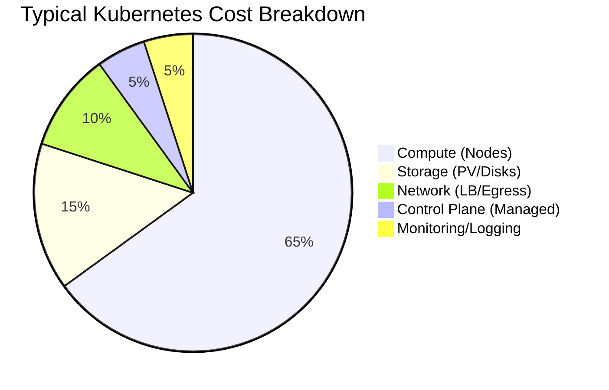
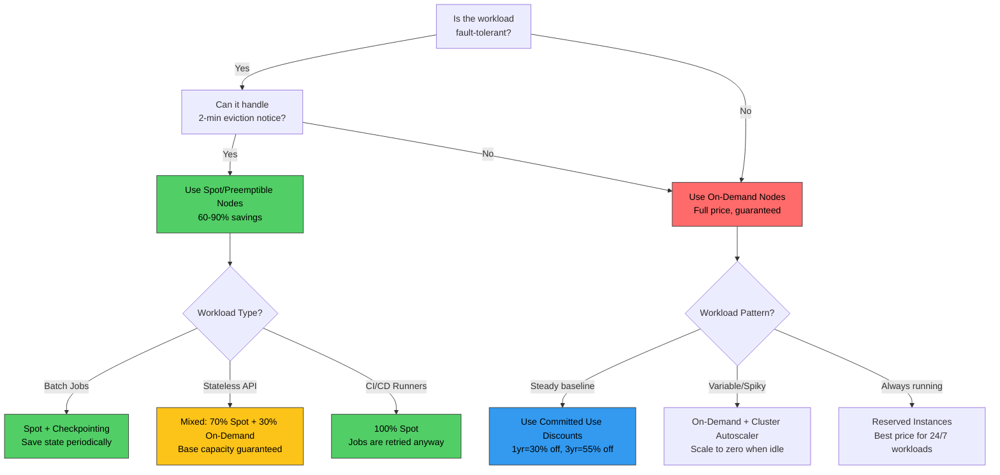

# File 45: Cost Optimization and FinOps for Kubernetes

**Topic:** Controlling and optimizing Kubernetes costs through right-sizing, quota management, node pool strategies, and cost observability tools.

**WHY THIS MATTERS:** Kubernetes makes it dangerously easy to overspend. Engineers request "just 4 CPUs and 8GB RAM" per pod, multiply by 200 pods across 3 environments, and suddenly you are paying for a fleet of servers running at 15% utilization. FinOps (Financial Operations) brings cost accountability to engineering teams — because the cheapest bug to fix is the one that wastes money silently.

---

## Story:

Think of a **Kirana Store (neighborhood grocery shop)** in India.

**Overprovisioning** is like the shop owner ordering **100kg of onions** when customers only buy 10kg per week. The remaining 90kg rots on the shelf — wasted money. In Kubernetes, this happens when engineers request 4 CPUs but their pod uses only 0.3 CPU. You are paying for 4 CPUs of compute on every node, but 92% sits idle.

**ResourceQuota** is like the shop owner's **monthly budget** — "I will not spend more than Rs 50,000 on stock this month." If the vegetable vendor tries to deliver more than the budget allows, the order is rejected. In Kubernetes, ResourceQuota prevents a namespace from consuming more than its fair share of cluster resources.

**LimitRange** is the rule that says "no single item purchase can exceed Rs 5,000." Even within your budget, you cannot blow it all on one expensive item. In Kubernetes, LimitRange prevents a single pod from requesting 64 CPUs when 4 would suffice.

**Spot/Preemptible Nodes** are like the **end-of-day vegetable discount** at the sabzi mandi. Vendors sell tomatoes at 50-70% off because they will rot overnight. You get a great deal, but there is a risk — the vendor might pull the stock if a full-price buyer arrives. Cloud spot instances work the same way: 60-90% cheaper, but they can be reclaimed with 2 minutes notice.

And **Kubecost/OpenCost** is like hiring an **accountant** who tells the shop owner: "You are spending Rs 15,000 on items that expire before selling. Switch to smaller quantities and save Rs 10,000 per month." Cost observability tools show you exactly where every rupee of your cloud bill goes.

---

## Example Block 1 — Understanding Kubernetes Cost Breakdown

### Section 1 — Where Does the Money Go?



**WHY:** Compute (virtual machines) is 60-70% of your Kubernetes bill. This is where optimization has the highest ROI. Storage and networking are secondary but still significant for data-heavy workloads.

### Section 2 — The Request vs Limit Problem

**WHY:** Kubernetes schedules pods based on **requests** (guaranteed resources), but pods can use up to their **limits** (maximum allowed). The gap between what is requested and what is actually used is called **slack** — and slack is pure waste.

```yaml
# WHY: BAD — massive overprovisioning
# This pod requests 4 CPU but typically uses 0.2 CPU
apiVersion: v1
kind: Pod
metadata:
  name: overprovisioned-app
  namespace: wasteful-team
spec:
  containers:
    - name: api
      image: registry.example.com/api:v1
      resources:
        requests:
          cpu: "4"              # WHY BAD: reserves 4 CPU on the node
          memory: 8Gi           # WHY BAD: reserves 8Gi on the node
        limits:
          cpu: "4"
          memory: 8Gi
      # Actual usage: 0.2 CPU, 512Mi memory
      # Waste: 3.8 CPU (95%) and 7.5Gi memory (94%)
---
# WHY: GOOD — right-sized based on actual usage + headroom
apiVersion: v1
kind: Pod
metadata:
  name: rightsized-app
  namespace: efficient-team
spec:
  containers:
    - name: api
      image: registry.example.com/api:v1
      resources:
        requests:
          cpu: 250m             # WHY: based on p95 actual usage (200m) + 25% buffer
          memory: 640Mi         # WHY: based on p99 actual usage (512Mi) + 25% buffer
        limits:
          cpu: "1"              # WHY: allow burst to 1 CPU during traffic spikes
          memory: 1Gi           # WHY: hard cap to prevent OOM from memory leaks
      # Actual usage: 0.2 CPU, 512Mi memory
      # Waste: 50m CPU (20%) — acceptable headroom
```

```
SYNTAX:
  kubectl top pods -n default --sort-by=cpu

EXPECTED OUTPUT:
  NAME                     CPU(cores)   MEMORY(bytes)
  api-server-abc12-xyz     198m         487Mi
  api-server-abc12-def     201m         501Mi
  worker-ghi34-jkl         45m          128Mi
  cache-mno56-pqr          12m          256Mi

SYNTAX:
  kubectl top nodes

EXPECTED OUTPUT:
  NAME           CPU(cores)   CPU%   MEMORY(bytes)   MEMORY%
  node-pool-01   2450m        30%    18432Mi         45%
  node-pool-02   1820m        22%    12288Mi         30%
  node-pool-03   890m         11%    8192Mi          20%
  gpu-pool-01    7200m        75%    196608Mi        80%
```

---

## Example Block 2 — Right-Sizing with VPA

### Section 3 — Vertical Pod Autoscaler

**WHY:** Engineers guess resource requests when deploying. VPA observes actual resource usage over time and recommends (or automatically sets) optimal requests and limits. It is the antidote to overprovisioning.

```yaml
# WHY: VPA in "Off" mode — recommend but don't auto-apply
# Use this first to understand recommendations before enabling auto-mode
apiVersion: autoscaling.k8s.io/v1
kind: VerticalPodAutoscaler
metadata:
  name: api-server-vpa
  namespace: production
spec:
  targetRef:
    apiVersion: apps/v1
    kind: Deployment
    name: api-server
  updatePolicy:
    updateMode: "Off"                   # WHY: "Off" = recommend only, no auto-update
    # Other modes:
    # "Initial" = set on pod creation, don't update running pods
    # "Auto" = evict and recreate pods with new requests (disruptive!)
  resourcePolicy:
    containerPolicies:
      - containerName: api
        minAllowed:
          cpu: 100m                     # WHY: never recommend below 100m
          memory: 128Mi                 # WHY: never recommend below 128Mi
        maxAllowed:
          cpu: "2"                      # WHY: cap recommendations at 2 CPU
          memory: 4Gi                   # WHY: cap at 4Gi to prevent cost explosion
        controlledResources:
          - cpu
          - memory
        controlledValues: RequestsAndLimits  # WHY: adjust both requests and limits
```

```
SYNTAX:
  kubectl get vpa api-server-vpa -n production -o yaml

EXPECTED OUTPUT (recommendation section):
  status:
    recommendation:
      containerRecommendations:
        - containerName: api
          lowerBound:
            cpu: 150m
            memory: 384Mi
          target:
            cpu: 250m              # WHY: this is what VPA recommends you set
            memory: 640Mi
          uncappedTarget:
            cpu: 250m
            memory: 640Mi
          upperBound:
            cpu: 800m
            memory: 1536Mi

# INTERPRETATION:
# - "target" is the recommended request value
# - "lowerBound" is the minimum safe value (risk of throttling below this)
# - "upperBound" is the maximum observed need (covers traffic spikes)
# - Set requests to "target" and limits to "upperBound" for safety
```

### Section 4 — Goldilocks: VPA Recommendations Dashboard

**WHY:** Goldilocks runs VPA in recommendation mode for every deployment in a namespace and presents the results in a web dashboard. It is the fastest way to find overprovisioned workloads.

```yaml
# WHY: Enable Goldilocks for a namespace by labeling it
# This creates a VPA in "Off" mode for every Deployment in the namespace
apiVersion: v1
kind: Namespace
metadata:
  name: production
  labels:
    goldilocks.fairwinds.com/enabled: "true"  # WHY: Goldilocks watches labeled namespaces
```

```
SYNTAX:
  kubectl label namespace production goldilocks.fairwinds.com/enabled=true

EXPECTED OUTPUT:
  namespace/production labeled

SYNTAX:
  kubectl get vpa -n production

EXPECTED OUTPUT:
  NAME                         MODE   CPU    MEM     PROVIDED   AGE
  goldilocks-api-server        Off    250m   640Mi   True       7d
  goldilocks-payment-service   Off    100m   256Mi   True       7d
  goldilocks-auth-service      Off    50m    128Mi   True       7d
  goldilocks-worker            Off    500m   1Gi     True       7d
```

---

## Example Block 3 — ResourceQuota and LimitRange

### Section 5 — Namespace Budget Controls

**WHY:** Without quotas, one team's runaway deployment can consume the entire cluster. ResourceQuota sets a hard ceiling on total resources a namespace can consume — like a monthly budget for each department.

```yaml
# WHY: ResourceQuota — total budget for the "team-alpha" namespace
apiVersion: v1
kind: ResourceQuota
metadata:
  name: team-alpha-quota
  namespace: team-alpha
spec:
  hard:
    requests.cpu: "20"                  # WHY: total CPU requests cannot exceed 20 cores
    requests.memory: 40Gi              # WHY: total memory requests cannot exceed 40Gi
    limits.cpu: "40"                    # WHY: total CPU limits cannot exceed 40 cores
    limits.memory: 80Gi                # WHY: total memory limits cannot exceed 80Gi
    pods: "50"                          # WHY: maximum 50 pods in this namespace
    services.loadbalancers: "2"         # WHY: load balancers cost money — limit them
    persistentvolumeclaims: "10"        # WHY: storage costs add up
    requests.storage: 100Gi             # WHY: total storage across all PVCs
    count/deployments.apps: "15"        # WHY: limit number of deployments
    requests.nvidia.com/gpu: "4"        # WHY: GPU budget — max 4 GPUs for this team
---
# WHY: LimitRange — per-pod constraints within the namespace
apiVersion: v1
kind: LimitRange
metadata:
  name: team-alpha-limits
  namespace: team-alpha
spec:
  limits:
    # WHY: Default limits applied when pod spec omits resource requests/limits
    - type: Container
      default:
        cpu: 500m                       # WHY: default limit if not specified
        memory: 512Mi
      defaultRequest:
        cpu: 100m                       # WHY: default request if not specified
        memory: 128Mi
      min:
        cpu: 50m                        # WHY: reject pods requesting less than 50m CPU
        memory: 64Mi                    # WHY: reject pods requesting less than 64Mi
      max:
        cpu: "4"                        # WHY: no single container can request > 4 CPU
        memory: 8Gi                     # WHY: no single container can request > 8Gi
      maxLimitRequestRatio:
        cpu: "4"                        # WHY: limits cannot be more than 4x requests
        # This prevents request=100m with limit=32000m (gaming the scheduler)

    - type: PersistentVolumeClaim
      min:
        storage: 1Gi                    # WHY: minimum PVC size
      max:
        storage: 50Gi                   # WHY: no single PVC can exceed 50Gi
```

```
SYNTAX:
  kubectl describe resourcequota team-alpha-quota -n team-alpha

EXPECTED OUTPUT:
  Name:                    team-alpha-quota
  Namespace:               team-alpha
  Resource                 Used    Hard
  --------                 ----    ----
  limits.cpu               12      40
  limits.memory            24Gi    80Gi
  persistentvolumeclaims   3       10
  pods                     18      50
  requests.cpu             6       20
  requests.memory          12Gi    40Gi
  requests.nvidia.com/gpu  2       4
  requests.storage         30Gi    100Gi
  services.loadbalancers   1       2

SYNTAX:
  kubectl describe limitrange team-alpha-limits -n team-alpha

EXPECTED OUTPUT:
  Name:       team-alpha-limits
  Namespace:  team-alpha
  Type        Resource  Min    Max    Default Request  Default Limit  Max Limit/Request Ratio
  ----        --------  ---    ---    ---------------  -------------  -----------------------
  Container   cpu       50m    4      100m             500m           4
  Container   memory    64Mi   8Gi    128Mi            512Mi          -
  PVC         storage   1Gi    50Gi   -                -              -
```

---

## Example Block 4 — Node Pool Strategy

### Section 6 — Cost Optimization Decision Tree



### Section 7 — Multi-Node-Pool Architecture

**WHY:** A single node pool forces all workloads onto the same instance type. Multi-pool architecture matches workload characteristics to optimal instance types, like having separate shelves in the kirana store for perishables, dry goods, and frozen items.

```yaml
# WHY: Cluster Autoscaler configuration for multi-pool strategy
apiVersion: v1
kind: ConfigMap
metadata:
  name: cluster-autoscaler-priority
  namespace: kube-system
data:
  priorities: |
    10:
      - .*spot.*                        # WHY: prefer spot pools (lowest cost)
    20:
      - .*ondemand-general.*            # WHY: fallback to on-demand if no spot available
    30:
      - .*ondemand-compute.*            # WHY: last resort — expensive compute-optimized
---
# WHY: Node pool definitions (cloud-provider specific, shown as YAML for illustration)
# GKE Node Pool — Spot instances for stateless workloads
apiVersion: container.google.com/v1
kind: NodePool
metadata:
  name: spot-general
spec:
  initialNodeCount: 0                   # WHY: start with zero, autoscaler adds as needed
  autoscaling:
    enabled: true
    minNodeCount: 0                     # WHY: scale to zero when no pods need spot nodes
    maxNodeCount: 20
  config:
    machineType: e2-standard-8          # WHY: cost-efficient general-purpose
    spot: true                          # WHY: 60-91% cheaper than on-demand
    labels:
      node-pool: spot-general           # WHY: label for nodeSelector targeting
      cost-tier: spot
    taints:
      - key: cloud.google.com/gke-spot
        value: "true"
        effect: NoSchedule              # WHY: only pods that tolerate spot will schedule here
---
# WHY: On-demand pool for critical workloads that cannot tolerate eviction
apiVersion: container.google.com/v1
kind: NodePool
metadata:
  name: ondemand-critical
spec:
  initialNodeCount: 3                   # WHY: always have baseline capacity
  autoscaling:
    enabled: true
    minNodeCount: 3                     # WHY: never scale below 3 for HA
    maxNodeCount: 10
  config:
    machineType: e2-standard-4
    spot: false
    labels:
      node-pool: ondemand-critical
      cost-tier: on-demand
```

```yaml
# WHY: Pod spec targeting spot nodes with fallback
apiVersion: apps/v1
kind: Deployment
metadata:
  name: api-server
  namespace: production
spec:
  replicas: 6
  template:
    spec:
      # WHY: Prefer spot nodes but allow on-demand as fallback
      affinity:
        nodeAffinity:
          preferredDuringSchedulingIgnoredDuringExecution:
            - weight: 90
              preference:
                matchExpressions:
                  - key: cost-tier
                    operator: In
                    values:
                      - spot             # WHY: strongly prefer spot for cost savings
            - weight: 10
              preference:
                matchExpressions:
                  - key: cost-tier
                    operator: In
                    values:
                      - on-demand        # WHY: fall back to on-demand if no spot
      tolerations:
        - key: cloud.google.com/gke-spot
          operator: Equal
          value: "true"
          effect: NoSchedule             # WHY: allow scheduling on spot nodes
      topologySpreadConstraints:
        - maxSkew: 1
          topologyKey: topology.kubernetes.io/zone
          whenUnsatisfiable: ScheduleAnyway
          labelSelector:
            matchLabels:
              app: api-server
          # WHY: spread across zones so one spot pool eviction doesn't kill all pods
      containers:
        - name: api
          image: registry.example.com/api:v1
          resources:
            requests:
              cpu: 250m
              memory: 512Mi
          lifecycle:
            preStop:
              exec:
                command: ["/bin/sh", "-c", "sleep 15"]
                # WHY: graceful shutdown — finish in-flight requests before eviction
      terminationGracePeriodSeconds: 30  # WHY: give pods time to drain on spot eviction
```

---

## Example Block 5 — Cost Observability with OpenCost and Kubecost

### Section 8 — OpenCost: Open Source Cost Monitoring

**WHY:** You cannot optimize what you cannot measure. OpenCost allocates actual cloud costs to namespaces, deployments, and labels — showing exactly which team, environment, or service is costing you money.

```yaml
# WHY: OpenCost deployment — monitors costs and exposes an API
apiVersion: apps/v1
kind: Deployment
metadata:
  name: opencost
  namespace: opencost
spec:
  replicas: 1
  selector:
    matchLabels:
      app: opencost
  template:
    metadata:
      labels:
        app: opencost
    spec:
      containers:
        - name: opencost
          image: ghcr.io/opencost/opencost:latest
          env:
            - name: PROMETHEUS_SERVER_ENDPOINT
              value: "http://prometheus.monitoring:9090"
              # WHY: OpenCost needs Prometheus for resource usage data
            - name: CLOUD_PROVIDER_API_KEY
              valueFrom:
                secretKeyRef:
                  name: cloud-credentials
                  key: api-key
              # WHY: cloud billing API for actual pricing data
            - name: CLUSTER_ID
              value: "production-cluster"
              # WHY: identify this cluster in multi-cluster setups
          ports:
            - containerPort: 9003       # WHY: OpenCost API
            - containerPort: 9090       # WHY: OpenCost UI
          resources:
            requests:
              cpu: 100m
              memory: 256Mi
---
# WHY: ServiceMonitor for Prometheus to scrape OpenCost metrics
apiVersion: monitoring.coreos.com/v1
kind: ServiceMonitor
metadata:
  name: opencost
  namespace: opencost
spec:
  selector:
    matchLabels:
      app: opencost
  endpoints:
    - port: metrics
      interval: 60s                     # WHY: scrape cost metrics every minute
      path: /metrics
```

```
SYNTAX:
  curl -s http://opencost.opencost:9003/allocation/compute \
    -d window=7d \
    -d aggregate=namespace \
    -d step=1d | jq '.data[0]'

EXPECTED OUTPUT:
  {
    "production": {
      "cpuCost": 145.23,
      "gpuCost": 892.10,
      "ramCost": 67.45,
      "pvCost": 23.12,
      "networkCost": 12.80,
      "totalCost": 1140.70,
      "cpuEfficiency": 0.34,
      "ramEfficiency": 0.28,
      "totalEfficiency": 0.31
    },
    "staging": {
      "cpuCost": 89.10,
      "gpuCost": 0.00,
      "ramCost": 45.67,
      "pvCost": 15.30,
      "networkCost": 5.40,
      "totalCost": 155.47,
      "cpuEfficiency": 0.12,
      "ramEfficiency": 0.15,
      "totalEfficiency": 0.13
    }
  }

# INTERPRETATION:
# - production namespace: $1,140.70/week, 31% efficient (69% waste!)
# - staging namespace: $155.47/week, 13% efficient (87% waste!)
# - Action: right-size staging immediately, investigate production GPU usage
```

### Section 9 — Cost Allocation Labels

**WHY:** Costs are meaningless without attribution. Label every workload with team, environment, and project so cost reports can answer "who is spending how much on what?"

```yaml
# WHY: Standard labels for cost allocation
apiVersion: apps/v1
kind: Deployment
metadata:
  name: recommendation-engine
  namespace: production
  labels:
    # WHY: cost allocation labels — used by Kubecost/OpenCost for grouping
    cost-center: "engineering"
    team: "ml-platform"
    project: "recommendation-engine"
    environment: "production"
    managed-by: "helm"
spec:
  template:
    metadata:
      labels:
        app: recommendation-engine
        cost-center: "engineering"        # WHY: must be on pod template too
        team: "ml-platform"
        project: "recommendation-engine"
        environment: "production"
    spec:
      containers:
        - name: engine
          image: registry.example.com/rec-engine:v3
          resources:
            requests:
              cpu: 500m
              memory: 1Gi
```

---

## Example Block 6 — Managed Cost Optimization Services

### Section 10 — GKE Autopilot vs EKS Fargate

**WHY:** If managing node pools is too complex, serverless Kubernetes options eliminate node management entirely. You pay per pod, not per node — no idle node waste. But you trade flexibility for simplicity.

```yaml
# WHY: GKE Autopilot — Google manages nodes entirely
# You only define pods; Google provisions optimal nodes automatically
# No node pools to manage, no Cluster Autoscaler to configure
apiVersion: apps/v1
kind: Deployment
metadata:
  name: api-server
  namespace: production
  annotations:
    autopilot.gke.io/resource-adjustment: '{"input":{"containers":[{"name":"api"}]},"output":{"containers":[{"name":"api"}]},"modified":true}'
    # WHY: Autopilot may adjust resources to fit bin-packing requirements
spec:
  replicas: 3
  template:
    spec:
      containers:
        - name: api
          image: registry.example.com/api:v1
          resources:
            requests:
              cpu: 250m                 # WHY: Autopilot bills based on requests
              memory: 512Mi             # WHY: you pay exactly for what you request
              ephemeral-storage: 1Gi
            # WHY: In Autopilot, limits = requests (enforced by Google)
            # No overcommit possible — what you request is what you get
      # WHY: Autopilot pricing (as of 2025):
      # CPU: $0.0445/vCPU/hour (vs $0.031 for standard GKE on-demand e2)
      # Memory: $0.0049/GB/hour
      # Premium for simplicity, but no idle node waste
---
# WHY: EKS Fargate Profile — AWS serverless pod execution
# Pods matching the profile run on Fargate (no EC2 nodes to manage)
apiVersion: v1
kind: ConfigMap
metadata:
  name: fargate-profile-reference
  namespace: kube-system
data:
  profile.yaml: |
    # Applied via eksctl or Terraform, shown here for reference
    fargateProfile:
      name: production-fargate
      selectors:
        - namespace: production          # WHY: pods in "production" namespace run on Fargate
          labels:
            compute-type: fargate        # WHY: only pods with this label use Fargate
      subnetIds:
        - subnet-abc123                  # WHY: Fargate pods run in private subnets
        - subnet-def456
    # WHY: Fargate pricing:
    # CPU: $0.04048/vCPU/hour
    # Memory: $0.004445/GB/hour
    # No EC2 instance management, but limited to 4 vCPU / 30 GB per pod
```

### Section 11 — Idle Cost Identification

**WHY:** The biggest cost savings come from identifying workloads that run 24/7 but are only used during business hours, or development environments left running over weekends.

```yaml
# WHY: CronJob to scale down non-production workloads at night
# Saves 60% on dev/staging costs by running only during business hours
apiVersion: batch/v1
kind: CronJob
metadata:
  name: scale-down-dev
  namespace: kube-system
spec:
  schedule: "0 20 * * 1-5"             # WHY: 8 PM IST, Monday-Friday
  jobTemplate:
    spec:
      template:
        spec:
          serviceAccountName: workload-scaler
          containers:
            - name: scaler
              image: bitnami/kubectl:latest
              command:
                - /bin/sh
                - -c
                - |
                  # WHY: Scale all deployments in dev namespace to 0
                  kubectl scale deployment --all -n development --replicas=0
                  # WHY: Scale staging to minimum
                  kubectl scale deployment --all -n staging --replicas=1
                  echo "Scaled down non-prod at $(date)"
          restartPolicy: OnFailure
---
# WHY: Scale back up in the morning
apiVersion: batch/v1
kind: CronJob
metadata:
  name: scale-up-dev
  namespace: kube-system
spec:
  schedule: "0 8 * * 1-5"             # WHY: 8 AM IST, Monday-Friday
  jobTemplate:
    spec:
      template:
        spec:
          serviceAccountName: workload-scaler
          containers:
            - name: scaler
              image: bitnami/kubectl:latest
              command:
                - /bin/sh
                - -c
                - |
                  # WHY: Restore dev deployments
                  kubectl scale deployment api-server -n development --replicas=2
                  kubectl scale deployment worker -n development --replicas=1
                  kubectl scale deployment --all -n staging --replicas=2
                  echo "Scaled up non-prod at $(date)"
          restartPolicy: OnFailure
```

```
SYNTAX:
  kubectl get cronjobs -n kube-system | grep scale

EXPECTED OUTPUT:
  NAME             SCHEDULE        SUSPEND   ACTIVE   LAST SCHEDULE   AGE
  scale-down-dev   0 20 * * 1-5    False     0        8h              30d
  scale-up-dev     0 8 * * 1-5     False     0        20h             30d
```

---

## Example Block 7 — Cluster Autoscaler Optimization

### Section 12 — Autoscaler Tuning for Cost

```yaml
# WHY: Cluster Autoscaler configuration optimized for cost
apiVersion: apps/v1
kind: Deployment
metadata:
  name: cluster-autoscaler
  namespace: kube-system
spec:
  template:
    spec:
      containers:
        - name: cluster-autoscaler
          image: registry.k8s.io/autoscaling/cluster-autoscaler:v1.29.0
          command:
            - ./cluster-autoscaler
            - --v=4
            - --cloud-provider=gce
            # WHY: Scale down aggressively to save money
            - --scale-down-delay-after-add=5m
              # WHY: wait 5 min after adding a node before considering scale-down
            - --scale-down-delay-after-delete=1m
              # WHY: check for more scale-down opportunities quickly
            - --scale-down-unneeded-time=5m
              # WHY: remove nodes that are underutilized for 5 minutes
            - --scale-down-utilization-threshold=0.5
              # WHY: node is "underutilized" if using less than 50% of capacity
            - --max-graceful-termination-sec=600
              # WHY: give pods 10 min to drain before forcing termination
            - --balance-similar-node-groups=true
              # WHY: keep node groups balanced for better availability
            - --expander=priority
              # WHY: use priority expander — prefer cheaper node pools
            - --skip-nodes-with-system-pods=false
              # WHY: don't skip nodes just because they have system pods
            - --skip-nodes-with-local-storage=false
              # WHY: allow scaling down nodes with emptyDir volumes
            - --max-node-provision-time=10m
              # WHY: timeout if node takes too long to provision
            - --max-nodes-total=100
              # WHY: hard cap to prevent runaway scaling
```

```
SYNTAX:
  kubectl -n kube-system logs deployment/cluster-autoscaler | grep -i "scale"

EXPECTED OUTPUT:
  I0315 10:30:00.123456 Scale-up: setting group spot-general size to 5
  I0315 10:35:00.234567 Scale-down: node node-abc123 is underutilized (cpu: 0.15, mem: 0.22)
  I0315 10:40:00.345678 Scale-down: removing node node-abc123 (idle for 5m)
  I0315 10:40:30.456789 Scale-down: node node-abc123 successfully removed
```

---

## Key Takeaways

1. **Compute is 60-70% of your Kubernetes bill** — optimizing CPU and memory requests has the highest return on investment of any cost-saving measure.

2. **The request-limit gap is pure waste** — if a pod requests 4 CPU but uses 0.2, you pay for 4 CPUs. Right-sizing requests based on actual usage (with VPA or Goldilocks) can cut costs by 50-80%.

3. **VPA in "Off" mode is risk-free** — it observes and recommends without changing anything. Start here before enabling auto-adjustment.

4. **ResourceQuota prevents namespace-level overspending** by capping total resources. LimitRange prevents individual pod-level overspending by capping per-container resources.

5. **Spot/preemptible nodes offer 60-90% savings** but can be reclaimed with 2 minutes notice. Use them for fault-tolerant workloads (batch jobs, stateless APIs with multiple replicas, CI runners).

6. **Multi-node-pool architecture** matches workload types to optimal instance types — spot for batch, on-demand for databases, committed-use for steady-state production.

7. **OpenCost and Kubecost** allocate actual cloud costs to namespaces, teams, and projects — you cannot optimize what you cannot measure.

8. **Cost allocation labels** (team, project, environment, cost-center) on every workload are essential for meaningful cost reports and chargeback.

9. **GKE Autopilot and EKS Fargate** eliminate node management and idle node waste — you pay per pod, not per node — but at a premium per-unit price.

10. **Scaling non-production to zero overnight** saves 60% on dev/staging costs with a simple CronJob — the easiest cost optimization with the highest impact.

11. **Cluster Autoscaler tuning** (scale-down threshold, delay timers, priority expander) directly controls how aggressively unused nodes are removed.

12. **Cost optimization is not a one-time project** — it requires continuous monitoring, right-sizing reviews, and team accountability through FinOps practices.
