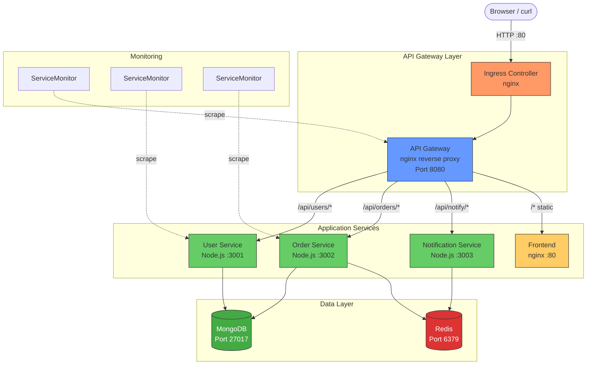
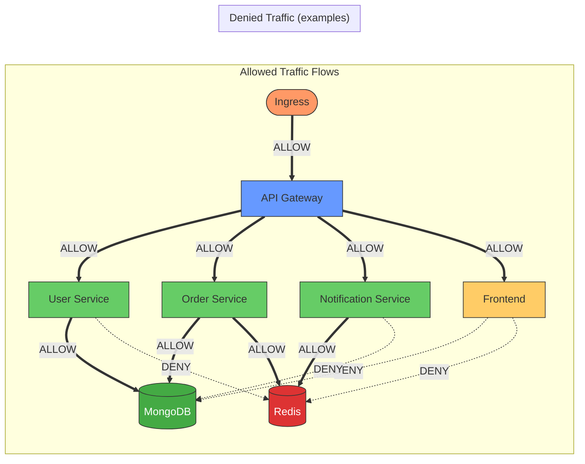

# File 47: Building a Complete Microservices Application on Kubernetes

**Topic:** End-to-end microservices deployment with API gateway, databases, message queue, network policies, autoscaling, and monitoring.

**WHY THIS MATTERS:** Every production Kubernetes cluster runs microservices. This capstone project ties together Deployments, Services, ConfigMaps, Secrets, Ingress, NetworkPolicies, HPA, health probes, and monitoring into a single cohesive application. Building it yourself is the fastest way to internalize how all the pieces fit together.

---

## Story: The Multi-Brand Food Court in a Mall

Picture a food court in a large Indian mall — Phoenix Marketcity or Lulu Mall. Each food stall is an independent business: the dosa counter, the biryani stall, the chaat corner, the juice bar, the dessert shop. Each runs its own kitchen, its own menu, its own staff. Yet to the customer, it feels like one experience.

The **mall directory** at the entrance tells you where each stall is — that is your **API Gateway**. The **shared payment counter** (Paytm/UPI terminal) is your **shared database layer**. The **order number display board** that flashes "Order #247 Ready!" is your **message queue / notification service**. The **mall security** that controls who enters the kitchen area vs. the dining area — those are your **Network Policies**.

No single stall failing should shut down the entire food court. If the biryani stall runs out of rice, the dosa counter keeps serving. If the chaat corner gets a rush of customers, the mall manager (HPA) opens another counter. This is microservices architecture — independent, resilient, scalable.

---

## Prerequisites

| Tool | Version | Purpose |
|------|---------|---------|
| kind | v0.20+ | Local multi-node Kubernetes cluster |
| kubectl | v1.28+ | Cluster management |
| helm | v3.12+ | Package manager for monitoring stack |
| docker | v24+ | Building container images |

### Install Commands

```bash
# kind (if not installed)
go install sigs.k8s.io/kind@v0.20.0
# or on macOS:
brew install kind

# Create a kind cluster with a local registry
cat <<EOF | kind create cluster --config=-
kind: Cluster
apiVersion: kind.x-k8s.io/v1alpha4
name: foodcourt
nodes:
  - role: control-plane
    kubeadmConfigPatches:
      - |
        kind: InitConfiguration
        nodeRegistration:
          kubeletExtraConfig:
            maxPods: 110
    extraPortMappings:
      - containerPort: 80
        hostPort: 80
        protocol: TCP
      - containerPort: 443
        hostPort: 443
        protocol: TCP
  - role: worker
  - role: worker
EOF

# Verify
kubectl cluster-info --context kind-foodcourt
kubectl get nodes
```

**Expected output:**
```
NAME                      STATUS   ROLES           AGE   VERSION
foodcourt-control-plane   Ready    control-plane   60s   v1.28.0
foodcourt-worker          Ready    <none>          40s   v1.28.0
foodcourt-worker2         Ready    <none>          40s   v1.28.0
```

---

## Architecture Overview



---

## Step 1: Project Structure

Create the project directory tree:

```bash
mkdir -p foodcourt-app/{frontend,api-gateway,user-service,order-service,notification-service,k8s/{base,network-policies,monitoring}}

tree foodcourt-app/
```

**Expected structure:**
```
foodcourt-app/
├── frontend/
├── api-gateway/
├── user-service/
├── order-service/
├── notification-service/
└── k8s/
    ├── base/
    ├── network-policies/
    └── monitoring/
```

---

## Step 2: Build the Services

### 2a. Frontend (nginx serving static files)

```bash
cat > foodcourt-app/frontend/index.html <<'HTMLEOF'
<!DOCTYPE html>
<html>
<head><title>FoodCourt App</title></head>
<body>
  <h1>Welcome to FoodCourt</h1>
  <div id="app">
    <button onclick="fetchUsers()">List Users</button>
    <button onclick="createOrder()">Create Order</button>
    <pre id="output"></pre>
  </div>
  <script>
    async function fetchUsers() {
      const res = await fetch('/api/users');
      document.getElementById('output').textContent = JSON.stringify(await res.json(), null, 2);
    }
    async function createOrder() {
      const res = await fetch('/api/orders', {
        method: 'POST',
        headers: {'Content-Type': 'application/json'},
        body: JSON.stringify({item: 'biryani', qty: 2})
      });
      document.getElementById('output').textContent = JSON.stringify(await res.json(), null, 2);
    }
  </script>
</body>
</html>
HTMLEOF

cat > foodcourt-app/frontend/Dockerfile <<'EOF'
FROM nginx:1.25-alpine
COPY index.html /usr/share/nginx/html/index.html
EXPOSE 80
EOF
```

### 2b. User Service (Node.js)

```bash
cat > foodcourt-app/user-service/server.js <<'EOF'
const http = require('http');
const { MongoClient } = require('mongodb');

const PORT = 3001;
const MONGO_URI = process.env.MONGO_URI || 'mongodb://mongodb:27017';

let db;

async function connectDB() {
  const client = new MongoClient(MONGO_URI);
  await client.connect();
  db = client.db('foodcourt');
  console.log('Connected to MongoDB');
}

const server = http.createServer(async (req, res) => {
  res.setHeader('Content-Type', 'application/json');

  // Health check
  if (req.url === '/healthz') {
    res.writeHead(200);
    return res.end(JSON.stringify({ status: 'ok', service: 'user-service' }));
  }

  // Readiness check
  if (req.url === '/readyz') {
    const ready = db !== undefined;
    res.writeHead(ready ? 200 : 503);
    return res.end(JSON.stringify({ ready }));
  }

  // Metrics endpoint
  if (req.url === '/metrics') {
    res.setHeader('Content-Type', 'text/plain');
    res.writeHead(200);
    return res.end(`# HELP http_requests_total Total requests\nhttp_requests_total{service="user-service"} 1\n`);
  }

  // GET /api/users
  if (req.method === 'GET' && req.url === '/api/users') {
    const users = await db.collection('users').find({}).toArray();
    res.writeHead(200);
    return res.end(JSON.stringify({ users }));
  }

  // POST /api/users
  if (req.method === 'POST' && req.url === '/api/users') {
    let body = '';
    req.on('data', chunk => body += chunk);
    req.on('end', async () => {
      const user = JSON.parse(body);
      await db.collection('users').insertOne(user);
      res.writeHead(201);
      res.end(JSON.stringify({ created: user }));
    });
    return;
  }

  res.writeHead(404);
  res.end(JSON.stringify({ error: 'not found' }));
});

connectDB().then(() => {
  server.listen(PORT, () => console.log(`user-service listening on ${PORT}`));
});
EOF

cat > foodcourt-app/user-service/package.json <<'EOF'
{
  "name": "user-service",
  "version": "1.0.0",
  "main": "server.js",
  "dependencies": { "mongodb": "^6.0.0" }
}
EOF

cat > foodcourt-app/user-service/Dockerfile <<'EOF'
FROM node:20-alpine
WORKDIR /app
COPY package.json .
RUN npm install --production
COPY server.js .
USER node
EXPOSE 3001
CMD ["node", "server.js"]
EOF
```

### 2c. Order Service (Node.js)

```bash
cat > foodcourt-app/order-service/server.js <<'EOF'
const http = require('http');
const { MongoClient } = require('mongodb');
const { createClient } = require('redis');

const PORT = 3002;
const MONGO_URI = process.env.MONGO_URI || 'mongodb://mongodb:27017';
const REDIS_URL = process.env.REDIS_URL || 'redis://redis:6379';

let db, redis;

async function connectAll() {
  const mongo = new MongoClient(MONGO_URI);
  await mongo.connect();
  db = mongo.db('foodcourt');

  redis = createClient({ url: REDIS_URL });
  await redis.connect();
  console.log('Connected to MongoDB and Redis');
}

const server = http.createServer(async (req, res) => {
  res.setHeader('Content-Type', 'application/json');

  if (req.url === '/healthz') {
    res.writeHead(200);
    return res.end(JSON.stringify({ status: 'ok', service: 'order-service' }));
  }

  if (req.url === '/readyz') {
    const ready = db !== undefined && redis !== undefined;
    res.writeHead(ready ? 200 : 503);
    return res.end(JSON.stringify({ ready }));
  }

  if (req.url === '/metrics') {
    res.setHeader('Content-Type', 'text/plain');
    res.writeHead(200);
    return res.end(`# HELP orders_total Total orders\norders_total{service="order-service"} 1\n`);
  }

  // GET /api/orders
  if (req.method === 'GET' && req.url === '/api/orders') {
    const orders = await db.collection('orders').find({}).toArray();
    res.writeHead(200);
    return res.end(JSON.stringify({ orders }));
  }

  // POST /api/orders
  if (req.method === 'POST' && req.url === '/api/orders') {
    let body = '';
    req.on('data', chunk => body += chunk);
    req.on('end', async () => {
      const order = JSON.parse(body);
      order.status = 'pending';
      order.createdAt = new Date().toISOString();
      await db.collection('orders').insertOne(order);
      // Publish to Redis for notification-service
      await redis.publish('orders', JSON.stringify(order));
      res.writeHead(201);
      res.end(JSON.stringify({ created: order }));
    });
    return;
  }

  res.writeHead(404);
  res.end(JSON.stringify({ error: 'not found' }));
});

connectAll().then(() => {
  server.listen(PORT, () => console.log(`order-service listening on ${PORT}`));
});
EOF

cat > foodcourt-app/order-service/package.json <<'EOF'
{
  "name": "order-service",
  "version": "1.0.0",
  "main": "server.js",
  "dependencies": { "mongodb": "^6.0.0", "redis": "^4.6.0" }
}
EOF

cat > foodcourt-app/order-service/Dockerfile <<'EOF'
FROM node:20-alpine
WORKDIR /app
COPY package.json .
RUN npm install --production
COPY server.js .
USER node
EXPOSE 3002
CMD ["node", "server.js"]
EOF
```

### 2d. Notification Service (Node.js)

```bash
cat > foodcourt-app/notification-service/server.js <<'EOF'
const http = require('http');
const { createClient } = require('redis');

const PORT = 3003;
const REDIS_URL = process.env.REDIS_URL || 'redis://redis:6379';

let subscriber;
const notifications = [];

async function connectRedis() {
  subscriber = createClient({ url: REDIS_URL });
  await subscriber.connect();
  await subscriber.subscribe('orders', (message) => {
    const order = JSON.parse(message);
    const notification = {
      message: `Order received: ${order.item} x${order.qty}`,
      timestamp: new Date().toISOString()
    };
    notifications.push(notification);
    console.log('Notification:', notification.message);
  });
  console.log('Subscribed to orders channel');
}

const server = http.createServer((req, res) => {
  res.setHeader('Content-Type', 'application/json');

  if (req.url === '/healthz') {
    res.writeHead(200);
    return res.end(JSON.stringify({ status: 'ok', service: 'notification-service' }));
  }

  if (req.url === '/readyz') {
    res.writeHead(subscriber ? 200 : 503);
    return res.end(JSON.stringify({ ready: !!subscriber }));
  }

  if (req.method === 'GET' && req.url === '/api/notify') {
    res.writeHead(200);
    return res.end(JSON.stringify({ notifications: notifications.slice(-20) }));
  }

  res.writeHead(404);
  res.end(JSON.stringify({ error: 'not found' }));
});

connectRedis().then(() => {
  server.listen(PORT, () => console.log(`notification-service listening on ${PORT}`));
});
EOF

cat > foodcourt-app/notification-service/package.json <<'EOF'
{
  "name": "notification-service",
  "version": "1.0.0",
  "main": "server.js",
  "dependencies": { "redis": "^4.6.0" }
}
EOF

cat > foodcourt-app/notification-service/Dockerfile <<'EOF'
FROM node:20-alpine
WORKDIR /app
COPY package.json .
RUN npm install --production
COPY server.js .
USER node
EXPOSE 3003
CMD ["node", "server.js"]
EOF
```

### 2e. API Gateway (nginx reverse proxy)

```bash
cat > foodcourt-app/api-gateway/nginx.conf <<'EOF'
upstream user_service {
    server user-service:3001;
}
upstream order_service {
    server order-service:3002;
}
upstream notification_service {
    server notification-service:3003;
}
upstream frontend {
    server frontend:80;
}

server {
    listen 8080;
    server_name _;

    # Health check for the gateway itself
    location /healthz {
        return 200 '{"status":"ok","service":"api-gateway"}';
        add_header Content-Type application/json;
    }

    location /api/users {
        proxy_pass http://user_service;
        proxy_set_header Host $host;
        proxy_set_header X-Real-IP $remote_addr;
    }

    location /api/orders {
        proxy_pass http://order_service;
        proxy_set_header Host $host;
        proxy_set_header X-Real-IP $remote_addr;
    }

    location /api/notify {
        proxy_pass http://notification_service;
        proxy_set_header Host $host;
        proxy_set_header X-Real-IP $remote_addr;
    }

    location / {
        proxy_pass http://frontend;
        proxy_set_header Host $host;
    }
}
EOF

cat > foodcourt-app/api-gateway/Dockerfile <<'EOF'
FROM nginx:1.25-alpine
COPY nginx.conf /etc/nginx/conf.d/default.conf
EXPOSE 8080
EOF
```

### Build and Load Images into kind

```bash
# Build all images
docker build -t foodcourt/frontend:v1 foodcourt-app/frontend/
docker build -t foodcourt/api-gateway:v1 foodcourt-app/api-gateway/
docker build -t foodcourt/user-service:v1 foodcourt-app/user-service/
docker build -t foodcourt/order-service:v1 foodcourt-app/order-service/
docker build -t foodcourt/notification-service:v1 foodcourt-app/notification-service/

# Load images into kind cluster
kind load docker-image foodcourt/frontend:v1 --name foodcourt
kind load docker-image foodcourt/api-gateway:v1 --name foodcourt
kind load docker-image foodcourt/user-service:v1 --name foodcourt
kind load docker-image foodcourt/order-service:v1 --name foodcourt
kind load docker-image foodcourt/notification-service:v1 --name foodcourt
```

---

## Step 3: Kubernetes Manifests — Namespace, ConfigMaps, and Secrets

### 3a. Namespace

```bash
cat > foodcourt-app/k8s/base/namespace.yaml <<'EOF'
apiVersion: v1
kind: Namespace
metadata:
  name: foodcourt
  labels:
    app.kubernetes.io/part-of: foodcourt
    # Enable network policy enforcement
    kubernetes.io/metadata.name: foodcourt
EOF

kubectl apply -f foodcourt-app/k8s/base/namespace.yaml
```

### 3b. ConfigMap

```bash
cat > foodcourt-app/k8s/base/configmap.yaml <<'EOF'
apiVersion: v1
kind: ConfigMap
metadata:
  name: foodcourt-config
  namespace: foodcourt
data:
  MONGO_URI: "mongodb://mongodb:27017"
  REDIS_URL: "redis://redis:6379"
  LOG_LEVEL: "info"
  NODE_ENV: "production"
EOF

kubectl apply -f foodcourt-app/k8s/base/configmap.yaml
```

### 3c. Secret (for MongoDB credentials)

```bash
cat > foodcourt-app/k8s/base/secret.yaml <<'EOF'
apiVersion: v1
kind: Secret
metadata:
  name: foodcourt-secrets
  namespace: foodcourt
type: Opaque
stringData:
  MONGO_ROOT_USERNAME: "admin"
  MONGO_ROOT_PASSWORD: "changeme-in-production"
  # In production, use External Secrets Operator or Sealed Secrets
EOF

kubectl apply -f foodcourt-app/k8s/base/secret.yaml
```

---

## Step 4: Database Deployments (MongoDB and Redis)

### 4a. MongoDB

```bash
cat > foodcourt-app/k8s/base/mongodb.yaml <<'EOF'
apiVersion: apps/v1
kind: Deployment
metadata:
  name: mongodb
  namespace: foodcourt
  labels:
    app: mongodb
    tier: data
spec:
  replicas: 1
  selector:
    matchLabels:
      app: mongodb
  template:
    metadata:
      labels:
        app: mongodb
        tier: data
    spec:
      containers:
        - name: mongodb
          image: mongo:7.0
          ports:
            - containerPort: 27017
          env:
            - name: MONGO_INITDB_ROOT_USERNAME
              valueFrom:
                secretKeyRef:
                  name: foodcourt-secrets
                  key: MONGO_ROOT_USERNAME
            - name: MONGO_INITDB_ROOT_PASSWORD
              valueFrom:
                secretKeyRef:
                  name: foodcourt-secrets
                  key: MONGO_ROOT_PASSWORD
          resources:
            requests:
              memory: "256Mi"
              cpu: "250m"
            limits:
              memory: "512Mi"
              cpu: "500m"
          livenessProbe:
            exec:
              command:
                - mongosh
                - --eval
                - "db.adminCommand('ping')"
            initialDelaySeconds: 30
            periodSeconds: 10
          readinessProbe:
            exec:
              command:
                - mongosh
                - --eval
                - "db.adminCommand('ping')"
            initialDelaySeconds: 5
            periodSeconds: 5
          volumeMounts:
            - name: mongo-data
              mountPath: /data/db
      volumes:
        - name: mongo-data
          emptyDir: {}
---
apiVersion: v1
kind: Service
metadata:
  name: mongodb
  namespace: foodcourt
  labels:
    app: mongodb
spec:
  selector:
    app: mongodb
  ports:
    - port: 27017
      targetPort: 27017
  type: ClusterIP
EOF

kubectl apply -f foodcourt-app/k8s/base/mongodb.yaml
```

### 4b. Redis

```bash
cat > foodcourt-app/k8s/base/redis.yaml <<'EOF'
apiVersion: apps/v1
kind: Deployment
metadata:
  name: redis
  namespace: foodcourt
  labels:
    app: redis
    tier: data
spec:
  replicas: 1
  selector:
    matchLabels:
      app: redis
  template:
    metadata:
      labels:
        app: redis
        tier: data
    spec:
      containers:
        - name: redis
          image: redis:7-alpine
          ports:
            - containerPort: 6379
          resources:
            requests:
              memory: "64Mi"
              cpu: "100m"
            limits:
              memory: "128Mi"
              cpu: "200m"
          livenessProbe:
            exec:
              command: ["redis-cli", "ping"]
            initialDelaySeconds: 10
            periodSeconds: 5
          readinessProbe:
            exec:
              command: ["redis-cli", "ping"]
            initialDelaySeconds: 5
            periodSeconds: 3
---
apiVersion: v1
kind: Service
metadata:
  name: redis
  namespace: foodcourt
  labels:
    app: redis
spec:
  selector:
    app: redis
  ports:
    - port: 6379
      targetPort: 6379
  type: ClusterIP
EOF

kubectl apply -f foodcourt-app/k8s/base/redis.yaml
```

---

## Step 5: Application Service Deployments

### 5a. Frontend

```bash
cat > foodcourt-app/k8s/base/frontend.yaml <<'EOF'
apiVersion: apps/v1
kind: Deployment
metadata:
  name: frontend
  namespace: foodcourt
  labels:
    app: frontend
    tier: web
spec:
  replicas: 2
  selector:
    matchLabels:
      app: frontend
  template:
    metadata:
      labels:
        app: frontend
        tier: web
    spec:
      containers:
        - name: frontend
          image: foodcourt/frontend:v1
          imagePullPolicy: Never
          ports:
            - containerPort: 80
          resources:
            requests:
              memory: "32Mi"
              cpu: "50m"
            limits:
              memory: "64Mi"
              cpu: "100m"
          livenessProbe:
            httpGet:
              path: /
              port: 80
            initialDelaySeconds: 5
            periodSeconds: 10
          readinessProbe:
            httpGet:
              path: /
              port: 80
            initialDelaySeconds: 3
            periodSeconds: 5
---
apiVersion: v1
kind: Service
metadata:
  name: frontend
  namespace: foodcourt
spec:
  selector:
    app: frontend
  ports:
    - port: 80
      targetPort: 80
  type: ClusterIP
EOF

kubectl apply -f foodcourt-app/k8s/base/frontend.yaml
```

### 5b. User Service

```bash
cat > foodcourt-app/k8s/base/user-service.yaml <<'EOF'
apiVersion: apps/v1
kind: Deployment
metadata:
  name: user-service
  namespace: foodcourt
  labels:
    app: user-service
    tier: app
spec:
  replicas: 2
  selector:
    matchLabels:
      app: user-service
  template:
    metadata:
      labels:
        app: user-service
        tier: app
    spec:
      containers:
        - name: user-service
          image: foodcourt/user-service:v1
          imagePullPolicy: Never
          ports:
            - containerPort: 3001
          envFrom:
            - configMapRef:
                name: foodcourt-config
          resources:
            requests:
              memory: "64Mi"
              cpu: "100m"
            limits:
              memory: "128Mi"
              cpu: "250m"
          livenessProbe:
            httpGet:
              path: /healthz
              port: 3001
            initialDelaySeconds: 10
            periodSeconds: 10
            failureThreshold: 3
          readinessProbe:
            httpGet:
              path: /readyz
              port: 3001
            initialDelaySeconds: 5
            periodSeconds: 5
            failureThreshold: 2
          startupProbe:
            httpGet:
              path: /healthz
              port: 3001
            failureThreshold: 30
            periodSeconds: 2
---
apiVersion: v1
kind: Service
metadata:
  name: user-service
  namespace: foodcourt
spec:
  selector:
    app: user-service
  ports:
    - port: 3001
      targetPort: 3001
  type: ClusterIP
EOF

kubectl apply -f foodcourt-app/k8s/base/user-service.yaml
```

### 5c. Order Service

```bash
cat > foodcourt-app/k8s/base/order-service.yaml <<'EOF'
apiVersion: apps/v1
kind: Deployment
metadata:
  name: order-service
  namespace: foodcourt
  labels:
    app: order-service
    tier: app
spec:
  replicas: 2
  selector:
    matchLabels:
      app: order-service
  strategy:
    rollingUpdate:
      maxSurge: 1
      maxUnavailable: 0
    type: RollingUpdate
  template:
    metadata:
      labels:
        app: order-service
        tier: app
    spec:
      containers:
        - name: order-service
          image: foodcourt/order-service:v1
          imagePullPolicy: Never
          ports:
            - containerPort: 3002
          envFrom:
            - configMapRef:
                name: foodcourt-config
          resources:
            requests:
              memory: "64Mi"
              cpu: "100m"
            limits:
              memory: "128Mi"
              cpu: "250m"
          livenessProbe:
            httpGet:
              path: /healthz
              port: 3002
            initialDelaySeconds: 10
            periodSeconds: 10
          readinessProbe:
            httpGet:
              path: /readyz
              port: 3002
            initialDelaySeconds: 5
            periodSeconds: 5
          startupProbe:
            httpGet:
              path: /healthz
              port: 3002
            failureThreshold: 30
            periodSeconds: 2
---
apiVersion: v1
kind: Service
metadata:
  name: order-service
  namespace: foodcourt
spec:
  selector:
    app: order-service
  ports:
    - port: 3002
      targetPort: 3002
  type: ClusterIP
EOF

kubectl apply -f foodcourt-app/k8s/base/order-service.yaml
```

### 5d. Notification Service

```bash
cat > foodcourt-app/k8s/base/notification-service.yaml <<'EOF'
apiVersion: apps/v1
kind: Deployment
metadata:
  name: notification-service
  namespace: foodcourt
  labels:
    app: notification-service
    tier: app
spec:
  replicas: 1
  selector:
    matchLabels:
      app: notification-service
  template:
    metadata:
      labels:
        app: notification-service
        tier: app
    spec:
      containers:
        - name: notification-service
          image: foodcourt/notification-service:v1
          imagePullPolicy: Never
          ports:
            - containerPort: 3003
          envFrom:
            - configMapRef:
                name: foodcourt-config
          resources:
            requests:
              memory: "64Mi"
              cpu: "50m"
            limits:
              memory: "128Mi"
              cpu: "150m"
          livenessProbe:
            httpGet:
              path: /healthz
              port: 3003
            initialDelaySeconds: 10
            periodSeconds: 10
          readinessProbe:
            httpGet:
              path: /readyz
              port: 3003
            initialDelaySeconds: 5
            periodSeconds: 5
---
apiVersion: v1
kind: Service
metadata:
  name: notification-service
  namespace: foodcourt
spec:
  selector:
    app: notification-service
  ports:
    - port: 3003
      targetPort: 3003
  type: ClusterIP
EOF

kubectl apply -f foodcourt-app/k8s/base/notification-service.yaml
```

### 5e. API Gateway

```bash
cat > foodcourt-app/k8s/base/api-gateway.yaml <<'EOF'
apiVersion: apps/v1
kind: Deployment
metadata:
  name: api-gateway
  namespace: foodcourt
  labels:
    app: api-gateway
    tier: gateway
spec:
  replicas: 2
  selector:
    matchLabels:
      app: api-gateway
  strategy:
    rollingUpdate:
      maxSurge: 1
      maxUnavailable: 0
    type: RollingUpdate
  template:
    metadata:
      labels:
        app: api-gateway
        tier: gateway
    spec:
      containers:
        - name: api-gateway
          image: foodcourt/api-gateway:v1
          imagePullPolicy: Never
          ports:
            - containerPort: 8080
          resources:
            requests:
              memory: "32Mi"
              cpu: "50m"
            limits:
              memory: "64Mi"
              cpu: "200m"
          livenessProbe:
            httpGet:
              path: /healthz
              port: 8080
            initialDelaySeconds: 5
            periodSeconds: 10
          readinessProbe:
            httpGet:
              path: /healthz
              port: 8080
            initialDelaySeconds: 3
            periodSeconds: 5
---
apiVersion: v1
kind: Service
metadata:
  name: api-gateway
  namespace: foodcourt
spec:
  selector:
    app: api-gateway
  ports:
    - port: 8080
      targetPort: 8080
  type: ClusterIP
EOF

kubectl apply -f foodcourt-app/k8s/base/api-gateway.yaml
```

### Verify all pods are running

```bash
kubectl get pods -n foodcourt -o wide
```

**Expected output:**
```
NAME                                    READY   STATUS    RESTARTS   AGE   NODE
api-gateway-7f8b9c5d4-abc12            1/1     Running   0          30s   foodcourt-worker
api-gateway-7f8b9c5d4-def34            1/1     Running   0          30s   foodcourt-worker2
frontend-6d4f7b8c9-ghi56               1/1     Running   0          45s   foodcourt-worker
frontend-6d4f7b8c9-jkl78               1/1     Running   0          45s   foodcourt-worker2
mongodb-5c9d8f7e6-mno90                1/1     Running   0          60s   foodcourt-worker
notification-service-4b3a2c1d-pqr12    1/1     Running   0          30s   foodcourt-worker2
order-service-8e7d6c5b-stu34           1/1     Running   0          35s   foodcourt-worker
order-service-8e7d6c5b-vwx56           1/1     Running   0          35s   foodcourt-worker2
redis-3a2b1c0d-yza78                   1/1     Running   0          55s   foodcourt-worker
user-service-9f8e7d6c-bcd90            1/1     Running   0          40s   foodcourt-worker
user-service-9f8e7d6c-efg12            1/1     Running   0          40s   foodcourt-worker2
```

---

## Step 6: Ingress Routing

### Install NGINX Ingress Controller

```bash
kubectl apply -f https://raw.githubusercontent.com/kubernetes/ingress-nginx/main/deploy/static/provider/kind/deploy.yaml

# Wait for it to be ready
kubectl wait --namespace ingress-nginx \
  --for=condition=ready pod \
  --selector=app.kubernetes.io/component=controller \
  --timeout=120s
```

### Create Ingress Resource

```bash
cat > foodcourt-app/k8s/base/ingress.yaml <<'EOF'
apiVersion: networking.k8s.io/v1
kind: Ingress
metadata:
  name: foodcourt-ingress
  namespace: foodcourt
  annotations:
    nginx.ingress.kubernetes.io/rewrite-target: /
    nginx.ingress.kubernetes.io/proxy-body-size: "10m"
    nginx.ingress.kubernetes.io/rate-limit: "100"
    nginx.ingress.kubernetes.io/rate-limit-window: "1m"
spec:
  ingressClassName: nginx
  rules:
    - host: foodcourt.local
      http:
        paths:
          - path: /
            pathType: Prefix
            backend:
              service:
                name: api-gateway
                port:
                  number: 8080
EOF

kubectl apply -f foodcourt-app/k8s/base/ingress.yaml
```

### Test the Ingress

```bash
# Add to /etc/hosts (or use curl with Host header)
curl -H "Host: foodcourt.local" http://localhost/healthz

# Expected output:
# {"status":"ok","service":"api-gateway"}

curl -H "Host: foodcourt.local" http://localhost/api/users
# {"users":[]}
```

---

## Step 7: Network Policies (Default Deny + Selective Allow)



### 7a. Default Deny All

```bash
cat > foodcourt-app/k8s/network-policies/default-deny.yaml <<'EOF'
apiVersion: networking.k8s.io/v1
kind: NetworkPolicy
metadata:
  name: default-deny-all
  namespace: foodcourt
spec:
  podSelector: {}
  policyTypes:
    - Ingress
    - Egress
EOF

kubectl apply -f foodcourt-app/k8s/network-policies/default-deny.yaml
```

### 7b. Allow DNS (Required for all pods)

```bash
cat > foodcourt-app/k8s/network-policies/allow-dns.yaml <<'EOF'
apiVersion: networking.k8s.io/v1
kind: NetworkPolicy
metadata:
  name: allow-dns
  namespace: foodcourt
spec:
  podSelector: {}
  policyTypes:
    - Egress
  egress:
    - to: []
      ports:
        - protocol: UDP
          port: 53
        - protocol: TCP
          port: 53
EOF

kubectl apply -f foodcourt-app/k8s/network-policies/allow-dns.yaml
```

### 7c. Allow Ingress to API Gateway

```bash
cat > foodcourt-app/k8s/network-policies/allow-ingress-to-gateway.yaml <<'EOF'
apiVersion: networking.k8s.io/v1
kind: NetworkPolicy
metadata:
  name: allow-ingress-to-gateway
  namespace: foodcourt
spec:
  podSelector:
    matchLabels:
      app: api-gateway
  policyTypes:
    - Ingress
  ingress:
    - from:
        - namespaceSelector:
            matchLabels:
              kubernetes.io/metadata.name: ingress-nginx
      ports:
        - port: 8080
EOF

kubectl apply -f foodcourt-app/k8s/network-policies/allow-ingress-to-gateway.yaml
```

### 7d. Allow API Gateway to Backend Services

```bash
cat > foodcourt-app/k8s/network-policies/allow-gateway-to-backends.yaml <<'EOF'
apiVersion: networking.k8s.io/v1
kind: NetworkPolicy
metadata:
  name: allow-gateway-to-backends
  namespace: foodcourt
spec:
  podSelector:
    matchLabels:
      app: api-gateway
  policyTypes:
    - Egress
  egress:
    - to:
        - podSelector:
            matchLabels:
              app: frontend
      ports:
        - port: 80
    - to:
        - podSelector:
            matchLabels:
              app: user-service
      ports:
        - port: 3001
    - to:
        - podSelector:
            matchLabels:
              app: order-service
      ports:
        - port: 3002
    - to:
        - podSelector:
            matchLabels:
              app: notification-service
      ports:
        - port: 3003
---
# Allow backend services to accept traffic from gateway
apiVersion: networking.k8s.io/v1
kind: NetworkPolicy
metadata:
  name: allow-backends-from-gateway
  namespace: foodcourt
spec:
  podSelector:
    matchExpressions:
      - key: app
        operator: In
        values: [frontend, user-service, order-service, notification-service]
  policyTypes:
    - Ingress
  ingress:
    - from:
        - podSelector:
            matchLabels:
              app: api-gateway
EOF

kubectl apply -f foodcourt-app/k8s/network-policies/allow-gateway-to-backends.yaml
```

### 7e. Allow App Services to Data Layer

```bash
cat > foodcourt-app/k8s/network-policies/allow-app-to-data.yaml <<'EOF'
# User-service and Order-service -> MongoDB
apiVersion: networking.k8s.io/v1
kind: NetworkPolicy
metadata:
  name: allow-apps-to-mongodb
  namespace: foodcourt
spec:
  podSelector:
    matchLabels:
      app: mongodb
  policyTypes:
    - Ingress
  ingress:
    - from:
        - podSelector:
            matchExpressions:
              - key: app
                operator: In
                values: [user-service, order-service]
      ports:
        - port: 27017
---
# Order-service and Notification-service -> Redis
apiVersion: networking.k8s.io/v1
kind: NetworkPolicy
metadata:
  name: allow-apps-to-redis
  namespace: foodcourt
spec:
  podSelector:
    matchLabels:
      app: redis
  policyTypes:
    - Ingress
  ingress:
    - from:
        - podSelector:
            matchExpressions:
              - key: app
                operator: In
                values: [order-service, notification-service]
      ports:
        - port: 6379
---
# Egress from user-service to MongoDB
apiVersion: networking.k8s.io/v1
kind: NetworkPolicy
metadata:
  name: user-service-egress
  namespace: foodcourt
spec:
  podSelector:
    matchLabels:
      app: user-service
  policyTypes:
    - Egress
  egress:
    - to:
        - podSelector:
            matchLabels:
              app: mongodb
      ports:
        - port: 27017
---
# Egress from order-service to MongoDB and Redis
apiVersion: networking.k8s.io/v1
kind: NetworkPolicy
metadata:
  name: order-service-egress
  namespace: foodcourt
spec:
  podSelector:
    matchLabels:
      app: order-service
  policyTypes:
    - Egress
  egress:
    - to:
        - podSelector:
            matchLabels:
              app: mongodb
      ports:
        - port: 27017
    - to:
        - podSelector:
            matchLabels:
              app: redis
      ports:
        - port: 6379
---
# Egress from notification-service to Redis
apiVersion: networking.k8s.io/v1
kind: NetworkPolicy
metadata:
  name: notification-service-egress
  namespace: foodcourt
spec:
  podSelector:
    matchLabels:
      app: notification-service
  policyTypes:
    - Egress
  egress:
    - to:
        - podSelector:
            matchLabels:
              app: redis
      ports:
        - port: 6379
EOF

kubectl apply -f foodcourt-app/k8s/network-policies/allow-app-to-data.yaml
```

### Verify Network Policies

```bash
kubectl get networkpolicies -n foodcourt

# Test: user-service should NOT reach Redis
kubectl exec -n foodcourt deploy/user-service -- \
  wget --timeout=2 -qO- http://redis:6379 2>&1 || echo "BLOCKED as expected"

# Test: order-service SHOULD reach MongoDB
kubectl exec -n foodcourt deploy/order-service -- \
  wget --timeout=2 -qO- http://mongodb:27017 2>&1 && echo "ALLOWED" || echo "check connectivity"
```

---

## Step 8: Horizontal Pod Autoscaling (HPA)

```bash
# Install metrics-server for kind
kubectl apply -f https://github.com/kubernetes-sigs/metrics-server/releases/latest/download/components.yaml

# Patch metrics-server for kind (insecure TLS)
kubectl patch deployment metrics-server -n kube-system \
  --type='json' \
  -p='[{"op":"add","path":"/spec/template/spec/containers/0/args/-","value":"--kubelet-insecure-tls"}]'

# Wait for metrics-server
kubectl wait --for=condition=ready pod -l k8s-app=metrics-server -n kube-system --timeout=120s
```

### HPA for API Gateway

```bash
cat > foodcourt-app/k8s/base/hpa-gateway.yaml <<'EOF'
apiVersion: autoscaling/v2
kind: HorizontalPodAutoscaler
metadata:
  name: api-gateway-hpa
  namespace: foodcourt
spec:
  scaleTargetRef:
    apiVersion: apps/v1
    kind: Deployment
    name: api-gateway
  minReplicas: 2
  maxReplicas: 8
  metrics:
    - type: Resource
      resource:
        name: cpu
        target:
          type: Utilization
          averageUtilization: 60
    - type: Resource
      resource:
        name: memory
        target:
          type: Utilization
          averageUtilization: 75
  behavior:
    scaleUp:
      stabilizationWindowSeconds: 30
      policies:
        - type: Pods
          value: 2
          periodSeconds: 60
    scaleDown:
      stabilizationWindowSeconds: 300
      policies:
        - type: Pods
          value: 1
          periodSeconds: 120
EOF

kubectl apply -f foodcourt-app/k8s/base/hpa-gateway.yaml
```

### HPA for Order Service

```bash
cat > foodcourt-app/k8s/base/hpa-order-service.yaml <<'EOF'
apiVersion: autoscaling/v2
kind: HorizontalPodAutoscaler
metadata:
  name: order-service-hpa
  namespace: foodcourt
spec:
  scaleTargetRef:
    apiVersion: apps/v1
    kind: Deployment
    name: order-service
  minReplicas: 2
  maxReplicas: 10
  metrics:
    - type: Resource
      resource:
        name: cpu
        target:
          type: Utilization
          averageUtilization: 50
  behavior:
    scaleUp:
      stabilizationWindowSeconds: 15
      policies:
        - type: Percent
          value: 100
          periodSeconds: 30
    scaleDown:
      stabilizationWindowSeconds: 300
EOF

kubectl apply -f foodcourt-app/k8s/base/hpa-order-service.yaml
```

### Verify HPA

```bash
kubectl get hpa -n foodcourt

# Expected output:
# NAME                 REFERENCE              TARGETS   MINPODS   MAXPODS   REPLICAS   AGE
# api-gateway-hpa      Deployment/api-gateway  5%/60%   2         8         2          30s
# order-service-hpa    Deployment/order-service 3%/50%  2         10        2          15s
```

---

## Step 9: Monitoring with ServiceMonitors

### Install Prometheus Stack

```bash
helm repo add prometheus-community https://prometheus-community.github.io/helm-charts
helm repo update

helm install monitoring prometheus-community/kube-prometheus-stack \
  --namespace monitoring \
  --create-namespace \
  --set prometheus.prometheusSpec.serviceMonitorSelectorNilUsesHelmValues=false \
  --wait --timeout 5m
```

### Create ServiceMonitors

```bash
cat > foodcourt-app/k8s/monitoring/service-monitors.yaml <<'EOF'
apiVersion: monitoring.coreos.com/v1
kind: ServiceMonitor
metadata:
  name: foodcourt-services
  namespace: foodcourt
  labels:
    release: monitoring
spec:
  selector:
    matchExpressions:
      - key: app
        operator: In
        values:
          - api-gateway
          - user-service
          - order-service
  endpoints:
    - port: "http"
      path: /metrics
      interval: 15s
  namespaceSelector:
    matchNames:
      - foodcourt
EOF

kubectl apply -f foodcourt-app/k8s/monitoring/service-monitors.yaml
```

### Verify Prometheus Targets

```bash
# Port-forward to Prometheus
kubectl port-forward -n monitoring svc/monitoring-kube-prometheus-prometheus 9090:9090 &

# Check targets (after a moment)
curl -s http://localhost:9090/api/v1/targets | python3 -m json.tool | head -20

# Kill port-forward
kill %1
```

---

## Step 10: Rolling Update with Zero-Downtime Verification

### Deploy PodDisruptionBudgets

```bash
cat > foodcourt-app/k8s/base/pdbs.yaml <<'EOF'
apiVersion: policy/v1
kind: PodDisruptionBudget
metadata:
  name: api-gateway-pdb
  namespace: foodcourt
spec:
  minAvailable: 1
  selector:
    matchLabels:
      app: api-gateway
---
apiVersion: policy/v1
kind: PodDisruptionBudget
metadata:
  name: order-service-pdb
  namespace: foodcourt
spec:
  minAvailable: 1
  selector:
    matchLabels:
      app: order-service
---
apiVersion: policy/v1
kind: PodDisruptionBudget
metadata:
  name: user-service-pdb
  namespace: foodcourt
spec:
  minAvailable: 1
  selector:
    matchLabels:
      app: user-service
EOF

kubectl apply -f foodcourt-app/k8s/base/pdbs.yaml
```

### Perform Rolling Update

```bash
# Step 1: Start a continuous health check in background
while true; do
  STATUS=$(curl -s -o /dev/null -w "%{http_code}" -H "Host: foodcourt.local" http://localhost/healthz)
  echo "$(date +%H:%M:%S) - Gateway: $STATUS"
  sleep 1
done &
HEALTH_PID=$!

# Step 2: Update the API gateway image (simulated new version)
kubectl set image deployment/api-gateway \
  api-gateway=foodcourt/api-gateway:v2 \
  -n foodcourt

# Step 3: Watch the rollout
kubectl rollout status deployment/api-gateway -n foodcourt --timeout=120s

# Step 4: Stop the health check
kill $HEALTH_PID

# Step 5: Verify the update
kubectl get pods -n foodcourt -l app=api-gateway -o wide
```

**Expected output during rollout (no 5xx errors):**
```
14:30:01 - Gateway: 200
14:30:02 - Gateway: 200
14:30:03 - Gateway: 200   <-- old pod terminating, new pod starting
14:30:04 - Gateway: 200
14:30:05 - Gateway: 200   <-- new pod ready, old pod terminated
14:30:06 - Gateway: 200
```

### Rollback if Needed

```bash
# Check rollout history
kubectl rollout history deployment/api-gateway -n foodcourt

# Rollback to previous version
kubectl rollout undo deployment/api-gateway -n foodcourt

# Verify rollback
kubectl rollout status deployment/api-gateway -n foodcourt
```

---

## End-to-End Functional Test

```bash
# Create a user
curl -s -X POST -H "Host: foodcourt.local" \
  -H "Content-Type: application/json" \
  -d '{"name":"Priya","email":"priya@example.com"}' \
  http://localhost/api/users | python3 -m json.tool

# Create an order
curl -s -X POST -H "Host: foodcourt.local" \
  -H "Content-Type: application/json" \
  -d '{"item":"masala_dosa","qty":2,"userId":"priya"}' \
  http://localhost/api/orders | python3 -m json.tool

# Check notifications (order should appear here via Redis pub/sub)
curl -s -H "Host: foodcourt.local" \
  http://localhost/api/notify | python3 -m json.tool

# Expected: notification about the order
# {
#   "notifications": [
#     {
#       "message": "Order received: masala_dosa x2",
#       "timestamp": "2026-03-16T10:30:00.000Z"
#     }
#   ]
# }
```

---

## Cleanup

```bash
# Delete all resources in the foodcourt namespace
kubectl delete namespace foodcourt

# Delete the monitoring stack
helm uninstall monitoring -n monitoring
kubectl delete namespace monitoring

# Delete the kind cluster
kind delete cluster --name foodcourt

# Remove local Docker images
docker rmi foodcourt/frontend:v1 foodcourt/api-gateway:v1 \
  foodcourt/user-service:v1 foodcourt/order-service:v1 \
  foodcourt/notification-service:v1

# Clean up project directory (optional)
rm -rf foodcourt-app/
```

---

## Key Takeaways

1. **Microservices are independent units** -- each service has its own Deployment, Service, health probes, and resource limits. Failure in one does not cascade to others (like food stalls in a mall).

2. **The API Gateway is the single entry point** -- it routes traffic, provides a unified interface, and is the ideal place for rate limiting and authentication middleware.

3. **Network Policies enforce least-privilege communication** -- default deny plus selective allow ensures the frontend cannot directly query the database, reducing the blast radius of a compromise.

4. **Health probes (liveness, readiness, startup) are mandatory** -- without readinessProbe, rolling updates send traffic to pods that are not ready yet. Without livenessProbe, stuck containers are never restarted.

5. **HPA with sensible behavior policies prevents flapping** -- scaleUp can be aggressive (double in 30s), but scaleDown must be conservative (wait 5 minutes) to handle traffic spikes that come in waves.

6. **PodDisruptionBudgets protect rolling updates** -- setting minAvailable: 1 ensures at least one pod stays running during voluntary disruptions like node drains or deployments.

7. **Message queues (Redis pub/sub) decouple services** -- the order-service does not call notification-service directly. It publishes an event. This means notification-service can be down temporarily without blocking order creation.

8. **Monitoring with ServiceMonitors closes the feedback loop** -- you cannot improve what you do not measure. Prometheus scraping /metrics endpoints gives you visibility into request rates, error rates, and latency.

9. **Rolling updates with maxSurge: 1, maxUnavailable: 0 guarantee zero downtime** -- Kubernetes creates a new pod first, waits for readiness, then terminates the old one. Combined with health checks running during the rollout, you can verify zero errors.

10. **Secrets should never be hardcoded in manifests checked into Git** -- the Secret in this project uses stringData for simplicity, but production systems must use Sealed Secrets, External Secrets Operator, or a vault integration.
