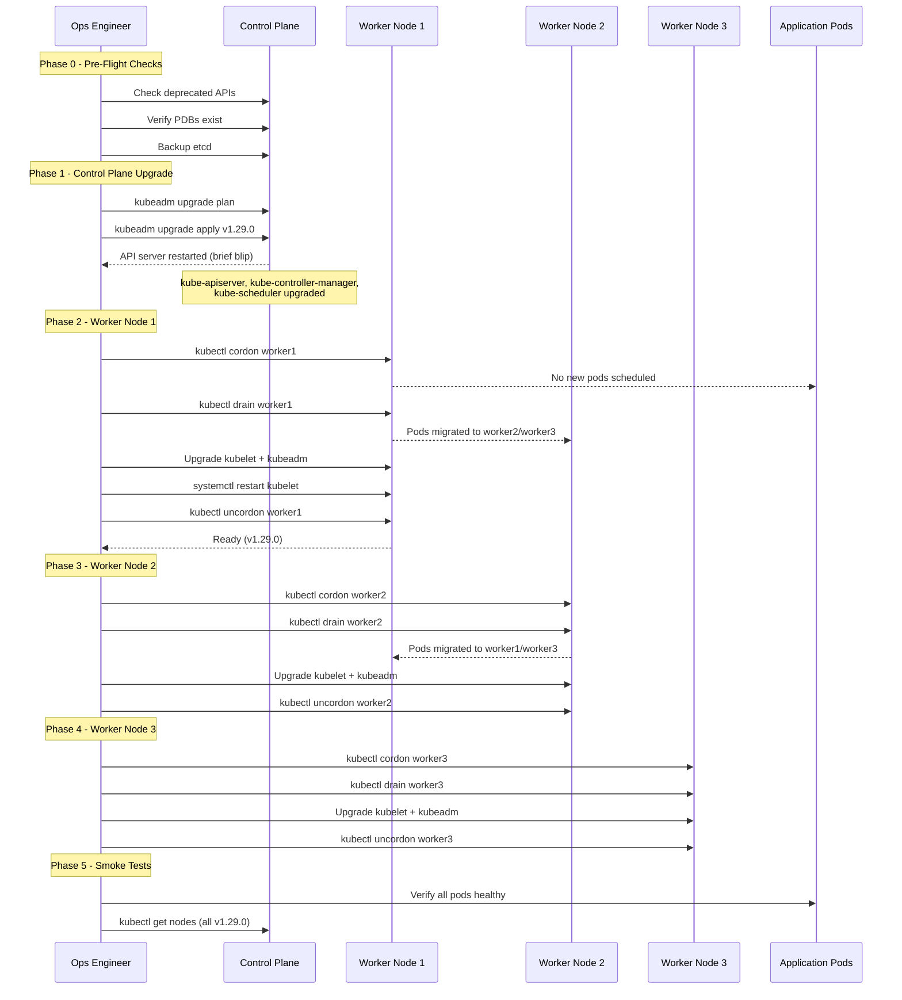

# File 48: Zero-Downtime Kubernetes Cluster Upgrade

**Topic:** Step-by-step procedure for upgrading a Kubernetes cluster from one minor version to the next with zero application downtime.

**WHY THIS MATTERS:** Kubernetes releases a new minor version every four months. Staying current is essential for security patches, bug fixes, and new features. But upgrading a running production cluster is one of the most anxiety-inducing operations in infrastructure. A botched upgrade can mean downtime, data loss, or a cluster that will not start. This project walks through the entire process so you can practice it in a safe environment before doing it for real.

---

## Story: Renovating a Running Hotel

Imagine you manage the Taj Mahal Palace Hotel in Mumbai. The building needs renovation -- new plumbing on every floor, new electrical wiring, fresh paint. But you cannot shut the hotel down. Guests are checked in. The restaurant is serving dinner. The conference hall has a wedding booked for Saturday.

So you renovate **one floor at a time**. You move guests from Floor 3 to empty rooms on Floor 5. You renovate Floor 3. Once it is ready and inspected, you move guests back. Then you do Floor 4. The front desk stays open throughout. Room service never stops. The guests barely notice.

This is exactly how a Kubernetes cluster upgrade works. The **control plane** is the hotel's front desk and management office -- you upgrade it first, but carefully so it keeps accepting requests. The **worker nodes** are the floors -- you drain one at a time (move the guests/pods), upgrade it, bring it back, then move to the next. The **version skew policy** is the building code that says the new plumbing must be compatible with the old electrical for a transition period.

---

## Prerequisites

| Tool | Version | Purpose |
|------|---------|---------|
| kind | v0.20+ | Multi-node cluster for upgrade simulation |
| kubectl | v1.28+ | Cluster management |
| docker | v24+ | Container runtime for kind |

### Create a Multi-Node Cluster

```bash
cat <<'EOF' | kind create cluster --config=-
kind: Cluster
apiVersion: kind.x-k8s.io/v1alpha4
name: upgrade-lab
nodes:
  - role: control-plane
  - role: worker
  - role: worker
  - role: worker
EOF

kubectl get nodes
```

**Expected output:**
```
NAME                        STATUS   ROLES           AGE   VERSION
upgrade-lab-control-plane   Ready    control-plane   60s   v1.28.0
upgrade-lab-worker          Ready    <none>          45s   v1.28.0
upgrade-lab-worker2         Ready    <none>          45s   v1.28.0
upgrade-lab-worker3         Ready    <none>          45s   v1.28.0
```

### Deploy a Sample Application

We need a running workload to prove zero downtime during the upgrade.

```bash
# Create namespace
kubectl create namespace upgrade-test

# Deploy a web application with multiple replicas
cat <<'EOF' | kubectl apply -f -
apiVersion: apps/v1
kind: Deployment
metadata:
  name: web-app
  namespace: upgrade-test
spec:
  replicas: 6
  selector:
    matchLabels:
      app: web-app
  template:
    metadata:
      labels:
        app: web-app
    spec:
      containers:
        - name: nginx
          image: nginx:1.25-alpine
          ports:
            - containerPort: 80
          readinessProbe:
            httpGet:
              path: /
              port: 80
            initialDelaySeconds: 2
            periodSeconds: 3
          resources:
            requests:
              cpu: "50m"
              memory: "32Mi"
      # Spread pods across nodes
      topologySpreadConstraints:
        - maxSkew: 1
          topologyKey: kubernetes.io/hostname
          whenUnsatisfiable: DoNotSchedule
          labelSelector:
            matchLabels:
              app: web-app
---
apiVersion: v1
kind: Service
metadata:
  name: web-app
  namespace: upgrade-test
spec:
  selector:
    app: web-app
  ports:
    - port: 80
      targetPort: 80
  type: ClusterIP
---
apiVersion: policy/v1
kind: PodDisruptionBudget
metadata:
  name: web-app-pdb
  namespace: upgrade-test
spec:
  minAvailable: 4
  selector:
    matchLabels:
      app: web-app
EOF

# Verify pods are spread across nodes
kubectl get pods -n upgrade-test -o wide
```

**Expected output:**
```
NAME                       READY   STATUS    NODE
web-app-6d4f7b8c9-abc12   1/1     Running   upgrade-lab-worker
web-app-6d4f7b8c9-def34   1/1     Running   upgrade-lab-worker
web-app-6d4f7b8c9-ghi56   1/1     Running   upgrade-lab-worker2
web-app-6d4f7b8c9-jkl78   1/1     Running   upgrade-lab-worker2
web-app-6d4f7b8c9-mno90   1/1     Running   upgrade-lab-worker3
web-app-6d4f7b8c9-pqr12   1/1     Running   upgrade-lab-worker3
```

---

## Upgrade Procedure Overview



---

## Phase 0: Pre-Upgrade Checklist

### 0.1 Check Current Versions

```bash
# Cluster version
kubectl version --short

# Node versions
kubectl get nodes -o custom-columns=\
NAME:.metadata.name,\
VERSION:.status.nodeInfo.kubeletVersion,\
OS:.status.nodeInfo.osImage

# Component versions
kubectl get pods -n kube-system -o custom-columns=\
NAME:.metadata.name,\
IMAGE:.spec.containers[0].image
```

### 0.2 Check for Deprecated APIs

```bash
# Install kubent (kube-no-trouble) to find deprecated APIs
# https://github.com/doitintl/kube-no-trouble
docker run -it --rm \
  -v "${HOME}/.kube/config:/root/.kube/config:ro" \
  ghcr.io/doitintl/kube-no-trouble:latest

# Or manually check for known deprecations from v1.28 -> v1.29
kubectl get flowschemas.flowcontrol.apiserver.k8s.io 2>/dev/null && \
  echo "FlowSchema API exists" || echo "Not present"

# Check if any manifests use removed API versions
kubectl api-resources --api-group=flowcontrol.apiserver.k8s.io
```

### 0.3 Verify PodDisruptionBudgets

```bash
# List all PDBs across all namespaces
kubectl get pdb --all-namespaces

# Verify no PDB blocks all evictions (maxUnavailable: 0 with 1 replica is dangerous)
kubectl get pdb --all-namespaces -o json | \
  python3 -c "
import json, sys
data = json.load(sys.stdin)
for item in data['items']:
    name = item['metadata']['name']
    ns = item['metadata']['namespace']
    status = item.get('status', {})
    allowed = status.get('disruptionsAllowed', 0)
    if allowed == 0:
        print(f'WARNING: PDB {ns}/{name} allows 0 disruptions - drain will hang!')
    else:
        print(f'OK: PDB {ns}/{name} allows {allowed} disruptions')
"
```

**Expected output:**
```
OK: PDB upgrade-test/web-app-pdb allows 2 disruptions
```

### 0.4 Backup etcd

```bash
# On the control plane node (exec into it for kind)
docker exec upgrade-lab-control-plane bash -c '
  ETCDCTL_API=3 etcdctl snapshot save /tmp/etcd-backup.db \
    --endpoints=https://127.0.0.1:2379 \
    --cacert=/etc/kubernetes/pki/etcd/ca.crt \
    --cert=/etc/kubernetes/pki/etcd/server.crt \
    --key=/etc/kubernetes/pki/etcd/server.key
'

# Copy backup out of the container
docker cp upgrade-lab-control-plane:/tmp/etcd-backup.db ./etcd-backup-pre-upgrade.db

# Verify backup
docker exec upgrade-lab-control-plane bash -c '
  ETCDCTL_API=3 etcdctl snapshot status /tmp/etcd-backup.db --write-out=table
'
```

**Expected output:**
```
+----------+----------+------------+------------+
|   HASH   | REVISION | TOTAL KEYS | TOTAL SIZE |
+----------+----------+------------+------------+
| a1b2c3d4 |     1847 |       1023 |     3.1 MB |
+----------+----------+------------+------------+
```

### 0.5 Start Continuous Availability Monitor

```bash
# Run this in a separate terminal -- it will probe the app continuously
kubectl run prober --image=busybox:1.36 --restart=Never -n upgrade-test -- \
  sh -c 'while true; do
    if wget -q -O /dev/null --timeout=2 http://web-app.upgrade-test.svc.cluster.local;
    then echo "$(date +%H:%M:%S) UP";
    else echo "$(date +%H:%M:%S) DOWN <<<";
    fi;
    sleep 1;
  done'

# Follow the logs
kubectl logs -f prober -n upgrade-test
```

---

## Phase 1: Control Plane Upgrade

> In a real cluster with kubeadm, you would run the following commands **on the control plane node**. In kind, we simulate the process. The concepts are identical.

### 1.1 Plan the Upgrade

```bash
# SSH into control plane (kind simulation)
docker exec -it upgrade-lab-control-plane bash

# Inside the node:
kubeadm upgrade plan

# Expected output shows available upgrades:
# Components that must be upgraded manually after you have upgraded the control plane:
# COMPONENT   CURRENT       TARGET
# kubelet     v1.28.0       v1.29.0
#
# Upgrade to the latest stable version:
# COMPONENT                 CURRENT   TARGET
# kube-apiserver             v1.28.0   v1.29.0
# kube-controller-manager    v1.28.0   v1.29.0
# kube-scheduler             v1.28.0   v1.29.0
# kube-proxy                 v1.28.0   v1.29.0
# CoreDNS                    v1.10.1   v1.11.1
# etcd                       3.5.9     3.5.10
```

### 1.2 Apply the Upgrade

```bash
# Still inside the control plane node:

# Update kubeadm first
apt-get update && apt-get install -y kubeadm=1.29.0-*

# Verify kubeadm version
kubeadm version

# Apply the upgrade (non-interactive)
kubeadm upgrade apply v1.29.0 --yes

# Expected output (key lines):
# [upgrade/successful] SUCCESS! Your cluster was upgraded to "v1.29.0". Enjoy!
```

### 1.3 Upgrade kubelet on Control Plane

```bash
# Still inside the control plane node:
apt-get install -y kubelet=1.29.0-* kubectl=1.29.0-*
systemctl daemon-reload
systemctl restart kubelet

# Exit the node
exit
```

### 1.4 Verify Control Plane

```bash
kubectl get nodes
# control-plane should show v1.29.0, workers still v1.28.0

kubectl get pods -n kube-system
# All control plane pods should be Running
```

---

## Phase 2: Worker Node Upgrades (One at a Time)

### Parallel Node Upgrade Timeline

```mermaid
gantt
    title Worker Node Upgrade Timeline
    dateFormat HH:mm
    axisFormat %H:%M

    section Pre-Flight
    Verify PDBs & backup etcd       :done, preflight, 09:00, 15m
    Start availability monitor       :done, monitor, 09:15, 5m

    section Control Plane
    kubeadm upgrade plan             :done, plan, 09:20, 5m
    kubeadm upgrade apply            :active, apply, 09:25, 10m
    Upgrade kubelet on CP            :active, cpkubelet, 09:35, 5m

    section Worker 1
    Cordon worker1                   :w1cordon, 09:40, 1m
    Drain worker1                    :w1drain, 09:41, 4m
    Upgrade kubeadm + kubelet        :w1upgrade, 09:45, 5m
    Uncordon worker1                 :w1uncordon, 09:50, 1m
    Verify pods rescheduled          :w1verify, 09:51, 2m

    section Worker 2
    Cordon worker2                   :w2cordon, 09:53, 1m
    Drain worker2                    :w2drain, 09:54, 4m
    Upgrade kubeadm + kubelet        :w2upgrade, 09:58, 5m
    Uncordon worker2                 :w2uncordon, 10:03, 1m

    section Worker 3
    Cordon worker3                   :w3cordon, 10:04, 1m
    Drain worker3                    :w3drain, 10:05, 4m
    Upgrade kubeadm + kubelet        :w3upgrade, 10:09, 5m
    Uncordon worker3                 :w3uncordon, 10:14, 1m

    section Post-Upgrade
    Smoke tests                      :smoke, 10:15, 10m
    Stop availability monitor        :stopmon, 10:25, 2m
```



### 2.1 Upgrade Worker Node 1

```bash
NODE="upgrade-lab-worker"

# Step 1: Cordon the node (prevent new pods from being scheduled)
kubectl cordon $NODE

# Verify: node should show SchedulingDisabled
kubectl get node $NODE
# NAME                 STATUS                     ROLES    VERSION
# upgrade-lab-worker   Ready,SchedulingDisabled   <none>   v1.28.0

# Step 2: Drain the node (evict all pods respecting PDBs)
kubectl drain $NODE \
  --ignore-daemonsets \
  --delete-emptydir-data \
  --timeout=120s

# Watch pods migrate to other nodes
kubectl get pods -n upgrade-test -o wide

# Expected: pods from worker1 are now on worker2 and worker3
```

**What `kubectl drain` does:**

1. Marks the node as unschedulable (same as cordon)
2. Evicts pods one by one, respecting PodDisruptionBudgets
3. Waits for each evicted pod to be terminated
4. Skips DaemonSet pods (they are node-bound)
5. Fails if a PDB would be violated (drain blocks, does not force)

```bash
# Step 3: Upgrade kubelet and kubeadm on the worker
docker exec $NODE bash -c '
  apt-get update && \
  apt-get install -y kubeadm=1.29.0-* kubelet=1.29.0-* && \
  kubeadm upgrade node && \
  systemctl daemon-reload && \
  systemctl restart kubelet
'

# Step 4: Uncordon the node
kubectl uncordon $NODE

# Verify
kubectl get node $NODE
# NAME                 STATUS   ROLES    VERSION
# upgrade-lab-worker   Ready    <none>   v1.29.0
```

### 2.2 Upgrade Worker Node 2

```bash
NODE="upgrade-lab-worker2"

kubectl cordon $NODE
kubectl drain $NODE --ignore-daemonsets --delete-emptydir-data --timeout=120s

# Verify pods moved
kubectl get pods -n upgrade-test -o wide

docker exec $NODE bash -c '
  apt-get update && \
  apt-get install -y kubeadm=1.29.0-* kubelet=1.29.0-* && \
  kubeadm upgrade node && \
  systemctl daemon-reload && \
  systemctl restart kubelet
'

kubectl uncordon $NODE
kubectl get node $NODE
```

### 2.3 Upgrade Worker Node 3

```bash
NODE="upgrade-lab-worker3"

kubectl cordon $NODE
kubectl drain $NODE --ignore-daemonsets --delete-emptydir-data --timeout=120s

docker exec $NODE bash -c '
  apt-get update && \
  apt-get install -y kubeadm=1.29.0-* kubelet=1.29.0-* && \
  kubeadm upgrade node && \
  systemctl daemon-reload && \
  systemctl restart kubelet
'

kubectl uncordon $NODE
kubectl get node $NODE
```

---

## Phase 3: Version Skew Policy

Kubernetes enforces strict version compatibility between components.

| Component | Allowed Skew from API Server |
|-----------|------------------------------|
| kubelet | May be up to **2 minor versions older** (e.g., API server v1.29, kubelet v1.27 is OK) |
| kube-proxy | Must be same minor version as kubelet |
| kubectl | May be +/- **1 minor version** from API server |
| kube-controller-manager | Must not be newer than API server, may be **1 minor version older** |
| kube-scheduler | Must not be newer than API server, may be **1 minor version older** |

### Verify Version Consistency

```bash
# All nodes should be on the same version now
kubectl get nodes -o custom-columns=\
NAME:.metadata.name,\
KUBELET:.status.nodeInfo.kubeletVersion,\
PROXY:.status.nodeInfo.kubeProxyVersion

# Expected:
# NAME                        KUBELET    PROXY
# upgrade-lab-control-plane   v1.29.0    v1.29.0
# upgrade-lab-worker          v1.29.0    v1.29.0
# upgrade-lab-worker2         v1.29.0    v1.29.0
# upgrade-lab-worker3         v1.29.0    v1.29.0

# Verify API server version
kubectl version --short
# Server Version: v1.29.0
```

### What Happens If You Violate Skew Policy?

```bash
# Example: if kubelet is v1.26 and API server is v1.29 (3 minor versions apart)
# The kubelet will fail to register with the API server.
# You will see in kubelet logs:
#   "the server has asked for the client to provide credentials"
#   or node stuck in NotReady state

# Check kubelet logs on a node:
docker exec upgrade-lab-worker journalctl -u kubelet --no-pager -n 20
```

---

## Phase 4: Rollback Plan (etcd Restore)

If the upgrade goes wrong and the cluster is in a bad state, you can restore etcd from the backup taken in Phase 0.

### 4.1 When to Rollback

- API server is crash-looping after upgrade
- etcd data corruption detected
- Critical workloads are down and cannot be recovered

### 4.2 Restore Procedure

```bash
# WARNING: This is destructive. Only use as a last resort.

# Step 1: Stop the API server and etcd on the control plane
docker exec upgrade-lab-control-plane bash -c '
  mv /etc/kubernetes/manifests/kube-apiserver.yaml /tmp/
  mv /etc/kubernetes/manifests/etcd.yaml /tmp/
  # Wait for them to stop
  sleep 10
'

# Step 2: Restore etcd from backup
docker exec upgrade-lab-control-plane bash -c '
  # Remove current etcd data
  rm -rf /var/lib/etcd/member

  # Restore from backup
  ETCDCTL_API=3 etcdctl snapshot restore /tmp/etcd-backup.db \
    --data-dir=/var/lib/etcd \
    --name=upgrade-lab-control-plane \
    --initial-cluster=upgrade-lab-control-plane=https://127.0.0.1:2380 \
    --initial-advertise-peer-urls=https://127.0.0.1:2380
'

# Step 3: Restart etcd and API server
docker exec upgrade-lab-control-plane bash -c '
  mv /tmp/etcd.yaml /etc/kubernetes/manifests/
  sleep 5
  mv /tmp/kube-apiserver.yaml /etc/kubernetes/manifests/
'

# Step 4: Wait for the API server to come back
kubectl get nodes --request-timeout=30s

# Step 5: Verify data integrity
kubectl get pods --all-namespaces
kubectl get pv
kubectl get secrets --all-namespaces | wc -l
```

---

## Phase 5: Smoke Tests

### 5.1 Check All Nodes

```bash
kubectl get nodes -o wide
# All nodes should be Ready with the new version
```

### 5.2 Check All System Pods

```bash
kubectl get pods -n kube-system -o wide
# All should be Running with 0 restarts (or minimal restarts from the upgrade)
```

### 5.3 Check Application Health

```bash
# Verify all web-app pods are running
kubectl get pods -n upgrade-test -o wide

# Verify the service is reachable
kubectl exec -n upgrade-test -it \
  $(kubectl get pods -n upgrade-test -l app=web-app -o jsonpath='{.items[0].metadata.name}') \
  -- wget -q -O - http://web-app.upgrade-test.svc.cluster.local

# Check the prober logs for any downtime
kubectl logs prober -n upgrade-test | grep "DOWN" | wc -l
# Expected: 0 (zero downtime!)
```

### 5.4 Verify DNS

```bash
kubectl run dns-test --image=busybox:1.36 --restart=Never --rm -it -- \
  nslookup kubernetes.default.svc.cluster.local

# Expected:
# Server:    10.96.0.10
# Address:   10.96.0.10:53
# Name:      kubernetes.default.svc.cluster.local
# Address:   10.96.0.1
```

### 5.5 Verify CoreDNS Version

```bash
kubectl get deployment coredns -n kube-system -o jsonpath='{.spec.template.spec.containers[0].image}'
# Expected: registry.k8s.io/coredns/coredns:v1.11.1
```

### 5.6 Create and Delete a Test Resource

```bash
# Final sanity check: can we still create resources?
kubectl create namespace smoke-test
kubectl run smoke-nginx --image=nginx:alpine -n smoke-test
kubectl wait --for=condition=ready pod/smoke-nginx -n smoke-test --timeout=60s
kubectl delete namespace smoke-test
echo "Smoke test PASSED"
```

---

## Troubleshooting Common Upgrade Issues

### Issue: Drain Hangs

```bash
# Symptom: kubectl drain never completes
# Cause: PDB prevents eviction

# Diagnose:
kubectl get pdb --all-namespaces
kubectl get events --field-selector reason=EvictionBlocked -A

# Fix: temporarily relax the PDB or add more replicas
kubectl scale deployment web-app -n upgrade-test --replicas=8
# Then retry drain
```

### Issue: Node Stuck in NotReady After Upgrade

```bash
# Symptom: node shows NotReady
# Cause: kubelet failed to start or certificate issues

# Diagnose:
docker exec upgrade-lab-worker systemctl status kubelet
docker exec upgrade-lab-worker journalctl -u kubelet --no-pager -n 50

# Common fix: restart kubelet
docker exec upgrade-lab-worker systemctl restart kubelet
```

### Issue: Pods Stuck in Pending After Uncordon

```bash
# Symptom: pods stay Pending after node is uncordoned
# Cause: resource pressure or taints

# Diagnose:
kubectl describe node upgrade-lab-worker | grep -A 5 "Taints:"
kubectl describe pod <pending-pod> -n upgrade-test | tail -20

# Fix: remove stale taints
kubectl taint nodes upgrade-lab-worker node.kubernetes.io/unreachable- 2>/dev/null
```

---

## Cleanup

```bash
# Delete the prober pod
kubectl delete pod prober -n upgrade-test --ignore-not-found

# Delete the test namespace
kubectl delete namespace upgrade-test

# Delete the kind cluster
kind delete cluster --name upgrade-lab

# Remove the etcd backup
rm -f etcd-backup-pre-upgrade.db
```

---

## Key Takeaways

1. **Always backup etcd before upgrading** -- this is your insurance policy. If everything goes wrong, you can restore the cluster state to the pre-upgrade snapshot.

2. **Upgrade the control plane first, then workers** -- the API server must be at the highest version. Kubelet can be up to 2 minor versions behind, but never ahead.

3. **Cordon, drain, upgrade, uncordon -- in that exact order** -- cordoning prevents new pods from being scheduled. Draining evicts existing pods safely. Only then do you touch the node software.

4. **PodDisruptionBudgets are your safety net during drain** -- without PDBs, drain will evict all pods simultaneously. With PDBs, Kubernetes guarantees minimum availability while moving pods.

5. **The version skew policy is not a suggestion -- it is enforced** -- violating it causes kubelet registration failures, API errors, and mysterious behavior. Always upgrade within the allowed skew window.

6. **Use `kubeadm upgrade plan` before `apply`** -- it tells you exactly what will change and warns about deprecated APIs or breaking changes. Never skip this step.

7. **Run a continuous availability monitor during the entire upgrade** -- a simple probe loop proves zero downtime to your stakeholders and catches regressions immediately.

8. **Test the upgrade in a non-production environment first** -- kind clusters are disposable. Practice the entire procedure with your actual workloads before touching production.

9. **Have a rollback plan documented before you start** -- etcd restore is the nuclear option, but you must know the exact commands before you need them, not after.

10. **Keep upgrade windows short by doing one minor version at a time** -- skipping versions (e.g., v1.27 to v1.29) is technically possible with kubeadm but risky. Sequential single-version upgrades are safer.
