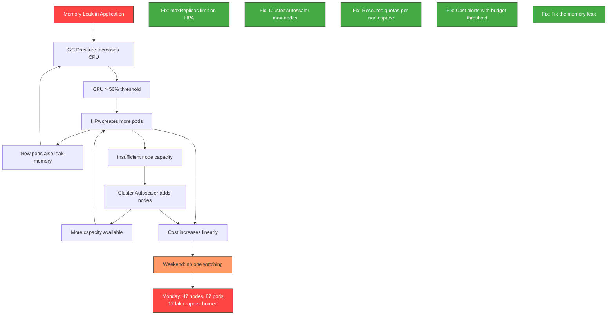

# File 49: Production Incident Case Studies

**Topic:** Five real-world Kubernetes production incidents analyzed with blameless postmortem methodology -- from symptoms to root cause to prevention.

**WHY THIS MATTERS:** You can read every Kubernetes document and still be unprepared for production. The gap between knowing how a feature works and debugging it at 3 AM when it breaks is enormous. These case studies are based on incidents that have actually occurred at companies running Kubernetes at scale. Studying them is like a pilot doing simulator training for emergency scenarios -- you want to have seen the failure mode before it happens for real.

---

## Story: The Hospital M&M Conference

In Indian teaching hospitals, there is a tradition called the **Morbidity and Mortality (M&M) Conference**. Once a week, doctors gather in a lecture hall. A case is presented -- a patient who had complications, an unexpected outcome, a near-miss. The presenting doctor walks through the timeline: what the patient reported, what tests were ordered, what diagnosis was made, what treatment was given, and what went wrong.

The critical rule: **no blame**. The M&M conference is not about punishing the doctor who made the mistake. It is about identifying **systemic failures** -- was the lab report delayed? Was the drug label confusing? Was the junior doctor working a 36-hour shift? The goal is to change the **system** so the mistake cannot happen again.

This is exactly how blameless postmortems work in Site Reliability Engineering. We examine five Kubernetes "patients" -- clusters that went wrong -- and learn how to prevent the same conditions in our own infrastructure.

---

## Prerequisites

| Tool | Version | Purpose |
|------|---------|---------|
| kubectl | v1.28+ | Cluster investigation |
| kind | v0.20+ | Reproducing incidents locally |
| jq | v1.6+ | Parsing JSON output |

```bash
# Create a lab cluster for reproducing incidents
kind create cluster --name incident-lab

# Install jq if not present
# macOS: brew install jq
# Linux: apt-get install -y jq
```

---

## Incident 1: CoreDNS OOM -- Cascading DNS Failures

### Scenario

A fintech company runs 200 microservices on a 50-node cluster. CoreDNS is running with default resource limits (170Mi memory). On a Friday evening, a new batch processing job is deployed that makes thousands of DNS lookups per second to resolve external payment gateway endpoints.

### Symptoms

- **19:42** -- PagerDuty alert: "HTTP 5xx rate > 5% on payment-service"
- **19:43** -- Multiple teams report: "Service X cannot reach Service Y"
- **19:44** -- Dashboard shows DNS resolution latency spiking from 2ms to 15,000ms
- **19:45** -- CoreDNS pods restarting repeatedly (OOMKilled)

### Timeline

```mermaid
timeline
    title Incident 1: CoreDNS OOM Cascade
    19:30 : Batch job deployed
         : 3000 pods start making DNS queries
    19:38 : CoreDNS memory usage hits 170Mi limit
         : First OOMKill event
    19:40 : CoreDNS pod restarts
         : DNS cache is cold (empty)
         : All cached entries lost
    19:42 : Second OOMKill
         : DNS resolution fails for all services
         : Cascading failures begin
    19:45 : Alerts fire across all teams
         : Payment processing stops
    19:55 : SRE identifies CoreDNS as root cause
         : Increases memory limit to 512Mi
    20:05 : CoreDNS stabilizes
         : Services recover automatically
    20:30 : All services fully recovered
```

### Investigation Steps

```bash
# Step 1: Check CoreDNS pod status
kubectl get pods -n kube-system -l k8s-app=kube-dns
# NAME                       READY   STATUS      RESTARTS   AGE
# coredns-5d78c9869d-abc12   0/1     OOMKilled   5          2h
# coredns-5d78c9869d-def34   1/1     Running     3          2h

# Step 2: Check events for OOMKill
kubectl get events -n kube-system --field-selector reason=OOMKilling --sort-by='.lastTimestamp'
# LAST SEEN   TYPE      REASON       OBJECT                        MESSAGE
# 3m          Warning   OOMKilling   pod/coredns-5d78c9869d-abc12  Memory limit exceeded

# Step 3: Check CoreDNS resource limits
kubectl get deployment coredns -n kube-system -o jsonpath='{.spec.template.spec.containers[0].resources}' | jq .
# {
#   "limits": { "memory": "170Mi" },
#   "requests": { "cpu": "100m", "memory": "70Mi" }
# }

# Step 4: Check CoreDNS metrics (if available)
kubectl exec -n kube-system deploy/coredns -- \
  wget -qO- http://localhost:9153/metrics 2>/dev/null | grep coredns_dns_requests_total

# Step 5: Identify the source of excessive DNS queries
kubectl top pods --all-namespaces --sort-by=memory | head -20

# Step 6: Check DNS resolution latency from an app pod
kubectl exec -it deploy/payment-service -- \
  nslookup payment-gateway.external.com 2>&1
# ;; connection timed out; no servers could be reached
```

### Root Cause

CoreDNS default memory limit of 170Mi is insufficient for clusters with more than ~100 services and high query rates. When the batch job created 3000 pods simultaneously, each making DNS queries, CoreDNS memory usage spiked past the limit. OOMKill caused it to restart with a cold (empty) cache, which made the problem worse -- all the cached DNS entries were lost, so every service had to re-resolve, creating a thundering herd effect.

### Immediate Fix

```bash
# Increase CoreDNS memory limits
kubectl edit deployment coredns -n kube-system
# Change: limits.memory: "170Mi" -> "512Mi"
# Change: requests.memory: "70Mi" -> "256Mi"

# Or patch directly:
kubectl patch deployment coredns -n kube-system --type='json' \
  -p='[
    {"op":"replace","path":"/spec/template/spec/containers/0/resources/limits/memory","value":"512Mi"},
    {"op":"replace","path":"/spec/template/spec/containers/0/resources/requests/memory","value":"256Mi"}
  ]'

# Scale up CoreDNS replicas
kubectl scale deployment coredns -n kube-system --replicas=5
```

### Long-Term Prevention

```bash
# 1. Add CoreDNS autoscaling based on cluster size
cat <<'EOF' | kubectl apply -f -
apiVersion: apps/v1
kind: Deployment
metadata:
  name: dns-autoscaler
  namespace: kube-system
spec:
  replicas: 1
  selector:
    matchLabels:
      k8s-app: dns-autoscaler
  template:
    metadata:
      labels:
        k8s-app: dns-autoscaler
    spec:
      containers:
        - name: autoscaler
          image: registry.k8s.io/cpa/cluster-proportional-autoscaler:v1.8.8
          command:
            - /cluster-proportional-autoscaler
            - --namespace=kube-system
            - --configmap=dns-autoscaler
            - --target=deployment/coredns
            - --default-params={"linear":{"coresPerReplica":16,"nodesPerReplica":4,"min":3,"max":20}}
            - --logtostderr=true
            - --v=2
EOF

# 2. Configure NodeLocal DNSCache to reduce load on CoreDNS
# This runs a DNS cache on every node, reducing cross-node DNS traffic
kubectl apply -f https://raw.githubusercontent.com/kubernetes/kubernetes/master/cluster/addons/dns/nodelocaldns/nodelocaldns.yaml

# 3. Add monitoring alert for CoreDNS memory usage
# (Prometheus alert rule)
cat <<'EOF'
# Add to PrometheusRule
- alert: CoreDNSMemoryHigh
  expr: container_memory_working_set_bytes{namespace="kube-system",container="coredns"} / container_spec_memory_limit_bytes{namespace="kube-system",container="coredns"} > 0.8
  for: 5m
  labels:
    severity: warning
  annotations:
    summary: "CoreDNS memory usage above 80% of limit"
EOF
```

---

## Incident 2: Missing PDB -- Pods Killed During Node Drain

### Scenario

An e-commerce company is performing routine node maintenance. An SRE drains a worker node. The critical checkout-service has 3 replicas, all on two nodes. Two of the three replicas are on the node being drained. There is no PodDisruptionBudget.

### Symptoms

- **14:00** -- Node drain initiated for kernel patching
- **14:01** -- checkout-service drops from 3 to 1 replica
- **14:01** -- Remaining single pod overwhelmed, starts returning 503
- **14:02** -- Alert: "Checkout success rate < 90%"
- Revenue loss estimated at 2.4 lakhs over 8 minutes

### Investigation Steps

```bash
# Step 1: Check what happened to checkout-service pods
kubectl get events -n production --field-selector involvedObject.kind=Pod \
  --sort-by='.lastTimestamp' | grep checkout

# Step 2: Check if PDB exists
kubectl get pdb -n production
# No resources found in production namespace.  <-- THIS IS THE PROBLEM

# Step 3: Check pod distribution across nodes
kubectl get pods -n production -l app=checkout-service -o wide
# NAME                                READY   NODE
# checkout-service-7f8b9c5d4-abc12   1/1     worker-node-3   <-- only one left!

# Step 4: Check the drain events
kubectl get events --field-selector reason=Evicted -A --sort-by='.lastTimestamp'
```

### Root Cause

Without a PodDisruptionBudget, `kubectl drain` evicts all pods on a node simultaneously with no awareness of application availability. Two of three checkout-service pods were on the same node (no topology spread constraints either), so drain removed 66% of capacity instantly.

### Immediate Fix

```bash
# Scale up immediately
kubectl scale deployment checkout-service -n production --replicas=5

# Create a PDB right now
cat <<'EOF' | kubectl apply -f -
apiVersion: policy/v1
kind: PodDisruptionBudget
metadata:
  name: checkout-service-pdb
  namespace: production
spec:
  minAvailable: 2
  selector:
    matchLabels:
      app: checkout-service
EOF
```

### Long-Term Prevention

```bash
# 1. Add PDBs to ALL critical services (create a policy)
for SERVICE in checkout-service cart-service payment-service user-service; do
cat <<EOF | kubectl apply -f -
apiVersion: policy/v1
kind: PodDisruptionBudget
metadata:
  name: ${SERVICE}-pdb
  namespace: production
spec:
  minAvailable: "50%"
  selector:
    matchLabels:
      app: ${SERVICE}
EOF
done

# 2. Add topology spread constraints to prevent pod co-location
# Add to each Deployment spec:
# spec:
#   template:
#     spec:
#       topologySpreadConstraints:
#         - maxSkew: 1
#           topologyKey: kubernetes.io/hostname
#           whenUnsatisfiable: DoNotSchedule

# 3. OPA/Gatekeeper policy to require PDB for production deployments
cat <<'EOF' | kubectl apply -f -
apiVersion: templates.gatekeeper.sh/v1
kind: ConstraintTemplate
metadata:
  name: k8srequiredpdb
spec:
  crd:
    spec:
      names:
        kind: K8sRequiredPDB
  targets:
    - target: admission.k8s.gatekeeper.sh
      rego: |
        package k8srequiredpdb
        violation[{"msg": msg}] {
          input.review.kind.kind == "Deployment"
          input.review.object.metadata.namespace == "production"
          replicas := input.review.object.spec.replicas
          replicas > 1
          not has_pdb
          msg := sprintf("Deployment %v in production must have a PodDisruptionBudget", [input.review.object.metadata.name])
        }
        has_pdb {
          data.inventory.namespace[input.review.object.metadata.namespace]["policy/v1"]["PodDisruptionBudget"][_]
        }
EOF
```

---

## Incident 3: Secret Exposed in Pod Environment Variables

### Scenario

A developer creates a Deployment that passes the database password as a plain environment variable (not from a Secret reference). The Kubernetes Dashboard is exposed internally. An intern browsing the Dashboard can see the database password by clicking on any pod in the namespace.

### Symptoms

- **Discovery**: During a security audit, the auditor opens the Kubernetes Dashboard, clicks on a pod, and sees `DB_PASSWORD=SuperSecret123!` in the environment variables section.
- **Impact**: The database credential has been visible to anyone with Dashboard access for 3 months.

### Investigation Steps

```bash
# Step 1: Find pods with hardcoded secrets in env vars
kubectl get pods --all-namespaces -o json | jq -r '
  .items[] |
  .metadata.namespace as $ns |
  .metadata.name as $pod |
  .spec.containers[].env[]? |
  select(.value != null) |
  select(.name | test("PASSWORD|SECRET|TOKEN|KEY|CREDENTIAL"; "i")) |
  "\($ns)/\($pod): \(.name)=\(.value)"
'

# Step 2: Check if secrets are mounted as env vars vs. files
kubectl get deployments --all-namespaces -o json | jq -r '
  .items[] |
  .metadata.namespace as $ns |
  .metadata.name as $name |
  .spec.template.spec.containers[].env[]? |
  select(.value != null) |
  select(.name | test("PASSWORD|SECRET|TOKEN|KEY"; "i")) |
  "HARDCODED: \($ns)/\($name) has \(.name) as plain text"
'

# Step 3: Check RBAC -- who can read pod specs?
kubectl auth can-i get pods --as=system:serviceaccount:default:default -n production
# yes <-- too permissive!

# Step 4: Check if Dashboard has restricted access
kubectl get clusterrolebinding | grep dashboard
```

### Root Cause

The developer used `env.value` instead of `env.valueFrom.secretKeyRef`. Kubernetes stores environment variables in the pod spec, which is readable by anyone with `get pods` permission. The Dashboard was configured with a ClusterRole that allowed reading pod specs across all namespaces.

### Immediate Fix

```bash
# 1. Rotate the exposed credential immediately
# (Change the password in the actual database)

# 2. Move the secret to a Kubernetes Secret object
kubectl create secret generic db-credentials \
  -n production \
  --from-literal=DB_PASSWORD="NewRotatedPassword456!"

# 3. Update the Deployment to use secretKeyRef
kubectl patch deployment my-app -n production --type='json' \
  -p='[{
    "op": "replace",
    "path": "/spec/template/spec/containers/0/env",
    "value": [{
      "name": "DB_PASSWORD",
      "valueFrom": {
        "secretKeyRef": {
          "name": "db-credentials",
          "key": "DB_PASSWORD"
        }
      }
    }]
  }]'
```

### Long-Term Prevention

```bash
# 1. OPA policy to block hardcoded secrets in env vars
cat <<'EOF' | kubectl apply -f -
apiVersion: templates.gatekeeper.sh/v1
kind: ConstraintTemplate
metadata:
  name: k8snosecretsinenv
spec:
  crd:
    spec:
      names:
        kind: K8sNoSecretsInEnv
  targets:
    - target: admission.k8s.gatekeeper.sh
      rego: |
        package k8snosecretsinenv
        violation[{"msg": msg}] {
          container := input.review.object.spec.template.spec.containers[_]
          env := container.env[_]
          env.value != null
          contains(lower(env.name), "password")
          msg := sprintf("Container %v has hardcoded password in env var %v. Use secretKeyRef instead.", [container.name, env.name])
        }
        violation[{"msg": msg}] {
          container := input.review.object.spec.template.spec.containers[_]
          env := container.env[_]
          env.value != null
          contains(lower(env.name), "secret")
          msg := sprintf("Container %v has hardcoded secret in env var %v. Use secretKeyRef instead.", [container.name, env.name])
        }
EOF

# 2. Use External Secrets Operator with a vault backend
# 3. Enable audit logging for secret access
# 4. Restrict Dashboard RBAC to namespace-scoped roles
```

---

## Incident 4: HPA + Cluster Autoscaler Cost Explosion

### Scenario

A startup deploys an API service with HPA targeting 50% CPU. The application has a memory leak that causes CPU to spike as the garbage collector fights for resources. HPA keeps scaling up pods. Each new pod also leaks memory and spikes CPU. Cluster Autoscaler adds nodes to fit the new pods. Over a weekend, the cluster grows from 5 nodes to 47 nodes. Monday morning, the cloud bill shows a charge of 12 lakh rupees.

### Symptoms

- **Saturday 02:00** -- HPA scales API pods from 3 to 6
- **Saturday 03:00** -- Cluster Autoscaler adds 2 nodes
- **Saturday 08:00** -- Pods at 15, nodes at 10
- **Sunday 14:00** -- Pods at 40, nodes at 25
- **Monday 09:00** -- Pods at 87, nodes at 47
- **Monday 09:15** -- Finance team escalates: "Why is our AWS bill 24x normal?"

### Root Cause Analysis



### Investigation Steps

```bash
# Step 1: Check HPA status
kubectl get hpa -n production
# NAME          REFERENCE        TARGETS    MINPODS   MAXPODS   REPLICAS
# api-service   Deployment/api   312%/50%   3         100       87    <-- 87 replicas!

# Step 2: Check node count
kubectl get nodes | wc -l
# 48 (47 nodes + header)

# Step 3: Check pod resource usage -- look for memory leak pattern
kubectl top pods -n production -l app=api-service --sort-by=memory
# NAME                          CPU    MEMORY
# api-service-7f8b9c5d4-abc12   450m   1.8Gi   <-- memory limit is 2Gi!
# api-service-7f8b9c5d4-def34   430m   1.7Gi
# api-service-7f8b9c5d4-ghi56   420m   1.6Gi
# ... (all pods near memory limit)

# Step 4: Check Cluster Autoscaler logs
kubectl logs -n kube-system -l app=cluster-autoscaler --tail=50 | grep "Scale-up"
# Scale-up: adding 2 nodes to node-group standard-pool
# Scale-up: adding 3 nodes to node-group standard-pool
# ... (repeated dozens of times)

# Step 5: Check Cluster Autoscaler configuration
kubectl get configmap cluster-autoscaler-status -n kube-system -o yaml
# Look for max-nodes setting

# Step 6: Look at pod restart counts (OOMKill from memory leak)
kubectl get pods -n production -l app=api-service -o custom-columns=\
NAME:.metadata.name,RESTARTS:.status.containerStatuses[0].restartCount | sort -k2 -n -r | head
```

### Immediate Fix

```bash
# 1. Set maxReplicas on HPA to a sane limit
kubectl patch hpa api-service -n production --type='merge' \
  -p='{"spec":{"maxReplicas":10}}'

# 2. Scale down to a reasonable number
kubectl scale deployment api-service -n production --replicas=5

# 3. Set max-nodes on Cluster Autoscaler
# Edit the Cluster Autoscaler deployment to add:
#   --nodes=3:15:standard-pool  (min 3, max 15)

# 4. Fix the memory leak (application-level fix)
# Restart pods to clear leaked memory
kubectl rollout restart deployment api-service -n production
```

### Long-Term Prevention

```bash
# 1. Resource Quotas per namespace
cat <<'EOF' | kubectl apply -f -
apiVersion: v1
kind: ResourceQuota
metadata:
  name: production-quota
  namespace: production
spec:
  hard:
    pods: "50"
    requests.cpu: "20"
    requests.memory: "40Gi"
    limits.cpu: "40"
    limits.memory: "80Gi"
EOF

# 2. Cloud billing alerts
# AWS: Set a budget alert at 150% of expected monthly cost
# GCP: Set budget alerts at 50%, 90%, 100% thresholds

# 3. HPA maxReplicas policy
# Use OPA to enforce maxReplicas <= 20 for any HPA

# 4. Cluster Autoscaler constraints
# --max-nodes-total=30
# --scale-down-delay-after-add=10m
# --scale-down-unneeded-time=10m
```

---

## Incident 5: Network Policy Misconfiguration -- Service Blackout

### Scenario

A security team implements "zero trust networking" by deploying a default-deny NetworkPolicy across all namespaces. They forget to add allow rules for CoreDNS egress. Within minutes, every service that relies on DNS (which is all of them) stops working.

### Symptoms

- **11:00** -- Security team applies default-deny NetworkPolicy
- **11:02** -- Monitoring dashboards go blank (Prometheus cannot resolve targets)
- **11:03** -- All HTTP services return 502/503
- **11:04** -- kubectl exec into pods: `nslookup kubernetes.default` fails
- **11:05** -- Full service blackout across all namespaces

### Investigation Steps

```bash
# Step 1: Check if DNS works from a pod
kubectl exec -it deploy/web-app -- nslookup kubernetes.default
# ;; connection timed out; no servers could be reached

# Step 2: Check network policies
kubectl get networkpolicies --all-namespaces
# NAMESPACE    NAME           POD-SELECTOR   AGE
# default      default-deny   <none>         5m
# production   default-deny   <none>         5m
# monitoring   default-deny   <none>         5m
# kube-system  default-deny   <none>         5m   <-- THIS! DNS is in kube-system!

# Step 3: Check if CoreDNS can receive traffic
kubectl get networkpolicy default-deny -n kube-system -o yaml
# spec:
#   podSelector: {}    <-- matches ALL pods including CoreDNS
#   policyTypes:
#     - Ingress
#     - Egress
# No ingress or egress rules = DENY EVERYTHING

# Step 4: Verify CoreDNS pods are running (they are, just unreachable)
kubectl get pods -n kube-system -l k8s-app=kube-dns -o wide
# Running, but no traffic can reach them

# Step 5: Test connectivity to CoreDNS IP directly
COREDNS_IP=$(kubectl get svc kube-dns -n kube-system -o jsonpath='{.spec.clusterIP}')
kubectl exec -it deploy/web-app -- wget -qO- --timeout=2 http://${COREDNS_IP}:53 2>&1
# wget: download timed out
```

### Immediate Fix

```bash
# Option 1: Delete the default-deny in kube-system (fastest recovery)
kubectl delete networkpolicy default-deny -n kube-system

# Option 2: Add DNS allow rules before the deny (correct approach)
cat <<'EOF' | kubectl apply -f -
apiVersion: networking.k8s.io/v1
kind: NetworkPolicy
metadata:
  name: allow-dns-ingress
  namespace: kube-system
spec:
  podSelector:
    matchLabels:
      k8s-app: kube-dns
  policyTypes:
    - Ingress
  ingress:
    - ports:
        - protocol: UDP
          port: 53
        - protocol: TCP
          port: 53
EOF

# And in EVERY namespace, allow DNS egress:
for NS in $(kubectl get ns -o jsonpath='{.items[*].metadata.name}'); do
cat <<EOF | kubectl apply -f -
apiVersion: networking.k8s.io/v1
kind: NetworkPolicy
metadata:
  name: allow-dns-egress
  namespace: $NS
spec:
  podSelector: {}
  policyTypes:
    - Egress
  egress:
    - to:
        - namespaceSelector:
            matchLabels:
              kubernetes.io/metadata.name: kube-system
          podSelector:
            matchLabels:
              k8s-app: kube-dns
      ports:
        - protocol: UDP
          port: 53
        - protocol: TCP
          port: 53
EOF
done
```

### Long-Term Prevention

```bash
# 1. NEVER apply default-deny to kube-system without explicit allow rules
# 2. Always deploy allow rules BEFORE deny rules
# 3. Test network policies in a staging namespace first

# 4. Create a standard "base" network policy set that is always applied first:
cat <<'EOF'
# base-network-policies.yaml -- apply this FIRST in every namespace
# Allows: DNS egress, health check ingress from kubelet, Prometheus scraping
---
apiVersion: networking.k8s.io/v1
kind: NetworkPolicy
metadata:
  name: allow-dns
spec:
  podSelector: {}
  policyTypes: [Egress]
  egress:
    - ports:
        - protocol: UDP
          port: 53
        - protocol: TCP
          port: 53
---
apiVersion: networking.k8s.io/v1
kind: NetworkPolicy
metadata:
  name: allow-kubelet-probes
spec:
  podSelector: {}
  policyTypes: [Ingress]
  ingress:
    - from: []  # kubelet does not have a pod identity
      ports:
        - protocol: TCP  # allow health check ports
EOF

# 5. Add a CI/CD check that simulates network policy impact before applying
```

---

## Postmortem Template

Use this template for every production incident:

```markdown
# Postmortem: [Incident Title]

## Summary
- **Date**: YYYY-MM-DD
- **Duration**: X hours Y minutes
- **Impact**: [what users experienced, revenue impact]
- **Severity**: P1/P2/P3/P4
- **Author**: [name]
- **Status**: [draft/reviewed/complete]

## Timeline (all times in IST)
| Time | Event |
|------|-------|
| HH:MM | First symptom observed |
| HH:MM | Alert fired |
| HH:MM | Incident declared |
| HH:MM | Root cause identified |
| HH:MM | Fix applied |
| HH:MM | Service restored |
| HH:MM | All-clear declared |

## Root Cause
[2-3 sentences explaining WHY this happened, not WHAT happened]

## Detection
- How was the incident detected? (alert / user report / manual check)
- Time to detect: X minutes
- Could we have detected it faster? How?

## Resolution
- What was done to fix it?
- Time to resolve: X minutes
- Was the fix a workaround or permanent?

## Impact
- Users affected: [number or percentage]
- Revenue impact: [amount]
- Data loss: [yes/no, details]
- SLA impact: [which SLAs were breached]

## Lessons Learned
### What went well
1. ...

### What went wrong
1. ...

### Where we got lucky
1. ...

## Action Items
| Action | Owner | Priority | Due Date | Status |
|--------|-------|----------|----------|--------|
| [specific action] | [name] | P1 | YYYY-MM-DD | Open |

## Prevention
- What guardrails should be added?
- What monitoring/alerting changes are needed?
- What process changes are needed?
- What documentation needs updating?
```

---

## Reproducing Incidents in a Lab

### Lab Setup for Incident 1 (CoreDNS OOM)

```bash
# Create a cluster
kind create cluster --name dns-lab

# Reduce CoreDNS memory limit to trigger OOM easily
kubectl patch deployment coredns -n kube-system --type='json' \
  -p='[{"op":"replace","path":"/spec/template/spec/containers/0/resources/limits/memory","value":"20Mi"}]'

# Generate heavy DNS load
kubectl run dns-storm --image=busybox:1.36 --restart=Never -- \
  sh -c 'while true; do nslookup does-not-exist.example.com; done'

# Watch CoreDNS pods get OOMKilled
kubectl get pods -n kube-system -l k8s-app=kube-dns -w

# Cleanup
kind delete cluster --name dns-lab
```

### Lab Setup for Incident 5 (Network Policy Blackout)

```bash
# Create a cluster with a CNI that supports NetworkPolicies
# (kind uses kindnet which has limited NetworkPolicy support)
# For full testing, use Calico:
kind create cluster --name netpol-lab
kubectl apply -f https://raw.githubusercontent.com/projectcalico/calico/v3.26.1/manifests/calico.yaml

# Deploy a test app
kubectl run web --image=nginx:alpine
kubectl expose pod web --port=80

# Verify DNS works
kubectl exec web -- nslookup kubernetes.default

# Apply default-deny (this will break DNS)
cat <<'EOF' | kubectl apply -f -
apiVersion: networking.k8s.io/v1
kind: NetworkPolicy
metadata:
  name: default-deny
  namespace: default
spec:
  podSelector: {}
  policyTypes: [Ingress, Egress]
EOF

# Verify DNS is broken
kubectl exec web -- nslookup kubernetes.default
# ;; connection timed out

# Fix it by adding DNS egress
cat <<'EOF' | kubectl apply -f -
apiVersion: networking.k8s.io/v1
kind: NetworkPolicy
metadata:
  name: allow-dns
  namespace: default
spec:
  podSelector: {}
  policyTypes: [Egress]
  egress:
    - ports:
        - protocol: UDP
          port: 53
        - protocol: TCP
          port: 53
EOF

# Verify DNS works again
kubectl exec web -- nslookup kubernetes.default

# Cleanup
kind delete cluster --name netpol-lab
```

---

## Cleanup

```bash
# Delete the lab cluster
kind delete cluster --name incident-lab
```

---

## Key Takeaways

1. **CoreDNS is a single point of failure** -- if DNS goes down, everything goes down. Always over-provision CoreDNS resources, run at least 3 replicas, and use NodeLocal DNSCache to reduce load.

2. **PodDisruptionBudgets are not optional for production workloads** -- without them, node drain can remove all replicas of a service simultaneously. Enforce PDB creation through admission policies.

3. **Never hardcode secrets in Deployment manifests** -- use `secretKeyRef`, mount secrets as files, or use External Secrets Operator. Anyone with `get pods` permission can see environment variables.

4. **HPA without guardrails is a cloud bill time bomb** -- always set `maxReplicas` to a sane number, add ResourceQuotas per namespace, and set up cloud billing alerts.

5. **Network policies must always allow DNS egress first** -- the very first policy you apply in any namespace should be the DNS egress allow rule. Never apply default-deny to kube-system without extreme care.

6. **Blameless postmortems prevent repeat incidents** -- the goal is not to find who made the mistake, but to identify what systemic guardrail was missing that allowed the mistake to have impact.

7. **Reproduce incidents in lab environments** -- kind clusters are disposable. Recreate the failure mode, practice the investigation, and verify the fix before your next on-call shift.

8. **The blast radius of infrastructure changes is larger than you think** -- a NetworkPolicy change in kube-system affects every namespace. A CoreDNS restart clears the cache for the entire cluster. Always think about second-order effects.
