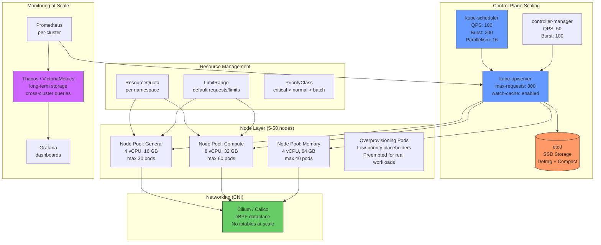
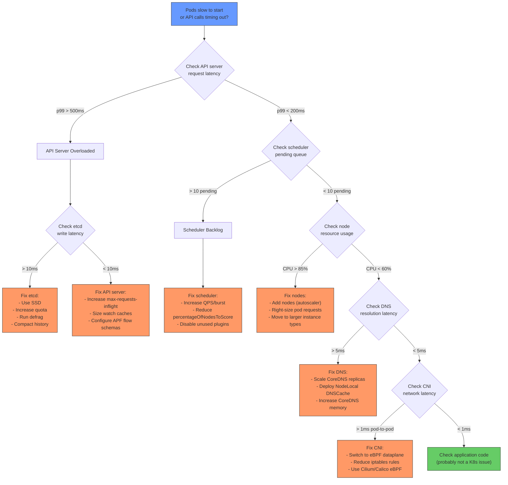

# File 50: Scaling to 1000 Pods -- Performance Tuning Case Study

**Topic:** Systematic approach to scaling a Kubernetes cluster from 50 pods to 1000+ pods, covering etcd tuning, API server optimization, scheduler throughput, CNI selection, node scaling strategies, resource management, and monitoring at scale.

**WHY THIS MATTERS:** Most Kubernetes tutorials work with 5-10 pods on a single node. Production clusters at Indian startups and enterprises routinely run 500-2000 pods. At this scale, every component has bottlenecks -- etcd runs out of disk I/O, the API server gets throttled, the scheduler falls behind, and the CNI plugin adds unacceptable network latency. This case study walks through each bottleneck and shows exactly what to tune, with real metrics at each scale point.

---

## Story: Kumbh Mela Crowd Management

The Kumbh Mela is the largest peaceful gathering of humans on Earth. Every 12 years, 50 million pilgrims converge on a single city over a few weeks. The 2019 Prayagraj Kumbh Mela had 240 million visitors over 49 days.

Imagine you are the District Magistrate responsible for crowd management. When it is a small village mela -- 500 people at a local temple fair -- you need one constable, one first aid tent, and a loudspeaker. But when you scale to Kumbh Mela, everything changes:

- **Roads (Network/CNI)**: Village lanes become 12-lane highways. You cannot use the same road design.
- **Registration (API Server)**: One clerk at a desk becomes 500 registration counters processing 10,000 entries per hour.
- **Record Keeping (etcd)**: A paper register becomes a distributed database that must handle millions of writes without losing a single entry.
- **Crowd Direction (Scheduler)**: One policeman waving people through becomes an AI-powered crowd flow system with cameras and dynamic barriers.
- **Zones (Namespaces/Resource Quotas)**: The mela ground is divided into sectors. Each sector has a capacity limit. When Sector 7 is full, new arrivals are directed to Sector 8.
- **Monitoring**: One CCTV camera becomes 1,500 cameras, drone surveillance, and a central command center.

Scaling Kubernetes is the same challenge. What works at 50 pods breaks at 500. What works at 500 breaks at 2000. This case study shows you exactly where each breaking point is and how to push past it.

---

## Prerequisites

| Tool | Version | Purpose |
|------|---------|---------|
| kind | v0.20+ | Local cluster for testing |
| kubectl | v1.28+ | Cluster management |
| helm | v3.12+ | Installing monitoring stack |
| etcdctl | v3.5+ | etcd performance testing |
| hey | latest | HTTP load testing |

### Install Commands

```bash
# hey (HTTP load generator)
go install github.com/rakyll/hey@latest
# or: brew install hey

# etcdctl
# Comes with etcd: https://github.com/etcd-io/etcd/releases

# Create a multi-node kind cluster for scale testing
cat <<'EOF' | kind create cluster --config=-
kind: Cluster
apiVersion: kind.x-k8s.io/v1alpha4
name: scale-lab
nodes:
  - role: control-plane
    kubeadmConfigPatches:
      - |
        kind: ClusterConfiguration
        apiServer:
          extraArgs:
            max-requests-inflight: "800"
            max-mutating-requests-inflight: "400"
            watch-cache-sizes: "pods#1000,nodes#100,services#100"
        etcd:
          local:
            extraArgs:
              quota-backend-bytes: "8589934592"
              auto-compaction-retention: "1h"
              auto-compaction-mode: "periodic"
  - role: worker
  - role: worker
  - role: worker
  - role: worker
  - role: worker
EOF

kubectl get nodes
```

---

## Cluster Scaling Architecture



---

## Scale Points and Benchmarks

Before diving into tuning, here are the key metrics at each scale point based on real-world observations:

| Metric | 100 Pods | 500 Pods | 1000 Pods |
|--------|----------|----------|-----------|
| API server request latency (p99) | 50ms | 200ms | 800ms (untuned), 120ms (tuned) |
| etcd write latency (p99) | 5ms | 15ms | 50ms (HDD), 8ms (SSD) |
| Scheduler throughput | 50 pods/sec | 30 pods/sec | 10 pods/sec (untuned), 40 pods/sec (tuned) |
| Pod startup time (image cached) | 2s | 3s | 8s (untuned), 3s (tuned) |
| DNS resolution latency | 1ms | 2ms | 15ms (2 replicas), 2ms (5 replicas + NodeLocal) |
| etcd database size | 50 MB | 200 MB | 500 MB |
| Watch connections to API server | 200 | 1,000 | 3,000+ |
| Memory per node (kubelet overhead) | 200 MB | 300 MB | 500 MB |
| Network policies evaluation time | <1ms | 2ms | 10ms (iptables), 1ms (eBPF) |

---

## 1. etcd Performance Tuning

etcd is the most critical component. Every Kubernetes API call eventually becomes an etcd read or write. When etcd is slow, everything is slow.

### 1.1 Use SSDs (Non-Negotiable)

```bash
# Check current etcd disk performance
# On the control plane node:
docker exec scale-lab-control-plane bash -c '
  # Install fio for disk benchmarks
  apt-get update -qq && apt-get install -y -qq fio > /dev/null 2>&1

  # Sequential write test (simulates WAL writes)
  fio --name=etcd-wal --directory=/var/lib/etcd \
    --rw=write --bs=4k --size=100M --numjobs=1 \
    --time_based --runtime=10 --group_reporting \
    --output-format=json 2>/dev/null | \
    python3 -c "import json,sys; d=json.load(sys.stdin); \
    print(f\"Write IOPS: {d[\"jobs\"][0][\"write\"][\"iops\"]:.0f}\"); \
    print(f\"Write Latency p99: {d[\"jobs\"][0][\"write\"][\"clat_ns\"][\"percentile\"][\"99.000000\"]/1e6:.2f} ms\")"
'
```

**Target benchmarks for etcd:**

| Metric | Minimum | Recommended |
|--------|---------|-------------|
| Sequential write IOPS | 500 | 3000+ |
| Write latency p99 | < 10ms | < 5ms |
| fsync latency p99 | < 10ms | < 2ms |

### 1.2 etcd Compaction and Defragmentation

```bash
# Check etcd database size
docker exec scale-lab-control-plane bash -c '
  ETCDCTL_API=3 etcdctl endpoint status \
    --endpoints=https://127.0.0.1:2379 \
    --cacert=/etc/kubernetes/pki/etcd/ca.crt \
    --cert=/etc/kubernetes/pki/etcd/server.crt \
    --key=/etc/kubernetes/pki/etcd/server.key \
    --write-out=table
'

# Expected output:
# +------------------------+------------------+--------+---------+
# |        ENDPOINT        |        ID        | STATUS | DB SIZE |
# +------------------------+------------------+--------+---------+
# | https://127.0.0.1:2379 | 8e9e05c52164694d | leader |   45 MB |
# +------------------------+------------------+--------+---------+
```

### 1.3 Configure etcd for Scale

The kind cluster config above already sets these, but here is what each parameter does:

```yaml
etcd:
  local:
    extraArgs:
      # Maximum database size (default 2GB, increase for large clusters)
      quota-backend-bytes: "8589934592"  # 8 GB

      # Automatic compaction every hour (removes old revisions)
      auto-compaction-retention: "1h"
      auto-compaction-mode: "periodic"

      # Snapshot count (how many transactions before a snapshot)
      # Lower = more frequent snapshots = faster recovery but more I/O
      snapshot-count: "10000"

      # Heartbeat and election timeouts (tune for network latency)
      heartbeat-interval: "100"         # ms (default 100)
      election-timeout: "1000"          # ms (default 1000)
```

### 1.4 Manual Defragmentation

```bash
# Defrag etcd (run during low-traffic window)
# WARNING: This blocks writes for a few seconds
docker exec scale-lab-control-plane bash -c '
  ETCDCTL_API=3 etcdctl defrag \
    --endpoints=https://127.0.0.1:2379 \
    --cacert=/etc/kubernetes/pki/etcd/ca.crt \
    --cert=/etc/kubernetes/pki/etcd/server.crt \
    --key=/etc/kubernetes/pki/etcd/server.key
'
# Expected: Finished defragmenting etcd member[https://127.0.0.1:2379]

# Check size after defrag
docker exec scale-lab-control-plane bash -c '
  ETCDCTL_API=3 etcdctl endpoint status \
    --endpoints=https://127.0.0.1:2379 \
    --cacert=/etc/kubernetes/pki/etcd/ca.crt \
    --cert=/etc/kubernetes/pki/etcd/server.crt \
    --key=/etc/kubernetes/pki/etcd/server.key \
    --write-out=table
'
# DB SIZE should be smaller after defrag
```

---

## 2. API Server Optimization

The API server is the front door to the cluster. Every kubectl command, every controller reconciliation, every kubelet heartbeat goes through it.

### 2.1 Request Throttling

```yaml
# kube-apiserver flags
apiServer:
  extraArgs:
    # Maximum concurrent non-mutating requests (GET, LIST, WATCH)
    max-requests-inflight: "800"          # default: 400

    # Maximum concurrent mutating requests (CREATE, UPDATE, DELETE)
    max-mutating-requests-inflight: "400"  # default: 200
```

### 2.2 Watch Cache Sizing

```yaml
apiServer:
  extraArgs:
    # Pre-size watch caches for known large resource types
    # Format: resource#size
    watch-cache-sizes: "pods#1000,nodes#100,services#100,endpoints#200,configmaps#500"

    # Default watch cache size for all other resources
    default-watch-cache-size: "100"
```

### 2.3 Priority and Fairness (API Priority)

Starting in Kubernetes 1.29, API Priority and Fairness replaces the old `max-requests-inflight` approach with queue-based flow control.

```bash
# Check current flow schemas
kubectl get flowschemas

# Check priority levels
kubectl get prioritylevelconfigurations

# Expected output:
# NAME                      TYPE      ASSUREDCONCURRENCYSHARES   QUEUES   ...
# exempt                    Limited   ...
# workload-high             Limited   40                        128
# workload-low              Limited   100                       128
# leader-election           Limited   10                        16
# system                    Limited   30                        64
```

```bash
# Create a custom flow schema to prioritize your critical namespaces
cat <<'EOF' | kubectl apply -f -
apiVersion: flowcontrol.apiserver.k8s.io/v1
kind: FlowSchema
metadata:
  name: production-priority
spec:
  priorityLevelConfiguration:
    name: workload-high
  matchingPrecedence: 500
  rules:
    - subjects:
        - kind: ServiceAccount
          serviceAccount:
            name: "*"
            namespace: "production"
      resourceRules:
        - verbs: ["*"]
          apiGroups: ["*"]
          resources: ["*"]
          namespaces: ["production"]
EOF
```

### 2.4 Measure API Server Performance

```bash
# Check API server request latency
kubectl get --raw /metrics | grep apiserver_request_duration_seconds

# Simplified: check the p99 latency for LIST pods
kubectl get --raw /metrics | grep 'apiserver_request_duration_seconds_bucket.*verb="LIST".*resource="pods"' | tail -5

# Check current inflight requests
kubectl get --raw /metrics | grep apiserver_current_inflight_requests

# Check throttled requests (HTTP 429)
kubectl get --raw /metrics | grep apiserver_request_total.*code=\"429\"
```

---

## 3. Scheduler Throughput

At 1000 pods, the scheduler must handle bursts of 50-100 pods being created simultaneously (e.g., a Deployment scale-up or a CronJob spawning workers).

### 3.1 Scheduler Configuration

```yaml
# kube-scheduler flags
scheduler:
  extraArgs:
    # API request rate from scheduler to API server
    kube-api-qps: "100"       # default: 50
    kube-api-burst: "200"     # default: 100

    # Percentage of nodes to score before making a decision
    # At 1000 pods on 50 nodes, scoring all nodes is unnecessary
    percentage-of-nodes-to-score: "50"   # default: 0 (auto)
```

### 3.2 Scheduler Parallelism (KubeSchedulerConfiguration)

```bash
# For more advanced tuning, use a scheduler config file
cat <<'EOF'
apiVersion: kubescheduler.config.k8s.io/v1
kind: KubeSchedulerConfiguration
parallelism: 16              # default: 16, increase for very large clusters
percentageOfNodesToScore: 50

profiles:
  - schedulerName: default-scheduler
    plugins:
      score:
        disabled:
          # Disable expensive scoring plugins if not needed
          - name: ImageLocality
          - name: InterPodAffinity
EOF
```

### 3.3 Measure Scheduler Performance

```bash
# Benchmark: How fast can the scheduler place 100 pods?
time kubectl create deployment scale-test --image=nginx:alpine --replicas=100 -n default

# Watch scheduling rate
kubectl get events --field-selector reason=Scheduled --sort-by='.lastTimestamp' | tail -20

# Check scheduler latency
kubectl get --raw /metrics --server https://localhost:10259 --insecure-skip-tls-verify 2>/dev/null | \
  grep scheduler_scheduling_attempt_duration_seconds

# Clean up
kubectl delete deployment scale-test
```

---

## 4. CNI Selection Impact at Scale

The Container Network Interface (CNI) plugin has massive impact at scale. The wrong choice can add 10ms latency to every pod-to-pod call.

### 4.1 CNI Comparison at Scale

| Feature | Calico (iptables) | Calico (eBPF) | Cilium (eBPF) | Flannel |
|---------|-------------------|---------------|---------------|---------|
| Pod-to-pod latency (1000 pods) | 0.5ms | 0.2ms | 0.15ms | 0.3ms |
| Network Policy support | Yes | Yes | Yes (L3-L7) | No |
| Network Policy evaluation at 500 rules | 5ms | 0.5ms | 0.3ms | N/A |
| Service load balancing | kube-proxy (iptables) | eBPF | eBPF | kube-proxy |
| iptables rules at 1000 services | ~20,000 rules | 0 | 0 | ~20,000 |
| Memory per node | 200 MB | 250 MB | 300 MB | 100 MB |
| Observability | Basic | Good | Excellent (Hubble) | None |
| Encryption (WireGuard) | Yes | Yes | Yes | No |

### 4.2 The iptables Problem

```bash
# At 1000 services, iptables-based kube-proxy creates ~20,000 rules
# Each packet traverses these rules sequentially

# Check current iptables rule count on a node:
docker exec scale-lab-worker bash -c '
  iptables-save | wc -l
'

# At scale, this causes:
# - CPU overhead on every packet
# - Service update propagation takes seconds (not milliseconds)
# - Connection tracking table fills up
```

### 4.3 Cilium Installation for Scale

```bash
# Install Cilium with eBPF kube-proxy replacement
helm repo add cilium https://helm.cilium.io/
helm install cilium cilium/cilium \
  --namespace kube-system \
  --set kubeProxyReplacement=true \
  --set k8sServiceHost=scale-lab-control-plane \
  --set k8sServicePort=6443 \
  --set hubble.enabled=true \
  --set hubble.relay.enabled=true \
  --set hubble.ui.enabled=true \
  --set bpf.masquerade=true \
  --set ipam.mode=kubernetes

# Verify Cilium status
kubectl -n kube-system exec ds/cilium -- cilium status
```

---

## 5. Node Scaling Strategy

### 5.1 Node Pools (Heterogeneous Clusters)

```bash
# In cloud environments (GKE, EKS, AKS), use multiple node pools:

# Pool 1: General purpose (web services, APIs)
# Instance: m5.xlarge (4 vCPU, 16 GB) -- max 30 pods
# Scaling: 3-15 nodes

# Pool 2: Compute-optimized (batch processing, ML inference)
# Instance: c5.2xlarge (8 vCPU, 16 GB) -- max 60 pods
# Scaling: 0-10 nodes

# Pool 3: Memory-optimized (Redis, in-memory caches)
# Instance: r5.xlarge (4 vCPU, 32 GB) -- max 20 pods
# Scaling: 2-5 nodes

# Use node affinity to place workloads on the right pool:
cat <<'EOF' | kubectl apply -f -
apiVersion: apps/v1
kind: Deployment
metadata:
  name: batch-processor
spec:
  replicas: 5
  selector:
    matchLabels:
      app: batch-processor
  template:
    metadata:
      labels:
        app: batch-processor
    spec:
      affinity:
        nodeAffinity:
          requiredDuringSchedulingIgnoredDuringExecution:
            nodeSelectorTerms:
              - matchExpressions:
                  - key: node-pool
                    operator: In
                    values: ["compute"]
      containers:
        - name: processor
          image: my-batch:v1
          resources:
            requests:
              cpu: "2"
              memory: "4Gi"
EOF
```

### 5.2 Overprovisioning Pods (Pre-warming Nodes)

The Cluster Autoscaler takes 2-5 minutes to provision new nodes. Overprovisioning pods reserve capacity so that real workloads can be scheduled instantly.

```bash
# Create a low-priority PriorityClass
cat <<'EOF' | kubectl apply -f -
apiVersion: scheduling.k8s.io/v1
kind: PriorityClass
metadata:
  name: overprovisioning
value: -1                    # Lowest priority -- preempted first
globalDefault: false
description: "Overprovisioning pods to reserve cluster capacity"
---
apiVersion: apps/v1
kind: Deployment
metadata:
  name: overprovisioning
  namespace: kube-system
spec:
  replicas: 3
  selector:
    matchLabels:
      app: overprovisioning
  template:
    metadata:
      labels:
        app: overprovisioning
    spec:
      priorityClassName: overprovisioning
      containers:
        - name: pause
          image: registry.k8s.io/pause:3.9
          resources:
            requests:
              cpu: "1"
              memory: "2Gi"
            limits:
              cpu: "1"
              memory: "2Gi"
      terminationGracePeriodSeconds: 0
EOF

# How it works:
# 1. Overprovisioning pods consume 3 CPU + 6 GB of cluster capacity
# 2. When a real workload pod is created, it preempts the overprovisioning pod
# 3. The overprovisioning pod goes Pending, triggering Cluster Autoscaler
# 4. New node is provisioned, overprovisioning pod starts on the new node
# 5. Net effect: real workload starts instantly, new node is pre-warmed in background
```

### 5.3 Cluster Autoscaler Configuration

```bash
# Key Cluster Autoscaler flags for large clusters:
# --max-nodes-total=100                    # Hard limit on total nodes
# --scale-down-delay-after-add=10m         # Wait 10 min before considering scale-down
# --scale-down-unneeded-time=10m           # Node must be unneeded for 10 min
# --scale-down-utilization-threshold=0.5   # Scale down if node < 50% utilized
# --max-graceful-termination-sec=600       # Allow 10 min for pod termination
# --expander=least-waste                   # Choose node pool that wastes least resources

# Example Cluster Autoscaler deployment
cat <<'EOF'
apiVersion: apps/v1
kind: Deployment
metadata:
  name: cluster-autoscaler
  namespace: kube-system
spec:
  replicas: 1
  selector:
    matchLabels:
      app: cluster-autoscaler
  template:
    spec:
      containers:
        - name: cluster-autoscaler
          image: registry.k8s.io/autoscaling/cluster-autoscaler:v1.28.0
          command:
            - ./cluster-autoscaler
            - --v=4
            - --cloud-provider=aws
            - --nodes=3:50:general-pool
            - --nodes=0:20:compute-pool
            - --nodes=2:10:memory-pool
            - --max-nodes-total=80
            - --scale-down-delay-after-add=10m
            - --scale-down-unneeded-time=10m
            - --scale-down-utilization-threshold=0.5
            - --expander=least-waste
            - --skip-nodes-with-local-storage=false
            - --balance-similar-node-groups
EOF
```

---

## 6. Resource Management at Scale

### 6.1 Namespace-Level Resource Quotas

```bash
# Create quotas for each team's namespace
cat <<'EOF' | kubectl apply -f -
apiVersion: v1
kind: ResourceQuota
metadata:
  name: team-alpha-quota
  namespace: team-alpha
spec:
  hard:
    pods: "100"
    requests.cpu: "40"
    requests.memory: "80Gi"
    limits.cpu: "80"
    limits.memory: "160Gi"
    persistentvolumeclaims: "20"
    services.loadbalancers: "2"
    services.nodeports: "5"
    count/deployments.apps: "30"
    count/statefulsets.apps: "10"
    count/jobs.batch: "50"
EOF

# Check quota usage
kubectl describe resourcequota team-alpha-quota -n team-alpha
```

### 6.2 LimitRange (Default Requests/Limits)

```bash
# Without LimitRange, developers forget to set resource requests
# and the scheduler cannot make informed decisions
cat <<'EOF' | kubectl apply -f -
apiVersion: v1
kind: LimitRange
metadata:
  name: default-limits
  namespace: team-alpha
spec:
  limits:
    - type: Container
      default:
        cpu: "200m"
        memory: "256Mi"
      defaultRequest:
        cpu: "100m"
        memory: "128Mi"
      max:
        cpu: "4"
        memory: "8Gi"
      min:
        cpu: "50m"
        memory: "32Mi"
    - type: Pod
      max:
        cpu: "8"
        memory: "16Gi"
    - type: PersistentVolumeClaim
      max:
        storage: "50Gi"
      min:
        storage: "1Gi"
EOF
```

### 6.3 PriorityClasses

```bash
# Define priority tiers so critical workloads are never preempted
cat <<'EOF' | kubectl apply -f -
apiVersion: scheduling.k8s.io/v1
kind: PriorityClass
metadata:
  name: system-critical
value: 1000000
globalDefault: false
description: "For system components (monitoring, ingress, DNS)"
---
apiVersion: scheduling.k8s.io/v1
kind: PriorityClass
metadata:
  name: production-high
value: 100000
globalDefault: false
description: "Revenue-generating production services"
---
apiVersion: scheduling.k8s.io/v1
kind: PriorityClass
metadata:
  name: production-standard
value: 50000
globalDefault: true
description: "Standard production workloads (default)"
---
apiVersion: scheduling.k8s.io/v1
kind: PriorityClass
metadata:
  name: batch
value: 10000
globalDefault: false
description: "Batch jobs, data processing, CI/CD"
preemptionPolicy: Never
---
apiVersion: scheduling.k8s.io/v1
kind: PriorityClass
metadata:
  name: overprovisioning
value: -1
globalDefault: false
description: "Placeholder pods for cluster pre-warming"
EOF

# Usage in a Deployment:
# spec:
#   template:
#     spec:
#       priorityClassName: production-high
```

---

## 7. Monitoring at Scale

### 7.1 The Prometheus Scaling Problem

A single Prometheus instance works well up to ~300 pods. Beyond that:
- Memory usage exceeds 8 GB (each time series consumes ~3 KB)
- Query latency increases (scanning millions of samples)
- Scrape cycle cannot complete in 15 seconds for 1000+ targets

### 7.2 Prometheus Federation Architecture

```bash
# Install per-cluster Prometheus with limited retention
helm install prometheus prometheus-community/kube-prometheus-stack \
  --namespace monitoring \
  --create-namespace \
  --set prometheus.prometheusSpec.retention=6h \
  --set prometheus.prometheusSpec.retentionSize=5GB \
  --set prometheus.prometheusSpec.resources.requests.memory=2Gi \
  --set prometheus.prometheusSpec.resources.limits.memory=4Gi \
  --set prometheus.prometheusSpec.scrapeInterval=30s \
  --set prometheus.prometheusSpec.evaluationInterval=30s
```

### 7.3 Thanos for Long-Term Storage and Cross-Cluster Queries

```bash
# Thanos architecture:
# 1. Thanos Sidecar runs alongside Prometheus, uploads blocks to object storage
# 2. Thanos Store Gateway serves historical data from object storage
# 3. Thanos Query aggregates data from all clusters
# 4. Thanos Compactor merges and downsamples old data

helm install thanos bitnami/thanos \
  --namespace monitoring \
  --set query.enabled=true \
  --set storegateway.enabled=true \
  --set compactor.enabled=true \
  --set objstoreConfig="
type: S3
config:
  bucket: thanos-metrics
  endpoint: s3.ap-south-1.amazonaws.com
  region: ap-south-1
"
```

### 7.4 VictoriaMetrics Alternative

```bash
# VictoriaMetrics is a drop-in Prometheus replacement that handles 10x the scale
# at 7x less memory. Popular choice for Indian companies scaling beyond 500 pods.

helm repo add vm https://victoriametrics.github.io/helm-charts/
helm install victoria vm/victoria-metrics-cluster \
  --namespace monitoring \
  --create-namespace \
  --set vmselect.replicaCount=2 \
  --set vminsert.replicaCount=2 \
  --set vmstorage.replicaCount=2 \
  --set vmstorage.persistentVolume.size=50Gi
```

### 7.5 Key Metrics to Monitor at Scale

```bash
# Dashboard queries for Grafana:

# 1. API Server request latency (should be < 200ms p99)
# histogram_quantile(0.99, sum(rate(apiserver_request_duration_seconds_bucket{verb!="WATCH"}[5m])) by (le, verb))

# 2. etcd write latency (should be < 10ms p99)
# histogram_quantile(0.99, sum(rate(etcd_disk_wal_fsync_duration_seconds_bucket[5m])) by (le))

# 3. Scheduler queue depth (should be < 10 pending pods)
# scheduler_pending_pods{queue="active"}

# 4. Node resource utilization (target: 60-80%)
# 1 - avg(rate(node_cpu_seconds_total{mode="idle"}[5m])) by (instance)

# 5. Pod startup latency (should be < 5s with cached images)
# histogram_quantile(0.99, sum(rate(kubelet_pod_start_sli_duration_seconds_bucket[5m])) by (le))
```

---

## Performance Bottleneck Identification



---

## Practical Scale Test

### Generate Load and Observe

```bash
# Step 1: Create 500 pods
kubectl create namespace scale-test

for i in $(seq 1 50); do
cat <<EOF | kubectl apply -f -
apiVersion: apps/v1
kind: Deployment
metadata:
  name: scale-app-${i}
  namespace: scale-test
spec:
  replicas: 10
  selector:
    matchLabels:
      app: scale-app-${i}
  template:
    metadata:
      labels:
        app: scale-app-${i}
    spec:
      containers:
        - name: nginx
          image: nginx:alpine
          resources:
            requests:
              cpu: "10m"
              memory: "16Mi"
            limits:
              cpu: "50m"
              memory: "32Mi"
EOF
done

# Step 2: Observe scheduling rate
echo "Waiting for pods to be scheduled..."
time kubectl wait --for=condition=Ready pods --all -n scale-test --timeout=300s

# Step 3: Check API server during load
kubectl get --raw /metrics | grep apiserver_current_inflight_requests

# Step 4: Check etcd size after 500 pods
docker exec scale-lab-control-plane bash -c '
  ETCDCTL_API=3 etcdctl endpoint status \
    --endpoints=https://127.0.0.1:2379 \
    --cacert=/etc/kubernetes/pki/etcd/ca.crt \
    --cert=/etc/kubernetes/pki/etcd/server.crt \
    --key=/etc/kubernetes/pki/etcd/server.key \
    --write-out=table
'

# Step 5: Scale up to 1000 pods
for i in $(seq 1 50); do
  kubectl scale deployment scale-app-${i} -n scale-test --replicas=20
done

time kubectl wait --for=condition=Ready pods --all -n scale-test --timeout=600s

# Step 6: Measure DNS latency under load
kubectl run dns-bench --image=busybox:1.36 --restart=Never -n scale-test -- \
  sh -c 'for i in $(seq 1 100); do
    START=$(date +%s%N)
    nslookup kubernetes.default > /dev/null 2>&1
    END=$(date +%s%N)
    echo "DNS: $(( (END-START)/1000000 )) ms"
  done'

kubectl logs dns-bench -n scale-test
```

---

## Scale Checklist

Use this checklist when scaling beyond 100 pods:

```bash
# Run this as a pre-scale audit
echo "=== Kubernetes Scale Readiness Checklist ==="

echo "1. etcd backend:"
echo "   - [ ] Running on SSD storage"
echo "   - [ ] quota-backend-bytes >= 4 GB"
echo "   - [ ] auto-compaction enabled"
echo "   - [ ] Defrag scheduled weekly"

echo "2. API Server:"
echo "   - [ ] max-requests-inflight >= 600"
echo "   - [ ] max-mutating-requests-inflight >= 300"
echo "   - [ ] Watch caches sized for expected pod count"
echo "   - [ ] API Priority and Fairness configured"

echo "3. Scheduler:"
echo "   - [ ] kube-api-qps >= 100"
echo "   - [ ] percentageOfNodesToScore <= 50 for 20+ nodes"
echo "   - [ ] Unused plugins disabled"

echo "4. Networking:"
echo "   - [ ] eBPF-based CNI (Cilium or Calico eBPF) for 500+ pods"
echo "   - [ ] CoreDNS replicas >= 3"
echo "   - [ ] NodeLocal DNSCache deployed"
echo "   - [ ] kube-proxy mode: ipvs or eBPF replacement"

echo "5. Nodes:"
echo "   - [ ] Multiple node pools with right-sized instances"
echo "   - [ ] Cluster Autoscaler with max-nodes limit"
echo "   - [ ] Overprovisioning pods for instant scheduling"
echo "   - [ ] kubelet max-pods adjusted if needed"

echo "6. Resource Management:"
echo "   - [ ] ResourceQuota on every namespace"
echo "   - [ ] LimitRange with sensible defaults"
echo "   - [ ] PriorityClasses defined (critical > normal > batch)"
echo "   - [ ] PDBs on all production workloads"

echo "7. Monitoring:"
echo "   - [ ] Prometheus retention < 24h locally"
echo "   - [ ] Thanos/VictoriaMetrics for long-term storage"
echo "   - [ ] Alerts for etcd latency, API server 429s, scheduler queue"
echo "   - [ ] Grafana dashboards for all scale metrics"
```

---

## Cleanup

```bash
# Delete scale test namespace
kubectl delete namespace scale-test

# Delete the kind cluster
kind delete cluster --name scale-lab
```

---

## Key Takeaways

1. **etcd is the first bottleneck at scale** -- if etcd write latency exceeds 10ms, everything slows down. SSD storage is non-negotiable for clusters beyond 200 pods. Schedule regular compaction and defragmentation.

2. **The API server needs explicit throttling tuning** -- default `max-requests-inflight` of 400 is insufficient for clusters with 500+ pods. Increase it, size watch caches, and use API Priority and Fairness to protect critical requests.

3. **The scheduler becomes a bottleneck at 1000+ pods** -- increase QPS/burst, reduce `percentageOfNodesToScore`, and disable unused scoring plugins to maintain throughput above 30 pods/second.

4. **iptables-based networking does not scale past 500 services** -- switch to eBPF-based CNI (Cilium or Calico with eBPF dataplane) to eliminate the O(n) iptables rule traversal on every packet.

5. **Overprovisioning pods eliminate the Cluster Autoscaler cold-start delay** -- a low-priority pause pod reserves capacity. When a real workload arrives, it preempts the pause pod instantly while a new node is provisioned in the background.

6. **Resource Quotas and LimitRanges are governance at scale** -- without them, one team can consume the entire cluster. Every namespace in a multi-tenant cluster must have quotas.

7. **PriorityClasses prevent batch workloads from starving production** -- define at least four tiers (system-critical, production-high, production-standard, batch) and assign preemptionPolicy: Never to batch jobs.

8. **Prometheus federation or VictoriaMetrics is required beyond 300 pods** -- a single Prometheus instance runs out of memory at ~10 million active time series. Use Thanos sidecar for long-term storage and cross-cluster queries.

9. **Measure before you tune** -- use the bottleneck identification flowchart to diagnose where the actual problem is before changing configuration. Tuning the API server when the bottleneck is etcd disk I/O wastes time.

10. **Scale testing should be part of your CI/CD pipeline** -- run the 500-pod load test weekly in a staging environment to catch regressions before they reach production.

## Recommended Reading

- [Kubernetes Scalability SIG documentation](https://github.com/kubernetes/community/tree/master/sig-scalability)
- [etcd Performance Tuning Guide](https://etcd.io/docs/v3.5/tuning/)
- [Kubernetes Large Cluster Considerations](https://kubernetes.io/docs/setup/best-practices/cluster-large/)
- [Cilium Performance Benchmarks](https://docs.cilium.io/en/stable/operations/performance/)
- [Prometheus Operator at Scale](https://prometheus-operator.dev/docs/prologue/introduction/)
- [Thanos Architecture](https://thanos.io/tip/thanos/design.md/)
- [VictoriaMetrics Cluster Setup](https://docs.victoriametrics.com/Cluster-VictoriaMetrics.html)
